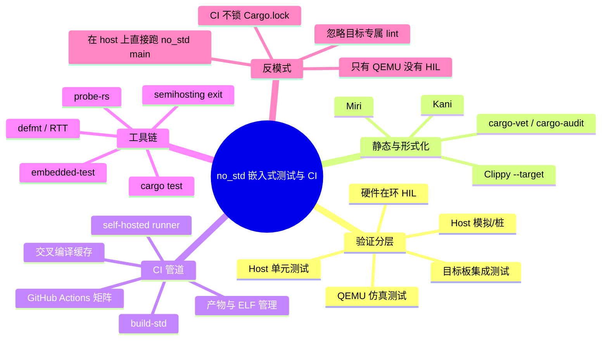
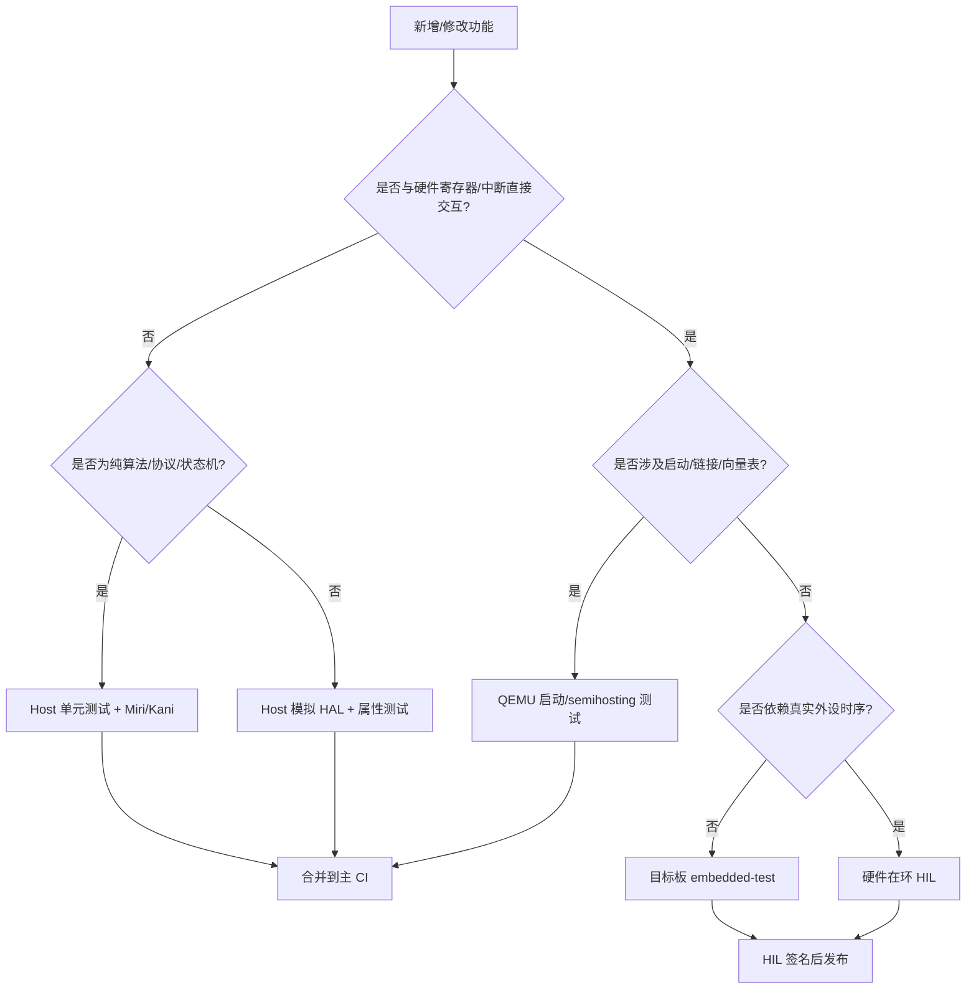

> **内容分级**: [专家级]
> **代码状态**: ✅ 含可编译示例
>
> **定理链**: N/A — 描述性/工程性文档
>
# no_std Rust 嵌入式测试与 CI 策略
>
> **EN**: Embedded Testing and CI Strategies for no_std Rust
> **Summary**: A practical guide to testing and continuous integration strategies for no_std Rust, spanning host-side unit tests, QEMU emulation, hardware-in-the-loop, static verification, and CI pipeline design.
> **Rust 版本**: 1.97.1+ (Edition 2024)
>
> **受众**: [进阶/专家]
> **Bloom 层级**: L5
> **权威来源**: 本文件为 `concept/` 权威页。
> **A/S/P 标记**: **A+P** — Application + Procedure
> **双维定位**: P×App — 将测试与 CI 策略应用于 no_std 嵌入式项目
> **定位**: 系统梳理 `#![no_std]` 嵌入式项目的验证分层——如何在 host 上快速回归、如何在 QEMU 中仿真启动与外设、如何在真实芯片上做硬件在环（HIL）测试、如何把 Miri / Kani / cargo-vet 等静态/供应链工具嵌入 CI，并给出可落地的 GitHub Actions 矩阵与决策流程。
> **前置概念**:
> [Rust 嵌入式系统开发](03_embedded_systems.md) ·
> [交叉编译：多目标平台支持与条件编译](02_cross_compilation.md) ·
> [`#![no_std]` 与裸机编程惯用法](23_no_std_and_bare_metal_idioms.md) ·
> [嵌入式调试与日志](20_embedded_debugging_logging.md) ·
> [DevOps 与 CI/CD：Rust 的持续交付工程实践](../00_toolchain/03_devops_and_ci_cd.md) ·
> [测试生态：单元测试、集成测试与验证策略](../09_testing_and_quality/03_testing.md)
> **后置概念**:
> [安全关键嵌入式 Rust 指南：MISRA-Rust、Ferrocene 与 IEC 61508](30_misra_rust_safety_critical_guidelines.md) ·
> [嵌入式 RTOS 与安全关键框架对比](26_embedded_rtos_and_safety_critical_frameworks.md) ·
> [嵌入式内存布局与堆安全](29_embedded_memory_layout_and_heap_safety.md)

---

> **来源**:
> [The Embedded Rust Book](https://docs.rust-embedded.org/book/) ·
> [The Embedonomicon](https://docs.rust-embedded.org/embedonomicon/) ·
> [Rust Reference — Testing](https://doc.rust-lang.org/reference/attributes/testing.html) ·
> [Cargo Book — cargo test](https://doc.rust-lang.org/cargo/commands/cargo-test.html) ·
> [Rust API Guidelines](https://rust-lang.github.io/api-guidelines/) ·
> [embedded-test](https://github.com/probe-rs/embedded-test) ·
> [probe-rs](https://probe.rs/) ·
> [defmt](https://defmt.ferrous-systems.com/) ·
> [Knurling](https://knurling.ferrous-systems.com/) ·
> [Miri](https://github.com/rust-lang/miri) ·
> [Kani](https://github.com/model-checking/kani) ·
> [cargo-vet](https://github.com/mozilla/cargo-vet) ·
> [cargo-audit](https://github.com/RustSec/rustsec) ·
> [Ferrocene](https://ferrocene.dev/) ·
> [Rust RFC 2318 — Custom Test Frameworks](https://rust-lang.github.io/rfcs/2318-custom-test-frameworks.html) ·
> [Jung et al. — RustBelt: Securing the Foundations of Rust](https://plv.mpi-sws.org/rustbelt/popl18/) ·
> [A Survey of Rust Embedded Development (arXiv)](https://arxiv.org/abs/2311.05063)

---

## 🧠 知识结构图



## 📑 目录

- [no\_std Rust 嵌入式测试与 CI 策略](#no_std-rust-嵌入式测试与-ci-策略)
  - [🧠 知识结构图](#-知识结构图)
  - [📑 目录](#-目录)
  - [一、权威定义：嵌入式测试金字塔](#一权威定义嵌入式测试金字塔)
  - [二、测试策略属性矩阵](#二测试策略属性矩阵)
  - [三、Host 侧单元测试：拆分纯算法](#三host-侧单元测试拆分纯算法)
    - [3.1 设计原则](#31-设计原则)
    - [3.2 可编译示例](#32-可编译示例)
    - [3.3 用 trait 隔离硬件边界](#33-用-trait-隔离硬件边界)
  - [四、目标板测试：embedded-test 与自定义 harness](#四目标板测试embedded-test-与自定义-harness)
    - [4.1 embedded-test 定位](#41-embedded-test-定位)
    - [4.2 自定义 test harness（实验性）](#42-自定义-test-harness实验性)
  - [五、QEMU 仿真层：零硬件回归](#五qemu-仿真层零硬件回归)
    - [5.1 适用场景](#51-适用场景)
    - [5.2 QEMU + semihosting exit 工作流](#52-qemu--semihosting-exit-工作流)
  - [六、硬件在环 CI 与自托管 Runner](#六硬件在环-ci-与自托管-runner)
    - [6.1 为什么需要 HIL](#61-为什么需要-hil)
    - [6.2 自托管 GitHub Actions Runner 布局](#62-自托管-github-actions-runner-布局)
    - [6.3 HIL 工作流关键实践](#63-hil-工作流关键实践)
    - [6.4 HIL 与主 CI 的触发策略](#64-hil-与主-ci-的触发策略)
  - [七、静态验证与供应链门禁](#七静态验证与供应链门禁)
    - [7.1 Miri](#71-miri)
    - [7.2 Kani](#72-kani)
    - [7.3 Clippy 与目标 lint](#73-clippy-与目标-lint)
    - [7.4 供应链门禁](#74-供应链门禁)
  - [八、CI 工作流示例](#八ci-工作流示例)
  - [九、反例与失效模式](#九反例与失效模式)
    - [9.1 反例：在 `#![no_std]` 中直接依赖 `std`](#91-反例在-no_std-中直接依赖-std)
    - [9.2 失效模式矩阵](#92-失效模式矩阵)
  - [十、决策树：选择验证层级](#十决策树选择验证层级)
  - [十一、与国际权威来源的对齐](#十一与国际权威来源的对齐)
  - [十二、相关概念](#十二相关概念)
  - [十三、权威来源索引](#十三权威来源索引)

---

## 一、权威定义：嵌入式测试金字塔

**嵌入式测试金字塔**将验证成本与保真度分层：越靠近底层，运行越快、越便宜、越稳定；越靠近顶层，越接近真实硬件与时序，但成本与抖动也越高。

| 层级 | 名称 | 运行环境 | 核心目标 | 典型工具 |
|:---|:---|:---|:---|:---|
| L1 | Host 单元测试 | `x86_64-unknown-linux-gnu` | 纯算法、状态机、解析器正确性 | `cargo test`, `proptest` |
| L2 | Host 集成 / 模拟 | Host + trait stub | HAL 边界行为、协议逻辑 | `mockall`, 自定义 stub |
| L3 | 仿真测试 | QEMU / renode | 启动流程、中断向量、 semihosting exit | `qemu-system-arm`, `cortex-m-semihosting` |
| L4 | 目标板集成测试 | 真实 MCU，probe-rs | HAL/BSP 配置、外设交互 | `embedded-test`, `probe-rs` |
| L5 | 硬件在环 (HIL) | 真实 PCB + 仪器 | 端到端时序、电源、传感器、总线 | self-hosted runner, 示波器/逻辑分析仪 |
| L6 | 静态/形式化验证 | 编译期 / 模型检验 | UB、内存安全、规格满足 | Miri, Kani, `clippy --target` |

> **判定依据**：一个 `#![no_std]` 项目若只停留在 L1，则无法保证链接脚本、启动代码、中断延迟与真实外设行为；若只停留在 L4/L5，则迭代速度极慢且硬件可用性会阻塞 CI。健康的策略是**每层都有回归，问题在最早、最便宜的层级捕获**。

---

## 二、测试策略属性矩阵

| 策略 | 速度 | 保真度 | 硬件依赖 | 稳定性 | CI 适用性 | 主要风险 |
|:---|:---:|:---:|:---:|:---:|:---:|:---|
| Host 单元测试 | ⚡⚡⚡ | ⭐ | 无 | 高 | ✅ 主 CI | 无法覆盖目标 ABI/对齐/Endian |
| Host 模拟 HAL | ⚡⚡ | ⭐⭐ | 无 | 中高 | ✅ 主 CI | stub 与真实硬件行为漂移 |
| QEMU 仿真 | ⚡ | ⭐⭐⭐ | 无 | 中 | ✅ 主 CI | 不建模 errata / 外设时序 |
| 目标板测试 | 🐢 | ⭐⭐⭐⭐ | 需调试器+目标板 | 中低 | ⚠️ 硬件队列 | 调试器连接、板子状态、并发烧录 |
| HIL | 🐢🐢 | ⭐⭐⭐⭐⭐ | 需完整系统 | 低 | ⚠️ 自托管 runner | 硬件故障、固件变砖、供电抖动 |
| Miri / Kani | ⚡⚡ | ⭐⭐ (逻辑) | 无 | 高 | ✅ 主 CI（每日构建版） | 只覆盖 unsafe / 规格化代码，不能替代系统测试 |

> **关键洞察**：L1–L3 用于**快速反馈与回归**，L4–L5 用于**验收与发布签名**，L6 用于**关键 unsafe / 协议不变量**。

---

## 三、Host 侧单元测试：拆分纯算法

### 3.1 设计原则

- 把与硬件无关的逻辑（协议编解码、校验和、状态机、控制算法）放到独立的 crate 或模块中。
- 使用 `#![cfg_attr(not(test), no_std)]`：测试构建时使用 `std` 默认 harness，发布构建时使用 `no_std`。
- 避免在纯算法模块中直接依赖 `cortex_m` 等目标专属 crate；需要时通过 trait 抽象。

### 3.2 可编译示例

以下 crate 在 host 上可直接 `cargo test` 通过，同时保持非测试构建为 `#![no_std]`：

```rust
//! no_std-compatible library with host-runnable unit tests.
//! Under `cfg(test)` the crate is built as a normal std crate so the default
//! test harness can run; in firmware builds `no_std` is enabled.

#![cfg_attr(not(test), no_std)]

/// Compute a simple checksum using only `core` operations.
pub fn checksum(data: &[u8]) -> u8 {
    data.iter().fold(0u8, |a, &b| a.wrapping_add(b))
}

/// Parse a tiny fixed-length frame header. Returns `None` if the magic is wrong.
pub fn parse_header(buf: &[u8; 4]) -> Option<u8> {
    if buf[0] == 0xAA && buf[1] == 0x55 {
        Some(buf[3])
    } else {
        None
    }
}

#[cfg(test)]
mod tests {
    use super::*;

    #[test]
    fn empty_checksum_is_zero() {
        assert_eq!(checksum(&[]), 0);
    }

    #[test]
    fn checksum_wraps_on_overflow() {
        assert_eq!(checksum(&[u8::MAX, 1]), 0);
    }

    #[test]
    fn valid_header_parsed() {
        assert_eq!(parse_header(&[0xAA, 0x55, 0x00, 0x07]), Some(7));
    }

    #[test]
    fn invalid_header_returns_none() {
        assert_eq!(parse_header(&[0x00, 0x00, 0x00, 0x07]), None);
    }
}
```

> **工程价值**：这个模式把“可测试性”变成架构约束。算法层在 host 上以秒级反馈运行；HAL 层通过 trait 边界与算法层隔离，减少目标板测试负担。 [💡 原创实现](../../00_meta/00_framework/methodology.md)

### 3.3 用 trait 隔离硬件边界

```rust,ignore
// 纯算法 crate：不依赖具体 UART，只依赖 trait
pub trait Sensor {
    type Error;
    fn read(&mut self) -> Result<u16, Self::Error>;
}

pub fn average<S: Sensor>(sensor: &mut S, samples: usize) -> Result<u16, S::Error> {
    let mut sum = 0u32;
    for _ in 0..samples {
        sum += u32::from(sensor.read()?);
    }
    Ok((sum / samples as u32) as u16)
}

#[cfg(test)]
mod tests {
    use super::*;

    struct FakeSensor(Vec<u16>);
    impl Sensor for FakeSensor {
        type Error = ();
        fn read(&mut self) -> Result<u16, ()> {
            self.0.pop().ok_or(())
        }
    }

    #[test]
    fn average_of_two() {
        let mut s = FakeSensor(vec![20, 10]);
        assert_eq!(average(&mut s, 2).unwrap(), 15);
    }
}
```

> **注意**：上面的测试模块使用 `Vec`，因此只在 `cfg(test)` 下编译；发布构建中 `#![no_std]` 会拒绝 `std::vec::Vec`。

---

## 四、目标板测试：embedded-test 与自定义 harness

### 4.1 embedded-test 定位

`embedded-test` 把标准库的 `#[test]` 宏替换为 `no_std` 版本，通过 probe-rs 把测试二进制烧录到目标后收集结果。它适合 L4 目标板集成测试。

```rust,ignore
// tests/on_target.rs
#![no_std]
#![no_main]

use embedded_test::fixtures;

#[embedded_test::tests]
mod tests {
    #[init]
    fn init() {
        // 初始化时钟、HAL
    }

    #[test]
    fn gpio_set_and_read() {
        let p = hal::Peripherals::take().unwrap();
        let mut led = hal::gpio::Output::new(p.PA5, hal::gpio::Level::Low);
        led.set_high();
        assert!(led.is_set_high());
    }
}
```

.cargo/config.toml 需要把 runner 指向 probe-rs，并为目标启用 `build-std`；具体 target runner、`-Z build-std` 与链接脚本配置参见 [`no_std` 与裸机编程惯用法](23_no_std_and_bare_metal_idioms.md)。

> 详细调试/日志工具链对比见 [嵌入式调试与日志](20_embedded_debugging_logging.md)。

### 4.2 自定义 test harness（实验性）

Rust 提供“自定义测试框架”能力（`custom_test_frameworks`），但该特性仍在 Rust 每日构建版中，需要 `feature` 门控。生产项目更推荐 `embedded-test`，因为它在稳定版 Rust 上工作，并封装了 runner、fixtures、RTT/semihosting 结果回传。

---

## 五、QEMU 仿真层：零硬件回归

### 5.1 适用场景

- 没有真实硬件的 CI 环境；
- 验证启动代码、向量表、链接脚本；
- 运行依赖 semihosting exit 的测试镜像。

### 5.2 QEMU + semihosting exit 工作流

```bash
# 构建测试镜像（cortex-m-quickstart 风格）
cargo build --target thumbv6m-none-eabi --release

# 在 QEMU 中运行并自动退出
qemu-system-arm -machine micro:bit -semihosting \
  -kernel target/thumbv6m-none-eabi/release/app
```

在 Rust 代码中通过 `cortex-m-semihosting::debug::exit` 报告成功或失败：

```rust,ignore
use cortex_m_semihosting::debug;

fn main() -> ! {
    let ok = run_tests();
    if ok {
        debug::exit(debug::EXIT_SUCCESS);
    } else {
        debug::exit(debug::EXIT_FAILURE);
    }
}
```

> **判定依据**：QEMU 适合**功能级回归**，但不精确建模外设时序、cache、硬件 errata。它不能替代真实硬件测试。 [来源: QEMU 官方文档](https://www.qemu.org/docs/master/)

---

## 六、硬件在环 CI 与自托管 Runner

### 6.1 为什么需要 HIL

- 真实传感器、总线、电源、温度、PCB 布局只有在物理硬件上才会暴露问题；
- QEMU 和 stub 无法复现硬件 errata、DMA cache 一致性、欠压复位等故障；
- 发布前的最终签名必须在目标硬件上完成。

### 6.2 自托管 GitHub Actions Runner 布局

```text
HIL CI 节点:
├── 运行 GitHub Actions self-hosted runner 的 Linux host
├── 一个或多个 MCU 板卡，固定在防静电夹具上
├── 调试器：CMSIS-DAP / ST-Link / J-Link
├── 电源控制：可远程开关或复位的 USB relay
└── 串口/逻辑分析仪：用于断言外部时序
```

### 6.3 HIL 工作流关键实践

| 实践 | 说明 |
|:---|:---|
| 串行化烧录 | 同一 runner 上的多个板卡不能同时占用同一 probe；使用队列或独立 runner 标签 |
| 可远程复位 | 板卡 panic 或固件变砖时，通过 relay 断电/上电恢复 |
| 产物绑定 | ELF、测试日志、板卡序列号、固件版本一并归档，便于追溯 |
| 基线对比 | 记录功耗、启动时间、堆栈高水位等度量，检测回归 |
| 失败隔离 | 对每块板卡单独标记 `fail-board-0`、`fail-board-1`，快速定位硬件问题 |

### 6.4 HIL 与主 CI 的触发策略

```yaml
# .github/workflows/hil.yml 片段
on:
  push:
    branches: [main]
  workflow_dispatch:

jobs:
  hil:
    runs-on: [self-hosted, hil-lab-a]
    steps:
      - uses: actions/checkout@v4
      - name: Build firmware
        run: cargo build --release --target thumbv7em-none-eabihf
      - name: Run HIL tests
        run: ./scripts/hil_run.sh --target thumbv7em-none-eabihf
      - name: Archive artifacts
        uses: actions/upload-artifact@v4
        with:
          name: firmware-hil-${{ github.sha }}
          path: target/thumbv7em-none-eabihf/release/app
```

---

## 七、静态验证与供应链门禁

### 7.1 Miri

[Miri](https://github.com/rust-lang/miri) 在 host 上解释执行 Rust MIR，可检测未定义行为（UB）。对 `#![no_std]` 项目中的 `unsafe` MMIO、指针运算、transmute 尤其有价值。

```bash
# 解释执行 host 测试，检查 UB；channel 需使用 Rust 每日构建版
MIRIFLAGS="-Zmiri-disable-isolation" cargo +<channel> miri test
```

> **限制**：Miri 不能执行目标三元组代码；它只能验证 host 可编译的 unsafe 逻辑。因此需要把关键 unsafe 代码抽象成 host 可测单元。Miri 目前只能随 Rust 每日构建版工具链使用。

### 7.2 Kani

[Kani](https://github.com/model-checking/kani) 是面向 Rust 的模型检验器，适合验证协议状态机、循环不变量、边界条件。

```bash
cargo kani --harness my_protocol_invariant
```

> **限制**：Kani 目前对 `no_std` 目标与内联汇编支持有限；建议把要验证的逻辑放到 host crate 中，通过 `#[cfg(kani)]` 门控 harness。

### 7.3 Clippy 与目标 lint

```bash
# 以目标平台跑 clippy，捕获目标专属 lint
cargo clippy --target thumbv7em-none-eabihf -- -D warnings
```

### 7.4 供应链门禁

| 工具 | 作用 | CI 位置 |
|:---|:---|:---|
| `cargo audit` | 检测 RUSTSEC 漏洞 | PR / main |
| `cargo vet` | 审计 crate 供应链信任 | PR / main |
| `cargo deny` | 许可证/禁止 crate 策略 | PR |
| `cargo tree` | 依赖可视化与重复检测 | 定期报告 |

---

## 八、CI 工作流示例

下面是一个完整的 `.github/workflows/ci.yml`，覆盖 L1–L3 与静态验证：

```yaml
name: CI

on:
  push:
    branches: [main]
  pull_request:

env:
  CARGO_TERM_COLOR: always

jobs:
  host-tests:
    runs-on: ubuntu-latest
    steps:
      - uses: actions/checkout@v4
      - uses: dtolnay/rust-toolchain@stable
      - uses: Swatinem/rust-cache@v2
      - run: cargo test --workspace
      - run: cargo clippy --workspace -- -D warnings
      - run: cargo fmt --check

  target-build:
    runs-on: ubuntu-latest
    strategy:
      matrix:
        target: [thumbv7em-none-eabihf, riscv32imac-unknown-none-elf]
    steps:
      - uses: actions/checkout@v4
      - uses: dtolnay/rust-toolchain@stable
        with:
          targets: ${{ matrix.target }}
      - uses: Swatinem/rust-cache@v2
      - name: Add daily-build toolchain for build-std
        run: rustup toolchain install <channel>
      - name: Build firmware
        run: cargo +<channel> build --target ${{ matrix.target }} -Z build-std=core,compiler_builtins
        env:
          RUSTFLAGS: "-C link-arg=-Tlink.x"

  qemu-tests:
    runs-on: ubuntu-latest
    steps:
      - uses: actions/checkout@v4
      - uses: dtolnay/rust-toolchain@stable
        with:
          targets: thumbv6m-none-eabi
      - run: sudo apt-get install -y qemu-system-arm
      - run: cargo build --target thumbv6m-none-eabi --example qemu_smoke
      - run: |
          qemu-system-arm -machine micro:bit -semihosting \
            -kernel target/thumbv6m-none-eabi/debug/examples/qemu_smoke

  miri:
    runs-on: ubuntu-latest
    steps:
      - uses: actions/checkout@v4
      - uses: dtolnay/rust-toolchain@master
        with:
          toolchain: <channel>
          components: miri
      - run: MIRIFLAGS="-Zmiri-disable-isolation" cargo miri test

  audit:
    runs-on: ubuntu-latest
    steps:
      - uses: actions/checkout@v4
      - uses: rustsec/audit-check@v1
```

> **要点**：
>
> - `host-tests` 使用稳定工具链，`target-build` 与 `qemu-tests` 使用 `build-std`；
> - `rust-cache` 缓存 `target/` 与 registry，避免 CI 冷启动；
> - Miri 与 audit 使用每日构建版/独立 action，避免阻塞主构建。

---

## 九、反例与失效模式

### 9.1 反例：在 `#![no_std]` 中直接依赖 `std`

```rust,compile_fail,E0433
#![no_std]

// ❌ 错误：no_std 中 std 路径不可用
pub fn bad_vec() -> std::vec::Vec<u8> {
    std::vec::Vec::new()
}
```

> **修正**：使用 `heapless::Vec` 或在 `cfg(test)` 下使用 `std`。

### 9.2 失效模式矩阵

| 失效模式 | 根因 | 修复方向 |
|:---|:---|:---|
| Host 测试全过，上板 HardFault | 未验证目标 ABI / 对齐 / 启动代码 | 增加 target-build 与 QEMU 启动测试 |
| QEMU 测试全过，真实硬件失败 | QEMU 未建模外设时序或 errata | 保留 L4/L5 HIL 测试 |
| 测试在本地通过，CI 失败 | `Cargo.lock` 未提交或工具链版本不一致 | 提交 `Cargo.lock`，使用 `rust-toolchain.toml` |
| Miri 误报 / 无法运行 | Miri 不支持目标三元组或内联汇编 | 把 unsafe 逻辑抽到 host crate |
| HIL 测试不稳定 | 板卡电源、调试器接触不良 | 增加远程复位、板卡健康检查、重试策略 |
| CI 构建时间随目标数线性爆炸 | 每个 target 重新编译所有依赖 | 使用 `rust-cache`、分层 job、共享 sccache |
| 安全漏洞进入发布 | 未在 CI 中运行 `cargo audit`/`cargo vet` | 在 PR 门禁中加入供应链检查 |
| 产物 ELF 与烧录固件版本不一致 | 未把 ELF 作为 artifact 保留 | CI 中上传 ELF，HIL 使用同一 artifact |

---

## 十、决策树：选择验证层级



> **使用方式**：对每个功能变更，从根节点出发选择第一个命中层级，并确保所有上层门禁也已通过。例如，即使必须做 HIL，也应先通过 Host 测试与 QEMU 测试。

---

## 十一、与国际权威来源的对齐

| 主题 | 本文件立场 | 国际来源映射 |
|:---|:---|:---|
| `#[cfg(test)]` 与 `no_std` 共存 | 使用 `cfg_attr(not(test), no_std)` 让 host 测试复用默认 harness | [Rust Reference — Conditional Compilation](https://doc.rust-lang.org/reference/conditional-compilation.html) · [Cargo Book — Tests](https://doc.rust-lang.org/cargo/commands/cargo-test.html) |
| 测试组织 | 嵌入式项目仍适用单元/集成/文档测试分层，但需额外增加目标板与 HIL 层 | [Rust API Guidelines — Testing](https://rust-lang.github.io/api-guidelines/documentation.html#c-testing) · [The Embedded Rust Book — Testing](https://docs.rust-embedded.org/book/) |
| 目标板测试 | `embedded-test` 是 probe-rs 生态的当前推荐方案 | [embedded-test README](https://github.com/probe-rs/embedded-test) · [probe.rs docs](https://probe.rs/) |
| QEMU 仿真 | 用于零硬件回归，但不能替代真实硬件 | [QEMU official docs](https://www.qemu.org/docs/master/) · [The Embedded Rust Book — QEMU](https://docs.rust-embedded.org/book/start/qemu.html) |
| Miri / Kani | 用于 host 可编译的 unsafe / 规格验证 | [Miri README](https://github.com/rust-lang/miri) · [Kani book](https://model-checking.github.io/kani/) |
| 供应链安全 | `cargo audit` / `cargo vet` 是 Rust 生态事实标准 | [RUSTSEC](https://rustsec.org/) · [cargo-vet docs](https://mozilla.github.io/cargo-vet/) |
| 安全关键流程 | HIL 与发布签名对齐 IEC 61508 / DO-178C 的“硬件代表性测试”要求 | [Ferrocene Language Specification](https://spec.ferrocene.dev/) · [MISRA Rust guidelines](https://misra.org.uk/) |

> **判定依据**：本文件的所有技术选择均能在上述 P0/P1/P2 来源中找到对应规范或工具文档；不存在与官方语义冲突的原创主张。

---

## 十二、相关概念

- [Rust 嵌入式系统开发](03_embedded_systems.md)
- [交叉编译：多目标平台支持与条件编译](02_cross_compilation.md)
- [`#![no_std]` 与裸机编程惯用法](23_no_std_and_bare_metal_idioms.md)
- [嵌入式调试与日志](20_embedded_debugging_logging.md)
- [安全关键嵌入式 Rust 指南：MISRA-Rust、Ferrocene 与 IEC 61508](30_misra_rust_safety_critical_guidelines.md)
- [DevOps 与 CI/CD：Rust 的持续交付工程实践](../00_toolchain/03_devops_and_ci_cd.md)
- [测试生态：单元测试、集成测试与验证策略](../09_testing_and_quality/03_testing.md)
- [Unsafe Rust](../../03_advanced/02_unsafe/01_unsafe.md)
- [形式化方法](../../04_formal/00_type_theory/01_type_theory.md)
- [Rust vs C++：系统语言对比](../../05_comparative/01_systems_languages/01_rust_vs_cpp.md)

---

## 十三、权威来源索引

- **P0 官方来源**:
  - [Rust Reference — Testing attributes](https://doc.rust-lang.org/reference/attributes/testing.html)
  - [Cargo Book — cargo test](https://doc.rust-lang.org/cargo/commands/cargo-test.html)
  - [Rust API Guidelines](https://rust-lang.github.io/api-guidelines/)
  - [The Embedded Rust Book](https://docs.rust-embedded.org/book/)
  - [The Embedonomicon](https://docs.rust-embedded.org/embedonomicon/)
  - [Rust RFC 2318 — Custom Test Frameworks](https://rust-lang.github.io/rfcs/2318-custom-test-frameworks.html)

- **P1 学术来源**:
  - [Jung et al. — RustBelt: Securing the Foundations of Rust](https://plv.mpi-sws.org/rustbelt/popl18/)
  - [A Survey of Rust Embedded Development (arXiv)](https://arxiv.org/abs/2311.05063)

- **P2 生态来源**:
  - [embedded-test](https://github.com/probe-rs/embedded-test)
  - [probe-rs](https://probe.rs/)
  - [defmt](https://defmt.ferrous-systems.com/)
  - [Knurling](https://knurling.ferrous-systems.com/)
  - [Miri](https://github.com/rust-lang/miri)
  - [Kani](https://github.com/model-checking/kani)
  - [cargo-vet](https://github.com/mozilla/cargo-vet)
  - [cargo-audit / RUSTSEC](https://github.com/RustSec/rustsec)
  - [Ferrocene](https://ferrocene.dev/)
  - [QEMU](https://www.qemu.org/)

> **文档版本**: 1.0 ｜ **最后更新**: 2026-08-03 ｜ **状态**: ✅ 新建（Rust 1.97.1 对齐）
