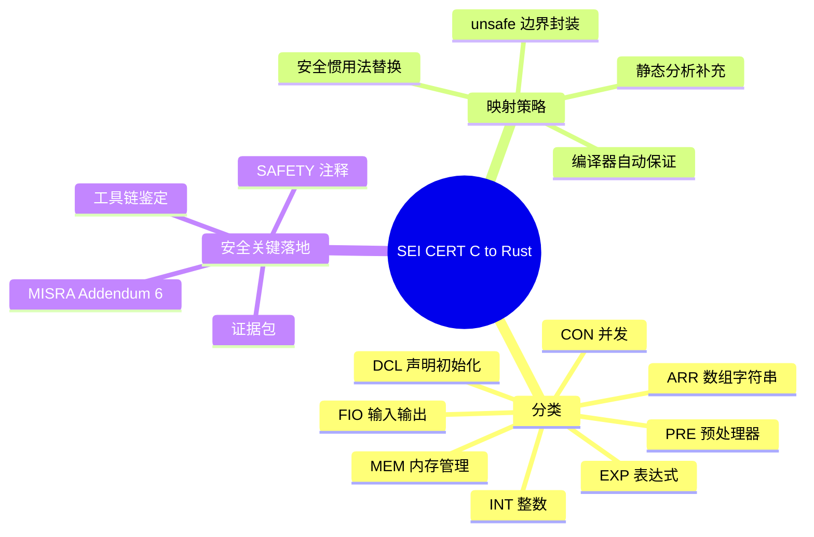
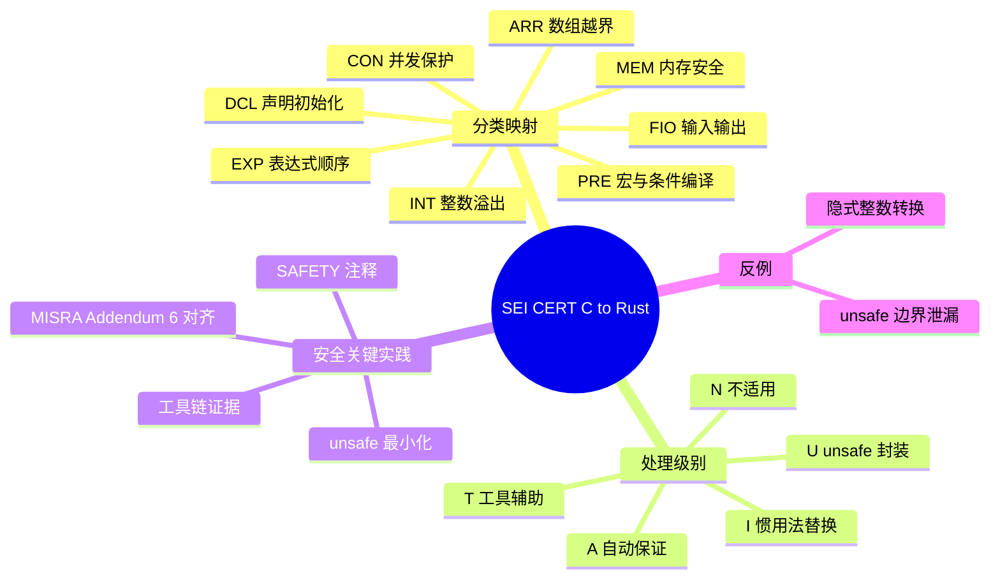

> **内容分级**: [专家级]
> **代码状态**: ⚠️ 含标准库可编译示例与 `rust,ignore` 嵌入式/unsafe 片段
> **定理链**: N/A — 标准映射/工程性文档
>
# SEI CERT C → Rust 规则映射
>
> **EN**: SEI CERT C to Rust Rule Mapping
> **Summary**: Maps SEI CERT C coding-standard rules to safe Rust idioms, unsafe mitigations, and safety-critical adoption notes.
> **Rust 版本**: 1.97.0+ (Edition 2024)
>
> **受众**: [进阶]
> **Bloom 层级**: L3
> **权威来源**: 本文件为 `concept/` 权威页。
> **A/S/P 标记**: **S+A+P** — Structure + Application + Procedure
> **双维定位**: C×Eva — 比较 SEI CERT C 规则与 Rust 语言保证，评估安全关键迁移中的映射策略
> **前置概念**: [C-to-Rust Translation Ecosystem](08_c_to_rust_translation.md) ·
> [MISRA-Rust and Safety-Critical Embedded Guidelines](30_misra_rust_safety_critical_guidelines.md) ·
> [Unsafe Rust](../../03_advanced/02_unsafe/01_unsafe.md) ·
> [FFI Advanced](../../03_advanced/04_ffi/02_ffi_advanced.md)
> **后置概念**: [Embedded RTOS and Safety-Critical Frameworks](26_embedded_rtos_and_safety_critical_frameworks.md) ·
> [Safety-Critical Bare-Metal OS](19_safety_critical_bare_metal_os.md)
>
> **来源**: [SEI CERT C Coding Standard](https://wiki.sei.cmu.edu/confluence/display/c/SEI+CERT+C+Coding+Standard) ·
> [Rust Reference — Unsafe Rust](https://doc.rust-lang.org/reference/unsafe.html) ·
> [The Rustonomicon](https://doc.rust-lang.org/nomicon/) ·
> [Rust Safety-Critical Rust Consortium](https://rustfoundation.org/safety-critical-rust-consortium/) ·
> [Ferrous Systems — Safety-Critical Rust](https://ferrous-systems.com/safety-critical-rust/) ·
> [MISRA C:2025 Addendum 6](../../../content/safety_critical/10_standards/04_misra_c_2025_addendum_6_guide.md)
>
> **横向对比**: [Rust vs Ada/SPARK](../../05_comparative/01_systems_languages/07_rust_vs_ada_spark.md)

---

## 🧠 知识结构图



## 📑 目录

- [SEI CERT C → Rust 规则映射](#sei-cert-c--rust-规则映射)
  - [🧠 知识结构图](#-知识结构图)
  - [📑 目录](#-目录)
  - [一、权威定义](#一权威定义)
  - [二、SEI CERT C 分类概览](#二sei-cert-c-分类概览)
  - [三、高影响力规则映射矩阵](#三高影响力规则映射矩阵)
  - [四、按类别详细映射](#四按类别详细映射)
    - [4.1 预处理器（PRE）](#41-预处理器pre)
    - [4.2 声明与初始化（DCL）](#42-声明与初始化dcl)
    - [4.3 表达式（EXP）](#43-表达式exp)
    - [4.4 整数运算（INT）](#44-整数运算int)
    - [4.5 数组与字符串（ARR）](#45-数组与字符串arr)
    - [4.6 内存管理（MEM）](#46-内存管理mem)
    - [4.7 输入输出（FIO）](#47-输入输出fio)
    - [4.8 并发（CON）](#48-并发con)
  - [五、unsafe 边界与缓解策略](#五unsafe-边界与缓解策略)
  - [六、判定矩阵：SEI 规则 → Rust 处理级别](#六判定矩阵sei-规则--rust-处理级别)
  - [七、安全关键落地清单](#七安全关键落地清单)
  - [八、反例与陷阱](#八反例与陷阱)
    - [反例：隐式整数转换导致信息丢失](#反例隐式整数转换导致信息丢失)
    - [✅ 修正：显式窄化转换并检查范围](#-修正显式窄化转换并检查范围)
    - [反例：unsafe 边界未封装](#反例unsafe-边界未封装)
    - [✅ 修正：封装为类型安全 HAL](#-修正封装为类型安全-hal)
  - [九、相关概念](#九相关概念)
  - [🧭 思维导图（Mindmap）](#-思维导图mindmap)

---

## 一、权威定义

> **SEI CERT C Coding Standard**: A set of guidelines for secure coding in the C programming language, organized by rule categories and priority levels, intended to eliminate security vulnerabilities resulting from coding errors.

**SEI CERT C → Rust 规则映射**：将 SEI CERT C 编码标准中的规则按类别映射到 Rust 语言机制、惯用法或工程缓解措施的系统化工作。Rust 的所有权、借用检查、类型系统和 `unsafe` 边界机制能够消除大量 C 规则所针对的根因，但部分涉及硬件访问、FFI 或性能关键路径的规则仍需显式安全论证。

判定依据：映射工作必须同时回答三个问题：(1) 原规则在 Rust 中是否仍可能发生；(2) Rust 是否能在编译期或运行期自动阻止；(3) 若无法自动阻止，应使用何种工程实践或工具补充。

---

## 二、SEI CERT C 分类概览

SEI CERT C 标准按主题将规则划分为以下主要类别（安全关键迁移中高频出现的是 DCL、EXP、INT、ARR、MEM、FIO、CON）：

| 类别 | 全称 | Rust 映射特点 |
|:---|:---|:---|
| **PRE** | Preprocessor | Rust 宏是卫生（hygienic）且类型感知的，条件编译由 `cfg` 在类型系统之后处理 |
| **DCL** | Declarations and Initialization | Rust 禁止未初始化变量、强制模式穷尽、常量默认不可变 |
| **EXP** | Expressions | Rust 表达式求值顺序确定、无序列点陷阱、无隐式类型提升 |
| **INT** | Integers | 显式转换、溢出检查可选、提供 `checked_*` / `wrapping_*` / `saturating_*` 家族 |
| **FLP** | Floating Point | `f32`/`f64` 遵循 IEEE-754；需关注 `NaN` 比较与 `PartialOrd` |
| **ARR** | Arrays and Strings | 切片长度与类型绑定、`str` 保证 UTF-8；裸指针算术需 `unsafe` |
| **MEM** | Memory Management | 所有权 + `Drop` 消除 use-after-free、double-free、内存泄漏需额外注意 |
| **FIO** | Input Output | `std::io`/`core::fmt` 类型安全，但 FFI 文件描述符仍需封装 |
| **ENV** | Environment | `std::env` 提供封装，安全关键系统通常避免动态环境变量 |
| **SIG** | Signals | 裸机中断模型见 [中断异常模型](14_interrupt_and_exception_model.md)；避免在信号处理中执行复杂逻辑 |
| **ERR** | Error Handling | `Result<T, E>` 替代错误码 + `errno`，强制处理失败路径 |
| **CON** | Concurrency | `Send`/`Sync` + 借用检查消除数据竞争；临界区需显式设计 |
| **MSC** | Miscellaneous | `rand()` 类函数由 `rand` crate 替代；避免未定义行为依赖 |

> 关键洞察：约 **60–70%** 的 SEI CERT C 规则在 safe Rust 中因语言设计而不再适用或已被编译器保证，剩余部分集中在 `unsafe`、FFI、裸机寄存器访问、整数溢出策略和并发临界区设计。[来源: [SEI CERT C Coding Standard](https://wiki.sei.cmu.edu/confluence/display/c/SEI+CERT+C+Coding+Standard)]

---

## 三、高影响力规则映射矩阵

以下矩阵选取 SEI CERT C 中高风险、高优先级（L1/L2）规则，给出 Rust 等价处理或缓解方式：

| SEI 规则 | 原意 | Rust 等价/缓解 | 是否需要 `unsafe` |
|:---|:---|:---|:---:|
| **PRE00-C** 避免运算符优先级歧义 | 用括号显式分组 | 优先级与 C 类似，但 `rustfmt` + `clippy::precedence` 可辅助 | ❌ |
| **PRE01-C** 宏参数加括号 | 防止宏展开捕获 | Rust 声明宏卫生，proc-macro 需审计展开结果 | ❌ |
| **DCL00-C** 不可变对象加 `const` | 防止意外修改 | `let` 默认不可变；`const` / `static` 显式 | ❌ |
| **DCL30-C** 合适的存储期 | 防止悬挂指针 | 所有权 + 生命周期（Lifetimes） | ❌ |
| **EXP30-C** 不依赖求值顺序 | C 序列点歧义 | Rust 求值顺序确定 | ❌ |
| **EXP33-C** 不引用未初始化内存 | 使用前初始化 | 编译器强制初始化 | ❌ |
| **INT02-C** 理解整数转换 | 隐式转换陷阱 | 必须显式 `as` / `TryFrom` | ❌ |
| **INT30-C** 无符号运算不环绕 | 避免环绕 bug | 默认 debug panic；显式 `wrapping_add` | ❌ |
| **INT32-C** 有符号运算不溢出 | 避免未定义行为 | `checked_add` / `saturating_add` | ❌ |
| **ARR30-C** 不使用越界指针 | 数组越界 | 切片索引运行时检查；`get` 安全 | ❌ |
| **ARR38-C** 指针 ± 整数不跨对象 | 指针算术 UB | 裸指针算术需 `unsafe` + SAFETY 注释 | ⚠️ |
| **MEM30-C** 分配/释放方法一致 | 不匹配的 free | 所有权系统禁止不匹配释放 | ❌ |
| **MEM34-C** 只释放动态内存 | 栈/静态内存 free | `Drop` 自动管理；无手动 free | ❌ |
| **FIO30-C** 用户输入不进入格式串 | 格式串注入 | `format!` 类型安全；动态格式需审计 | ❌ |
| **ENV32-C** `atexit` 处理程序返回 | 清理顺序 | `Drop` + scope guard 模式 | ❌ |
| **ERR30-C** 调用前清零 `errno` | 错误码混淆 | `Result<T, E>` 显式错误传递 | ❌ |
| **CON30-C** 保护共享变量 | 数据竞争 | `Send`/`Sync` + `Mutex`/`critical-section` | ⚠️ |
| **MSC30-C** 不使用 `rand()` | 弱随机性 | `rand::thread_rng` / `getrandom` | ❌ |

---

## 四、按类别详细映射

### 4.1 预处理器（PRE）

C 预处理器宏是文本替换，常引入优先级、副作用和作用域污染。Rust 的宏系统（`macro_rules!`、过程宏）是语法树级别的，且遵守卫生规则。

```rust
// C 风格宏：需要括号防止展开捕获
// #define SQUARE(x) ((x) * (x))

// Rust 声明宏：参数天然按语法树分组
macro_rules! square {
    ($x:expr) => { $x * $x };
}

fn main() {
    let a = square!(1 + 2); // 展开为 (1 + 2) * (1 + 2)，无捕获风险
    println!("{}", a);
}
```

> 判定依据：Rust 宏不会与周围标识符发生文本级冲突，但过程宏展开结果仍需审计， especially when generating `unsafe` blocks.

### 4.2 声明与初始化（DCL）

```rust
fn demo_dcl() {
    let x: i32;          // ❌ 编译错误：可能未初始化
    // println!("{}", x); // E0381 used binding `x` is possibly-uninitialized

    let y = 42;          // ✅ 声明即初始化
    println!("{}", y);
}
```

DCL00-C（const-qualify）在 Rust 中由 `let` 默认不可变覆盖；需要可变时显式 `let mut`。

### 4.3 表达式（EXP）

C 的 `i = i++` 等序列点行为是未定义行为。Rust 表达式求值顺序有明确定义，且编译器会拒绝同一变量在表达式中既借用可变又借用不可变。

```rust,compile_fail,E0506
fn main() {
    let mut i = 0;
    // let v = i + { i += 1; i }; // 可能符合直觉，但 C 的 i++ + i 是 UB
    // Rust 不会允许同一作用域内对 i 的冲突借用出现在表达式中
    let r = &i;
    i += 1; // ❌ 与 r 的不可变借用冲突
    println!("{} {}", r, i);
}
```

### 4.4 整数运算（INT）

Rust 默认在 debug 模式下对整数溢出 panic，release 模式下对 wrapping 做 two's-complement 环绕。安全关键代码应显式选择策略：

```rust
fn safe_add_demo(a: u32, b: u32) -> Result<u32, ()> {
    a.checked_add(b).ok_or(())
}

fn saturating_demo(a: i32, b: i32) -> i32 {
    a.saturating_add(b)
}

fn main() {
    assert_eq!(safe_add_demo(u32::MAX, 1), Err(()));
    assert_eq!(saturating_demo(i32::MAX, 1), i32::MAX);
}
```

> 安全关键建议：对来自外部输入的整数运算统一使用 `checked_*` 并传播 `Result`；只有在已证明不会溢出且性能关键处才使用 `wrapping_*` 并附 SAFETY 注释。

### 4.5 数组与字符串（ARR）

```rust
fn safe_index(data: &[u8], idx: usize) -> Option<u8> {
    data.get(idx).copied() // 越界返回 None，不 panic
}

fn main() {
    let buf = [1u8, 2, 3];
    assert_eq!(safe_index(&buf, 5), None);
    assert_eq!(safe_index(&buf, 1), Some(2));
}
```

ARR38-C（指针 ± 整数不跨对象）在 Rust 中仅能通过裸指针实现，因此天然落入 `unsafe` 边界，必须封装：

```rust,ignore
// SAFETY: offset 在已分配数组范围内，且 result 仍指向同一分配。
unsafe fn offset_within_same_object<T>(base: *const T, count: usize, len: usize) -> Option<*const T> {
    if count > len { return None; }
    Some(base.add(count))
}
```

### 4.6 内存管理（MEM）

Rust 的所有权系统消除了 C 中最危险的内存错误类别。SEI MEM 系列规则在 safe Rust 中大多自动满足：

```rust
fn mem_demo() {
    let s = String::from("hello"); // 分配
    drop(s);                       // 释放
    // println!("{}", s);          // ❌ 编译错误：value used after move
}
```

> 残留风险：`mem::forget`、`ManuallyDrop`、循环引用（`Rc<RefCell>`）导致的逻辑泄漏，以及 `unsafe` 中手动 `alloc`/`dealloc`。

### 4.7 输入输出（FIO）

C 的 `printf(user_input)` 是经典注入漏洞。Rust 的格式化宏是类型安全且编译期解析的：

```rust
fn safe_format(user_input: &str) -> String {
    // 用户输入作为参数传入，不会解析为格式说明符
    format!("user said: {}", user_input)
}

fn main() {
    println!("{}", safe_format("%s%s%s%s"));
}
```

若需动态格式字符串（如从配置读取），必须对格式说明符进行白名单校验。

### 4.8 并发（CON）

Rust 通过 `Send`/`Sync` trait 在编译期阻止数据竞争。CON30-C 的“保护共享变量”映射为选择正确的同步原语：

```rust
use std::sync::{Arc, Mutex};

fn shared_counter() {
    let counter = Arc::new(Mutex::new(0));
    let mut handles = vec![];

    for _ in 0..4 {
        let c = Arc::clone(&counter);
        handles.push(std::thread::spawn(move || {
            let mut n = c.lock().unwrap();
            *n += 1;
        }));
    }

    for h in handles { h.join().unwrap(); }
    assert_eq!(*counter.lock().unwrap(), 4);
}
```

---

## 五、unsafe 边界与缓解策略

当 SEI CERT C 规则对应的行为只能由 `unsafe` 实现时，应采用以下最小化策略：

1. **封装 unsafe 块**：向上层暴露 safe API，unsafe 仅在实现层最小范围使用。
2. **SAFETY 注释**：每个 `unsafe` 块必须说明前置条件、不变量和后置条件。
3. **不变量审计**：对指针有效性、对齐、生命周期、别名规则进行人工审查。
4. **静态分析补充**：使用 `cargo clippy`、`miri`、自定义 lint 捕捉潜在违规。
5. **单元测试与模糊测试**：对 unsafe 边界进行高覆盖测试。

```rust,ignore
/// 将 C 风格 `memcpy(dst, src, n)` 封装为 safe Rust 接口。
///
/// # Safety
/// - `src` 与 `dst` 必须指向至少 `n` 个有效 `u8` 的独立内存区域。
/// - 调用者保证 `dst` 区域可写。
pub unsafe fn copy_bytes(dst: *mut u8, src: *const u8, n: usize) {
    // SAFETY: 前置条件已由调用者保证，且 core::ptr::copy_nonoverlapping 要求不重叠。
    core::ptr::copy_nonoverlapping(src, dst, n);
}
```

---

## 六、判定矩阵：SEI 规则 → Rust 处理级别

| 处理级别 | 含义 | 示例规则 | 所需证据 |
|:---|:---|:---|:---|
| **A — 自动保证** | Rust 编译器/类型系统已消除规则根因 | DCL30, EXP33, MEM30, MEM34 | 语言特性说明 |
| **I — 惯用法替换** | 用 safe Rust 惯用法替代 C 模式 | INT32, ARR30, FIO30, ERR30 | 代码规范、培训 |
| **T — 工具辅助** | 需要 Clippy/MIRI/自定义 lint | PRE01, MSC30, 复杂循环 | lint 配置、CI 输出 |
| **U — unsafe 封装** | 必须用 unsafe 但需最小化封装 | ARR38, 裸机 MMIO, FFI | SAFETY 注释、审计记录 |
| **N — 不适用** | 规则与 Rust 无关 | C 预处理器文本替换陷阱 | 映射说明 |

---

## 七、安全关键落地清单

| 阶段 | 动作 | 证据 |
|:---|:---|:---|
| 规则识别 | 列出项目适用的 SEI CERT C 规则子集 | 规则清单、优先级 |
| 语言映射 | 按 A/I/T/U/N 分类映射 | 映射矩阵 |
| unsafe 审计 | 对 U 类规则编写 SAFETY 注释 | 代码审查记录 |
| 工具配置 | 启用 `clippy::all`、overflow checks、MIRI | CI 配置、报告 |
| MISRA 对齐 | 与 [MISRA C:2025 Addendum 6](../../../content/safety_critical/10_standards/04_misra_c_2025_addendum_6_guide.md) 交叉核对 | 合规声明 |
| 培训 | 对迁移团队进行 Rust 安全子集培训 | 培训记录 |

> 判定依据：SEI CERT C 规则映射不是一次性文档工作，而是与 [MISRA C:2025 Addendum 6](../../../content/safety_critical/10_standards/04_misra_c_2025_addendum_6_guide.md) 互补的持续性活动——前者提供安全编码规则视角，后者提供认证合规视角。两者结合可支撑 IEC 61508 / ISO 26262 的安全案例。

---

## 八、反例与陷阱

| 失效模式 | 根因 | 后果 |
|:---|:---|:---|
| 认为所有 C 规则在 Rust 中自动消失 | 忽视 `unsafe`、FFI、整数溢出策略 | 安全案例不完整 |
| 在 unsafe 块中不写 SAFETY 注释 | 无法向审核方证明正确性 | 认证失败 |
| 用 `as` 做整数转换而不检查范围 | 丢失信息的转换可能引入逻辑错误 | 运行时故障 |
| 在裸机中混用 safe 与 unsafe 代码无边界 | unsafe 泄漏到上层 | 借用检查器保护范围缩小 |
| 未启用 `overflow-checks` 即宣称无整数溢出 | release 模式下环绕静默发生 | 虚假安全声明 |

### 反例：隐式整数转换导致信息丢失

```rust,compile_fail,E0308
fn main() {
    let x: u32 = 300;
    let y: u8 = x; // ❌ 编译错误：expected u8, found u32
    println!("{}", y);
}
```

### ✅ 修正：显式窄化转换并检查范围

```rust
fn narrow(x: u32) -> Option<u8> {
    if x <= u8::MAX as u32 { Some(x as u8) } else { None }
}

fn main() {
    assert_eq!(narrow(300), None);
    assert_eq!(narrow(42), Some(42));
}
```

### 反例：unsafe 边界未封装

```rust,ignore
// 反模式：在整个模块中散落裸指针解引用
pub fn read_register() -> u32 {
    unsafe { core::ptr::read_volatile(0x4000_0000 as *const u32) }
}
```

### ✅ 修正：封装为类型安全 HAL

```rust,ignore
pub struct GpioaOdr(*mut u32);

impl GpioaOdr {
    // SAFETY: addr 必须是该芯片 GPIOA_ODR 寄存器的有效 MMIO 地址。
    pub unsafe fn new(addr: *mut u32) -> Self { Self(addr) }

    pub fn read(&self) -> u32 {
        // SAFETY: new 的契约保证地址有效且对齐。
        unsafe { core::ptr::read_volatile(self.0) }
    }
}
```

---

## 九、相关概念

- [C-to-Rust Translation Ecosystem](08_c_to_rust_translation.md)
- [MISRA-Rust and Safety-Critical Embedded Guidelines](30_misra_rust_safety_critical_guidelines.md)
- [Embedded RTOS and Safety-Critical Frameworks](26_embedded_rtos_and_safety_critical_frameworks.md)
- [Safety-Critical Bare-Metal OS](19_safety_critical_bare_metal_os.md)
- [Unsafe Rust](../../03_advanced/02_unsafe/01_unsafe.md)
- [FFI Advanced](../../03_advanced/04_ffi/02_ffi_advanced.md)
- [MISRA C:2025 Addendum 6 — Rust 应用指南](../../../content/safety_critical/10_standards/04_misra_c_2025_addendum_6_guide.md)

---

> **权威来源**: [SEI CERT C Coding Standard](https://wiki.sei.cmu.edu/confluence/display/c/SEI+CERT+C+Coding+Standard) · [Safety-Critical Rust Consortium](https://rustfoundation.org/safety-critical-rust-consortium/) · [Ferrous Systems — Safety-Critical Rust](https://ferrous-systems.com/safety-critical-rust/) · [MISRA C:2025 Addendum 6](../../../content/safety_critical/10_standards/04_misra_c_2025_addendum_6_guide.md)

**文档版本**: 1.0
**最后更新**: 2026-08-03
**状态**: ✅ 初始创建

---

## 🧭 思维导图（Mindmap）



> **认知功能**: 本 mindmap 从本页「SEI CERT C → Rust 规则映射」的章节结构提炼，一级分支对应核心主题，叶子节点为关键子概念，可作为本页的快速导航与复习索引。
