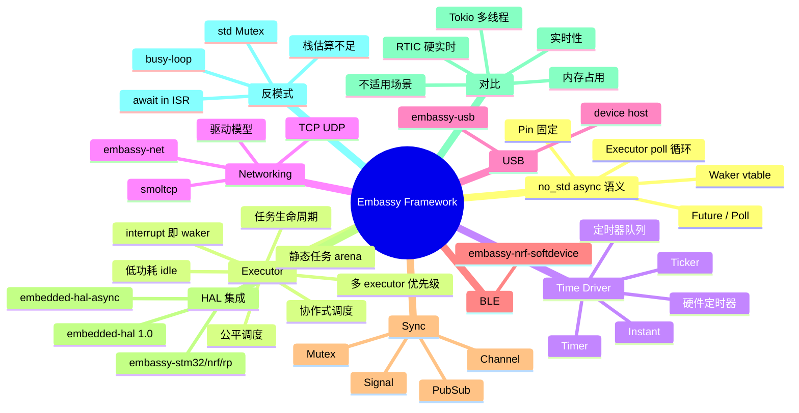
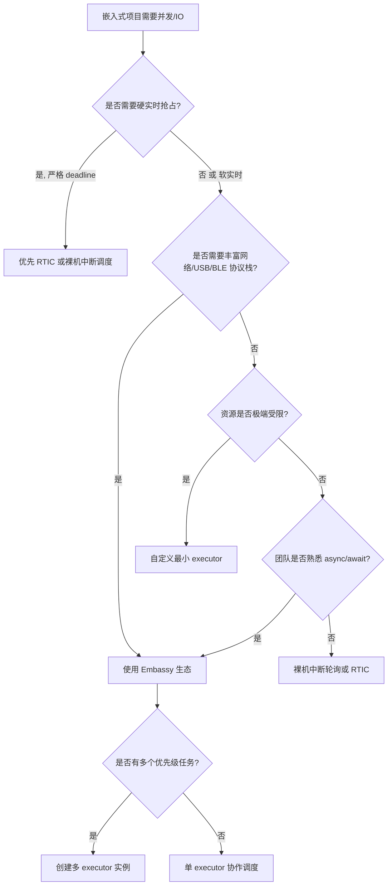
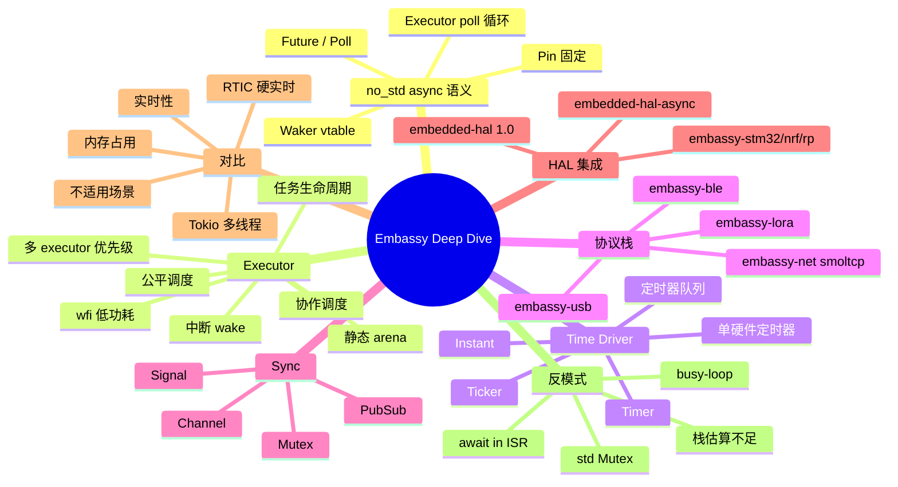

> **内容分级**: [专家级]
> **代码状态**: ⚠️ 目标平台相关代码使用 `rust,ignore`/`no_run`；含可编译的 std 模拟片段用于阐释 executor 语义
> **定理链**: N/A — 架构/工程性文档
>
> **本节关键术语**: embassy · executor · waker · time driver · no_std async · smoltcp · embedded-hal-async · RTIC · task arena — [完整对照表](../../00_meta/01_terminology/01_terminology_glossary.md)

# Embassy 异步框架深度解析

> **EN**: Embassy Async Framework Deep Dive
> **Summary**: Architectural deep dive into the Embassy embedded async runtime: executor, time driver, networking, USB, BLE, HAL integration, and async/await semantics under `no_std`.
> **Rust 版本**: 1.97.0+ (Edition 2024)

> **受众**: [专家]
> **Bloom 层级**: L3-L4
> **权威来源**: 本文件为 `concept/` 权威页。
> **A/S/P 标记**: **S+P+A** — Structure + Procedure + Application
> **双维定位**: P×Eva — 评估 Embassy 架构在资源约束嵌入式系统中的适用性与 trade-offs
> **前置概念**: [Async/Await](../../03_advanced/01_async/01_async.md) ·
> [Pin 与 Unpin](../../03_advanced/01_async/08_pin_unpin.md) ·
> [裸机与嵌入式中的 Async](11_async_no_std_embedded.md) ·
> [自定义裸机异步执行器](28_custom_bare_metal_async_executor.md) ·
> [Embedded-HAL 1.0 迁移与 Embassy 生产状态](09_embedded_hal_1_0_migration.md)
> **后置概念**: [嵌入式网络与 IoT 协议](31_embedded_networking_and_iot_protocols.md) ·
> [Cortex-M 与 RISC-V 中断异常模型](14_interrupt_and_exception_model.md) ·
> [嵌入式 RTOS 与安全关键框架对比](26_embedded_rtos_and_safety_critical_frameworks.md) ·
> [Rust vs Ada/SPARK](../../05_comparative/01_systems_languages/07_rust_vs_ada_spark.md)
>
> **来源**: [Embassy Book](https://embassy.dev/book/) ·
> [Embassy repository](https://github.com/embassy-rs/embassy) ·
> [embassy-executor docs.rs](https://docs.rs/embassy-executor/) ·
> [Rust Embedded Book](https://docs.rust-embedded.org/book/) ·
> [Awesome Embedded Rust](https://github.com/rust-embedded/awesome-embedded-rust)
>
> **横向对比**: [裸机与嵌入式中的 Async](11_async_no_std_embedded.md) ·
> [RTIC 实时任务调度框架深度解析](35_rtic_framework_deep_dive.md)

---

## 🧠 知识结构图



---

## 📑 目录

- [Embassy 异步框架深度解析](#embassy-异步框架深度解析)
  - [🧠 知识结构图](#-知识结构图)
  - [📑 目录](#-目录)
  - [一、权威定义](#一权威定义)
  - [二、架构全景](#二架构全景)
  - [三、async/await 在 no\_std 下的实现](#三asyncawait-在-no_std-下的实现)
    - [3.1 Future 与 Poll](#31-future-与-poll)
    - [3.2 Pin 与静态固定](#32-pin-与静态固定)
    - [3.3 Waker 机制](#33-waker-机制)
    - [3.4 最小 executor 循环](#34-最小-executor-循环)
    - [3.5 中断到 Future 的映射](#35-中断到-future-的映射)
  - [四、Embassy Executor 模型](#四embassy-executor-模型)
    - [4.1 静态任务分配与 arena](#41-静态任务分配与-arena)
    - [4.2 任务生命周期](#42-任务生命周期)
    - [4.3 中断驱动调度](#43-中断驱动调度)
    - [4.4 多 executor 与优先级](#44-多-executor-与优先级)
    - [4.5 公平调度](#45-公平调度)
    - [4.6 低功耗 idle](#46-低功耗-idle)
  - [五、Time Driver 与时间抽象](#五time-driver-与时间抽象)
  - [六、embassy-net 网络协议栈](#六embassy-net-网络协议栈)
    - [6.1 smoltcp 与驱动集成](#61-smoltcp-与驱动集成)
  - [七、embassy-usb](#七embassy-usb)
  - [八、embassy-ble 概览](#八embassy-ble-概览)
  - [九、embassy-sync 并发原语](#九embassy-sync-并发原语)
  - [十、与 embedded-hal 集成](#十与-embedded-hal-集成)
    - [10.1 同步与异步 HAL 混用](#101-同步与异步-hal-混用)
  - [十一、对比分析](#十一对比分析)
    - [11.1 与 RTIC 的对比](#111-与-rtic-的对比)
    - [11.2 与 Tokio 的对比](#112-与-tokio-的对比)
    - [11.3 内存占用分析](#113-内存占用分析)
    - [11.4 实时性分析](#114-实时性分析)
    - [11.5 不适用场景](#115-不适用场景)
  - [十二、反例与常见反模式](#十二反例与常见反模式)
    - [反例：在 ISR 中 await](#反例在-isr-中-await)
    - [✅ 修正：ISR 只做 wake](#-修正isr-只做-wake)
    - [反例：任务中阻塞 CPU](#反例任务中阻塞-cpu)
    - [✅ 修正：使用 Signal 或等待事件](#-修正使用-signal-或等待事件)
    - [12.1 栈深度估算方法](#121-栈深度估算方法)
  - [十三、决策树：何时使用 Embassy](#十三决策树何时使用-embassy)
  - [十四、权威来源索引](#十四权威来源索引)
  - [🧭 思维导图（Mindmap）](#-思维导图mindmap)
  - [权威来源与延伸阅读（International Authority Sources）](#权威来源与延伸阅读international-authority-sources)

---

## 一、权威定义

> **Embassy Book**: Embassy is an async/await-based execution framework for embedded systems. It provides an executor, time driver, and a growing ecosystem of async HALs and protocol stacks.

**Embassy**：一套面向嵌入式系统的 `async/await` 运行时框架，由 `embassy-executor`（执行器）、`embassy-time`（时间驱动）、`embassy-net`（网络协议栈）、`embassy-usb`（USB 协议栈）、`embassy-sync`（并发原语）、各 MCU 家族的 `embassy-*` HAL，以及社区扩展（如 BLE 软协议栈绑定）组成。其核心设计哲学是**中断驱动的协作式调度**：硬件中断转换为 Waker 信号，驱动 executor 重新 poll 等待中的 Future，无需 RTOS 内核抢占开销。

判定依据：理解 Embassy 的关键不在于掌握某个 API，而在于理解它如何用 Rust 的 `Future` + `Waker` 机制，把传统 RTOS 中“任务 + 信号量 + 阻塞”的模型，替换为“异步任务 + 中断唤醒 + 无堆协作调度”。

---

## 二、架构全景

```text
应用层
  ├── async task (用户业务逻辑)
  └── 使用 embassy-sync / embassy-net / embassy-usb / embassy-ble
运行时层
  ├── embassy-executor：任务调度、Waker 管理、低功耗 idle
  ├── embassy-time：Time driver、Timer、Ticker、Instant
  └── (可选) embassy-net / embassy-usb / embassy-lora / embassy-ble ...
HAL 层
  ├── embassy-stm32 / embassy-nrf / embassy-rp / embassy-esp
  └── 基于 embedded-hal 1.0 / embedded-hal-async 1.0
芯片硬件
  ├── NVIC / 中断
  ├── 定时器
  └── 外设 (SPI/I2C/UART/USB/Ethernet/WiFi/BLE)
```

| 组件 | 职责 | 关键设计 |
|:---|:---|:---|
| `embassy-executor` | 单/多核 async 任务调度 | 静态任务 arena、无堆默认、协作式、可按优先级创建多个实例 |
| `embassy-time` | 统一时间抽象与定时器 | 单个硬件定时器驱动全局时间基 |
| `embassy-net` | async TCP/IP | 基于 smoltcp，无堆/静态缓冲可配置 |
| `embassy-usb` | async USB device/host | 状态机由 async task 驱动 |
| `embassy-ble` | BLE 协议栈绑定 | 主要通过 `nrf-softdevice` 或芯片原生 BLE 控制器集成 |
| `embassy-sync` | `Mutex`、`Channel`、`Signal`、`PubSub` | 为单核/多核 executor 优化的无堆原语 |
| `embassy-*-hal` | 各 MCU 的 async HAL | 外设事件 → Waker |

---

## 三、async/await 在 no_std 下的实现

### 3.1 Future 与 Poll

Rust 的 `async/await` 语法糖最终展开为实现了 `Future` trait 的状态机：

```rust
use std::pin::Pin;
use std::task::{Context, Poll};

pub trait Future {
    type Output;
    fn poll(self: Pin<&mut Self>, cx: &mut Context<'_>) -> Poll<Self::Output>;
}
```

- **Poll::Pending**：任务还需要等待某个事件，必须注册 Waker；
- **Poll::Ready(T)**：任务完成，返回结果；
- **Context**：携带 Waker，任务通过它告诉 executor“事件发生后请重新 poll 我”。

在 `no_std` 环境中，Future 状态机的存储必须避免堆分配。Embassy 通过**静态分配**或**栈上固定**实现。

### 3.2 Pin 与静态固定

`Future` 可能是自引用的（例如 async fn 内部借用局部变量）。`Pin<&mut Self>` 保证 Future 在 poll 之间不会被移动。在 Embassy 中：

- 使用 `static_cell::StaticCell` 在静态内存中固定任务；
- 使用 `core::pin::pin!` 宏（Rust 1.68+）在栈上固定；
- 禁止在 `no_std` 中隐式 `Box::pin`，除非显式启用分配器。

```rust,ignore
use core::pin::pin;
use embassy_executor::Spawner;

#[embassy_executor::main]
async fn main(spawner: Spawner) {
    // 栈上固定一个 Future
    let mut fut = pin!(async {
        Timer::after_secs(1).await;
        42
    });
    let result = fut.await;
}
```

### 3.3 Waker 机制

Waker 是 executor 与 async 原语之间的回调契约。每个 Waker 内部持有指向任务控制块的指针和一张函数指针表（vtable）。当硬件中断发生时，ISR 调用 `Waker::wake()`，把对应任务重新加入运行队列。

Embassy 的 Waker 特点：

- **由 executor 创建**：`embassy-time::Timer` 只能与 Embassy executor 一起工作，因为它的 Waker 格式是 executor 私有的；
- **中断安全**：`wake()` 可在 ISR 中调用，仅需原子操作；
- **精确唤醒**：一个 Waker 只唤醒所属任务，不会导致全局 poll 风暴。

### 3.4 最小 executor 循环

下面的 std 示例模拟了 executor 的核心逻辑，帮助理解 `no_std` 下的 poll 循环。真实 Embassy executor 用更复杂的队列、中断驱动和低功耗原语替代了 `thread::sleep`。

```rust
use std::future::Future;
use std::pin::Pin;
use std::sync::Arc;
use std::task::{Context, Poll, Waker, RawWaker, RawWakerVTable};

fn block_on<F: Future>(mut fut: F) -> F::Output {
    let mut fut = unsafe { Pin::new_unchecked(&mut fut) };
    loop {
        let waker = dummy_waker();
        let mut cx = Context::from_waker(&waker);
        match fut.as_mut().poll(&mut cx) {
            Poll::Ready(val) => return val,
            Poll::Pending => {
                // 在真实 Embassy 中，此处进入 WFI/WFE 或等待中断
                std::thread::yield_now();
            }
        }
    }
}

fn dummy_waker() -> Waker {
    static VTABLE: RawWakerVTable = RawWakerVTable::new(
        |_| RawWaker::new(std::ptr::null(), &VTABLE),
        |_| {},
        |_| {},
        |_| {},
    );
    unsafe { Waker::from_raw(RawWaker::new(std::ptr::null(), &VTABLE)) }
}

async fn answer() -> u32 { 42 }

fn main() {
    assert_eq!(block_on(answer()), 42);
}
```

> **关键洞察**：executor 的核心就是反复调用 `poll()`，直到 Future 返回 `Ready`。`no_std` 与 std 的区别仅在于唤醒来源（中断 vs OS 事件）与内存分配策略（静态 vs 堆）。

### 3.5 中断到 Future 的映射

在 Embassy 中，一个典型的“等待 GPIO 上升沿”的 async 函数会执行以下步骤：

1. 在第一次 `poll` 时，把当前任务的 Waker 注册到 EXTI（外部中断）控制器；
2. 返回 `Poll::Pending`，任务被移出运行队列；
3. GPIO 边沿触发中断，ISR 调用 Waker；
4. Executor 重新 `poll` 该任务，任务读取 GPIO 状态并返回 `Poll::Ready`。

这种模式把中断服务程序精简到“通知”作用，业务逻辑保留在 async task 中，避免了传统状态机的碎片化。

---

## 四、Embassy Executor 模型

### 4.1 静态任务分配与 arena

`embassy-executor` 默认使用静态任务 arena，避免堆分配。任务数量与栈大小通过 Cargo features 或环境变量配置：

```toml
[dependencies]
embassy-executor = { version = "0.5", features = [
    "task-arena-size-32768",
    "integrated-timers",
] }
```

在非 nightly Rust 上，任务从 arena 中分配；arena 耗尽会在运行时 panic。在 nightly 上启用 `nightly` feature，每个任务使用独立的 `static` 存储，内存不足会在**链接期**报错，彻底消除运行时 arena 耗尽风险。

```rust,ignore
use embassy_executor::Spawner;
use embassy_sync::blocking_mutex::raw::ThreadModeRawMutex;
use embassy_sync::mutex::Mutex;
use static_cell::StaticCell;

static SHARED: StaticCell<Mutex<ThreadModeRawMutex, u32>> = StaticCell::new();

#[embassy_executor::task]
async fn worker(counter: &'static Mutex<ThreadModeRawMutex, u32>) {
    loop {
        *counter.lock().await += 1;
        Timer::after_secs(1).await;
    }
}

#[embassy_executor::main]
async fn main(spawner: Spawner) {
    let counter = SHARED.init(Mutex::new(0));
    spawner.spawn(worker(counter)).unwrap();
    // ...
}
```

### 4.2 任务生命周期

Embassy 任务的生命周期由 executor 管理：

1. **声明**：`#[embassy_executor::task]` 宏把 async fn 转换为可静态分配的任务类型；
2. **生成**：`spawner.spawn(task(args))` 把任务加入运行队列，分配 arena 或 static 存储；
3. **运行**：executor 在就绪队列中轮询任务，直到其 Future 返回 `Ready`；
4. **完成**：任务结束后，其存储不立即释放（可复用以再次生成同名任务）。

> **注意**：对于 `pool_size > 1` 的任务，首次 spawn 会为整个 pool 分配内存，避免运行时才暴露内存不足。

### 4.3 中断驱动调度

在 Embassy 中，外设中断不直接执行业务逻辑，而是调用已注册 Waker 的 `wake()`，把对应任务重新放入 run queue。Executor 随后 poll 该任务。

```rust,ignore
#![no_std]
#![no_main]

use embassy_executor::Spawner;
use embassy_time::{Duration, Timer};
use embassy_stm32::gpio::{Level, Output, Speed};
use {panic_halt as _, embassy_stm32};

#[embassy_executor::main]
async fn main(_spawner: Spawner) {
    let p = embassy_stm32::init(Default::default());
    let mut led = Output::new(p.PA5, Level::Low, Speed::Low);

    loop {
        led.set_high();
        Timer::after(Duration::from_millis(300)).await;
        led.set_low();
        Timer::after(Duration::from_millis(300)).await;
    }
}
```

> 关键洞察：`Timer::after(...).await` 不会阻塞 CPU，而是把当前 task 从 run queue 移除；time driver 在定时器中断中调用 waker，executor 在 300ms 后重新 poll 该 task。

### 4.4 多 executor 与优先级

Embassy 支持创建多个 executor 实例，每个实例运行在不同中断优先级上，从而实现**软抢占**。例如，高优先级任务在 ISR 上下文 executor 中运行，可以抢占主线程 executor 中的低优先级任务。

```rust,ignore
use embassy_executor::Executor;
use embassy_stm32::interrupt;

static mut HIGH_PRIO_EXECUTOR: Executor = Executor::new();

#[interrupt]
unsafe fn SWI0_EGU0_IRQHandler() {
    HIGH_PRIO_EXECUTOR.on_irq();
}
```

> **注意**：同一 executor 内部仍是协作式调度；不同 executor 之间通过 NVIC 优先级实现抢占。

### 4.5 公平调度

`embassy-executor` 保证一个任务不能垄断 CPU：即使某个任务不断被唤醒，executor 也会让其他就绪任务先运行一次，然后才再次 poll 它。这种公平性避免了高事件率任务饿死低优先级后台任务。

### 4.6 低功耗 idle

当没有任务可运行时，Embassy executor 调用 `WFE`（Wait For Event）或 `WFI`（Wait For Interrupt），使 CPU 进入睡眠状态。定时器中断或外设中断会自动唤醒 CPU，无需 busy-loop。对于电池供电设备，这是 Embassy 相比裸机轮询的重要优势。

---

## 五、Time Driver 与时间抽象

`embassy-time` 通过单个硬件定时器提供全局单调时钟 `Instant`，以及 `Timer`、`Ticker`、`Duration` 等 async 原语。Time driver 负责：

1. 维护按到期时间排序的定时器队列；
2. 在最近的到期时间配置硬件定时器比较匹配；
3. 在定时器中断中唤醒对应 task。

```rust,ignore
use embassy_time::{Duration, Instant, Timer, Ticker};

async fn timeout_demo() {
    let start = Instant::now();

    // 一次性定时器
    Timer::after(Duration::from_millis(100)).await;

    // 周期性定时器
    let mut ticker = Ticker::every(Duration::from_secs(1));
    ticker.next().await;

    let elapsed = start.elapsed();
    defmt::info!("elapsed: {}", elapsed);
}
```

> 判定依据：Time driver 是 Embassy 的核心价值之一。它把多个分散的软件定时器合并为单个硬件定时器中断，显著降低中断频率与功耗，同时保持 `async/await` 的直观编程模型。

---

## 六、embassy-net 网络协议栈

`embassy-net` 是 Embassy 的 async TCP/IP 栈，底层基于 [smoltcp](https://github.com/smoltcp-rs/smoltcp)。它允许在裸机 MCU 上直接运行 async 网络代码，无需完整 RTOS。

```rust,ignore
use embassy_net::{Config, Stack, StackResources};
use embassy_net::tcp::TcpSocket;
use static_cell::StaticCell;

static STACK: StaticCell<Stack<NetDriver>> = StaticCell::new();
static RESOURCES: StaticCell<StackResources<3>> = StaticCell::new();

#[embassy_executor::task]
async fn net_task(stack: &'static Stack<NetDriver>) {
    stack.run().await;
}

async fn http_request(stack: &'static Stack<NetDriver>) {
    let mut rx_buffer = [0; 4096];
    let mut tx_buffer = [0; 4096];
    let mut socket = TcpSocket::new(stack, &mut rx_buffer, &mut tx_buffer);

    socket.connect((Ipv4Address::new(93, 184, 216, 34), 80)).await.unwrap();
    socket.write_all(b"GET / HTTP/1.0\r\n\r\n").await.unwrap();

    let mut buf = [0; 1024];
    let n = socket.read(&mut buf).await.unwrap();
    defmt::info!("received {} bytes", n);
}
```

关键设计点：

- **静态缓冲**：`rx_buffer` / `tx_buffer` 由调用者提供，避免堆分配。
- **单一 `net_task`**：协议栈在主 task 中运行，所有 socket 通过 Waker 与之交互。
- **零拷贝优化**：`smoltcp` 的 packet buffer 可直接与驱动 DMA 对接。

### 6.1 smoltcp 与驱动集成

`embassy-net` 并不直接操作以太网 MAC，而是通过 `Driver` trait 与具体芯片驱动交互。`Driver` 需要实现：

- `receive()`：从 DMA 接收队列取出一个数据包；
- `transmit()`：把数据包放入 DMA 发送队列；
- `register_waker()`：在发送/接收完成中断中调用 Waker。

这种分层让同一网络栈可以运行在 ENC28J60、W5500、STM32 ETH、USB CDC-NCM 等多种硬件上。

---

## 七、embassy-usb

`embassy-usb` 提供 async USB device/host 实现。协议状态机由 async task 驱动，中断仅负责通知端点事件。

```rust,ignore
use embassy_usb::Builder;
use embassy_usb::class::cdc_acm::{CdcAcmClass, State};

static CONFIG_DESCRIPTOR: StaticCell<[u8; 256]> = StaticCell::new();
static BOS_DESCRIPTOR: StaticCell<[u8; 256]> = StaticCell::new();
static CONTROL_BUF: StaticCell<[u8; 64]> = StaticCell::new();
static STATE: StaticCell<State> = StaticCell::new();

async fn usb_task(driver: UsbDriver<'static>) {
    let mut builder = Builder::new(
        driver,
        embassy_usb::Config::new(0xc0de, 0xcafe),
        CONFIG_DESCRIPTOR.init([0; 256]),
        BOS_DESCRIPTOR.init([0; 256]),
        &mut [],
        CONTROL_BUF.init([0; 64]),
    );

    let mut class = CdcAcmClass::new(&mut builder, STATE.init(State::new()), 64);
    let mut usb = builder.build();

    let usb_fut = usb.run();
    let echo_fut = async {
        loop {
            class.wait_connection().await;
            let mut buf = [0; 64];
            loop {
                let n = class.read_packet(&mut buf).await.unwrap();
                class.write_packet(&buf[..n]).await.unwrap();
            }
        }
    };

    embassy_futures::join::join(usb_fut, echo_fut).await;
}
```

---

## 八、embassy-ble 概览

Embassy 生态对 BLE 的支持主要有两条路径：

1. **nRF SoftDevice**：通过 `nrf-softdevice` crate 把 Nordic 协议栈封装为 async API，可在 Embassy executor 上运行；
2. **芯片原生 BLE 控制器**：如 ESP32-C3 的 BLE 控制器，通过 Embassy HAL 的 async HCI 接口驱动。

BLE 协议栈与 USB、网络栈共享同一 executor，但通常运行在中等优先级，避免阻塞关键控制任务。

---

## 九、embassy-sync 并发原语

`embassy-sync` 为单核/多核 executor 提供无堆同步原语，核心类型包括：

| 类型 | 用途 | 注意 |
|:---|:---|:---|
| `Mutex<R, T>` | 跨 task 共享可变状态 | `R` 为 raw mutex，单核用 `ThreadModeRawMutex` |
| `Channel<R, T, N>` | 多生产者多消费者有界通道 | 容量 `N` 编译期确定 |
| `Signal<R, T>` | 单次信号传递 | 只能存储一个值，消费后清空 |
| `PubSub<R, T, N, S>` | 发布订阅 | 支持多个订阅者 |
| `Pipe<R, N>` | 字节流管道 | 类似 Unix pipe |

```rust,ignore
use embassy_sync::blocking_mutex::raw::ThreadModeRawMutex;
use embassy_sync::channel::{Channel, Sender, Receiver};
use static_cell::StaticCell;

static CHAN: StaticCell<Channel<ThreadModeRawMutex, u32, 3>> = StaticCell::new();

#[embassy_executor::task]
async fn producer(tx: Sender<'static, ThreadModeRawMutex, u32, 3>) {
    for i in 0..10 {
        tx.send(i).await;
    }
}

#[embassy_executor::task]
async fn consumer(rx: Receiver<'static, ThreadModeRawMutex, u32, 3>) {
    loop {
        let v = rx.receive().await;
        defmt::info!("got {}", v);
    }
}
```

---

## 十、与 embedded-hal 集成

Embassy 各 MCU HAL 同时实现 `embedded-hal` 1.0 和 `embedded-hal-async` 1.0 trait。这意味着：

1. 同一个驱动 crate 可以服务同步和异步两种调用方式；
2. 阻塞 HAL 代码与 Embassy async 代码可在同一项目中混用；
3. 驱动作者优先面向 `embedded-hal-async` trait 编写，可获得最佳可移植性。

```rust,ignore
use embedded_hal_async::spi::SpiDevice;
use embedded_hal_async::digital::Wait;

async fn read_sensor<E>(
    spi: &mut impl SpiDevice<u8, Error = E>,
    drdy: &mut impl Wait,
) -> Result<[u8; 4], E> {
    drdy.wait_for_high().await.ok();
    let mut buf = [0u8; 4];
    spi.read(&mut buf).await?;
    Ok(buf)
}
```

> 判定依据：`embedded-hal-async` trait 与 Embassy executor 的整合，是 Rust 嵌入式生态从“百花齐放”走向“可移植驱动”的关键一步。它允许驱动代码不依赖具体芯片 HAL，只依赖能力 trait。

### 10.1 同步与异步 HAL 混用

在实际项目中，部分第三方驱动只提供阻塞 API。可以使用 `embassy-time` 的 `block_for` 或 `embassy-executor` 的 `yield_now` 把阻塞调用“切分”到 async task 中，但更好的做法是封装为 `embedded-hal-async` trait，让上层无感知。

---

## 十一、对比分析

### 11.1 与 RTIC 的对比

| 维度 | Embassy | RTIC |
|:---|:---|:---|
| 编程模型 | `async/await` | 基于硬件优先级的任务 + 可混合 async |
| 调度 | 协作式，中断即 waker | 抢占式，NVIC 优先级即调度器 |
| 内存 | 共享调用栈 + 静态 arena | 每个任务独立栈 |
| 实时性 | 软实时，适合 I/O 密集 | 硬实时，适合控制循环 |
| 协议栈生态 | 丰富（net/usb/lora/ble） | 需自行集成或复用 |
| 学习曲线 | 低（熟悉 Tokio 即可） | 中（需理解优先级 Ceiling） |
| 数据竞争保证 | 借用检查 + `Send`/`Sync` | 编译期无死锁/无数据竞争分析 |

> 选型判定：协议复杂、网络/USB 丰富、软实时 → Embassy；电机控制、严格 deadline、中断密集型 → RTIC。两者并非互斥，部分项目用 RTIC 调度硬实时任务，同时在其低优先级任务中运行 Embassy executor。

### 11.2 与 Tokio 的对比

| 维度 | Tokio | Embassy |
|:---|:---|:---|
| 运行环境 | 标准库 + OS | `no_std` + 裸机 |
| 线程模型 | 多线程 work-stealing | 通常单核/单线程，可选多 executor |
| 任务存储 | 堆分配 `Box` | 静态 arena 或 static |
| 唤醒来源 | OS 事件、I/O 完成 | 硬件中断、定时器 |
| `Send`/`Sync` | 通常强制 | 单核场景可放宽 |
| 调度策略 | 抢占式时间片 + 协作 | 纯协作式（单 executor 内） |
| 低功耗 | OS 级睡眠 | `wfi` / `wfe` 直接嵌入 executor |
| 适用场景 | 服务器/桌面/网络服务 | 嵌入式 MCU、传感器、IoT |

> **关键差异**：Tokio 依赖 OS 提供的线程、文件描述符与网络栈；Embassy 把这些能力替换为硬件中断、定时器和 HAL 驱动，但保留了相同的 `Future`/`Waker` 抽象。

### 11.3 内存占用分析

| 项目 | Embassy 开销 | 说明 |
|:---|:---|:---|
| 每个任务 | Future 状态机大小 + 少量元数据 | 无独立 OS 栈 |
| Executor | arena 或 static 存储 | 可精确计算 |
| Timer queue | 每个 pending timer 一个节点 | 共享单个硬件定时器 |
| Net stack | `StackResources<N>` 静态配置 | N 为 socket/接口数量 |
| USB stack | 描述符与控制缓冲区由用户提供 | 完全可控 |

估算示例：假设一个任务 Future 状态机占用 128 字节，arena 配置 8KiB，则可容纳约 60 个任务。相比传统 RTOS 每个任务独立栈（通常 256B–1KB），Embassy 的共享栈模型在任务数多、阻塞点明确时更省 RAM；但如果任务中存在深层调用栈或大量局部状态，需要仔细估算最大栈深度。

### 11.4 实时性分析

Embassy 的实时性特征由协作式调度决定：

- **最坏情况响应时间** = 最长的不 yield 的代码段 + ISR 延迟。任何 task 如果在 `.await` 之间执行长时间计算，会阻塞同 executor 内所有其他任务。
- **中断延迟**：硬件中断仍可抢占用户 task，ISR 中调用 `wake()` 后，被唤醒 task 的 poll 发生在当前 ISR 返回或当前 task yield 之后。
- **时间精度**：`embassy-time` 的精度取决于硬件定时器频率与 time driver 实现，典型在微秒到毫秒级。
- **多 executor 优先级**：通过把关键任务放到高优先级 executor，可以实现软抢占，但同 executor 内仍需保证 task 及时 yield。

判定依据：Embassy 适合**软实时**、I/O 密集、事件驱动的应用；对严格 deadline 的电机控制或安全关键循环，应使用 RTIC 或专用 RTOS。

### 11.5 不适用场景

以下场景应谨慎或避免使用 Embassy：

1. **硬实时控制循环**：需要可证明的 worst-case response time，协作式调度难以给出严格上界；
2. **任务数极少且极端简单**：裸机中断轮询可能代码量更小、更容易审计；
3. **需要 POSIX/文件系统/进程隔离**：Embassy 不提供 OS 级抽象；
4. **团队完全无 async 经验**：调试 Waker、Pin、task arena 问题需要理解 Rust async 语义。

---

## 十二、反例与常见反模式

| 反模式 | 根因 | 后果 |
|:---|:---|:---|
| 在 ISR 中直接 `.await` | 中断上下文不是 task 上下文 | 编译错误或运行时崩溃 |
| 任务栈估算不足 | async 任务共享调用栈 | 栈溢出 |
| 在 task 中长时间 busy-loop | 破坏协作式调度 | 其他任务饿死 |
| 混用 `std::sync::Mutex` | `std` 不可用或阻塞 executor | 编译失败或死锁 |
| 未配置 `task-arena-size` | 默认 arena 不足以容纳任务 | 运行时 panic |
| 在 no_std 中隐式分配 | 无默认全局分配器 | 链接错误 |

### 反例：在 ISR 中 await

```rust,ignore,compile_fail
#[interrupt]
fn USART1() {
    // 错误：中断函数不是 async，不能 await
    some_async_fn().await;
}
```

### ✅ 修正：ISR 只做 wake

```rust,ignore
static USART1_WAKER: AtomicWaker = AtomicWaker::new();

#[interrupt]
fn USART1() {
    USART1_WAKER.wake();
}

#[embassy_executor::task]
async fn usart_task() {
    loop {
        USART1_WAKER.wait().await;
        // 处理接收数据
    }
}
```

### 反例：任务中阻塞 CPU

```rust,ignore
#[embassy_executor::task]
async fn bad_task() {
    loop {
        // 错误：busy-loop 占用 executor，其他任务无法运行
        while !flag_is_set() {}
    }
}
```

### ✅ 修正：使用 Signal 或等待事件

```rust,ignore
use embassy_sync::signal::Signal;
use static_cell::StaticCell;

static FLAG: StaticCell<Signal<ThreadModeRawMutex, ()>> = StaticCell::new();

#[embassy_executor::task]
async fn good_task(flag: &'static Signal<ThreadModeRawMutex, ()>) {
    loop {
        flag.wait().await; // 让出 CPU，ISR 触发后恢复
    }
}
```

### 12.1 栈深度估算方法

由于 async task 共享调用栈，估算最大栈深度时不能只看单个函数，而要看：

1. 所有并发 task 中，最深调用链的栈帧之和；
2. 中断嵌套可能压入的额外栈帧；
3. `embassy-executor` 自身与 time driver 的开销。

常用方法：

- 使用 `cortex-m-rt` 的 `__stack_bottom` 标记，结合 `flip-link` 检测溢出；
- 在 release 构建中开启 `debug = 2`，使用 `cargo size` / `cargo stack-sizes` 分析；
- 保守预留 25%–50% 余量，并在 CI 中跑硬件测试验证。

---

## 十三、决策树：何时使用 Embassy



---

## 十四、权威来源索引

- **[Embassy Book](https://embassy.dev/book/)** — Embassy 官方文档，覆盖 executor、time driver、HAL 与协议栈。
- **[Embassy repository](https://github.com/embassy-rs/embassy)** — 源码、示例与 issue 跟踪。
- **[embassy-executor docs.rs](https://docs.rs/embassy-executor/)** — executor API、task arena、nightly static allocation 说明。
- **[embassy-net docs.rs](https://docs.rs/embassy-net/)** — async TCP/IP 栈与 smoltcp 集成。
- **[embassy-usb docs.rs](https://docs.rs/embassy-usb/)** — USB device/host async API。
- **[Rust Embedded Book](https://docs.rust-embedded.org/book/)** — Rust 嵌入式开发通用基础。
- **[Awesome Embedded Rust](https://github.com/rust-embedded/awesome-embedded-rust)** — 嵌入式 Rust 生态索引。
- **[RTIC Book](https://rtic.rs/2/book/en/)** — 与 RTIC 对比的权威来源。
- **[Tokio docs](https://tokio.rs/)** — 与标准库 async 运行时对比的权威来源。
- **[RFC 2394 — async/await](https://rust-lang.github.io/rfcs/2394-async_await.html)** — Rust async 语法与设计原理。

> **文档版本**: 1.1
> **最后更新**: 2026-08-03
> **状态**: ✅ 权威页补齐

---

## 🧭 思维导图（Mindmap）



> **认知功能**: 本 mindmap 从 async 语义、executor、time driver、协议栈、同步原语、HAL 集成、对比与反模式八个维度组织 Embassy 核心概念，可作为架构选型与问题排查的快速导航索引。

---

## 权威来源与延伸阅读（International Authority Sources）

- Embassy Book：<https://embassy.dev/book/>
- `embassy-executor` docs：<https://docs.rs/embassy-executor/latest/embassy_executor/>
- RustBelt / Stacked Borrows：Rust 异步任务与内存安全的形式化模型：<https://plv.mpi-sws.org/rustbelt/>
