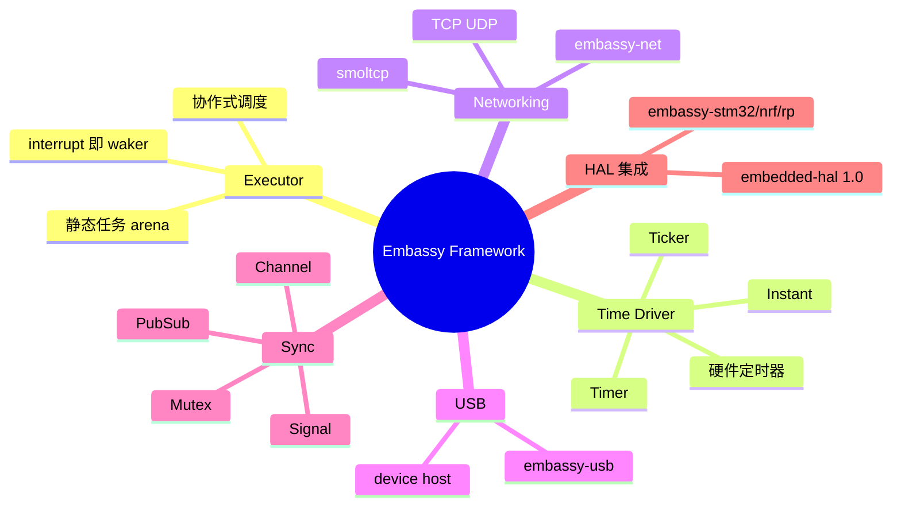
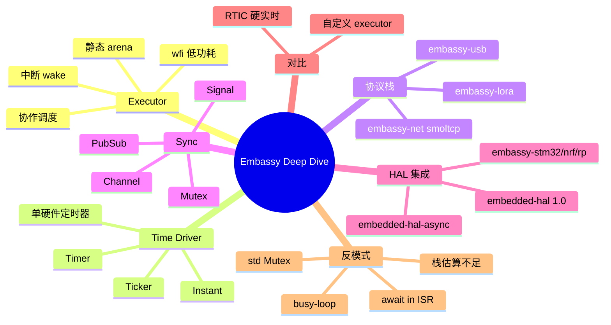

> **内容分级**: [专家级]
> **代码状态**: ⚠️ 目标平台相关代码使用 `rust,ignore`/`no_run`；含可编译的 std 模拟片段
> **定理链**: N/A — 架构/工程性文档
>
# Embassy 异步框架深度解析
>
> **EN**: Embassy Async Framework Deep Dive
> **Summary**: Architectural deep dive into the Embassy embedded async runtime: executor, time driver, networking, USB, and hardware abstraction integration.
> **Rust 版本**: 1.97.0+ (Edition 2024)
>
> **受众**: [专家]
> **Bloom 层级**: L3-L4
> **权威来源**: 本文件为 `concept/` 权威页。
> **A/S/P 标记**: **S+P+A** — Structure + Procedure + Application
> **双维定位**: P×Eva — 评估 Embassy 架构在资源约束嵌入式系统中的适用性与 trade-offs
> **前置概念**: [Async/Await](../../03_advanced/01_async/01_async.md) ·
> [Pin 与 Unpin](../../03_advanced/01_async/08_pin_unpin.md) ·
> [裸机与嵌入式中的 Async](11_async_no_std_embedded.md) ·
> [自定义裸机异步执行器](28_custom_bare_metal_async_executor.md) ·
> [Embedded-HAL 1.0 迁移与 Embassy 生产状态](09_embedded_hal_1_0_migration.md)
> **后置概念**: [嵌入式网络与 IoT 协议](31_embedded_networking_and_iot_protocols.md) ·
> [Cortex-M 与 RISC-V 中断异常模型](14_interrupt_and_exception_model.md) ·
> [嵌入式 RTOS 与安全关键框架对比](26_embedded_rtos_and_safety_critical_frameworks.md)
>
> **来源**: [Embassy Book](https://embassy.dev/book/) ·
> [Embassy repository](https://github.com/embassy-rs/embassy) ·
> [Rust Embedded Book](https://docs.rust-embedded.org/book/) ·
> [Awesome Embedded Rust](https://github.com/rust-embedded/awesome-embedded-rust)
>
> **横向对比**: [裸机与嵌入式中的 Async](11_async_no_std_embedded.md)

---

## 🧠 知识结构图



## 📑 目录

- [Embassy 异步框架深度解析](#embassy-异步框架深度解析)
  - [🧠 知识结构图](#-知识结构图)
  - [📑 目录](#-目录)
  - [一、权威定义](#一权威定义)
  - [二、架构全景](#二架构全景)
  - [三、Executor 模型](#三executor-模型)
    - [3.1 中断驱动 vs 线程模型](#31-中断驱动-vs-线程模型)
    - [3.2 Waker 与任务状态](#32-waker-与任务状态)
    - [3.3 静态任务分配](#33-静态任务分配)
  - [四、Time Driver 与时间抽象](#四time-driver-与时间抽象)
  - [五、embassy-net 网络协议栈](#五embassy-net-网络协议栈)
  - [六、embassy-usb](#六embassy-usb)
  - [七、embassy-sync 并发原语](#七embassy-sync-并发原语)
  - [八、与 embedded-hal 集成](#八与-embedded-hal-集成)
  - [九、与 RTIC 的对比](#九与-rtic-的对比)
  - [十、反例与常见反模式](#十反例与常见反模式)
    - [反例：在 ISR 中 await](#反例在-isr-中-await)
    - [✅ 修正：ISR 只做 wake](#-修正isr-只做-wake)
    - [反例：任务中阻塞 CPU](#反例任务中阻塞-cpu)
    - [✅ 修正：使用 Signal 或等待事件](#-修正使用-signal-或等待事件)
  - [十一、相关概念](#十一相关概念)
  - [🧭 思维导图（Mindmap）](#-思维导图mindmap)

---

## 一、权威定义

> **Embassy Book**: Embassy is an async/await-based execution framework for embedded systems. It provides an executor, time driver, and a growing ecosystem of async HALs and protocol stacks.

**Embassy**：一套面向嵌入式系统的 `async/await` 运行时框架，由 `embassy-executor`（执行器）、`embassy-time`（时间驱动）、`embassy-net`（网络协议栈）、`embassy-usb`（USB 协议栈）、`embassy-sync`（并发原语）以及各 MCU 家族的 `embassy-*` HAL 组成。其核心设计哲学是**中断驱动的协作式调度**：硬件中断转换为 Waker 信号，驱动 executor 重新 poll 等待中的 Future，无需 RTOS 内核抢占开销。

判定依据：理解 Embassy 的关键不在于掌握某个 API，而在于理解它如何用 Rust 的 `Future` + `Waker` 机制，把传统 RTOS 中“任务 + 信号量 + 阻塞”的模型，替换为“异步任务 + 中断唤醒 + 无堆协作调度”。

---

## 二、架构全景

```text
应用层
  ├── async task (用户业务逻辑)
  └── 使用 embassy-sync / embassy-net / embassy-usb
运行时层
  ├── embassy-executor：任务调度、Waker 管理、低功耗 idle
  ├── embassy-time：Time driver、Timer、Ticker、Instant
  └── (可选) embassy-net / embassy-usb / embassy-lora ...
HAL 层
  ├── embassy-stm32 / embassy-nrf / embassy-rp / embassy-esp
  └── 基于 embedded-hal 1.0 / embedded-hal-async 1.0
芯片硬件
  ├── NVIC / 中断
  ├── 定时器
  └── 外设 (SPI/I2C/UART/USB/Ethernet/WiFi)
```

| 组件 | 职责 | 关键设计 |
|:---|:---|:---|
| `embassy-executor` | 单/多核 async 任务调度 | 静态任务 arena、无堆默认、协作式 |
| `embassy-time` | 统一时间抽象与定时器 | 单个硬件定时器驱动全局时间基 |
| `embassy-net` | async TCP/IP | 基于 smoltcp，无堆/静态缓冲可配置 |
| `embassy-usb` | async USB device/host | 状态机由 async task 驱动 |
| `embassy-sync` | `Mutex`、`Channel`、`Signal`、`PubSub` | 为单核/多核 executor 优化的无堆原语 |
| `embassy-*-hal` | 各 MCU 的 async HAL | 外设事件 → Waker |

---

## 三、Executor 模型

### 3.1 中断驱动 vs 线程模型

Embassy 的 executor 与标准库 async 运行时的本质区别：

| 维度 | `tokio` / `async-std` | `embassy-executor` |
|:---|:---|:---|
| 线程模型 | 多线程 + work-stealing | 通常单核/单线程；可选多核 |
| 任务存储 | 堆分配 `Box` | 静态 arena 或栈 |
| 唤醒来源 | OS 事件、I/O 完成 | 硬件中断、定时器 |
| `Send`/`Sync` | 强制 | 单核场景可放宽 |
| 调度策略 | 抢占式时间片 + 协作 | 纯协作式 |
| 低功耗 | OS 级睡眠 | `wfi` / `wfe` 直接嵌入 executor |

### 3.2 Waker 与任务状态

在 Embassy 中，外设中断不直接执行业务逻辑，而是调用已注册 Waker 的 `wake()`，把对应任务重新放入 run queue。Executor 随后 poll 该任务。

```rust,ignore
#![no_std]
#![no_main]

use embassy_executor::Spawner;
use embassy_time::{Duration, Timer};
use embassy_stm32::gpio::{Level, Output, Speed};
use {panic_halt as _, embassy_stm32};

#[embassy_executor::main]
async fn main(_spawner: Spawner) {
    let p = embassy_stm32::init(Default::default());
    let mut led = Output::new(p.PA5, Level::Low, Speed::Low);

    loop {
        led.set_high();
        Timer::after(Duration::from_millis(300)).await;
        led.set_low();
        Timer::after(Duration::from_millis(300)).await;
    }
}
```

> 关键洞察：`Timer::after(...).await` 不会阻塞 CPU，而是把当前 task 从 run queue 移除；time driver 在定时器中断中调用 waker，executor 在 300ms 后重新 poll 该 task。

### 3.3 静态任务分配

`embassy-executor` 默认使用静态任务 arena，避免堆分配。任务数量与栈大小通过 Cargo features 配置：

```toml
[dependencies]
embassy-executor = { version = "0.5", features = [
    "task-arena-size-32768",
    "integrated-timers",
] }
```

```rust,ignore
use embassy_executor::Spawner;
use embassy_sync::blocking_mutex::raw::ThreadModeRawMutex;
use embassy_sync::mutex::Mutex;
use static_cell::StaticCell;

static SHARED: StaticCell<Mutex<ThreadModeRawMutex, u32>> = StaticCell::new();

#[embassy_executor::task]
async fn worker(counter: &'static Mutex<ThreadModeRawMutex, u32>) {
    loop {
        *counter.lock().await += 1;
        Timer::after(Duration::from_secs(1)).await;
    }
}

#[embassy_executor::main]
async fn main(spawner: Spawner) {
    let counter = SHARED.init(Mutex::new(0));
    spawner.spawn(worker(counter)).unwrap();
    // ...
}
```

---

## 四、Time Driver 与时间抽象

`embassy-time` 通过单个硬件定时器提供全局单调时钟 `Instant`，以及 `Timer`、`Ticker`、`Duration` 等 async 原语。Time driver 负责：

1. 维护按到期时间排序的定时器队列；
2. 在最近的到期时间配置硬件定时器比较匹配；
3. 在定时器中断中唤醒对应 task。

```rust,ignore
use embassy_time::{Duration, Instant, Timer, Ticker};

async fn timeout_demo() {
    let start = Instant::now();

    // 一次性定时器
    Timer::after(Duration::from_millis(100)).await;

    // 周期性定时器
    let mut ticker = Ticker::every(Duration::from_secs(1));
    ticker.next().await;

    let elapsed = start.elapsed();
    defmt::info!("elapsed: {}", elapsed);
}
```

> 判定依据：Time driver 是 Embassy 的核心价值之一。它把多个分散的软件定时器合并为单个硬件定时器中断，显著降低中断频率与功耗，同时保持 `async/await` 的直观编程模型。

---

## 五、embassy-net 网络协议栈

`embassy-net` 是 Embassy 的 async TCP/IP 栈，底层基于 [smoltcp](https://github.com/smoltcp-rs/smoltcp)。它允许在裸机 MCU 上直接运行 async 网络代码，无需完整 RTOS。

```rust,ignore
use embassy_net::{Config, Stack, StackResources};
use embassy_net::tcp::TcpSocket;
use static_cell::StaticCell;

static STACK: StaticCell<Stack<NetDriver>> = StaticCell::new();
static RESOURCES: StaticCell<StackResources<3>> = StaticCell::new();

#[embassy_executor::task]
async fn net_task(stack: &'static Stack<NetDriver>) {
    stack.run().await;
}

async fn http_request(stack: &'static Stack<NetDriver>) {
    let mut rx_buffer = [0; 4096];
    let mut tx_buffer = [0; 4096];
    let mut socket = TcpSocket::new(stack, &mut rx_buffer, &mut tx_buffer);

    socket.connect((Ipv4Address::new(93, 184, 216, 34), 80)).await.unwrap();
    socket.write_all(b"GET / HTTP/1.0\r\n\r\n").await.unwrap();

    let mut buf = [0; 1024];
    let n = socket.read(&mut buf).await.unwrap();
    defmt::info!("received {} bytes", n);
}
```

关键设计点：

- **静态缓冲**：`rx_buffer` / `tx_buffer` 由调用者提供，避免堆分配。
- **单一 `net_task`**：协议栈在主 task 中运行，所有 socket 通过 Waker 与之交互。
- **零拷贝优化**：`smoltcp` 的 packet buffer 可直接与驱动 DMA 对接。

---

## 六、embassy-usb

`embassy-usb` 提供 async USB device/host 实现。协议状态机由 async task 驱动，中断仅负责通知端点事件。

```rust,ignore
use embassy_usb::Builder;
use embassy_usb::class::cdc_acm::{CdcAcmClass, State};

static CONFIG_DESCRIPTOR: StaticCell<[u8; 256]> = StaticCell::new();
static BOS_DESCRIPTOR: StaticCell<[u8; 256]> = StaticCell::new();
static CONTROL_BUF: StaticCell<[u8; 64]> = StaticCell::new();
static STATE: StaticCell<State> = StaticCell::new();

async fn usb_task(usb: UsbDriver<'static>) {
    let mut builder = Builder::new(
        driver,
        embassy_usb::Config::new(0xc0de, 0xcafe),
        CONFIG_DESCRIPTOR.init([0; 256]),
        BOS_DESCRIPTOR.init([0; 256]),
        &mut [],
        CONTROL_BUF.init([0; 64]),
    );

    let mut class = CdcAcmClass::new(&mut builder, STATE.init(State::new()), 64);
    let mut usb = builder.build();

    let usb_fut = usb.run();
    let echo_fut = async {
        loop {
            class.wait_connection().await;
            let mut buf = [0; 64];
            loop {
                let n = class.read_packet(&mut buf).await.unwrap();
                class.write_packet(&buf[..n]).await.unwrap();
            }
        }
    };

    embassy_futures::join::join(usb_fut, echo_fut).await;
}
```

---

## 七、embassy-sync 并发原语

`embassy-sync` 为单核/多核 executor 提供无堆同步原语，核心类型包括：

| 类型 | 用途 | 注意 |
|:---|:---|:---|
| `Mutex<R, T>` | 跨 task 共享可变状态 | `R` 为 raw mutex，单核用 `ThreadModeRawMutex` |
| `Channel<R, T, N>` | 多生产者多消费者有界通道 | 容量 `N` 编译期确定 |
| `Signal<R, T>` | 单次信号传递 | 只能存储一个值，消费后清空 |
| `PubSub<R, T, N, S>` | 发布订阅 | 支持多个订阅者 |
| `Pipe<R, N>` | 字节流管道 | 类似 Unix pipe |

```rust,ignore
use embassy_sync::blocking_mutex::raw::ThreadModeRawMutex;
use embassy_sync::channel::{Channel, Sender, Receiver};
use static_cell::StaticCell;

static CHAN: StaticCell<Channel<ThreadModeRawMutex, u32, 3>> = StaticCell::new();

#[embassy_executor::task]
async fn producer(tx: Sender<'static, ThreadModeRawMutex, u32, 3>) {
    for i in 0..10 {
        tx.send(i).await;
    }
}

#[embassy_executor::task]
async fn consumer(rx: Receiver<'static, ThreadModeRawMutex, u32, 3>) {
    loop {
        let v = rx.receive().await;
        defmt::info!("got {}", v);
    }
}
```

---

## 八、与 embedded-hal 集成

Embassy 各 MCU HAL 同时实现 `embedded-hal` 1.0 和 `embedded-hal-async` 1.0 trait。这意味着：

1. 同一个驱动 crate 可以服务同步和异步两种调用方式；
2. 阻塞 HAL 代码与 Embassy async 代码可在同一项目中混用；
3. 驱动作者优先面向 `embedded-hal-async` trait 编写，可获得最佳可移植性。

```rust,ignore
use embedded_hal_async::spi::SpiDevice;
use embedded_hal_async::digital::Wait;

async fn read_sensor<E>(
    spi: &mut impl SpiDevice<u8, Error = E>,
    drdy: &mut impl Wait,
) -> Result<[u8; 4], E> {
    drdy.wait_for_high().await.ok();
    let mut buf = [0u8; 4];
    spi.read(&mut buf).await?;
    Ok(buf)
}
```

> 判定依据：`embedded-hal-async` trait 与 Embassy executor 的整合，是 Rust 嵌入式生态从“百花齐放”走向“可移植驱动”的关键一步。它允许驱动代码不依赖具体芯片 HAL，只依赖能力 trait。

---

## 九、与 RTIC 的对比

| 维度 | Embassy | RTIC |
|:---|:---|:---|
| 编程模型 | `async/await` | 基于硬件优先级的任务 + 可混合 async |
| 调度 | 协作式，中断即 waker | 抢占式，NVIC 优先级即调度器 |
| 内存 | 共享调用栈 + 静态 arena | 每个任务独立栈 |
| 实时性 | 软实时，适合 I/O 密集 | 硬实时，适合控制循环 |
| 协议栈生态 | 丰富（net/usb/lora/ble） | 需自行集成或复用 |
| 学习曲线 | 低（熟悉 Tokio 即可） | 中（需理解优先级 Ceiling） |
| 数据竞争保证 | 借用检查 + `Send`/`Sync` | 编译期无死锁/无数据竞争分析 |

> 选型判定：协议复杂、网络/USB 丰富、软实时 → Embassy；电机控制、严格 deadline、中断密集型 → RTIC。两者并非互斥，部分项目用 RTIC 调度硬实时任务，同时在其低优先级任务中运行 Embassy executor。

---

## 十、反例与常见反模式

| 反模式 | 根因 | 后果 |
|:---|:---|:---|
| 在 ISR 中直接 `.await` | 中断上下文不是 task 上下文 | 编译错误或运行时崩溃 |
| 任务栈估算不足 | async 任务共享调用栈 | 栈溢出 |
| 在 task 中长时间 busy-loop | 破坏协作式调度 | 其他任务饿死 |
| 混用 `std::sync::Mutex` | `std` 不可用或阻塞 executor | 编译失败或死锁 |
| 未配置 `task-arena-size` | 默认 arena 不足以容纳任务 | 运行时 panic |
| 在 no_std 中隐式分配 | 无默认全局分配器 | 链接错误 |

### 反例：在 ISR 中 await

```rust,ignore,compile_fail
#[interrupt]
fn USART1() {
    // 错误：中断函数不是 async，不能 await
    some_async_fn().await;
}
```

### ✅ 修正：ISR 只做 wake

```rust,ignore
static USART1_WAKER: AtomicWaker = AtomicWaker::new();

#[interrupt]
fn USART1() {
    USART1_WAKER.wake();
}

#[embassy_executor::task]
async fn usart_task() {
    loop {
        USART1_WAKER.wait().await;
        // 处理接收数据
    }
}
```

### 反例：任务中阻塞 CPU

```rust,ignore
#[embassy_executor::task]
async fn bad_task() {
    loop {
        // 错误：busy-loop 占用 executor，其他任务无法运行
        while !flag_is_set() {}
    }
}
```

### ✅ 修正：使用 Signal 或等待事件

```rust,ignore
use embassy_sync::signal::Signal;
use static_cell::StaticCell;

static FLAG: StaticCell<Signal<ThreadModeRawMutex, ()>> = StaticCell::new();

#[embassy_executor::task]
async fn good_task(flag: &'static Signal<ThreadModeRawMutex, ()>) {
    loop {
        flag.wait().await; // 让出 CPU，ISR 触发后恢复
    }
}
```

---

## 十一、相关概念

- [裸机与嵌入式中的 Async](11_async_no_std_embedded.md)
- [自定义裸机异步执行器](28_custom_bare_metal_async_executor.md)
- [Embedded-HAL 1.0 迁移与 Embassy 生产状态](09_embedded_hal_1_0_migration.md)
- [嵌入式网络与 IoT 协议](31_embedded_networking_and_iot_protocols.md)
- [Cortex-M 与 RISC-V 中断异常模型](14_interrupt_and_exception_model.md)
- [嵌入式 RTOS 与安全关键框架对比](26_embedded_rtos_and_safety_critical_frameworks.md)
- [Async/Await](../../03_advanced/01_async/01_async.md)
- [Pin 与 Unpin](../../03_advanced/01_async/08_pin_unpin.md)

---

> **权威来源**: [Embassy Book](https://embassy.dev/book/) · [Embassy repository](https://github.com/embassy-rs/embassy) · [Rust Embedded Book](https://docs.rust-embedded.org/book/) · [Awesome Embedded Rust](https://github.com/rust-embedded/awesome-embedded-rust) · [embassy-executor docs.rs](https://docs.rs/embassy-executor/) · [embassy-net docs.rs](https://docs.rs/embassy-net/) · [embassy-usb docs.rs](https://docs.rs/embassy-usb/)

**文档版本**: 1.0
**最后更新**: 2026-08-03
**状态**: ✅ 初始创建

---

## 🧭 思维导图（Mindmap）



> **认知功能**: 本 mindmap 从本页「Embassy 异步框架深度解析」的章节结构提炼，一级分支对应核心主题，叶子节点为关键子概念，可作为本页的快速导航与复习索引。
