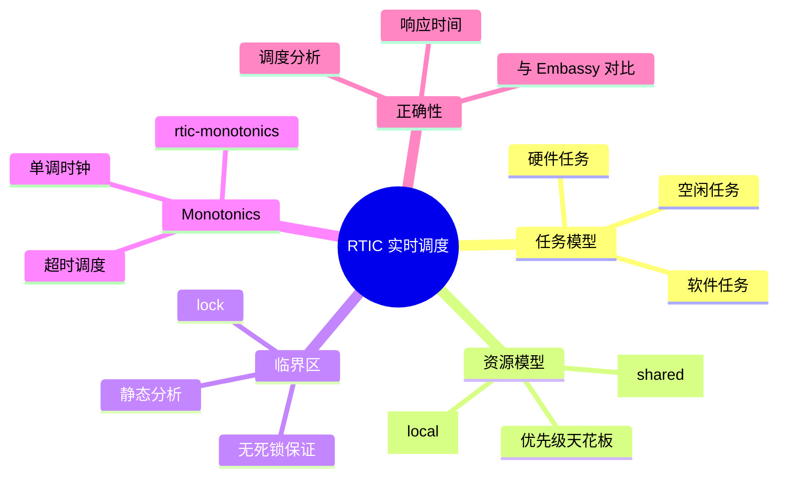
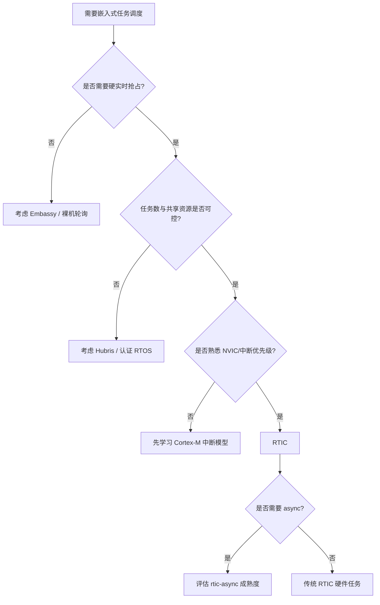

> **内容分级**: [专家级]
> **代码状态**: ⚠️ 裸机/目标平台相关代码标注 `rust,ignore`/`no_run`， host 平台无法直接编译
> **定理链**: N/A — 描述性/工程性文档
>
# RTIC 实时任务调度框架深度解析
>
> **EN**: RTIC Real-Time Task Scheduling Framework Deep Dive
> **Summary**: Deep dive into RTIC's priority-ceiling scheduling, resource analysis, monotonic timers, and scheduling correctness reasoning.
> **Rust 版本**: 1.97.0+ (Edition 2024)
>
> **受众**: [专家]
> **Bloom 层级**: L3-L4
> **权威来源**: 本文件为 `concept/` 权威页。
> **A/S/P 标记**: **S+A** — Structure + Application
> **双维定位**: P×App — 在资源受限硬件上实现可预测、无死锁的硬实时调度
> **定位**: 系统讲解 RTIC（Real-Time Interrupt-driven Concurrency）如何利用 Rust 所有权与 Cortex-M NVIC 优先级实现零开销、编译期可分析的实时任务调度；覆盖任务/资源模型、优先级天花板协议、`lock` 临界区、`rtic-monotonics`、软硬件任务、调度正确性推理及与 Embassy/裸机中断的对比。
> **前置概念**: [Rust 嵌入式系统开发](03_embedded_systems.md) · [Cortex-M 与 RISC-V 中断异常模型](14_interrupt_and_exception_model.md) · [no_std 同步原语](15_no_std_synchronization_primitives.md) · [异步 no_std 嵌入式](11_async_no_std_embedded.md) · [嵌入式 RTOS 与安全关键框架对比](26_embedded_rtos_and_safety_critical_frameworks.md)
> **后置概念**: [自定义裸机异步执行器](28_custom_bare_metal_async_executor.md) · [嵌入式调试与日志](20_embedded_debugging_logging.md) · [安全关键嵌入式 Rust 指南：MISRA-Rust、Ferrocene 与 IEC 61508](30_misra_rust_safety_critical_guidelines.md) · [Rust vs Ada/SPARK](../../05_comparative/01_systems_languages/07_rust_vs_ada_spark.md)

---

> **来源**: [RTIC](https://rtic.rs/) · [RTIC Book](https://rtic.rs/2/book/en/) · [RTIC GitHub](https://github.com/rtic-rs/rtic) · [The Embedded Rust Book](https://docs.rust-embedded.org/book/) · [The Rustonomicon](https://doc.rust-lang.org/nomicon/) · [cortex-m crate](https://docs.rs/cortex-m/) · [cortex-m-rt crate](https://docs.rs/cortex-m-rt/)

---

## 🧠 知识结构图



## 📑 目录

- [RTIC 实时任务调度框架深度解析](#rtic-实时任务调度框架深度解析)
  - [🧠 知识结构图](#-知识结构图)
  - [📑 目录](#-目录)
  - [一、权威定义](#一权威定义)
  - [二、任务与资源模型](#二任务与资源模型)
    - [2.1 硬件任务 vs 软件任务](#21-硬件任务-vs-软件任务)
    - [2.2 `#[shared]` 与 `#[local]`](#22-shared-与-local)
    - [2.3 优先级映射到 NVIC](#23-优先级映射到-nvic)
  - [三、优先级天花板协议与 `lock`](#三优先级天花板协议与-lock)
    - [3.1 优先级天花板原理](#31-优先级天花板原理)
    - [3.2 `lock` 临界区](#32-lock-临界区)
    - [3.3 无死锁的编译期保证](#33-无死锁的编译期保证)
  - [四、rtic-monotonics 与单调时钟](#四rtic-monotonics-与单调时钟)
  - [五、调度分析与响应时间](#五调度分析与响应时间)
  - [六、与裸机中断和 Embassy 的对比](#六与裸机中断和-embassy-的对比)
  - [七、完整 Rust 示例](#七完整-rust-示例)
    - [7.1 硬件任务 + 共享资源](#71-硬件任务--共享资源)
    - [7.2 软件任务与 Monotonic 调度](#72-软件任务与-monotonic-调度)
  - [八、反例与失效模式](#八反例与失效模式)
    - [8.1 反例：忘记把可变状态放入 `#[shared]`](#81-反例忘记把可变状态放入-shared)
    - [8.2 反例：在 `#[local]` 上尝试跨任务共享](#82-反例在-local-上尝试跨任务共享)
    - [8.3 反例：优先级倒置误用低优先级访问共享资源](#83-反例优先级倒置误用低优先级访问共享资源)
    - [8.4 边界：RTIC 不提供任务隔离](#84-边界rtic-不提供任务隔离)
  - [九、决策树：何时使用 RTIC](#九决策树何时使用-rtic)
  - [十、权威来源索引](#十权威来源索引)
  - [十一、相关概念](#十一相关概念)
  - [🧭 思维导图（Mindmap）](#-思维导图mindmap)
  - [国际化权威来源补充（International Authority Sources）](#国际化权威来源补充international-authority-sources)

---

## 一、权威定义

> **RTIC Book**: RTIC is a hardware-accelerated Rust concurrency runtime for single-core embedded systems. It uses the hardware interrupt priority mechanism to provide scheduling, and leverages Rust's ownership and type system to guarantee memory safety and deadlock freedom.

**RTIC（Real-Time Interrupt-driven Concurrency）**：一个基于硬件中断优先级的单核嵌入式并发运行时/框架。它将“任务”映射到中断优先级，将“共享资源”映射到 Rust 的所有权与借用规则，在编译期完成资源冲突分析，从而在不依赖运行时调度器的情况下实现抢占式硬实时调度。

**硬件任务（Hardware task）**：直接绑定到某个硬件中断向量（`#[task(binds = TIM2)]`）的任务。中断触发时立即以对应优先级执行。

**软件任务（Software task）**：不直接绑定硬件中断，而是由 `rtic-monotonics` 的单调时钟或软件触发器（`spawn`）调度到某个中断优先级上执行的任务。

**共享资源（Shared resource）**：多个任务可能访问的可变状态，必须在 `#[shared]` 结构体中声明，RTIC 据此计算优先级天花板。

**优先级天花板协议（Priority Ceiling Protocol, PCP）**：为每个资源分配一个等于所有访问该资源的任务中最高优先级的“天花板优先级”。任务访问资源时临时提升到该天花板，退出时恢复。PCP 可阻止优先级倒置并保证无死锁。

判定依据：RTIC 的核心创新在于把实时调度问题从运行时转移到编译期和硬件 NVIC，因此零运行时调度开销，且能提供形式化的无死锁保证。

---

## 二、任务与资源模型

### 2.1 硬件任务 vs 软件任务

| 类型 | 绑定对象 | 触发方式 | 典型用途 |
|:---|:---|:---|:---|
| **硬件任务** | NVIC 中断向量 | 外设硬件事件 | 定时器、ADC 采样完成、GPIO 边沿 |
| **软件任务** | 单调时钟/软件调度 | `spawn_at` / `spawn` | 周期性任务、超时处理、低优先级后台工作 |
| **空闲任务** | `#[idle]` | main 返回后运行 | 低功耗等待、看门狗喂狗 |

判定依据：选择硬件任务还是软件任务，取决于触发源是“外部硬件事件”还是“时间点/软件事件”。

### 2.2 `#[shared]` 与 `#[local]`

```rust,ignore
#[rtic::app(device = stm32f4::stm32f407, peripherals = true)]
mod app {
    #[shared]
    struct Shared {
        counter: u32,
        adc_buf: [u16; 8],
    }

    #[local]
    struct Local {
        led_state: bool,
    }

    #[init]
    fn init(cx: init::Context) -> (Shared, Local, init::Monotonics) {
        (
            Shared { counter: 0, adc_buf: [0; 8] },
            Local { led_state: false },
            init::Monotonics(),
        )
    }
}
```

- **`#[shared]`**：跨任务可见的可变状态，访问时必须通过 `cx.shared.<res>.lock(|r| { ... })`。
- **`#[local]`**：仅属于单个任务的资源，天然无数据竞争，不需要 lock。

> **认知功能**: RTIC 通过 `#[shared]`/`#[local]` 把“是否需要同步”从运行时检查提前到类型与宏分析阶段。

### 2.3 优先级映射到 NVIC

RTIC 任务的 `priority` 直接对应 NVIC 的中断优先级数值。在 Cortex-M 上：

- 数值越小优先级越低（与 NVIC 一致）。
- 高优先级任务可抢占低优先级任务。
- 同优先级任务不可相互抢占（RTIC 保证同优先级资源访问安全）。

```rust,ignore
#[task(binds = TIM2, priority = 2, shared = [counter])]
fn tick(mut cx: tick::Context) {
    cx.shared.counter.lock(|c| *c += 1);
}

#[task(binds = TIM3, priority = 3, shared = [counter])]
fn fast(mut cx: fast::Context) {
    // 优先级 3 > 2，fast 可抢占 tick；访问 counter 时由 lock 提升到天花板
    cx.shared.counter.lock(|c| *c = *c * 2);
}
```

---

## 三、优先级天花板协议与 `lock`

### 3.1 优先级天花板原理

每个共享资源的天花板优先级 = 所有可能访问它的任务中的最高优先级。

| 资源 | 访问任务与优先级 | 天花板优先级 |
|:---|:---|:---:|
| `counter` | `tick(2)`, `fast(3)` | 3 |
| `adc_buf` | `adc_done(4)`, `process(1)` | 4 |

当 `tick(2)` 调用 `counter.lock(...)` 时，RTIC 会临时把 CPU 优先级提升到 3。这样：

1. 任何优先级 ≤ 2 的任务无法抢占临界区；
2. 优先级 3 的任务 `fast` 本就可以访问同一资源，因此不会导致不一致；
3. 优先级 4 的任务无法进入，因为它不访问 `counter`（即使能抢占也不会破坏该资源）。

判定依据：PCP 只允许“访问同一资源的任务”之间的嵌套，从而消除循环等待条件。

### 3.2 `lock` 临界区

```rust,ignore
#[task(binds = TIM2, priority = 2, shared = [counter])]
fn tick(mut cx: tick::Context) {
    cx.shared.counter.lock(|counter| {
        // 临界区内 CPU 优先级被提升到 counter 的天花板
        *counter += 1;
    });
}
```

在底层，RTIC 使用 `BASEPRI`（或 `PRIMASK`，取决于架构与配置）屏蔽低于天花板优先级的 interrupts。临界区结束后恢复。

| 特性 | RTIC `lock` | 传统 RTOS 互斥量 |
|:---|:---|:---|
| 实现 | 硬件 BASEPRI 屏蔽 | 运行时队列/阻塞 |
| 开销 | 数条指令 | 上下文切换 + 队列 |
| 死锁 | 编译期排除 | 依赖正确使用 |
| 优先级倒置 | PCP 阻止 | 可能发生 |

### 3.3 无死锁的编译期保证

RTIC 通过以下规则在编译期排除死锁：

1. 资源的天花板优先级静态计算；
2. 任务访问资源时提升到该天花板；
3. 不允许在持有低天花板资源时请求高天花板资源（循环等待条件不成立）。

如果代码违反规则，通常表现为编译期错误：例如某个任务需要 lock 的资源未被声明在 `shared = [...]` 中，或资源访问模式导致无法静态证明安全。

---

## 四、rtic-monotonics 与单调时钟

> **RTIC Book — Monotonics**: A monotonic is a time source that never wraps within the lifetime of the application, or whose wrap is handled transparently by RTIC.

`rtic-monotonics` 提供单调时钟抽象，用于调度软件任务。单调性意味着 `Instant` 不会回退，便于做可靠的超时与周期调度。

```rust,ignore
#[rtic::app(device = stm32f4::stm32f407, dispatchers = [TIM5])]
mod app {
    use rtic_monotonics::systick::*;

    #[shared]
    struct Shared { counter: u32 }

    #[local]
    struct Local {}

    #[init]
    fn init(cx: init::Context) -> (Shared, Local, init::Monotonics) {
        let systick_mono = Systick::new(cx.core.SYST, 48_000_000);
        (
            Shared { counter: 0 },
            Local {},
            init::Monotonics(systick_mono),
        )
    }

    #[task(priority = 1, shared = [counter])]
    async fn periodic(mut cx: periodic::Context) {
        loop {
            // 每 500 ms 调度一次
            Systick::delay(500.millis()).await;
            cx.shared.counter.lock(|c| *c += 1);
        }
    }
}
```

支持的 monotonic 源包括 SysTick、nRF RTC、rp2040 Timer 等。软件任务通过 `dispatchers = [TIM5]` 指定一个或多个用于触发的 NVIC 中断向量。

---

## 五、调度分析与响应时间

RTIC 的调度分析可借助经典实时调度理论：

**响应时间分析（Response Time Analysis, RTA）**：对于任务 τ_i，最坏响应时间 R_i 满足

```text
R_i = C_i + Σ_{j ∈ hp(i)} ceil(R_i / T_j) * C_j
```

其中 `hp(i)` 表示优先级高于 τ_i 的任务集合，`C_i` 为最坏执行时间，`T_j` 为周期。

RTIC 中的额外因素：

- **临界区阻塞时间**：由于 PCP，任务可能被持有同资源天花板的低优先级任务阻塞一次，阻塞时间最长为该资源对应临界区的执行时间。
- **上下文切换开销**：由 NVIC 硬件完成，通常 12 个时钟周期量级。
- **调度抖动**：取决于时钟源精度与中断延迟。

判定依据：RTIC 不提供自动的 WCET/RTA 工具，但因其调度语义与 NVIC 一一对应，工程师可把标准响应时间分析直接套用到 RTIC 任务集上。

---

## 六、与裸机中断和 Embassy 的对比

| 维度 | 裸机中断 + 手写临界区 | RTIC | Embassy |
|:---|:---|:---|:---|
| **调度模型** | 手动 NVIC 管理 | 硬件优先级调度 | async executor 协作式 |
| **资源同步** | 手写 `cortex_m::interrupt::free` | PCP + `lock` | 基于所有权的 `&mut`、任务静态分配 |
| **死锁保证** | 无 | 编译期保证 | 单 executor 内无抢占，天然无死锁 |
| **抢占** | 完全手动 | 自动按优先级 | 需多 executor 或 async 边界 |
| **async 支持** | 无 | `rtic-async` 实验性 | 一等公民 |
| **确定性** | 取决于实现 | 高，与 NVIC 直接对应 | 较好，但受 executor 轮询影响 |
| **内存** | 完全可控 | 静态 | 静态 arena |

判定依据：

- 硬实时、强抢占、资源同步复杂 → RTIC；
- 协议栈密集、I/O 并发多、不需要严格硬实时证明 → Embassy；
- 极简单场景或教学 → 裸机中断。

---

## 七、完整 Rust 示例

### 7.1 硬件任务 + 共享资源

```rust,ignore
#![no_std]
#![no_main]

#[rtic::app(device = stm32f4::stm32f407, peripherals = true)]
mod app {
    use stm32f4xx_hal::prelude::*;

    #[shared]
    struct Shared {
        counter: u32,
    }

    #[local]
    struct Local {
        led: Pin<'static, Output<PushPull>>,
    }

    #[init]
    fn init(cx: init::Context) -> (Shared, Local, init::Monotonics) {
        let dp = cx.device;
        let rcc = dp.RCC.constrain();
        let clocks = rcc.cfgr.sysclk(48.MHz()).freeze();

        let gpioa = dp.GPIOA.split();
        let led = gpioa.pa5.into_push_pull_output();

        // 配置 TIM2 为 1 Hz 定时器（伪代码，依赖具体 HAL）
        let mut timer = dp.TIM2.counter_hz(&clocks);
        timer.start(1.Hz()).unwrap();
        timer.listen(Event::Update);

        (Shared { counter: 0 }, Local { led }, init::Monotonics())
    }

    #[task(binds = TIM2, priority = 1, shared = [counter])]
    fn tick(mut cx: tick::Context) {
        cx.shared.counter.lock(|c| {
            *c += 1;
            if *c % 2 == 0 {
                cx.local.led.toggle();
            }
        });
    }

    #[idle]
    fn idle(_: idle::Context) -> ! {
        loop {
            cortex_m::asm::wfi();
        }
    }
}
```

### 7.2 软件任务与 Monotonic 调度

```rust,ignore
#![no_std]
#![no_main]

#[rtic::app(device = stm32f4::stm32f407, dispatchers = [TIM5])]
mod app {
    use rtic_monotonics::systick::*;

    #[shared]
    struct Shared { adc_value: u16 }

    #[local]
    struct Local {}

    #[init]
    fn init(cx: init::Context) -> (Shared, Local, init::Monotonics) {
        let systick = Systick::new(cx.core.SYST, 48_000_000);
        periodic::spawn().ok();
        (Shared { adc_value: 0 }, Local {}, init::Monotonics(systick))
    }

    #[task(priority = 2, shared = [adc_value])]
    async fn sample(mut cx: sample::Context) {
        loop {
            // 模拟 100 ms 采样周期
            Systick::delay(100.millis()).await;
            let raw = read_adc();
            cx.shared.adc_value.lock(|v| *v = raw);
        }
    }

    #[task(priority = 1, shared = [adc_value])]
    async fn report(mut cx: report::Context) {
        loop {
            Systick::delay(1.secs()).await;
            cx.shared.adc_value.lock(|v| {
                defmt::info!("adc={}", *v);
            });
        }
    }

    fn read_adc() -> u16 {
        // 依赖具体 HAL 的占位实现
        0
    }
}
```

---

## 八、反例与失效模式

### 8.1 反例：忘记把可变状态放入 `#[shared]`

```rust,ignore,compile_fail
#[rtic::app(device = stm32f4::stm32f407)]
mod app {
    #[shared]
    struct Shared { counter: u32 }

    #[task(binds = TIM2, priority = 1)]
    fn tick(_cx: tick::Context) {
        // ❌ 编译错误：counter 未在此任务中声明
        // cx.shared.counter.lock(|c| *c += 1);
    }
}
```

> **修正**：所有跨任务共享的可变状态必须在任务属性的 `shared = [...]` 中列出。

### 8.2 反例：在 `#[local]` 上尝试跨任务共享

```rust,ignore,compile_fail
#[rtic::app(device = stm32f4::stm32f407)]
mod app {
    #[local]
    struct Local { buffer: [u8; 16] }

    #[task(binds = TIM2, priority = 1, local = [buffer])]
    fn a(cx: a::Context) {
        cx.local.buffer[0] = 1;
    }

    // ❌ 编译错误：buffer 已属于任务 a，不能再分配给任务 b
    #[task(binds = TIM3, priority = 2, local = [buffer])]
    fn b(cx: b::Context) {
        cx.local.buffer[0] = 2;
    }
}
```

> **修正**：跨任务状态应放入 `#[shared]` 并通过 `lock` 访问。

### 8.3 反例：优先级倒置误用低优先级访问共享资源

**场景**：高优先级任务持有 `adc_buf` 时间过长，导致低优先级任务 `process` 反复被阻塞， missed deadline。

```rust,ignore
#[task(binds = DMA1, priority = 4, shared = [adc_buf])]
fn adc_done(mut cx: adc_done::Context) {
    cx.shared.adc_buf.lock(|buf| {
        // ❌ 危险：在临界区内执行重型滤波
        heavy_filter(buf);
    });
}

#[task(binds = TIM3, priority = 2, shared = [adc_buf])]
fn process(mut cx: process::Context) {
    cx.shared.adc_buf.lock(|buf| {
        // 由于 adc_done 的天花板为 4，此处会被提升到 4，
        // 但 adc_done 的执行时间直接决定了 process 的最坏阻塞
        consume(buf);
    });
}
```

> **修正**：缩短临界区，把重型计算移到临界区外；必要时使用双缓冲（ping-pong buffer）或无锁队列。

### 8.4 边界：RTIC 不提供任务隔离

**命题**：“RTIC 的无死锁保证等同于任务崩溃隔离。”

**现实**：RTIC 的任务共享同一地址空间，一个任务的 panic/越界会影响整个固件。若需要任务级故障隔离，应选择 Hubris 或 Tock 等具备 MPU/进程隔离的方案，而不是 RTIC。

---

## 九、决策树：何时使用 RTIC



---

## 十、权威来源索引

- **[RTIC](https://rtic.rs/)** — RTIC 实时中断驱动并发框架官方网站。
- **[RTIC Book](https://rtic.rs/2/book/en/)** — RTIC 官方书籍，覆盖任务、资源、monotonics、调度分析与最佳实践。
- **[RTIC GitHub](https://github.com/rtic-rs/rtic)** — 源码、示例与 issue 跟踪。
- **[The Embedded Rust Book](https://docs.rust-embedded.org/book/)** — Rust 嵌入式开发通用基础。
- **[The Rustonomicon](https://doc.rust-lang.org/nomicon/)** — `unsafe`、所有权与并发内存模型参考。
- **[cortex-m crate](https://docs.rs/cortex-m/)** / **[cortex-m-rt crate](https://docs.rs/cortex-m-rt/)** — NVIC 与启动运行时参考。

> **权威来源对齐变更日志**: 2026-08-03 创建

---

## 十一、相关概念

- [Rust 嵌入式系统开发](03_embedded_systems.md)
- [Cortex-M 与 RISC-V 中断异常模型](14_interrupt_and_exception_model.md)
- [no_std 同步原语](15_no_std_synchronization_primitives.md)
- [异步 no_std 嵌入式](11_async_no_std_embedded.md)
- [嵌入式 RTOS 与安全关键框架对比](26_embedded_rtos_and_safety_critical_frameworks.md)
- [自定义裸机异步执行器](28_custom_bare_metal_async_executor.md)
- [嵌入式调试与日志](20_embedded_debugging_logging.md)

---

**文档版本**: 1.0
**最后更新**: 2026-08-03
**状态**: ✅ 概念文件创建完成

---

## 🧭 思维导图（Mindmap）

```mermaid
mindmap
  root((RTIC 实时调度))
    任务模型
      硬件任务
      软件任务
      空闲任务
    资源模型
      #[shared]
      #[local]
      优先级天花板
    临界区
      lock
      BASEPRI 屏蔽
      静态分析
    Monotonics
      rtic-monotonics
      SysTick / RTC
      周期调度
    正确性
      响应时间分析
      无死锁保证
      与 Embassy 对比
    反例
      未声明 shared
      local 跨任务共享
      临界区过长
      无任务隔离
```



> **认知功能**: 本 mindmap 从任务/资源模型、优先级天花板、单调时钟、调度分析与常见反例五个维度组织 RTIC 核心概念，可作为硬实时嵌入式调度选型的快速导航索引。

## 国际化权威来源补充（International Authority Sources）

- <https://rtic.rs/2/book/en/>
- <https://docs.rust-embedded.org/book/>
- <https://doc.rust-lang.org/nomicon/>
