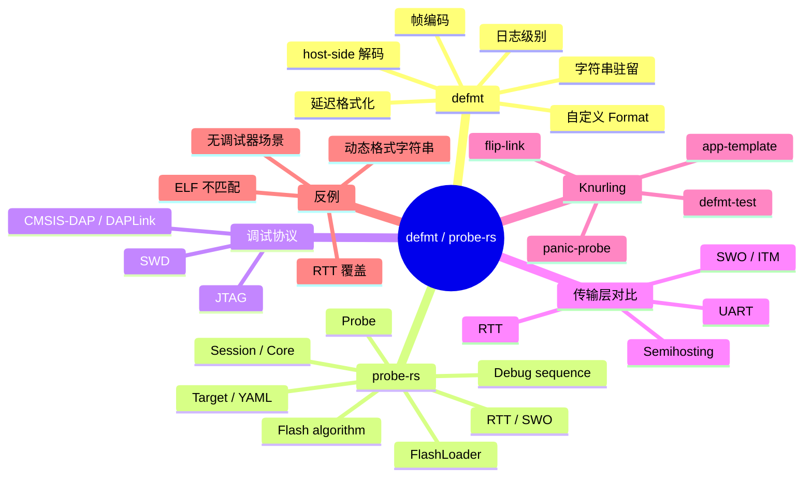
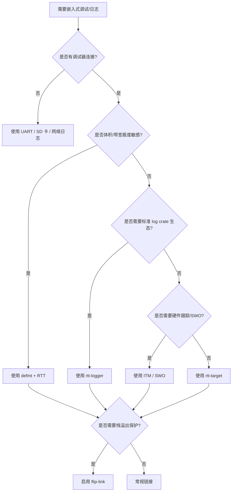
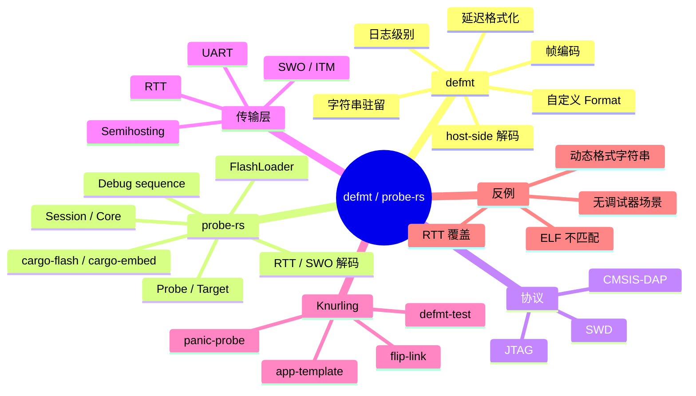

> **内容分级**: [专家级]
> **代码状态**: ⚠️ 裸机/目标平台相关代码标注 `rust,ignore`/`no_run`，host 平台无法直接编译
> **定理链**: N/A — 描述性/工程性文档
>
> **本节关键术语**: defmt · probe-rs · deferred formatting · RTT · SWO · ITM · semihosting · DAP · SWD · JTAG · flash algorithm · debug sequence — [完整对照表](../../00_meta/01_terminology/01_terminology_glossary.md)

# defmt 与 probe-rs 调试架构

> **EN**: defmt and probe-rs Debugging Architecture
> **Summary**: Architecture and protocol principles of the defmt log frame format, host-side decoding, probe-rs probe/flash/RTT/SWO abstractions, and trade-offs against ITM, semihosting, and UART logging.
> **Rust 版本**: 1.97.0+ (Edition 2024)

> **受众**: [进阶]
> **Bloom 层级**: L3
> **权威来源**: 本文件为 `concept/` 权威页。
> **A/S/P 标记**: **S+A** — Structure + Application
> **双维定位**: P×App — 理解并组装面向裸机的低带宽、低侵入调试链路
> **定位**: 系统讲解 Rust 嵌入式调试的事实标准链路——defmt 的帧编码与压缩、probe-rs 的探针/目标/会话/烧录/RTT/SWO 架构、DAP/JTAG/SWD 协议差异、flash algorithm 与 debug sequence、Knurling 工具链实践，以及与 ITM/semihosting/RTT/UART 的 trade-off。
> **前置概念**: [Rust 嵌入式系统开发](03_embedded_systems.md) · [嵌入式调试与日志](20_embedded_debugging_logging.md) · [no_std 启动流程与运行时深度解析](27_no_std_startup_runtime_deep_dive.md)
> **后置概念**: [安全关键嵌入式 Rust 指南：MISRA-Rust、Ferrocene 与 IEC 61508](30_misra_rust_safety_critical_guidelines.md) · [no_std Rust 中的嵌入式网络与 IoT 协议](31_embedded_networking_and_iot_protocols.md) · [嵌入式测试与 CI 策略](32_embedded_testing_and_ci_strategies.md) · [Rust vs Ada/SPARK](../../05_comparative/01_systems_languages/07_rust_vs_ada_spark.md)

---

> **来源**: [defmt book](https://defmt.ferrous-systems.com/) ·
> [defmt crate](https://crates.io/crates/defmt) ·
> [probe-rs](https://probe.rs/) ·
> [probe-rs crate](https://crates.io/crates/probe-rs) ·
> [Knurling](https://knurling.ferrous-systems.com/) ·
> [flip-link](https://github.com/knurling-rs/flip-link) ·
> [app-template](https://github.com/knurling-rs/app-template) ·
> [rtt-target](https://github.com/probe-rs/rtt-target) ·
> [rtt-logger](https://github.com/t-moe/rtt-logger) ·
> [The Embedded Rust Book](https://docs.rust-embedded.org/book/index.html) ·
> [The Embedonomicon](https://docs.rust-embedded.org/embedonomicon/) ·
> [ARM CoreSight Documentation](https://developer.arm.com/documentation/100863/latest/)

---

## 🧠 知识结构图



---

## 📑 目录

- [defmt 与 probe-rs 调试架构](#defmt-与-probe-rs-调试架构)
  - [🧠 知识结构图](#-知识结构图)
  - [📑 目录](#-目录)
  - [一、权威定义](#一权威定义)
  - [二、defmt 架构与帧协议](#二defmt-架构与帧协议)
    - [2.1 Deferred formatting 核心思想](#21-deferred-formatting-核心思想)
    - [2.2 帧结构与编码](#22-帧结构与编码)
    - [2.3 字符串驻留与压缩](#23-字符串驻留与压缩)
    - [2.4 日志级别与过滤](#24-日志级别与过滤)
    - [2.5 自定义 Formatters](#25-自定义-formatters)
    - [2.6 Host-side 解码](#26-host-side-解码)
  - [三、probe-rs 架构](#三probe-rs-架构)
    - [3.1 核心抽象](#31-核心抽象)
    - [3.2 Probe 驱动后端](#32-probe-驱动后端)
    - [3.3 Flash 算法与烧录流程](#33-flash-算法与烧录流程)
    - [3.4 Debug sequences](#34-debug-sequences)
    - [3.5 RTT 与 SWO 集成](#35-rtt-与-swo-集成)
  - [四、传输层与协议对比](#四传输层与协议对比)
    - [4.1 RTT](#41-rtt)
    - [4.2 SWO / ITM](#42-swo--itm)
    - [4.3 Semihosting](#43-semihosting)
    - [4.4 UART 日志](#44-uart-日志)
    - [4.5 综合对比](#45-综合对比)
  - [五、Knurling 工具链](#五knurling-工具链)
    - [5.1 app-template](#51-app-template)
    - [5.2 flip-link 栈溢出保护](#52-flip-link-栈溢出保护)
    - [5.3 defmt-test](#53-defmt-test)
  - [六、完整 Rust 示例](#六完整-rust-示例)
    - [6.1 最小 defmt + probe-rs 项目](#61-最小-defmt--probe-rs-项目)
    - [6.2 Embed.toml 配置](#62-embedtoml-配置)
    - [6.3 flip-link 配置](#63-flip-link-配置)
  - [七、反例与失效模式](#七反例与失效模式)
    - [7.1 反例：动态格式字符串](#71-反例动态格式字符串)
    - [7.2 反例：ELF 与固件版本不匹配](#72-反例elf-与固件版本不匹配)
    - [7.3 反例：过度日志导致 RTT 覆盖](#73-反例过度日志导致-rtt-覆盖)
    - [7.4 边界：defmt 不能替代通用 UART](#74-边界defmt-不能替代通用-uart)
  - [八、决策树：调试链路选型](#八决策树调试链路选型)
  - [九、权威来源索引](#九权威来源索引)
  - [🧭 思维导图（Mindmap）](#-思维导图mindmap)
  - [权威来源与延伸阅读（International Authority Sources）](#权威来源与延伸阅读international-authority-sources)

---

## 一、权威定义

> **defmt docs**: defmt is a highly efficient logging framework that targets resource-constrained devices. It achieves efficiency by deferring formatting to the host and encoding log messages as compact binary frames.

**defmt（deferred formatting）**：把日志格式化从目标端推迟到主机端的轻量级日志框架。目标端只输出紧凑二进制帧，主机端结合 ELF 文件中的 `.defmt` 段还原为可读日志。

**probe-rs**：用 Rust 编写的跨平台调试与烧录工具链，提供统一的 Probe / Target / Session / Core / FlashLoader 抽象，支持 SWD/JTAG 协议和众多 ARM/RISC-V 目标。

**Knurling**：Ferrous Systems 推出的嵌入式 Rust 工具集合，包括 `defmt`、`flip-link`、`app-template`、`defmt-test`、`probe-run` 等，目标是以最小工程摩擦建立可观测、可测试的裸机项目。

**SWD（Serial Wire Debug）**：ARM 推出的两线调试接口（SWDIO + SWCLK），替代传统 JTAG 的四线或五线接口，广泛用于 Cortex-M MCU。

**CMSIS-DAP / DAPLink**：ARM 定义的开源调试 probe 固件接口标准，允许低成本 probe 实现 SWD/JTAG 访问，被 probe-rs 原生支持。

**RTT（Real-Time Transfer）**：SEGGER 提出的基于目标 RAM 环形缓冲区的双向调试通信机制，probe-rs 开源实现后成为 defmt 的主要传输通道。

**ITM（Instrumentation Trace Macrocell）** 与 **SWO（Serial Wire Output）**：ARM CoreSight 调试架构中的轻量级跟踪组件。ITM 提供 32 个软件可写的 stimulus port，数据可通过 SWO 单线输出，不占用 UART 也不依赖 RAM 环形缓冲区。

判定依据：理解 defmt/probe-rs 的关键在于把“日志链路”拆成三个独立层：目标端编码（defmt）、传输通道（RTT / SWO / semihosting）、主机端解码与工程化（probe-rs / defmt-decoder / Knurling）。

---

## 二、defmt 架构与帧协议

### 2.1 Deferred formatting 核心思想

传统日志在目标端格式化完整字符串；defmt 把格式字符串与类型信息驻留在 ELF 中，运行时只传输索引与原始参数。

```text
传统日志:
  目标端: format!("temp={} C, adc={}", t, adc)
  传输  : "temp=25 C, adc=1023" (约 20 字节)

defmt:
  目标端: 发送 (msg_id, t, adc)
  传输  : 数字节
  主机端: 查询 ELF .defmt 段，输出 "temp=25 C, adc=1023"
```

### 2.2 帧结构与编码

defmt 帧由宏在编译期生成，运行时通过注册的 global logger 发送。典型帧包括：

| 字段 | 说明 |
|:---|:---|
| 帧头 | 日志级别、帧类型、是否携带时间戳等控制信息 |
| 消息索引 | 指向 ELF `.defmt` 段中格式字符串的索引，通常使用变长整数编码 |
| 时间戳（可选） | `defmt::timestamp!` 提供的单调时间戳 |
| 参数 | 按类型编码的原始值：整数、浮点、枚举标签、切片长度等 |
| 动态数据 | `[u8]`、`str` 等变长载荷 |

> **注意**：defmt 的具体二进制格式属于实现细节，不同版本可能变化。关键认知是“目标端只传索引和原始数据”，主机端必须持有完全匹配的 ELF 才能解码。

### 2.3 字符串驻留与压缩

编译期，defmt 扫描源码中的 `defmt::info!` 等宏调用，将：

- 格式字符串；
- 枚举标签的 `Debug`/`Display` 字符串；
- 自定义 `Format` 实现中的片段；

写入 ELF 的专用段。运行时不再携带这些字符串，只携带索引。

```rust,ignore
// 目标端只发索引和两个 u32
defmt::info!("Sensor reading: temp={}, pressure={}", temp, pressure);
```

> **压缩效果**: 对于大量重复格式模板、固定枚举值的日志，defmt 可让固件体积减小一个数量级。

### 2.4 日志级别与过滤

defmt 提供五个日志级别：`trace`、`debug`、`info`、`warn`、`error`。过滤可以在编译期通过 feature 控制，也可以在主机端通过 `DEFMT_LOG` 环境变量按模块粒度过滤。

```toml
# Cargo.toml
[features]
defmt-default = []
defmt-trace = []
defmt-debug = []
defmt-info = []
defmt-warn = []
defmt-error = []
```

### 2.5 自定义 Formatters

为自定义类型实现 `defmt::Format`，让主机端按自定义格式解码：

```rust,ignore
use defmt::Format;

#[derive(Format)]
struct SensorReading {
    temperature: i16,
    humidity: u8,
}

defmt::info!("reading: {}", SensorReading { temperature: 250, humidity: 60 });
```

判定依据：自定义 formatter 进一步减少目标端需要传输的字节数，同时保持日志可读性。

### 2.6 Host-side 解码

主机端解码由 `defmt-decoder` crate 完成，`probe-rs` / `cargo-embed` / `defmt-print` 都依赖它。解码流程：

1. 读取固件 ELF，解析 `.defmt` 段中的字符串表与类型表；
2. 从传输层（RTT/SWO/文件）读取二进制帧；
3. 按帧中的消息索引查找格式字符串；
4. 将原始参数按类型格式化并输出。

```text
编译期:
  源码 → 宏展开 → .defmt 段（ELF 中）

运行时:
  目标写 RTT up-buffer 二进制帧
  probe-rs 轮询 up-buffer
  probe-rs 读取 ELF .defmt 段
  defmt-decoder 格式化
  终端输出可读日志
```

> **工程要点**：主机端解码强依赖 ELF。CI 必须保存 ELF artifact，现场调试必须携带对应版本 ELF，否则日志不可读。

---

## 三、probe-rs 架构

### 3.1 核心抽象

```text
probe-rs crate 架构:

  CLI 工具
  ├── cargo-flash    : 编译 + 烧录
  ├── cargo-embed    : 烧录 + RTT 日志 + 配置脚本
  └── probe-rs       : 通用底层 CLI

  库层
  ├── Probe          : 枚举/选择/打开调试器
  ├── Target         : 芯片描述（YAML 定义）
  ├── Session        : 与目标的连接会话
  ├── Core           : 寄存器/内存/断点/单步
  ├── FlashLoader    : Flash 算法抽象
  └── Rtt            : RTT 环形缓冲区读写
```

probe-rs 的关键设计是把**芯片描述（target definition）**与**调试器协议**解耦。芯片厂商或社区维护 YAML target 文件，probe-rs 据此加载 Flash 算法与内存映射，用户无需编写 OpenOCD TCL 脚本。

### 3.2 Probe 驱动后端

| 后端 | 协议 | 典型硬件 |
|:---|:---|:---|
| **CMSIS-DAP / DAPLink** | SWD/JTAG | 开源低成本 probe、nRF52840-DK |
| **ST-Link (V2/V3)** | SWD/JTAG | STM32 开发板 |
| **J-Link** | SWD/JTAG | SEGGER 官方 probe |
| **FTDI** | JTAG/SWD（部分） | FT2232H 等 USB-JTAG 转接板 |

### 3.3 Flash 算法与烧录流程

Flash 算法在 probe-rs 中由 Rust 实现并内置于 target YAML 中。烧录流程：

1. 连接 probe，识别 target；
2. 执行芯片特定的 **debug sequence**（如复位、解锁、连接时序）；
3. 复位并 halt；
4. 根据 ELF 加载地址，将固件写入 Flash；
5. 校验（可选）；
6. 复位并运行。

```bash
# 常见命令
cargo flash --chip nRF52840_xxAA --release
probe-rs run --chip nRF52840_xxAA target/thumbv7em-none-eabihf/release/app
probe-rs attach --chip nRF52840_xxAA
```

### 3.4 Debug sequences

不同芯片在连接、复位、解锁阶段有特定时序要求。probe-rs 把这些时序抽象为 **debug sequences**，用 Rust 代码写在 `probe-rs-targets` 或 probe-rs 源码中。例如：

- nRF52 系列需要 `connect_under_reset` 才能在部分低功耗状态下连接；
- STM32 部分型号需要发送特定 DBGMCU 配置才能保持调试域时钟；
- ATSAMD 系列需要解锁序列才能烧录。

用户通常无需关心具体序列，但在遇到连接失败时可通过 `--connect-under-reset`、`-speed`、`-protocol` 等参数调试。

### 3.5 RTT 与 SWO 集成

probe-rs 自动扫描目标 RAM 中的 `_SEGGER_RTT` 控制块，并轮询 up-buffer 读取日志。defmt 帧通过 RTT up-channel 0 发送，probe-rs 在主机端解码。

对于支持 SWO 的 probe，probe-rs 也可通过 SWO 引脚读取 ITM 数据，作为 RTT 的补充或替代。

---

## 四、传输层与协议对比

### 4.1 RTT

RTT 使用目标 RAM 中的环形缓冲区，调试器通过 SWD/JTAG 在后台读取。优点：速度快、不占用 UART/USB、双向；缺点：需要调试器持续连接、掉线时日志丢失、缓冲区可能覆盖。

### 4.2 SWO / ITM

SWO 是 ARM CoreSight 的单线跟踪输出；ITM 是提供 32 个 stimulus port 的软件跟踪宏单元。写入 ITM port 的数据经 TPIU 打包后从 SWO 输出。

优点：

- 不占用 RAM 环形缓冲区；
- 不占用 UART 引脚；
- 对目标运行时影响极小（单次写寄存器）。

缺点：

- 需要支持 SWO 的调试器（部分 CMSIS-DAP 不支持）；
- SWO 引脚可能被 GPIO 复用；
- 只能单向输出。

```rust,ignore
// 使用 cortex-m crate 写 ITM stimulus port 0
use cortex_m::peripheral::ITM;

unsafe {
    (*ITM::ptr()).stim[0].write('A' as u32);
}
```

### 4.3 Semihosting

Semihosting 让目标通过调试器陷阱调用主机功能（如 `printf`、文件 I/O、`exit`）。在 ARM Cortex-M 上通常通过 `BKPT 0xAB` 实现。

优点：零外设依赖、可调用主机 `exit`；缺点：极慢、显著改变时序、只能用于开发与测试。

```rust,ignore
use cortex_m_semihosting::hprintln;

fn main() -> ! {
    loop {
        hprintln!("Hello from target").unwrap();
    }
}
```

### 4.4 UART 日志

UART 是传统嵌入式日志方式，不依赖调试器，适合现场部署与长期监测。缺点是需要占用 UART 外设和引脚，格式化在目标端完成，体积与功耗较大。

### 4.5 综合对比

| 维度 | defmt+RTT | rtt-target | SWO/ITM | Semihosting | UART |
|:---|:---|:---|:---|:---|:---|
| 目标端格式化 | ❌ 无 | ✅ 有 | ✅ 有 | ✅ 有 | ✅ 有 |
| 固件体积 | 最小 | 中 | 中 | 中 | 中/大 |
| 带宽需求 | 低 | 中 | 高 | 极低 | 受波特率限制 |
| 主机端依赖 | probe-rs + ELF | probe-rs / J-Link | 支持 SWO 的调试器 | 调试器 | 串口转 USB |
| 动态格式字符串 | ❌ 不支持 | ✅ 支持 | ✅ 支持 | ✅ 支持 | ✅ 支持 |
| 额外引脚 | 否 | 否 | 可能（SWO） | 否 | 是（TX/RX） |
| 生产使用 | ✅ 适合 | ✅ 适合 | ✅ 适合 | ❌ 不适合 | ✅ 适合 |
| 现场无调试器 | ❌ 不可行 | ❌ 不可行 | ❌ 不可行 | ❌ 不可行 | ✅ 可行 |

判定依据：

- 开发阶段、带宽/体积敏感 → defmt + RTT；
- 需要动态格式字符串或通用调试器兼容性 → rtt-target；
- 需要高速、低侵入跟踪且硬件支持 → SWO/ITM；
- 测试退出/简单 bring-up → semihosting；
- 现场长期监测、无调试器 → UART。

---

## 五、Knurling 工具链

### 5.1 app-template

[knurling-rs/app-template](https://github.com/knurling-rs/app-template) 是一个开箱即用的裸机项目模板，预配置：

- `defmt` 日志；
- `panic-probe`（panic 时通过 defmt 输出并 halt）；
- `cortex-m-rt` 启动代码；
- `probe-rs run` / `cargo-embed` runner；
- 推荐目录结构与 `.cargo/config.toml`。

### 5.2 flip-link 栈溢出保护

[flip-link](https://github.com/knurling-rs/flip-link) 是一种链接器包装器，通过把栈底放到 RAM 最高地址、向低地址生长，并在栈底下方放置一个 guard 页，使栈溢出时立即触发 HardFault，而不是静默破坏 `.bss`/堆。

```text
传统布局（栈向低地址生长，紧邻 .bss）:
  RAM 高地址 ← 栈顶
  ...
  栈底 → 紧邻 .bss
  .bss / .data
  栈溢出会静默破坏全局变量

flip-link 布局（栈独立放置）:
  RAM 最高地址 ← 栈顶
  ...
  栈底 + guard 页
  .bss / .data 位于 RAM 低地址
  溢出触发 MPU fault / HardFault
```

启用方式：

```toml
# .cargo/config.toml
[target.thumbv7em-none-eabihf]
rustflags = ["-C", "linker=flip-link"]
```

> **flip-link 要求**: 链接脚本需支持 `_stack_start`/`_stack_end` 分离定义；使用 `cortex-m-rt` 的 `link.x` 通常开箱可用。

### 5.3 defmt-test

`defmt-test` 提供在目标上运行的 `#[test]` 风格测试框架，与 `embedded-test` 不同，它更轻量，主要依赖 defmt 与 probe-rs 输出测试结果。

---

## 六、完整 Rust 示例

### 6.1 最小 defmt + probe-rs 项目

```rust,ignore
// src/main.rs
#![no_std]
#![no_main]

use defmt::*;
use defmt_rtt as _;
use panic_probe as _;

use cortex_m_rt::entry;

#[entry]
fn main() -> ! {
    info!("booting");

    let mut counter: u32 = 0;
    loop {
        info!("counter: {}", counter);
        counter += 1;
        cortex_m::asm::delay(48_000_000); // 约 1 s @ 48 MHz
    }
}
```

```toml
# Cargo.toml
[package]
name = "defmt_demo"
edition = "2024"

[dependencies]
cortex-m = "0.7"
cortex-m-rt = "0.7"
defmt = "0.3"
defmt-rtt = "0.4"
panic-probe = { version = "0.3", features = ["print-defmt"] }

[profile.release]
debug = 2
lto = true
```

```toml
# .cargo/config.toml
[target.thumbv7em-none-eabihf]
runner = "probe-rs run --chip nRF52840_xxAA"
rustflags = ["-C", "link-arg=-Tlink.x"]

[build]
target = "thumbv7em-none-eabihf"

[unstable]
build-std = ["core", "compiler_builtins"]
build-std-features = ["compiler-builtins-mem"]
```

### 6.2 Embed.toml 配置

```toml
# Embed.toml
[default.general]
chip = "nRF52840_xxAA"

[default.rtt]
enabled = true
channels = [
    { up = 0, name = "defmt", format = "Defmt" },
    { up = 1, name = "log", format = "String" },
]

[default.gdb]
enabled = false
```

### 6.3 flip-link 配置

```toml
# .cargo/config.toml
[target.thumbv7em-none-eabihf]
runner = "probe-rs run --chip nRF52840_xxAA"
rustflags = [
    "-C", "linker=flip-link",
    "-C", "link-arg=-Tlink.x",
]
```

---

## 七、反例与失效模式

### 7.1 反例：动态格式字符串

```rust,ignore
// ❌ 错误：defmt 不支持动态格式模板
let fmt = "x={}";
defmt::info!("{}", fmt, x);
```

> **修正**：所有模板必须是编译期字面量。需要动态内容时使用 `{=[u8]}` 或 `{=str}` 传输切片。

### 7.2 反例：ELF 与固件版本不匹配

**场景**：CI 保存了固件 `.bin` 但没保存对应 `.elf`，现场调试时 probe-rs 无法正确解码 defmt。

> **修正**：始终将 ELF 作为构建产物 artifact 保存；发布版本中保留 `debug = 2` 以便源码级调试。

### 7.3 反例：过度日志导致 RTT 覆盖

```rust,ignore
// ❌ 错误：在 tight loop 中高频输出 defmt
loop {
    defmt::trace!("sample={}", adc.read());
}
```

RTT up-buffer 是环形缓冲区。写入速度超过主机拉取速度时，新数据覆盖旧数据，造成静默日志丢失。

> **修正**：降低日志频率、聚合采样批次、增加 buffer 大小，或在关键路径使用非覆盖模式。

### 7.4 边界：defmt 不能替代通用 UART

**命题**：“defmt 体积最小、速度最快，所以所有项目都应该用它。”

**现实**：defmt 依赖 probe-rs 和对应 ELF。如果现场只有 USB-UART、没有调试器，或需要把日志持久化到 SD 卡/网络，defmt 无法工作。UART / rtt-target / 自定义日志后端才是正确选择。

---

## 八、决策树：调试链路选型



---

## 九、权威来源索引

- **[defmt book](https://defmt.ferrous-systems.com/)** — 官方文档：deferred formatting、帧格式、formatter、日志级别、cargo 集成。
- **[defmt crate](https://crates.io/crates/defmt)** — crates.io 页面与 API 文档入口。
- **[probe-rs](https://probe.rs/)** — 官方网站与 CLI/库文档。
- **[probe-rs crate](https://crates.io/crates/probe-rs)** — Rust 库 API 文档入口。
- **[Knurling](https://knurling.ferrous-systems.com/)** — Ferrous Systems 的嵌入式 Rust 工具集门户。
- **[flip-link](https://github.com/knurling-rs/flip-link)** — 栈溢出保护链接器包装器。
- **[app-template](https://github.com/knurling-rs/app-template)** — Knurling 推荐的项目模板。
- **[rtt-target](https://github.com/probe-rs/rtt-target)** — no_std RTT 实现。
- **[rtt-logger](https://github.com/t-moe/rtt-logger)** — `log` crate 到 RTT 的桥接。
- **[ARM CoreSight Documentation](https://developer.arm.com/documentation/100863/latest/)** — ARM CoreSight 调试与跟踪架构官方参考，覆盖 ITM/SWO/DWT/FPB。
- **[The Embedded Rust Book](https://docs.rust-embedded.org/book/index.html)** — Rust 嵌入式通用参考。
- **[The Embedonomicon](https://docs.rust-embedded.org/embedonomicon/)** — 裸机底层实现细节。

> **权威来源对齐变更日志**: 2026-08-03 补齐

---

## 🧭 思维导图（Mindmap）



> **认知功能**: 本 mindmap 从 defmt 编码、probe-rs 架构、调试协议、传输层对比、Knurling 工具链与反例六个维度组织调试链路知识，可作为裸机项目可观测性方案选型的快速导航索引。

---

## 权威来源与延伸阅读（International Authority Sources）

- defmt 官方文档：<https://defmt.ferrous-systems.com/>
- probe-rs 官方网站：<https://probe.rs/>
- Knurling Books：<https://knurling-books.org/>
- The Rust Programming Language（TRPL）：<https://doc.rust-lang.org/book/>
- RustBelt（Rust 形式化基础）：<https://plv.mpi-sws.org/rustbelt/>
