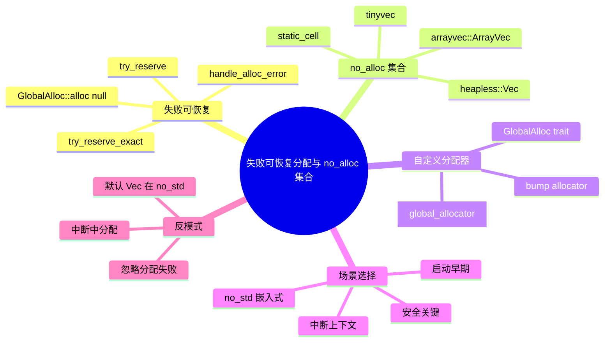
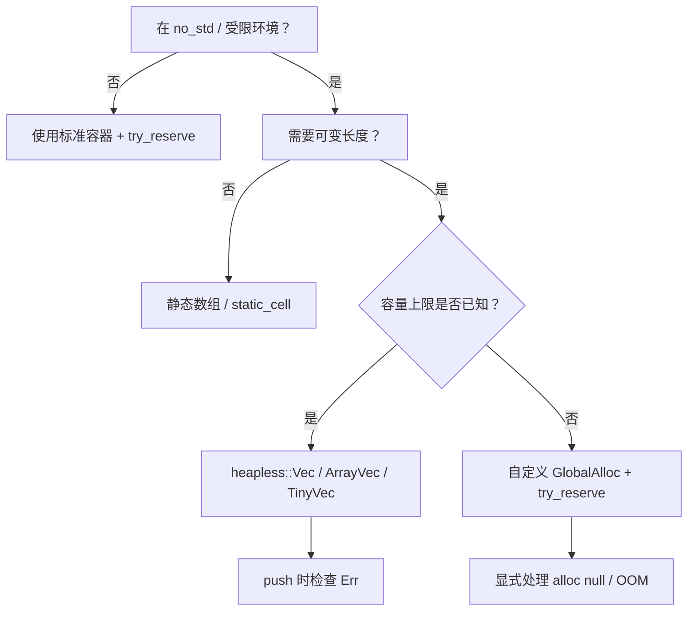

> **内容分级**: [进阶级]
> **本节关键术语**: 失败可恢复分配 (Fallible Allocation) · no_alloc 集合 (no_alloc Collections) · `try_reserve` · `GlobalAlloc` · `heapless` · `arrayvec` · `static_cell` · `tinyvec` · 全局分配器 (Global Allocator) · 静态分配 (Static Allocation) — [完整对照表](../../00_meta/01_terminology/01_terminology_glossary.md)

# 失败可恢复分配与 no_alloc 集合

**EN**: Fallible Allocation and no_alloc Collections
**Summary**: Memory-management patterns for no_std Rust: fallible allocation with `try_reserve`, `handle_alloc_error`, and heapless/arrayvec/static_cell collections for stack/Static allocation.

> **Rust 版本**: 1.97.0+ (Edition 2024)
> **Bloom 层级**: L2-L3
> **权威来源**: 本文件为 `concept/` 权威页。
> **A/S/P 标记**: **S+A** — Structure + Application
> **定位**: 系统讲解 `#![no_std]` 与资源受限场景下的内存管理策略：显式处理分配失败、使用栈/静态容量集合替代堆，以及自定义全局分配器的选择与限制。
> **前置概念**: [嵌入式内存分配器](16_embedded_memory_allocators.md) · [`#![no_std]` 与裸机编程惯用法](23_no_std_and_bare_metal_idioms.md) · [堆内存管理](../../02_intermediate/02_memory_management/01_memory_management.md) · [panic_handler 与 no_std 运行时](18_panic_runtime_no_std.md)
> **后置概念**: [嵌入式内存布局与堆安全](29_embedded_memory_layout_and_heap_safety.md) · [安全关键型裸机/OS](19_safety_critical_bare_metal_os.md) · [嵌入式测试与 CI 策略](32_embedded_testing_and_ci_strategies.md) · [Rust vs Ada/SPARK](../../05_comparative/01_systems_languages/07_rust_vs_ada_spark.md)

---

> **来源 / Provenance**:
> **P0** [The Rust Programming Language](https://doc.rust-lang.org/book/title-page.html) ·
> **P0** [Rust Reference — The Allocator API](https://doc.rust-lang.org/reference/memory-allocation.html) ·
> **P0** [The Embedded Rust Book](https://docs.rust-embedded.org/book/) ·
> **P2** [docs.rs/heapless](https://docs.rs/heapless/latest/heapless/) ·
> **P2** [docs.rs/arrayvec](https://docs.rs/arrayvec/latest/arrayvec/) ·
> **P2** [docs.rs/static_cell](https://docs.rs/static_cell/latest/static_cell/) ·
> **P2** [docs.rs/tinyvec](https://docs.rs/tinyvec/latest/tinyvec/)

---

## 🧠 知识结构图



> **认知功能**: 本 mindmap 按“失败处理 → 无堆集合 → 自定义分配器 → 场景 → 反模式”组织，帮助读者根据是否需要堆、是否能容忍分配失败来选择内存策略。

---

## 一、权威定义

**失败可恢复分配（Fallible Allocation）**：在请求内存时，显式检查分配是否成功，而不是依赖默认的 panic-on-OOM 行为。Rust 标准库提供 `Vec::try_reserve`、`String::try_reserve`、`HashMap::try_reserve` 等 API，失败时返回 `TryReserveError` 而非 panic。

**no_alloc 集合**：不依赖全局堆分配器、容量由编译期或调用时固定大小决定的集合类型。典型代表包括 `heapless::Vec`、`arrayvec::ArrayVec`、`tinyvec::ArrayVec` 等，它们把数据存放在栈、静态区或结构体自身内存中。

> **来源**: Rust `alloc` crate; Rust Reference; heapless/arrayvec docs

---

## 二、`try_reserve` 与 `try_reserve_exact`

标准库容器在需要扩容时默认调用 `handle_alloc_error`，最终 panic。`try_reserve` 族 API 让调用方有机会在分配失败时优雅降级。

```rust
fn main() {
    let mut v: Vec<i32> = Vec::new();
    match v.try_reserve(1_000_000_000) {
        Ok(()) => println!("reserved capacity"),
        Err(e) => println!("fallible allocation failed: {e:?}"),
    }

    let mut s = String::new();
    if s.try_reserve_exact(256).is_ok() {
        s.push_str("pre-allocated string");
    }
}
```

**注意**：`try_reserve` 只保证“尝试预留容量”；如果容量已足够，它会立即返回 `Ok(())`。它适用于可以优雅处理 OOM 的场景，例如日志缓冲、批处理任务、嵌入式主机端工具等。

> **来源**: [std::vec::Vec::try_reserve](https://doc.rust-lang.org/std/vec/struct.Vec.html#method.try_reserve)

---

## 三、`GlobalAlloc::alloc` 的 fallibility

实现 `GlobalAlloc` 时，`alloc` 方法允许返回空指针表示失败。调用方若直接使用 `GlobalAlloc`，必须检查返回值；否则可能解引用空指针，导致未定义行为。

```rust,ignore
#![no_std]
extern crate alloc;

use alloc::alloc::GlobalAlloc;
use core::alloc::Layout;

struct SafeBumpAlloc;

unsafe impl GlobalAlloc for SafeBumpAlloc {
    unsafe fn alloc(&self, layout: Layout) -> *mut u8 {
        // 生产环境应维护实际堆指针；此处仅示意返回 null
        let ptr = raw_bump_alloc(layout);
        if ptr.is_null() {
            // 策略 A：记录错误码/复位
            // 策略 B：依赖调用方检查返回值
        }
        ptr
    }

    unsafe fn dealloc(&self, _ptr: *mut u8, _layout: Layout) {}
}

#[global_allocator]
static ALLOCATOR: SafeBumpAlloc = SafeBumpAlloc;
```

**稳定 Rust 现状**：`#[alloc_error_handler]` 仍不稳定，因此 `#![no_std]` + `alloc` 的 OOM 处理通常依赖以下策略：

1. 在自定义分配器内部 panic/复位；
2. 返回 null 并要求调用方使用 `try_reserve` 或检查原始指针；
3. 完全避免堆，使用 no_alloc 集合。

> **来源**: [Rust Reference — Memory Allocation](https://doc.rust-lang.org/reference/memory-allocation.html)

---

## 四、`heapless::Vec`

`heapless::Vec<T, N>` 是一个容量上限为 `N` 的向量，数据存储在结构体内部，无需堆分配器。它适合 `#![no_std]` 且需要可变长缓冲的场景。

```rust,ignore
use heapless::Vec;

fn push_logs(buf: &mut Vec<u8, 64>, byte: u8) -> Result<(), ()> {
    buf.push(byte) // 满时返回 Err，不 panic
}

fn main() {
    let mut v: Vec<u8, 64> = Vec::new();
    assert!(push_logs(&mut v, b'H').is_ok());
    assert_eq!(&v[..], b"H");
}
```

**特点**：

- 容量 `N` 是类型参数，编译期确定；运行时不能扩容。
- `push` / `extend` 在容量不足时返回 `Err`，不 panic。
- 支持 `no_std`，无需 `alloc`。

> **来源**: [docs.rs/heapless::Vec](https://docs.rs/heapless/latest/heapless/struct.Vec.html)

---

## 五、`arrayvec::ArrayVec`

`arrayvec::ArrayVec<T, CAP>` 与 `heapless::Vec` 类似，也是基于栈/静态数组的向量，但在 API 风格与 feature 支持上略有不同。

```rust,ignore
use arrayvec::ArrayVec;

fn collect_tokens(input: &str) -> ArrayVec<&str, 8> {
    let mut tokens = ArrayVec::new();
    for word in input.split_whitespace() {
        if tokens.try_push(word).is_err() {
            break; // 达到容量上限，优雅截断
        }
    }
    tokens
}

fn main() {
    let tokens = collect_tokens("rust is fast safe concurrent");
    assert_eq!(tokens.len(), 5);
}
```

**与 `heapless::Vec` 的差异**：

- `arrayvec` 使用 const generic 容量参数 `ArrayVec<T, CAP>`（较新版本）。
- `try_push` 返回 `Result`，`push` 在溢出时 panic。
- 不支持 `no_std` 的默认 feature 需关闭 `std`。

> **来源**: [docs.rs/arrayvec::ArrayVec](https://docs.rs/arrayvec/latest/arrayvec/struct.ArrayVec.html)

---

## 六、`static_cell`

`static_cell` crate 提供在编译期分配静态内存并在运行期安全借用的工具，常用于初始化全局可变状态、DMA 缓冲区、任务栈等。

```rust,ignore
use static_cell::StaticCell;

static BUFFER: StaticCell<[u8; 1024]> = StaticCell::new();

fn init() -> &'static mut [u8; 1024] {
    BUFFER.init([0; 1024])
}

fn main() {
    let buf = init();
    buf[0] = 0xAA;
    assert_eq!(buf[0], 0xAA);
    // init() 第二次调用会在运行时 panic，避免双重初始化
}
```

**特点**：

- 把 `static` 内存的初始化与唯一借用封装为运行时检查。
- 避免 `static mut` 的不安全直接访问。
- 在 Embassy 等 async 嵌入式框架中广泛使用。

> **来源**: [docs.rs/static_cell](https://docs.rs/static_cell/latest/static_cell/)

---

## 七、`tinyvec`

`tinyvec` 提供基于数组的 `ArrayVec` 与基于 `SmallVec` 风格的 `TinyVec`，全部使用 safe Rust 实现（无 `unsafe`）。它要求元素实现 `Default`，但换来更高的可移植性与安全性保证。

```rust,ignore
use tinyvec::ArrayVec;

fn main() {
    let mut v: ArrayVec<[u8; 4]> = ArrayVec::new();
    v.push(1);
    v.push(2);
    assert_eq!(v.as_slice(), &[1, 2]);
}
```

**选择建议**：

- 需要 `no_std` + 无 unsafe：`tinyvec`。
- 需要最大兼容性（包括旧 Rust）：`arrayvec`。
- 需要嵌入式生态广泛支持：`heapless`。

---

## 八、自定义全局分配器示例

在 `#![no_std]` 环境中，可以通过 `#[global_allocator]` 提供自己的 `GlobalAlloc`。下面是一个教学用的 bump allocator 骨架，生产环境请使用 `embedded-alloc` 或 `linked_list_allocator`。

```rust,ignore
#![no_std]
extern crate alloc;

use alloc::alloc::GlobalAlloc;
use core::alloc::Layout;
use core::cell::UnsafeCell;
use core::ptr;

const HEAP_SIZE: usize = 1024;

struct BumpAlloc {
    heap: UnsafeCell<[u8; HEAP_SIZE]>,
    next: UnsafeCell<usize>,
}

unsafe impl Sync for BumpAlloc {}

unsafe impl GlobalAlloc for BumpAlloc {
    unsafe fn alloc(&self, layout: Layout) -> *mut u8 {
        let head = self.next.get();
        let align = layout.align();
        let size = layout.size();
        let start = ((*head + align - 1) / align) * align;
        if start + size > HEAP_SIZE {
            return ptr::null_mut();
        }
        *head = start + size;
        (*self.heap.get()).as_mut_ptr().add(start)
    }

    unsafe fn dealloc(&self, _ptr: *mut u8, _layout: Layout) {
        // bump allocator 不释放内存
    }
}

#[global_allocator]
static ALLOC: BumpAlloc = BumpAlloc {
    heap: UnsafeCell::new([0u8; HEAP_SIZE]),
    next: UnsafeCell::new(0),
};
```

**注意**：bump allocator 只分配不释放，适合阶段化初始化；长期运行需配合 arena 或整体重置策略。

> **来源**: [embedded-alloc crate](https://docs.rs/embedded-alloc/); The Embedonomicon

---

## 九、何时避免堆

| 场景 | 推荐方案 | 原因 |
|:---|:---|:---|
| 硬实时中断处理 | `heapless::Vec` / 静态 ring buffer | 分配器不可重入、关中断过久 |
| 启动早期 / 全局构造器 | `static_cell` / `const` 数组 | 堆尚未初始化 |
| 安全关键认证 | 静态池 / `heapless` | 便于 WCET 分析与审计 |
| 极小资源 MCU (< 16 KB RAM) | 完全避免堆 | 堆元数据本身也占空间 |
| 批量解析/中间结果 | `ArrayVec` / `TinyVec` | 栈分配，失败可预测 |
| 需要 OOM 可恢复 | `try_reserve` + `Result` | 不 panic，可优雅降级 |

---

## 十、反例与反模式

### 反例 1：在 `#![no_std]` 中直接使用 `std::vec::Vec`

```rust,ignore
// ❌ 错误：no_std 环境无法使用标准库 Vec
#![no_std]
use std::vec::Vec;

fn main() {
    let mut v = Vec::new();
    v.push(1);
}
```

**修正**：启用 `extern crate alloc;` 并使用 `alloc::vec::Vec`，或改用 `heapless::Vec`/`ArrayVec`。

### 反例 2：忽略 `try_reserve` 返回值

```rust
fn main() {
    let mut v = Vec::new();
    let _ = v.try_reserve(usize::MAX); // 不处理错误，后续 push 仍可能 panic
    v.push(1);
}
```

**修正**：在资源受限代码中，始终匹配 `try_reserve` 结果并制定降级策略。

```rust
fn main() {
    let mut v = Vec::new();
    if v.try_reserve(1024).is_err() {
        eprintln!("warn: cannot pre-allocate buffer");
    }
    v.push(1);
}
```

### 反例 3：中断上下文中使用 `Vec::push`

```rust,ignore
#[cortex_m_rt::interrupt]
fn TIM2() {
    // ❌ 错误：中断里调用可能堆分配的 API
    let mut buf = Vec::new();
    buf.push(read_sensor());
}
```

**修正**：使用预分配的静态 ring buffer 或 `heapless::Vec`，并在 push 时检查返回值。

### 反例 4：`ArrayVec` 溢出时 panic

```rust,ignore
use arrayvec::ArrayVec;

fn main() {
    let mut v: ArrayVec<u8, 2> = ArrayVec::new();
    v.push(1);
    v.push(2);
    v.push(3); // ❌ panic
}
```

**修正**：在容量边界附近使用 `try_push` 或 `push_within_capacity`。

---

## 十一、属性矩阵

| 方案 | 需要 `alloc` | 需要堆 | 扩容 | OOM 行为 | 典型场景 |
|:---|:---:|:---:|:---:|:---|:---|
| `Vec` + `try_reserve` | ✅ | ✅ | ✅ | 返回 `Err` | 主机端、可恢复 OOM |
| `heapless::Vec` | ❌ | ❌ | ❌ | 返回 `Err` | 嵌入式缓冲 |
| `arrayvec::ArrayVec` | ❌ | ❌ | ❌ | `try_push` 返回 `Err` / `push` panic | 栈上固定容量集合 |
| `static_cell` | ❌ | ❌ | N/A | 运行时 panic（重复 init） | 全局静态初始化 |
| `tinyvec::ArrayVec` | ❌ | ❌ | ❌ | panic（无 try API 时） | 纯 safe Rust 环境 |
| 自定义 `GlobalAlloc` | ✅ | 自定义 | 自定义 | 取决于实现 | 裸机、特殊硬件 |

---

## 十二、决策树



---

## 十三、权威来源索引

- **P0 官方**: [The Rust Programming Language](https://doc.rust-lang.org/book/title-page.html)
- **P0 官方**: [Rust Reference — Memory Allocation](https://doc.rust-lang.org/reference/memory-allocation.html)
- **P0 官方**: [alloc crate](https://doc.rust-lang.org/alloc/index.html)
- **P0 官方**: [The Embedded Rust Book](https://docs.rust-embedded.org/book/)
- **P2 生态**: [docs.rs/heapless](https://docs.rs/heapless/latest/heapless/)
- **P2 生态**: [docs.rs/arrayvec](https://docs.rs/arrayvec/latest/arrayvec/)
- **P2 生态**: [docs.rs/static_cell](https://docs.rs/static_cell/latest/static_cell/)
- **P2 生态**: [docs.rs/tinyvec](https://docs.rs/tinyvec/latest/tinyvec/)
- **P2 生态**: [docs.rs/embedded-alloc](https://docs.rs/embedded-alloc/)

> **文档版本**: 1.0 ｜ **最后更新**: 2026-08-03 ｜ **状态**: ✅ 新建权威页

---

## 国际化权威来源对齐说明

| 主题 | 本页做法 | 权威来源依据 |
|:---|:---|:---|
| `try_reserve` | 标准库 `Vec`/`String`/`HashMap` 显式预留 | Rust std docs; Rust Reference |
| `GlobalAlloc` fallibility | `alloc` 返回 null，调用方检查 | Rust Reference Memory Allocation |
| `heapless::Vec` | 固定容量、push 返回 Err | heapless crate docs |
| `arrayvec::ArrayVec` | `try_push` 安全边界 | arrayvec crate docs |
| `static_cell` | 编译期静态内存 + 运行时唯一 init | static_cell crate docs; Embassy examples |
| `tinyvec` | 纯 safe Rust `ArrayVec` | tinyvec crate docs |

---

## 国际权威来源（P1 补充）

- [Rust for Embedded Systems: Current State and Open Challenges](https://arxiv.org/abs/2311.05063)
