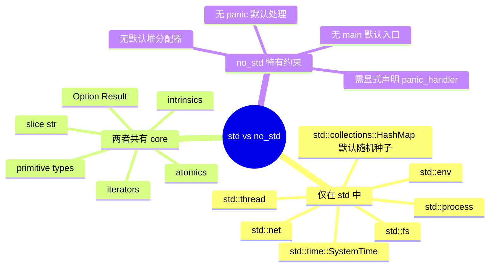

> **内容分级**: [专家级]
> **代码状态**: ⚠️ 裸机/目标平台相关代码标注 `rust,ignore`/`no_run`，host 平台无法直接编译
> **定理链**: N/A — 描述性/工程性文档
>
# no_std 与裸机 Rust
>
> **EN**: no_std and Bare-Metal Rust
> **Summary**: A canonical reference for `#![no_std]` and bare-metal Rust: semantic boundary with `std`, core/alloc split, reset-to-main boot flow, linker-script memory layout, panic/abort/error handling, target specification and custom target JSON, with mindmap, anti-patterns, and decision trees.
> **Rust 版本**: 1.97.1+ (Edition 2024)
>
> **受众**: [专家]
> **Bloom 层级**: L3
> **权威来源**: 本文件为 `concept/` 权威页。
> **A/S/P 标记**: **S+A+P** — Structure + Application + Procedure
> **双维定位**: P×Cre — 在资源受限硬件上构建可移植、可维护的裸机 Rust 系统
> **前置概念**: [Rust 嵌入式系统开发](03_embedded_systems.md) · [交叉编译](02_cross_compilation.md) · [Unsafe Rust](../../03_advanced/02_unsafe/01_unsafe.md) · [Cargo build-std](../01_cargo/22_build_std.md)
> **后置概念**: [裸机启动与链接脚本](13_bare_metal_boot_linker_script.md) · [no_std 启动流程与运行时深度解析](27_no_std_startup_runtime_deep_dive.md) · [panic_handler 与 no_std 运行时](18_panic_runtime_no_std.md) · [嵌入式内存布局与堆安全](29_embedded_memory_layout_and_heap_safety.md) · [no_std 同步原语](15_no_std_synchronization_primitives.md) · [嵌入式内存分配器](16_embedded_memory_allocators.md) · [no_std 与裸机惯用法](23_no_std_and_bare_metal_idioms.md) · [no_std 分配器与 panic handler](52_no_std_allocators_and_panic_handlers.md) · [临界区与裸机同步](53_critical_sections_and_sync_on_bare_metal.md) · [链接脚本与内存布局](54_linker_scripts_and_memory_layout.md)

---

> **来源**: [The Embedded Rust Book](https://docs.rust-embedded.org/book/) · [The Embedonomicon](https://docs.rust-embedded.org/embedonomicon/) · [Ferrous Systems — Rust Training](https://rust-training.ferrous-systems.com/latest/book/) · [Knurling — Embedded Rust Trainings](https://knurling.ferrous-systems.com/) · [Rust Reference — no_std attribute](https://doc.rust-lang.org/reference/names/preludes.html#the-no_std-attribute) · [Rust Reference — Lang Items](https://doc.rust-lang.org/reference/attributes.html#lang-items) · [Rust Reference — Panic Handler](https://doc.rust-lang.org/reference/runtime.html#the-panic_handler-attribute) · [The Rustonomicon](https://doc.rust-lang.org/nomicon/) · [ARMv7-M Architecture Reference Manual](https://developer.arm.com/documentation/ddi0403/latest/) · [ARMv8-M Architecture Reference Manual](https://developer.arm.com/documentation/ddi0553/latest/) · [RISC-V Privileged Specification](https://riscv.org/technical/specifications/) · [cortex-m-rt crate](https://docs.rs/cortex-m-rt/) · [riscv-rt crate](https://docs.rs/riscv-rt/) · [embedded-hal docs](https://docs.rs/embedded-hal/) · [rustc target docs](https://doc.rust-lang.org/rustc/platform-support.html) · [Tock OS Book](https://book.tockos.org/) · [Hubris OS](https://hubris.oxide.computer/) · [Ferrocene Language Specification](https://spec.ferrocene.dev/)
>
> **横向对比**: [Rust vs Ada/SPARK](../../05_comparative/01_systems_languages/07_rust_vs_ada_spark.md) · [Rust vs C/C++](../../05_comparative/01_systems_languages/01_rust_vs_cpp.md)

---

## 🧠 知识结构图


## 📑 目录

- [no\_std 与裸机 Rust](#no_std-与裸机-rust)
  - [🧠 知识结构图](#-知识结构图)
  - [📑 目录](#-目录)
  - [一、权威定义](#一权威定义)
  - [二、no\_std 语义边界](#二no_std-语义边界)
    - [2.1 std 与 no\_std 的对称差](#21-std-与-no_std-的对称差)
    - [2.2 core / alloc / std 的分层边界](#22-core--alloc--std-的分层边界)
    - [2.3 panic 与 abort 语义](#23-panic-与-abort-语义)
    - [2.4 全局分配器的可选性](#24-全局分配器的可选性)
    - [2.5 #!\[no\_main\] 与 lang item 契约](#25-no_main-与-lang-item-契约)
  - [三、最小可编译 no\_std crate](#三最小可编译-no_std-crate)
  - [四、裸机启动流程](#四裸机启动流程)
    - [4.1 reset vector 与向量表](#41-reset-vector-与向量表)
    - [4.2 启动汇编与 \_start 入口](#42-启动汇编与-_start-入口)
    - [4.3 .data 复制与 .bss 清零](#43-data-复制与-bss-清零)
    - [4.4 链接脚本基础](#44-链接脚本基础)
    - [4.5 调用 main 与运行时契约](#45-调用-main-与运行时契约)
  - [五、内存布局](#五内存布局)
    - [5.1 段视图：.text / .rodata / .data / .bss](#51-段视图text--rodata--data--bss)
    - [5.2 stack 与 heap](#52-stack-与-heap)
    - [5.3 链接器符号与内存映射](#53-链接器符号与内存映射)
  - [六、异常与 panic](#六异常与-panic)
    - [6.1 #\[panic\_handler\] 契约](#61-panic_handler-契约)
    - [6.2 panic = abort / unwind](#62-panic--abort--unwind)
    - [6.3 自定义 abort 与错误恢复](#63-自定义-abort-与错误恢复)
    - [6.4 no\_std 下的错误处理形态](#64-no_std-下的错误处理形态)
  - [七、可移植性：target spec 与自定义 target](#七可移植性target-spec-与自定义-target)
    - [7.1 target triple 与 LLVM target](#71-target-triple-与-llvm-target)
    - [7.2 自定义 target JSON](#72-自定义-target-json)
    - [7.3 build-std 与 cargo config](#73-build-std-与-cargo-config)
    - [7.4 target tier 支持](#74-target-tier-支持)
  - [八、属性关系表](#八属性关系表)
  - [九、正例](#九正例)
    - [正例 1：纯 core 的 no\_std 库](#正例-1纯-core-的-no_std-库)
    - [正例 2：带 panic handler 的最小裸机 binary](#正例-2带-panic-handler-的最小裸机-binary)
    - [正例 3：使用 alloc 的 no\_std crate](#正例-3使用-alloc-的-no_std-crate)
    - [正例 4：链接器符号读取](#正例-4链接器符号读取)
    - [正例 5：自定义 target JSON 的 cargo config](#正例-5自定义-target-json-的-cargo-config)
    - [正例 6：Result 为主的错误处理](#正例-6result-为主的错误处理)
    - [正例 7：静态常量表放在 Flash](#正例-7静态常量表放在-flash)
    - [正例 8：critical-section 保护共享状态](#正例-8critical-section-保护共享状态)
  - [十、反例与失效模式](#十反例与失效模式)
    - [反例 1：no\_std 中直接使用 std](#反例-1no_std-中直接使用-std)
    - [反例 2：binary 未提供 panic handler](#反例-2binary-未提供-panic-handler)
    - [反例 3：使用 Box 但没有 global allocator](#反例-3使用-box-但没有-global-allocator)
    - [反例 4：启动时未初始化 .data/.bss 就访问静态变量](#反例-4启动时未初始化-databss-就访问静态变量)
    - [反例 5：栈顶指向无效地址](#反例-5栈顶指向无效地址)
    - [反例 6：在中断中使用非重入分配器](#反例-6在中断中使用非重入分配器)
    - [反例 7：把 #!\[no\_std\] 写成 #!\[no\_std\] 后仍然依赖 std 宏](#反例-7把-no_std-写成-no_std-后仍然依赖-std-宏)
    - [反例 8：自定义 target JSON 中 data-layout 错误](#反例-8自定义-target-json-中-data-layout-错误)
  - [十一、决策树](#十一决策树)
    - [11.1 决策节点说明](#111-决策节点说明)
    - [11.2 选择矩阵](#112-选择矩阵)
  - [十二、边界测试](#十二边界测试)
    - [12.1 边界测试：panic handler 必须返回](#121-边界测试panic-handler-必须返回)
    - [12.2 边界测试：同时提供 std 和 no\_std](#122-边界测试同时提供-std-和-no_std)
    - [12.3 边界测试：启动代码顺序](#123-边界测试启动代码顺序)
    - [12.4 边界测试：堆栈方向](#124-边界测试堆栈方向)
    - [12.5 边界测试：target JSON 中 panic-strategy 与 Cargo profile 不一致](#125-边界测试target-json-中-panic-strategy-与-cargo-profile-不一致)
    - [12.6 边界测试：在 no\_std 中使用标准 trait 对象](#126-边界测试在-no_std-中使用标准-trait-对象)
  - [十三、国际化权威来源补充](#十三国际化权威来源补充)
  - [十四、相关概念](#十四相关概念)
  - [🧭 思维导图（Mindmap）](#-思维导图mindmap)
  - [十五、no\_std 迁移检查清单](#十五no_std-迁移检查清单)
    - [15.1 代码层](#151-代码层)
    - [15.2 构建层](#152-构建层)
    - [15.3 调试层](#153-调试层)
  - [十六、与 RTOS / OS 内核的关系](#十六与-rtos--os-内核的关系)
  - [十七、版本与兼容性说明](#十七版本与兼容性说明)
  - [十八、快速参考卡](#十八快速参考卡)
    - [18.1 最小 `#![no_std]` 库](#181-最小-no_std-库)
    - [18.2 最小裸机 binary](#182-最小裸机-binary)
    - [18.3 启用 alloc](#183-启用-alloc)
    - [18.4 Cargo.toml panic 设置](#184-cargotoml-panic-设置)
    - [18.5 自定义 target 编译](#185-自定义-target-编译)
    - [18.6 链接脚本关键符号](#186-链接脚本关键符号)
  - [十九、P7 增强附录](#十九p7-增强附录)
    - [19.1 build-std 深度配置](#191-build-std-深度配置)
      - [workspace 级统一配置](#workspace-级统一配置)
      - [显式选择 std 子集](#显式选择-std-子集)
      - [与 `rust-src` 组件的关系](#与-rust-src-组件的关系)
      - [边界提示](#边界提示)
    - [19.2 panic handler 工程模式](#192-panic-handler-工程模式)
      - [模式 A：最小体积（发布阶段）](#模式-a最小体积发布阶段)
      - [模式 B：defmt 诊断（开发阶段）](#模式-bdefmt-诊断开发阶段)
      - [模式 C：panic-probe（Knurling 推荐）](#模式-cpanic-probeknurling-推荐)
      - [模式 D：安全关键 fail-safe](#模式-d安全关键-fail-safe)
    - [19.3 global allocator 模式与 OOM 处理](#193-global-allocator-模式与-oom-处理)
      - [最小可用全局分配器：TLSF](#最小可用全局分配器tlsf)
      - [失败可恢复分配](#失败可恢复分配)
    - [19.4 自定义测试框架](#194-自定义测试框架)
      - [方案 A：`custom_test_frameworks` + `no_main`](#方案-acustom_test_frameworks--no_main)
      - [方案 B：`defmt-test`](#方案-bdefmt-test)
      - [方案 C：`embedded-test`（probe-rs 生态）](#方案-cembedded-testprobe-rs-生态)
    - [19.5 QEMU 仿真与硬件实测附录](#195-qemu-仿真与硬件实测附录)
      - [QEMU 最小启动测试](#qemu-最小启动测试)
      - [真实硬件实测清单](#真实硬件实测清单)
      - [从 QEMU 迁移到真实硬件的注意事项](#从-qemu-迁移到真实硬件的注意事项)
    - [19.6 no\_std 与裸机 Rust 能力矩阵（增强版）](#196-no_std-与裸机-rust-能力矩阵增强版)

---

## 一、权威定义

> **Rust Reference**: The attribute `#![no_std]` disables the automatic inclusion of `std` into the crate prelude. The crate can then use `core` (always available) and optionally `alloc` if a global allocator is provided.

**`#![no_std]`**：一个 crate-level 属性，指示编译器不要把 `std` 加入 prelude，也不链接标准库。该 crate 仍可使用 `core`（语言核心），并可在提供全局分配器的前提下使用 `alloc`。

**裸机（bare-metal）**：程序直接运行在硬件之上，没有操作系统内核提供进程、虚拟内存、文件系统、网络栈等抽象。裸机 Rust 通常等于 `#![no_std]` + `#![no_main]` + 自定义启动代码 + 自定义 panic handler。

**no_std 运行时**：并非一个单独的库，而是一组最小契约：

| 契约 | 是否必须 | 说明 |
|------|----------|------|
| `#[panic_handler]` | 是 | panic 时永不返回的函数 |
| `#[lang = "eh_personality"]` | 仅 unwind | abort 策略下不需要 |
| `#[global_allocator]` | 否 | 只有使用 `alloc` 时才需要 |
| `_start` / `Reset` | 是（裸机） | 硬件复位后第一个执行的代码 |
| 链接脚本 | 是（裸机） | 描述 Flash/RAM 等物理内存布局 |

判定依据：一个 crate 只要声明 `#![no_std]`，就进入“无标准库”语义空间；若还要直接操作复位向量、内存映射、外设寄存器，则进入裸机语义空间。两者不等价：可以在 host OS 上写 `#![no_std]` 库（如内核模块），也可以在裸机上写不使用 `#![no_std]` 的 C 风格运行时（但 Rust 裸机几乎总是 no_std）。

---

## 二、no_std 语义边界

### 2.1 std 与 no_std 的对称差

`std` 与 `no_std` 的可用功能集合可以画成两个圆，交集是 `core`，差异区则决定了你能做什么、不能做什么。



更形式化的对称差如下：

| 能力 | `std` crate | `no_std` crate | 备注 |
|------|-------------|----------------|------|
| 文件系统 `std::fs` | ✅ | ❌ | 裸机通常没有 FS 抽象；可引入 `embedded-sdmmc` 等 |
| TCP/UDP `std::net` | ✅ | ❌ | 使用 `smoltcp` 或芯片 MAC 驱动 |
| 进程/线程 `std::thread` | ✅ | ❌ | 裸机无 OS 调度；用中断/RTOS/异步 |
| 环境变量 `std::env` | ✅ | ❌ | 编译期常量或固件配置区替代 |
| `HashMap` 默认 | ✅ | ❌ | `core` 无 `Hash` 默认；可用 `heapless::IndexMap` 或 `fnv` |
| `Vec` / `Box` / `String` | ✅（隐式分配器） | 可选（需 `alloc` + global allocator） | `alloc` crate 提供 |
| `core` 全部 | ✅ | ✅ | 语言核心，永远可用 |
| 确定性 panic 行为 | 运行时决定 | 用户决定 | abort/unwind/复位 |

> **注意**：`core` 本身已经包含 `Option`、`Result`、`Iterator`、`slice`、`str`、`Cell`、`RefCell`、`Atomic*` 等。很多 Rust 代码从 `std` 迁移到 `no_std` 时，只需要把 `use std::...` 改成 `use core::...`。

### 2.2 core / alloc / std 的分层边界

Rust 标准库不是单块巨石，而是三层：

1. **`core`**：不依赖任何运行时。包含语言基础类型、trait、`Option`/`Result`、迭代器、格式化 trait（`core::fmt`）、原子操作、 intrinsics。任何 Rust target 都能使用 `core`。
2. **`alloc`**：依赖一个全局分配器。提供 `Box`、`Vec`、`String`、`HashMap`、BTree 等。`no_std` 下可通过 `extern crate alloc;` 启用，但必须提供 `#[global_allocator]`。
3. **`std`**：依赖操作系统。提供文件、网络、进程、线程、环境变量、标准 I/O、时间等。`no_std` 不可用。

```rust
#![no_std]
// core 自动可用，无需 extern crate core;

// 若需要堆分配，必须显式引入 alloc
extern crate alloc;

use alloc::vec::Vec;
use core::fmt::Write;

pub fn demo() {
    let mut v: Vec<u8> = Vec::new();
    v.push(1);
    let _ = v;
}
```

关键点：

- `core::fmt::Write` 与 `std::io::Write` 不同。前者只依赖 `core`，后者依赖 `std`。
- `alloc` 中的类型与 `std` 中的类型源码相同，只是 re-export。迁移时代码通常只需改 `use` 路径。
- `std::os` 平台扩展、`std::sync` 中的 `Mutex`、`Condvar`、`RwLock` 都不可用；裸机中常用 `critical_section::Mutex` 或自旋锁。

### 2.3 panic 与 abort 语义

在 `std` 程序中，panic 默认展开栈（unwind）并打印消息。`no_std` 没有默认 panic 实现，必须由用户提供 `#[panic_handler]`。

panic 策略在 `Cargo.toml` 中声明：

```toml
[profile.dev]
panic = "abort"

[profile.release]
panic = "abort"
```

- `panic = "abort"`：panic 时直接终止，不展开栈。固件体积最小，最常用。
- `panic = "unwind"`：需要 `eh_personality` lang item 和 unwinding 库。裸机极少使用，因为实现复杂且体积大。

panic handler 的签名必须是：

```rust
#![no_std]
#![no_main]

use core::panic::PanicInfo;

#[panic_handler]
fn panic(_info: &PanicInfo) -> ! {
    loop {}
}
```

返回类型 `!` 表示 diverging function，panic 后不能返回调用者。具体实现可以：

- 进入无限循环（最小体积，最难调试）。
- 通过 UART/ITM/semihosting 输出位置信息后挂起。
- 触发看门狗复位或软件复位。
- 在开发阶段调用 `cortex_m::peripheral::SCB::sysreset()`。

> 更深入的 panic 策略、体积与调试权衡见 [panic_handler 与 no_std 运行时](18_panic_runtime_no_std.md)。

### 2.4 全局分配器的可选性

`no_std` 不强制要求堆。只有在需要 `Box`、`Vec`、`String`、`Rc`、`Arc` 等时才需要 `#[global_allocator]`。

最小全局分配器示例（实际会永远返回 null，仅演示接口）：

```rust
#![no_std]
extern crate alloc;

use core::alloc::Layout;
use alloc::alloc::GlobalAlloc;

struct NullAllocator;

unsafe impl GlobalAlloc for NullAllocator {
    unsafe fn alloc(&self, _layout: Layout) -> *mut u8 {
        core::ptr::null_mut()
    }
    unsafe fn dealloc(&self, _ptr: *mut u8, _layout: Layout) {}
}

#[global_allocator]
static GLOBAL_ALLOC: NullAllocator = NullAllocator;
```

真实项目常用：

- `embedded-alloc`（TLSF 算法，确定性分配）。
- `linked_list_allocator`（简单链表分配器）。
- 自定义 bump allocator（无释放、零碎片）。
- `heapless`（无全局分配器，纯栈/静态集合）。

> 分配器选择、OOM 处理、WCET 分析见 [嵌入式内存分配器](16_embedded_memory_allocators.md)。

### 2.5 #![no_main] 与 lang item 契约

裸机程序通常没有 OS 加载器调用 `main`。因此使用 `#![no_main]` 禁止编译器生成默认入口，并由启动运行时调用用户标注的 `fn main()` 或自定义 `_start`。

`#[unsafe(no_mangle)]` 用于把 Rust 函数名原样导出给链接器/汇编/启动文件：

```rust
#![no_std]
#![no_main]

#[unsafe(no_mangle)]
pub extern "C" fn my_entry() {
    // 链接脚本或汇编可直接引用 my_entry
}
```

lang item 是编译器依赖的“语言项”。常见 lang item 在 `no_std` 中的状态：

| lang item | 是否需要用户实现 | 说明 |
|-----------|------------------|------|
| `panic_handler` | 是 | 无 std 时必须 |
| `eh_personality` | 仅 unwind | abort 策略下不需要 |
| `start` | 否（裸机用 no_main） | std 程序默认入口 |
| `oom` | 旧 nightly | 现代 Rust 已改为全局分配器失败时 panic |

> 不要直接定义 `#[lang = "panic_impl"]` 等内部项；应使用稳定的 `#[panic_handler]` 属性。

---

## 三、最小可编译 no_std crate

一个能在 host target 上通过编译（但无法在 host 上真正“运行”）的最小 `no_std` 库如下：

```rust
#![no_std]

/// 计算斐波那契数列第 n 项（u32 范围内）。
pub fn fib(n: u32) -> u32 {
    match n {
        0 => 0,
        1 => 1,
        _ => {
            let mut a = 0u32;
            let mut b = 1u32;
            for _ in 1..n {
                let c = a.wrapping_add(b);
                a = b;
                b = c;
            }
            b
        }
    }
}

#[cfg(test)]
mod tests {
    use super::*;

    #[test]
    fn fib_basic() {
        assert_eq!(fib(0), 0);
        assert_eq!(fib(1), 1);
        assert_eq!(fib(10), 55);
    }
}
```

该 crate 不含 `panic_handler`，因此只能作为**库**被其他 crate 使用。如果它本身是 binary（`main.rs`），则必须提供 `#[panic_handler]`。

带 `main` 的最小裸机 binary：

```rust,ignore
#![no_std]
#![no_main]

use core::panic::PanicInfo;

#[panic_handler]
fn panic(_info: &PanicInfo) -> ! {
    loop {}
}

#[unsafe(no_mangle)]
pub extern "C" fn main() -> ! {
    loop {
        // 应用逻辑
    }
}
```

> 在真实 Cortex-M 项目中，`cortex-m-rt` 会提供启动代码并调用 `fn main() -> !`。用户通常不需要手写 `#[unsafe(no_mangle)]` 的 `main`。

---

## 四、裸机启动流程

裸机程序从 CPU 复位到执行 Rust `main` 需要经过硬件向量表、启动汇编、运行时初始化三个阶段。下面以 ARM Cortex-M 为例，RISC-V 的逻辑类似，只是向量表/启动寄存器不同。

### 4.1 reset vector 与向量表

Cortex-M 复位时，硬件从地址 `0x0000_0000` 取初始 SP，从 `0x0000_0004` 取 Reset_Handler 地址，然后跳转。

```text
地址          内容
0x0000_0000   _stack_top      (Initial SP)
0x0000_0004   Reset_Handler   (Reset vector)
0x0000_0008   NMI_Handler
...           其他异常/中断向量
```

Rust 中通常不手写向量表，而是依赖 `cortex-m-rt` 的 `#[entry]` 宏：

```rust,ignore
#![no_std]
#![no_main]

use cortex_m_rt::entry;
use core::panic::PanicInfo;

#[entry]
fn main() -> ! {
    loop {}
}

#[panic_handler]
fn panic(_info: &PanicInfo) -> ! {
    loop {}
}
```

`#[entry]` 宏会生成合适的向量表并把 `main` 注册为 Reset 处理函数。

### 4.2 启动汇编与 _start 入口

如果没有 `cortex-m-rt`，需要手写启动汇编（或内联汇编）设置 SP、初始化 `.data` 和 `.bss`，然后调用 Rust `main`。

一个极简的 ARMv7-M `_start`（示意）：

```armasm
.section .text._start
.global _start
_start:
    ldr r0, =_stack_top
    mov sp, r0
    bl  runtime_init
    bl  main
    b   .
```

Rust 侧对应：

```rust,ignore
#![no_std]
#![no_main]

use core::panic::PanicInfo;

extern "C" {
    fn _stack_top();
}

#[unsafe(no_mangle)]
pub unsafe extern "C" fn runtime_init() {
    // 1. 复制 .data
    // 2. 清零 .bss
    // 3. 可选：FPU/MPU 初始化
}

#[unsafe(no_mangle)]
pub extern "C" fn main() -> ! {
    loop {}
}

#[panic_handler]
fn panic(_info: &PanicInfo) -> ! {
    loop {}
}
```

> 启动汇编的正确写法、对齐要求、thumb 模式切换等细节见 [裸机启动与链接脚本](13_bare_metal_boot_linker_script.md)。

### 4.3 .data 复制与 .bss 清零

可执行文件在 Flash 中存放 `.data` 的初值，但程序运行时 `.data` 必须位于 RAM。启动代码要把初值从 Flash 复制到 RAM，并把 `.bss` 全部置零。

链接脚本会暴露四个符号：

| 符号 | 含义 |
|------|------|
| `_sidata` | `.data` 初值在 Flash 中的起始地址（加载地址） |
| `_sdata`  | `.data` 在 RAM 中的起始地址（运行地址） |
| `_edata`  | `.data` 在 RAM 中的结束地址 |
| `_sbss` / `_ebss` | `.bss` 在 RAM 中的起止地址 |

Rust 初始化示例：

```rust,ignore
#![no_std]

extern "C" {
    static mut _sidata: u8;
    static mut _sdata: u8;
    static mut _edata: u8;
    static mut _sbss: u8;
    static mut _ebss: u8;
}

pub unsafe fn init_data_bss() {
    // 复制 .data
    let src = &_sidata as *const u8;
    let dst = &mut _sdata as *mut u8;
    let len = (&_edata as *const u8 as usize) - (&_sdata as *const u8 as usize);
    core::ptr::copy_nonoverlapping(src, dst, len);

    // 清零 .bss
    let bss = &mut _sbss as *mut u8;
    let bss_len = (&_ebss as *const u8 as usize) - (&_sbss as *const u8 as usize);
    core::ptr::write_bytes(bss, 0, bss_len);
}
```

> 注意：对 `static mut` 取引用在 Rust 2024 Edition 中受到更严格限制；真实启动代码通常使用裸指针和 `addr_of_mut!`。更安全的写法见 [no_std 启动流程与运行时深度解析](27_no_std_startup_runtime_deep_dive.md)。

### 4.4 链接脚本基础

链接脚本（`.ld` / `.x`）告诉链接器如何把编译产物放入物理内存。核心命令是 `MEMORY` 和 `SECTIONS`。

```ld
MEMORY
{
  FLASH (rx)  : ORIGIN = 0x0800_0000, LENGTH = 512K
  RAM   (rwx) : ORIGIN = 0x2000_0000, LENGTH = 128K
}

SECTIONS
{
  .text :
  {
    KEEP(*(.vector_table));
    *(.text*);
    *(.rodata*);
  } > FLASH

  .data :
  {
    _sdata = .;
    *(.data*);
    _edata = .;
  } > RAM AT> FLASH

  _sidata = LOADADDR(.data);

  .bss :
  {
    _sbss = .;
    *(.bss*);
    *(COMMON);
    _ebss = .;
  } > RAM
}
```

要点：

- `KEEP(*(.vector_table))` 防止未直接引用的向量表被链接器垃圾回收。
- `.data` 的运行地址在 RAM，加载地址在 Flash：`> RAM AT> FLASH`。
- `LOADADDR(.data)` 获取 Flash 中的加载地址，赋给 `_sidata`。
- 栈顶通常放在 RAM 最高地址向下增长。

> 链接脚本的高级主题（ROPI/RWPI、scatter file、特殊内存区）见 [裸机启动与链接脚本](13_bare_metal_boot_linker_script.md) 与 [嵌入式内存布局与堆安全](29_embedded_memory_layout_and_heap_safety.md)。

### 4.5 调用 main 与运行时契约

启动代码完成初始化后，调用 Rust 的 `main`。此时以下契约必须已经满足：

1. SP 已指向有效栈顶。
2. `.data` 已复制到 RAM。
3. `.bss` 已清零。
4. `#[panic_handler]` 已定义。
5. 若使用 `alloc`，`#[global_allocator]` 已初始化（通常不能在启动前使用）。
6. 中断/异常向量表已就位（或至少 Reset/NMI/HardFault）。

如果 `main` 返回，裸机程序没有地方可去，因此 `main` 通常返回 `!`（diverging）。若使用 `cortex-m-rt`，`#[entry]` 会自动生成 `main -> !` 的签名约束。

---

## 五、内存布局

### 5.1 段视图：.text / .rodata / .data / .bss

裸机固件在 Flash 和 RAM 中的典型布局：

```text
Flash (rx)
├─ 0x0800_0000 .vector_table
├─ 0x0800_0200 .text        (代码)
├─ 0x0802_0000 .rodata      (常量、字符串字面量)
└─ 0x0804_0000 .data 初值   (只读副本)

RAM (rwx)
├─ 0x2000_0000 .data        (已初始化全局变量)
├─ 0x2000_1000 .bss         (未初始化全局变量，启动时清零)
├─ 0x2000_2000 heap        (可选，向上增长)
└─ 0x2002_0000 stack top   (向下增长)
```

各段含义：

| 段 | 存储位置 | 内容 | 启动时动作 |
|----|----------|------|------------|
| `.vector_table` | Flash | 异常/中断向量 | 无 |
| `.text` | Flash | 机器码 | 无 |
| `.rodata` | Flash | 只读常量 | 无 |
| `.data` | RAM（初值在 Flash） | 已初始化可写全局/静态变量 | 复制 |
| `.bss` | RAM | 未初始化可写全局/静态变量 | 清零 |
| heap | RAM | 动态分配区 | 初始化分配器 |
| stack | RAM | 函数调用、局部变量 | 硬件/软件设置 SP |

### 5.2 stack 与 heap

裸机没有 OS 替你分配栈。栈顶地址必须在链接脚本或启动代码中设置，且必须位于可用 RAM 内。

Cortex-M 的栈**向下增长**：SP 初始值是栈的最高地址 + 1。函数调用时 SP 减小。

```ld
_stack_top = ORIGIN(RAM) + LENGTH(RAM);
```

heap 是可选的。如果使用全局分配器，需要在启动后告诉分配器可用堆范围。例如 `embedded-alloc`：

```rust,ignore
#![no_std]
extern crate alloc;

use alloc::alloc::Layout;
use core::ptr::NonNull;

struct MyHeap;

unsafe impl embedded_alloc::Heap for MyHeap {
    // 接口随 crate 版本变化，以下仅示意
    fn alloc(&self, layout: Layout) -> Option<NonNull<u8>> {
        todo!()
    }
    fn dealloc(&self, _ptr: NonNull<u8>, _layout: Layout) {}
}
```

> 更完整的 heap 初始化、栈溢出检测、MPU 保护见 [嵌入式内存布局与堆安全](29_embedded_memory_layout_and_heap_safety.md)。

### 5.3 链接器符号与内存映射

链接脚本定义的符号可以在 Rust 中通过 `extern "C"` 引用，从而获得段边界地址。

```rust,ignore
#![no_std]

extern "C" {
    static _sdata: u8;
    static _edata: u8;
    static _sbss: u8;
    static _ebss: u8;
    static _stack_top: u8;
    static _heap_start: u8;
    static _heap_end: u8;
}

pub fn data_size() -> usize {
    unsafe { (&_edata as *const _ as usize) - (&_sdata as *const _ as usize) }
}

pub fn bss_size() -> usize {
    unsafe { (&_ebss as *const _ as usize) - (&_sbss as *const _ as usize) }
}
```

这些符号在链接期解析为地址，不是变量，因此读取它们时通常取其地址（`&_sdata as *const _ as usize`）。

内存映射（memory map）是芯片数据手册中给出的物理地址空间视图，例如：

```text
0x0000_0000 ─ 代码区（Flash alias）
0x0800_0000 ─ Flash
0x1FFF_0000 ─ System memory / bootloader
0x2000_0000 ─ SRAM1
0x2001_0000 ─ SRAM2
0x4000_0000 ─ Peripheral base
0xE000_0000 ─ Cortex-M internal peripherals
```

Rust 通过 `volatile` 读写访问外设寄存器：

```rust,ignore
#![no_std]

const RCC_CR: *mut u32 = 0x4002_1000 as *mut u32;

pub unsafe fn enable_clock() {
    core::ptr::write_volatile(RCC_CR, core::ptr::read_volatile(RCC_CR) | 1);
}
```

> 类型安全的外设访问通常用 `svd2rust` 生成的 PAC 或手写 MMIO 封装，见 [PAC 与 HAL 实现](17_pac_hal_implementation.md) 与 [Memory-Mapped Peripherals 与 Typestate 设计](25_memory_mapped_peripherals_and_typestate.md)。

---

## 六、异常与 panic

### 6.1 #[panic_handler] 契约

`#[panic_handler]` 是 `no_std` 下唯一稳定的 panic 处理机制。函数签名固定：

```rust
#![no_std]
#![no_main]

use core::panic::PanicInfo;

#[panic_handler]
fn panic(_info: &PanicInfo) -> ! {
    // 不可返回
    loop {}
}
```

`PanicInfo` 包含：

- `message()`：panic 消息（`fmt::Arguments`）。
- `location()`：panic 发生的文件、行、列。
- `payload()`：任意 `&'static (dyn Any + Send)`，在 `no_std` 中几乎总是 `()`。

### 6.2 panic = abort / unwind

`Cargo.toml` 的 `panic` profile 决定编译器如何生成 panic 代码：

```toml
[profile.release]
panic = "abort"
```

- **abort**：panic 时直接调用 panic handler，之后由 handler 决定。不需要 `eh_personality`，固件最小。
- **unwind**：编译器生成栈展开代码。需要 `eh_personality` lang item 和 unwinder。裸机基本不用，除非目标平台已有 libunwind 实现。

### 6.3 自定义 abort 与错误恢复

在开发阶段，panic handler 常输出信息后触发复位：

```rust,ignore
#![no_std]

use core::panic::PanicInfo;

#[panic_handler]
fn panic(info: &PanicInfo) -> ! {
    if let Some(loc) = info.location() {
        // 通过 semihosting 或 defmt 输出 loc.file 与 loc.line
        let _ = (loc.file(), loc.line());
    }

    // 触发系统复位（cortex-m 示例）
    // unsafe { cortex_m::peripheral::SCB::sysreset() };

    loop {}
}
```

对于安全关键系统，panic 后可能需要进入 fail-safe 状态而不是简单复位。例如：关闭电机驱动、点亮故障灯、记录故障码、然后挂起等待人工干预。

### 6.4 no_std 下的错误处理形态

没有 `std::error::Error` trait（它在 `std` 中），但 `core::fmt::Display` 和 `core::fmt::Debug` 仍可用。通常使用：

- `Result<T, E>` 传播错误。
- 自定义 `enum Error` 实现 `Debug`（可选 `Display`）。
- `Option` 处理缺失值。
- `MaybeUninit<T>` 处理未初始化内存。
- 固定容量集合（`heapless::Vec`）避免分配失败。

```rust
#![no_std]

#[derive(Debug)]
pub enum SensorError {
    Timeout,
    Checksum,
    BusBusy,
}

pub fn read_sensor() -> Result<u16, SensorError> {
    // 模拟失败路径
    Err(SensorError::Timeout)
}

pub fn calibrated_reading() -> Result<u16, SensorError> {
    let raw = read_sensor()?;
    Ok(raw.saturating_mul(2))
}
```

> 错误处理模式、`anyhow`/`thiserror` 在 `no_std` 的替代品见 [no_std 与裸机惯用法](23_no_std_and_bare_metal_idioms.md)。

---

## 七、可移植性：target spec 与自定义 target

### 7.1 target triple 与 LLVM target

Rust target triple 格式：

```text
<arch><sub>-<vendor>-<sys>-<abi>
```

示例：

| Triple | 含义 |
|--------|------|
| `thumbv7m-none-eabi` | ARMv7-M，无 OS，EABI |
| `thumbv7em-none-eabihf` | ARMv7E-M，硬浮点 |
| `riscv32imac-unknown-none-elf` | RISC-V 32-bit IMAC，无 OS |
| `x86_64-unknown-none` | x86_64，无 OS |
| `aarch64-unknown-none-softfloat` | AArch64，无 OS，软浮点 |

LLVM 后端使用这些 triple 选择指令集、ABI、调用约定、数据类型大小。Rust 的 target 层（Tier）越高，官方保证越强：

- **Tier 1**：保证可用，`rustup` 可直接安装，CI 测试覆盖。
- **Tier 2**：可用，但可能不是每个 PR 都测试。
- **Tier 3**：社区维护，可能不完整。

> 完整 target tier 列表与 1.90–1.97 的变迁见 [Target Tier 平台支持全景](10_target_tier_platform_support.md)。

### 7.2 自定义 target JSON

如果芯片不在官方 target 中，可以写一个 `.json` 文件自定义 target spec。例如针对某个自定义 RISC-V 核心：

```json
{
  "llvm-target": "riscv32",
  "cpu": "generic-rv32",
  "target-endian": "little",
  "target-pointer-width": "32",
  "target-c-int-width": "32",
  "data-layout": "e-m:e-p:32:32-i64:64-n32-S128",
  "arch": "riscv32",
  "os": "none",
  "env": "",
  "vendor": "unknown",
  "linker": "rust-lld",
  "linker-flavor": "ld.lld",
  "pre-link-args": ["-Tmemory.x", "-Tlink.x"],
  "panic-strategy": "abort",
  "exe-suffix": ".elf",
  "max-atomic-width": "32"
}
```

使用方式：

```bash
rustc --target my-target.json --print target-spec-json
 cargo build -Z build-std=core --target my-target.json
```

> 注意：自定义 target 需要 `-Z build-std`（nightly）或 Rust 1.97 的稳定 `build-std` 支持。配置细节见 [Cargo build-std](../01_cargo/22_build_std.md)。

### 7.3 build-std 与 cargo config

`build-std` 让 Cargo 在编译应用时同时编译 `core`、`alloc`、`std`（按需），从而支持自定义 target 或 panic 策略。

`.cargo/config.toml` 示例：

```toml
[build]
target = "thumbv7m-none-eabi"

[unstable]
build-std = ["core", "alloc"]

[target.thumbv7m-none-eabi]
runner = "probe-rs run --chip STM32F103C8"
rustflags = ["-C", "link-arg=-Tlink.x"]
```

关键配置：

- `target`：默认目标。
- `runner`：`cargo run` 时用于烧录/调试的命令。
- `rustflags`：传递给 rustc 的链接参数，如链接脚本路径。
- `build-std`：需要 nightly 或特定稳定通道。

### 7.4 target tier 支持

选择 target 时需要考虑：

| 维度 | 问题 |
|------|------|
| 芯片核心 | Cortex-M0/M0+/M3/M4/M7/M33/M55？RISC-V RV32/RV64？ |
| 浮点 | 软浮点还是硬浮点？ |
| 原子操作 | `max-atomic-width` 是否覆盖需求？ |
| 中断模型 | NVIC（Cortex-M）还是 CLIC/PLIC（RISC-V）？ |
| 官方支持 | Tier 1/2/3？是否有 `cortex-m-rt`/`riscv-rt`？ |
| 工具链 | `probe-rs`、`OpenOCD`、`J-Link` 是否支持？ |

> RISC-V 与 AVR 的具体开发流程见 [RISC-V 与 AVR 嵌入式 Rust 开发](21_riscv_avr_embedded.md)。

---

## 八、属性关系表

| 属性 / 配置 | 作用域 | 裸机必填？ | 与 std 的差异 |
|-------------|--------|------------|---------------|
| `#![no_std]` | crate | 是 | 不链接 std，prelude 不含 std |
| `#![no_main]` | crate | 通常 | 禁止生成默认 `fn main()` 入口 |
| `#[panic_handler]` | 函数 | 是 | 用户定义 panic 行为 |
| `#[global_allocator]` | static | 可选 | 只有 alloc 需要 |
| `#[unsafe(no_mangle)]` | item | 常见 | 导出符号给链接器/汇编 |
| `#[unsafe(link_section = "...")]` | item | 常见 | 控制段 placement |
| `#[used]` | static | 常见 | 防止被 LTO 回收 |
| `panic = "abort"` | Cargo profile | 常见 | 不展开栈 |
| `-C link-arg=-Tlink.x` | rustc flag | 是（裸机） | 指定链接脚本 |
| `target = "..."` | Cargo config | 是 | 交叉编译目标 |
| `build-std = ["core", "alloc"]` | Cargo config | 常见 | 为目标重建 std 子集 |
| `#[entry]`（cortex-m-rt） | 函数 | 常见 | 生成向量表入口 |
| `#[interrupt]`（cortex-m-rt） | 函数 | 常见 | 注册中断处理函数 |

---

## 九、正例

### 正例 1：纯 core 的 no_std 库

```rust
#![no_std]

///  saturating 加法包装，适合传感器值合并。
pub fn add_sat(a: u16, b: u16) -> u16 {
    a.saturating_add(b)
}

#[cfg(test)]
mod tests {
    use super::*;

    #[test]
    fn saturation() {
        assert_eq!(add_sat(65534, 10), 65535);
        assert_eq!(add_sat(0, 0), 0);
    }
}
```

### 正例 2：带 panic handler 的最小裸机 binary

```rust,ignore
#![no_std]
#![no_main]

use core::panic::PanicInfo;

#[panic_handler]
fn panic(_info: &PanicInfo) -> ! {
    loop {}
}

#[unsafe(no_mangle)]
pub extern "C" fn main() -> ! {
    // 用户代码
    loop {}
}
```

### 正例 3：使用 alloc 的 no_std crate

```rust
#![no_std]
extern crate alloc;

use alloc::string::String;
use alloc::vec::Vec;

pub fn format_ids(ids: &[u32]) -> Vec<u8> {
    let mut out = Vec::new();
    for id in ids {
        out.extend_from_slice(&id.to_le_bytes());
    }
    out
}

pub fn empty_string() -> String {
    String::new()
}
```

### 正例 4：链接器符号读取

```rust,ignore
#![no_std]

extern "C" {
    static _sdata: u8;
    static _edata: u8;
}

/// 返回 .data 段在 RAM 中的字节大小。
pub fn data_section_size() -> usize {
    unsafe { core::ptr::addr_of!(_edata) as usize - core::ptr::addr_of!(_sdata) as usize }
}
```

### 正例 5：自定义 target JSON 的 cargo config

```toml
# .cargo/config.toml
[build]
target = "thumbv7m-none-eabi"

[target.thumbv7m-none-eabi]
rustflags = ["-C", "link-arg=-Tlink.x", "-C", "link-arg=-Tdefmt.x"]
runner = "probe-rs run --chip STM32F103C8Tx"

[unstable]
build-std = ["core", "alloc"]
```

### 正例 6：Result 为主的错误处理

```rust
#![no_std]

#[derive(Debug, Clone, Copy, PartialEq, Eq)]
pub enum IoError {
    Ack,
    Nack,
    ArbitrationLost,
}

pub fn i2c_write(addr: u8, data: &[u8]) -> Result<(), IoError> {
    if addr == 0 {
        return Err(IoError::Nack);
    }
    for _b in data {
        // 模拟发送
    }
    Ok(())
}

pub fn write_or_zero(addr: u8, data: &[u8]) -> Result<usize, IoError> {
    i2c_write(addr, data)?;
    Ok(data.len())
}
```

### 正例 7：静态常量表放在 Flash

```rust
#![no_std]

pub const LOOKUP: [u8; 16] = [
    0x00, 0x01, 0x04, 0x09, 0x10, 0x19, 0x24, 0x31,
    0x40, 0x51, 0x64, 0x79, 0x90, 0xA9, 0xC4, 0xE1,
];

pub fn square(n: usize) -> u8 {
    LOOKUP.get(n).copied().unwrap_or(0xFF)
}
```

### 正例 8：critical-section 保护共享状态

```rust,ignore
#![no_std]

use critical_section::Mutex;
use core::cell::RefCell;

static COUNTER: Mutex<RefCell<u32>> = Mutex::new(RefCell::new(0));

pub fn increment() {
    critical_section::with(|cs| {
        *COUNTER.borrow(cs).borrow_mut() += 1;
    });
}
```

> 见 [no_std 同步原语](15_no_std_synchronization_primitives.md)。

---

## 十、反例与失效模式

### 反例 1：no_std 中直接使用 std

```rust,compile_fail,E0433
#![no_std]

use std::vec::Vec;

fn main() {
    let _v: Vec<u8> = Vec::new();
}
```

**错误原因**：`#![no_std]` 后 `std` 不可用。应改用 `extern crate alloc;` 和 `alloc::vec::Vec`。

### 反例 2：binary 未提供 panic handler

```rust,compile_fail
#![no_std]
#![no_main]

fn main() -> ! {
    loop {}
}
```

**错误原因**：`no_std` binary 必须提供 `#[panic_handler]`。

### 反例 3：使用 Box 但没有 global allocator

```rust,compile_fail
#![no_std]
extern crate alloc;

fn main() {
    let _b: alloc::boxed::Box<u32> = alloc::boxed::Box::new(1);
}
```

**错误原因**：使用 `alloc` 中的堆类型需要提供 `#[global_allocator]`。

### 反例 4：启动时未初始化 .data/.bss 就访问静态变量

```rust,ignore
#![no_std]
#![no_main]

static mut CONFIG: u32 = 0x1234_5678;

#[unsafe(no_mangle)]
pub extern "C" fn main() -> ! {
    // 危险：如果启动代码尚未复制 .data，CONFIG 的值未定义
    let value = unsafe { CONFIG };
    let _ = value;
    loop {}
}
```

**错误原因**：裸机启动代码必须先把 Flash 中的 `.data` 初值复制到 RAM。在 `_start` 调用 `main` 之前访问 `static mut` 可能读到未初始化的 RAM。

### 反例 5：栈顶指向无效地址

```ld
/* 错误示例：栈顶超出 RAM 范围 */
_stack_top = 0x3000_0000; /* 假设 RAM 只有 0x2000_0000 ~ 0x2002_0000 */
```

**错误原因**：初始 SP 必须在可用 RAM 最高地址处。设置错误会导致复位后立即 HardFault。

### 反例 6：在中断中使用非重入分配器

```rust,ignore
#![no_std]
extern crate alloc;

#[unsafe(no_mangle)]
pub extern "C" fn irq_handler() {
    let mut v = alloc::vec::Vec::new();
    v.push(1); // 危险：若中断打断主循环的 Vec 操作，会导致堆损坏
}
```

**错误原因**：普通全局分配器不是中断安全的。中断中应避免堆分配，或使用临界区保护。

### 反例 7：把 #![no_std] 写成 #![no_std] 后仍然依赖 std 宏

```rust,compile_fail
#![no_std]

fn main() {
    println!("hello");
}
```

**错误原因**：`println!` 来自 `std`，`no_std` 下不存在。

### 反例 8：自定义 target JSON 中 data-layout 错误

```json
{
  "arch": "riscv32",
  "data-layout": "e-m:e-p:64:64-i64:64-n32-S128"
}
```

**错误原因**：`data-layout` 中的 `p:64:64` 与 `riscv32` 的 32 位指针宽度不匹配，会导致 LLVM 断言或错误代码生成。

---

## 十一、决策树

下面的决策树帮助你在项目早期判断是否需要 `no_std`、是否需要裸机、以及选择何种 panic/分配策略。

```mermaid
flowchart TD
    A[开始：是否运行在操作系统之上？] -->|是| B[使用 std 或 no_std 库]
    A -->|否| C[进入 no_std / 裸机空间]
    C --> D[是否需要直接操作复位向量、链接脚本、外设寄存器？]
    D -->|是| E[裸机 Rust：#![no_std] + #![no_main] + 自定义启动]
    D -->|否| F[no_std 库：可在 OS 或 RTOS 上运行]
    E --> G[是否需要堆分配？]
    G -->|是| H[提供 #[global_allocator]，选择 TLSF/bump/slab]
    G -->|否| I[纯 core 或 heapless，无全局分配器]
    H --> J[选择 panic 策略]
    I --> J
    J -->|体积优先 / 安全关键| K[panic = abort + 复位/挂起]
    J -->|需要栈回溯| L[panic = unwind + eh_personality，慎用]
    K --> M[选择 target]
    L --> M
    M -->|官方支持| N[使用 rustup target add 的 Tier 1/2 triple]
    M -->|自定义芯片| O[编写 target JSON + build-std]
```

### 11.1 决策节点说明

| 节点 | 判定条件 | 输出 |
|------|----------|------|
| 操作系统存在 | 是否有 Linux/Windows/RTOS 提供进程、文件、网络 | 决定 std vs no_std |
| 裸机需求 | 是否直接面对硬件复位、中断、内存映射 | 决定是否 `#![no_main]` |
| 堆需求 | 运行时是否需要 `Box`/`Vec`/`String` | 决定是否引入 `alloc` 与分配器 |
| panic 策略 | 体积、调试、安全恢复需求 | `abort` / `unwind` / 复位 |
| target 选择 | 芯片是否在官方支持列表 | 官方 triple / 自定义 JSON |

### 11.2 选择矩阵

| 场景 | 推荐模式 | 理由 |
|------|----------|------|
| Cortex-M 微控制器固件 | `#![no_std]`, `cortex-m-rt`, `panic=abort` | 最小体积，启动代码成熟 |
| RISC-V 裸机 MCU | `#![no_std]`, `riscv-rt`, 自定义 target JSON | 生态支持逐步完善 |
| Linux 内核模块 | `#![no_std]` 库，无 main | 内核空间无 std |
| 安全关键系统 | `panic=abort`, 失败安全状态, MPU 保护 | 避免 unwinding 的非确定性 |
| 高度资源受限 (RAM < 8 KiB) | 无 alloc，heapless，纯静态 | 消除堆碎片与 OOM 风险 |
| 需要动态集合但 RAM 有限 | `heapless::Vec` / `heapless::String` | 编译期容量上限 |
| 需要确定性延迟 | TLSF / 静态池 | 可预测 WCET |

---

## 十二、边界测试

### 12.1 边界测试：panic handler 必须返回

```rust,compile_fail
#![no_std]

use core::panic::PanicInfo;

#[panic_handler]
fn panic(_info: &PanicInfo) {
    // 错误：返回类型必须是 !
}
```

**预期**：编译器报错，指出 panic handler 必须返回 diverging type。正确写法：

```rust
#![no_std]

use core::panic::PanicInfo;

#[panic_handler]
fn panic(_info: &PanicInfo) -> ! {
    loop {}
}
```

### 12.2 边界测试：同时提供 std 和 no_std

一个 crate 不能同时是 `std` 和 `no_std`。如果顶层写了 `#![no_std]`，则 `std` 不可用；如果子模块写 `#![no_std]` 而 crate 是 binary 且未提供 panic handler，链接失败。

### 12.3 边界测试：启动代码顺序

在真实硬件上，如果启动代码先调用 `main` 再初始化 `.bss`，则 `static mut` 变量的初始值未定义。可通过在 `main` 开头读取一个已知初值的静态变量来验证：

```rust,ignore
#![no_std]
#![no_main]

use core::panic::PanicInfo;

static MAGIC: u32 = 0xDEAD_BEEF;

#[panic_handler]
fn panic(_info: &PanicInfo) -> ! {
    loop {}
}

#[unsafe(no_mangle)]
pub extern "C" fn main() -> ! {
    assert_eq!(MAGIC, 0xDEAD_BEEF); // 若启动顺序错误，此处可能失败
    loop {}
}
```

> 在 host 上无法运行此断言，但作为硬件测试用例有效。

### 12.4 边界测试：堆栈方向

Cortex-M 栈向下增长。错误地让堆向上增长到栈底而没有间隙，会导致静默覆盖。推荐做法：

- 链接脚本中定义 `_heap_start` 和 `_stack_top`。
- 初始化分配器时检查 `_heap_start < _stack_top`。
- 使用 `flip-link` 在链接期将栈底与堆顶交换，实现硬件级溢出保护。

### 12.5 边界测试：target JSON 中 panic-strategy 与 Cargo profile 不一致

如果 target JSON 指定 `"panic-strategy": "abort"`，但 `Cargo.toml` 某 profile 写 `panic = "unwind"`，Cargo 会报错。应保持一致。

### 12.6 边界测试：在 no_std 中使用标准 trait 对象

```rust,compile_fail
#![no_std]

fn take_dyn(x: &dyn core::fmt::Display) {
    let _ = x;
}

fn main() {
    take_dyn(&42);
}
```

> 实际上 `dyn Display` 在 `no_std` 中可用，因为 `Display` 在 `core` 中。此例只是想说明：只要 trait 来自 `core`，动态分发不受 std 限制。如果 trait 来自 `std`（如 `std::io::Read`），则不可用。

---

## 十三、国际化权威来源补充

| 来源类型 | 链接 | 覆盖主题 |
|----------|------|----------|
| P0 官方 | [Rust Reference — no_std](https://doc.rust-lang.org/reference/names/preludes.html#the-no_std-attribute) | `#![no_std]` 语义 |
| P0 官方 | [Rust Reference — Lang Items](https://doc.rust-lang.org/reference/attributes.html#lang-items) | lang item 机制 |
| P0 官方 | [Rust Reference — Panic Handler](https://doc.rust-lang.org/reference/runtime.html#the-panic_handler-attribute) | panic handler |
| P0 官方 | [The Rustonomicon](https://doc.rust-lang.org/nomicon/) | unsafe 与内存模型 |
| P0 官方 | [rustc platform support](https://doc.rust-lang.org/rustc/platform-support.html) | target tier |
| P1 学术 | [RustBelt: Securing the Foundations of Rust (POPL 2018)](https://plv.mpi-sws.org/rustbelt/popl18/) | Rust 语义安全基础 |
| P1 学术 | [A Survey of Rust Embedded Development (arXiv)](https://arxiv.org/abs/2311.05063) | 嵌入式 Rust 研究综述 |
| P1 学术 | [TLSF: A New Dynamic Memory Allocator for Real-Time Systems (Springer)](https://link.springer.com/article/10.1007/s11241-008-9052-7) | 实时分配器 |
| P2 生态 | [The Embedded Rust Book](https://docs.rust-embedded.org/book/) | 嵌入式 Rust 入门与进阶 |
| P2 生态 | [The Embedonomicon](https://docs.rust-embedded.org/embedonomicon/) | 裸机构建细节 |
| P2 生态 | [Ferrous Systems Training](https://rust-training.ferrous-systems.com/latest/book/) | 系统培训 |
| P2 生态 | [cortex-m-rt](https://docs.rs/cortex-m-rt/) | Cortex-M 启动运行时 |
| P2 生态 | [riscv-rt](https://docs.rs/riscv-rt/) | RISC-V 启动运行时 |
| P2 生态 | [embedded-hal](https://docs.rs/embedded-hal/) | 硬件抽象层 |
| P2 生态 | [probe.rs](https://probe.rs/) | 调试与烧录 |
| P2 生态 | [defmt Book](https://defmt.ferrous-systems.com/) | 低开销日志 |
| P2 生态 | [Tock OS Book](https://book.tockos.org/) | 嵌入式操作系统 |
| P2 生态 | [Hubris OS](https://hubris.oxide.computer/) | 安全关键微内核 |
| P2 生态 | [Ferrocene Language Specification](https://spec.ferrocene.dev/) | Rust 子集形式化规范 |
| P2 生态 | [ARMv7-M ARM](https://developer.arm.com/documentation/ddi0403/latest/) | ARM 架构参考 |
| P2 生态 | [RISC-V Specifications](https://riscv.org/technical/specifications/) | RISC-V 规范 |

---

## 十四、相关概念

- [Rust 嵌入式系统开发](03_embedded_systems.md) — 嵌入式生态全景
- [交叉编译](02_cross_compilation.md) — target triple、toolchain
- [Cargo build-std](../01_cargo/22_build_std.md) — 自定义 target 构建
- [裸机启动与链接脚本](13_bare_metal_boot_linker_script.md) — 链接脚本与启动代码
- [no_std 启动流程与运行时深度解析](27_no_std_startup_runtime_deep_dive.md) — 启动流程细节
- [panic_handler 与 no_std 运行时](18_panic_runtime_no_std.md) — panic 策略与调试
- [嵌入式内存布局与堆安全](29_embedded_memory_layout_and_heap_safety.md) — 内存设计
- [no_std 同步原语](15_no_std_synchronization_primitives.md) — 临界区与锁
- [嵌入式内存分配器](16_embedded_memory_allocators.md) — 分配器选择
- [no_std 与裸机惯用法](23_no_std_and_bare_metal_idioms.md) — 工程惯用法
- [PAC 与 HAL 实现](17_pac_hal_implementation.md) — 外设访问
- [Memory-Mapped Peripherals 与 Typestate 设计](25_memory_mapped_peripherals_and_typestate.md) — MMIO 安全
- [Target Tier 平台支持全景](10_target_tier_platform_support.md) — 官方 target 层级
- [RISC-V 与 AVR 嵌入式 Rust 开发](21_riscv_avr_embedded.md) — 非 ARM 平台
- [安全关键裸机操作系统与 Rust](19_safety_critical_bare_metal_os.md) — 安全关键设计
- [Rust vs C/C++](../../05_comparative/01_systems_languages/01_rust_vs_cpp.md) — 系统语言对比
- [Rust vs Ada/SPARK](../../05_comparative/01_systems_languages/07_rust_vs_ada_spark.md) — 形式化方法对比

---

## 🧭 思维导图（Mindmap）

```mermaid
mindmap
  root((no_std 与裸机 Rust 全景))
    语义层
      #![no_std] 禁用 std
      core 永远可用
      alloc 需 global_allocator
      panic_handler 必填
      no_main 可选
    启动层
      reset vector
      启动汇编
      .data 复制
      .bss 清零
      linker script MEMORY/SECTIONS
    内存层
      .text/.rodata 在 Flash
      .data/.bss 在 RAM
      stack 向下增长
      heap 可选向上增长
      linker symbols
    异常层
      panic=abort 最常见
      panic=unwind 需 eh_personality
      自定义复位/挂起
      Result / MaybeUninit
    可移植层
      target triple
      LLVM backend
      custom target JSON
      build-std
      target tier
    生态层
      cortex-m-rt
      riscv-rt
      embedded-hal
      heapless
      embedded-alloc
      probe-rs
      defmt
```

---

> **权威来源声明**：本文件为 `concept/06_ecosystem/05_systems_and_embedded/38_no_std_bare_metal_rust.md`，是 `no_std` 与裸机 Rust 的 `concept/` 权威概念页。具体子主题（链接脚本、启动流程、panic 运行时、内存布局、同步原语、分配器、惯用法等）已在目录内建立专门权威页；本页从架构层面给出统一概念边界、决策树与跨页索引。

---

## 十五、no_std 迁移检查清单

把一个 `std` crate 迁移到 `no_std` 时，建议按以下清单逐项检查。

### 15.1 代码层

- [ ] 在 `lib.rs` / `main.rs` 顶部添加 `#![no_std]`。
- [ ] 如果不再需要默认入口，添加 `#![no_main]`。
- [ ] 把所有 `use std::...` 替换为 `use core::...` 或 `use alloc::...`。
- [ ] 移除 `std::fs`、`std::net`、`std::thread`、`std::process`、`std::env` 等调用。
- [ ] 如果使用了 `HashMap`，替换为 `heapless::LinearMap` / `fnv` / `BTreeMap`（需 alloc）。
- [ ] 如果使用了 `Vec` / `String` / `Box`，决定是否引入 `alloc` 与 `#[global_allocator]`。
- [ ] 添加 `#[panic_handler]`（binary / firmware）。
- [ ] 如果 binary 需要 unwinding，确认 target 支持并提供 `#[lang = "eh_personality"]`。
- [ ] 把所有 `println!` / `eprintln!` 替换为 UART / semihosting / defmt。

### 15.2 构建层

- [ ] 安装目标：`rustup target add thumbv7m-none-eabi`（或对应 target）。
- [ ] 在 `.cargo/config.toml` 中设置 `target` 和 `runner`。
- [ ] 在 `Cargo.toml` 中设置 `panic = "abort"`。
- [ ] 如果使用自定义 target，准备 `.json` 文件并启用 `build-std`。
- [ ] 确认链接脚本路径正确（`-C link-arg=-Tmemory.x` 等）。
- [ ] 如果使用 `alloc`，确认全局分配器已初始化且堆范围正确。

### 15.3 调试层

- [ ] 选择 panic 行为：挂起 / 复位 / 输出信息。
- [ ] 接入 `panic-probe` 或自定义 UART panic handler。
- [ ] 考虑使用 `defmt` 替代 `core::fmt` 以减少固件体积。
- [ ] 配置 `probe-rs` / OpenOCD / J-Link 调试器。
- [ ] 设置栈 canary 或 MPU 栈保护。

---

## 十六、与 RTOS / OS 内核的关系

`no_std` 不等于裸机。`no_std` crate 可以在以下环境中运行：

| 环境 | 是否使用 std | 是否使用 no_std | 典型场景 |
|------|--------------|-----------------|----------|
| Linux / Windows / macOS 应用 | ✅ | 可选 | 普通桌面程序 |
| Linux 内核模块 | ❌ | ✅ | 内核空间无 std |
| RTOS 任务 | ❌ | ✅ | FreeRTOS/ThreadX/Zephyr 上的 Rust 组件 |
| 裸机固件 | ❌ | ✅ | 微控制器直接运行 |
| WebAssembly (wasm32-unknown-unknown) | ❌ | ✅ | wasm 无 OS 抽象 |
| 自定义 OS 内核 | ❌ | ✅ | 内核自身用 Rust 编写 |

在 RTOS 上运行时，通常：

- 使用 `#![no_std]`。
- 保留 `main`（由 RTOS 的 C 启动代码调用）。
- 不提供自定义 `_start`（RTOS 提供）。
- 通过 FFI 调用 RTOS API。
- 使用 RTOS 提供的堆分配器作为 `#[global_allocator]`。

示例（概念示意）：

```rust,ignore
#![no_std]

extern "C" {
    fn freertos_malloc(size: usize) -> *mut u8;
    fn freertos_free(ptr: *mut u8);
}

use core::alloc::{GlobalAlloc, Layout};

struct RtosAlloc;

unsafe impl GlobalAlloc for RtosAlloc {
    unsafe fn alloc(&self, layout: Layout) -> *mut u8 {
        freertos_malloc(layout.size())
    }
    unsafe fn dealloc(&self, ptr: *mut u8, _layout: Layout) {
        freertos_free(ptr);
    }
}

#[global_allocator]
static RTOS_ALLOC: RtosAlloc = RtosAlloc;
```

> RTOS 集成、任务调度、中断嵌套等细节见 [嵌入式 RTOS 与安全关键框架对比](26_embedded_rtos_and_safety_critical_frameworks.md)。

---

## 十七、版本与兼容性说明

- Rust 1.97.0 (Edition 2024) 中，`#![no_std]`、`#[panic_handler]`、`#[global_allocator]` 均为稳定特性。
- `build-std` 在 nightly 长期存在，部分稳定通道也可使用；自定义 target JSON 通常需要 `-Z build-std`。
- `static mut` 在 Rust 2024 中受到更严格约束，启动代码读取链接器符号时优先使用 `core::ptr::addr_of!` / `addr_of_mut!`。
- `core::fmt` 在 `no_std` 中可用，但格式化代码体积较大；生产固件常使用 `defmt` 或 `ufmt`。
- `alloc` crate 需要 `GlobalAlloc`；`oom` lang item 在旧 nightly 中存在，当前版本已移除，分配失败会 panic。

---

## 十八、快速参考卡

### 18.1 最小 `#![no_std]` 库

```rust
#![no_std]

pub fn add(a: u32, b: u32) -> u32 {
    a.wrapping_add(b)
}
```

### 18.2 最小裸机 binary

```rust,ignore
#![no_std]
#![no_main]

use core::panic::PanicInfo;

#[panic_handler]
fn panic(_info: &PanicInfo) -> ! {
    loop {}
}

#[unsafe(no_mangle)]
pub extern "C" fn main() -> ! {
    loop {}
}
```

### 18.3 启用 alloc

```rust
#![no_std]
extern crate alloc;

use alloc::vec::Vec;
```

### 18.4 Cargo.toml panic 设置

```toml
[profile.release]
panic = "abort"

[profile.dev]
panic = "abort"
```

### 18.5 自定义 target 编译

```bash
rustup component add rust-src
cargo build -Z build-std=core,alloc --target my-target.json
```

### 18.6 链接脚本关键符号

| 符号 | 含义 |
|------|------|
| `_stack_top` | 初始栈指针 |
| `_sidata` | `.data` 在 Flash 中的加载地址 |
| `_sdata` / `_edata` | `.data` 在 RAM 中的起止地址 |
| `_sbss` / `_ebss` | `.bss` 在 RAM 中的起止地址 |
| `_heap_start` / `_heap_end` | 堆区起止（自定义） |

---

## 十九、P7 增强附录

> 本节为 P7「语义完备化与国际权威对齐冲刺」WS-E 工作流对本文的增强内容，补充 `build-std`、panic handler、global allocator、custom test framework 以及 QEMU/硬件实测的最新工程实践。

### 19.1 build-std 深度配置

`build-std` 允许 Cargo 在编译应用时同时编译 `core`、`alloc`、`std`（按需），从而支持自定义 target 或精简 std 特性。Rust 1.97+ 中，`build-std` 仍是 nightly/unstable 特性；稳定通道上使用自定义 target JSON 通常需要 nightly 工具链。

#### workspace 级统一配置

```toml
# .cargo/config.toml
[build]
target = "thumbv7em-none-eabihf"

[unstable]
build-std = ["core", "alloc"]
build-std-features = ["compiler-builtins-mem"]

[target.thumbv7em-none-eabihf]
runner = "probe-rs run --chip STM32F407VG"
rustflags = [
    "-C", "link-arg=-Tlink.x",
    "-C", "link-arg=-Tdefmt.x",
]
```

#### 显式选择 std 子集

```toml
[unstable]
# 仅编译 core，不引入 alloc
build-std = ["core"]

# 编译 core + alloc，需要 #[global_allocator]
build-std = ["core", "alloc"]

# 完整 std（裸机通常不需要）
build-std = ["core", "alloc", "std", "panic_abort"]
```

#### 与 `rust-src` 组件的关系

```bash
rustup component add rust-src
```

`build-std` 需要 `rust-src` 组件提供标准库源码。若缺少，Cargo 会报错 `can't find crate for 'core'`。

#### 边界提示

- `build-std` 与 `cargo vendor` 联用时，需要把标准库源码也纳入 vendor，或确保 CI 安装 `rust-src`。
- 自定义 target JSON 中的 `"panic-strategy": "abort"` 必须与 `Cargo.toml` 的 `panic` profile 一致。

---

### 19.2 panic handler 工程模式

裸机 panic handler 的复杂度可以从“死循环”到“完整诊断链路”。下面是几种常见模式。

#### 模式 A：最小体积（发布阶段）

```rust
#![no_std]

use core::panic::PanicInfo;

#[panic_handler]
fn panic(_info: &PanicInfo) -> ! {
    loop {}
}
```

**优点**：零体积开销，无外部依赖。
**缺点**：无法诊断 panic 原因。

#### 模式 B：defmt 诊断（开发阶段）

```rust,ignore
#![no_std]

use core::panic::PanicInfo;
use defmt::error;

#[panic_handler]
fn panic(info: &PanicInfo) -> ! {
    error!("panic: {}", info);
    loop {}
}
```

**优点**：通过 RTT 输出文件、行号、消息。
**缺点**：依赖 defmt 和调试器连接。

#### 模式 C：panic-probe（Knurling 推荐）

```rust,ignore
#![no_std]

use panic_probe as _;
```

`panic-probe` 把 panic 信息通过 defmt 输出，并可选地触发 `defmt::flush()` 与 `cortex_m::asm::bkpt()`。它是 Knurling 项目的事实标准 panic handler。

#### 模式 D：安全关键 fail-safe

```rust,ignore
#![no_std]

use core::panic::PanicInfo;

#[panic_handler]
fn panic(_info: &PanicInfo) -> ! {
    // 1. 关闭电机/继电器/功率级
    disable_power_stages();
    // 2. 记录故障码到非易失存储
    log_fault_code(FAULT_PANIC);
    // 3. 点亮故障指示灯
    set_fault_led(true);
    // 4. 进入安全挂起状态
    loop { cortex_m::asm::wfe(); }
}
```

---

### 19.3 global allocator 模式与 OOM 处理

#### 最小可用全局分配器：TLSF

[`embedded-alloc`](https://github.com/rust-embedded/embedded-alloc) 提供基于 TLSF 的 `TlsfHeap`：

```rust,ignore
#![no_std]
#![no_main]

extern crate alloc;

use core::alloc::Layout;
use core::ptr::NonNull;
use embedded_alloc::tlsf::Heap;

static HEAP: Heap = Heap::empty();

#[cortex_m_rt::pre_init]
unsafe fn init_heap() {
    use core::ptr::addr_of_mut;
    extern "C" {
        static mut _heap_start: u8;
        static mut _heap_end: u8;
    }
    let start = addr_of_mut!(_heap_start) as usize;
    let end = addr_of_mut!(_heap_end) as usize;
    HEAP.init(start, end - start);
}

#[global_allocator]
static GLOBAL_ALLOC: Heap = HEAP;
```

#### 失败可恢复分配

`no_std` 下 `alloc::alloc::handle_alloc_error` 默认 panic。对于安全关键系统，应避免在运行时依赖堆，或改用 `try_reserve` 等 fallible API（在 `alloc` 中逐步可用）。

```rust,ignore
#![no_std]
extern crate alloc;

use alloc::vec::Vec;

pub fn fallible_buffer(capacity: usize) -> Option<Vec<u8>> {
    let mut v = Vec::new();
    v.try_reserve(capacity).ok()?;
    Some(v)
}
```

---

### 19.4 自定义测试框架

裸机无法使用标准 `#[test]`，因为 host test runner 依赖 std。常见替代方案有三种。

#### 方案 A：`custom_test_frameworks` + `no_main`

```rust,ignore
#![no_std]
#![no_main]
#![feature(custom_test_frameworks)]
#![test_runner(crate::test_runner)]
#![reexport_test_harness_main = "test_main"]

use core::panic::PanicInfo;

#[no_mangle]
pub extern "C" fn _start() -> ! {
    test_main();
    loop {}
}

pub fn test_runner(tests: &[&dyn Fn()]) {
    for test in tests {
        test();
    }
}

#[panic_handler]
fn panic(_info: &PanicInfo) -> ! {
    loop {}
}

#[test_case]
fn trivial_assertion() {
    assert_eq!(1 + 1, 2);
}
```

> 注意：`custom_test_frameworks` 是 nightly 特性，需要 nightly 工具链。

#### 方案 B：`defmt-test`

```rust,ignore
#![no_std]
#![no_main]

use defmt_rtt as _;
use panic_probe as _;

#[defmt_test::tests]
mod tests {
    use defmt::assert;

    #[test]
    fn it_works() {
        assert!(1 + 1 == 2);
    }
}
```

`defmt-test` 把测试编译为固件，在目标板上运行并通过 RTT 输出结果。适合 HIL 测试。

#### 方案 C：`embedded-test`（probe-rs 生态）

`embedded-test` 与 `probe-rs` 集成，可在真实硬件上运行测试并通过 probe 返回结果，支持断言失败时自动停止并报告。

```toml
# Cargo.toml
[dev-dependencies]
embedded-test = "0.1"
```

```rust,ignore
#![no_std]
#![no_main]

#[embedded_test::tests]
mod tests {
    #[test]
    fn gpio_read() {
        // 真实硬件 GPIO 断言
        assert!(true);
    }
}
```

---

### 19.5 QEMU 仿真与硬件实测附录

#### QEMU 最小启动测试

下面示例使用 `cortex-m-quickstart` 风格的 `#[entry]`，可在 QEMU 的 `netduinoplus2` 模型上运行。

```rust,ignore
#![no_std]
#![no_main]

use cortex_m_rt::entry;
use cortex_m_semihosting::hprintln;
use panic_semihosting as _;

#[entry]
fn main() -> ! {
    hprintln!("QEMU bare-metal smoke test").unwrap();

    static MAGIC: u32 = 0xDEAD_BEEF;
    assert_eq!(MAGIC, 0xDEAD_BEEF);

    hprintln!("TEST PASS").unwrap();
    loop {}
}
```

运行命令：

```bash
 cargo build --target thumbv7em-none-eabihf --release

qemu-system-arm \
  -cpu cortex-m4 \
  -M netduinoplus2 \
  -nographic \
  -semihosting-config enable=on,target=native \
  -kernel target/thumbv7em-none-eabihf/release/app.elf
```

预期输出：

```text
QEMU bare-metal smoke test
TEST PASS
```

#### 真实硬件实测清单

| 步骤 | 命令/动作 | 预期结果 |
|:---|:---|:---|
| 连接探针 | `probe-rs list` | 至少识别到一个 probe |
| 读取芯片 | `probe-rs chip list \| grep STM32F407` | 目标芯片在支持列表 |
| 烧录运行 | `cargo run --target thumbv7em-none-eabihf` | 程序启动并输出日志 |
| 验证启动 | 检查 `TEST PASS` / 心跳 LED | 行为符合预期 |
| 断点调试 | `probe-rs debug` 或 VS Code Cortex-Debug | 可暂停、单步、查看寄存器 |

#### 从 QEMU 迁移到真实硬件的注意事项

1. **链接脚本**：QEMU 模型与真实芯片的 RAM/Flash 容量可能不同，必须更新 `memory.x`。
2. **时钟配置**：QEMU 通常使用默认时钟；真实芯片需要配置 PLL/FLASH 延迟。
3. **外设保真度**：QEMU 的 GPIO/定时器模型是功能级，不保证时序。涉及 PWM、ADC 采样时序必须在真实硬件上验证。
4. **调试输出**：QEMU 使用 semihosting；真实硬件通常使用 defmt/RTT 或 UART。

---

### 19.6 no_std 与裸机 Rust 能力矩阵（增强版）

| 能力 | 需要 `core` | 需要 `alloc` | 需要 target 支持 | 需要外部工具 |
|:---|:---:|:---:|:---:|:---:|
| 基本算法与状态机 | ✅ | ❌ | ❌ | ❌ |
| 堆集合 `Vec`/`Box` | ✅ | ✅ | ❌ | ❌ |
| 全局格式化 `core::fmt` | ✅ | ❌ | ❌ | ❌ |
| 低开销日志 `defmt` | ✅ | ❌ | ❌ | probe-rs |
| 异步任务 `embassy` | ✅ | ❌ | ✅ | probe-rs |
| 硬件中断调度 `RTIC` | ✅ | ❌ | ✅ | probe-rs |
| 板载测试 `defmt-test` | ✅ | ❌ | ✅ | probe-rs |
| QEMU 仿真回归 | ✅ | 可选 | ✅ | QEMU |

---

> **权威来源声明（增强部分）**：以上附录内容与国际权威来源 [The Embedded Rust Book](https://docs.rust-embedded.org/book/)、[The Embedonomicon](https://docs.rust-embedded.org/embedonomicon/)、[probe.rs](https://probe.rs/)、[defmt Book](https://defmt.ferrous-systems.com/)、[Embassy Book](https://embassy.dev/book/) 对齐，并作为 `38_no_std_bare_metal_rust.md` 的延伸；具体的端到端验证工作流、RTOS 调度模型对比分别见新增权威页 [45_embedded_hardware_validation.md](45_embedded_hardware_validation.md) 与 [46_rtos_and_scheduling_in_rust.md](46_rtos_and_scheduling_in_rust.md)。
