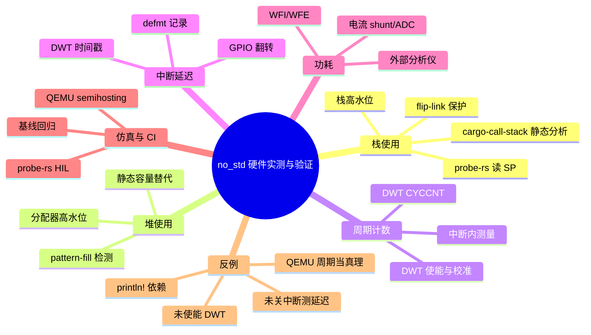
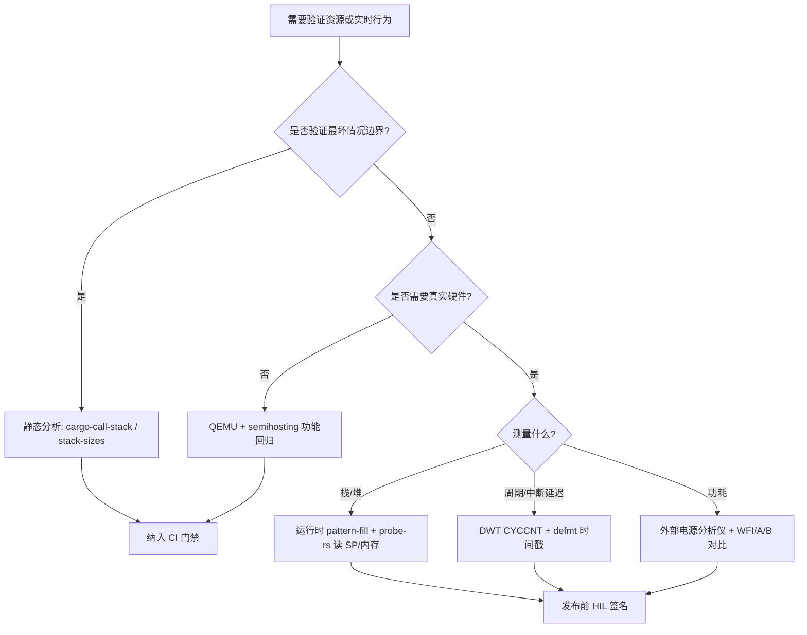
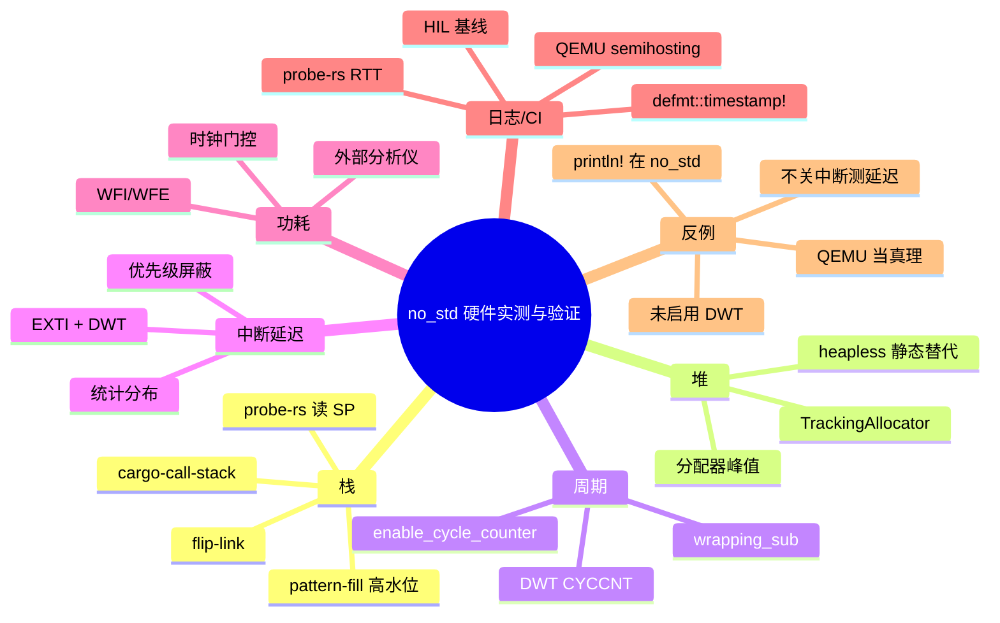

> **内容分级**: [进阶/专家]
> **代码状态**: ⚠️ 裸机/目标平台相关代码标注 `rust,ignore`/`no_run`，host 平台无法直接编译
> **定理链**: N/A — 描述性/工程性文档
>
# no_std 硬件实测与验证
>
> **EN**: no_std Hardware Measurement and Validation
> **Summary**: Patterns and techniques for measuring stack/heap usage, cycle counts, interrupt latency, and power consumption on no_std embedded targets using probe-rs, DWT, ITM, semihosting, and QEMU.
> **Rust 版本**: 1.97.0+ (Edition 2024)
>
> **受众**: [进阶/专家]
> **Bloom 层级**: L3-L4
> **权威来源**: 本文件为 `concept/` 权威页。
> **A/S/P 标记**: **S+P** — Structure + Procedure
> **双维定位**: P×App — 在真实硬件或仿真器上测量并验证 `#![no_std]` 系统的资源与实时行为
> **定位**: 系统讲解 `#![no_std]` 嵌入式项目的可观测性测量技术——栈/堆高水位、DWT 周期计数、中断延迟、功耗，以及如何通过 `probe-rs`、`defmt`、QEMU semihosting、`flip-link` 等工具把测量纳入 CI 与发布签名流程。
> **前置概念**:
> [`#![no_std]` 与裸机编程惯用法](23_no_std_and_bare_metal_idioms.md) ·
> [defmt / probe-rs / Knurling 调试架构与原理](36_defmt_probe_rs_architecture.md) ·
> [no_std Rust 嵌入式测试与 CI 策略](32_embedded_testing_and_ci_strategies.md)
> **后置概念**:
> [Embassy 框架深度解析](34_embassy_framework_deep_dive.md) ·
> [RTIC 框架深度解析](35_rtic_framework_deep_dive.md) ·
> [SEI CERT C 到 Rust 的映射：嵌入式安全编码](33_sei_cert_c_to_rust_mapping.md) ·
> [Rust vs Ada/SPARK](../../05_comparative/01_systems_languages/07_rust_vs_ada_spark.md)

---

> **来源**:
> [The Embedded Rust Book](https://docs.rust-embedded.org/book/) ·
> [The Embedonomicon](https://docs.rust-embedded.org/embedonomicon/) ·
> [cortex-m crate](https://docs.rs/cortex-m/) ·
> [defmt Book](https://defmt.ferrous-systems.com/) ·
> [probe.rs](https://probe.rs/) ·
> [Knurling](https://knurling.ferrous-systems.com/) ·
> [flip-link](https://github.com/knurling-rs/flip-link) ·
> [QEMU](https://www.qemu.org/) ·
> [ARM DDI 0403 — Cortex-M4 DWT](https://developer.arm.com/documentation/ddi0403/latest/) ·
> [ARM DDI 0553 — Cortex-M7 DWT/ITM](https://developer.arm.com/documentation/ddi0553/latest/) ·
> [embedded-test](https://github.com/probe-rs/embedded-test) ·
> [cargo-call-stack](https://github.com/japaric/cargo-call-stack) ·
> [stack-sizes](https://github.com/japaric/stack-sizes)

---

## 🧠 知识结构图



## 📑 目录

- [no_std 硬件实测与验证](#no_std-硬件实测与验证)
  - [🧠 知识结构图](#-知识结构图)
  - [📑 目录](#-目录)
  - [一、权威定义](#一权威定义)
  - [二、测量维度属性矩阵](#二测量维度属性矩阵)
  - [三、栈使用测量与溢出保护](#三栈使用测量与溢出保护)
    - [3.1 flip-link 栈溢出保护](#31-flip-link-栈溢出保护)
    - [3.2 运行时栈高水位](#32-运行时栈高水位)
    - [3.3 静态栈深度估计](#33-静态栈深度估计)
  - [四、堆使用测量](#四堆使用测量)
  - [五、DWT 周期计数](#五dwt-周期计数)
  - [六、中断延迟测量](#六中断延迟测量)
  - [七、功耗测量基础](#七功耗测量基础)
  - [八、defmt 时间戳与 probe-rs 集成](#八defmt-时间戳与-probe-rs-集成)
  - [九、QEMU semihosting 回归](#九qemu-semihosting-回归)
  - [十、完整 Rust 示例](#十完整-rust-示例)
  - [十一、反例与失效模式](#十一反例与失效模式)
  - [十二、决策树：选择测量手段](#十二决策树选择测量手段)
  - [十三、相关概念](#十三相关概念)
  - [十四、权威来源索引](#十四权威来源索引)
  - [🧭 思维导图（Mindmap）](#-思维导图mindmap)
  - [国际化权威来源补充（International Authority Sources）](#国际化权威来源补充international-authority-sources)

---

## 一、权威定义

> **The Embedded Rust Book**: Embedded programs often lack the rich OS observability of desktop systems; measurement must be done with on-chip debug units, external probes, or instrumentation in firmware itself.

**栈高水位（Stack High-Water Mark）**：程序运行至今栈曾达到的最大深度。通常用初始化为已知模式的 RAM 区，事后扫描被破坏的边界来估算。

**DWT（Data Watchpoint and Trace）**：ARM Cortex-M 调试组件中的计数与观察单元。`CYCCNT` 提供 32-bit 自由运行周期计数器，是测量代码段周期数与中断延迟的事实标准。

**ITM（Instrumentation Trace Macrocell）**：ARM Cortex-M 跟踪单元，可通过专用跟踪端口输出时间戳与软件事件，适合高频、低侵入的日志与 trace。

**semihosting**：目标 MCU 通过调试接口调用 host 服务（如文件 I/O、退出 QEMU），常用于无硬件 CI 测试与基准报告。

**probe-rs**：用 Rust 实现的调试工具链，可直接读写寄存器/内存、烧录、附加 RTT，并能通过脚本化 CLI 实现 HIL 测量。

**flip-link**：链接器包装器，把栈放到 RAM 最高地址并加 guard 页，使栈溢出触发 HardFault 而非静默破坏数据。

判定依据：`no_std` 嵌入式系统的可观测性分层为：静态分析（最坏情况栈/堆）→ 目标内自测量（DWT、defmt）→ 调试器采样（probe-rs 读 SP/内存）→ 外部仪器（功耗、逻辑分析仪）。没有任何单一手段能覆盖全部维度。

---

## 二、测量维度属性矩阵

| 维度 | 工具/技术 | 精度 | 侵入性 | 硬件依赖 | 典型用途 |
|:---|:---|:---:|:---:|:---:|:---|
| 栈深度（静态） | `cargo-call-stack` / `stack-sizes` | 保守估计 | 无 | 无 | CI 门禁、最坏情况分析 |
| 栈高水位（动态） | 初始化 pattern + 扫描 / probe-rs 读 SP | RAM 字级 | 低 | 调试器可选 | 发布前验证、回归检测 |
| 栈溢出保护 | `flip-link` | — | 无 | 无 | 强制 HardFault、测试覆盖 |
| 堆使用 | 分配器包装 / pattern-fill | 分配级 | 中 | 无/调试器 | 检测泄漏、碎片化 |
| 周期计数 | DWT `CYCCNT` | 1 cycle | 极低 | Cortex-M | 算法优化、ISR 预算 |
| 中断延迟 | DWT + GPIO 翻转 | 数十 cycle | 低 | 真实芯片 | 实时控制验收 |
| 功耗 | 外部分析仪 + `WFI` | µA/mA 级 | 无 | 专用仪器 | 电池设备验收 |
| 时间戳日志 | `defmt::timestamp!` | DWT/定时器级 | 低 | 调试器 | 事件排序、端到端延迟 |
| 零硬件回归 | QEMU semihosting | 功能级 | 无 | 无 | CI、启动测试 |

> **关键洞察**：静态分析给出**可证明的上界**，动态测量给出**实际运行值**，外部仪器给出**物理层真相**。三者互补，不能互相替代。

---

## 三、栈使用测量与溢出保护

### 3.1 flip-link 栈溢出保护

[flip-link](https://github.com/knurling-rs/flip-link) 改变 RAM 布局，使栈向低地址生长，并在栈底下方放置 guard 页。任何溢出会访问 guard 页，触发 MPU/HardFault。

```toml
# .cargo/config.toml
[target.thumbv7em-none-eabihf]
runner = "probe-rs run --chip STM32F407VG"
rustflags = [
    "-C", "linker=flip-link",
    "-C", "link-arg=-Tlink.x",
]

[build]
target = "thumbv7em-none-eabihf"

[unstable]
build-std = ["core", "compiler_builtins"]
build-std-features = ["compiler-builtins-mem"]
```

> **flip-link 要求**：链接脚本需暴露 `_stack_start`/`_stack_end`；`cortex-m-rt` 的 `link.x` 通常开箱可用。详细信息见 [defmt / probe-rs / Knurling 调试架构与原理](36_defmt_probe_rs_architecture.md)。

### 3.2 运行时栈高水位

在启动时把未初始化 RAM 填充为固定 pattern（如 `0xDEADBEEF`），运行一段时间后扫描被破坏的边界，即可估算栈实际最大深度。

```rust,ignore
#![no_std]
#![no_main]

use cortex_m_rt::entry;

#[entry]
fn main() -> ! {
    // 1. 在启动早期填充栈区（实际地址需与链接脚本对应）
    //    这里仅演示算法；真实地址通常来自 _stack_top 与 _sstack 等符号。
    let stack_bottom: *mut u32 = 0x2000_0000 as *mut u32;
    let stack_top: *mut u32 = 0x2002_0000 as *mut u32;
    unsafe {
        let mut p = stack_bottom;
        while p < stack_top {
            p.write_volatile(0xDEAD_BEEF);
            p = p.add(1);
        }
    }

    // 2. 运行业务代码
    run_workload();

    // 3. 扫描高水位
    let used = unsafe { measure_stack_high_watermark(stack_bottom, stack_top) };
    defmt::info!("stack high-watermark: {} bytes", used);

    loop { cortex_m::asm::wfi(); }
}

unsafe fn measure_stack_high_watermark(bottom: *mut u32, top: *mut u32) -> usize {
    let mut p = bottom;
    while p < top {
        if p.read_volatile() != 0xDEAD_BEEF {
            break;
        }
        p = p.add(1);
    }
    // p 为当前栈顶；已用字节 = top - p（栈向低地址生长）
    top as usize - p as usize
}
```

> **注意**：pattern-fill 会**覆盖**当前栈内容，必须在 `.bss`/`.data` 初始化之后、**尚未使用目标栈区**时执行；更安全的做法是在 `_start` 或 `PreInit` 中完成。

用 `probe-rs` 直接读取 SP 可替代手动扫描：

```bash
# 暂停目标后读取主栈指针（MSP）附近的 RAM
probe-rs read --chip STM32F407VG --32-bit 0x20000000 0x1000
```

### 3.3 静态栈深度估计

`cargo-call-stack` 通过 LLVM IR 估算最坏情况下调用链的栈使用量，适合在 CI 中做门禁：

```bash
# 安装（需要 nightly 工具链）
cargo install cargo-call-stack

# 分析 thumbv7em-none-eabihf 目标的栈使用
cargo +nightly call-stack --target thumbv7em-none-eabihf
```

`stack-sizes` 可列出每个函数的栈帧大小，常与 `cargo-call-stack` 配合使用。两者均基于静态分析，结果保守；实际运行时通常远低于最坏值。

---

## 四、堆使用测量

`no_std` 中若使用全局分配器，可包装 `GlobalAlloc` 记录当前/峰值分配量。

```rust,ignore
#![no_std]
extern crate alloc;

use alloc::alloc::{GlobalAlloc, Layout};
use core::sync::atomic::{AtomicUsize, Ordering};

pub struct TrackingAllocator<A: GlobalAlloc> {
    inner: A,
    used: AtomicUsize,
    peak: AtomicUsize,
}

unsafe impl<A: GlobalAlloc> GlobalAlloc for TrackingAllocator<A> {
    unsafe fn alloc(&self, layout: Layout) -> *mut u8 {
        let ptr = self.inner.alloc(layout);
        if !ptr.is_null() {
            let size = layout.size();
            let prev = self.used.fetch_add(size, Ordering::Relaxed);
            let current = prev + size;
            let mut peak = self.peak.load(Ordering::Relaxed);
            while current > peak {
                match self.peak.compare_exchange_weak(
                    peak, current, Ordering::Relaxed, Ordering::Relaxed
                ) {
                    Ok(_) => break,
                    Err(actual) => peak = actual,
                }
            }
        }
        ptr
    }

    unsafe fn dealloc(&self, ptr: *mut u8, layout: Layout) {
        self.inner.dealloc(ptr, layout);
        self.used.fetch_sub(layout.size(), Ordering::Relaxed);
    }
}

impl<A: GlobalAlloc> TrackingAllocator<A> {
    pub const fn new(inner: A) -> Self {
        Self { inner, used: AtomicUsize::new(0), peak: AtomicUsize::new(0) }
    }

    pub fn peak_used(&self) -> usize {
        self.peak.load(Ordering::Relaxed)
    }
}
```

> **替代方案**：若项目使用 `heapless::Vec`、`heapless::Pool` 等静态容器，则堆使用完全由编译期容量决定，无需运行时测量。更多静态容器选择见 [`#![no_std]` 与裸机编程惯用法](23_no_std_and_bare_metal_idioms.md)。

---

## 五、DWT 周期计数

ARM Cortex-M3/M4/M7 等核心内置 DWT `CYCCNT`，分辨率等于 CPU 时钟周期。启用后可在代码任意位置读取。

```rust,ignore
#![no_std]
#![no_main]

use cortex_m::peripheral::{Peripherals, DWT};
use cortex_m_rt::entry;

#[entry]
fn main() -> ! {
    let mut cp = Peripherals::take().unwrap();
    // 启用 DWT 周期计数器
    cp.DWT.enable_cycle_counter();

    let start = DWT::get_cycle_count();
    let result = compute_checksum(&[0u8; 256]);
    let elapsed = DWT::get_cycle_count().wrapping_sub(start);

    defmt::info!("checksum={} cycles={}", result, elapsed);
    loop { cortex_m::asm::wfi(); }
}

fn compute_checksum(data: &[u8]) -> u8 {
    data.iter().fold(0u8, |a, &b| a.wrapping_add(b))
}
```

> **关键约束**：
> - `CYCCNT` 是 32-bit，高速 MCU 上几秒到数十秒会回绕；测量长任务需使用 `wrapping_sub` 并在意累积误差。
> - DWT 在部分 Cortex-M0/M0+ 上不存在；这些目标需使用 SysTick 或外部定时器。
> - 多核/带 cache 场景下，`CYCCNT` 反映 CPU 周期，不等于 wall-clock 时间；测量 cache miss 影响需结合 PMU 或 ITM。

---

## 六、中断延迟测量

中断延迟 = 中断请求到 ISR 第一条指令执行的周期数。常用方法是在触发中断源的同时记录 `CYCCNT`，在 ISR 入口再次读取。

```rust,ignore
#![no_std]
#![no_main]

use core::sync::atomic::{AtomicU32, Ordering};
use cortex_m::peripheral::{DWT, Peripherals};
use cortex_m_rt::entry;
use stm32f4xx_hal::{gpio::*, pac, prelude::*};

static START: AtomicU32 = AtomicU32::new(0);

#[entry]
fn main() -> ! {
    let mut cp = Peripherals::take().unwrap();
    cp.DWT.enable_cycle_counter();

    let dp = pac::Peripherals::take().unwrap();
    let gpioc = dp.GPIOC.split();
    let mut exti = dp.EXTI;

    // 配置外部中断（示例：PC0 上升沿）
    let _button = gpioc.pc0.into_pull_down_input();
    exti.imr1.modify(|_, w| w.mr0().set_bit());
    exti.rtsr1.modify(|_, w| w.tr0().set_bit());

    loop {
        // 等待中断触发；实际延迟由 EXTI0 中断服务程序测量
        cortex_m::asm::wfi();
    }
}

#[interrupt]
fn EXTI0() {
    let now = DWT::get_cycle_count();
    let start = START.load(Ordering::Relaxed);
    if start != 0 {
        let latency = now.wrapping_sub(start);
        defmt::info!("interrupt latency: {} cycles", latency);
    }
}
```

> **减小抖动**：关闭非必要中断、固定 CPU 频率、避免在测量期间进入低功耗模式。若需要统计分布，可多次触发并记录最大/最小/平均值。

---

## 七、功耗测量基础

功耗无法在 MCU 内部用纯软件精确测量，但软件可以通过低功耗模式与事件门控显著影响结果。

| 技术 | 说明 |
|:---|:---|
| `WFI` / `WFE` | 让 CPU 进入睡眠，等待中断或事件；适合事件驱动任务 |
| 关闭未使用外设时钟 | 通过 RCC/PMU 寄存器关闭 GPIO/TIM/ADC 等时钟 |
| 调整 CPU 频率 | 在满足实时预算前提下降低主频 |
| 外部分析仪 | 使用精密电源、电流探头或专用低功耗分析仪测量总电流 |
| 片上 ADC + shunt 电阻 | 成本低，适合长期趋势监测，精度受参考电压与噪声影响 |

```rust,ignore
// 空闲时进入 WFI，等待下一个中断
loop {
    cortex_m::asm::wfi();
}
```

> **判定依据**：功耗优化是**系统级**工作——先通过外部仪器建立基线，再用 `WFI`/时钟门控做 A/B 对比，最后用 DWT 周期数保证实时约束未退化。

---

## 八、defmt 时间戳与 probe-rs 集成

`defmt::timestamp!` 为每条日志添加单调时间戳，是测量事件顺序与端到端延迟的轻量手段。

```rust,ignore
#![no_std]
#![no_main]

use core::sync::atomic::{AtomicU32, Ordering};
use cortex_m::peripheral::DWT;
use cortex_m_rt::entry;

static TICKS: AtomicU32 = AtomicU32::new(0);

// 在 crate 根定义一次：所有 defmt 日志都会带上该时间戳
defmt::timestamp!("{=u32:us}", TICKS.load(Ordering::Relaxed));

#[entry]
fn main() -> ! {
    let mut cp = cortex_m::Peripherals::take().unwrap();
    cp.DWT.enable_cycle_counter();

    // 用 DWT 周期数换算为微秒（需已知 CPU 频率）
    // 例如 48 MHz：1 us = 48 cycles
    const CYCLES_PER_US: u32 = 48;

    loop {
        let now = DWT::get_cycle_count() / CYCLES_PER_US;
        TICKS.store(now, Ordering::Relaxed);

        defmt::info!("loop iteration");
        cortex_m::asm::delay(48_000_000);
    }
}
```

> **probe-rs 集成**：当 runner 配置为 `probe-rs run` 时，`defmt` 帧会自动通过 RTT 传输并在主机端解码。时间戳模板 `{=u32:us}` 让日志直接显示为微秒级时间轴，便于与示波器/逻辑分析仪对比。

---

## 九、QEMU semihosting 回归

无硬件时，可用 QEMU + semihosting 运行 `#![no_std]` 镜像，并通过 `cortex-m-semihosting::debug::exit` 报告成功/失败。

```rust,ignore
#![no_std]
#![no_main]

use cortex_m_rt::entry;
use cortex_m_semihosting::debug;

#[entry]
fn main() -> ! {
    let cycles = benchmark_sort();

    if cycles < EXPECTED_BUDGET {
        debug::exit(debug::EXIT_SUCCESS);
    } else {
        debug::exit(debug::EXIT_FAILURE);
    }
}

fn benchmark_sort() -> u32 {
    // 示例：测量某个算法周期数
    1234
}

const EXPECTED_BUDGET: u32 = 10_000;
```

运行：

```bash
cargo build --target thumbv6m-none-eabi --release

qemu-system-arm -machine micro:bit -semihosting \
  -kernel target/thumbv6m-none-eabi/release/app
```

> **限制**：QEMU 不精确建模外设时序、cache、硬件 errata，因此 QEMU 测得的周期数只能用于**功能回归与相对趋势**，不能作为真实硬件时序的最终验收。更多测试分层见 [no_std Rust 嵌入式测试与 CI 策略](32_embedded_testing_and_ci_strategies.md)。

---

## 十、完整 Rust 示例

下面展示一个把 **DWT 周期计数**、**栈高水位扫描**、**defmt 时间戳**与 **flip-link** 结合使用的测量骨架。

```rust,ignore
#![no_std]
#![no_main]

use core::sync::atomic::{AtomicU32, Ordering};
use cortex_m::peripheral::{DWT, Peripherals};
use cortex_m_rt::entry;
use cortex_m_semihosting::debug;

static TICKS: AtomicU32 = AtomicU32::new(0);

defmt::timestamp!("{=u32:us}", TICKS.load(Ordering::Relaxed));

#[entry]
fn main() -> ! {
    // 启用 DWT
    let mut cp = Peripherals::take().unwrap();
    cp.DWT.enable_cycle_counter();

    // 示例：填充栈 pattern（地址需按实际芯片调整）
    unsafe {
        fill_stack_pattern(0x2000_0000 as *mut u32, 0x2001_0000 as *mut u32);
    }

    let start = DWT::get_cycle_count();
    run_workload();
    let elapsed = DWT::get_cycle_count().wrapping_sub(start);

    let stack_used = unsafe {
        measure_stack_high_watermark(
            0x2000_0000 as *mut u32,
            0x2001_0000 as *mut u32,
        )
    };

    let now_us = DWT::get_cycle_count() / 48;
    TICKS.store(now_us, Ordering::Relaxed);

    defmt::info!("elapsed cycles={} stack_used={}", elapsed, stack_used);
    debug::exit(debug::EXIT_SUCCESS);
}

unsafe fn fill_stack_pattern(bottom: *mut u32, top: *mut u32) {
    let mut p = bottom;
    while p < top {
        p.write_volatile(0xDEAD_BEEF);
        p = p.add(1);
    }
}

unsafe fn measure_stack_high_watermark(bottom: *mut u32, top: *mut u32) -> usize {
    let mut p = bottom;
    while p < top && p.read_volatile() == 0xDEAD_BEEF {
        p = p.add(1);
    }
    top as usize - p as usize
}

fn run_workload() {
    let mut sum = 0u32;
    for i in 0..1000 {
        sum = sum.wrapping_add(i);
    }
    let _ = sum;
}
```

> **工程实践**：把上述测量代码放到 `#[cfg(feature = "benchmark")]` 或独立 example 中，避免污染发布固件。参考 [`crates/c13_embedded/real-hardware-demos/`](../../../crates/c13_embedded/real-hardware-demos/) 中的 Embassy/RTIC 示例。

---

## 十一、反例与失效模式

### 11.1 反例：未启用 DWT 就读取周期数

```rust,ignore
// ❌ 错误：DWT 周期计数器默认关闭
let start = DWT::get_cycle_count();
work();
let elapsed = DWT::get_cycle_count() - start;
```

> **修正**：必须先调用 `DWT::enable_cycle_counter()`；否则读到的值是未定义或零。

### 11.2 反例：把 QEMU 周期数当作真实硬件真理

**场景**：在 QEMU 中测得某算法 1200 cycles，直接写进规格书。

> **修正**：QEMU 是功能级仿真；真实 MCU 的 pipeline、flash wait states、cache、bus matrix 会让结果不同。最终验收必须在目标芯片上复测。

### 11.3 反例：在 `no_std` 中使用 `println!` 输出测量结果

```rust,ignore
// ❌ 错误：no_std 没有 stdout
println!("cycles={}", cycles);
```

> **修正**：使用 `defmt::info!`、`rtt-target`、UART HAL 或 semihosting。详见 [defmt / probe-rs / Knurling 调试架构与原理](36_defmt_probe_rs_architecture.md)。

### 11.4 反例：测量中断延迟时未关全局中断

```rust,ignore
// ❌ 错误：其他中断会抢占 EXTI0，导致测到的是最坏累积延迟
let start = DWT::get_cycle_count();
trig_exti();
```

> **修正**：测量最小延迟时屏蔽同级/低优先级中断；测量真实场景分布时保留正常中断，但结果应给出统计区间而非单值。

### 11.5 反例：忽略 `CYCCNT` 回绕

```rust,ignore
// ❌ 错误：未使用 wrapping_sub，长运行会溢出 panic（debug）或得到错误值
let elapsed = end - start;
```

> **修正**：始终使用 `wrapping_sub`；超 32-bit 范围的测量应使用多个周期计数器或 software tick。

### 11.6 失效模式矩阵

| 失效模式 | 根因 | 修复方向 |
|:---|:---|:---|
| DWT 读数为 0 或恒定 | 未启用 DWT / 调试器未连接 | 调用 `enable_cycle_counter()` 并确认 DBGMCU 配置 |
| 栈高水位远超静态估计 | 深度递归 / 大局部数组 / 未使能 flip-link | 检查调用链、改用静态容器、启用 flip-link |
| 堆峰值持续增长 | 内存泄漏 / 未释放临时对象 | 使用 tracking allocator、审查 alloc 调用点 |
| 中断延迟抖动大 | 其他 ISR 抢占、低功耗退出延迟 | 固定优先级、关闭无关中断、基准测试时禁用 WFI |
| QEMU 通过但硬件失败 | 未建模外设时序 / 栈/链接脚本目标差异 | 增加 target-build 与 HIL 测试 |
| 功耗回归无法定位 | 未建立基线、未关闭外设时钟 | 用外部分析仪做 A/B 对比、记录各模式电流 |

---

## 十二、决策树：选择测量手段



> **使用方式**：对每个发布版本，先通过静态分析获得边界，再在真实硬件上抽样测量关键路径，最后把结果归档到 release note。如果结果与静态分析差距过大，应审查是否有隐藏递归或动态分配。

---

## 十三、相关概念

- [`#![no_std]` 与裸机编程惯用法](23_no_std_and_bare_metal_idioms.md)
- [defmt / probe-rs / Knurling 调试架构与原理](36_defmt_probe_rs_architecture.md)
- [no_std Rust 嵌入式测试与 CI 策略](32_embedded_testing_and_ci_strategies.md)
- [Embassy 框架深度解析](34_embassy_framework_deep_dive.md)
- [RTIC 框架深度解析](35_rtic_framework_deep_dive.md)
- [SEI CERT C 到 Rust 的映射：嵌入式安全编码](33_sei_cert_c_to_rust_mapping.md)
- [嵌入式内存布局与堆安全](29_embedded_memory_layout_and_heap_safety.md)
- [Cortex-M 与 RISC-V 中断异常模型](14_interrupt_and_exception_model.md)
- [嵌入式调试与日志](20_embedded_debugging_logging.md)
- [安全关键嵌入式 Rust 指南：MISRA-Rust、Ferrocene 与 IEC 61508](30_misra_rust_safety_critical_guidelines.md)

---

## 十四、权威来源索引

- **P0 官方来源**:
  - [Rust Reference — `no_std`](https://doc.rust-lang.org/reference/names/preludes.html#the-no_std-attribute)
  - [The Embedded Rust Book](https://docs.rust-embedded.org/book/)
  - [The Embedonomicon](https://docs.rust-embedded.org/embedonomicon/)
  - [ARM DDI 0403 — Cortex-M4 DWT](https://developer.arm.com/documentation/ddi0403/latest/)
  - [ARM DDI 0553 — Cortex-M7 DWT/ITM](https://developer.arm.com/documentation/ddi0553/latest/)

- **P1 学术来源**:
  - [A Survey of Rust Embedded Development (arXiv)](https://arxiv.org/abs/2311.05063)

- **P2 生态来源**:
  - [probe-rs](https://probe.rs/)
  - [defmt](https://defmt.ferrous-systems.com/)
  - [Knurling](https://knurling.ferrous-systems.com/)
  - [flip-link](https://github.com/knurling-rs/flip-link)
  - [cortex-m crate](https://docs.rs/cortex-m/)
  - [cortex-m-semihosting crate](https://docs.rs/cortex-m-semihosting/)
  - [embedded-test](https://github.com/probe-rs/embedded-test)
  - [cargo-call-stack](https://github.com/japaric/cargo-call-stack)
  - [stack-sizes](https://github.com/japaric/stack-sizes)
  - [QEMU](https://www.qemu.org/)

> **权威来源对齐变更日志**: 2026-08-03 创建

---

**文档版本**: 1.0
**最后更新**: 2026-08-03
**状态**: ✅ 概念文件创建完成

---

## 🧭 思维导图（Mindmap）



> **认知功能**: 本 mindmap 从栈、堆、周期、中断延迟、功耗、日志/CI 与反例七个维度组织硬件测量知识，可作为 `#![no_std]` 项目可观测性方案选型与发布验收的快速导航索引。

## 国际化权威来源补充（International Authority Sources）

- <https://docs.rust-embedded.org/book/>
- <https://docs.rust-embedded.org/embedonomicon/>
- <https://probe.rs/>
- <https://defmt.ferrous-systems.com/>
- <https://github.com/knurling-rs/flip-link>
- <https://www.qemu.org/>
