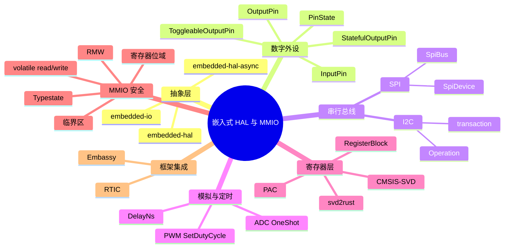
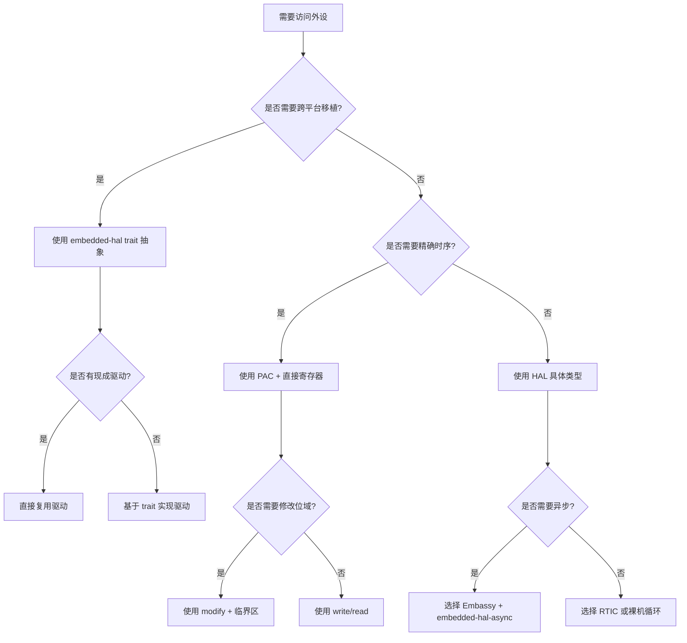

# 嵌入式 HAL 与 MMIO：从 trait 语义到类型安全的寄存器访问

**EN**: Embedded HAL and MMIO: Trait Semantics and Type-Safe Register Access
**Summary**: A comprehensive guide to the `embedded-hal` trait ecosystem, PAC/SVD-generated register blocks, memory-mapped I/O type safety, read-modify-write semantics, typestate peripherals, and their integration with `no_std`, Embassy, and RTIC.

> **Rust 版本**: 1.97.0+ (Edition 2024)
> **Bloom 层级**: L5
> **权威来源**: 本文件为 `concept/06_ecosystem/05_systems_and_embedded/` 下嵌入式 HAL trait 与 MMIO 类型安全的 `concept/` 权威页。
> **相关页**: 本页聚焦 trait 语义与寄存器安全；嵌入式系统概览见 [`03_embedded_systems.md`](03_embedded_systems.md)，embedded-hal 1.0 迁移背景见 [`09_embedded_hal_1_0_migration.md`](09_embedded_hal_1_0_migration.md)，PAC/HAL 实现细节见 [`17_pac_hal_implementation.md`](17_pac_hal_implementation.md)，Memory-Mapped Peripherals 与 Typestate 设计见 [`25_memory_mapped_peripherals_and_typestate.md`](25_memory_mapped_peripherals_and_typestate.md)，驱动惯用法见 [`24_embedded_hal_and_driver_idioms.md`](24_embedded_hal_and_driver_idioms.md)；跨层对比见 [`Rust vs C++`](../../05_comparative/01_systems_languages/01_rust_vs_cpp.md)。

## Mindmap



## 1. 概述与定位

在裸机或 RTOS 之上开发嵌入式 Rust 程序时，通常要面对三层接口：

1. **芯片寄存器层**：通过 `svd2rust` 生成的 **PAC**（Peripheral Access Crate）直接访问 `0x4000_0000` 等 MMIO 地址。
2. **硬件抽象层（HAL）**：由芯片厂商或社区基于 PAC 实现 `embedded-hal` trait，提供跨平台统一的 `OutputPin`、`SpiBus`、`I2c` 等接口。
3. **框架层**：Embassy、RTIC 等调度框架在 HAL 之上组织任务、中断、DMA 与异步执行器。

`embedded-hal` 的核心价值不是“提供实现”，而是**定义互操作契约**。只要驱动代码只依赖 `embedded-hal` trait，就可以在不同 MCU 的 HAL 之间移植；只要 HAL 正确实现这些 trait，就可以运行大量已有驱动。

本页从 trait 语义出发，逐层剖析：

- `embedded-hal` 1.0 的 trait 设计（数字 IO、SPI、I2C、ADC、PWM、Delay）。
- `embedded-io` 对串口/字符设备的接管。
- PAC 与 CMSIS-SVD/`svd2rust` 的生成模型。
- MMIO 的类型安全：volatile、位域、RMW、类型状态机。
- 与 `no_std`、Embassy、RTIC 的分层关系。

## 2. `embedded-hal` 设计哲学

### 2.1 为什么是 trait，而不是具体类型

C 语言中，驱动通常直接调用 `HAL_GPIO_WritePin(...)` 或 `i2c_transfer(...)`。不同厂商的函数签名不同，导致驱动代码难以跨平台。Rust 通过 trait 把“能力”抽象出来：

- `OutputPin` 表示“可以被拉高/拉低的能力”。
- `SpiBus` 表示“在总线上进行 SPI 传输的能力”。
- `I2c` 表示“在 I2C 总线上进行读写的能力”。

驱动作者写：

```rust,ignore
use embedded_hal::digital::OutputPin;
use embedded_hal::spi::SpiDevice;

pub fn init_display<CS: OutputPin, SPI: SpiDevice>(
    cs: &mut CS,
    spi: &mut SPI,
) -> Result<(), DisplayError> { ... }
```

这里 `CS` 和 `SPI` 是类型参数，运行时零成本；编译期单态化后调用具体 HAL 实现，性能与直接调用寄存器相当。

### 2.2 `ErrorType` 与可组合错误

`embedded-hal` 1.0 把所有 trait 都拆成两部分：能力 trait 本身 + `ErrorType` trait。例如：

```rust
// 示意：embedded-hal 1.0 风格（改编自 embedded-hal crate，仅作教学）
pub trait ErrorType {
    type Error: core::fmt::Debug;
}

pub trait InputPin: ErrorType {
    fn is_high(&mut self) -> Result<bool, Self::Error>;
    fn is_low(&mut self) -> Result<bool, Self::Error> {
        self.is_high().map(|v| !v)
    }
}
```

每个 HAL 实现把自己的平台错误映射到 `Self::Error`。驱动代码可以用关联类型约束错误类型，也可以用 `DisplayError::from(e)` 做转换。

### 2.3 `no_std` 前提

所有 `embedded-hal` trait 都不依赖 `std`，因此可以在 `#![no_std]` 环境中使用。但它们通常依赖 `core`，并且需要 HAL 实现提供具体的错误类型。 trait 方法返回 `Result`，不 panic，符合资源受限环境的错误处理习惯。

## 3. 数字 IO trait 语义

数字 IO 是最常用的外设能力。`embedded-hal::digital` 把“引脚”抽象成四种能力：

| trait | 表示能力 | 关键方法 |
|-------|----------|----------|
| `ErrorType` | 错误关联类型 | `type Error` |
| `InputPin` | 输入读取 | `is_high`, `is_low` |
| `OutputPin` | 输出设置 | `set_high`, `set_low`, `set_state` |
| `StatefulOutputPin` | 读取输出寄存器当前状态 | `is_set_high`, `is_set_low` |
| `ToggleableOutputPin` | 翻转输出 | `toggle` |

### 3.1 `InputPin`：输入采样

```rust
// 教学用简化 trait 定义
pub trait ErrorType {
    type Error: core::fmt::Debug;
}

pub trait InputPin: ErrorType {
    /// 读取引脚电平，高电平返回 true
    fn is_high(&mut self) -> Result<bool, Self::Error>;

    /// 默认实现基于 is_high 取反
    fn is_low(&mut self) -> Result<bool, Self::Error> {
        self.is_high().map(|v| !v)
    }
}
```

注意方法接受 `&mut self`。这是因为某些 HAL 在读取输入寄存器时需要临时修改配置（如上拉/下拉切换），或者为了闭包借用一致性采用统一的可变引用。

```rust,ignore
use embedded_hal::digital::InputPin;

fn wait_for_button<P: InputPin>(btn: &mut P) -> Result<(), P::Error> {
    while btn.is_low()? {}
    Ok(())
}
```

### 3.2 `OutputPin`：输出驱动

```rust
pub trait OutputPin: ErrorType {
    fn set_high(&mut self) -> Result<(), Self::Error>;
    fn set_low(&mut self) -> Result<(), Self::Error>;
    fn set_state(&mut self, state: PinState) -> Result<(), Self::Error>;
}

#[derive(Copy, Clone, Debug, PartialEq, Eq)]
pub enum PinState {
    Low,
    High,
}
```

`PinState` 允许驱动代码以值的方式传递目标电平，避免大量 `if high { set_high() } else { set_low() }` 分支：

```rust,ignore
use embedded_hal::digital::{OutputPin, PinState};

fn set_led<P: OutputPin>(led: &mut P, on: bool) -> Result<(), P::Error> {
    led.set_state(if on { PinState::High } else { PinState::Low })
}
```

### 3.3 `StatefulOutputPin` 与 `ToggleableOutputPin`

```rust
pub trait StatefulOutputPin: OutputPin {
    fn is_set_high(&self) -> Result<bool, Self::Error>;
    fn is_set_low(&self) -> Result<bool, Self::Error> {
        self.is_set_high().map(|v| !v)
    }
}

pub trait ToggleableOutputPin: ErrorType {
    fn toggle(&mut self) -> Result<(), Self::Error>;
}
```

`StatefulOutputPin` 读的是**输出数据寄存器**，不是外部引脚电平；外部可能因为驱动能力不足或冲突导致不同。`ToggleableOutputPin` 通常用硬件翻转位实现，比“读-改-写”更安全。

### 3.4 异步 Wait trait

`embedded-hal-async::digital::Wait` 让输入引脚支持边沿/电平等待，常与 Embassy 配合：

```rust,ignore
use embedded_hal_async::digital::Wait;

async fn blink_on_press<P: Wait + InputPin>(btn: &mut P, led: &mut impl OutputPin) {
    loop {
        btn.wait_for_rising_edge().await.unwrap();
        led.toggle().unwrap();
    }
}
```

这里的 `Wait` 不替代 `InputPin`；它们可以组合使用，因为 `embassy-stm32` 的 GPIO 引脚通常同时实现两者。

## 4. 串行总线 trait：SPI / I2C

### 4.1 SPI：`SpiBus` 与 `SpiDevice`

`embedded-hal` 1.0 把 SPI 拆成两个 trait，解决“总线共享 + 片选管理”问题：

- **`SpiBus`**：控制底层 MOSI/MISO/SCK 总线，通常一个物理 SPI 外设对应一个实现。
- **`SpiDevice`**：代表一个**带片选**的具体从设备；它内部持有 `SpiBus` 引用并在事务期间自动拉低/拉高 CS。

```rust
pub trait ErrorType {
    type Error;
}

pub trait SpiBus<Word: Copy + 'static>: ErrorType {
    fn read(&mut self, words: &mut [Word]) -> Result<(), Self::Error>;
    fn write(&mut self, words: &[Word]) -> Result<(), Self::Error>;
    fn transfer(&mut self, read: &mut [Word], write: &[Word]) -> Result<(), Self::Error>;
    fn transfer_in_place(&mut self, words: &mut [Word]) -> Result<(), Self::Error>;
    fn flush(&mut self) -> Result<(), Self::Error>;
}

pub enum Operation<'a, Word: 'static> {
    Read(&'a mut [Word]),
    Write(&'a [Word]),
    TransferInPlace(&'a mut [Word]),
    DelayNs(u32),
}

pub trait SpiDevice<Word: Copy + 'static>: ErrorType {
    fn transaction(&mut self, operations: &mut [Operation<'_, Word>]) -> Result<(), Self::Error>;
    fn read(&mut self, buf: &mut [Word]) -> Result<(), Self::Error>;
    fn write(&mut self, buf: &[Word]) -> Result<(), Self::Error>;
    fn transfer(&mut self, read: &mut [Word], write: &[Word]) -> Result<(), Self::Error>;
    fn transfer_in_place(&mut self, buf: &mut [Word]) -> Result<(), Self::Error>;
}
```

`SpiDevice` 的默认实现会把 `read`、`write` 等操作封装成单个 `Operation` 数组事务，保证片选在整个事务期间保持有效。

```rust,ignore
use embedded_hal::spi::{SpiDevice, Operation};
use embedded_hal::delay::DelayNs;

fn read_sensor_id<DEV, DELAY>(
    dev: &mut DEV,
    delay: &mut DELAY,
    buf: &mut [u8],
) -> Result<(), DEV::Error>
where
    DEV: SpiDevice<u8>,
    DELAY: DelayNs,
{
    let mut ops = [
        Operation::Write(&[0x9F]),     // 发送 READ_ID 命令
        Operation::DelayNs(10_000),    // 等待 10 us
        Operation::Read(buf),          // 读取 ID
    ];
    dev.transaction(&mut ops)?;
    Ok(())
}
```

### 4.2 I2C：`I2c` 与 `Operation`

```rust
pub trait ErrorType {
    type Error;
}

pub trait I2c<A: AddressMode = SevenBitAddress>: ErrorType {
    fn read(&mut self, address: A, read: &mut [u8]) -> Result<(), Self::Error>;
    fn write(&mut self, address: A, write: &[u8]) -> Result<(), Self::Error>;
    fn write_read(
        &mut self,
        address: A,
        write: &[u8],
        read: &mut [u8],
    ) -> Result<(), Self::Error>;
    fn transaction(
        &mut self,
        address: A,
        operations: &mut [Operation<'_>],
    ) -> Result<(), Self::Error>;
}

pub enum Operation<'a> {
    Read(&'a mut [u8]),
    Write(&'a [u8]),
}

pub trait AddressMode: Copy + PartialEq {}
pub enum SevenBitAddress {}
pub enum TenBitAddress {}
impl AddressMode for SevenBitAddress {}
impl AddressMode for TenBitAddress {}
```

`write_read` 对应 I2C 的“写-重复启动-读”序列；驱动作者应优先用它而不是手动拆成 `write` + `read`，因为后者会释放总线，破坏协议。

```rust,ignore
use embedded_hal::i2c::I2c;

fn read_temperature<I: I2c>(bus: &mut I, addr: u8, buf: &mut [u8]) -> Result<(), I::Error> {
    bus.write_read(addr, &[0x00], buf)?; // 0x00 为温度寄存器指针
    Ok(())
}
```

### 4.3 共享总线：`RefCellCell` 与 `Mutex`

`SpiDevice` 通过 `&mut self` 独占访问，因此多个 `SpiDevice` 可以共享同一个 `SpiBus`：

```rust,ignore
use embedded_hal_bus::spi::RefCellDevice;

let bus: RefCell<impl SpiBus<u8>> = RefCell::new(spi);
let dev_a = RefCellDevice::new(&bus)?;
let dev_b = RefCellDevice::new(&bus)?;
```

在单线程裸机中，可以用 `RefCellDevice`；在中断环境中必须使用 `MutexDevice`（基于 `critical-section`）以避免 ISR 抢占导致借用冲突。

## 5. 模拟外设与延时 trait

### 5.1 ADC：`OneShot`

```rust
# pub trait ErrorType { type Error; }
pub trait OneShot<Word, Channel: ?Sized>: ErrorType {
    fn read(&mut self, channel: &mut Channel) -> Result<Word, Self::Error>;
}
```

`OneShot` 表示“单次采样”能力。`Channel` 由 HAL 定义，通常是一个枚举或类型状态引脚。

```rust,ignore
use embedded_hal::adc::OneShot;
use stm32f4xx_hal::adc::Adc;
use stm32f4xx_hal::gpio::gpioa::PA0;

let mut adc = Adc::setup(dp.ADC1, ...);
let mut pin = gpioa.pa0.into_analog();
let sample: u16 = adc.read(&mut pin)?;
```

注意 `read(&mut self, &mut Channel)` 需要 `Channel` 可变引用，因为某些 HAL 会在采样期间临时切换引脚配置。

### 5.2 PWM：`SetDutyCycle`

```rust
pub trait SetDutyCycle: ErrorType {
    fn max_duty_cycle(&self) -> u16;
    fn set_duty_cycle(&mut self, duty: u16) -> Result<(), Self::Error>;
    fn set_duty_cycle_fully_on(&mut self) -> Result<(), Self::Error> {
        self.set_duty_cycle(self.max_duty_cycle())
    }
    fn set_duty_cycle_fully_off(&mut self) -> Result<(), Self::Error> {
        self.set_duty_cycle(0)
    }
}
```

`max_duty_cycle` 返回定时器 ARR 寄存器值，驱动按百分比换算：

```rust,ignore
fn set_duty_percent<P: SetDutyCycle>(pwm: &mut P, percent: u8) -> Result<(), P::Error> {
    let max = pwm.max_duty_cycle();
    let duty = (max as u32 * percent.min(100) as u32 / 100) as u16;
    pwm.set_duty_cycle(duty)
}
```

### 5.3 延时：`DelayNs`

```rust
pub trait DelayNs {
    fn delay_ns(&mut self, ns: u32);
    fn delay_us(&mut self, us: u32) {
        self.delay_ns(us * 1_000)
    }
    fn delay_ms(&mut self, ms: u32) {
        self.delay_ns(ms * 1_000_000)
    }
}
```

`DelayNs` 用纳秒作为统一单位，`delay_us` 与 `delay_ms` 有默认实现。HAL 通常基于 SysTick 或定时器实现。注意：忙等待延时会在中断关闭期间停止计时，长时间 `delay_ms` 可能影响系统响应。

## 6. Serial 与 `embedded-io`

在 `embedded-hal` 0.2.x 中，串口由 `serial::Read` / `serial::Write` trait 描述。1.0 版本把这些能力移到了独立的 `embedded-io` crate，因为字符流 IO 与“数字/总线外设”的语义差异较大：

```rust
// embedded-io 示意（教学用）
pub trait Read {
    fn read(&mut self, buf: &mut [u8]) -> Result<usize, Self::Error>;
    fn read_exact(&mut self, buf: &mut [u8]) -> Result<(), Self::Error>;
}

pub trait Write {
    fn write(&mut self, buf: &[u8]) -> Result<usize, Self::Error>;
    fn flush(&mut self) -> Result<(), Self::Error>;
    fn write_all(&mut self, buf: &[u8]) -> Result<(), Self::Error>;
}
```

异步版本位于 `embedded-io-async`，使用 `embedded_io_async::Read::read` 返回 `Future`。驱动代码如果只需要“字节流”，应依赖 `embedded-io` 而非 `embedded-hal` 的 `SpiBus`/`I2c`。

```rust,ignore
use embedded_io::Write;

fn send_line<W: Write>(uart: &mut W, s: &str) -> Result<(), W::Error> {
    uart.write_all(s.as_bytes())?;
    uart.write_all(b"\r\n")?;
    uart.flush()
}
```

## 7. `no_std` 与 `embedded-hal` 的关系

`embedded-hal` trait 本身不分配堆内存、不使用 `std::io`、不依赖 `panic = unwind`。它们可以在以下环境中工作：

- `#![no_std]` + `panic-halt` / `panic-semihosting`。
- 使用 `alloc` 但不使用 `std` 的环境。
- 标准 Linux 模拟环境（用于单元测试 HAL 包装器）。

### 7.1 `critical-section`

很多 `embedded-hal-bus` 共享总线工具依赖 `critical-section` crate 提供的平台无关临界区：

```rust,ignore
use critical_section::Mutex;
use core::cell::RefCell;

static I2C_BUS: Mutex<RefCell<Option<I2c1>>> = Mutex::new(RefCell::new(None));

critical_section::with(|cs| {
    I2C_BUS.borrow(cs).replace(Some(i2c));
});
```

`critical-section` 在 Cortex-M 上通过 `cortex-m::interrupt::free` 实现；在 RISC-V 上通过 `riscv::interrupt::free`；在 std 环境通过 `std::sync::Mutex`。HAL 驱动不需要知道底层实现细节。

### 7.2 错误类型与 `core::fmt::Debug`

`embedded-hal::ErrorType::Error` 只要求实现 `core::fmt::Debug`，不要求 `std::error::Error`。HAL 可以把 I2C 仲裁丢失、SPI 模式错误、GPIO 配置错误映射成自己的枚举。驱动作者通常用 `map_err` 转换为应用级错误。

## 8. PAC 与 SVD：从 CMSIS-SVD 到 `svd2rust` 生成的寄存器块

### 8.1 CMSIS-SVD 是什么

CMSIS-SVD（System View Description）是 ARM 定义的一种 XML 格式，用于描述微控制器外设寄存器布局。它由芯片厂商提供，包含：

- 外设基地址（`baseAddress`）。
- 寄存器名、偏移、大小、复位值、访问权限（read-only / write-only / read-write）。
- 寄存器字段（field）：位偏移、位宽、枚举值、读写权限。
- 中断号、时钟、DMA 请求等元数据。

典型片段如下（教学用）：

```xml
<peripheral>
  <name>GPIOA</name>
  <baseAddress>0x40020000</baseAddress>
  <registers>
    <register>
      <name>MODER</name>
      <addressOffset>0x00</addressOffset>
      <size>32</size>
      <resetValue>0xA8000000</resetValue>
      <fields>
        <field>
          <name>MODER0</name>
          <bitOffset>0</bitOffset>
          <bitWidth>2</bitWidth>
        </field>
      </fields>
    </register>
  </registers>
</peripheral>
```

### 8.2 `svd2rust` 输出结构

`svd2rust` 读取 SVD 文件后生成 PAC，主要产物包括：

1. **`Peripherals` 结构体**：包含所有外设单例，通过 `Peripherals::take()` 获取。
2. **`RegisterBlock`**：每个外设内部有一个 `RegisterBlock`，字段为各个寄存器。
3. **寄存器类型**：如 `crate::Reg<gpioa::moder::MODER_SPEC, gpioa::moder::RW>`，封装了 `read` / `write` / `modify` / `reset`。
4. **字段读写器**：`Reader` / `Writer` 提供类型安全的方法访问位域。

```rust,ignore
// 由 svd2rust 生成的伪代码
pub mod gpioa {
    pub struct RegisterBlock {
        pub moder: MODER,   // 0x00
        pub otyper: OTYPER, // 0x04
        pub ospeedr: OSPEEDR,
        pub pupdr: PUPDR,
        pub idr: IDR,
        pub odr: ODR,
        pub bsrr: BSRR,
        pub lckr: LCKR,
        pub afrl: AFRL,
        pub afrh: AFRH,
    }

    pub struct MODER;
    impl MODER {
        pub fn read(&self) -> MODER_R { ... }
        pub fn write(&self, f: impl FnOnce(&mut MODER_W) -> &mut MODER_W) { ... }
        pub fn modify(&self, f: impl FnOnce(&MODER_R, &mut MODER_W) -> &mut MODER_W) { ... }
    }
}
```

### 8.3 `take()` 与单例安全

```rust,ignore
use stm32f4::Peripherals;

fn main() -> ! {
    let dp = Peripherals::take().expect("Peripherals already taken");
    // dp.GPIOA、dp.RCC、dp.TIM2 等均为独占单例
    let gpioa = dp.GPIOA;
    gpioa.moder.modify(|_, w| w.moder0().output());
    loop {}
}
```

`Peripherals::take()` 内部使用 `Option<Peripherals>` 的静态变量，第一次调用后设为 `None`，第二次返回 `None`。这防止了程序中两个独立模块同时持有同一个 `GPIOA` 导致的数据竞争。

### 8.4 寄存器读写方法

| 方法 | 语义 | 适用场景 |
|------|------|----------|
| `read()` | 返回 `Reader`，只读访问 | 读取状态寄存器 |
| `write(f)` | 写入整个寄存器，未显式设置的字段通常写入复位值 | 初始化整个寄存器 |
| `modify(f)` | 先读再写，闭包里可读旧值、写新值 | 修改部分位域 |
| `reset()` | 写入 SVD 中定义的 resetValue | 复位外设配置 |

```rust,ignore
// 读输入数据寄存器
let pressed = gpioa.idr.read().idr0().is_high();

// 写输出数据寄存器
gpioa.odr.write(|w| w.odr0().set_bit());

// 读改写：仅设置 MODER0 为输出，其他位不变
gpioa.moder.modify(|_, w| w.moder0().output());
```

### 8.5 派生与数组寄存器

SVD 支持 `<cluster>` 和 `<dim>` 描述重复寄存器（如定时器通道、GPIO 端口）。`svd2rust` 会生成数组类型，例如：

```rust,ignore
pub struct RegisterBlock {
    pub arr: ARR,
    pub ccr: [CCR; 4], // 捕获/比较寄存器 0..3
}

let duty = tim2.ccr[0].read().ccr().bits();
tim2.ccr[1].write(|w| w.ccr().bits(512));
```

## 9. MMIO 类型安全

### 9.1 为什么需要 volatile

MMIO 地址的读写有副作用：读可能清除状态位，写可能触发硬件动作。编译器不知道这些，因此必须显式使用 `volatile` 语义阻止优化：

```rust
use core::ptr::{read_volatile, write_volatile};

const GPIOA_ODR: *mut u32 = 0x4002_0014 as *mut u32;

unsafe fn set_bit_0() {
    let val = read_volatile(GPIOA_ODR);
    write_volatile(GPIOA_ODR, val | (1 << 0));
}
```

不使用 `volatile` 时，编译器可能：

- 删除看似无用的重复写入。
- 把多次读取合并成一次。
- 重排内存访问顺序。

这在轮询状态寄存器或触发 DMA 时会导致灾难性后果。

### 9.2 `VolatileCell` 与 `vcell`

手动使用裸指针容易出错。`vcell::VolatileCell<T>` 把 volatile 语义包装进类型：

```rust,ignore
use vcell::VolatileCell;

#[repr(C)]
struct GpioaRegisterBlock {
    moder: VolatileCell<u32>,
    otyper: VolatileCell<u32>,
    // ...
}

const GPIOA: *const GpioaRegisterBlock = 0x4002_0000 as *const _;

unsafe fn set_mode_output() {
    let gpioa = &*GPIOA;
    let val = gpioa.moder.get();
    gpioa.moder.set((val & !(0b11)) | 0b01);
}
```

`VolatileCell` 只实现了 `Copy` 类型的 get/set，不可直接借用内部值，因此每次访问都是 volatile。

### 9.3 寄存器位域的类型安全

PAC 通过生成器把原始位掩码转换为方法名，避免“魔法数字”：

```rust,ignore
// 裸指针方式：容易写错掩码位置
unsafe { (*GPIOA).moder |= 0b01; } // 危险：未清除其他位，且不是 volatile

// PAC 方式：类型安全
gpioa.moder.modify(|_, w| w.moder0().output());
```

`svd2rust` 还会为枚举字段生成变体：

```rust,ignore
// SVD 中 MODER0 的取值：00=Input, 01=Output, 10=AF, 11=Analog
gpioa.moder.modify(|_, w| w.moder0().alternate());
```

### 9.4 读改写（RMW）的原子性问题

`modify` 在软件层面是“读 → 计算新值 → 写回”。它**不是硬件原子操作**。如果在读和写之间被中断，且中断服务程序也修改了同一寄存器的其他位，其中一方的改动会丢失。

```rust,ignore
// 主循环
gpioa.bsrr.write(|w| w.bs0().set_bit()); // 原子置位，安全

// 错误示范：用 modify 在竞争场景改位
// 中断里也想改 MODER1
// 主循环：
gpioa.moder.modify(|_, w| w.moder0().output());
```

解决策略：

1. 使用硬件原子位操作寄存器（如 STM32 的 BSRR、BRR）。
2. 在 `modify` 期间关闭中断：

```rust,ignore
cortex_m::interrupt::free(|_| {
    gpioa.moder.modify(|_, w| w.moder0().output());
});
```

1. 使用 `core::sync::atomic` 如果外设把控制寄存器映射到普通内存并支持原子操作。

### 9.5 类型状态机（Typestate）

HAL 常用类型状态把非法配置消除在编译期。例如引脚在初始化后可能是 `Input<Floating>`、`Input<PullUp>`、`Output<PushPull>`、`<Alternate<PushPull, AF7>>` 等：

```rust,ignore
// stm32f4xx-hal 风格伪代码
let pa0 = gpioa.pa0.into_push_pull_output();
// pa0 类型为 Pin<'A', 0, Output<PushPull>>
pa0.set_high()?;

// 以下在编译期失败：
// let level = pa0.is_high(); // 错误：Output 引脚没有 InputPin 方法
```

类型状态也可以描述外设生命周期：

```rust,ignore
struct Uart<T, STATE> { usart: T, _state: PhantomData<STATE> }
struct Disabled;
struct Enabled;

impl<T> Uart<T, Disabled> {
    fn enable(self, ...) -> Uart<T, Enabled> { ... }
}
impl<T> Uart<T, Enabled> {
    fn write(&mut self, byte: u8) { ... }
}
```

这种设计把“未启用就发送”变成编译错误，减少运行期检查。

### 9.6 地址对齐与大小

MMIO 寄存器通常要求 32 位对齐；访问 16 位或 8 位寄存器时，HAL 必须确保使用正确的指针宽度。`svd2rust` 根据 SVD 的 `<size>` 生成 `u32` / `u16` / `u8` 寄存器类型。用户不应通过类型转换把 `u32` 指针强制用于 16 位寄存器，否则可能触发总线 fault。

## 10. 与 Embassy / RTIC 的分层

### 10.1 三层模型

```text
应用任务 (Embassy / RTIC / 裸机循环)
    |
    v
驱动/协议栈 (依赖 embedded-hal / embedded-io trait)
    |
    v
HAL 实现 (stm32f4xx-hal, embassy-stm32, nrf-hal, rp-hal)
    |
    v
PAC (svd2rust 生成)
    |
    v
硬件寄存器 (MMIO)
```

### 10.2 Embassy 中的 `embedded-hal`

Embassy 的 HAL（如 `embassy-stm32`）通常同时提供：

- 同步 `embedded-hal` 1.0 trait 实现，方便复用已有驱动。
- 异步 `embedded-hal-async` trait 实现，与 Embassy executor 集成。

```rust,ignore
use embassy_embedded_hal::shared_bus::asynch::i2c::I2cDevice;
use embassy_sync::mutex::Mutex;
use embassy_sync::blocking_mutex::raw::ThreadModeRawMutex;

static I2C_BUS: Mutex<ThreadModeRawMutex, I2c<'static, I2C1>> = Mutex::new(i2c);

let dev = I2cDevice::new(&I2C_BUS);
```

`embassy-embedded-hal` 用 Embassy 的异步 `Mutex` 共享总线，而不是 `critical-section`。

### 10.3 RTIC 中的 `embedded-hal`

RTIC 采用基于优先级的静态调度。资源通过 `#[shared]` / `#[local]` 声明，RTIC 自动生成基于 priority ceiling 的锁。HAL 对象作为资源被多个任务共享时，RTIC 保证无死锁且临界区最短。

```rust,ignore
#[app(device = stm32f4::pac, peripherals = true)]
mod app {
    #[shared]
    struct Shared {
        i2c: I2c1,
    }

    #[task(binds = TIM2, priority = 2, shared = [i2c])]
    fn tick(mut cx: tick::Context) {
        cx.shared.i2c.lock(|i2c| { i2c.write(...); });
    }
}
```

### 10.4 何时直接用 PAC

以下场景通常仍需直接访问 PAC：

- 配置尚未被 HAL 抽象的新外设或厂商独有特性。
- 需要精确控制寄存器写入顺序以满足启动时序。
- 调试时读取状态寄存器。
- 安全关键代码需要最小抽象层并便于审计。

## 11. 反例与常见错误

### 反例 1：在非 volatile 指针上做 MMIO

```rust,ignore
const GPIOA_ODR: *mut u32 = 0x4002_0014 as *mut u32;

unsafe {
    *GPIOA_ODR |= 1 << 5; // 可能被编译器优化掉！
}
```

**问题**：普通解引用不保证内存访问不被合并或删除。应使用 `read_volatile` / `write_volatile` 或 PAC。

### 反例 2：在 `modify` 期间被中断抢占

```rust,ignore
// 主循环
gpioa.moder.modify(|_, w| w.moder5().output());

// 同一寄存器在 TIM2 中断里也被修改
#[interrupt]
fn TIM2() {
    unsafe { (*GPIOA::ptr()).moder.modify(|_, w| w.moder6().input()); }
}
```

**问题**：RMW 非原子，一个写入会覆盖另一个的中间状态。应使用 `cortex_m::interrupt::free` 或在 BSRR 这类原子置位/清零寄存器上操作。

### 反例 3：混淆输出寄存器与输入引脚电平

```rust,ignore
let state = gpioa.odr.read().odr5().bit_is_set();
if state {
    // 误以为这是引脚真实电平
}
```

**问题**：`odr` 是输出数据寄存器，反映的是 MCU 驱动方向，不是外部引脚实际电平。应读取 `idr`（输入数据寄存器）。

### 反例 4：用 `embedded-hal` 0.2 trait 绑定 1.0 HAL

```rust,ignore
// 错误：0.2 与 1.0 trait 不兼容
fn foo<P: embedded_hal::digital::v2::OutputPin>(pin: &mut P) { ... }
// 传入 stm32f4xx-hal 1.0 的 OutputPin 实现会失败
```

**问题**：e-h 0.2 与 1.0 的 trait 层级不同，迁移时需要同时升级驱动与 HAL，或使用 `embedded-hal-compat` 适配层。

### 反例 5：SPI 片选由应用层手动管理

```rust,ignore
let mut cs = gpioa.pa4.into_push_pull_output();
cs.set_low()?;
bus.transfer(...)?;  // 如果这里 panic，CS 可能永远保持低电平
cs.set_high()?;
```

**问题**：手动片选在异常路径下容易“卡死”。应使用 `SpiDevice`，它在 `transaction` 结束时通过 `Drop` 自动释放 CS。

### 反例 6：在 DMA buffer 上使用栈内存

```rust,ignore
fn start_tx(dma: &mut Dma) {
    let buf = [0u8; 64];
    dma.start(&buf); // 函数返回后 buf 失效，DMA 继续写已释放内存
}
```

**问题**：DMA 是异步外设，buffer 必须活到传输完成。应使用 `'static` buffer 或 `embassy-stm32` 的 DMA buffer trait。

### 反例 7：忽略 `PinState` 的语义

```rust,ignore
fn set<P: OutputPin>(pin: &mut P, active_low: bool, on: bool) {
    if active_low ^ on {
        pin.set_low().unwrap();
    } else {
        pin.set_high().unwrap();
    }
}
```

虽然逻辑正确，但使用 `PinState` 可以让意图更清晰：

```rust,ignore
let state = if active_low ^ on { PinState::Low } else { PinState::High };
pin.set_state(state).unwrap();
```

## 12. 决策树



### 12.1 快速选择表

| 场景 | 推荐层级 | 原因 |
|------|----------|------|
| 写一个 LED 驱动要在 STM32 和 RP2040 上复用 | `embedded-hal::digital::OutputPin` | 零成本抽象，跨平台 |
| 初始化 DMA 双缓冲描述符 | PAC 直接寄存器 | 时序/布局要求严格 |
| 多传感器共享 I2C 总线 | `embedded-hal-bus::i2c::RefCellDevice` / Embassy `I2cDevice` | 片选/地址自动管理 |
| 协议栈需要字节流 | `embedded-io::Read` / `Write` | 语义更匹配 |
| 高实时性任务共享资源 | RTIC priority ceiling | 静态证明无死锁 |
| 低功耗异步外设 | Embassy + `embedded-hal-async` | 等待期间可进入 WFE |

## 13. 权威来源与延伸阅读

### 13.1 官方仓库与文档

- **embedded-hal 1.0**（Rust Embedded 工作组）：<https://docs.rs/embedded-hal/1.0.0/embedded_hal/>
- **embedded-hal 仓库**（trait 源码与 RFC）：<https://github.com/rust-embedded/embedded-hal>
- **embedded-hal-async**（异步 trait）：<https://docs.rs/embedded-hal-async/>
- **embedded-io / embedded-io-async**（字符流 IO）：<https://docs.rs/embedded-io/>
- **embedded-hal-bus**（共享总线适配器）：<https://docs.rs/embedded-hal-bus/>

### 13.2 PAC / SVD 工具链

- **svd2rust 文档**（生成 PAC 的参考）：<https://docs.rs/svd2rust/latest/svd2rust/>
- **svd2rust 仓库**：<https://github.com/rust-embedded/svd2rust>
- **CMSIS-SVD 规范**（ARM 官方 XML 格式）：<https://www.keil.com/pack/doc/CMSIS/SVD/html/index.html>
- **ARM CMSIS 文档**：<https://arm-software.github.io/CMSIS_5/develop/SVD/html/index.html>

### 13.3 ARM 硬件规范

- **ARM AMBA 3 AHB-Lite Protocol Specification**（Cortex-M 常见总线）：<https://developer.arm.com/documentation/ihi0033/latest/>
- **ARM AMBA APB Protocol Specification**：<https://developer.arm.com/documentation/ihi0024/latest/>
- **Cortex-M4 Devices Generic User Guide**（NVIC、SysTick、bit-band 等）：<https://developer.arm.com/documentation/dui0553/latest/>
- **ARMv7-M Architecture Reference Manual**（含 memory model 与 barrier）：<https://developer.arm.com/documentation/ddi0403/latest/>

### 13.4 框架文档

- **Embassy 文档**：<https://embassy.dev/>
- **RTIC Book**：<https://rtic.rs/2/book/en/>
- **Rust Embedded Discovery Book**（入门）：<https://docs.rust-embedded.org/discovery/>
- **Rust Embedded Book**：<https://docs.rust-embedded.org/book/>

### 13.5 社区驱动示例

- **stm32f4xx-hal**：<https://github.com/stm32-rs/stm32f4xx-hal>
- **embassy-stm32**：<https://github.com/embassy-rs/embassy/tree/main/embassy-stm32>
- **nrf-hal**：<https://github.com/nrf-rs/nrf-hal>
- **rp-hal**：<https://github.com/rp-rs/rp-hal>

## 14. 进阶主题

### 14.1 自定义轻量 PAC：手写寄存器块

对于简单外设或 FPGA 软核，可能不需要完整 `svd2rust` 流程。可以手写 `#[repr(C)]` 寄存器块 + `VolatileCell`：

```rust,ignore
use vcell::VolatileCell;

#[repr(C)]
struct CustomPeriph {
    cr: VolatileCell<u32>,    // 0x00 控制寄存器
    sr: VolatileCell<u32>,    // 0x04 状态寄存器
    dr: VolatileCell<u32>,    // 0x08 数据寄存器
}

const PERIPH: *mut CustomPeriph = 0x4000_0000 as *mut _;

unsafe fn send(data: u32) {
    // 等待 TXE
    while (*PERIPH).sr.get() & (1 << 0) == 0 {}
    (*PERIPH).dr.set(data);
}
```

手写 PAC 的优点是依赖少、可读高；缺点是没有位域方法，容易出错。关键原则：所有 MMIO 访问必须 volatile；寄存器结构体字段顺序与偏移必须严格对应。

### 14.2 位带（Bit-Band）与原子位操作

Cortex-M3/M4 支持 bit-band 别名区，可以把单个位映射到独立的 32 位地址，写该地址即原子地修改对应位：

```rust,ignore
const BITBAND_ADDR: u32 = 0x4200_0000; // SRAM 位带别名区基址
const BITBAND_BYTE_OFFSET: u32 = 0x0000_0000;
const BITBAND_BIT: u32 = 0;

const BIT_ADDR: *mut u32 =
    (BITBAND_ADDR + (BITBAND_BYTE_OFFSET * 32) + (BITBAND_BIT * 4)) as *mut u32;

unsafe { core::ptr::write_volatile(BIT_ADDR, 1); } // 原子置位
```

bit-band 不是所有 Cortex-M 都支持（Cortex-M0/+ 没有），因此 HAL 通常优先使用带原子置位/清零的寄存器（如 BSRR、SRR）。

### 14.3 兼容性适配层

如果项目中有旧驱动使用 `embedded-hal` 0.2 trait，而 HAL 只实现了 1.0，可以使用 `embedded-hal-compat` 进行双向桥接：

```rust,ignore
use embedded_hal_compat::Forward;
use embedded_hal::digital::OutputPin as OutputPin1;
use embedded_hal_0_2::digital::v2::OutputPin as OutputPin02;

fn old_driver<P: OutputPin02>(pin: &mut P) { ... }

let mut new_pin = gpioa.pa0.into_push_pull_output();
let mut compat_pin = new_pin.forward();
old_driver(&mut compat_pin);
```

但要注意：0.2 与 1.0 的错误类型、生命周期约束不同，桥接可能引入额外运行时开销或限制。长期建议升级驱动。

### 14.4 测试 HAL 适配器

`embedded-hal` trait 使得驱动代码可以在标准环境做单元测试。常见做法是实现一个“fake”或“mock”适配器：

```rust,ignore
use embedded_hal::spi::{ErrorType, SpiBus, ErrorKind, Error};

#[derive(Debug)]
struct MockError;
impl Error for MockError {
    fn kind(&self) -> ErrorKind { ErrorKind::Other }
}

struct MockSpiBus {
    tx_log: Vec<u8>,
    rx_data: Vec<u8>,
}

impl ErrorType for MockSpiBus {
    type Error = MockError;
}

impl SpiBus<u8> for MockSpiBus {
    fn write(&mut self, words: &[u8]) -> Result<(), Self::Error> {
        self.tx_log.extend_from_slice(words);
        Ok(())
    }
    fn read(&mut self, words: &mut [u8]) -> Result<(), Self::Error> {
        for (i, b) in words.iter_mut().enumerate() {
            *b = self.rx_data.get(i).copied().unwrap_or(0);
        }
        Ok(())
    }
    fn transfer_in_place(&mut self, words: &mut [u8]) -> Result<(), Self::Error> {
        for b in words.iter_mut() { self.tx_log.push(*b); *b = 0xFF; }
        Ok(())
    }
    fn transfer(&mut self, _read: &mut [u8], _write: &[u8]) -> Result<(), Self::Error> { Ok(()) }
    fn flush(&mut self) -> Result<(), Self::Error> { Ok(()) }
}
```

通过 mock，驱动逻辑可以在 `cargo test` 中验证，而无需真实硬件。

### 14.5 文档化寄存器访问顺序

某些外设对寄存器写入顺序敏感，例如 USB、以太网 MAC、DSI。PAC 的 `write` 会一次性写入整个寄存器，如果 SVD 字段顺序与硬件期望一致则没问题；但如果需要分阶段配置，应该：

1. 在代码注释中说明时序约束。
2. 使用 `modify` 分步写入，并加 `compiler_fence` 防止编译器重排。
3. 在关键位置插入 `cortex_m::asm::nop()`（仅用于时序，不推荐用于功能顺序）。

```rust,ignore
// 必须：先使能时钟，再取消复位
rcc.ahb1enr.modify(|_, w| w.gpioaen().enabled());
core::sync::atomic::compiler_fence(Ordering::SeqCst);
rcc.ahb1rstr.modify(|_, w| w.gpioarst().clear_bit());
```

### 14.6 降低 PAC 代码体积

`svd2rust` 生成大量类型安全封装，可能增加代码体积。优化方法：

- 使用 `--const_generic` 与 `--derive_more` 选项按需生成。
- 在不需要 PAC 的启动路径直接用原始指针写寄存器。
- 开启 LTO 与 `-Os`/`-Oz`，让未使用的寄存器方法被裁剪。
- 对 debug 构建关闭 PAC 的 `rt` feature 以减少中断向量表重复。

## 15. 小结

`embedded-hal` 提供了一套以 trait 为核心的互操作契约，使驱动代码可以跨 MCU 移植；PAC 与 `svd2rust` 把 CMSIS-SVD 描述映射为类型安全的寄存器 API；MMIO 编程则要求始终使用 volatile 语义、注意 RMW 原子性、并善用类型状态机在编译期排除非法状态。

选择抽象层级时，遵循“够用即可”原则：

- 通用外设驱动 → `embedded-hal` trait。
- 字节流协议栈 → `embedded-io`。
- 异步任务 → `embedded-hal-async` + Embassy。
- 高实时性任务共享资源 → RTIC。
- 时序敏感或厂商独有特性 → PAC 直接寄存器。

---

## 权威来源与延伸阅读（International Authority Sources）

- `embedded-hal` docs：<https://docs.rs/embedded-hal/latest/embedded_hal/>
- The Rust Embedded Book：<https://docs.rust-embedded.org/book/>
- The Rust Programming Language（TRPL）：<https://doc.rust-lang.org/book/>
- RustBelt（Rust 形式化基础）：<https://plv.mpi-sws.org/rustbelt/>
