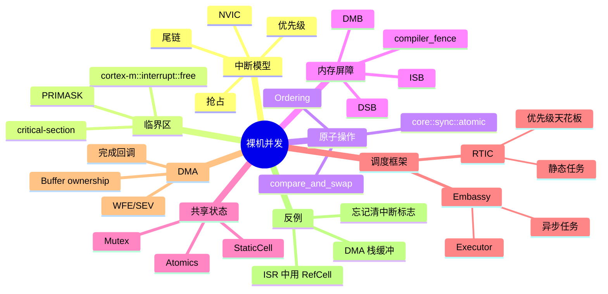
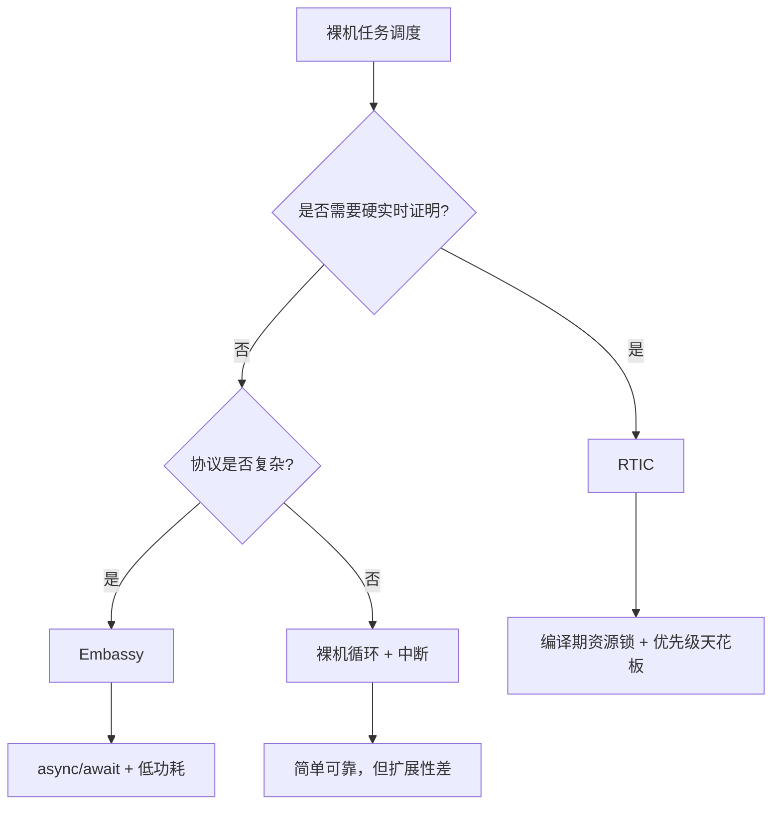
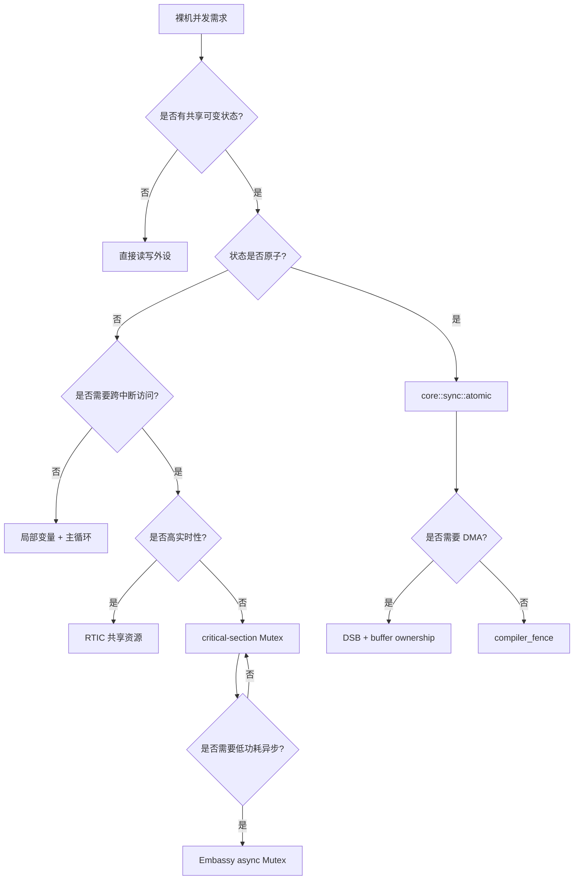

# 裸机并发：中断、NVIC、临界区与异步执行器

**EN**: Interrupts and Concurrency on Bare Metal
**Summary**: Analyzes bare-metal concurrency on Cortex-M/RISC-V microcontrollers, covering NVIC priority inversion and preemption, critical-section primitives, atomic ordering and memory barriers, RTIC static scheduling versus Embassy async executors, DMA buffer ownership, and lifetime/atomicity pitfalls.

> **Rust 版本**: 1.97.1+ (Edition 2024)
> **Bloom 层级**: L5
> **权威来源**: 本文件为 `concept/06_ecosystem/05_systems_and_embedded/` 下裸机中断与并发模型的 `concept/` 权威页。
> **相关页**: 中断异常模型见 [`14_interrupt_and_exception_model.md`](14_interrupt_and_exception_model.md)，no_std 同步原语见 [`15_no_std_synchronization_primitives.md`](15_no_std_synchronization_primitives.md)，自定义裸机异步执行器见 [`28_custom_bare_metal_async_executor.md`](28_custom_bare_metal_async_executor.md)，RTIC 深度解析见 [`35_rtic_framework_deep_dive.md`](35_rtic_framework_deep_dive.md)，Embassy 深度解析见 [`34_embassy_framework_deep_dive.md`](34_embassy_framework_deep_dive.md)，临界区与裸机同步见 [`53_critical_sections_and_sync_on_bare_metal.md`](53_critical_sections_and_sync_on_bare_metal.md)，RTIC 与 Embassy 实时框架对比见 [`55_rtic_vs_embassy_real_time_frameworks.md`](55_rtic_vs_embassy_real_time_frameworks.md)；跨层对比见 [`Rust vs Ada/SPARK`](../../05_comparative/01_systems_languages/07_rust_vs_ada_spark.md)。

## Mindmap



## 1. 裸机并发模型

与多核 CPU 不同，典型 Cortex-M/RISC-V 微控制器是**单核顺序执行 + 中断抢占**模型：

- **主循环**（或 RTOS 任务）按顺序执行。
- **硬件中断**随时可能抢占主循环，但中断之间按优先级排队。
- **没有操作系统线程**，没有 `std::thread`，也没有内核调度器。

因此，裸机并发的核心问题不是“多线程同步”，而是：

1. **中断抢占**：主循环修改共享状态时，被 ISR 打断。
2. **重入**：同一中断被重复触发（如果未及时清标志）。
3. **编译器/CPU 乱序**：内存访问顺序与源码顺序不一致。
4. **异步外设**：DMA、定时器等在后台运行，与 CPU 并行。

## 2. NVIC 与优先级

Cortex-M 使用 **NVIC**（Nested Vectored Interrupt Controller）管理中断。

### 2.1 优先级数值与逻辑

NVIC 优先级使用**数值越小优先级越高**。具体位数由实现决定（常见 4 位，即 16 级）。

```text
优先级值 0  = 最高
优先级值 15 = 最低（如果只有 4 位）
```

抢占优先级（preemption priority）决定能否打断当前 ISR；子优先级（subpriority）只在相同抢占优先级内部决定排队顺序。

```rust,ignore
use cortex_m::peripheral::NVIC;
use stm32f4::Interrupt;

unsafe {
    NVIC::set_priority(Interrupt::TIM2, 1); // 高优先级
    NVIC::set_priority(Interrupt::USART2, 3); // 低优先级
    NVIC::unmask(Interrupt::TIM2);
    NVIC::unmask(Interrupt::USART2);
}
```

### 2.2 抢占与尾链（tail-chaining）

- 当高优先级中断到达时，当前执行上下文被保存，转入 ISR。
- 若多个中断同时 pending，NVIC 按优先级选择最高者。
- **tail-chaining**：如果一个 ISR 返回时仍有同级或更低优先级中断 pending，NVIC 不恢复主循环，直接跳到下一个 ISR，减少上下文切换开销。

### 2.3 相同优先级中断不嵌套

如果两个中断优先级相同，一个不会打断另一个。它们在退出后由 NVIC 按 pending 顺序依次执行。这简化了同优先级 ISR 之间的同步：它们实际上串行执行。

## 3. 临界区：屏蔽中断

临界区是裸机并发最基础的原语：通过临时关闭可屏蔽中断（Cortex-M 上即 PRIMASK 置位），保证一段代码不被 ISR 抢占。

### 3.1 `cortex-m::interrupt::free`

```rust,ignore
use cortex_m::interrupt;

interrupt::free(|_| {
    // 这段代码不会被任何可屏蔽中断打断
    SHARED_COUNTER += 1;
});
```

`interrupt::free` 在 Cortex-M 上把 `PRIMASK` 置 1，退出时恢复之前的值。它屏蔽所有外部中断，但不屏蔽 NMI、HardFault 等不可屏蔽异常。

### 3.2 临界区长度

临界区越短越好，因为：

- 长时间关中断会延迟高优先级事件响应。
- 可能丢失 UART 字节、定时器事件、ADC 完成标志。
- 最坏情况下触发看门狗。

### 3.3 `critical-section` crate

`cortex_m::interrupt::free` 是 Cortex-M 专用。`critical-section` 提供跨平台临界区，并在不同目标上自动选择正确实现：

```rust,ignore
use critical_section;

critical_section::with(|cs| {
    // cs 令牌证明当前处于临界区
    let mut counter = COUNTER.borrow(cs).borrow_mut();
    *counter += 1;
});
```

`critical_section::CriticalSection` 令牌作为参数传递，确保只有 `with` 闭包内部才能访问 `Mutex` 内容，从类型上防止误用。

## 4. 原子操作与内存排序

### 4.1 `core::sync::atomic`

`no_std` 环境仍可使用 `core::sync::atomic`：

```rust
use core::sync::atomic::{AtomicU32, Ordering};

static COUNTER: AtomicU32 = AtomicU32::new(0);

fn increment() {
    COUNTER.fetch_add(1, Ordering::Relaxed);
}
```

`AtomicU32` 在 Cortex-M3/M4/M7 等支持 `LDREX`/`STREX` 的架构上直接映射为原子指令；在 Cortex-M0/M0+ 上由 `critical-section` 或 `atomic-polyfill` 模拟。

### 4.2 `Ordering` 选择

| Ordering | 保证 | 适用场景 |
|----------|------|----------|
| `Relaxed` | 单个原子变量操作原子性 | 简单计数器 |
| `Acquire` | 读操作后，后续读写不会重排到读之前 | 获取锁/信号 |
| `Release` | 写操作前，先前读写不会重排到写之后 | 释放锁/信号 |
| `AcqRel` | 同时满足 Acquire + Release | CAS 操作 |
| `SeqCst` | 全局顺序 | 多核或强一致性需求 |

裸机单核程序通常用 `Relaxed` 或 `Acquire`/`Release` 即可。如果涉及 DMA，需要 `compiler_fence` 配合。

### 4.3 CAS 模式

```rust
use core::sync::atomic::{AtomicBool, Ordering};

static FLAG: AtomicBool = AtomicBool::new(false);

// 中断中设置标志
fn isr() {
    FLAG.store(true, Ordering::Release);
}

// 主循环轮询
fn main_loop() {
    while !FLAG.swap(false, Ordering::AcqRel) {
        cortex_m::asm::wfi();
    }
    // 现在可以处理事件
}
```

`swap(false, AcqRel)` 既读取旧值，又把标志清零，相当于“原子取走”。

## 5. 内存屏障：compiler fence 与 DMB/DSB/ISB

### 5.1 编译器乱序

编译器为了优化可能重排内存访问顺序。对于 MMIO，重排会导致硬件看到错误的写入顺序。`core::sync::atomic::compiler_fence` 阻止编译器重排，但不生成 CPU 指令：

```rust,ignore
use core::sync::atomic::{compiler_fence, Ordering};

// 以下寄存器访问依赖具体 MCU 的 PAC/svd2rust 生成类型，示意用
unsafe { (*RCC).ahb1enr.write(|w| w.gpioaen().set_bit()); }
compiler_fence(Ordering::SeqCst);
unsafe { (*GPIOA).moder.write(|w| w.moder0().output()); }
```

### 5.2 CPU 内存屏障

Cortex-M 提供三条汇编屏障指令：

- **DMB**（Data Memory Barrier）：确保该指令之前的内存访问完成后，才执行之后的内存访问。
- **DSB**（Data Synchronization Barrier）：确保之前所有内存访问、缓存、写缓冲完成，并清空指令流水线。
- **ISB**（Instruction Synchronization Barrier）：刷新流水线，确保之后的指令从最新内存中重新取指。

在 Rust 中通常通过 `cortex_m::asm::dmb()` / `dsb()` / `isb()` 调用。

### 5.3 典型使用场景

| 场景 | 推荐屏障 |
|------|----------|
| 配置 MPU 后 | DSB + ISB |
| DMA 启动前写 buffer | DMB 或 DSB |
| 中断向量表重定位后 | DSB + ISB |
| 自修改代码后 | DSB + ISB |
| 普通外设寄存器顺序 | `compiler_fence` 通常足够 |

### 5.4 DMA 一致性

DMA 控制器与 CPU 共享总线但独立访问内存。启动 DMA 前必须确保 CPU 对 buffer 的写入对 DMA 可见：

```rust,ignore
// 填充 buffer
for b in &mut BUF { *b = 0xAA; }

// 阻止编译器重排，并发出 DSB 确保数据到达内存
core::sync::atomic::compiler_fence(Ordering::Release);
cortex_m::asm::dsb();

// 启动 DMA
dma.start(BUF.as_ptr() as u32, BUF.len());
```

DMA 完成后，CPU 读取结果前也需要屏障：

```rust,ignore
while !dma.is_done() {}
cortex_m::asm::dsb();
core::sync::atomic::compiler_fence(Ordering::Acquire);
let result = BUF[0];
```

## 6. 共享状态模式

### 6.1 `static` + `Atomic`

最简单的共享：整型标志或计数器。

```rust
use core::sync::atomic::{AtomicU32, Ordering};

static TICKS: AtomicU32 = AtomicU32::new(0);

#[cortex_m_rt::interrupt]
fn SysTick() {
    TICKS.fetch_add(1, Ordering::Relaxed);
}

fn elapsed_ms() -> u32 {
    TICKS.load(Ordering::Relaxed)
}
```

### 6.2 `Mutex<RefCell<T>>`

对于非原子类型（如传感器句柄、缓冲队列），使用 `critical-section` 的 `Mutex` + `RefCell`：

```rust,ignore
use critical_section::Mutex;
use core::cell::RefCell;

static SENSOR: Mutex<RefCell<Option<Sensor>>> = Mutex::new(RefCell::new(None));

fn init(sensor: Sensor) {
    critical_section::with(|cs| {
        SENSOR.borrow(cs).replace(Some(sensor));
    });
}

fn read() -> i16 {
    critical_section::with(|cs| {
        let mut sensor = SENSOR.borrow(cs).borrow_mut();
        sensor.as_mut().unwrap().read_temperature()
    })
}
```

### 6.3 `StaticCell`（ Embassy / cortex-m-rtic 风格）

```rust,ignore
use static_cell::StaticCell;

static SENSOR: StaticCell<Sensor> = StaticCell::new();

fn init() {
    let sensor = SENSOR.init(Sensor::new());
    // sensor 为 &'static Sensor，可在任务间共享
}
```

`StaticCell` 在初始化时把所有权交给 `&'static`，避免 `RefCell<Option<T>>` 的运行时检查。

## 7. RTIC：静态调度与优先级天花板

### 7.1 RTIC 核心思想

RTIC（Real-Time Interrupt-driven Concurrency）把任务分为两种：

- **硬件任务**：绑定到具体中断向量，由硬件触发。
- **软件任务**：由调度器在后台按优先级调度。

所有资源在编译期声明，RTIC 根据任务优先级自动生成锁：

```rust,ignore
#[app(device = stm32f4::pac, peripherals = true)]
mod app {
    #[shared]
    struct Shared {
        adc_value: u16,
        threshold: u16,
    }

    #[local]
    struct Local {
        led: Pin<'A', 5, Output<PushPull>>,
    }

    #[init]
    fn init(cx: init::Context) -> (Shared, Local) { ... }

    #[task(binds = ADC, priority = 3, shared = [adc_value])]
    fn adc_isr(mut cx: adc_isr::Context) {
        cx.shared.adc_value.lock(|v| *v = get_adc_sample());
    }

    #[task(priority = 2, shared = [adc_value, threshold], local = [led])]
    fn check(mut cx: check::Context) {
        (cx.shared.adc_value, cx.shared.threshold).lock(|adc, thr| {
            if *adc > *thr {
                cx.local.led.set_high();
            }
        });
    }
}
```

### 7.2 优先级天花板协议

RTIC 的 `lock` 实现基于 **Immediate Priority Ceiling Protocol**：

- 当任务访问共享资源时，临时把自己的优先级提升到能访问该资源的所有任务中的最高优先级。
- 这样避免了低优先级任务被中优先级任务抢占导致的优先级反转。
- 由于天花板已知，临界区长度 bounded，且不会死锁。

### 7.3 适合 RTIC 的场景

- 任务数量、优先级、资源在编译期确定。
- 需要可预测的 worst-case execution time。
- 中断驱动为主，不需要复杂异步状态机。

## 8. Embassy：异步执行器

### 8.1 Embassy executor 模型

Embassy 在裸机上实现了一个单线程异步执行器：

```rust,ignore
#[embassy_executor::main]
async fn main(_spawner: Spawner) {
    let p = embassy_stm32::init(Default::default());
    let mut led = Output::new(p.PA5, Level::Low, Speed::Low);
    let button = Input::new(p.PC13, Pull::Down);

    loop {
        button.wait_for_rising_edge().await;
        led.toggle();
    }
}
```

任务以 `async fn` 形式编写，遇到 `.await` 时让出 CPU，执行器调度其他可运行的任务。等待期间 CPU 可以进入 `WFI`/`WFE` 降低功耗。

### 8.2 Embassy 资源共享

Embassy 使用异步 `Mutex` 共享资源：

```rust,ignore
use embassy_sync::mutex::Mutex;
use embassy_sync::blocking_mutex::raw::ThreadModeRawMutex;

static ADC_VAL: Mutex<ThreadModeRawMutex, u16> = Mutex::new(0);

#[embassy_executor::task]
async fn sampler() {
    loop {
        let sample = adc.sample().await;
        *ADC_VAL.lock().await = sample;
        Timer::after_millis(100).await;
    }
}
```

与 RTIC 不同，Embassy 的锁是异步的，任务等待期间不会阻塞 CPU，而是让出执行权。

### 8.3 适合 Embassy 的场景

- 协议状态机复杂（多个阶段、超时、重试）。
- 需要并发处理多个 I/O 源。
- 对功耗敏感，希望在没有事件时进入低功耗模式。
- 驱动使用 `embedded-hal-async` trait。

## 9. RTIC 与 Embassy 对比

| 维度 | RTIC | Embassy |
|------|------|---------|
| 编程模型 | 基于优先级的中断任务 | 单线程 async/await |
| 调度时机 | 硬件中断 + 软件任务 | executor 轮询可运行 Future |
| 资源共享 | 编译期生成 priority ceiling 锁 | 异步 `Mutex` / `Channel` |
| 死锁 | 静态证明无死锁 | 需要开发者避免循环等待 |
| 异步驱动 | 需手动集成 | 原生支持 `embedded-hal-async` |
| 功耗 | 可进入 WFI，但需手动管理 | 自然在 await 时进入 WFE/WFI |
| 可预测性 | 极高，适合硬实时 | 好，但任务切换开销需评估 |
| 学习曲线 | 需要理解 priority ceiling | 需要理解 Rust async |

### 9.1 选择决策



## 10. DMA 与异步裸机

### 10.1 DMA 基本语义

DMA（Direct Memory Access）允许外设直接与 RAM 交换数据，无需 CPU 逐字节搬运。典型流程：

1. CPU 配置源地址、目标地址、传输长度、方向（外设→内存 / 内存→外设）。
2. CPU 启动 DMA。
3. DMA 在后台搬运数据。
4. DMA 完成触发中断（TC = Transfer Complete）。
5. CPU 处理结果。

在整个过程中，CPU 与 DMA **并行访问内存**，因此 buffer 的所有权和内存一致性是关键。

### 10.2 Buffer Ownership

DMA 在传输期间借用内存。如果 CPU 提前释放或修改 buffer，会导致：

- 传输到无效地址（use-after-free）。
- 数据竞争：CPU 写入与 DMA 读取冲突。
- 硬件错误：DMA 访问未使能的区域触发 bus fault。

最安全的模式是使用 `'static` buffer：

```rust,ignore
static mut TX_BUF: [u8; 64] = [0; 64];
static mut RX_BUF: [u8; 64] = [0; 64];

unsafe {
    // 填充 TX_BUF
    TX_BUF.copy_from_slice(&data);

    // 启动 UART DMA 收发
    uart.start_dma_transfer(TX_BUF.as_ptr(), RX_BUF.as_mut_ptr(), 64);
}
```

### 10.3 DMA 与栈内存

```rust,ignore
fn bad_dma(uart: &mut Uart) {
    let mut buf = [0u8; 64]; // 栈变量
    uart.dma_send(&buf);       // 函数返回后 buf 被回收
    // DMA 仍在使用 buf，造成悬垂引用
}
```

**正确做法**：使用 `static mut` 或 Embassy 的 `DmaBuf` / `ReadableBuffer` / `WritableBuffer` trait，它们通过生命周期约束保证 buffer 活到传输完成。

### 10.4 完成回调与 WFE/SEV

裸机中常用“中断 + 标志”模式等待 DMA：

```rust,ignore
use core::sync::atomic::{AtomicBool, Ordering};

static DMA_DONE: AtomicBool = AtomicBool::new(false);

#[interrupt]
fn DMA1_STREAM5() {
    // 清除中断标志
    unsafe { (*DMA1).hifcr.write(|w| w.ctcif5().set_bit()); }
    DMA_DONE.store(true, Ordering::Release);
}

fn blocking_transfer(dma: &mut Dma, buf: &'static [u8]) {
    DMA_DONE.store(false, Ordering::Relaxed);
    dma.start(buf);
    while !DMA_DONE.load(Ordering::Acquire) {
        cortex_m::asm::wfe(); // 等待事件，降低功耗
    }
}
```

`wfe`（Wait For Event）让 CPU 进入 sleep，直到中断发生。`SEV`（Send Event）用于多核场景，单核中通常由中断自动唤醒。

### 10.5 DMA 双缓冲与循环模式

复杂场景使用双缓冲（double-buffer）或循环模式（circular mode）：

- **双缓冲**：DMA 交替填充两个 buffer，CPU 处理已完成的 buffer。
- **循环模式**：DMA 持续写入环形 buffer，适合音频流、ADC 连续采样。

这些模式要求 buffer 地址对齐（通常是 4 字节或缓存行对齐），并且长度满足外设要求。

### 10.6 DMA 与缓存一致性

带 D-Cache 的 Cortex-M7 需要特别注意：

- CPU 写入 buffer 后，数据可能仍在 cache，未写回 RAM。
- DMA 从 RAM 读取时拿到旧数据。
- 解决方案：调用 `SCB::clean_dcache_by_region(buf)` 在启动 DMA 前清 cache；读取结果前调用 `SCB::invalidate_dcache_by_region(buf)`。

```rust,ignore
use cortex_m::peripheral::SCB;

unsafe {
    SCB::clean_dcache_by_slice(&BUF);
}
dma.start(BUF.as_ptr(), BUF.len());

while !dma.is_done() {}
unsafe {
    SCB::invalidate_dcache_by_slice(&BUF);
}
let result = BUF[0];
```

## 11. 常见反例

### 反例 1：在中断里使用 `RefCell::borrow_mut`

```rust,ignore
use core::cell::RefCell;

static SHARED: RefCell<u32> = RefCell::new(0);

#[interrupt]
fn TIM2() {
    *SHARED.borrow_mut() += 1; // 如果主循环正持有借用，这里 panic！
}

fn main() {
    loop {
        let v = SHARED.borrow();
        // 可能被 TIM2 抢占，导致 borrow_mut 失败
    }
}
```

**问题**：`RefCell` 的运行时借用检查不是中断安全的。应使用 `critical_section::Mutex<RefCell<T>>` 或原子类型。

### 反例 2：`std::sync::Mutex` 在 `no_std`

```rust,ignore
use std::sync::Mutex; // 编译错误：no_std 环境没有 std
```

**正确做法**：使用 `critical_section::Mutex` 或 RTIC 共享资源。

### 反例 3：忘记清除中断标志

```rust,ignore
#[interrupt]
fn TIM2() {
    COUNTER.fetch_add(1, Ordering::Relaxed);
    // 忘记清除 TIM2 更新标志
}
```

**问题**：标志未清除导致中断一退出又立刻触发，形成死循环，系统无响应。必须在 ISR 内清除对应外设的中断标志。

### 反例 4：用 `Cell` 共享跨中断状态

```rust,ignore
use core::cell::Cell;

static FLAG: Cell<bool> = Cell::new(false);

#[interrupt]
fn EXTI0() {
    FLAG.set(true);
}
```

`Cell` 不是线程/中断安全的：它内部没有原子性，`set` 可能被中断打断导致 torn write。应使用 `AtomicBool`。

### 反例 5：DMA 使用未对齐的 buffer

```rust,ignore
#[repr(align(4))]
static mut BUF: [u8; 65] = [0; 65]; // 65 不是 4 的倍数
```

某些 DMA 要求传输长度是数据宽度的整数倍，且地址对齐。未对齐或长度错误会导致 DMA 错误中断或静默数据损坏。

### 反例 6：在 ISR 中执行耗时操作

```rust,ignore
#[interrupt]
fn UART2() {
    let data = uart.read().unwrap();
    parse_frame(data); // 解析复杂协议帧
    update_display();  // 访问慢速 SPI 显示屏
}
```

**问题**：ISR 执行时间过长会延迟低优先级中断。应把重活推到主循环或 RTIC 任务 / Embassy 任务中，ISR 只做取数据、设标志。

### 反例 7：缺少 `compiler_fence` 导致轮询失效

```rust,ignore
static READY: AtomicBool = AtomicBool::new(false);

#[interrupt]
fn DMA_DONE() {
    READY.store(true, Ordering::Relaxed);
}

fn wait() {
    while !READY.load(Ordering::Relaxed) {} // 可能被编译器优化为死循环
}
```

虽然 `AtomicBool` 本身不会被完全优化掉，但围绕它的普通内存访问仍可能被重排。涉及外设状态时应使用 `compiler_fence` 或更强的屏障。

### 反例 8：在中断中分配内存

```rust,ignore
#[interrupt]
fn ADC_ISR() {
    let v = adc.read();
    let mut buf = heapless::Vec::new();
    buf.push(v).unwrap(); // 如果 Vec 已满或需要增长，可能 panic
}
```

**问题**：中断上下文不应执行可能失败或耗时的操作。使用固定大小 ring buffer（如 `heapless::spsc::Queue`）并把错误处理推到主循环。

### 反例 9：优先级反转

```rust,ignore
// 低优先级任务持有锁
interrupt::free(|_| { long_computation(); });

// 高优先级中断被迫等待
```

**问题**：长时间临界区导致高优先级中断延迟。RTIC 的 priority ceiling 通过提升当前任务优先级来缩短临界区，但仍应避免在临界区内做重活。

## 12. 设计模式

### 12.1 生产者-消费者环形队列

中断作为生产者，主循环作为消费者：

```rust,ignore
use heapless::spsc::Queue;
use critical_section::Mutex;
use core::cell::RefCell;

static RX_QUEUE: Mutex<RefCell<Queue<u8, 64>>> =
    Mutex::new(RefCell::new(Queue::new()));

#[interrupt]
fn UART1() {
    let b = uart.read().unwrap();
    critical_section::with(|cs| {
        let mut q = RX_QUEUE.borrow(cs).borrow_mut();
        let _ = q.enqueue(b); // 满则丢弃
    });
}

fn main() {
    loop {
        critical_section::with(|cs| {
            let mut q = RX_QUEUE.borrow(cs).borrow_mut();
            if let Some(b) = q.dequeue() {
                process(b);
            }
        });
    }
}
```

### 12.2 事件标志组

```rust,ignore
use core::sync::atomic::{AtomicU8, Ordering};

const EVT_BUTTON: u8 = 1 << 0;
const EVT_TIMER: u8  = 1 << 1;
const EVT_DMA: u8    = 1 << 2;

static EVENTS: AtomicU8 = AtomicU8::new(0);

fn set_event(e: u8) {
    EVENTS.fetch_or(e, Ordering::Release);
}

fn clear_event(e: u8) {
    EVENTS.fetch_and(!e, Ordering::Relaxed);
}

fn main() {
    loop {
        let evts = EVENTS.swap(0, Ordering::AcqRel);
        if evts & EVT_BUTTON != 0 { handle_button(); }
        if evts & EVT_TIMER != 0 { handle_timer(); }
        if evts == 0 { cortex_m::asm::wfi(); }
    }
}
```

### 12.3 软件触发任务

在裸机循环中，用 flag 把中断事件转换为可测试的状态机：

```rust,ignore
static CMD_READY: AtomicBool = AtomicBool::new(false);

#[interrupt]
fn SPI1() {
    // 收到完整命令帧
    CMD_READY.store(true, Ordering::Release);
}

enum State { Idle, Running, Error }

fn state_machine() {
    static mut STATE: State = State::Idle;
    if CMD_READY.swap(false, Ordering::AcqRel) {
        unsafe {
            match STATE {
                State::Idle => { start(); STATE = State::Running; }
                State::Running => { stop(); STATE = State::Idle; }
                State::Error => { reset(); STATE = State::Idle; }
            }
        }
    }
}
```

## 13. 决策树



### 13.1 选择速查表

| 场景 | 推荐方案 |
|------|----------|
| 计数器/标志 | `AtomicU32` / `AtomicBool` |
| 复杂数据结构跨中断 | `critical-section::Mutex<RefCell<T>>` |
| 多任务共享 + 硬实时 | RTIC `#[shared]` |
| 多 I/O 源 + 低功耗 | Embassy async executor |
| DMA buffer | `'static` 或 Embassy DMA buffer trait |
| 外设寄存器顺序敏感 | `compiler_fence` + DSB |
| 等待中断事件 | `wfi` / `wfe` |

## 14. 进阶主题

### 14.1 中断延迟与尾链开销

Cortex-M 中断延迟通常为 12 个时钟周期（从异常发生到 ISR 第一条指令）。tail-chaining 可以把这个延迟降到 6 个周期。设计时：

- 避免在 ISR 中调用复杂函数，减少寄存器保存。
- 使用 `#[inline]` 或直接在 ISR 内联关键代码。
- 高优先级 ISR 应保持极短，只做“推事件到队列”。

### 14.2 可重入中断

Cortex-M 默认不允许同一中断嵌套自己（因为进入 ISR 后该中断被自动 mask）。如果配置为允许嵌套（通过清除 `BASEPRI` 或在 ISR 内重新 unmask），必须确保代码可重入。一般裸机程序应避免。

### 14.3 `BASEPRI` 选择性屏蔽

与 `PRIMASK` 屏蔽所有中断不同，`BASEPRI` 可以屏蔽优先级**低于或等于**某个阈值的中断，而保留高优先级中断：

```rust,ignore
unsafe {
    cortex_m::peripheral::scb::SHP[...]; // 配置优先级分组
    cortex_m::register::basepri::write(4 << 4); // 屏蔽优先级 <= 4 的中断
}
// 临界区，但高优先级中断仍可响应
unsafe { cortex_m::register::basepri::write(0); }
```

RTIC 利用 `BASEPRI` 实现优先级天花板，而不是完全关中断。

### 14.4 多核 MCU 的额外考虑

Cortex-M0+/M4 多为单核，但 Cortex-M7 双核（如 STM32H7）或 RISC-V 多核存在真正并发：

- 需要使用 `AtomicU32` 而非 `Mutex`。
- 内存屏障必须使用 `DMB` / `DSB` 而非仅 `compiler_fence`。
- 共享外设需要自旋锁或硬件信号量（如 HSEM）。

### 14.5 低功耗与并发

```rust,ignore
fn idle() {
    loop {
        // 处理所有 pending 事件
        while has_work() { process_one(); }
        // 没有工作时进入睡眠，等待中断
        cortex_m::asm::wfi();
    }
}
```

在 `wfi` 之前应确保所有外设中断已使能，否则可能永远睡下去。Embassy executor 会自动管理 sleep 与唤醒。

### 14.6 调试并发 Bug

常见症状与排查方向：

| 症状 | 可能原因 |
|------|----------|
| 系统死在中断里 | 未清除中断标志 |
| 数据随机损坏 | RMW 被中断破坏、DMA 越界 |
| 高优先级事件丢失 | 临界区过长 |
| 轮询永远等待 | 缺少 compiler_fence、标志未用 Release/Acquire |
| DMA 数据旧 | D-Cache 未清理/失效 |

使用 `probe-rs` + `defmt` 可以在真实硬件上 trace 中断进入/退出与变量值。

## 15. 权威来源与延伸阅读

### 15.1 框架与运行时

- **RTIC Book**：<https://rtic.rs/2/book/en/>
- **Embassy 文档**：<https://embassy.dev/>
- **cortex-m-rtic 仓库**：<https://github.com/rtic-rs/cortex-m-rtic>
- **embassy 仓库**：<https://github.com/embassy-rs/embassy>

### 15.2 ARM 架构参考

- **Cortex-M4 Devices Generic User Guide**（含 NVIC、中断、SysTick、bit-band）：<https://developer.arm.com/documentation/dui0553/latest/>
- **ARMv7-M Architecture Reference Manual**（内存模型、屏障、异常模型）：<https://developer.arm.com/documentation/ddi0403/latest/>
- **ARM Cortex-M3/M4 中断与屏障说明**：<https://developer.arm.com/documentation/100235/latest/>
- **AMBA APB / AHB-Lite 协议规范**：见 [`41_embedded_hal_and_mmio.md`](41_embedded_hal_and_mmio.md) 权威来源。

### 15.3 Rust 嵌入式资源

- **The Rust Embedded Book**：<https://docs.rust-embedded.org/book/>
- **Rust Embedded Discovery Book**：<https://docs.rust-embedded.org/discovery/>
- **cortex-m crate 文档**：<https://docs.rs/cortex-m/latest/cortex_m/>
- **critical-section crate**：<https://docs.rs/critical-section/latest/critical_section/>
- **heapless crate**（无分配集合）：<https://docs.rs/heapless/latest/heapless/>

### 15.4 相关 `concept/` 页

- [`14_interrupt_and_exception_model.md`](14_interrupt_and_exception_model.md)：Cortex-M/RISC-V 中断向量、异常入口/退出、LR 值。
- [`15_no_std_synchronization_primitives.md`](15_no_std_synchronization_primitives.md)：自旋锁、信号量、无锁队列。
- [`28_custom_bare_metal_async_executor.md`](28_custom_bare_metal_async_executor.md)：手写 async executor 原理。
- [`34_embassy_framework_deep_dive.md`](34_embassy_framework_deep_dive.md)：Embassy 任务、spawner、time driver。
- [`35_rtic_framework_deep_dive.md`](35_rtic_framework_deep_dive.md)：RTIC 宏、资源锁、monotonic。

## 16. 小结

裸机并发的本质是**单核 + 中断抢占 + 异步外设**。正确的设计需要：

1. **最小临界区**：用 `critical-section` 或 RTIC 锁保护共享可变状态。
2. **优先使用原子类型**：计数器、标志、简单状态用 `core::sync::atomic`。
3. **注意内存屏障**：MMIO、DMA、中断标志使用 `compiler_fence` / `DMB` / `DSB`。
4. **不要在中断里做重活**：ISR 取数据、设标志，主循环或任务处理。
5. **DMA buffer 必须活过传输**：使用 `static` 或框架 DMA buffer trait。
6. **根据场景选框架**：硬实时、静态任务选 RTIC；复杂协议、低功耗选 Embassy；简单场景用裸机循环 + 中断。

## 17. 进阶设计考量

### 17.1 中断安全的数据结构选择

在 `no_std` 环境中，常用集合对中断安全的支持不同：

| 类型 | 是否中断安全 | 说明 |
|------|--------------|------|
| `AtomicUsize` | 是 | 单值原子操作 |
| `heapless::spsc::Queue` | 是（单生产者单消费者） | 不需要锁，ISR 与主循环各用一端 |
| `heapless::mpmc::Q*` | 部分 | 多核需要原子 CAS，单核需临界区 |
| `heapless::Vec` | 否 | 容量固定但非原子 |
| `core::cell::RefCell` | 否 | 运行时借用，中断下会 panic |
| `critical_section::Mutex<RefCell<T>>` | 是 | 通过临界区保护 |
| `static_cell::StaticCell<T>` | 初始化安全 | 用于创建 `'static` 共享引用 |

### 17.2 单生产者单消费者队列

`heapless::spsc::Queue` 是裸机中断场景的经典选择：

```rust,ignore
use heapless::spsc::Queue;

// 静态初始化：split 后 producer 在 ISR，consumer 在主循环
static mut Q: Queue<u8, 64> = Queue::new();

fn init() {
    let (mut prod, mut cons) = unsafe { Q.split() };
    // 把 producer 存入 ISR 可访问的全局静态
    // 把 consumer 存入 main loop
}
```

注意 `Queue::split` 返回的 producer/consumer 不是 `Sync`，因此必须通过 `static mut` 或 Embassy/RTIC 资源传递。在 `#[interrupt]` 中访问 `static mut` 需要 `unsafe`。

### 17.3 裸机测试策略

并发代码很难在主机上完整模拟硬件时序，但可以验证逻辑：

1. **单元测试**：把状态机逻辑抽成纯函数，用 `std` 测试。
2. **Mock 中断**：在测试中手动调用 ISR 函数，检查共享状态。
3. **Miri**：检测 `unsafe` 内存问题（但 Miri 不支持所有 target）。
4. **QEMU**：在 `qemu-system-arm` 中运行完整程序。
5. **真实硬件 CI**：使用 `probe-rs` + GitHub Actions self-hosted runner。

```rust,ignore
#[test]
fn test_flag_handling() {
    static FLAG: AtomicBool = AtomicBool::new(false);
    // 模拟中断设置标志
    FLAG.store(true, Ordering::Release);
    // 模拟主循环处理
    if FLAG.swap(false, Ordering::AcqRel) {
        // 处理事件
    }
    assert!(!FLAG.load(Ordering::Relaxed));
}
```

### 17.4 与 RTOS 的边界

如果项目使用 FreeRTOS、Zephyr 等 C RTOS，Rust 任务通过 FFI 调用 RTOS API。此时并发原语应使用 RTOS 提供的：

- 信号量 / 互斥量（注意优先级反转）。
- 消息队列。
- 任务通知。

Rust 侧可以用 `critical-section` 的 RTOS backend 来桥接。例如 `critical-section` 的 FreeRTOS 实现会在临界区调用 `taskENTER_CRITICAL` / `taskEXIT_CRITICAL`。

### 17.5 不可屏蔽异常

NMI、HardFault、MemManage、BusFault、UsageFault 是不可屏蔽或半可屏蔽异常。它们可以打断任何临界区，因此：

- 不要在 NMI 中访问与主程序共享的可变状态，除非使用真正原子的硬件机制。
- HardFault 处理程序应尽量只记录状态并复位，避免复杂逻辑。
- 如果必须共享，使用只读数据或在 HardFault 中只写专用内存区域。

### 17.6 启动代码中的并发

在 `main` 运行前，Rust 运行时会调用 `Reset` handler 初始化 `.data`、清零 `.bss`、设置堆栈指针。如果启用 FPU，还需设置 `CPACR`。这些步骤必须是顺序且不可中断的：

```rust,ignore
#[cortex_m_rt::entry]
unsafe fn main() -> ! {
    // 这里 PRIMASK 通常为 1，即中断关闭
    let dp = Peripherals::take().unwrap();
    // 初始化外设、中断
    // 最后开启中断并进入主循环
    cortex_m::interrupt::enable();
    loop { ... }
}
```

### 17.7 使用 `MaybeUninit` 延迟初始化

某些静态 buffer 需要在运行时初始化，但又必须是 `'static`：

```rust,ignore
use core::mem::MaybeUninit;

static mut BUF: MaybeUninit<[u8; 1024]> = MaybeUninit::uninit();

fn init() -> &'static mut [u8; 1024] {
    unsafe {
        BUF.write([0u8; 1024]);
        &mut *BUF.as_mut_ptr()
    }
}
```

必须确保只初始化一次，否则 `write` 会泄漏旧值。`static_cell::StaticCell` 已封装该模式。

### 17.8 电源管理与时钟门控

外设时钟通常默认关闭以省电。访问未使能时钟的外设寄存器会导致 bus fault：

```rust,ignore
// 先使能 GPIOA 时钟
rcc.ahb1enr.modify(|_, w| w.gpioaen().enabled());
core::sync::atomic::compiler_fence(Ordering::SeqCst);
// 再访问 GPIOA 寄存器
gpioa.moder.modify(|_, w| w.moder5().output());
```

在使能时钟后插入 `compiler_fence` 或 `dsb`，确保时钟信号真正到达外设。

## 18. 性能与代码体积权衡

### 18.1 原子操作的成本

- Cortex-M3/M4/M7：单条 `LDREX`/`STREX` 循环，通常 2–12 周期。
- Cortex-M0/M0+：无原子指令，`atomic-polyfill` 用临界区模拟，代价是关中断。
- 频繁的原子操作会增加中断延迟，必要时用批量累积 + 一次性提交。

### 18.2 临界区 vs 无锁

| 方案 | 代码体积 | 中断延迟 | 复杂度 |
|------|----------|----------|--------|
| 单个原子变量 | 最小 | 无影响 | 低 |
| 无锁环形队列 | 小 | 无影响 | 中 |
| 临界区 Mutex | 小 | 关中断期间有影响 | 低 |
| RTIC 资源锁 | 中 | 精确可控 | 中 |
| Embassy async | 较大 | 低 | 高 |

选择时应先尝试原子/无锁，仅在需要复杂共享状态时使用锁或框架。

### 18.3 避免 `#[inline(never)]` 在中断入口

编译器通常会把小 ISR 内联到异常向量表附近的跳板代码。强制 `#[inline(never)]` 可能增加中断延迟，除非你明确需要调试符号或防止栈溢出。

## 19. 小结 checklist

在实现裸机并发功能前，逐条确认：

- [ ] 共享状态是否可用原子类型替代？
- [ ] 是否需要临界区保护？临界区是否尽可能短？
- [ ] DMA buffer 是否为 `'static` 或框架管理的 buffer？
- [ ] 中断服务函数是否清除了中断标志？
- [ ] 是否使用了正确的内存屏障（compiler_fence / DMB / DSB）？
- [ ] 是否在 ISR 中避免了分配、复杂协议解析、长时间延时？
- [ ] 是否根据实时性需求选择了 RTIC / Embassy / 裸机循环？
- [ ] 是否在 D-Cache 系统中正确清理/失效 DMA buffer？
- [ ] 是否有单元测试或 QEMU/硬件 CI 覆盖并发路径？

---

## 权威来源与延伸阅读（International Authority Sources）

- The Rust Embedded Book：<https://docs.rust-embedded.org/book/>
- Embassy 官方文档：<https://embassy.dev/>
- RTIC Book：<https://rtic.rs/2/book/en/>
- `cortex-m` crate 文档（NVIC、异常、寄存器访问）：<https://docs.rs/cortex-m/latest/cortex_m/>
- `critical-section` crate 文档：<https://docs.rs/critical-section/latest/critical_section/>
- ARM Cortex-M 系列处理器通用用户指南（NVIC 与中断语义）：<https://developer.arm.com/documentation/dui0553/latest/>
- The Rust Programming Language（TRPL）：<https://doc.rust-lang.org/book/>
- Stacked Borrows：Rust 别名模型与并发内存安全的形式化：<https://plv.mpi-sws.org/rustbelt/stacked-borrows/>
