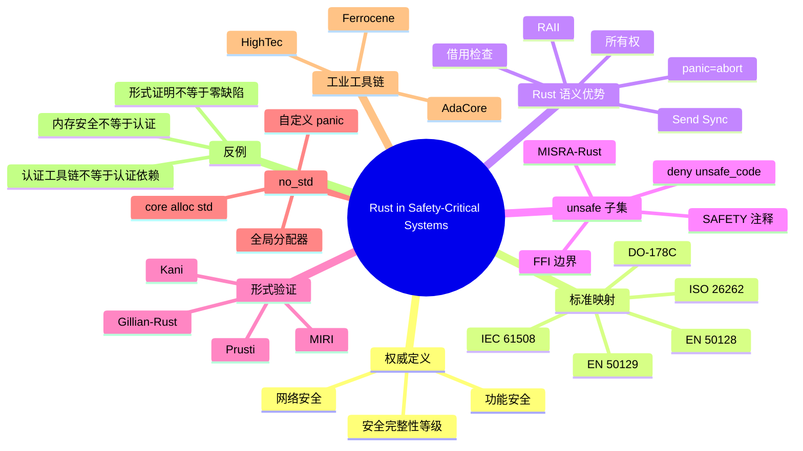
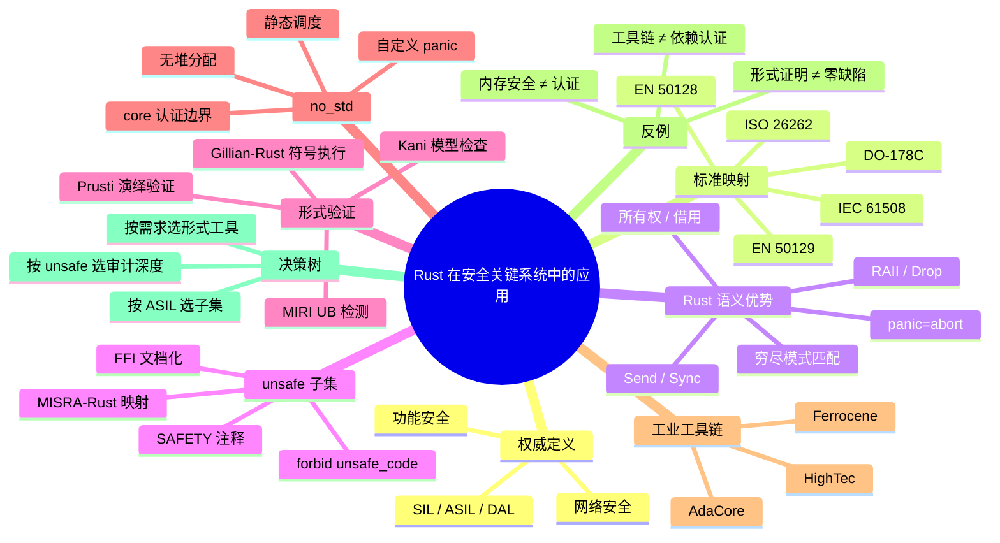

> **内容分级**: [专家级]
> **代码状态**: 混合 — 可编译示例标注 `rust`，裸机/目标平台相关代码标注 `rust,ignore`/`no_run`，反例标注 `rust,compile_fail`
> **定理链**: N/A — 工程/标准映射文档
>
# Rust 在安全关键系统中的应用
>
> **EN**: Rust in Safety-Critical Systems
> **Summary**: A canonical synthesis of Rust's role in safety-critical systems, covering functional-safety standards mapping (IEC 61508, ISO 26262, DO-178C, EN 50128/50129), Rust semantic advantages, unsafe audit strategies, formal verification interfaces (Kani, MIRI, Prusti, Gillian-Rust), no_std constraints, certified industrial toolchains, counterexamples, and decision guidance.
> **Rust 版本**: 1.97.0+ (Edition 2024)
>
> **受众**: [专家]
> **Bloom 层级**: L5-L6
> **权威来源**: 本文件为 `concept/` 权威页。
> **A/S/P 标记**: **P+S+A+Eva** — Procedure + Structure + Application + Evaluation
> **双维定位**: C×Eva — 比较与评价 Rust 在安全关键标准下的语义优势、工具链证据与工程落地方法
> **前置概念**: [安全关键裸机操作系统与 Rust](19_safety_critical_bare_metal_os.md) · [安全关键系统工程](../11_domain_applications/23_safety_critical_systems_engineering.md) · [MISRA-Rust 与安全关键嵌入式指南](30_misra_rust_safety_critical_guidelines.md) · [认证工具链与认证包清单](../../04_formal/04_model_checking/10_certified_toolchains_and_packages.md) · [Unsafe Rust](../../03_advanced/02_unsafe/01_unsafe.md)
> **后置概念**: [嵌入式 RTOS 与安全关键框架对比](26_embedded_rtos_and_safety_critical_frameworks.md) · [no_std 启动流程与运行时](27_no_std_startup_runtime_deep_dive.md) · [Rust vs Ada/SPARK](../../05_comparative/01_systems_languages/07_rust_vs_ada_spark.md)

---

> **来源**: [Ferrocene Language Specification](https://spec.ferrocene.dev/) · [Ferrocene core certification news](https://ferrous-systems.com/blog/ferrocene-libcore-news-release/) · [Rust Blog — What does it take to ship Rust in safety-critical?](https://blog.rust-lang.org/2026/01/14/what-does-it-take-to-ship-rust-in-safety-critical/) · [Safety-Critical Rust Consortium](https://rustfoundation.org/safety-critical-rust-consortium/) · [Safety-Critical Rust coding guidelines](https://github.com/rustfoundation/safety-critical-rust-coding-guidelines) · [MISRARust: Mapping MISRA-C++ Coding Guidelines to the Rust Programming Language](https://arxiv.org/html/2605.23490v1) · [Kani Model Checker](https://github.com/model-checking/kani) · [Prusti Repository](https://github.com/viperproject/prusti) · [Gillian-Rust (GitHub)](https://github.com/GillianPlatform/gillian-rust) · [Gillian-Rust paper](https://arxiv.org/abs/2403.15122) · [MIRI](https://github.com/rust-lang/miri) · [HighTec Rust Development Platform](https://hightec-rt.com/products/rust-development-platform) · [AdaCore GNAT Pro for Rust](https://www.adacore.com/gnatpro-rust) · [ISO 26262:2018](https://www.iso.org/standard/68383.html) · [IEC 61508:2010](https://webstore.iec.ch/publication/66912) · [RTCA DO-178C](https://my.rtca.org/nc__store) · [EN 50128:2011](https://www.cenelec.eu/dyn/www/f?p=104:110:70228510111001:::FSP_ORG_ID:1035537) · [EN 50129:2018](https://www.cenelec.eu/dyn/www/f?p=104:110:0:::FSP_ORG_ID:1035537)
>
> **横向对比**: [Rust vs Ada/SPARK](../../05_comparative/01_systems_languages/07_rust_vs_ada_spark.md)

---

## 🧠 知识结构图



## 📑 目录

- [Rust 在安全关键系统中的应用](#rust-在安全关键系统中的应用)
  - [🧠 知识结构图](#-知识结构图)
  - [📑 目录](#-目录)
  - [一、权威定义与范畴](#一权威定义与范畴)
    - [1.1 安全关键系统](#11-安全关键系统)
    - [1.2 功能安全 vs 网络安全](#12-功能安全-vs-网络安全)
    - [1.3 标准生态概览](#13-标准生态概览)
  - [二、安全关键标准映射](#二安全关键标准映射)
    - [2.1 IEC 61508](#21-iec-61508)
    - [2.2 ISO 26262](#22-iso-26262)
    - [2.3 DO-178C](#23-do-178c)
    - [2.4 EN 50128 / EN 50129](#24-en-50128--en-50129)
    - [2.5 标准映射综合表](#25-标准映射综合表)
  - [三、Rust 语义优势](#三rust-语义优势)
    - [3.1 所有权与借用：消除内存缺陷](#31-所有权与借用消除内存缺陷)
    - [3.2 并发类型系统：Send 与 Sync](#32-并发类型系统send-与-sync)
    - [3.3 确定性析构与 RAII](#33-确定性析构与-raii)
    - [3.4 Panic 边界与 panic=abort](#34-panic-边界与-panicabort)
    - [3.5 模式匹配 exhaustiveness](#35-模式匹配-exhaustiveness)
    - [3.6 类型状态模式](#36-类型状态模式)
  - [四、unsafe 子集与审计](#四unsafe-子集与审计)
    - [4.1 与 MISRA-C:2012 的对比](#41-与-misra-c2012-的对比)
    - [4.2 SAFETY 注释规范](#42-safety-注释规范)
    - [4.3 #!\[deny(unsafe\_code)\] / #!\[forbid(unsafe\_code)\]](#43-denyunsafe_code--forbidunsafe_code)
    - [4.4 FFI 边界文档化](#44-ffi-边界文档化)
    - [4.5 unsafe 审计清单](#45-unsafe-审计清单)
    - [4.6 Safety-Critical Rust Coding Guidelines](#46-safety-critical-rust-coding-guidelines)
  - [五、形式化验证接口](#五形式化验证接口)
    - [5.1 Kani：模型检查](#51-kani模型检查)
    - [5.2 MIRI：运行时未定义行为检测](#52-miri运行时未定义行为检测)
    - [5.3 Prusti：演绎验证](#53-prusti演绎验证)
    - [5.4 Gillian-Rust：组合式符号执行](#54-gillian-rust组合式符号执行)
    - [5.5 工具选型与标准集成](#55-工具选型与标准集成)
    - [5.6 MC/DC 覆盖与测试策略](#56-mcdc-覆盖与测试策略)
  - [六、no\_std 与安全关键](#六no_std-与安全关键)
    - [6.1 core / alloc / std 的认证边界](#61-core--alloc--std-的认证边界)
    - [6.2 无堆分配与静态分析友好性](#62-无堆分配与静态分析友好性)
    - [6.3 panic=abort 与自定义 panic handler](#63-panicabort-与自定义-panic-handler)
    - [6.4 确定性调度与静态任务预算](#64-确定性调度与静态任务预算)
    - [6.5 全局分配器的选择](#65-全局分配器的选择)
  - [七、工业 Rust 工具链](#七工业-rust-工具链)
    - [7.1 Ferrocene](#71-ferrocene)
    - [7.2 HighTec Rust Development Platform](#72-hightec-rust-development-platform)
    - [7.3 AdaCore GNAT Pro for Rust](#73-adacore-gnat-pro-for-rust)
    - [7.4 工具链对比](#74-工具链对比)
    - [7.5 认证边界注意事项](#75-认证边界注意事项)
    - [7.6 供应链安全与依赖审计](#76-供应链安全与依赖审计)
  - [八、反例与失效模式](#八反例与失效模式)
    - [8.1 “safe Rust 自动满足 ASIL D”](#81-safe-rust-自动满足-asil-d)
    - [8.2 “Ferrocene 覆盖所有 crates.io 依赖”](#82-ferrocene-覆盖所有-cratesio-依赖)
    - [8.3 unsafe 块无 SAFETY 注释](#83-unsafe-块无-safety-注释)
    - [8.4 panic=unwind 在裸机上使用](#84-panicunwind-在裸机上使用)
    - [8.5 使用 tier-3 target 做 SIL 3 项目](#85-使用-tier-3-target-做-sil-3-项目)
    - [8.6 “形式证明意味着零缺陷”](#86-形式证明意味着零缺陷)
    - [8.7 把 Embassy/RTIC 当作认证 RTOS](#87-把-embassyrtic-当作认证-rtos)
    - [8.8 忽略 FFI 契约](#88-忽略-ffi-契约)
    - [8.9 忽略工具链版本固定与变更影响分析](#89-忽略工具链版本固定与变更影响分析)
  - [九、决策树](#九决策树)
  - [十、属性关系表：Rust 语言特性 → 安全要求](#十属性关系表rust-语言特性--安全要求)
  - [十一、权威来源索引](#十一权威来源索引)
  - [十二、相关概念](#十二相关概念)
  - [🧭 思维导图（Mindmap）](#-思维导图mindmap)

---

## 一、权威定义与范畴

### 1.1 安全关键系统

**安全关键系统（Safety-Critical System）**：其失效可能导致人员伤亡、重大财产损失或环境破坏的系统。典型领域包括汽车电控、航空航天飞控、工业过程控制、轨道交通信号、医疗设备等。

安全关键系统工程的中心问题不是“代码能否编译通过”，而是：

```text
核心问题:
  1. 系统在哪些条件下会失效？
  2. 失效的概率和后果是什么？
  3. 如何把风险降低到可接受水平？
  4. 如何向监管机构证明风险已被控制？
```

Rust 进入该领域时，其内存安全与并发安全保证可以显著降低某些缺陷类别的发生概率，但**不能自动替代标准所要求的过程、证据链与安全案例**。

### 1.2 功能安全 vs 网络安全

| 维度 | 功能安全（Functional Safety） | 网络安全（Cybersecurity） |
|:---|:---|:---|
| **关注点** | 系统因随机或系统性故障导致的非预期行为 | 恶意攻击、未授权访问、数据篡改 |
| **典型标准** | IEC 61508、ISO 26262、DO-178C、EN 50128/50129 | ISO/SAE 21434、IEC 62443、ETSI EN 303 645 |
| **核心问题** | “系统是否会因故障造成危害？” | “系统是否能抵御攻击？” |
| **Rust 映射** | 类型系统降低系统性故障；工具链提供鉴定证据 | `no_std` 减少攻击面；`cargo audit` 扫描漏洞；安全边界清晰 |
| **交叉点** | 网络安全事件可能触发功能安全失效；安全关键系统需同时满足两类要求 | |

判定依据：功能安全与网络安全是**正交**的。Rust 的内存安全对两者都有帮助，但功能安全认证关注的是证据链，网络安全关注的是威胁模型与缓解措施。

### 1.3 标准生态概览

| 标准 | 领域 | 完整性等级 | Rust 适用阶段 |
|:---|:---|:---|:---|
| **IEC 61508** | 工业通用 | SIL 1–SIL 4 | 通用框架，跨行业引用 |
| **ISO 26262** | 道路车辆 | QM、ASIL A–D | 汽车 ECU、ADAS、底盘 |
| **DO-178C / DO-330** | 航空机载软件 | DAL A–E | 飞控、航电 |
| **EN 50128** | 铁路软件 | SIL 0–SIL 4 | 列车控制、信号系统 |
| **EN 50129** | 铁路信号系统 | SIL 1–SIL 4 | 轨旁信号、联锁 |
| **IEC 62304** | 医疗设备 | Class A–C | 医疗固件（常与 IEC 61508 结合） |

> **判定依据**：不同标准的等级命名和判定方法不同，但底层逻辑一致——根据失效后果的严重程度，逐级增加过程证据、分析深度、测试覆盖率和工具鉴定要求。

---

## 二、安全关键标准映射

### 2.1 IEC 61508

IEC 61508 是跨行业功能安全的**母标准**，定义了电气/电子/可编程电子（E/E/PE）安全相关系统的通用生命周期与要求。

**关键部分**：

- **Part 1**：一般要求
- **Part 2**：E/E/PE 系统安全要求
- **Part 3**：软件安全要求（Rust 项目最直接相关）
- **Part 4**：定义与缩略语
- **Part 5**：确定安全完整性等级的方法示例
- **Part 6**：软件指南
- **Part 7**：技术与措施概览

**安全完整性等级（SIL）与风险降低因子**：

| SIL | 风险降低因子（RRF） | 典型失效概率（低需求模式） | Rust 适用性 |
|:---:|:---|:---|:---|
| SIL 1 | 10¹–10² | 10⁻²–10⁻¹ / 需求 | 标准 Rust + 测试 |
| SIL 2 | 10²–10³ | 10⁻³–10⁻² / 需求 | 标准 Rust + 静态分析 |
| SIL 3 | 10³–10⁴ | 10⁻⁴–10⁻³ / 需求 | 强类型 + 工具链鉴定 + 形式化辅助 |
| SIL 4 | > 10⁴ | < 10⁻⁴ / 需求 | 形式化验证 + 架构多样性 |

**与 Rust 机制映射**：

| IEC 61508-3 要求 | Rust 机制/实践 | 证据形式 |
|:---|:---|:---|
| 7.4.2.3a 模块化设计 | `mod`、crate 边界、visibility | 架构文档 |
| 7.4.2.3b 强类型 | 类型系统、newtype 模式 | 代码审查 |
| 7.4.2.3c 防御性编程 | `Result`、`Option`、边界检查 | 测试报告 |
| 7.4.2.3e 范围检查 | 饱和运算、自定义类型构造函数 | 静态分析 |
| 7.4.4 软件验证 | `cargo test`、Clippy、MIRI、Kani | 验证报告 |
| 7.4.4.5 工具置信度 | Ferrocene / HighTec / AdaCore | 工具鉴定报告 |

### 2.2 ISO 26262

ISO 26262 是道路车辆功能安全标准，基于 IEC 61508 裁剪而来，核心流程为 V-model。

**汽车安全完整性等级（ASIL）**：

| ASIL | 严重度 | 暴露度 | 可控性 | 典型场景 |
|:---|:---:|:---:|:---:|:---|
| QM | — | — | — | 质量管理，无特殊安全要求 |
| ASIL A | 低 | 低 | 高 | 信息娱乐周边 |
| ASIL B | 中/低 | 中/低 | 中/高 | 车身控制 |
| ASIL C | 高 | 中 | 中 | 动力系统辅助 |
| ASIL D | 高 | 高 | 低 | 制动、转向、自动驾驶核心 |

**ISO 26262-6 软件级映射到 Rust**：

| 条款 | 主题 | Rust 实践 | 工具/证据 |
|:---|:---|:---|:---|
| 6.5 | 软件安全需求 | 需求追溯矩阵、类型化接口 | DOORS/Polarion/Git |
| 6.6 | 软件架构设计 | 模块化、低耦合、Freedom From Interference | 架构评审 |
| 6.7 | 软件单元设计与实现 | `#![forbid(unsafe_code)]`、强类型、无 panic 路径 | Clippy、rustc |
| 6.8 | 软件单元测试 | 单元测试、MC/DC 覆盖 | `cargo-llvm-cov` |
| 6.9 | 软件集成与测试 | 集成测试、背靠背测试 | `cargo test`、proptest |
| 6.10 | 软件安全需求验证 | 需求追溯、形式化验证 | Kani/Prusti |

**Freedom From Interference（FFI，非外部函数接口）**：

ISO 26262 要求不同 ASIL 等级的软件组件之间必须实现“免于干扰”。Rust 的 `Send`/`Sync` 类型系统为这一要求提供了编译期证据：

- 不可 `Send` 的数据不能被跨线程/中断上下文传递；
- 不可 `Sync` 的数据不能被多个上下文共享；
- `unsafe impl Send/Sync` 必须附有安全论证。

### 2.3 DO-178C

DO-178C 是航空机载软件的国际事实标准，配套多个技术补充：

- **DO-330**：软件工具鉴定考虑
- **DO-331**：模型驱动开发补充
- **DO-332**：面向对象技术补充
- **DO-333**：形式化方法补充

**软件等级（DAL）与验证目标**：

| DAL | 失效影响 | 验证目标数 | 覆盖率要求 |
|:---|:---|:---:|:---|
| DAL E | 无安全影响 | 少量 | 无 |
| DAL D | 较小影响 | 增加 | 语句覆盖 |
| DAL C | 较大影响 | 进一步增加 | 语句 + 判定覆盖 |
| DAL B | 危险 | 严格 | 语句 + 判定 + 数据/控制耦合 |
| DAL A | 灾难性 | 约 66 个 | 语句 + 判定 + MC/DC + 数据/控制耦合 |

**Rust 映射**：

- `cargo test` + `cargo-llvm-cov` → 语句/判定/MC/DC 覆盖；
- Kani / Verus / Prusti → DO-333 形式化方法补充证据；
- Ferrocene → DO-330 工具链鉴定证据；
- `#![forbid(unsafe_code)]` + 编码标准 → DAL A 对确定性、可审计性的要求。

### 2.4 EN 50128 / EN 50129

EN 50128 针对铁路控制和防护系统软件，EN 50129 针对铁路信号系统。两者均使用 SIL 1–SIL 4 等级，并强调：

- **软件安全完整性等级（SSIL）**；
- **CENELEC 生命周期**（概念、系统需求、设计、实现、验证、确认、运行维护）；
- **软件技术与措施表（T1/T2/T3）**。

**EN 50128 表 A.3（编程语言选择相关技术）与 Rust**：

| 技术 | EN 50128 推荐度 | Rust 支持 |
|:---|:---:|:---|
| 强类型 | HR（高推荐） | 原生支持 |
| 结构化编程 | HR | `mod`、`fn`、控制流 |
| 防御性编程 | HR | `Result`、`Option`、断言 |
| 模块化 | HR | crate/mod |
| 语言子集 | R（推荐） | Ferrocene FLS、MISRA-Rust |
| 静态分析 | HR | Clippy、MIRI、Kani |
| 形式化方法 | R | Kani、Prusti、Gillian-Rust |

**CENELEC 生命周期中的 Rust 证据点**：

```text
EN 50128 生命周期:
  概念阶段
    ├── 危害识别与风险分析
    └── Rust 适用性初步评估
  系统需求阶段
    ├── 安全需求分配
    └── 软件安全需求规范（SSRS）
  设计与实现阶段
    ├── 软件架构设计（SAD）
    ├── 使用 Rust 模块/类型状态实现低耦合
    └── 编码标准：MISRA-Rust / Safety-Critical Rust Guidelines
  验证阶段
    ├── 单元测试 / 集成测试
    ├── 静态分析：Clippy + 自定义 lint
    ├── 形式化验证：Kani / Prusti（高 SIL）
    └── 覆盖率：语句 / 判定 / MC/DC
  确认阶段
    ├── 安全确认
    └── 安全案例（Safety Case）
  运行维护阶段
    ├── 变更管理
    └── 回归测试与影响分析
```

判定依据：EN 50128/50129 与 IEC 61508 在软件生命周期上高度一致，但铁路信号系统有额外的系统级安全论证（EN 50129 的 3.1 证据组合）要求。Rust 项目需要把语言层证据嵌入到整体安全案例中。

### 2.5 标准映射综合表

| 标准 | 等级 | 核心关注 | Rust 的关键证据点 | Rust 不能自动提供的内容 |
|:---|:---|:---|:---|:---|
| **IEC 61508** | SIL 1–4 | 工具置信度、生命周期 | Ferrocene TCL3 证据、V-model 追溯 | 系统安全分析、FMEA/FTA |
| **ISO 26262** | QM–ASIL D | FFI、需求追溯、MC/DC | `Send`/`Sync`、测试覆盖、Kani | HARA、安全概念 |
| **DO-178C** | DAL A–E | 验证目标、MC/DC、工具鉴定 | DO-333 形式化、DO-330 Ferrocene | PSAC、SCI、完整追溯 |
| **EN 50128** | SIL 1–4 | 软件技术与措施 | 强类型、模块化、静态分析 | 信号系统特定证据 |
| **EN 50129** | SIL 1–4 | 安全案例、证据组合 | 工具链证据、代码证据 | 系统级安全论证 |

判定依据：Rust 提供的价值集中在**代码层缺陷预防**和**工具链证据**；标准合规仍需要系统级工程活动与文档化证据。

---

## 三、Rust 语义优势

### 3.1 所有权与借用：消除内存缺陷

Rust 的所有权与借用检查器在编译期消除了以下缺陷类别：

- **使用已释放内存（use-after-free）**
- **双重释放（double-free）**
- **悬空指针（dangling pointers）**
- **缓冲区溢出（buffer overflows）**
- **数据竞争（data races）**

```rust
fn main() {
    let mut v = vec![1, 2, 3];
    let r = &v[0];
    // v.push(4); // 编译错误：不能在有不可变借用时修改
    println!("{}", r);
}
```

在安全关键系统中，这意味着大量传统上需要通过运行期检查、静态分析或编码规范来控制的缺陷，被**编译器以类型系统的方式自动保证**。

### 3.2 并发类型系统：Send 与 Sync

`Send` 和 `Sync` 是 Rust 并发安全的基石：

- `T: Send`：类型 `T` 可以安全地跨线程/执行上下文转移所有权；
- `T: Sync`：类型 `T` 可以安全地通过共享引用跨上下文访问。

```rust
use std::sync::Mutex;

fn share_between_threads(data: Mutex<u32>) {
    std::thread::spawn(move || {
        *data.lock().unwrap() += 1;
    }).join().unwrap();
}
```

在 ISO 26262 等标准中，这直接支撑 **Freedom From Interference** 论证：编译器拒绝的数据访问模式正是可能导致干扰的模式。

### 3.3 确定性析构与 RAII

Rust 的 `Drop` trait 提供确定性资源释放：

```rust
struct ScopeGuard<F: FnOnce()> {
    on_drop: Option<F>,
}

impl<F: FnOnce()> Drop for ScopeGuard<F> {
    fn drop(&mut self) {
        if let Some(f) = self.on_drop.take() {
            f();
        }
    }
}

fn main() {
    let _guard = ScopeGuard {
        on_drop: Some(|| println!("resource released")),
    };
    // 离开作用域时自动调用 Drop
}
```

在安全关键系统中，确定性析构保证锁、外设、DMA 缓冲区等资源在作用域结束时释放，避免资源泄漏和时序错误。

### 3.4 Panic 边界与 panic=abort

安全关键系统通常要求故障后进入已知安全状态，而不是展开栈。`panic=abort` 模式确保 panic 直接终止程序，避免 unwinding 引入的不可预测性。

```toml
# Cargo.toml
[profile.release]
panic = "abort"
```

```rust
#![no_std]

#[cfg(not(test))]
#[panic_handler]
fn panic(_info: &core::panic::PanicInfo) -> ! {
    // 进入安全状态：停止外设、触发看门狗、记录诊断
    loop {
        core::hint::spin_loop();
    }
}
```

判定依据：在裸机/RTOS 环境中，`panic=unwind` 通常不可行；`panic=abort` 是安全关键项目的默认选择。

### 3.5 模式匹配 exhaustiveness

Rust 编译器要求 `match` 表达式覆盖所有可能变体，这在安全关键状态机中极为有价值：

```rust
enum State {
    Init,
    Running,
    Fault,
}

fn transition(s: State) -> State {
    match s {
        State::Init => State::Running,
        State::Running => State::Fault,
        State::Fault => State::Init,
    }
}
```

如果新增状态 `State::Maintenance` 而未更新所有 `match`，编译器将报错。这防止了因遗漏状态处理导致的安全关键逻辑错误。

### 3.6 类型状态模式

类型状态（typestate）模式把状态转换规则编码到类型系统中，使非法状态不可表示：

```rust
pub struct Motor<State> {
    rpm: u32,
    _state: core::marker::PhantomData<State>,
}

pub struct Stopped;
pub struct Running;
pub struct Fault;

impl Motor<Stopped> {
    pub fn new() -> Self {
        Self { rpm: 0, _state: core::marker::PhantomData }
    }

    pub fn start(self, rpm: u32) -> Motor<Running> {
        Motor { rpm, _state: core::marker::PhantomData }
    }
}

impl Motor<Running> {
    pub fn stop(self) -> Motor<Stopped> {
        Motor { rpm: 0, _state: core::marker::PhantomData }
    }

    pub fn rpm(&self) -> u32 {
        self.rpm
    }
}

impl Motor<Fault> {
    pub fn reset(self) -> Motor<Stopped> {
        Motor { rpm: 0, _state: core::marker::PhantomData }
    }
}

fn main() {
    let motor = Motor::new();
    let motor = motor.start(1000);
    println!("rpm: {}", motor.rpm());
    let motor = motor.stop();
    // 以下代码无法编译：Stopped 状态没有 rpm 方法
    // println!("rpm: {}", motor.rpm());
}
```

在安全关键状态机中，类型状态模式可以消除大量运行时状态检查，把状态不变式提升到编译期保证。

---

## 四、unsafe 子集与审计

### 4.1 与 MISRA-C:2012 的对比

MISRA-C:2012 是汽车/工业领域广泛使用的 C 语言编码规范，旨在限制 C 语言中易引发未定义行为的构造。Rust 的类型系统自动覆盖了其中大量规则，但 `unsafe` 子集仍需类似的人工约束。

| MISRA-C:2012 主题 | C 中状态 | Rust 中状态 | 原因 |
|:---|:---|:---|:---|
| 未初始化变量 | 规则 9.1 | 编译器保证 | 绑定前使用即错误 |
| 空指针解引用 | 规则 17.7 | `Option<T>` 替代裸指针 | 类型系统强制处理 |
| 数组越界 | 规则 18.1 | 索引操作带边界检查 | 默认 `[]` 运行时检查 |
| 内存泄漏/双重释放 | 规则 22.x | 所有权系统自动管理 | RAII + borrow checker |
| 类型转换 | 规则 11.x | 显式 `as`/`<T>` | 无隐式转换 |
| 未定义行为 | 规则 1.3 | `unsafe` 块限制 | 超出 safe 子集需论证 |
| 动态内存分配 | 规则 21.3 | `alloc` 可选 | `no_std` 可完全禁用 |

**关键结论**：Rust 的 safe 子集自动满足 MISRA-C 中约 70% 与内存和类型相关的规则；剩余的 30% 集中在 `unsafe`、panic、并发模型和依赖管理上。

### 4.2 SAFETY 注释规范

每一处 `unsafe` 都必须在代码中明确记录为什么该操作是安全的。工业界普遍采用 **SAFETY 注释**格式：

```rust
/// 读取 MMIO 寄存器
///
/// # Safety
/// - `base` 必须是该外设的有效 MMIO 基地址。
/// - `offset` 必须是该外设寄存器表中的有效偏移。
unsafe fn read_mmio(base: *mut u32, offset: usize) -> u32 {
    // SAFETY: 调用者已保证 base + offset 指向有效的、对齐的 MMIO 寄存器。
    core::ptr::read_volatile(base.add(offset))
}
```

一个良好的 SAFETY 注释应包含：

1. **前置条件**：调用前必须为真的条件；
2. **后置条件**：调用后保证为真的条件；
3. **不变式**：在整个生命周期内保持为真的条件；
4. **为什么 safe 封装是安全的**：解释调用者无需再满足额外条件。

### 4.3 #![deny(unsafe_code)] / #![forbid(unsafe_code)]

在安全关键项目中，常通过 crate 级属性控制 unsafe 的使用范围：

```rust
#![forbid(unsafe_code)]

pub fn safe_api(x: u32) -> u32 {
    x.wrapping_add(1)
}
```

```rust,compile_fail
#![forbid(unsafe_code)]

fn main() {
    // 错误：crate 级策略禁止 unsafe
    unsafe {
        let _p = core::ptr::null::<u8>();
    }
}
```

**策略建议**：

- 高完整性路径（ASIL D / DAL A / SIL 3）使用 `#![forbid(unsafe_code)]`；
- 需要硬件访问或 FFI 的模块使用 `#![deny(unsafe_code)]` 或允许 unsafe 但强制 SAFETY 注释；
- 把 unsafe 集中到少量经评审的 crate，便于安全案例分析。

### 4.4 FFI 边界文档化

FFI 是安全关键 Rust 项目中常见的 unsafe 来源，必须文档化边界契约：

```rust
extern "C" {
    /// 初始化 C 驱动。
    ///
    /// # Safety
    /// - 必须在系统启动后、多任务开始前调用一次且仅一次。
    /// - 调用后必须调用 `driver_deinit` 才能重新初始化。
    fn driver_init(config: *const DriverConfig) -> i32;
}

#[repr(C)]
pub struct DriverConfig {
    pub baud_rate: u32,
    pub mode: u8,
}

pub fn init_driver(config: &DriverConfig) -> Result<(), DriverError> {
    // SAFETY: config 是有效的 Rust 引用，满足 C 函数对非空指针的要求。
    let ret = unsafe { driver_init(config as *const DriverConfig) };
    if ret == 0 {
        Ok(())
    } else {
        Err(DriverError::InitFailed)
    }
}
```

### 4.5 unsafe 审计清单

| 检查项 | 通过标准 |
|:---|:---|
| 每处 `unsafe` 都有 SAFETY 注释 | 是 |
| 前置/后置/不变式完整 | 是 |
| unsafe 集中在少数 crate | 是 |
| crate 级属性明确 | `forbid`/`deny`/`allow` 一致 |
| FFI 边界有 C 头对应文档 | 是 |
| MIRI 通过（如适用） | 是 |
| 代码审查记录存档 | 是 |

### 4.6 Safety-Critical Rust Coding Guidelines

Safety-Critical Rust Consortium 正在制定面向安全关键 Rust 项目的编码指南，与 MISRA-Rust 互补。核心原则包括：

1. **最小 unsafe 子集**：只在必要时使用 `unsafe`，并集中管理；
2. **显式错误处理**：禁止在安全路径使用 `.unwrap()` / `.expect()`；
3. **无 panic 路径**：通过类型设计和测试保证安全代码不 panic；
4. **确定性资源管理**：优先使用 `no_std` 或固定容量的集合；
5. **依赖最小化**：高完整性路径优先使用 `core`，审慎引入 `alloc` 和第三方 crate；
6. **文档化安全论证**：每处 `unsafe`、每个 `unsafe impl Send/Sync` 都需 SAFETY 注释；
7. **工具链固定**：使用经鉴定工具链的特定版本，并锁定依赖版本。

```rust
// 推荐：显式错误处理，无 unwrap
pub fn safe_division(a: f64, b: f64) -> Result<f64, DivisionError> {
    if b.abs() < f64::EPSILON {
        return Err(DivisionError::DivisionByZero);
    }
    Ok(a / b)
}

#[derive(Debug, Clone, Copy, PartialEq, Eq)]
pub enum DivisionError {
    DivisionByZero,
}
```

```rust,compile_fail
// 不推荐：在安全路径使用 unwrap
fn compute(a: f64, b: f64) -> f64 {
    safe_division(a, b).unwrap() // 反模式：可能 panic
}
```

判定依据：编码指南不是语言的替代，而是把项目级约束文档化，使审核方能够复现和验证这些约束。

---

## 五、形式化验证接口

形式化验证为安全关键系统提供高于测试的保障：测试只能展示存在错误，形式证明可以展示某类错误不存在。Rust 生态已有多条形式化验证路线。

### 5.1 Kani：模型检查

Kani 是 Rust 的模型检查器，基于 CBMC。它通过遍历状态空间验证属性。

```rust,ignore
#[cfg(kani)]
#[kani::proof]
fn saturating_add_never_overflows() {
    let a: u8 = kani::any();
    let b: u8 = kani::any();
    let _ = a.saturating_add(b); // 对所有 u8 值都不会 panic
}
```

Kani 特别适合验证：

- 算术溢出；
- 数组越界；
- unsafe 边界契约；
- 小型并发原语；
- 状态机不变量。

**限制**：状态空间随变量范围和数据结构大小指数增长，不适合验证大型状态机或完整系统。

### 5.2 MIRI：运行时未定义行为检测

MIRI 是 Rust 的 Miri 解释器，用于检测运行时未定义行为（UB），如：

- 未对齐的内存访问；
- 使用已释放内存；
- 数据竞争；
- 违反 Stacked Borrows / Tree Borrows 规则；
- FFI 调用约定错误。

```bash
# 运行 MIRI 检测测试
MIRIFLAGS="-Zmiri-disable-isolation" cargo +nightly miri test
```

MIRI 不是形式化证明工具，但能在测试用例中发现大量 UB。它适合作为 unsafe 代码审查的辅助证据。

### 5.3 Prusti：演绎验证

Prusti 是基于 Viper 验证基础设施的 Rust 契约式验证器，支持前置条件、后置条件和循环不变量：

```rust,ignore
// 概念语法；Prusti 注解随版本演进，以实际工具为准
#[requires(x >= 0)]
#[ensures(ret >= x)]
fn increment(x: i32) -> i32 {
    x + 1
}
```

Prusti 适合：

- 模块级函数正确性；
- 数据结构不变量；
- 对生命周期支持有限的场景。

**限制**：对复杂生命周期、泛型、unsafe 块支持有限；需要为每个函数编写规约。

### 5.4 Gillian-Rust：组合式符号执行

**Gillian-Rust** 是面向 Rust 的**组合式符号执行**工具，基于 Gillian 平台开发。它针对包含 unsafe 代码的 Rust 程序设计，通过以下能力补充 Kani/Prusti：

- **组合式分析**：把程序分解为小的、可组合的符号执行单元，降低整体分析复杂度；
- **unsafe 感知**：直接处理裸指针、FFI 调用、手动内存管理等 unsafe 构造；
- **内存模型**：使用 separation logic 风格的内存模型，精确刻画 Rust 的堆/栈布局；
- **错误定位**：能够给出违反内存安全契约的具体反例路径。

Gillian-Rust 的学术定位是填补“safe Rust 已被类型系统保证，但 unsafe Rust 仍需要额外验证”的空白。在工业应用中，它目前更适合作为研究原型和 unsafe 密集型模块的辅助验证手段，而非完整系统级工具。

### 5.5 工具选型与标准集成

| 工具 | 方法 | 适用场景 | 标准映射 | 当前成熟度 |
|:---|:---|:---|:---|:---:|
| **Kani** | 有界模型检查 | unsafe 边界、溢出、小状态机 | DO-333 形式化方法 | 高 |
| **MIRI** | 运行时 UB 检测 | unsafe 代码测试、FFI 边界 | 静态/动态分析证据 | 高 |
| **Prusti** | 演绎验证 | 函数契约、数据结构不变量 | DO-333 / ISO 26262 形式化 | 中 |
| **Gillian-Rust** | 组合式符号执行 | unsafe 密集模块、内存契约 | 研究/辅助证据 | 低 |
| **Verus** | 定理证明 | 并发协议、系统不变量 | DO-333 / 高等级 ASIL | 中 |

判定依据：形式化验证应作为**分层验证策略**的一部分。关键不变量用形式化工具证明，集成行为用测试覆盖，设计意图用代码审查捕获。

### 5.6 MC/DC 覆盖与测试策略

修改条件/判定覆盖（MC/DC）是 DO-178C DAL A 和 ISO 26262 ASIL D 的常用要求。Rust 项目可以通过以下工具链实现：

```bash
# 使用 cargo-llvm-cov 生成覆盖率报告
cargo llvm-cov --all-features --workspace --lcov --output-path lcov.info
```

**MC/DC 在 Rust 中的实践要点**：

1. **拆分复杂条件**：避免一个 `if` 中包含多个独立条件；
2. **使用显式枚举**：用 `match` 替代隐式布尔组合；
3. **属性测试**：使用 `proptest` 或 `quickcheck` 补充边界值分析；
4. **背靠背测试**：在参考实现与目标实现之间对比输出；
5. **故障注入**：通过 `loom` 或自定义测试模拟并发故障场景。

```rust
// 推荐：条件拆分，便于 MC/DC 覆盖
fn should_open_relief_valve(pressure: f64, temperature: i16) -> bool {
    let high_pressure = pressure > 8.5;
    let high_temperature = temperature > 150;
    high_pressure || high_temperature
}

#[cfg(test)]
mod tests {
    use super::*;

    #[test]
    fn test_high_pressure_only() {
        assert!(should_open_relief_valve(9.0, 20));
    }

    #[test]
    fn test_high_temperature_only() {
        assert!(should_open_relief_valve(1.0, 200));
    }

    #[test]
    fn test_normal_conditions() {
        assert!(!should_open_relief_valve(1.0, 20));
    }
}
```

判定依据：覆盖率不是目的，而是验证完整性的度量。高 MC/DC 覆盖率不能替代正确的需求，但低覆盖率往往意味着需求未被充分验证。

---

## 六、no_std 与安全关键

### 6.1 core / alloc / std 的认证边界

| 库 | 内容 | 认证状态 | 安全关键建议 |
|:---|:---|:---|:---|
| `core` | 基本类型、切片、迭代器、原子操作 | Ferrocene certified core 子集通过 ASIL B / SIL 2 | 高完整性路径优先使用 |
| `alloc` | `Vec`、`Box`、`String`、引用计数 | 未认证 | 需额外论证或避免 |
| `std` | OS 抽象、线程、文件、网络 | 未认证 | 完整 OS 目标需单独评估 |

```rust
#![no_std]

pub fn add(a: u32, b: u32) -> u32 {
    a.wrapping_add(b)
}
```

### 6.2 无堆分配与静态分析友好性

安全关键项目常禁止动态内存分配，原因包括：

- 分配失败路径难以完全分析；
- 堆碎片化导致长期运行不可预测；
- 分配器行为需要额外认证。

```rust
#![no_std]

pub struct FixedBuffer<const N: usize> {
    data: [u8; N],
    len: usize,
}

impl<const N: usize> FixedBuffer<N> {
    pub const fn new() -> Self {
        Self { data: [0; N], len: 0 }
    }

    pub fn push(&mut self, byte: u8) -> Result<(), BufferError> {
        if self.len >= N {
            return Err(BufferError::Full);
        }
        self.data[self.len] = byte;
        self.len += 1;
        Ok(())
    }
}

#[derive(Debug, Clone, Copy)]
pub enum BufferError { Full }
```

### 6.3 panic=abort 与自定义 panic handler

裸机目标没有标准库 panic 运行时，必须提供自定义 panic handler：

```rust,ignore
#![no_std]
#![no_main]

use core::panic::PanicInfo;

#[panic_handler]
fn panic(_info: &PanicInfo) -> ! {
    // 记录到非易失性存储或诊断端口
    // 触发看门狗复位
    loop {
        core::hint::spin_loop();
    }
}
```

```toml
# Cargo.toml
[profile.release]
panic = "abort"

[profile.dev]
panic = "abort"
```

### 6.4 确定性调度与静态任务预算

安全关键 RTOS/框架通常要求：

- 任务数量静态确定；
- 栈大小静态分配；
- 调度表静态配置；
- 最坏执行时间（WCET）可分析。

Rust 生态中，Hubris、RTIC、Tock 等框架都强调静态配置：

```toml
# Hubris 风格 app.toml（概念示意）
[tasks.sensor]
priority = 3
max-sizes = { flash = 32768, ram = 8192 }
start = true

[tasks.control]
priority = 2
max-sizes = { flash = 65536, ram = 16384 }
start = true
```

### 6.5 全局分配器的选择

如果必须使用堆，应选择可审计的分配器并文档化其行为：

```rust,ignore
#![no_std]

use linked_list_allocator::LockedHeap;

#[global_allocator]
static ALLOCATOR: LockedHeap = LockedHeap::empty();

pub fn init_heap(heap_bottom: usize, heap_size: usize) {
    unsafe {
        // SAFETY: heap_bottom 与 heap_size 在链接脚本中定义且未被其他代码使用。
        ALLOCATOR.lock().init(heap_bottom as *mut u8, heap_size);
    }
}
```

判定依据：全局分配器属于 unsafe 边界，其行为直接影响内存安全，必须在安全案例中论证。

---

## 七、工业 Rust 工具链

### 7.1 Ferrocene

Ferrocene 是 Rust 生态中首个经第三方认证机构（TÜV SÜD）鉴定的工具链分发版，由 Ferrous Systems 与 AdaCore 主导。

**认证范围**：

- ISO 26262:2018 ASIL D
- IEC 61508:2010 SIL 3
- IEC 62304 Class C
- DO-178C / DO-330

**交付物**：

- Ferrocene Language Specification（FLS）
- 经鉴定的 rustc / cargo
- 工具链鉴定报告
- 已知问题列表与使用限制
- 长期支持（LTS）与补丁策略

**certified core 子集**：

Ferrocene 的 `core` 库子集以符号级清单通过认证，当前开发分支列出约 8,866 个认证符号（ASIL B / SIL 2）。子集外的 API 不在认证范围内。

### 7.2 HighTec Rust Development Platform

HighTec 面向 Infineon AURIX TC3x/TC4x 微控制器提供 Rust 开发平台：

- Rust 编译器获 ISO 26262 ASIL D 认证；
- TriCore C/C++ 编译器 9.1.2 获 TÜV NORD ASIL D 认证；
- C/C++ 与 Rust 共用 LLVM 后端、链接器与构建基础设施；
- 集成安全认证 RTOS **PXROS-HR**（ASIL D / SIL 3）；
- 预配置 `cargo build` 系统、AURIX I/O 库与驱动。

典型场景：汽车动力域、底盘域中需要 C/Rust 混合开发的 AURIX 项目。

### 7.3 AdaCore GNAT Pro for Rust

AdaCore 的商业 Rust 工具链产品，面向航空、汽车、国防、医疗、轨交等受监管行业：

- 与 Ada/SPARK、C/C++ 工具链并列；
- 强调长期支持（LTS）、服务与流程合规经验；
- 公开页面未声明具体 TÜV 鉴定等级，需向厂商索取 Qualification Kit。

### 7.4 工具链对比

| 维度 | Ferrocene | HighTec Rust | AdaCore GNAT Pro for Rust |
|:---|:---|:---|:---|
| 认证机构 | TÜV SÜD | TÜV NORD（C/C++ 侧）/ ISO 26262 ASIL D（Rust） | 未公开声明 |
| 编译器等级 | ASIL D / SIL 3 / Class C | ASIL D（AURIX） | — |
| 库认证 | certified core ASIL B / SIL 2 | 未公开 | 未公开 |
| 目标平台 | Armv8-A/Armv7E-M/Armv7-R；Linux/QNX/裸机 | AURIX TC3x/TC4x（TriCore） | 未公开 |
| 上游对应 | rustc 1.92（26.02.0） | 未公开 | 未公开 |
| 差异化 | 公开全套证据文档；开源 | AURIX 专用、C/Rust 统一工具链 | 受监管行业 LTS 与服务 |
| SCRC 成员 | ✅ | ✅ | ✅ |

### 7.5 认证边界注意事项

| 认证对象 | 是否被认证工具链覆盖 | 说明 |
|:---|:---:|:---|
| 编译器 | ✅ | Ferrocene / HighTec |
| `core` 子集 | ⚠️ 仅 Ferrocene certified core 清单内 | 子集外需自证 |
| `alloc` / `std` | ❌ | 未认证 |
| crates.io 依赖 | ❌ | 需单独评审或替代 |
| 自研应用代码 | ❌ | 需按项目流程开发 |
| 形式化工具 | ❌ | Kani/Prusti 等需按 DO-330 / TCL 评估 |

判定依据：工具链认证解决的是**工具置信度**问题，不是应用软件本身的安全完整性。项目安全案例必须逐层引用证据。

### 7.6 供应链安全与依赖审计

安全关键项目不能无差别使用 crates.io 依赖。建议的审计维度：

| 维度 | 审查内容 | 工具/实践 |
|:---|:---|:---|
| 功能必要性 | 该 crate 是否不可替代？ | 依赖树分析 |
| 代码质量 | 测试覆盖率、unsafe 密度、维护活跃度 | `cargo geiger`、人工审查 |
| 许可证 | 是否与交付物兼容？ | `cargo deny` |
| 安全漏洞 | RUSTSEC 是否清零？ | `cargo audit` |
| 供应链可信 | 发布者身份、签名、来源 | `cargo vet` |
| 工具鉴定 | 是否属于经鉴定的工具链/库？ | Ferrocene 清单核对 |

```bash
# 基础供应链审计工作流
cargo tree --edges features
cargo audit
cargo vet
cargo deny check
```

```toml
# cargo-deny 配置示例（概念）
[advisories]
ignore = []

[licenses]
allow = ["MIT", "Apache-2.0", "BSD-3-Clause"]

[bans]
# 禁止某些已知高风险 crate
multiple-versions = "warn"
```

**实践策略**：

1. **QM 阶段先用后清**：原型期自由使用 crates.io，进入高 ASIL 阶段前替换或内化；
2. **抽象隔离层**：把第三方 crate 包在可替换接口后，安全路径不直接依赖；
3. **内部化（fork + 自证）**：把关键依赖 vendored 进仓库，自行执行需求追溯与测试；
4. **使用 `cargo vet` 共享审计**：在组织内建立审计记录，减少重复工作。

判定依据：供应链安全是功能安全与网络安全的交汇点。未经审计的依赖可能成为安全案例中的证据缺口。

---

## 八、反例与失效模式

### 8.1 “safe Rust 自动满足 ASIL D”

**错误命题**：Rust 没有内存安全 bug，所以可以直接用于 ASIL D / DAL A。

**现实**：功能安全标准关注的是**过程、证据与风险降低**。即使代码没有内存错误，仍需：

- 需求追溯矩阵；
- MC/DC 测试覆盖；
- 工具链鉴定；
- FMEA / FTA 安全分析；
- 形式方法或等效验证证据。

```rust
// 这段代码内存安全，但逻辑错误仍可能导致系统失效
fn brake_pressure_sensor(raw: u16) -> u16 {
    // 假设 raw 范围 0..4095，映射到 0..100 bar
    // 如果比例写反，borrow checker 不会报错
    raw * 100 / 4095
}
```

### 8.2 “Ferrocene 覆盖所有 crates.io 依赖”

**错误命题**：Ferrocene 编译器合格了，所以所有 crates.io 库都可以用于认证项目。

**现实**：Ferrocene 鉴定的是编译器和 certified core 子集，**不覆盖**任意第三方 crate。安全关键路径上的每个依赖都必须单独评审。

```rust,compile_fail
#![deny(unsafe_code)]

fn main() {
    // 即使整个 crate 拒绝 unsafe，外部依赖仍可能引入 unsafe。
    // Ferrocene 的资格证据不会自动延伸到 crates.io 上的任意 crate。
    some_unaudited_crate::do_something();
}
```

### 8.3 unsafe 块无 SAFETY 注释

**反模式**：

```rust,ignore
// 反模式：unsafe 块没有 SAFETY 注释
unsafe { core::ptr::write_volatile(0x4000_0000 as *mut u32, 1) };
```

**修正**：

```rust,ignore
// SAFETY: 0x4000_0000 是该芯片 GPIOA 的 ODR 寄存器，
// 已由 HAL 在初始化阶段验证存在且可写。
unsafe { core::ptr::write_volatile(0x4000_0000 as *mut u32, 1) };
```

### 8.4 panic=unwind 在裸机上使用

**错误命题**：和桌面应用一样使用默认 panic=unwind。

**现实**：裸机/RTOS 通常没有 unwinding runtime，使用 `panic=unwind` 会导致链接错误或运行时崩溃。

```toml
# 反模式
[profile.release]
panic = "unwind"
```

```toml
# 修正
[profile.release]
panic = "abort"
```

### 8.5 使用 tier-3 target 做 SIL 3 项目

**错误命题**：某个 target 能编译 Rust 代码，就能用于高 SIL 项目。

**现实**：Rust 目标平台分为 tier 1/2/3，tier 3 目标没有官方保证，可能缺少标准库、测试和 CI 覆盖。高 SIL 项目应使用经认证工具链明确支持的 target。

| Tier | 保证 | 安全关键适用性 |
|:---:|:---|:---|
| Tier 1 | 官方 CI、保证可用 | 可能适用 |
| Tier 2 | 保证构建，不保证全部测试 | 需额外评估 |
| Tier 3 | 社区维护，无官方保证 | 高 SIL 不推荐 |

### 8.6 “形式证明意味着零缺陷”

**错误命题**：用 Kani/Prusti/Gillian-Rust 证明过就没有 bug。

**现实**：证明只针对所撰写的规约；规约本身可能遗漏需求或错误地刻画环境。形式方法能证明某类错误不存在，但不能证明“所有可能的错误都不存在”。

| 误解 | 现实 |
|:---|:---|
| “形式工具覆盖了整个系统。” | Kani 受状态空间限制；Prusti 对复杂生命周期/unsafe 支持有限。 |
| “证明通过 = 需求正确。” | 需求本身的错误无法被形式工具发现。 |

### 8.7 把 Embassy/RTIC 当作认证 RTOS

**错误命题**：Embassy 或 RTIC 是 Rust 嵌入式最先进的运行时/框架，可以用于汽车功能安全项目。

**现实**：Embassy 和 RTIC 都没有功能安全认证，也没有任务间硬件隔离。它们适合通用嵌入式或硬实时控制，但不能直接满足 ASIL/SIL/DO-178C 对工具链与运行时的证据要求。

### 8.8 忽略 FFI 契约

**反模式**：

```rust,ignore
extern "C" {
    fn c_function(ptr: *mut u8);
}

fn main() {
    let mut x = 0u8;
    unsafe { c_function(&mut x); } // 缺少对 C 函数契约的文档和验证
}
```

**修正**：明确 C 函数的前置条件、所有权转移、线程安全和调用约定，并在 Rust 安全封装层中保持这些契约。

### 8.9 忽略工具链版本固定与变更影响分析

**错误命题**：使用社区版 rustc 最新稳定版，有问题再升级。

**现实**：安全关键项目必须固定工具链版本，并对任何升级执行变更影响分析。Ferrocene 等认证工具链提供 LTS 版本，正是为了满足这一需求。

```toml
# rust-toolchain.toml
[toolchain]
channel = "1.97.0"
components = ["rust-src", "clippy", "rustfmt"]
```

```bash
# 固定依赖版本
cargo update --precise <crate>@<version>
cargo generate-lockfile
```

**变更影响分析应包括**：

- 工具链版本变更是否影响 certified core 子集；
- 依赖升级是否引入新的 unsafe 代码；
- 是否需要重新运行全部测试和静态分析；
- 是否需要更新安全案例中的工具鉴定引用。

判定依据：未固定的工具链版本会导致回归测试不可复现，是安全关键审核中的常见不符合项。

---

## 九、决策树

```mermaid
graph TD
    A[开始安全关键 Rust 项目] --> B{目标 ASIL/SIL/DAL?}
    B -->|ASIL D / DAL A / SIL 3+| C{是否需要 unsafe?}
    B -->|ASIL B/C / SIL 2| D{是否需要 unsafe?}
    B -->|QM / SIL 1| E[标准 Rust + 测试 + Clippy]

    C -->|否| F[#![forbid(unsafe_code)]<br/>Ferrocene + Kani/MIRI]
    C -->|是| G[限制 unsafe 到经评审模块<br/>SAFETY 注释 + Gillian-Rust/Kani]

    D -->|否| H[#![deny(unsafe_code)]<br/>Ferrocene + 测试]
    D -->|是| I[unsafe 模块审计<br/>SAFETY 注释 + MIRI]

    F --> J{是否需要形式化证据?}
    G --> J
    H --> J
    I --> J

    J -->|是| K[Kani / Prusti / Verus<br/>按 DO-333 集成]
    J -->|否| L[完整测试覆盖<br/>MC/DC 按等级要求]

    K --> M[生成安全案例证据包]
    L --> M

    M --> N{依赖来源?}
    N -->|certified core| O[引用 Ferrocene 认证]
    N -->|第三方 crate| P[源码审计 / 替代 / 抽象隔离]
    N -->|自研代码| Q[按项目流程追溯]
```

**决策要点**：

1. 首先确定目标安全完整性等级，它决定证据强度；
2. 根据是否需要 unsafe 选择属性策略；
3. 根据是否需要形式化证据选择 Kani/Prusti/Gillian-Rust；
4. 最后逐层处理依赖认证边界。

---

## 十、属性关系表：Rust 语言特性 → 安全要求

| Rust 语言特性 | 安全属性/标准条款 | 工程意义 | 典型证据 |
|:---|:---|:---|:---|
| **所有权 / borrow checker** | Freedom from memory faults | 消除 UAF、double-free、数据竞争 | 类型系统保证、代码审查 |
| **Send / Sync** | Freedom from interference (ISO 26262-6 7.4.10) | 编译期阻止跨上下文数据竞争 | 类型签名、`unsafe impl` 安全论证 |
| **`Option<T>` / `Result<T, E>`** | Defensive programming | 强制处理缺失值与错误路径 | 覆盖率报告、Clippy lint |
| **模式匹配 exhaustiveness** | State completeness | 防止状态遗漏 | 编译器报错记录 |
| **RAII / Drop** | Deterministic resource release | 锁、外设、DMA 安全释放 | 代码审查、MIRI |
| **`panic=abort`** | Fail-safe state | 故障后进入已知状态 | Cargo.toml、panic handler 文档 |
| **`#![forbid(unsafe_code)]`** | Language subset / MISRA-Rust | 限制未定义行为来源 | crate 属性、构建配置 |
| **SAFETY 注释** | Unsafe audit trail | 提供人工可审计的安全论证 | 代码注释、审查记录 |
| **`const fn` / 静态配置** | Deterministic initialization | 启动时无动态分配 | 链接脚本、启动代码审查 |
| **类型状态模式** | State machine correctness | 非法状态不可表示 | 类型签名、测试 |

---

## 十一、权威来源索引

| 来源 | 可信度 | 说明 |
|:---|:---:|:---|
| [Ferrocene Language Specification](https://spec.ferrocene.dev/) | P0 | 官方合格 Rust 工具链子集规范 |
| [Ferrocene Core Library Certification](https://public-docs.ferrocene.dev/main/certification/core/index.html) | P0 | certified core 子集认证范围、符号清单 |
| [Ferrocene Qualification Report](https://public-docs.ferrocene.dev/main/qualification/report/index.html) | P0 | 编译器鉴定证据、平台矩阵 |
| [Rust Blog — What does it take to ship Rust in safety-critical?](https://blog.rust-lang.org/2026/01/14/what-does-it-take-to-ship-rust-in-safety-critical/) | P0 | Rust 官方对安全关键落地的分析 |
| [Safety-Critical Rust Consortium](https://rustfoundation.org/safety-critical-rust-consortium/) | P0 | 行业治理与编码指南 |
| [Safety-Critical Rust coding guidelines](https://github.com/rustfoundation/safety-critical-rust-coding-guidelines) | P0 | 社区编码指南草案 |
| [MISRARust paper](https://arxiv.org/html/2605.23490v1) | P1 | MISRA-C++ 到 Rust 的映射研究 |
| [Kani Model Checker](https://github.com/model-checking/kani) | P0 | Rust 模型检查器 |
| [MIRI](https://github.com/rust-lang/miri) | P0 | Rust UB 检测工具 |
| [Prusti Repository](https://github.com/viperproject/prusti) | P1 | Rust 契约式验证器 |
| [Gillian-Rust (GitHub)](https://github.com/GillianPlatform/gillian-rust) / [paper](https://arxiv.org/abs/2403.15122) | P1 | 组合式符号执行工具 |
| [Verus Repository](https://github.com/verus-lang/verus) | P1 | Rust 定理证明器 |
| [HighTec Rust Development Platform](https://www.hightec-rt.com/en/products/development-tools/rust/) | P0 | AURIX Rust 工具链 |
| [HighTec 新闻稿 2025-07-10](https://www.presseagentur.com/hightec/detail.php?pr_id=7417&lang=en) | P0 | TÜV NORD ASIL D 认证 |
| [AdaCore GNAT Pro for Rust](https://www.adacore.com/gnatpro-rust) | P0 | 商业 Rust 工具链产品页 |
| [ISO 26262:2018](https://www.iso.org/standard/68383.html) | 标准 | 道路车辆功能安全 |
| [IEC 61508:2010](https://webstore.iec.ch/publication/66912) | 标准 | 工业通用功能安全 |
| [RTCA DO-178C](https://my.rtca.org/nc__store) | 标准 | 航空机载软件 |
| [RTCA DO-330](https://my.rtca.org/nc__store) | 标准 | 软件工具鉴定 |
| [EN 50128:2011](https://www.cenelec.eu/dyn/www/f?p=104:110:70228510111001:::FSP_ORG_ID:1035537) | 标准 | 铁路控制和防护系统软件 |
| [EN 50129:2018](https://www.cenelec.eu/dyn/www/f?p=104:110:0:::FSP_ORG_ID:1035537) | 标准 | 铁路信号系统 |
| [MISRA-C:2012](https://misra.org.uk/) | 标准 | C 语言安全关键编码规范 |

---

## 十二、相关概念

- [安全关键裸机操作系统与 Rust](19_safety_critical_bare_metal_os.md)
- [安全关键系统工程](../11_domain_applications/23_safety_critical_systems_engineering.md)
- [MISRA-Rust 与安全关键嵌入式指南](30_misra_rust_safety_critical_guidelines.md)
- [嵌入式 RTOS 与安全关键框架对比](26_embedded_rtos_and_safety_critical_frameworks.md)
- [认证工具链与认证包清单](../../04_formal/04_model_checking/10_certified_toolchains_and_packages.md)
- [no_std 启动流程与运行时](27_no_std_startup_runtime_deep_dive.md)
- [Rust vs Ada/SPARK](../../05_comparative/01_systems_languages/07_rust_vs_ada_spark.md)
- [panic 运行时与 no_std](18_panic_runtime_no_std.md)

---

> **文档版本**: 1.0 ｜ **最后更新**: 2026-08-03 ｜ **状态**: ✅ 新建（Rust 1.97 对齐）

---

## 🧭 思维导图（Mindmap）



> **认知功能**: 本 mindmap 从定义、标准、语义优势、unsafe 审计、形式验证、no_std、工具链、反例和决策九个维度组织内容，可作为 Rust 安全关键系统工程的知识导航索引。
