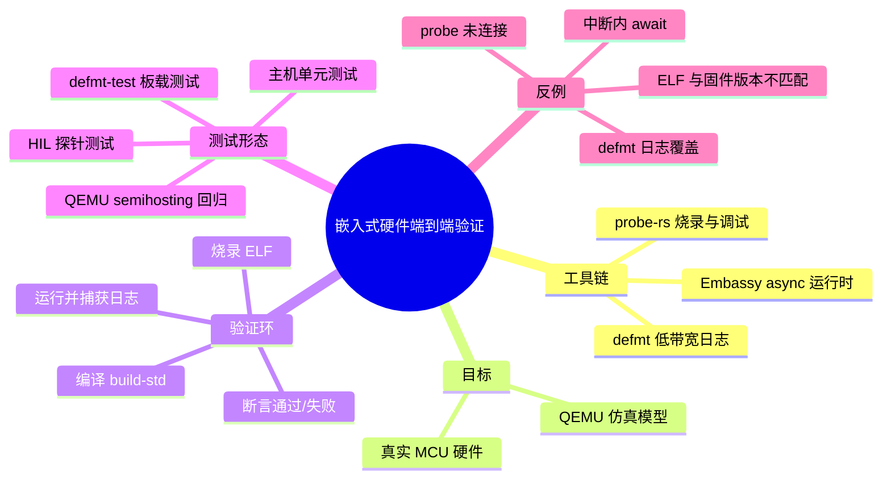
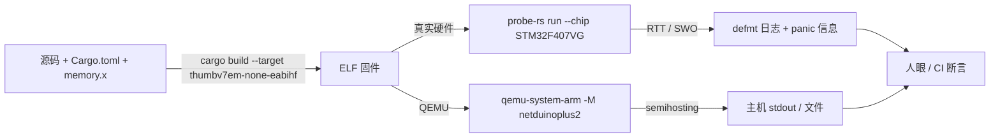
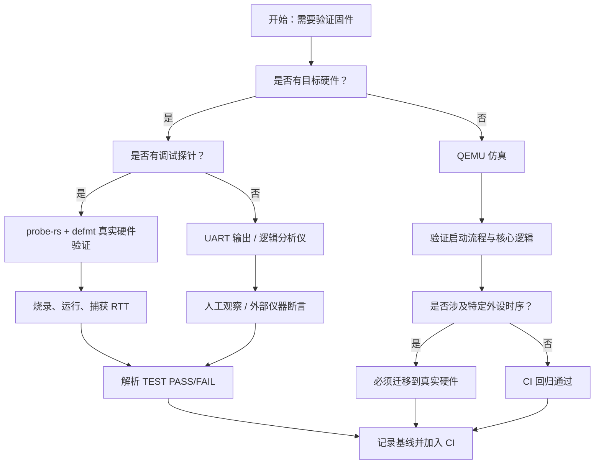
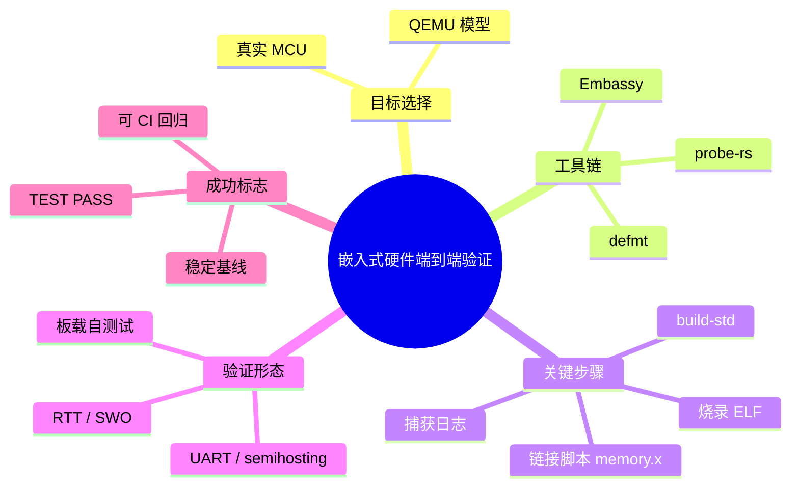

> **内容分级**: [专家级]
> **代码状态**: ⚠️ 裸机/目标平台相关代码标注 `rust,ignore`/`no_run`，host 平台无法直接编译
> **定理链**: N/A — 描述性/工程性文档
>
# 嵌入式硬件端到端验证
>
> **EN**: Embedded Hardware End-to-End Validation
> **Summary**: A canonical workflow for validating `#![no_std]` firmware on real hardware or QEMU using probe-rs, defmt, and Embassy, with minimal runnable examples, expected outputs, and decision trees.
> **Rust 版本**: 1.97.1+ (Edition 2024)
>
> **受众**: [进阶/专家]
> **Bloom 层级**: L3-L4
> **权威来源**: 本文件为 `concept/` 权威页。
> **A/S/P 标记**: **P+A** — Procedure + Application
> **双维定位**: P×App — 在真实目标或仿真器上完成可重复、可观测的固件验证闭环
> **前置概念**:
> [no_std 与裸机 Rust](38_no_std_bare_metal_rust.md) ·
> [defmt / probe-rs / Knurling 调试架构与原理](36_defmt_probe_rs_architecture.md) ·
> [Embassy 异步框架深度解析](34_embassy_framework_deep_dive.md) ·
> [no_std 硬件实测与验证](39_no_std_hardware_measurement_and_validation.md)
> **后置概念**:
> [嵌入式测试与 CI 策略](32_embedded_testing_and_ci_strategies.md) ·
> [RTOS 与 Rust 调度模型对比](46_rtos_and_scheduling_in_rust.md) ·
> [Rust 在安全关键系统中的应用](43_rust_safety_critical_systems.md) ·
> [no_std 分配器与 panic handler](52_no_std_allocators_and_panic_handlers.md) ·
> [临界区与裸机同步](53_critical_sections_and_sync_on_bare_metal.md)

---

> **来源**:
> [The Embedded Rust Book](https://docs.rust-embedded.org/book/) ·
> [The Embedonomicon](https://docs.rust-embedded.org/embedonomicon/) ·
> [probe.rs](https://probe.rs/) ·
> [defmt Book](https://defmt.ferrous-systems.com/) ·
> [Embassy Book](https://embassy.dev/book/) ·
> [Knurling app-template](https://github.com/knurling-rs/app-template) ·
> [QEMU](https://www.qemu.org/) ·
> [OpenOCD](https://openocd.org/) ·
> [ARM CMSIS-DAP](https://arm-software.github.io/CMSIS-DAP/)

---

## 🧠 知识结构图



## 📑 目录

- [嵌入式硬件端到端验证](#嵌入式硬件端到端验证)
  - [🧠 知识结构图](#-知识结构图)
  - [📑 目录](#-目录)
  - [一、权威定义](#一权威定义)
  - [二、验证工作流全景](#二验证工作流全景)
  - [三、最小可运行示例：probe-rs + defmt + Embassy](#三最小可运行示例probe-rs--defmt--embassy)
    - [3.1 项目结构](#31-项目结构)
    - [3.2 Cargo.toml](#32-cargotoml)
    - [3.3 .cargo/config.toml](#33-cargoconfigtoml)
    - [3.4 memory.x](#34-memoryx)
    - [3.5 src/main.rs](#35-srcmainrs)
    - [3.6 构建与运行](#36-构建与运行)
    - [3.7 预期输出](#37-预期输出)
  - [四、QEMU 仿真验证](#四qemu-仿真验证)
    - [4.1 为什么用 QEMU](#41-为什么用-qemu)
    - [4.2 QEMU + semihosting 最小示例](#42-qemu--semihosting-最小示例)
    - [4.3 预期输出](#43-预期输出)
  - [五、真实硬件验证](#五真实硬件验证)
    - [5.1 硬件准备清单](#51-硬件准备清单)
    - [5.2 probe-rs 配置](#52-probe-rs-配置)
    - [5.3 端到端断言测试](#53-端到端断言测试)
  - [六、属性关系表](#六属性关系表)
  - [七、反例与失效模式](#七反例与失效模式)
    - [反例 1：ELF 与固件版本不匹配](#反例-1elf-与固件版本不匹配)
    - [反例 2：QEMU 模型选择错误](#反例-2qemu-模型选择错误)
    - [反例 3：在 ISR 中使用 `await`](#反例-3在-isr-中使用-await)
    - [反例 4：日志过快导致 RTT 覆盖](#反例-4日志过快导致-rtt-覆盖)
    - [反例 5：probe-rs 权限不足](#反例-5probe-rs-权限不足)
  - [八、决策树：选择验证路径](#八决策树选择验证路径)
    - [决策节点说明](#决策节点说明)
  - [九、权威来源索引](#九权威来源索引)
  - [十、相关概念](#十相关概念)
  - [🧭 思维导图（Mindmap）](#-思维导图mindmap)
  - [权威来源与延伸阅读（International Authority Sources）](#权威来源与延伸阅读international-authority-sources)

---

## 一、权威定义

> **The Embedded Rust Book**: Embedded development requires moving beyond host compilation; validation must exercise the actual binary on the target or a faithful emulator, observing behavior through logging, probes, and assertions.

**端到端验证（End-to-End Validation）**：从源码出发，经过交叉编译、链接、烧录/加载、运行，最终在目标端或仿真端收集可观测行为，并与预期断言比对的完整闭环。它不仅证明“代码能编译”，更证明“固件在目标语义下按预期执行”。

**probe-rs**：用 Rust 实现的跨平台调试与烧录工具链，提供 `cargo embed`、`probe-rs run`、`probe-rs debug` 等命令，可把 ELF 直接烧录到目标 MCU 并通过 RTT/SWO 收集输出。

**defmt**：延迟格式化日志框架。目标端只输出紧凑二进制帧，主机端结合 ELF 文件解码，显著降低目标端日志开销与固件体积。

**Embassy**：面向嵌入式系统的 `async/await` 运行时，允许用协作式任务表达并发，配合中断唤醒实现低功耗、可预测的固件行为。

**HIL（Hardware-In-the-Loop）**：在真实硬件上运行测试，并通过探针、逻辑分析仪、串口等外部手段验证输出。与纯仿真相比，HIL 能捕获时序、功耗、外设交互等物理层行为。

判定依据：端到端验证的核心是“目标语义 = 编译产物 + 运行环境 + 观测通道”三者一致。任何一环不匹配（如 ELF 过期、probe 固件不兼容、日志缓冲区溢出）都会让验证结论失效。

---

## 二、验证工作流全景



一个完整的端到端验证工作流包含：

1. **可重复构建**：`build-std` + 固定 target + 锁定依赖版本。
2. **目标加载**：通过 probe-rs 烧录到真实 MCU，或通过 QEMU 加载 ELF。
3. **行为观测**：defmt/RTT 用于真实硬件；semihosting/ITM/UART 用于 QEMU 或开发板。
4. **结果断言**：在日志中打印测试状态码，或在 CI 中解析输出是否包含 `TEST PASS`。
5. **回归保护**：把 `cargo run` / `probe-rs run` 的输出与基线 diff 对比。

> 关于栈/堆/中断延迟等**测量技术**的细节见 [no_std 硬件实测与验证](39_no_std_hardware_measurement_and_validation.md)；本文聚焦于“把程序跑起来并验证其正确性”的端到端流程。

---

## 三、最小可运行示例：probe-rs + defmt + Embassy

下面以 STM32F407VG（Cortex-M4F）为例，展示一个可通过 `cargo run` 直接烧录到硬件并输出日志的最小 Embassy 项目。代码无法在 host 上运行，因此标注为 `rust,ignore`，但文件结构本身可直接复制到真实项目中使用。

### 3.1 项目结构

```text
embassy-validate/
├── Cargo.toml
├── .cargo
│   └── config.toml
├── memory.x
└── src
    └── main.rs
```

### 3.2 Cargo.toml

```toml
[package]
name = "embassy-validate"
version = "0.1.0"
edition = "2024"
rust-version = "1.97.0"

[dependencies]
embassy-stm32 = { version = "0.1", features = ["stm32f407vg", "memory-x"] }
embassy-executor = { version = "0.6", features = ["arch-cortex-m", "executor-thread", "defmt"] }
embassy-time = { version = "0.3", features = ["tick-hz-32_768"] }

cortex-m = { version = "0.7", features = ["critical-section-single-core"] }
cortex-m-rt = "0.7"
panic-probe = { version = "0.3", features = ["print-defmt"] }
defmt = "0.3"
defmt-rtt = "0.4"

[profile.release]
debug = 2
lto = true
opt-level = "s"
panic = "abort"

[profile.dev]
panic = "abort"
```

### 3.3 .cargo/config.toml

```toml
[target.thumbv7em-none-eabihf]
runner = "probe-rs run --chip STM32F407VG"
rustflags = [
    "-C", "link-arg=-Tlink.x",
    "-C", "link-arg=-Tdefmt.x",
]

[build]
target = "thumbv7em-none-eabihf"

[unstable]
build-std = ["core", "alloc"]
build-std-features = ["compiler-builtins-mem"]
```

> 说明：`build-std` 在当前 Rust 1.97+ 通道上通常需要 nightly；若使用 stable，可安装 `rust-src` 并依赖官方 target 的预编译 `core`/`alloc`，但自定义 target 仍需 `-Z build-std`。

### 3.4 memory.x

```ld
MEMORY
{
  FLASH (rx)  : ORIGIN = 0x0800_0000, LENGTH = 1M
  RAM   (rwx) : ORIGIN = 0x2000_0000, LENGTH = 128K
}

_stack_top = ORIGIN(RAM) + LENGTH(RAM);
```

### 3.5 src/main.rs

```rust,ignore
#![no_std]
#![no_main]

use defmt::*;
use embassy_executor::Spawner;
use embassy_stm32::gpio::{Level, Output, Speed};
use embassy_time::{Duration, Timer};
use panic_probe as _;

#[embassy_executor::main]
async fn main(_spawner: Spawner) {
    info!("=== Embassy validation start ===");

    let p = embassy_stm32::init(Default::default());
    let mut led = Output::new(p.PA5, Level::Low, Speed::Low);

    info!("step 1: LED initialized on PA5");

    for i in 0..3 {
        led.set_high();
        Timer::after(Duration::from_millis(200)).await;
        led.set_low();
        Timer::after(Duration::from_millis(200)).await;
        info!("step 2: blink cycle {}", i + 1);
    }

    info!("step 3: validation complete");
    info!("TEST PASS");

    loop {
        Timer::after(Duration::from_secs(1)).await;
    }
}
```

### 3.6 构建与运行

```bash
# 1. 安装目标与 rust-src
rustup target add thumbv7em-none-eabihf
rustup component add rust-src

# 2. 构建
 cargo build --target thumbv7em-none-eabihf

# 3. 烧录并运行（自动调用 .cargo/config.toml 中的 runner）
cargo run --target thumbv7em-none-eabihf
```

### 3.7 预期输出

```text
(HOST) INFO  flashing program (32 pages / 32.00 KiB)
(HOST) INFO  success!
────────────────────────────────────────
INFO  === Embassy validation start ===
INFO  step 1: LED initialized on PA5
INFO  step 2: blink cycle 1
INFO  step 2: blink cycle 2
INFO  step 2: blink cycle 3
INFO  step 3: validation complete
INFO  TEST PASS
```

> `TEST PASS` 是自定义断言标记，可被 CI 脚本解析。

---

## 四、QEMU 仿真验证

### 4.1 为什么用 QEMU

| 场景 | 真实硬件 | QEMU |
|:---|:---|:---|
| 成本 | 需要开发板 + 调试器 | 零硬件成本 |
| 可重复性 | 受具体芯片批次、接线影响 | 每次环境一致 |
| 外设保真度 | 真实 | 模型化，可能缺失部分外设 |
| CI 集成 | 复杂（需 HIL farm） | 容易 |
| 调试体验 | 依赖 probe | 可用 GDB stub |

QEMU 适合验证启动流程、中断向量、链接脚本、基本外设（GPIO、UART、定时器）以及 semihosting 退出机制。对于特定芯片的模拟外设时序，仍需真实硬件。

### 4.2 QEMU + semihosting 最小示例

下面示例使用 `cortex-m-rt` 和 `panic-semihosting`，可在 QEMU 的 `netduinoplus2`（STM32F405）模型上运行并通过 semihosting 输出。

```rust,ignore
#![no_std]
#![no_main]

use cortex_m_rt::entry;
use cortex_m_semihosting::hprintln;
use panic_semihosting as _;

#[entry]
fn main() -> ! {
    hprintln!("QEMU validation start").unwrap();

    let mut sum = 0u32;
    for i in 1..=10 {
        sum += i;
    }

    if sum == 55 {
        hprintln!("TEST PASS: sum={}", sum).unwrap();
    } else {
        hprintln!("TEST FAIL: sum={}", sum).unwrap();
    }

    loop {}
}
```

对应 `Cargo.toml`：

```toml
[dependencies]
cortex-m = "0.7"
cortex-m-rt = "0.7"
cortex-m-semihosting = "0.5"
panic-semihosting = "0.6"
```

构建并运行：

```bash
 cargo build --target thumbv7em-none-eabihf --release

qemu-system-arm \
  -cpu cortex-m4 \
  -M netduinoplus2 \
  -nographic \
  -semihosting-config enable=on,target=native \
  -kernel target/thumbv7em-none-eabihf/release/embassy-validate.elf
```

### 4.3 预期输出

```text
QEMU validation start
TEST PASS: sum=55
```

> 如果没有 `--semihosting-config`，`hprintln!` 不会输出；如果目标模型不匹配，QEMU 可能无法启动或立即 HardFault。

---

## 五、真实硬件验证

### 5.1 硬件准备清单

| 项目 | 说明 |
|:---|:---|
| 目标 MCU | 确认芯片型号、封装、Flash/RAM 容量 |
| 调试探针 | CMSIS-DAP / DAPLink / ST-Link / J-Link / Black Magic Probe |
| SWD 接线 | SWDIO、SWCLK、GND，必要时 NRST、VCC 检测 |
| 电源 | 稳定的 3.3 V 或芯片要求电压 |
| 串口/UART | 若使用 UART 日志，准备 USB-UART 转换器 |
| 固件入口 | 确认 boot 模式（Flash / System / SRAM） |

### 5.2 probe-rs 配置

列出已连接探针：

```bash
probe-rs list
```

输出示例：

```text
The following debug probes were found:
[0]: CMSIS-DAP -- 0d28:0204:... (ARM)
```

运行并附加 RTT：

```bash
probe-rs run --chip STM32F407VG target/thumbv7em-none-eabihf/release/embassy-validate.elf
```

若有多探针，用 `--probe` 指定：

```bash
probe-rs run --chip STM32F407VG --probe 0d28:0204:... <elf>
```

### 5.3 端到端断言测试

把测试逻辑内嵌到固件中，通过 defmt 打印结果。CI 中可解析 `TEST PASS` / `TEST FAIL`：

```rust,ignore
#[embassy_executor::main]
async fn main(_spawner: Spawner) {
    info!("running self-test...");

    let result = run_self_test().await;
    match result {
        Ok(()) => info!("TEST PASS"),
        Err(e) => {
            error!("TEST FAIL: {:?}", e);
            cortex_m::asm::bkpt();
        }
    }

    loop { embassy_time::Timer::after_secs(1).await; }
}

async fn run_self_test() -> Result<(), TestError> {
    // 1. 验证 GPIO 可切换
    // 2. 验证定时器精度
    // 3. 验证 async 任务调度
    Ok(())
}

#[derive(Debug)]
enum TestError {
    Gpio,
    Timer,
    Scheduler,
}
```

---

## 六、属性关系表

| 属性 | 作用域 | 真实硬件 | QEMU | 说明 |
|:---|:---|:---:|:---:|:---|
| `probe-rs run` | 命令 | ✅ | ❌ | 通过 SWD/JTAG 烧录并附加 RTT |
| `qemu-system-arm` | 命令 | ❌ | ✅ | 需要匹配 `-M` 模型 |
| `defmt` | 库 | ✅ | ⚠️ | QEMU 无 ELF 解码器，需 RTT 或 UART |
| `panic-probe` | panic handler | ✅ | ❌ | 依赖 probe-rs RTT |
| `panic-semihosting` | panic handler | ⚠️ | ✅ | 需要 semihosting 支持 |
| `build-std` | Cargo | ✅ | ✅ | 自定义 target 必备 |
| `memory.x` | 链接脚本 | ✅ | ✅ | 必须与目标 RAM/Flash 一致 |
| `cortex-m-rt::entry` | 入口 | ✅ | ✅ | 自动生成向量表 |
| `#[embassy_executor::main]` | 入口 | ✅ | ⚠️ | 需要 Embassy 支持的芯片模型 |

---

## 七、反例与失效模式

### 反例 1：ELF 与固件版本不匹配

```text
(HOST) ERROR ELF file and target firmware do not match
```

**原因**：defmt 需要主机端 ELF 与目标端固件完全对应。任何重新编译未重新运行 `probe-rs run` 都会导致日志无法解码。

**修复**：每次修改代码后重新构建并运行；CI 中把 ELF 作为产物保存。

### 反例 2：QEMU 模型选择错误

```bash
qemu-system-arm -M stm32-p103 -kernel <elf>
```

**原因**：`-M` 模型与芯片不匹配，导致外设基地址、向量表偏移错误，程序一启动就 HardFault。

**修复**：查阅 QEMU 支持的机器列表 `qemu-system-arm -M ?`，选择最接近的模型（如 `netduinoplus2`、`lm3s6965evb`）。

### 反例 3：在 ISR 中使用 `await`

```rust,compile_fail
#[cortex_m_rt::interrupt]
fn TIM2() {
    some_async_fn().await; // 错误：中断上下文不是 Future executor
}
```

**原因**：中断处理函数不是 `async fn`，没有 Waker/Context，无法 `.await`。

**修复**：中断中只设置标志、触发 Waker 或发送信号量；业务逻辑放在 Embassy async task 中。

### 反例 4：日志过快导致 RTT 覆盖

```rust,ignore
loop {
    defmt::info!("high rate log");
}
```

**原因**：RTT 是目标 RAM 中的环形缓冲区。如果日志产生速度超过主机读取速度，旧日志会被覆盖。

**修复**：降低日志频率、增大 RTT 缓冲区、使用 `defmt::trace!` 并在主机端过滤。

### 反例 5：probe-rs 权限不足

```text
Error: Failed to open the debug probe.
```

**原因**：Linux 上 udev 规则未配置，或 Windows 上驱动被其他程序占用。

**修复**：安装 probe-rs 提供的 udev 规则；Windows 使用 WinUSB/libusbK 驱动；关闭其他调试客户端。

---

## 八、决策树：选择验证路径



### 决策节点说明

| 节点 | 判定条件 | 输出 |
|:---|:---|:---|
| 硬件可用 | 是否有目标 MCU + 调试器 | QEMU / 真实硬件 |
| 探针可用 | 是否支持 SWD/JTAG 并安装驱动 | probe-rs / UART / 仪器 |
| 外设保真度 | 是否依赖芯片特定时序 | QEMU 是否足够 |
| 回归价值 | 是否适合自动化 | 是否加入 CI |

---

## 九、权威来源索引

| 来源类型 | 链接 | 覆盖主题 |
|:---|:---|:---|
| P0 官方 | [Rust Reference — no_std](https://doc.rust-lang.org/reference/names/preludes.html#the-no_std-attribute) | `#![no_std]` 语义 |
| P0 官方 | [Rust Reference — Panic Handler](https://doc.rust-lang.org/reference/runtime.html#the-panic_handler-attribute) | panic handler |
| P2 生态 | [The Embedded Rust Book](https://docs.rust-embedded.org/book/) | 嵌入式 Rust 基础 |
| P2 生态 | [probe.rs](https://probe.rs/) | probe-rs 工具链 |
| P2 生态 | [defmt Book](https://defmt.ferrous-systems.com/) | defmt 日志 |
| P2 生态 | [Embassy Book](https://embassy.dev/book/) | Embassy 框架 |
| P2 生态 | [Knurling app-template](https://github.com/knurling-rs/app-template) | 最小项目模板 |
| P2 生态 | [QEMU ARM machines](https://qemu-project.gitlab.io/qemu/system/arm/) | QEMU ARM 模型 |

---

## 十、相关概念

- [no_std 与裸机 Rust](38_no_std_bare_metal_rust.md) — no_std 语义边界与启动流程
- [defmt / probe-rs / Knurling 调试架构与原理](36_defmt_probe_rs_architecture.md) — 调试链路原理
- [Embassy 异步框架深度解析](34_embassy_framework_deep_dive.md) — Embassy 架构
- [RTIC 实时任务调度框架深度解析](35_rtic_framework_deep_dive.md) — 硬实时调度
- [no_std 硬件实测与验证](39_no_std_hardware_measurement_and_validation.md) — 栈/堆/周期/中断测量
- [RTOS 与 Rust 调度模型对比](46_rtos_and_scheduling_in_rust.md) — 调度模型对比
- [嵌入式测试与 CI 策略](32_embedded_testing_and_ci_strategies.md) — CI 集成
- [Rust vs Ada/SPARK](../../05_comparative/01_systems_languages/07_rust_vs_ada_spark.md) — 安全关键系统语言对比（L5 横向对比）

---

## 🧭 思维导图（Mindmap）



---

> **权威来源声明**：本文件为 `concept/06_ecosystem/05_systems_and_embedded/45_embedded_hardware_validation.md`，是嵌入式硬件端到端验证的 `concept/` 权威概念页。具体测量技术、调试协议细节、RTOS 调度模型见目录内其他权威页；本页从“可运行、可观测、可断言”的工程闭环视角给出统一工作流。

---

## 权威来源与延伸阅读（International Authority Sources）

- probe-rs：<https://probe.rs/>
- defmt：<https://defmt.ferrous-systems.com/>
- Embassy Book：<https://embassy.dev/book/>
- The Rust Programming Language（TRPL）：<https://doc.rust-lang.org/book/>
- RustBelt（Rust 形式化基础）：<https://plv.mpi-sws.org/rustbelt/>
- `probe-rs` crate docs：<https://docs.rs/probe-rs/latest/probe_rs/>
