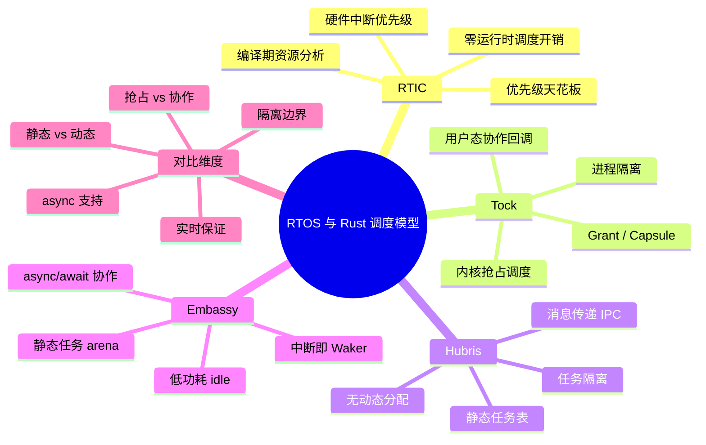
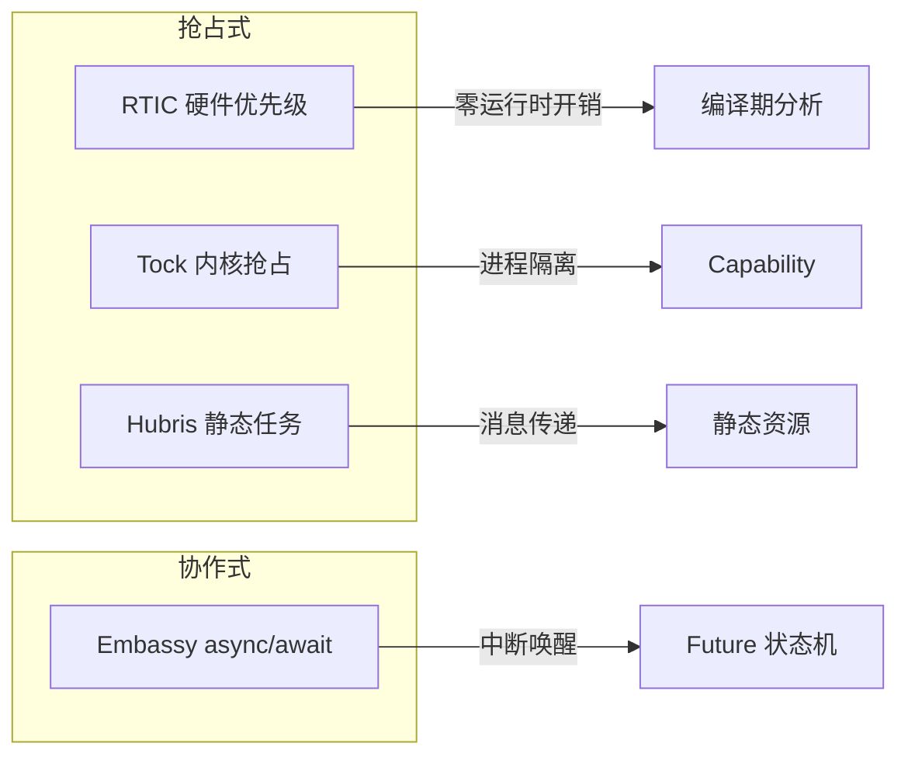
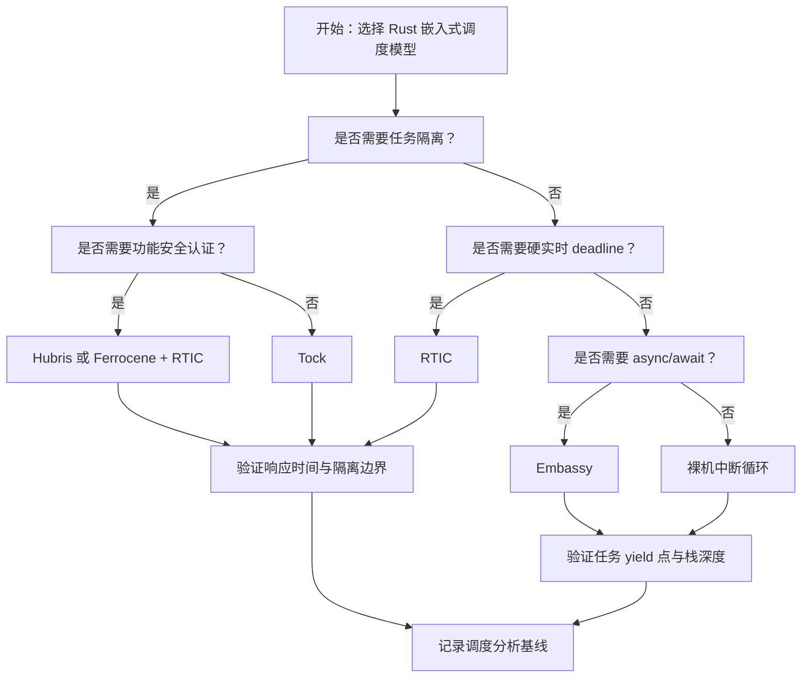
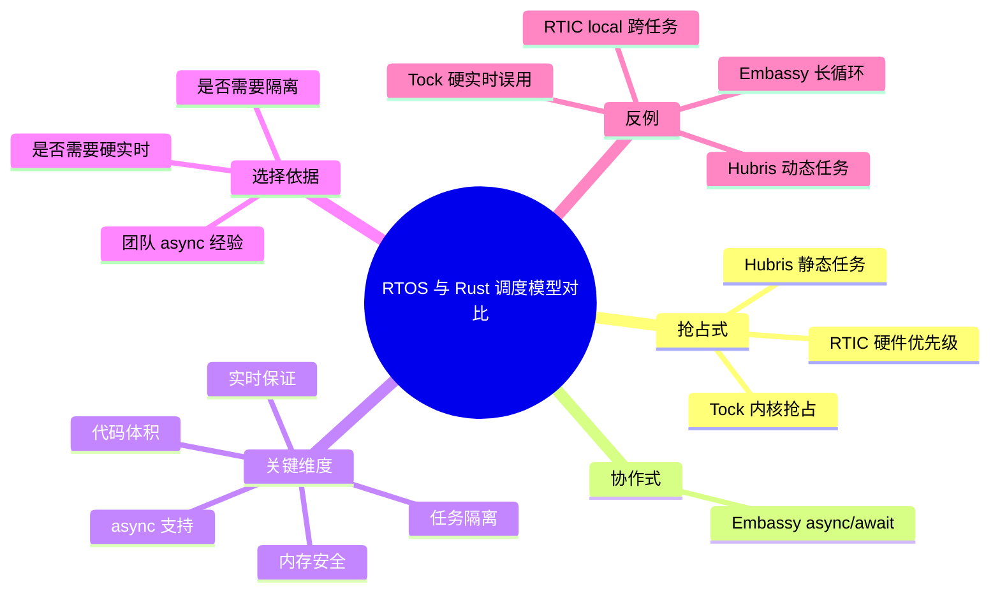

> **内容分级**: [专家级]
> **代码状态**: ⚠️ 裸机/目标平台相关代码标注 `rust,ignore`/`no_run`，host 平台无法直接编译
> **定理链**: N/A — 描述性/工程性文档
>
# RTOS 与 Rust 调度模型对比
>
> **EN**: RTOS and Scheduling Models in Rust
> **Summary**: A comparative analysis of scheduling models in Rust embedded frameworks: RTIC, Tock, Hubris, and Embassy, with decision trees, anti-patterns, and semantic mappings.
> **Rust 版本**: 1.97.0+ (Edition 2024)
>
> **受众**: [专家]
> **Bloom 层级**: L4
> **权威来源**: 本文件为 `concept/` 权威页。
> **A/S/P 标记**: **S+A+Eva** — Structure + Application + Evaluation
> **双维定位**: C×Eva — 比较与评价面向嵌入式实时调度的 Rust 运行时模型
> **前置概念**:
> [Rust 嵌入式系统开发](03_embedded_systems.md) ·
> [嵌入式 RTOS 与安全关键框架对比](26_embedded_rtos_and_safety_critical_frameworks.md) ·
> [RTIC 实时任务调度框架深度解析](35_rtic_framework_deep_dive.md) ·
> [Embassy 异步框架深度解析](34_embassy_framework_deep_dive.md) ·
> [Cortex-M 与 RISC-V 中断异常模型](14_interrupt_and_exception_model.md)
> **后置概念**:
> [no_std 与裸机 Rust](38_no_std_bare_metal_rust.md) ·
> [异步 no_std 嵌入式](11_async_no_std_embedded.md) ·
> [自定义裸机异步执行器](28_custom_bare_metal_async_executor.md) ·
> [Rust 在安全关键系统中的应用](43_rust_safety_critical_systems.md)

---

> **来源**:
> [RTIC](https://rtic.rs/) ·
> [RTIC Book](https://rtic.rs/2/book/en/) ·
> [Tock OS Book](https://book.tockos.org/) ·
> [Tock GitHub](https://github.com/tock/tock) ·
> [Hubris](https://hubris.oxide.computer/) ·
> [Hubris GitHub](https://github.com/oxidecomputer/hubris) ·
> [Embassy Book](https://embassy.dev/book/) ·
> [Embassy GitHub](https://github.com/embassy-rs/embassy) ·
> [Real-Time Systems — Jane W. S. Liu](https://www.cs.ucr.edu/~dougs/RealTime.pdf) ·
> [ARM Cortex-M4 Generic User Guide](https://developer.arm.com/documentation/dui0553/latest/)

---

## 🧠 知识结构图



## 📑 目录

- [RTOS 与 Rust 调度模型对比](#rtos-与-rust-调度模型对比)
  - [🧠 知识结构图](#-知识结构图)
  - [📑 目录](#-目录)
  - [一、权威定义](#一权威定义)
  - [二、调度模型总览](#二调度模型总览)
  - [三、RTIC：基于硬件中断优先级的实时调度](#三rtic基于硬件中断优先级的实时调度)
    - [3.1 任务映射到 NVIC](#31-任务映射到-nvic)
    - [3.2 优先级天花板协议](#32-优先级天花板协议)
    - [3.3 调度不变量](#33-调度不变量)
  - [四、Tock：微内核 + 用户态协作](#四tock微内核--用户态协作)
    - [4.1 内核调度](#41-内核调度)
    - [4.2 用户态执行模型](#42-用户态执行模型)
    - [4.3 Capability 与 Grant](#43-capability-与-grant)
  - [五、Hubris：静态任务表与消息传递](#五hubris静态任务表与消息传递)
    - [5.1 静态任务模型](#51-静态任务模型)
    - [5.2 IPC 调度语义](#52-ipc-调度语义)
    - [5.3 故障隔离](#53-故障隔离)
  - [六、Embassy：async/await 协作调度](#六embassyasyncawait-协作调度)
    - [6.1 Future 状态机](#61-future-状态机)
    - [6.2 中断到 Waker](#62-中断到-waker)
    - [6.3 Executor poll 循环](#63-executor-poll-循环)
  - [七、多维属性矩阵](#七多维属性矩阵)
  - [八、反例与失效模式](#八反例与失效模式)
    - [反例 1：在 Embassy 中写长计算循环](#反例-1在-embassy-中写长计算循环)
    - [反例 2：在 RTIC 中把共享资源放入 `#[local]`](#反例-2在-rtic-中把共享资源放入-local)
    - [反例 3：在 Hubris 中动态创建任务](#反例-3在-hubris-中动态创建任务)
    - [反例 4：把 Tock 当作硬实时系统使用](#反例-4把-tock-当作硬实时系统使用)
  - [九、决策树：选择调度模型](#九决策树选择调度模型)
    - [决策节点说明](#决策节点说明)
  - [十、权威来源索引](#十权威来源索引)
  - [十一、相关概念](#十一相关概念)
  - [🧭 思维导图（Mindmap）](#-思维导图mindmap)
  - [权威来源与延伸阅读（International Authority Sources）](#权威来源与延伸阅读international-authority-sources)

---

## 一、权威定义

> **RTIC Book**: RTIC uses the hardware interrupt priority mechanism to provide scheduling, and leverages Rust's ownership and type system to guarantee memory safety and deadlock freedom.

**调度模型（Scheduling Model）**：决定任务何时获得 CPU、如何共享资源、如何处理优先级冲突和故障的一组规则与实现。对嵌入式系统而言，调度模型直接影响实时性、功耗、内存占用和可验证性。

**抢占式调度（Preemptive Scheduling）**：高优先级任务可立即中断低优先级任务。RTIC、Tock 内核、Hubris 均使用抢占式调度。

**协作式调度（Cooperative Scheduling）**：任务主动让出 CPU，通常通过 `await`、显式 yield 或事件循环。Embassy 属于协作式调度。

**硬实时（Hard Real-Time）**：任务必须在截止期限前完成，否则系统失效。RTIC 设计目标之一是提供可分析的硬实时界限。

**任务隔离（Task Isolation）**：一个任务的故障不会破坏其他任务的内存或状态。Tock 和 Hubris 通过 MPU/MMU 或单地址空间 + 类型系统实现不同级别的隔离。

判定依据：选型时首先要区分“调度语义”（任务如何运行）和“隔离语义”（任务故障如何传播）。RTIC 和 Embassy 都不提供硬件隔离，而 Tock 和 Hubris 把隔离作为核心设计目标。

---

## 二、调度模型总览



| 框架 | 调度方式 | 任务形态 | 同步机制 | 隔离级别 | 典型实时性 |
|:---|:---|:---|:---|:---|:---|
| RTIC | 硬件中断优先级抢占 | 硬件/软件任务 | `lock` + PCP | 无硬件隔离 | 硬实时 |
| Tock | 内核抢占 + 用户协作 | 内核 capsule / 用户进程 | Grant / 系统调用 | MPU 进程隔离 | 软实时 |
| Hubris | 静态任务表抢占 | 固定任务 | 消息传递 | 任务地址空间隔离 | 硬实时 |
| Embassy | 协作式 async executor | async task | `Mutex` / `Channel` / `Signal` | 无硬件隔离 | 软实时/低延迟 |

> 更全面的框架对比（认证状态、网络栈、构建系统、典型场景）见 [嵌入式 RTOS 与安全关键框架对比](26_embedded_rtos_and_safety_critical_frameworks.md)。本文只聚焦**调度语义**。

---

## 三、RTIC：基于硬件中断优先级的实时调度

RTIC 把“任务”直接映射到 Cortex-M 的 NVIC 中断优先级，把“共享资源”映射到 Rust 的所有权与借用规则。

### 3.1 任务映射到 NVIC

```rust,ignore
#[rtic::app(device = stm32f4::stm32f407, peripherals = true)]
mod app {
    #[shared]
    struct Shared { counter: u32 }

    #[local]
    struct Local { toggle: bool }

    #[init]
    fn init(_cx: init::Context) -> (Shared, Local, init::Monotonics) {
        (Shared { counter: 0 }, Local { toggle: false }, init::Monotonics())
    }

    #[task(binds = TIM2, priority = 2, shared = [counter])]
    fn tick(mut cx: tick::Context) {
        cx.shared.counter.lock(|c| *c += 1);
    }

    #[task(binds = TIM3, priority = 3, shared = [counter])]
    fn fast(mut cx: fast::Context) {
        cx.shared.counter.lock(|c| *c = c.wrapping_mul(2));
    }
}
```

**语义映射**：

| RTIC 概念 | 底层机制 |
|:---|:---|
| 任务 | NVIC 中断处理函数 |
| 优先级 | NVIC 优先级寄存器 |
| 共享资源 | `#[shared]` 结构体 + PCP |
| 临界区 | `lock` 临时提升 CPU 优先级 |
| 调度器 | 硬件 NVIC（零软件调度开销） |

### 3.2 优先级天花板协议

每个共享资源的天花板优先级 = 所有访问该资源的任务中的最高优先级。

```text
资源 counter：
  tick(2) 访问 -> 天花板 = max(2, 3) = 3
  fast(3) 访问

当 tick(2) 调用 counter.lock(...) 时：
  CPU 优先级临时提升到 3
  优先级 ≤ 2 的任务无法抢占
  fast(3) 可安全访问同一资源
```

### 3.3 调度不变量

1. 高优先级任务始终可抢占低优先级任务。
2. 访问共享资源时，CPU 优先级提升到资源天花板。
3. 同优先级任务不可相互抢占，因此同优先级资源访问天然串行。
4. 不存在循环等待条件，因此**无死锁**。

---

## 四、Tock：微内核 + 用户态协作

Tock 把操作系统拆分为微内核（Rust）和用户态应用（Rust 或 C），内核提供抢占式调度，应用内部使用协作式回调。

### 4.1 内核调度

```text
Tock 内核
  ├── Scheduler: 决定下一个运行的 capsule / 进程
  ├── Capsule: 受信任的驱动组件
  └── Grant: 为进程分配的内核内存

用户进程
  ├── 单线程、事件驱动
  └── 通过系统调用请求内核服务
```

内核调度策略通常是轮转 + 优先级混合，保证高优先级进程（如驱动）得到 CPU。

### 4.2 用户态执行模型

```rust,ignore
// libtock-rs 示例：异步事件循环
use libtock::alarm::{Alarm, Milliseconds};
use libtock::leds::Leds;

fn main() {
    let mut led = Leds::init();
    loop {
        led.toggle(0).unwrap();
        Alarm::sleep_for(Milliseconds(1000)).unwrap();
    }
}
```

用户态进程没有自己的线程模型，而是通过**系统调用 + 回调**与内核交互。`Alarm::sleep_for` 会触发系统调用，进程挂起，定时器到期后内核重新调度该进程。

### 4.3 Capability 与 Grant

| 概念 | 作用 |
|:---|:---|
| Capability | 限制 capsule 能访问的内核接口 |
| Grant | 内核为每个进程分配的私有内存区，用于保存进程状态 |

判定依据：Tock 的安全模型是“**内核可信、进程隔离**”。驱动代码必须受信任，但用户进程即使崩溃也不会破坏内核或其他进程。

---

## 五、Hubris：静态任务表与消息传递

Hubris 是 Oxide Computer 设计的任务型微内核，核心设计约束是：**静态任务表、无动态分配、任务间通过消息传递通信**。

### 5.1 静态任务模型

```text
Hubris 镜像
  ├── kernel (少量 unsafe)
  ├── task_a (独立编译)
  ├── task_b (独立编译)
  └── idle

每个任务：
  - 固定栈
  - 固定入口
  - 固定优先级
  - 运行时不可创建/销毁
```

### 5.2 IPC 调度语义

任务间通过 `kern_send` / `recv` 进行同步消息传递：

```rust,ignore
// 概念示意，非 Hubris 真实 API
let reply = hubris_ipc::send(TASK_B, &request).unwrap();
```

**调度语义**：

- 发送消息时，若接收方正等待，则接收方立即被调度（直接切换）。
- 若接收方未等待，发送方阻塞直到接收方 `recv`。
- 消息传递不共享内存，因此任务间内存隔离。

### 5.3 故障隔离

```text
任务 A 崩溃
  -> 内核捕获 fault
  -> 不影响任务 B/C
  -> 可通过 Humility 调试器离线分析 dump
```

判定依据：Hubris 适合“**一个任务故障不能导致整个系统失效**”的场景，如工业控制、航空电子。

---

## 六、Embassy：async/await 协作调度

Embassy 不依赖 RTOS 内核，而是把 Rust 的 `Future` + `Waker` 机制直接搬到 `no_std` 环境。

### 6.1 Future 状态机

```rust
use core::pin::Pin;
use core::task::{Context, Poll};

pub trait Future {
    type Output;
    fn poll(self: Pin<&mut Self>, cx: &mut Context<'_>) -> Poll<Self::Output>;
}
```

每个 `async fn` 被编译器展开为一个状态机，状态转换由 `.await` 点驱动。

### 6.2 中断到 Waker

```rust,ignore
// Embassy HAL 内部示意：外设中断触发 Waker
#[interrupt]
fn TIM2() {
    let waker = TIM2_WAKER.take().unwrap();
    waker.wake();
}
```

当中断发生时，HAL 唤醒等待该外设的 async task；executor 下次 poll 时会继续执行。

### 6.3 Executor poll 循环

```rust,ignore
// 概念示意
loop {
    for task in &mut tasks {
        if task.is_ready() {
            task.poll();
        }
    }
    cpu_wait_for_interrupt(); // WFI，低功耗
}
```

**调度不变量**：

1. 任何时刻只有一个 task 在执行（单核）。
2. task 只在 `.await` 点让出 CPU。
3. 中断负责唤醒等待中的 task。
4. 无抢占，因此无需互斥量即可安全共享单核状态。

---

## 七、多维属性矩阵

| 维度 | RTIC | Tock | Hubris | Embassy |
|:---|:---|:---|:---|:---|
| **调度方式** | 硬件中断抢占 | 内核抢占 + 用户协作 | 静态任务表抢占 | 协作式 async |
| **任务创建** | 编译期 | 编译期 + 运行时加载 | 编译期 | 编译期/静态 arena |
| **内存分配** | 无堆默认 | Grant 受限分配 | 无动态分配 | 无堆默认 |
| **共享状态同步** | PCP `lock` | Grant/Capability | 消息传递 | `Mutex`/`Channel` |
| **任务隔离** | 无硬件隔离 | MPU 进程隔离 | 任务地址空间隔离 | 无硬件隔离 |
| **硬实时保证** | 强 | 中等 | 强 | 弱（协作式） |
| **async/await** | 实验性 | 用户态库支持 | 不支持 | 一等公民 |
| **中断延迟** | 由 NVIC 决定 | 由内核路径决定 | 由 IPC 路径决定 | 由 HAL 唤醒路径决定 |
| **代码体积** | 小 | 中 | 小 | 小-中 |
| **适用场景** | 电机控制、ECU | IoT 网关、多应用 MCU | 高可靠控制、航空电子 | 低功耗 IoT、网络节点 |

---

## 八、反例与失效模式

### 反例 1：在 Embassy 中写长计算循环

```rust,ignore
#[embassy_executor::task]
async fn bad_task() {
    loop {
        heavy_computation(); // 无 await，长期占用 CPU
    }
}
```

**原因**：协作式调度依赖 task 主动 `.await`。长时间不 yield 会饿死其他 task，破坏响应性。

**修复**：把长计算拆分成多段，中间插入 `Timer::after(Duration::ZERO).await` 或 `yield_now().await`。

### 反例 2：在 RTIC 中把共享资源放入 `#[local]`

```rust,compile_fail
#[rtic::app(device = stm32f4::stm32f407, peripherals = true)]
mod app {
    #[local]
    struct Local { counter: u32 }

    #[task(binds = TIM2, local = [counter])]
    fn tick(cx: tick::Context) {
        *cx.local.counter += 1;
    }

    #[task(binds = TIM3, local = [counter])] // 错误：counter 已被 tick 独占
    fn fast(cx: fast::Context) {
        *cx.local.counter += 1;
    }
}
```

**原因**：`#[local]` 资源属于单个任务，跨任务共享必须放入 `#[shared]`。

**修复**：把 `counter` 移入 `#[shared]` 并通过 `lock` 访问。

### 反例 3：在 Hubris 中动态创建任务

```rust,ignore
// Hubris 不允许
let task = hubris::spawn(new_task_code); // 运行时错误 / 不支持
```

**原因**：Hubris 任务表静态确定，运行时无任务创建 API。

**修复**：所有任务在编译期定义，动态工作负载通过消息传递或状态机表达。

### 反例 4：把 Tock 当作硬实时系统使用

**原因**：Tock 内核调度虽然抢占，但用户态进程是协作回调，且系统调用路径有一定延迟，难以提供严格 deadline 保证。

**修复**：硬实时控制放在 RTIC/Hubris 中，Tock 负责隔离与非实时协议栈。

---

## 九、决策树：选择调度模型



### 决策节点说明

| 节点 | 判定条件 | 输出 |
|:---|:---|:---|
| 任务隔离 | 一个任务崩溃是否必须不影响其他任务 | Tock/Hubris vs RTIC/Embassy |
| 认证需求 | 是否需要 ISO 26262 / IEC 61508 / DO-178C 证据 | Ferrocene + 认证 RTOS |
| 硬实时 | 是否有严格 deadline 和可分析的响应时间 | RTIC/Hubris vs Embassy |
| async 偏好 | 团队是否熟悉 async/await 模型 | Embassy vs 裸机循环 |

---

## 十、权威来源索引

| 来源类型 | 链接 | 覆盖主题 |
|:---|:---|:---|
| P1 学术 | [Real-Time Systems — Jane W. S. Liu](https://www.cs.ucr.edu/~dougs/RealTime.pdf) | 实时调度理论 |
| P2 生态 | [RTIC Book](https://rtic.rs/2/book/en/) | RTIC 调度模型 |
| P2 生态 | [Tock OS Book](https://book.tockos.org/) | Tock 内核与用户态 |
| P2 生态 | [Hubris](https://hubris.oxide.computer/) | Hubris 任务模型 |
| P2 生态 | [Embassy Book](https://embassy.dev/book/) | Embassy executor |
| P0 官方 | [ARM Cortex-M4 Generic User Guide](https://developer.arm.com/documentation/dui0553/latest/) | NVIC 优先级 |

---

## 十一、相关概念

- [嵌入式 RTOS 与安全关键框架对比](26_embedded_rtos_and_safety_critical_frameworks.md) — 框架全景对比
- [RTIC 实时任务调度框架深度解析](35_rtic_framework_deep_dive.md) — RTIC 深度解析
- [Embassy 异步框架深度解析](34_embassy_framework_deep_dive.md) — Embassy 深度解析
- [自定义裸机异步执行器](28_custom_bare_metal_async_executor.md) — 手写 executor
- [异步 no_std 嵌入式](11_async_no_std_embedded.md) — async 在裸机中的语义
- [Cortex-M 与 RISC-V 中断异常模型](14_interrupt_and_exception_model.md) — NVIC/CLIC 基础
- [no_std 与裸机 Rust](38_no_std_bare_metal_rust.md) — no_std 基础
- [Rust vs Ada/SPARK](../../05_comparative/01_systems_languages/07_rust_vs_ada_spark.md) — 安全关键系统语言对比（L5 横向对比）

---

## 🧭 思维导图（Mindmap）



---

> **权威来源声明**：本文件为 `concept/06_ecosystem/05_systems_and_embedded/46_rtos_and_scheduling_in_rust.md`，是 Rust 嵌入式调度模型的 `concept/` 权威概念页。框架架构、认证状态、网络栈、构建系统等更宏观的对比见 [嵌入式 RTOS 与安全关键框架对比](26_embedded_rtos_and_safety_critical_frameworks.md)；本页从调度语义视角给出统一分析与决策框架。

---

## 权威来源与延伸阅读（International Authority Sources）

- RTIC：<https://rtic.rs/>
- Tock OS：<https://tockos.org/>
- Hubris：<https://hubris.oxide.computer/>
- The Rust Programming Language（TRPL）：<https://doc.rust-lang.org/book/>
- RustBelt（Rust 形式化基础）：<https://plv.mpi-sws.org/rustbelt/>
- Real-Time Systems（Jane W. S. Liu，实时调度理论教材）：<https://www.cs.ucr.edu/~dougs/RealTime.pdf>
- `rtic` crate docs：<https://docs.rs/rtic/latest/rtic/>
