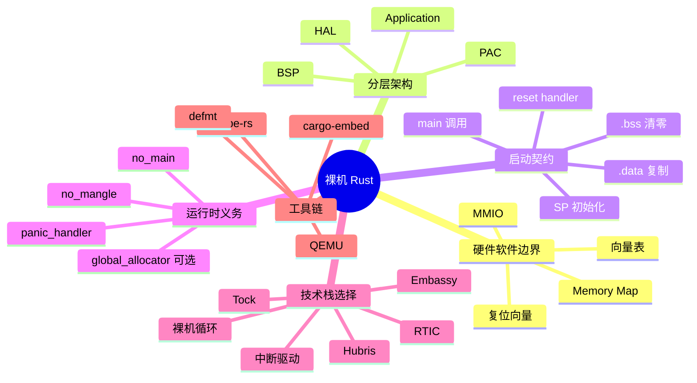
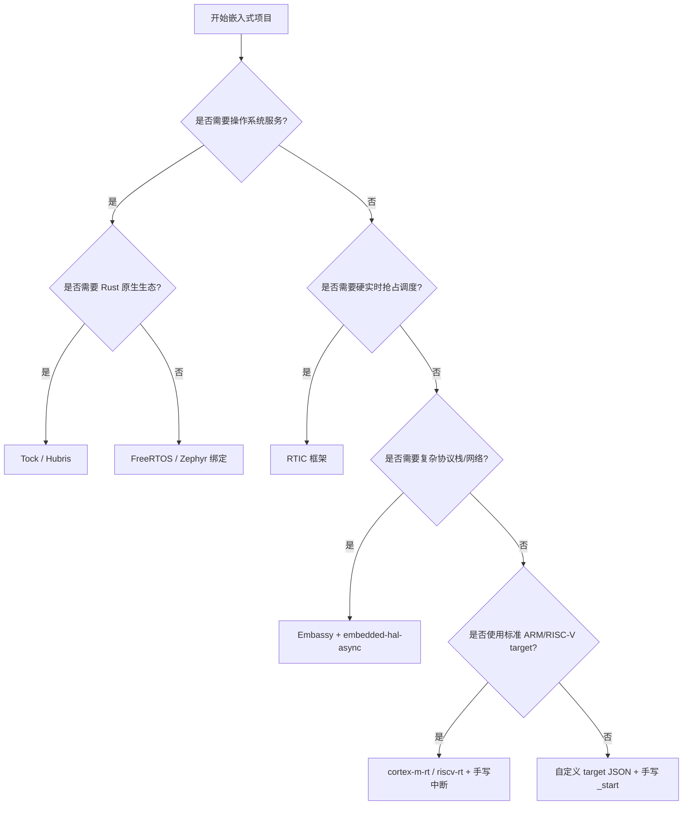

> **内容分级**: [专家级]
> **代码状态**: ⚠️ 裸机/目标平台相关代码标注 `rust,ignore`/`no_run`，host 平台无法直接编译；纯 `core`/`alloc` 示例可在 host 上编译检查
> **定理链**: N/A — 描述性/工程性文档
>
# 裸机 Rust
>
> **EN**: Bare-Metal Rust
> **Summary**: A systems-level canonical reference for bare-metal Rust: the hardware-software boundary, layered architecture from chip to application, reset-to-main boot contract, vector table and memory layout, no_std runtime obligations, and how to choose between bare-metal, RTOS, and OS-based stacks.
> **Rust 版本**: 1.97.0+ (Edition 2024)
>
> **受众**: [专家]
> **Bloom 层级**: L4
> **权威来源**: 本文件为 `concept/` 权威页。
> **A/S/P 标记**: **S+A+P** — Structure + Application + Procedure
> **双维定位**: P×Cre — 在硬件上直接构建可移植、可维护的 Rust 系统
> **前置概念**: [Rust 嵌入式系统开发](03_embedded_systems.md) · [no_std 与裸机 Rust](38_no_std_bare_metal_rust.md) · [交叉编译](02_cross_compilation.md) · [裸机启动与链接脚本](13_bare_metal_boot_linker_script.md) · [panic_handler 与 no_std 运行时](18_panic_runtime_no_std.md)
> **后置概念**: [no_std 启动流程与运行时深度解析](27_no_std_startup_runtime_deep_dive.md) · [嵌入式内存布局与堆安全](29_embedded_memory_layout_and_heap_safety.md) · [RTOS 与 Rust 调度模型对比](46_rtos_and_scheduling_in_rust.md) · [Embassy 异步框架深度解析](34_embassy_framework_deep_dive.md) · [RTIC 实时任务调度框架深度解析](35_rtic_framework_deep_dive.md)

---

> **来源**: [The Embedded Rust Book](https://docs.rust-embedded.org/book/) · [The Embedonomicon](https://docs.rust-embedded.org/embedonomicon/) · [rust-embedded WG](https://github.com/rust-embedded/wg) · [cortex-m-rt crate](https://docs.rs/cortex-m-rt/) · [riscv-rt crate](https://docs.rs/riscv-rt/) · [Tock OS Book](https://book.tockos.org/) · [Hubris OS](https://hubris.oxide.computer/) · [probe.rs](https://probe.rs/) · [Ferrous Systems — Knurling](https://knurling.ferrous-systems.com/) · [ARMv7-M Architecture Reference Manual](https://developer.arm.com/documentation/ddi0403/latest/) · [RISC-V Privileged Specification](https://riscv.org/technical/specifications/) · [The Rustonomicon](https://doc.rust-lang.org/nomicon/) · [Rust RFCs](https://rust-lang.github.io/rfcs/) · [Rust embedded/formalization research on arXiv](https://arxiv.org/abs/2304.00000)
>
> **横向对比**: [Rust vs Ada/SPARK](../../05_comparative/01_systems_languages/07_rust_vs_ada_spark.md) · [Rust vs C/C++](../../05_comparative/01_systems_languages/01_rust_vs_cpp.md) · [RTOS 与 Rust 调度模型对比](46_rtos_and_scheduling_in_rust.md)

---

## 🧠 知识结构图



## 📑 目录

- [裸机 Rust](#裸机-rust)
  - [🧠 知识结构图](#-知识结构图)
  - [📑 目录](#-目录)
  - [一、权威定义](#一权威定义)
  - [二、硬件-软件边界](#二硬件-软件边界)
    - [2.1 复位与向量表](#21-复位与向量表)
    - [2.2 Memory Map 与 MMIO](#22-memory-map-与-mmio)
  - [三、分层架构：从芯片到应用](#三分层架构从芯片到应用)
    - [3.1 PAC（外设访问 crate）](#31-pac外设访问-crate)
    - [3.2 HAL（硬件抽象层）](#32-hal硬件抽象层)
    - [3.3 BSP（板级支持包）](#33-bsp板级支持包)
    - [3.4 Application](#34-application)
  - [四、启动到 main 的契约](#四启动到-main-的契约)
    - [4.1 启动阶段](#41-启动阶段)
    - [4.2 链接脚本接口](#42-链接脚本接口)
  - [五、no\_std 运行时义务](#五no_std-运行时义务)
  - [六、裸机 vs RTOS vs OS](#六裸机-vs-rtos-vs-os)
  - [七、项目结构与构建系统](#七项目结构与构建系统)
  - [八、正例](#八正例)
    - [正例 1：纯 core 的可测试算法库](#正例-1纯-core-的可测试算法库)
    - [正例 2：使用 `MaybeUninit` 的 MMIO 安全封装](#正例-2使用-maybeuninit-的-mmio-安全封装)
    - [正例 3：panic handler 带诊断信息](#正例-3panic-handler-带诊断信息)
  - [九、反例与失效模式](#九反例与失效模式)
    - [反例 1：在裸机中使用 `println!`](#反例-1在裸机中使用-println)
    - [反例 2：binary 未提供 panic handler](#反例-2binary-未提供-panic-handler)
    - [反例 3：启动时未初始化 `.data`/`.bss` 就访问静态变量](#反例-3启动时未初始化-databss-就访问静态变量)
  - [十、决策树](#十决策树)
  - [十一、边界测试](#十一边界测试)
    - [11.1 边界测试：`no_std` 中误用 `std`](#111-边界测试no_std-中误用-std)
    - [11.2 边界测试：缺少 `panic_handler`](#112-边界测试缺少-panic_handler)
    - [11.3 边界测试：直接访问 `static mut`](#113-边界测试直接访问-static-mut)
  - [十二、国际化权威来源补充](#十二国际化权威来源补充)
  - [十三、相关概念](#十三相关概念)
  - [🧭 思维导图（Mindmap）](#-思维导图mindmap)

---

## 一、权威定义

> **The Embedded Rust Book**: Bare-metal programming means writing software that runs directly on the hardware without an operating system. In Rust this usually implies `#![no_std]`, a custom startup routine, and a panic handler.

**裸机（bare-metal）**：程序直接在处理器硬件上运行，没有操作系统负责加载、调度、虚拟内存、文件系统或网络栈。软件必须自己管理复位向量、中断、内存映射、外设初始化和 panic 行为。

**裸机 Rust**：使用 Rust 编写的裸机程序，通常由以下要素组成：

| 要素 | 说明 | 是否必需 |
|------|------|----------|
| `#![no_std]` | 不链接 std，禁用 std prelude | 是 |
| `#![no_main]` | 不生成默认 `fn main()` 入口 | 几乎总是 |
| `#[panic_handler]` | 自定义 panic 行为 | 是 |
| `#[global_allocator]` | 若使用 `alloc` 则必须 | 可选 |
| 启动运行时 | 提供 reset handler、向量表、`.data`/`.bss` 初始化 | 是 |
| 链接脚本 | 描述 Flash/RAM 物理布局 | 是 |
| HAL/PAC | 类型安全地访问外设 | 常见 |

判定依据：只要程序需要直接操作复位向量、内存映射寄存器或中断向量表，就属于裸机语义空间；`#![no_std]` 只是进入该空间的语言层声明。

---

## 二、硬件-软件边界

### 2.1 复位与向量表

处理器复位后，硬件从固定地址取初始栈指针（SP）和复位处理函数地址，然后跳转执行。以 ARM Cortex-M 为例：

```text
地址          内容
0x0000_0000   _stack_top      (Initial SP)
0x0000_0004   Reset_Handler   (Reset vector)
0x0000_0008   NMI_Handler
...           其他异常/中断向量
```

Rust 项目通常不手写向量表，而是由 `cortex-m-rt` 的 `#[entry]` 宏生成：

```rust,ignore
#![no_std]
#![no_main]

use cortex_m_rt::entry;
use core::panic::PanicInfo;

#[entry]
fn main() -> ! {
    loop {
        cortex_m::asm::wfi();
    }
}

#[panic_handler]
fn panic(_info: &PanicInfo) -> ! {
    loop {}
}
```

> **来源**: [cortex-m-rt docs](https://docs.rs/cortex-m-rt/) · [ARMv7-M Architecture Reference Manual](https://developer.arm.com/documentation/ddi0403/latest/)

### 2.2 Memory Map 与 MMIO

芯片数据手册定义物理地址空间。裸机代码通过内存映射 I/O（MMIO）读写外设寄存器：

```text
0x0000_0000 ─ 代码区（Flash alias）
0x0800_0000 ─ Flash
0x1FFF_0000 ─ System memory / bootloader
0x2000_0000 ─ SRAM
0x4000_0000 ─ Peripheral base
0xE000_0000 ─ Cortex-M internal peripherals
```

```rust,ignore
#![no_std]

const RCC_CR: *mut u32 = 0x4002_1000 as *mut u32;

pub unsafe fn enable_clock() {
    core::ptr::write_volatile(RCC_CR, core::ptr::read_volatile(RCC_CR) | 1);
}
```

类型安全的外设访问通常由 `svd2rust` 生成的 PAC 或手写 MMIO 封装提供。详见 [PAC 与 HAL 实现](17_pac_hal_implementation.md) 与 [Memory-Mapped Peripherals 与 Typestate 设计](25_memory_mapped_peripherals_and_typestate.md)。

---

## 三、分层架构：从芯片到应用

裸机 Rust 生态采用清晰的分层架构，隔离硬件细节与可移植应用逻辑。

```text
Application
    │
    ├── BSP (Board Support Package)  板级引脚/时钟初始化
    │
    ├── HAL (Hardware Abstraction Layer)  embedded-hal trait 实现
    │
    ├── PAC (Peripheral Access Crate)  寄存器级映射
    │
    └── Chip Hardware  真实外设/CPU/总线
```

### 3.1 PAC（外设访问 crate）

PAC 是芯片厂商寄存器描述的 Rust 绑定，通常由 `svd2rust` 从 CMSIS-SVD 文件生成。

```rust,ignore
#![no_std]

use stm32f4::stm32f407::Peripherals;

fn init() {
    let dp = Peripherals::take().unwrap();
    dp.RCC.ahb1enr.modify(|_, w| w.gpioaen().set_bit());
}
```

PAC 提供：

- 每个外设的独立模块（`GPIOA`、`RCC`、`USART1` 等）。
- 寄存器的读-修改-写封装。
- 中断标志位与使能位的类型安全访问。

### 3.2 HAL（硬件抽象层）

HAL 在 PAC 之上实现 `embedded-hal` trait，把寄存器操作封装为可移植 API。

```rust,ignore
#![no_std]

use stm32f4xx_hal::gpio::GpioExt;
use embedded_hal::digital::OutputPin;

fn blink(dp: stm32f4::stm32f407::Peripherals) {
    let gpioa = dp.GPIOA.split();
    let mut led = gpioa.pa5.into_push_pull_output();
    led.set_high().ok();
}
```

HAL 的价值：

- 驱动 crate 可面向 trait 编程，跨芯片复用。
- 类型状态引脚在编译期拒绝错误配置。
- 隐藏时钟使能、模式配置等芯片细节。

### 3.3 BSP（板级支持包）

BSP 针对具体开发板封装引脚定义、LED/按钮别名、时钟配置和初始化顺序。

```rust,ignore
#![no_std]

pub struct Board {
    pub led: LedPin,
    pub button: ButtonPin,
}

impl Board {
    pub fn init() -> Self {
        let dp = stm32f4::stm32f407::Peripherals::take().unwrap();
        let rcc = dp.RCC.constrain();
        let _clocks = rcc.cfgr.sysclk(84.MHz()).freeze();
        let gpioa = dp.GPIOA.split();
        Board {
            led: gpioa.pa5,
            button: gpioa.pa0,
        }
    }
}
```

### 3.4 Application

应用层只依赖 HAL trait 或 BSP 类型，不直接操作寄存器。它描述业务逻辑：传感器采样、控制算法、通信协议、状态机。

判定依据：分层的边界是“可移植性”。PAC 与具体芯片绑定；HAL 与芯片系列绑定；BSP 与具体板子绑定；Application  ideally 只与业务语义和 `embedded-hal` trait 绑定。

---

## 四、启动到 main 的契约

### 4.1 启动阶段

从复位到执行 `main`，启动运行时（如 `cortex-m-rt`）必须完成：

1. **设置 SP**：从向量表首项加载初始栈指针。
2. **复制 `.data`**：把 Flash 中的初值复制到 RAM。
3. **清零 `.bss`**：把未初始化全局变量置零。
4. **调用 `main`**：跳转至用户入口。

这些步骤的顺序错误会导致全局变量值随机、栈溢出或 HardFault。

### 4.2 链接脚本接口

链接脚本暴露一组符号，启动代码用它们定位段边界：

```ld
MEMORY
{
  FLASH (rx)  : ORIGIN = 0x0800_0000, LENGTH = 512K
  RAM   (rwx) : ORIGIN = 0x2000_0000, LENGTH = 128K
}

SECTIONS
{
  .text : {
    KEEP(*(.vector_table));
    *(.text*);
    *(.rodata*);
  } > FLASH

  .data : {
    _sdata = .;
    *(.data*);
    _edata = .;
  } > RAM AT> FLASH

  _sidata = LOADADDR(.data);

  .bss : {
    _sbss = .;
    *(.bss*);
    *(COMMON);
    _ebss = .;
  } > RAM

  _stack_top = ORIGIN(RAM) + LENGTH(RAM);
}
```

启动代码读取这些符号的地址：

```rust,ignore
#![no_std]

extern "C" {
    static mut _sidata: u8;
    static mut _sdata: u8;
    static mut _edata: u8;
    static mut _sbss: u8;
    static mut _ebss: u8;
}

pub unsafe fn init_data_bss() {
    let src = core::ptr::addr_of!(_sidata);
    let dst = core::ptr::addr_of_mut!(_sdata);
    let len = (core::ptr::addr_of!(_edata) as usize) - (core::ptr::addr_of!(_sdata) as usize);
    core::ptr::copy_nonoverlapping(src, dst, len);

    let bss = core::ptr::addr_of_mut!(_sbss);
    let bss_len = (core::ptr::addr_of!(_ebss) as usize) - (core::ptr::addr_of!(_sbss) as usize);
    core::ptr::write_bytes(bss, 0, bss_len);
}
```

> 更深入的启动流程分析见 [no_std 启动流程与运行时深度解析](27_no_std_startup_runtime_deep_dive.md) 与 [裸机启动与链接脚本](13_bare_metal_boot_linker_script.md)。

---

## 五、no_std 运行时义务

裸机 Rust 的运行时不是单一库，而是一组最小契约：

| 契约 | 属性/符号 | 说明 |
|------|-----------|------|
| `#[panic_handler]` | 函数 | panic 时永不返回 |
| `#[global_allocator]` | 静态 | 使用 `alloc` 时必需 |
| `#![no_main]` | crate | 禁用默认入口 |
| `#[unsafe(no_mangle)]` | 函数/静态 | 导出符号给链接器 |
| `#[unsafe(link_section = "...")]` | 项 | 控制段 placement |
| `panic = "abort"` | Cargo profile | 不展开栈，体积最小 |

最小可编译 `no_std` 库（host 可编译）：

```rust
#![no_std]

/// saturating 加法，适合传感器值合并。
pub fn add_sat(a: u16, b: u16) -> u16 {
    a.saturating_add(b)
}

#[cfg(test)]
mod tests {
    use super::*;

    #[test]
    fn saturation() {
        assert_eq!(add_sat(65534, 10), 65535);
    }
}
```

最小裸机 binary：

```rust,ignore
#![no_std]
#![no_main]

use core::panic::PanicInfo;

#[panic_handler]
fn panic(_info: &PanicInfo) -> ! {
    loop {}
}

#[unsafe(no_mangle)]
pub extern "C" fn main() -> ! {
    loop {}
}
```

---

## 六、裸机 vs RTOS vs OS

| 维度 | 裸机 | RTOS | OS（Linux/Windows） |
|------|------|------|---------------------|
| 调度 | 无 / 中断 / 手写协程 | 抢占式任务调度 | 进程/线程调度 |
| 内存 | 静态/链接脚本/可选堆 | 静态 + 任务栈/堆 | 虚拟内存、动态分配 |
| 抽象 | 寄存器/MMIO/HAL | 任务/信号量/队列 | 文件、网络、进程 |
| 延迟 | 最可控 | 可预测（需配置） | 不可预测 |
| 生态 | embedded-hal、probe-rs | RTIC、FreeRTOS 绑定 | std、tokio |
| 适用 | 简单/硬实时 | 多任务实时 | 复杂应用 |

裸机最适合：

- 外设简单、任务单一的固件。
- 对启动时间和中断延迟有严格要求的场景。
- 资源受限（< 64 KB RAM）的 MCU。

当需要多任务协作、复杂协议栈或网络时，再评估 RTIC、Embassy、FreeRTOS 或 Tock。

---

## 七、项目结构与构建系统

典型裸机 Rust 项目布局：

```text
my-bare-metal-app/
├── Cargo.toml
├── build.rs              # 链接脚本/编译期配置
├── memory.x              # RAM/Flash 布局
├── .cargo/
│   └── config.toml       # target、runner、build-std
└── src/
    └── main.rs
```

`.cargo/config.toml` 示例：

```toml
[build]
target = "thumbv7em-none-eabihf"

[unstable]
build-std = ["core", "alloc", "compiler_builtins"]
build-std-features = ["compiler-builtins-mem"]

[target.thumbv7em-none-eabihf]
runner = "probe-rs run --chip STM32F407VG"
rustflags = [
  "-C", "link-arg=-Tlink.x",
  "-C", "link-arg=-Tmemory.x",
]
```

`build.rs` 示例：

```rust,ignore
use std::env;
use std::fs::File;
use std::io::Write;
use std::path::PathBuf;

fn main() {
    let out = &PathBuf::from(env::var_os("OUT_DIR").unwrap());
    File::create(out.join("memory.x"))
        .unwrap()
        .write_all(include_bytes!("memory.x"))
        .unwrap();
    println!("cargo:rustc-link-search={}", out.display());
    println!("cargo:rustc-link-arg=-Tlink.x");
}
```

---

## 八、正例

### 正例 1：纯 core 的可测试算法库

```rust
#![no_std]

/// 一阶低通滤波器，可在 host 测试。
pub fn lpf(prev: f32, sample: f32, alpha: f32) -> f32 {
    prev + alpha * (sample - prev)
}

#[cfg(test)]
mod tests {
    use super::*;

    #[test]
    fn lpf_settles() {
        let y = lpf(0.0, 10.0, 0.5);
        assert!((y - 5.0).abs() < f32::EPSILON);
    }
}
```

### 正例 2：使用 `MaybeUninit` 的 MMIO 安全封装

```rust
#![no_std]

use core::mem::MaybeUninit;

pub struct MmioReg<T> {
    ptr: *mut T,
}

impl<T> MmioReg<T> {
    pub const unsafe fn new(addr: usize) -> Self {
        Self { ptr: addr as *mut T }
    }

    pub unsafe fn read(&self) -> T {
        core::ptr::read_volatile(self.ptr)
    }

    pub unsafe fn write(&mut self, value: T) {
        core::ptr::write_volatile(self.ptr, value);
    }
}
```

### 正例 3：panic handler 带诊断信息

```rust,ignore
#![no_std]

use core::panic::PanicInfo;

#[panic_handler]
fn panic(info: &PanicInfo) -> ! {
    if let Some(loc) = info.location() {
        // 开发阶段通过 semihosting/defmt 输出
        let _ = (loc.file(), loc.line());
    }
    loop {}
}
```

---

## 九、反例与失效模式

| 失效模式 | 根因 | 修复方向 |
|----------|------|----------|
| 上电 HardFault | 栈顶错误 / 向量表未对齐 / `.data`/`.bss` 未初始化 | 检查链接脚本与启动代码 |
| 全局变量值随机 | `.bss` 未清零 | 启动代码清零整个 `.bss` |
| 中断中访问共享数据崩溃 | 未使用临界区或原子类型 | `critical_section::with` / `AtomicXxx` |
| DMA 数据随机错 | 缓冲区在 CCM 或 cache 未同步 | 放到 DMA 可见 RAM 并清洗 cache |
| 链接错误 `undefined reference to rust_eh_personality` | 使用了 `panic = "unwind"` | 改用 `panic = "abort"` |
| 链接错误 `undefined reference to memcpy` | 缺少 `compiler-builtins-mem` | 配置 `build-std-features` |
| `Box::new` 死机 | 堆未初始化 | 先 `HEAP.init(...)` |

### 反例 1：在裸机中使用 `println!`

```rust,compile_fail
#![no_std]

fn log() {
    // ❌ 编译错误：no_std 中无 stdout
    println!("hello");
}
```

### 反例 2：binary 未提供 panic handler

```rust,compile_fail
#![no_std]

fn main() {
    panic!("boom");
}
```

### 反例 3：启动时未初始化 `.data`/`.bss` 就访问静态变量

```rust,ignore
#![no_std]

static mut COUNTER: u32 = 0;

#[unsafe(no_mangle)]
pub extern "C" fn main() -> ! {
    // ❌ 危险：若启动代码未清零 .bss，COUNTER 可能非零
    unsafe { COUNTER += 1; }
    loop {}
}
```

---

## 十、决策树



---

## 十一、边界测试

### 11.1 边界测试：`no_std` 中误用 `std`

```rust,compile_fail
#![no_std]

fn main() {
    let _v = std::vec::Vec::new();
}
```

### 11.2 边界测试：缺少 `panic_handler`

```rust,compile_fail
#![no_std]

fn main() {
    panic!("boom");
}
```

### 11.3 边界测试：直接访问 `static mut`

```rust,compile_fail
#![no_std]

static mut COUNTER: u32 = 0;

fn increment() {
    COUNTER += 1;
}
```

---

## 十二、国际化权威来源补充

| 主题 | 本页做法 | 权威来源依据 |
|------|----------|--------------|
| 裸机定义 | 无 OS、直接硬件 | The Embedded Rust Book |
| 向量表与启动 | cortex-m-rt 生成 | ARMv7-M Architecture Reference Manual |
| 分层架构 | PAC/HAL/BSP/Application | The Embedded Rust Book · rust-embedded WG |
| RTOS/OS 对比 | 调度/内存/延迟维度 | Tock Book · Hubris docs |
| 工具链 | probe-rs + defmt | Knurling · probe.rs |

---

## 十三、相关概念

- [no_std 与裸机 Rust](38_no_std_bare_metal_rust.md)
- [no_std 与裸机惯用法](23_no_std_and_bare_metal_idioms.md)
- [裸机启动与链接脚本](13_bare_metal_boot_linker_script.md)
- [no_std 启动流程与运行时深度解析](27_no_std_startup_runtime_deep_dive.md)
- [panic_handler 与 no_std 运行时](18_panic_runtime_no_std.md)
- [PAC 与 HAL 实现](17_pac_hal_implementation.md)
- [RTOS 与 Rust 调度模型对比](46_rtos_and_scheduling_in_rust.md)
- [Embassy 异步框架深度解析](34_embassy_framework_deep_dive.md)
- [RTIC 实时任务调度框架深度解析](35_rtic_framework_deep_dive.md)
- [嵌入式内存布局与堆安全](29_embedded_memory_layout_and_heap_safety.md)

---

> **权威来源**: [The Embedded Rust Book](https://docs.rust-embedded.org/book/) · [The Embedonomicon](https://docs.rust-embedded.org/embedonomicon/) · [rust-embedded WG](https://github.com/rust-embedded/wg) · [cortex-m-rt](https://docs.rs/cortex-m-rt/) · [riscv-rt](https://docs.rs/riscv-rt/) · [Tock OS Book](https://book.tockos.org/) · [Hubris OS](https://hubris.oxide.computer/) · [probe.rs](https://probe.rs/) · [Knurling](https://knurling.ferrous-systems.com/)
>
> **权威来源对齐变更日志**: 2026-08-04 创建

**文档版本**: 1.0
**最后更新**: 2026-08-04
**状态**: ✅ 概念文件创建完成

---

## 🧭 思维导图（Mindmap）


> **认知功能**: 本 mindmap 从硬件-软件边界、分层架构、启动契约、运行时义务、技术栈选择与工具链六个维度组织内容，可作为裸机 Rust 系统设计的快速导航索引。
