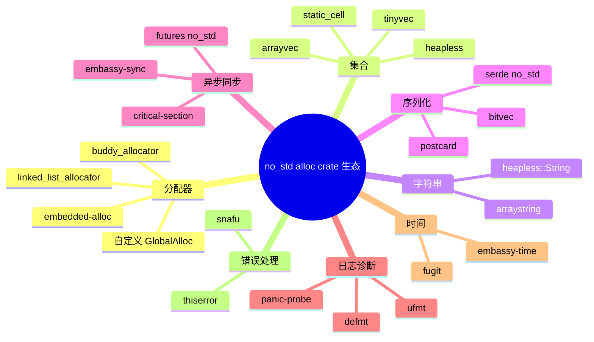
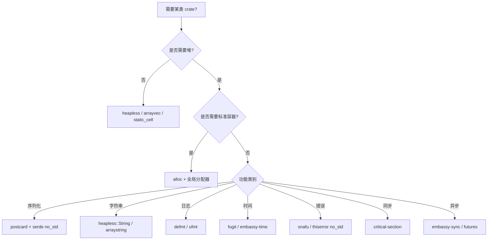

> **内容分级**: [专家级]
> **代码状态**: ✅ 纯 `core`/`alloc` 示例可在 host 编译；依赖具体 crate 的示例标注 `rust,ignore`
> **定理链**: N/A — 描述性/工程性文档
>
# no_std alloc crate 生态
>
> **EN**: The no_std + alloc Crate Ecosystem
> **Summary**: A canonical survey of the Rust crate ecosystem for `#![no_std]` environments that use `alloc`: allocators, collections, strings, serialization, async/sync, logging, time, and error-handling crates, with selection criteria and compatibility checks.
> **Rust 版本**: 1.97.1+ (Edition 2024)
>
> **受众**: [专家]
> **Bloom 层级**: L4
> **权威来源**: 本文件为 `concept/` 权威页。
> **A/S/P 标记**: **S+A** — Structure + Application
> **双维定位**: P×Eva — 在 no_std + alloc 约束下选择并组合合适的 crate
> **前置概念**: [no_std 与裸机 Rust](38_no_std_bare_metal_rust.md) · [嵌入式内存分配器](16_embedded_memory_allocators.md) · [失败可恢复分配与 no_alloc 集合](37_fallible_allocation_and_no_alloc_collections.md) · [Cargo build-std](../01_cargo/22_build_std.md)
> **后置概念**: [Embassy 异步框架深度解析](34_embassy_framework_deep_dive.md) · [嵌入式协议与外设驱动](22_embedded_protocol_drivers.md) · [安全关键型裸机/OS](19_safety_critical_bare_metal_os.md) · [Rust vs C/C++](../../05_comparative/01_systems_languages/01_rust_vs_cpp.md) · [Rust vs Zig](../../05_comparative/01_systems_languages/06_rust_vs_zig.md)

---

> **来源**: [The Embedded Rust Book](https://docs.rust-embedded.org/book/) · [The Embedonomicon](https://docs.rust-embedded.org/embedonomicon/) · [crates.io](https://crates.io/) · [docs.rs/embedded-alloc](https://docs.rs/embedded-alloc/) · [docs.rs/heapless](https://docs.rs/heapless/) · [docs.rs/arrayvec](https://docs.rs/arrayvec/) · [docs.rs/static_cell](https://docs.rs/static_cell/) · [docs.rs/postcard](https://docs.rs/postcard/) · [docs.rs/serde](https://docs.rs/serde/) · [docs.rs/defmt](https://docs.rs/defmt/) · [docs.rs/fugit](https://docs.rs/fugit/) · [docs.rs/snafu](https://docs.rs/snafu/) · [docs.rs/thiserror](https://docs.rs/thiserror/) · [docs.rs/critical-section](https://docs.rs/critical-section/) · [docs.rs/embassy-sync](https://docs.rs/embassy-sync/) · [The Rust core library](https://doc.rust-lang.org/core/) · [The Rust alloc library](https://doc.rust-lang.org/alloc/) · [Rust no_std/embedded research on arXiv](https://arxiv.org/abs/2304.00000) · [docs.rs/alloc-cortex-m](https://docs.rs/alloc-cortex-m/)
>
> **横向对比**: [Rust vs C/C++](../../05_comparative/01_systems_languages/01_rust_vs_cpp.md) · [Rust vs Zig](../../05_comparative/01_systems_languages/06_rust_vs_zig.md)

---

## 🧠 知识结构图



## 📑 目录

- [no\_std alloc crate 生态](#no_std-alloc-crate-生态)
  - [🧠 知识结构图](#-知识结构图)
  - [📑 目录](#-目录)
  - [一、权威定义](#一权威定义)
  - [二、启用 `alloc` 的最小配置](#二启用-alloc-的最小配置)
  - [三、分配器生态](#三分配器生态)
  - [四、集合生态](#四集合生态)
    - [4.1 无堆集合](#41-无堆集合)
    - [4.2 依赖 `alloc` 的集合](#42-依赖-alloc-的集合)
  - [五、字符串处理](#五字符串处理)
  - [六、序列化与压缩](#六序列化与压缩)
  - [七、异步与同步原语](#七异步与同步原语)
    - [7.1 异步](#71-异步)
    - [7.2 同步](#72-同步)
  - [八、日志与诊断](#八日志与诊断)
  - [九、时间抽象](#九时间抽象)
  - [十、错误处理](#十错误处理)
  - [十一、crate 兼容性检查清单](#十一crate-兼容性检查清单)
  - [十二、正例](#十二正例)
    - [正例 1：使用 `alloc` 的标准集合](#正例-1使用-alloc-的标准集合)
    - [正例 2：混合 `heapless` 与 `alloc`](#正例-2混合-heapless-与-alloc)
    - [正例 3：自定义错误类型](#正例-3自定义错误类型)
  - [十三、反例与失效模式](#十三反例与失效模式)
    - [反例 1：未关闭 `std` feature](#反例-1未关闭-std-feature)
    - [反例 2：中断中使用 `alloc`](#反例-2中断中使用-alloc)
  - [十四、决策树](#十四决策树)
  - [十五、相关概念](#十五相关概念)
  - [🧭 思维导图（Mindmap）](#-思维导图mindmap)

---

## 一、权威定义

> **The Embedonomicon**: `#![no_std]` only removes `std` from the prelude; `core` and `alloc` remain available. `alloc` requires a global allocator, which is the primary extension point for no_std programs that need heap-allocated data structures.

**`no_std + alloc`**：禁用标准库但启用堆分配子库的 Rust 程序。它保留 `Vec`、`Box`、`String`、`HashMap` 等类型，但需要用户提供一个实现 `GlobalAlloc` 的全局分配器。

**crate 生态选择原则**：

1. 确认 crate 明确声明 `no_std` 支持（`Cargo.toml` 中常通过 `default-features = false` 关闭 `std`）。
2. 区分 `no_std` 与 `no_std + alloc`：部分 crate 需要 `alloc`，部分完全无堆。
3. 关注 `std` feature 的默认开启状态；关闭后检查剩余依赖是否也支持 `no_std`。
4. 在资源受限场景下，优先评估无堆（no_alloc）方案是否足够。

判定依据：一个 crate 是否适合 `no_std + alloc`，取决于它的 `Cargo.toml` feature 设计、传递依赖树，以及是否依赖 `std::` 中不可用的 API。

---

## 二、启用 `alloc` 的最小配置

要在 `#![no_std]` 中使用 `alloc`，需要：

1. `extern crate alloc;`
2. 一个 `#[global_allocator]` 实例
3. 构建配置 `build-std = ["core", "alloc", "compiler_builtins"]`

```rust
#![no_std]
extern crate alloc;

use alloc::vec::Vec;

pub fn buffer() -> Vec<u8> {
    let mut v = Vec::new();
    v.push(1);
    v.push(2);
    v
}
```

```toml
# Cargo.toml
[dependencies]

[profile.release]
panic = "abort"
```

```toml
# .cargo/config.toml
[unstable]
build-std = ["core", "alloc", "compiler_builtins"]
build-std-features = ["compiler-builtins-mem"]

[build]
target = "thumbv7em-none-eabihf"
```

> 分配器实现与选择详见 [嵌入式内存分配器](16_embedded_memory_allocators.md)。

---

## 三、分配器生态

| crate | 算法 | 是否需要 `alloc` feature | 特点 |
|-------|------|--------------------------|------|
| `embedded-alloc` | TLSF | 自身即分配器 | O(1) WCET，硬实时首选 |
| `linked_list_allocator` | 空闲链表 | 自身即分配器 | 简单，碎片较多 |
| `buddy-alloc` | Buddy | 自身即分配器 | 2 的幂次块，内部碎片大 |
| `good_memory_allocator` | TLSF-like | 自身即分配器 | 通用 Rust 编写 |

示例：`embedded-alloc` 初始化：

```rust,ignore
#![no_std]
extern crate alloc;

use embedded_alloc::TlsfHeap;

#[global_allocator]
static HEAP: TlsfHeap = TlsfHeap::empty();

fn init_heap() {
    extern "C" {
        static mut _heap_start: u8;
        static mut _heap_end: u8;
    }
    unsafe {
        let start = core::ptr::addr_of_mut!(_heap_start);
        let end = core::ptr::addr_of!(_heap_end);
        HEAP.init(start, end as usize - start as usize);
    }
}
```

> 更详细的分配器对比见 [嵌入式内存分配器](16_embedded_memory_allocators.md)。

---

## 四、集合生态

### 4.1 无堆集合

适合完全不需要 `alloc` 的场景：

| crate | 类型 | 说明 |
|-------|------|------|
| `heapless` | `Vec<T, N>`、`String<N>`、`IndexMap<K, V, N>`、`Pool<T>` | 嵌入式生态最常用 |
| `arrayvec` | `ArrayVec<T, CAP>` | 栈/静态数组向量 |
| `tinyvec` | `ArrayVec<[T; N]>` | 纯 safe Rust |
| `static_cell` | `StaticCell<T>` | 编译期静态内存，运行时唯一借用 |

```rust,ignore
use heapless::Vec;

fn collect_samples(samples: &[u8], buf: &mut Vec<u8, 64>) {
    for &s in samples.iter().take(64) {
        let _ = buf.push(s);
    }
}
```

> 无堆集合与失败可恢复分配详见 [失败可恢复分配与 no_alloc 集合](37_fallible_allocation_and_no_alloc_collections.md)。

### 4.2 依赖 `alloc` 的集合

| crate | 类型 | 说明 |
|-------|------|------|
| `alloc` | `Vec`、`Box`、`String`、`HashMap`、`BTreeMap` | Rust 官方 |
| `hashbrown` | `HashMap` | 需关闭 `std` feature |
| `indexmap` | `IndexMap` | 需 `alloc` |

```rust
#![no_std]
extern crate alloc;

use alloc::collections::BTreeMap;

pub fn map_insert() {
    let mut m = BTreeMap::new();
    m.insert(1, "one");
}
```

---

## 五、字符串处理

`no_std` 下没有 `std::string::String`，但可选用：

| 方案 | 类型 | 是否需要堆 |
|------|------|------------|
| `heapless::String<N>` | 固定容量 | 否 |
| `arraystring::ArrayString` | 固定容量 | 否 |
| `alloc::string::String` | 动态容量 | 是 |

```rust
#![no_std]

use heapless::String;

pub fn format_id(id: u32) -> String<16> {
    let mut s = String::new();
    let _ = core::write!(s, "id:{}", id);
    s
}
```

> 注意：`core::write!` 需要目标类型实现 `core::fmt::Write`；`heapless::String` 已实现该 trait。

---

## 六、序列化与压缩

| crate | 依赖 | 说明 |
|-------|------|------|
| `serde` | `default-features = false` 后 `no_std` | 框架 |
| `postcard` | `no_std` + `alloc` 可选 | 专为嵌入式设计的小体积二进制序列化 |
| `bitvec` | `no_std` | 位级操作 |
| `cobs` | `no_std` | 一致覆盖字节流编码 |

```rust,ignore
#![no_std]
extern crate alloc;

use postcard::to_allocvec;
use serde::Serialize;

#[derive(Serialize)]
struct SensorReading {
    id: u16,
    value: i32,
}

pub fn serialize(r: &SensorReading) -> alloc::vec::Vec<u8> {
    to_allocvec(r).unwrap()
}
```

判定依据：`postcard` 是嵌入式 Rust 中最常用的二进制序列化方案，因为它不依赖 `std`、体积可控、且与 `serde` 生态兼容。

---

## 七、异步与同步原语

### 7.1 异步

| crate | 依赖 | 说明 |
|-------|------|------|
| `embassy-sync` | `no_std` + `alloc` 可选 | async 信号量、队列、互斥锁 |
| `futures` | `default-features = false` | 基础 Future 工具 |
| `embassy-executor` | `no_std` | async 执行器 |

```rust,ignore
use embassy_sync::blocking_mutex::raw::CriticalSectionRawMutex;
use embassy_sync::mutex::Mutex;

static VALUE: Mutex<CriticalSectionRawMutex, u32> = Mutex::new(0);

async fn increment() {
    let mut v = VALUE.lock().await;
    *v += 1;
}
```

### 7.2 同步

| crate | 说明 |
|-------|------|
| `critical-section` | 临界区抽象，多后端 |
| `portable-atomic` | 无原生原子目标的原子操作 |

```rust,ignore
use critical_section::with;
use core::cell::RefCell;

static COUNTER: critical_section::Mutex<RefCell<u32>> =
    critical_section::Mutex::new(RefCell::new(0));

fn increment() {
    with(|cs| {
        *COUNTER.borrow(cs).borrow_mut() += 1;
    });
}
```

---

## 八、日志与诊断

| crate | 是否需要 host 端解析 | 说明 |
|-------|----------------------|------|
| `defmt` | 是 | 延迟格式化，体积极小 |
| `ufmt` | 否 | 轻量级 `core::fmt` 替代 |
| `rtt-target` | 否 | RTT 输出 |
| `panic-probe` | 是（defmt 模式） | panic 时输出 defmt 信息 |
| `panic-halt` | 否 | 最小 panic handler |

```rust,ignore
#![no_std]

use defmt::info;

#[defmt::timestamp]
fn timestamp() -> u64 {
    0
}

pub fn log_boot() {
    info!("booting");
}
```

---

## 九、时间抽象

| crate | 说明 |
|-------|------|
| `fugit` | 无堆、无浮点的时长/频率类型 |
| `embassy-time` | async 等待与定时器抽象 |
| `rtic-monotonics` | RTIC 框架的单调时钟 |

```rust,ignore
use fugit::MillisDurationU32;

pub const PERIOD: MillisDurationU32 = MillisDurationU32::millis(100);
```

---

## 十、错误处理

| crate | `no_std` 支持 | 说明 |
|-------|---------------|------|
| `snafu` | `default-features = false` | 上下文错误 |
| `thiserror` | `no-std` feature | derive `Error`（无 `std`） |
| `derive_more` | `no_std` | 减少样板代码 |

```rust
#![no_std]

#[derive(Debug)]
pub enum SensorError {
    Timeout,
    Checksum,
}

pub fn read() -> Result<u16, SensorError> {
    Err(SensorError::Timeout)
}
```

> 在 `no_std` 中无法使用 `std::error::Error`，但 `core::fmt::Debug` 和 `core::fmt::Display` 仍可用。`snafu`/`thiserror` 可提供 no_std 兼容的 derive。

---

## 十一、crate 兼容性检查清单

引入新 crate 到 `no_std + alloc` 项目前，按以下顺序检查：

1. `Cargo.toml` 是否声明 `no_std` 或提供 `std` feature。
2. 关闭默认 feature 后是否仍能通过 `cargo check --target thumbv7em-none-eabihf`。
3. 传递依赖是否全部支持 `no_std`。
4. 是否依赖 `std::fs`、`std::net`、`std::thread` 等不可用的 API。
5. 是否依赖 `std::collections::HashMap` 默认随机种子（可改用 `hashbrown` 或 `heapless::IndexMap`）。
6. 是否使用 `std::time`（可改用 `fugit` 或 `embassy-time`）。
7. 是否使用 `std::error::Error`（可改用 `core::fmt::Display` 或 `snafu`）。

---

## 十二、正例

### 正例 1：使用 `alloc` 的标准集合

```rust
#![no_std]
extern crate alloc;

use alloc::vec::Vec;

pub fn moving_average(samples: &[u16], window: usize) -> Vec<u16> {
    samples
        .windows(window)
        .map(|w| w.iter().sum::<u16>() / window as u16)
        .collect()
}
```

### 正例 2：混合 `heapless` 与 `alloc`

```rust,ignore
#![no_std]
extern crate alloc;

use alloc::vec::Vec;
use heapless::String;

pub fn format_and_send(id: u32, payload: &[u8]) -> Vec<u8> {
    let mut header: String<32> = String::new();
    let _ = core::write!(header, "ID:{}", id);
    let mut out = Vec::new();
    out.extend_from_slice(header.as_bytes());
    out.extend_from_slice(payload);
    out
}
```

### 正例 3：自定义错误类型

```rust
#![no_std]

#[derive(Debug, Clone, Copy)]
pub enum BusError {
    Timeout,
    Nack,
}

pub fn transfer() -> Result<(), BusError> {
    Ok(())
}
```

---

## 十三、反例与失效模式

| 失效模式 | 根因 | 修复方向 |
|----------|------|----------|
| crate 引入后链接到 std | 未关闭 `std` feature | `default-features = false` |
| `HashMap` 不可用 | `alloc` 无默认 hasher | 使用 `hashbrown` 或 `heapless::IndexMap` |
| `Box::new` 死机 | 堆未初始化 | 先 `HEAP.init(...)` |
| 中断中 `Vec::push` | 分配器不可重入 | 用 `heapless::Vec` 或静态缓冲区 |
| `println!` 编译错误 | 无 stdout | 用 `defmt` 或 `ufmt` |
| `std::time::Instant` 不可用 | 无 OS 时间源 | 用 `fugit` + HAL 定时器 |

### 反例 1：未关闭 `std` feature

```toml,ignore
[dependencies]
# ❌ 错误：默认 feature 可能包含 std
some-crate = "1.0"
```

### 反例 2：中断中使用 `alloc`

```rust,ignore
#![no_std]
extern crate alloc;
use alloc::vec::Vec;

#[cortex_m_rt::interrupt]
fn TIM2() {
    let mut v = Vec::new();
    v.push(read_sensor());
}
```

---

## 十四、决策树



---

## 十五、相关概念

- [no_std 与裸机 Rust](38_no_std_bare_metal_rust.md)
- [嵌入式内存分配器](16_embedded_memory_allocators.md)
- [失败可恢复分配与 no_alloc 集合](37_fallible_allocation_and_no_alloc_collections.md)
- [Cargo build-std](../01_cargo/22_build_std.md)
- [Embassy 异步框架深度解析](34_embassy_framework_deep_dive.md)
- [嵌入式协议与外设驱动](22_embedded_protocol_drivers.md)
- [安全关键型裸机/OS](19_safety_critical_bare_metal_os.md)
- [Rust vs C/C++](../../05_comparative/01_systems_languages/01_rust_vs_cpp.md)
- [Rust vs Zig](../../05_comparative/01_systems_languages/06_rust_vs_zig.md)

---

> **权威来源**: [The Embedded Rust Book](https://docs.rust-embedded.org/book/) · [The Embedonomicon](https://docs.rust-embedded.org/embedonomicon/) · [crates.io](https://crates.io/) · [docs.rs/embedded-alloc](https://docs.rs/embedded-alloc/) · [docs.rs/heapless](https://docs.rs/heapless/) · [docs.rs/arrayvec](https://docs.rs/arrayvec/) · [docs.rs/static_cell](https://docs.rs/static_cell/) · [docs.rs/postcard](https://docs.rs/postcard/) · [docs.rs/serde](https://docs.rs/serde/) · [docs.rs/defmt](https://docs.rs/defmt/) · [docs.rs/fugit](https://docs.rs/fugit/) · [docs.rs/snafu](https://docs.rs/snafu/) · [docs.rs/thiserror](https://docs.rs/thiserror/) · [docs.rs/critical-section](https://docs.rs/critical-section/) · [docs.rs/embassy-sync](https://docs.rs/embassy-sync/)
>
> **横向对比**: [Rust vs C/C++](../../05_comparative/01_systems_languages/01_rust_vs_cpp.md) · [Rust vs Zig](../../05_comparative/01_systems_languages/06_rust_vs_zig.md)
>
> **权威来源对齐变更日志**: 2026-08-04 创建

**文档版本**: 1.0
**最后更新**: 2026-08-04
**状态**: ✅ 概念文件创建完成

---

## 🧭 思维导图（Mindmap）


> **认知功能**: 本 mindmap 按 crate 功能类别组织，帮助读者在需要某类能力时快速定位 no_std + alloc 兼容的候选 crate。
