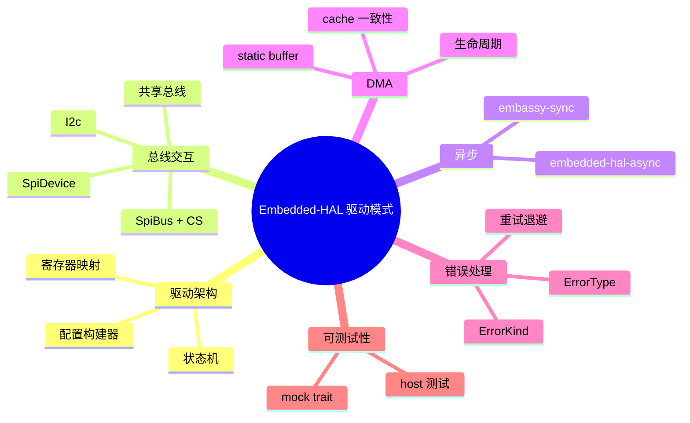
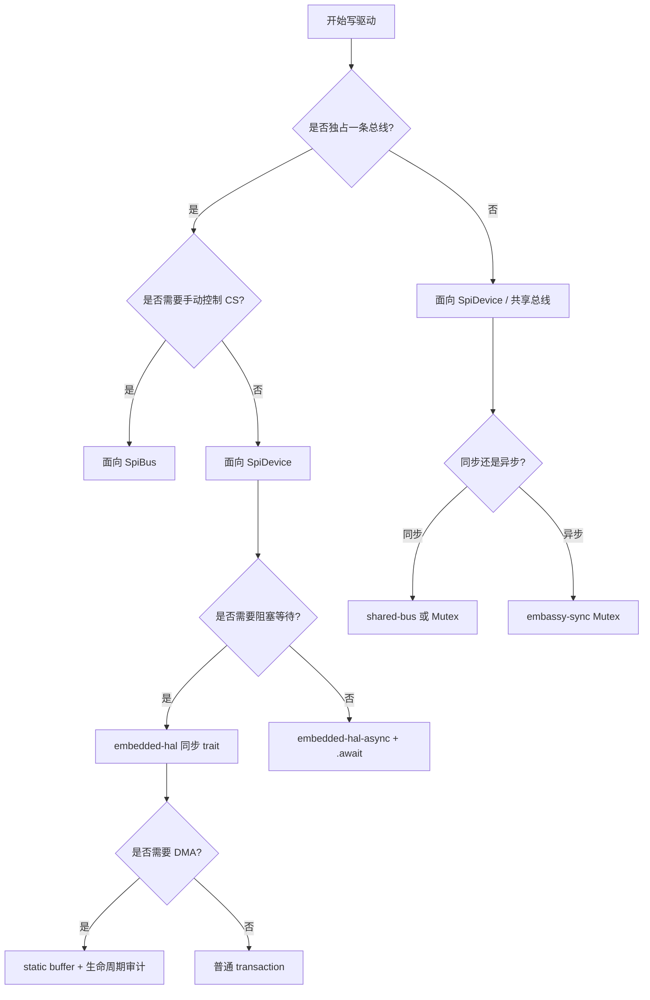

> **内容分级**: [专家级]
> **代码状态**: ✅ 纯 Rust 设计模式示例可在 host 编译；依赖 `embedded-hal` 具体 trait 的示例标注 `rust,ignore`
> **定理链**: N/A — 描述性/工程性文档
>
# Embedded-HAL 驱动模式
>
> **EN**: Embedded-HAL Driver Patterns
> **Summary**: Design patterns for writing portable, type-safe device drivers on top of `embedded-hal` 1.0: state-machine drivers, register-map modeling, SPI/I2C transaction composition, bus ownership, shared-bus integration, async patterns, DMA lifecycle, error design, and testable mocks.
> **Rust 版本**: 1.97.0+ (Edition 2024)
>
> **受众**: [专家]
> **Bloom 层级**: L5
> **权威来源**: 本文件为 `concept/` 权威页。
> **A/S/P 标记**: **S+A+P** — Structure + Application + Procedure
> **双维定位**: P×Eva/Cre — 编写可移植、可测试、可组合的嵌入式设备驱动
> **前置概念**: [embedded-hal 与驱动惯用法](24_embedded_hal_and_driver_idioms.md) · [PAC 与 HAL 实现](17_pac_hal_implementation.md) · [Memory-Mapped Peripherals 与 Typestate 设计](25_memory_mapped_peripherals_and_typestate.md) · [no_std 与裸机惯用法](23_no_std_and_bare_metal_idioms.md)
> **后置概念**: [嵌入式协议与外设驱动](22_embedded_protocol_drivers.md) · [异步 no_std 嵌入式](11_async_no_std_embedded.md) · [嵌入式测试与 CI 策略](32_embedded_testing_and_ci_strategies.md) · [安全关键嵌入式 Rust 指南](30_misra_rust_safety_critical_guidelines.md) · [Rust vs C/C++](../../05_comparative/01_systems_languages/01_rust_vs_cpp.md) · [Rust vs Ada/SPARK](../../05_comparative/01_systems_languages/07_rust_vs_ada_spark.md)

---

> **来源**: [embedded-hal 1.0](https://docs.rs/embedded-hal/1.0.0/embedded_hal/) · [embedded-hal-async](https://docs.rs/embedded-hal-async/latest/embedded_hal_async/) · [embedded-io](https://docs.rs/embedded-io/latest/embedded_io/) · [shared-bus](https://docs.rs/shared-bus/) · [embassy-embedded-hal](https://docs.rs/embassy-embedded-hal/) · [defmt](https://docs.rs/defmt/) · [The Embedded Rust Book](https://docs.rust-embedded.org/book/) · [Embassy Book](https://embassy.dev/book/) · [Knurling](https://knurling.ferrous-systems.com/) · [Ferrous Systems](https://ferrous-systems.com/)
>
> **横向对比**: [Rust vs C/C++](../../05_comparative/01_systems_languages/01_rust_vs_cpp.md) · [Rust vs Ada/SPARK](../../05_comparative/01_systems_languages/07_rust_vs_ada_spark.md)

---

## 🧠 知识结构图



## 📑 目录

- [Embedded-HAL 驱动模式](#embedded-hal-驱动模式)
  - [🧠 知识结构图](#-知识结构图)
  - [📑 目录](#-目录)
  - [一、权威定义](#一权威定义)
  - [二、驱动 crate 的边界](#二驱动-crate-的边界)
  - [三、状态机驱动模式](#三状态机驱动模式)
  - [四、寄存器映射建模](#四寄存器映射建模)
  - [五、总线事务组合](#五总线事务组合)
    - [5.1 `SpiDevice` 事务](#51-spidevice-事务)
    - [5.2 `I2c` 读写](#52-i2c-读写)
  - [六、总线所有权与共享](#六总线所有权与共享)
  - [七、异步驱动模式](#七异步驱动模式)
  - [八、DMA 缓冲区生命周期](#八dma-缓冲区生命周期)
  - [九、错误类型设计](#九错误类型设计)
  - [十、可测试性：Mock Trait](#十可测试性mock-trait)
  - [十一、完整示例：温湿度传感器驱动](#十一完整示例温湿度传感器驱动)
  - [十二、常见驱动反模式](#十二常见驱动反模式)
  - [十三、决策树](#十三决策树)
  - [十四、相关概念](#十四相关概念)
  - [🧭 思维导图（Mindmap）](#-思维导图mindmap)

---

## 一、权威定义

> **embedded-hal**: A driver crate only depends on `embedded-hal` traits; it does not know which MCU is underneath. This allows the same driver to be used on many platforms.

**驱动 crate（driver crate）**：只依赖 `embedded-hal`（或 `embedded-hal-async`）trait 的设备逻辑 crate。它把特定外设（传感器、显示器、存储器、收发器）的协议细节封装起来，向上暴露与硬件无关的 API。

**驱动模式**：在 trait 契约约束下，组织设备状态、寄存器访问、总线事务、错误处理和测试接口的重复出现的解决方案。

判定依据：一个 crate 是否是“好”的 embedded-hal 驱动，取决于它是否：

1. 只依赖 `embedded-hal` trait，不依赖具体 HAL。
2. 在事务边界上正确管理片选/地址/起始停止条件。
3. 暴露可组合、可测试的接口。
4. 提供清晰的错误类型并映射到 `ErrorKind`。

---

## 二、驱动 crate 的边界

```text
┌─────────────────────────────────────┐
│           Application               │
├─────────────────────────────────────┤
│   Driver crate (this page)          │  ← 面向 embedded-hal trait
├─────────────────────────────────────┤
│   HAL crate (stm32f4xx-hal, etc.)   │  ← 实现 embedded-hal trait
├─────────────────────────────────────┤
│   PAC / chip hardware               │
└─────────────────────────────────────┘
```

驱动 crate 不应：

- 直接操作寄存器地址。
- 假设具体芯片的时钟配置。
- 使用 `std` API。
- 在驱动内部创建全局状态或静态变量。

---

## 三、状态机驱动模式

许多外设需要按协议顺序发送命令、等待、读取结果。状态机模式把这一顺序编码到类型中。

```rust
#![no_std]

pub struct Uninitialized;
pub struct Idle;
pub struct Measuring;

pub struct Sensor<STATE> {
    _state: core::marker::PhantomData<STATE>,
}

impl Sensor<Uninitialized> {
    pub fn new() -> Self {
        Self { _state: core::marker::PhantomData }
    }

    pub fn init(self) -> Sensor<Idle> {
        Sensor { _state: core::marker::PhantomData }
    }
}

impl Sensor<Idle> {
    pub fn start_measurement(self) -> Sensor<Measuring> {
        Sensor { _state: core::marker::PhantomData }
    }
}

impl Sensor<Measuring> {
    pub fn read(self) -> (Sensor<Idle>, i16) {
        (Sensor { _state: core::marker::PhantomData }, 42)
    }
}
```

判定依据：状态机模式在编译期禁止非法调用顺序（如未初始化就读取），适合协议顺序严格、错误代价高的传感器和射频模块。

---

## 四、寄存器映射建模

对于通过 SPI/I2C 访问寄存器的外设，可用 `bitfield` 或手动位运算建模寄存器。

```rust
#![no_std]

pub struct ConfigReg(pub u8);

impl ConfigReg {
    pub const MASK_ENABLE: u8 = 0b0000_0001;
    pub const MASK_MODE: u8 = 0b0000_0110;
    pub const SHIFT_MODE: u8 = 1;

    pub fn enable(&mut self) {
        self.0 |= Self::MASK_ENABLE;
    }

    pub fn set_mode(&mut self, mode: u8) {
        self.0 = (self.0 & !Self::MASK_MODE) | ((mode << Self::SHIFT_MODE) & Self::MASK_MODE);
    }

    pub fn raw(&self) -> u8 {
        self.0
    }
}
```

更复杂的寄存器可使用 `bitfield` crate 或 `modular-bitfield`，但需确认其 `no_std` 支持。

---

## 五、总线事务组合

### 5.1 `SpiDevice` 事务

面向 `SpiDevice` 写驱动时，整个命令+读取保持在一次 transaction 内，CS 由 HAL 自动管理。

```rust,ignore
use embedded_hal::spi::{SpiDevice, Operation};

const CMD_READ_ID: u8 = 0x9F;

#[derive(Debug)]
pub enum Error<E> {
    Bus(E),
}

pub struct FlashStorage<DEV> {
    dev: DEV,
}

impl<DEV, E> FlashStorage<DEV>
where
    DEV: SpiDevice<Error = E>,
{
    pub fn new(dev: DEV) -> Self {
        Self { dev }
    }

    pub fn read_jedec_id(&mut self) -> Result<[u8; 3], Error<E>> {
        let mut id = [0u8; 3];
        self.dev
            .transaction(&mut [
                Operation::Write(&[CMD_READ_ID]),
                Operation::Read(&mut id),
            ])
            .map_err(Error::Bus)?;
        Ok(id)
    }
}
```

### 5.2 `I2c` 读写

I2C 驱动通常使用 `write_read` 完成“写寄存器地址 + 读数据”的原子操作。

```rust,ignore
use embedded_hal::i2c::I2c;

const ADDR: u8 = 0x50;

pub struct Eeprom<I2C> {
    i2c: I2C,
}

impl<I2C, E> Eeprom<I2C>
where
    I2C: I2c<Error = E>,
{
    pub fn new(i2c: I2C) -> Self {
        Self { i2c }
    }

    pub fn read(&mut self, mem_addr: u16, buf: &mut [u8]) -> Result<(), E> {
        self.i2c.write_read(ADDR, &mem_addr.to_be_bytes(), buf)
    }
}
```

---

## 六、总线所有权与共享

当多个驱动需要同一条总线时，应通过共享总线包装传递所有权，而不是在驱动内部使用全局变量。

```rust,ignore
use core::cell::RefCell;
use critical_section::Mutex;
use embedded_hal::spi::SpiBus;
use embedded_hal::digital::OutputPin;

// 共享总线：由调用方负责包装
pub struct SharedBus<BUS> {
    bus: Mutex<RefCell<BUS>>,
}

impl<BUS> SharedBus<BUS> {
    pub fn new(bus: BUS) -> Self {
        Self { bus: Mutex::new(RefCell::new(bus)) }
    }
}
```

判定依据：驱动本身不应知道总线如何被共享；共享是调用方的组合问题。同步环境用 `shared-bus` 或 `critical_section::Mutex<RefCell<T>>`；异步环境用 `embassy-sync` 的 `Mutex`。

---

## 七、异步驱动模式

异步驱动面向 `embedded-hal-async` trait，允许在等待外设时让出执行权。

```rust,ignore
use embedded_hal_async::spi::SpiDevice;

pub struct AsyncSensor<DEV> {
    dev: DEV,
}

impl<DEV, E> AsyncSensor<DEV>
where
    DEV: SpiDevice<Error = E>,
{
    pub async fn sample(&mut self) -> Result<u16, E> {
        let mut buf = [0u8; 2];
        self.dev.read(&mut buf).await?;
        Ok(u16::from_be_bytes(buf))
    }
}
```

异步驱动的关键设计点：

- 避免在 `.await` 点持有硬件临界区。
- DMA 完成中断应作为 waker 源。
- 超时通过 `embassy-time` 或框架定时器实现。

---

## 八、DMA 缓冲区生命周期

DMA 要求缓冲区在传输期间保持有效，通常需要 `'static` 生命周期与正确对齐。

```rust,ignore
#[repr(align(4))]
static mut TX_BUF: [u8; 256] = [0; 256];

pub unsafe fn start_dma(dma: &mut Dma, data: &[u8]) {
    TX_BUF[..data.len()].copy_from_slice(data);
    dma.start(TX_BUF.as_ptr(), data.len());
}
```

关键约束：

| 约束 | 说明 | 失败后果 |
|------|------|----------|
| `'static` | 缓冲区不能是栈临时变量 | DMA 写已释放内存 |
| 对齐 | 起始地址与长度需满足 DMA 要求 | 总线错误 |
| DMA 可访问 RAM | 避开 CCM/ITCM 等不可见区域 | 静默数据错误 |
| Cache 一致性 | Cortex-M7 等需清洗/失效 D-cache | 读到旧数据 |

判定依据：DMA 缓冲区所有权是嵌入式驱动中最容易引入未定义行为的环节；推荐用 HAL 提供的 DMA 安全包装类型。

---

## 九、错误类型设计

`embedded-hal` 1.0 要求先实现 `ErrorType`，再实现功能 trait；错误类型应映射到标准 `ErrorKind`。

```rust,ignore
use embedded_hal::spi::{ErrorType, ErrorKind, Error as SpiErrorTrait};

#[derive(Debug)]
pub enum DriverError {
    Bus(ErrorKind),
    Timeout,
    Crc,
}

impl SpiErrorTrait for DriverError {
    fn kind(&self) -> ErrorKind {
        match self {
            DriverError::Bus(k) => *k,
            DriverError::Timeout => ErrorKind::Other,
            DriverError::Crc => ErrorKind::Other,
        }
    }
}

impl ErrorType for MyDevice {
    type Error = DriverError;
}
```

---

## 十、可测试性：Mock Trait

驱动应面向 trait，以便在 host 端用 mock 测试。

```rust
#![no_std]

pub trait SpiDevice {
    type Error;
    fn transfer(&mut self, buf: &mut [u8]) -> Result<(), Self::Error>;
}

pub struct MockSpi {
    expected: &'static [u8],
    response: &'static [u8],
}

impl MockSpi {
    pub fn new(expected: &'static [u8], response: &'static [u8]) -> Self {
        Self { expected, response }
    }
}

impl SpiDevice for MockSpi {
    type Error = ();

    fn transfer(&mut self, buf: &mut [u8]) -> Result<(), Self::Error> {
        assert_eq!(buf, self.expected);
        buf.copy_from_slice(self.response);
        Ok(())
    }
}

pub struct Driver<D> {
    dev: D,
}

impl<D: SpiDevice> Driver<D> {
    pub fn new(dev: D) -> Self {
        Self { dev }
    }

    pub fn read_id(&mut self) -> Result<u8, D::Error> {
        let mut buf = [0x9F, 0, 0];
        self.dev.transfer(&mut buf)?;
        Ok(buf[1])
    }
}

#[cfg(test)]
mod tests {
    use super::*;

    #[test]
    fn read_id_mock() {
        let mock = MockSpi::new(&[0x9F, 0, 0], &[0x9F, 0xEF, 0x40]);
        let mut driver = Driver::new(mock);
        assert_eq!(driver.read_id().unwrap(), 0xEF);
    }
}
```

---

## 十一、完整示例：温湿度传感器驱动

```rust,ignore
#![no_std]

use embedded_hal::i2c::I2c;

const ADDR: u8 = 0x40;
const CMD_MEASURE: u8 = 0xE5;

#[derive(Debug)]
pub enum Error<E> {
    Bus(E),
    Crc,
}

pub struct Sht2x<I2C> {
    i2c: I2C,
}

impl<I2C, E> Sht2x<I2C>
where
    I2C: I2c<Error = E>,
{
    pub fn new(i2c: I2C) -> Self {
        Self { i2c }
    }

    pub fn read_raw(&mut self) -> Result<u16, Error<E>> {
        let mut buf = [0u8; 3];
        self.i2c
            .write_read(ADDR, &[CMD_MEASURE], &mut buf)
            .map_err(Error::Bus)?;
        let raw = u16::from_be_bytes([buf[0], buf[1]]);
        if !verify_crc(raw, buf[2]) {
            return Err(Error::Crc);
        }
        Ok(raw)
    }

    pub fn read_humidity(&mut self) -> Result<f32, Error<E>> {
        let raw = self.read_raw()?;
        Ok(-6.0 + 125.0 * (raw as f32) / 65536.0)
    }
}

fn verify_crc(_raw: u16, _crc: u8) -> bool {
    // 生产环境应实现 CRC-8 校验
    true
}
```

---

## 十二、常见驱动反模式

| 反模式 | 问题 | 惯用修正 |
|--------|------|----------|
| 面向 `SpiBus` 写多设备驱动 | 调用方需手动管理 CS，易错 | 面向 `SpiDevice` |
| 在 `SpiBus` 两次 write 之间释放 CS | 从设备误判事务边界 | 用 `SpiDevice::transaction` |
| 忽略 `OutputPin::set_high` 的 `Result` | 静默失败 | 显式 `?` 或错误传播 |
| 把 DMA 缓冲区放在栈上 | 未定义行为 | `'static` 或 DMA 安全包装 |
| I2C NACK 直接 panic | 总线瞬态错误 | 指数退避重试 |
| 在 async ISR 中 `.await` 阻塞操作 | 破坏实时性 | 使用 channel / defer 到任务 |
| 混用 `embedded-hal` 0.2 与 1.0 | trait 不匹配 | 统一版本线或使用兼容 shim |
| 把 HAL 特定错误直接暴露给用户 | 破坏可移植性 | 映射到 `ErrorKind` |
| 驱动内部使用 `static mut` | 数据竞争 | 由调用方管理状态 |
| 寄存器地址硬编码为 magic number | 可读性差 | 用常量或 bitfield 类型 |

---

## 十三、决策树



---

## 十四、相关概念

- [embedded-hal 与驱动惯用法](24_embedded_hal_and_driver_idioms.md)
- [PAC 与 HAL 实现](17_pac_hal_implementation.md)
- [Memory-Mapped Peripherals 与 Typestate 设计](25_memory_mapped_peripherals_and_typestate.md)
- [嵌入式协议与外设驱动](22_embedded_protocol_drivers.md)
- [异步 no_std 嵌入式](11_async_no_std_embedded.md)
- [嵌入式测试与 CI 策略](32_embedded_testing_and_ci_strategies.md)
- [安全关键嵌入式 Rust 指南](30_misra_rust_safety_critical_guidelines.md)
- [失败可恢复分配与 no_alloc 集合](37_fallible_allocation_and_no_alloc_collections.md)
- [Rust vs C/C++](../../05_comparative/01_systems_languages/01_rust_vs_cpp.md)
- [Rust vs Ada/SPARK](../../05_comparative/01_systems_languages/07_rust_vs_ada_spark.md)

---

> **权威来源**: [embedded-hal 1.0 docs](https://docs.rs/embedded-hal/1.0.0/embedded_hal/) · [embedded-hal-async docs](https://docs.rs/embedded-hal-async/latest/embedded_hal_async/) · [embedded-io docs](https://docs.rs/embedded-io/latest/embedded_io/) · [shared-bus crate](https://docs.rs/shared-bus/) · [embassy-embedded-hal](https://docs.rs/embassy-embedded-hal/) · [defmt docs](https://docs.rs/defmt/) · [The Embedded Rust Book](https://docs.rust-embedded.org/book/) · [Embassy Book](https://embassy.dev/book/) · [Knurling](https://knurling.ferrous-systems.com/)
>
> **横向对比**: [Rust vs C/C++](../../05_comparative/01_systems_languages/01_rust_vs_cpp.md) · [Rust vs Ada/SPARK](../../05_comparative/01_systems_languages/07_rust_vs_ada_spark.md)
>
> **权威来源对齐变更日志**: 2026-08-04 创建

**文档版本**: 1.0
**最后更新**: 2026-08-04
**状态**: ✅ 概念文件创建完成

---

## 🧭 思维导图（Mindmap）


> **认知功能**: 本 mindmap 从驱动架构、总线交互、异步、DMA、错误处理和可测试性六个维度组织内容，可作为编写 embedded-hal 驱动的模式索引。
