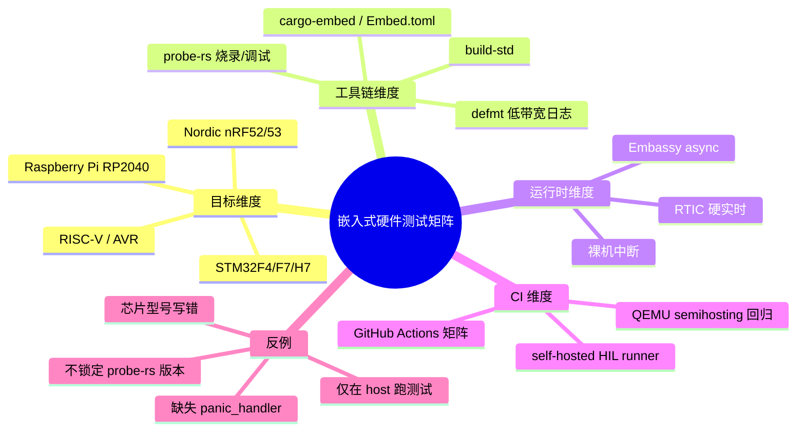
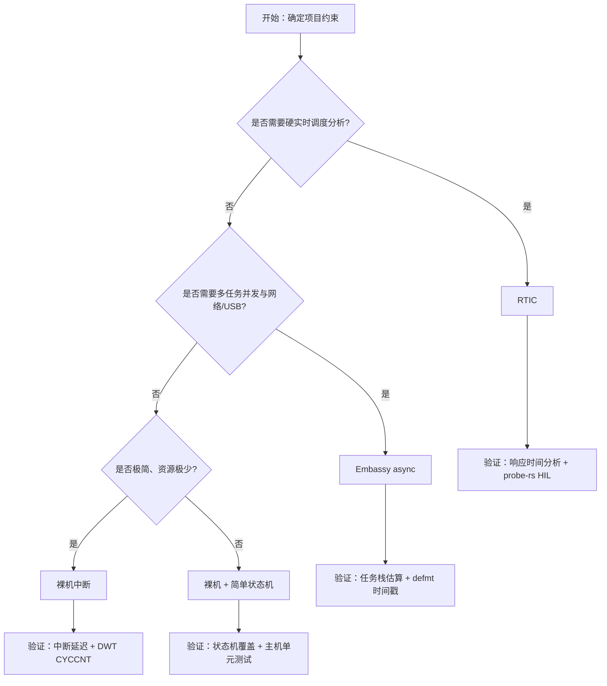

> **内容分级**: [专家级]
> **代码状态**: ⚠️ 裸机/目标平台相关 Rust 代码标注 `rust,ignore`/`no_run`，host 平台无法直接编译；配套可编译示例见 [`crates/c13_embedded/examples/hardware_test_matrix_blinky.rs`](../../../../../crates/c13_embedded/examples/hardware_test_matrix_blinky.rs)
> **定理链**: N/A — 描述性/工程性文档
>
> **本节关键术语**: embedded hardware test matrix · probe-rs · defmt · RTIC · Embassy · HIL · build-std · target YAML · CMSIS-DAP · ST-Link · J-Link — [完整对照表](../../00_meta/01_terminology/01_terminology_glossary.md)

# 嵌入式硬件测试矩阵

> **EN**: Embedded Hardware Test Matrix
> **Summary**: A decision-oriented matrix and CI recipe for validating `#![no_std]` firmware across STM32/Nordic/RP2040 hardware with probe-rs, defmt, RTIC and Embassy.
> **Rust 版本**: 1.97.1+ (Edition 2024)
>
> **受众**: [进阶/专家]
> **Bloom 层级**: L4–L5
> **权威来源**: 本文件为 `concept/` 权威页。
> **A/S/P 标记**: **A+P** — Application + Procedure
> **双维定位**: P×App — 为不同 MCU 家族与运行时组合选择可重复的硬件验证策略
> **定位**: 提供一张可操作的“目标 × 工具链 × 运行时”三维矩阵，把 probe-rs、defmt、RTIC、Embassy 的国际最佳实践映射到 STM32、Nordic nRF、Raspberry Pi RP2040 等真实硬件；并给出可在 `thumbv7em-none-eabihf` 上编译运行的最小骨架与 GitHub Actions CI 模板。
> **前置概念**:
> [Rust 嵌入式系统开发](03_embedded_systems.md) ·
> [no_std 与裸机 Rust](38_no_std_bare_metal_rust.md) ·
> [defmt / probe-rs / Knurling 调试架构与原理](36_defmt_probe_rs_architecture.md) ·
> [Embassy 异步框架深度解析](34_embassy_framework_deep_dive.md) ·
> [RTIC 实时任务调度框架深度解析](35_rtic_framework_deep_dive.md) ·
> [嵌入式测试与 CI 策略](32_embedded_testing_and_ci_strategies.md)
> **后置概念**:
> [probe-rs 与嵌入式调试实战](51_probe_rs_and_embedded_debugging.md) ·
> [嵌入式硬件端到端验证](45_embedded_hardware_validation.md) ·
> [安全关键嵌入式 Rust 指南：MISRA-Rust、Ferrocene 与 IEC 61508](30_misra_rust_safety_critical_guidelines.md) ·
> [测验：安全与测试生态（L6）](../13_quizzes/03_quiz_security_testing.md) ·
> [Rust vs Ada/SPARK](../../05_comparative/01_systems_languages/07_rust_vs_ada_spark.md)

---

> **来源**:
> [probe.rs](https://probe.rs/) ·
> [probe-rs crate](https://crates.io/crates/probe-rs) ·
> [defmt Book](https://defmt.ferrous-systems.com/) ·
> [Embassy Book](https://embassy.dev/book/) ·
> [RTIC Book](https://rtic.rs/2/book/en/) ·
> [Knurling app-template](https://github.com/knurling-rs/app-template) ·
> [Ferrous Systems Training](https://ferrous-systems.com/training/) ·
> [The Embedded Rust Book](https://docs.rust-embedded.org/book/) ·
> [The Rustonomicon](https://doc.rust-lang.org/nomicon/) ·
> [A Survey of Rust Embedded Development (arXiv)](https://arxiv.org/abs/2311.05063) ·
> [ARM CMSIS-DAP](https://arm-software.github.io/CMSIS-DAP/)

---

## 🧠 知识结构图



## 📑 目录

- [嵌入式硬件测试矩阵](#嵌入式硬件测试矩阵)
  - [🧠 知识结构图](#-知识结构图)
  - [📑 目录](#-目录)
  - [一、权威定义](#一权威定义)
  - [二、为什么需要硬件测试矩阵](#二为什么需要硬件测试矩阵)
  - [三、目标 × 工具链 × 运行时三维矩阵](#三目标--工具链--运行时三维矩阵)
  - [四、最小可编译目标示例](#四最小可编译目标示例)
    - [4.1 项目配置](#41-项目配置)
    - [4.2 源代码骨架](#42-源代码骨架)
    - [4.3 编译与验证](#43-编译与验证)
  - [五、CI 矩阵设计](#五ci-矩阵设计)
    - [5.1 GitHub Actions 模板](#51-github-actions-模板)
    - [5.2 矩阵维度说明](#52-矩阵维度说明)
  - [六、RTIC / Embassy / 裸机选型决策树](#六rtic--embassy--裸机选型决策树)
  - [七、反例与失效模式](#七反例与失效模式)
  - [八、权威来源索引](#八权威来源索引)
  - [九、相关概念](#九相关概念)

---

## 一、权威定义

> **The Embedded Rust Book**: Moving from host compilation to real hardware is where embedded Rust verification actually begins; the matrix is the Rosetta stone that maps your toolchain choices to target capabilities.

**嵌入式硬件测试矩阵（Embedded Hardware Test Matrix）**：以 MCU 家族、调试探针、日志/调试链路、运行时框架为轴，系统记录“哪些组合经过验证、哪些组合已知不可行、哪些组合需要额外配置”的决策表。它是把 probe-rs、defmt、RTIC、Embassy 等国际社区最佳实践落地到 CI 的抓手。

**HIL（Hardware-in-the-Loop）**：把真实 MCU 通过探针连接到 CI runner，在每次 PR/每晚自动编译、烧录、运行并断言输出，从而把“在开发者机器上能跑”升级为“在目标硬件上持续可复现”。

**target YAML**：probe-rs 对每个支持芯片的描述文件，定义了内存布局、flash 算法、debug sequence、复位方式。probe-rs 仓库的 `probe-rs/targets/` 是这一事实标准的权威来源。

判定依据：没有矩阵的嵌入式项目容易退化为“某人在某块板子上手动点过”，而矩阵把验证条件显式化、可自动化、可审计。

---

## 二、为什么需要硬件测试矩阵

| 痛点 | 矩阵的解决方式 |
|:---|:---|
| 开发者 A 的 ST-Link 能用，开发者 B 的 CMSIS-DAP 不行 | 把探针型号列为矩阵维度，强制记录已知工作组合 |
| `probe-rs` 新版本改了 chip 名称 | 锁定版本并在矩阵中登记 `probe-rs >= 0.24` 对应的 chip YAML |
| Embassy 与 RTIC 选哪个 | 用实时性、任务模型、生态成熟度三轴给出决策树 |
| CI 只跑 `cargo check` | 增加 `thumbv7em-none-eabihf` 构建与 QEMU/真实硬件运行步骤 |
| defmt 日志在某块板上乱码 | 矩阵中记录该板需要 `probe-rs run --speed 1000` 或特定 RTT 配置 |

---

## 三、目标 × 工具链 × 运行时三维矩阵

> 下表是典型组合的快照（Rust 1.97.1 / probe-rs 0.24 / defmt 0.3 / Embassy 0.6 / RTIC 2.1）。实际项目应根据具体芯片型号与版本更新。

| MCU 家族 | 目标三元组 | 推荐探针 | 推荐运行时 | defmt | 典型命令 | 备注 |
|:---|:---|:---|:---|:---:|:---|:---|
| STM32F4xx | `thumbv7em-none-eabihf` | ST-Link v2/v3, CMSIS-DAP | Embassy / RTIC / 裸机 | ✅ | `probe-rs run --chip STM32F446RETx` | 注意 F4 与 F407/F446 的 chip 名差异 |
| STM32H7xx | `thumbv7em-none-eabihf` | ST-Link v3, J-Link | Embassy / 裸机 | ✅ | `probe-rs run --chip STM32H743ZITx` | 双核 H7 需指定 core |
| Nordic nRF52840 | `thumbv7em-none-eabihf` | J-Link, CMSIS-DAP | Embassy / RTIC | ✅ | `probe-rs run --chip nRF52840_xxAA` | 软设备（softdevice）需额外 flash layout |
| Nordic nRF5340 | `thumbv7em-none-eabihf` | J-Link | Embassy | ✅ | `probe-rs run --chip nRF5340_xxAA` | 网络核与应⽤核分开烧录 |
| Raspberry Pi RP2040 | `thumbv6m-none-eabi` | Picoprobe, CMSIS-DAP | Embassy / 裸机 | ✅ | `probe-rs run --chip RP2040` | 注意 Cortex-M0+ 无 FPU，目标三元组不同 |
| RISC-V GD32VF103 | `riscv32imac-unknown-none-elf` | J-Link, RV-Link | 裸机 / 轻量 RTOS | ⚠️ | `probe-rs run --chip GD32VF103xx` | probe-rs 支持尚在成长 |
| AVR ATmega32u4 | `avr-unknown-gnu-atmega328` | AVR-ICE / USBasp | 裸机 | ❌ | 使用 `avrdude` 而非 probe-rs | probe-rs 目前不支持 AVR |

> **关键洞察**：选择运行时不是品味问题，而是实时性、功耗、生态成熟度与团队经验的函数。矩阵把这种函数显式化。

---

## 四、最小可编译目标示例

> 本节配套示例文件：[`crates/c13_embedded/examples/hardware_test_matrix_blinky.rs`](../../../../../crates/c13_embedded/examples/hardware_test_matrix_blinky.rs)。
> 该示例使用 workspace 已有依赖（`cortex-m`、`cortex-m-rt`、`panic-halt`），可在 `thumbv7em-none-eabihf` 目标上直接编译。

### 4.1 项目配置

```toml
# Cargo.toml（节选）
[dependencies]
cortex-m = { workspace = true }
cortex-m-rt = { workspace = true }
panic-halt = { workspace = true }

# 真实硬件项目通常还会加入：
# defmt = "0.3"
# defmt-rtt = "0.4"
# panic-probe = { version = "0.3", features = ["print-defmt"] }
```

```toml
# .cargo/config.toml
[target.thumbv7em-none-eabihf]
runner = "probe-rs run --chip STM32F446RETx"
rustflags = ["-C", "link-arg=-Tlink.x"]
```

```toml
# Embed.toml（cargo-embed 配置，可选）
[default.general]
chip = "STM32F446RETx"

[default.rtt]
enabled = true

[default.gdb]
enabled = false
```

### 4.2 源代码骨架

```rust,ignore
//! 可在 thumbv7em-none-eabihf 上编译的最小 bare-metal 示例。
//! 完整代码与编译命令见 crates/c13_embedded/examples/hardware_test_matrix_blinky.rs
#![no_std]
#![no_main]

use panic_halt as _;
use core::sync::atomic::{AtomicU32, Ordering};

// STM32F4 GPIOA_ODR 地址；真实项目应通过 PAC/HAL 访问
const GPIOA_ODR: *mut u32 = 0x4002_0014 as *mut u32;

#[cortex_m_rt::entry]
fn main() -> ! {
    static COUNTER: AtomicU32 = AtomicU32::new(0);

    loop {
        unsafe {
            let val = core::ptr::read_volatile(GPIOA_ODR);
            core::ptr::write_volatile(GPIOA_ODR, val ^ (1 << 5)); // 翻转 PA5
        }
        COUNTER.fetch_add(1, Ordering::Relaxed);
        for _ in 0..100_000 {
            cortex_m::asm::nop();
        }
    }
}
```

### 4.3 编译与验证

```bash
# 1. 确认目标已安装
rustup target add thumbv7em-none-eabihf

# 2. 交叉编译（.cargo/config.toml 中的 rustflags 会自动应用）
cargo build -p c13_embedded --target thumbv7em-none-eabihf --example hardware_test_matrix_blinky

# 3. 连接探针后运行
probe-rs run --chip STM32F446RETx \
  target/thumbv7em-none-eabihf/debug/examples/hardware_test_matrix_blinky
```

---

## 五、CI 矩阵设计

### 5.1 GitHub Actions 模板

```yaml
# .github/workflows/embedded-hardware-matrix.yml
name: embedded-hardware-matrix

on:
  push:
    branches: [main]
  pull_request:
    paths:
      - 'crates/c13_embedded/**'
      - 'concept/06_ecosystem/05_systems_and_embedded/50_*.md'

jobs:
  host-check:
    runs-on: ubuntu-latest
    steps:
      - uses: actions/checkout@v4
      - uses: dtolnay/rust-toolchain@stable
        with:
          targets: thumbv7em-none-eabihf,thumbv6m-none-eabi
      - run: cargo check -p c13_embedded
      - run: cargo build -p c13_embedded --target thumbv7em-none-eabihf --examples

  qemu-smoke:
    runs-on: ubuntu-latest
    steps:
      - uses: actions/checkout@v4
      - uses: dtolnay/rust-toolchain@stable
        with:
          targets: thumbv7em-none-eabihf
      - run: sudo apt-get update && sudo apt-get install -y qemu-system-arm
      - run: cargo build -p c13_embedded --target thumbv7em-none-eabihf --example no_std_qemu_blinky
      # 若示例支持 semihosting exit，可在此用 qemu-system-arm 跑回归

  hil-real-hardware:
    runs-on: [self-hosted, hil-stm32]
    needs: host-check
    strategy:
      fail-fast: false
      matrix:
        chip: [STM32F446RETx, STM32F407VGTx]
        probe: [cmsis-dap, stlink]
    steps:
      - uses: actions/checkout@v4
      - uses: dtolnay/rust-toolchain@stable
        with:
          targets: thumbv7em-none-eabihf
      - name: Build and run on ${{ matrix.chip }}
        run: |
          cargo build -p c13_embedded --target thumbv7em-none-eabihf --example hardware_test_matrix_blinky
          probe-rs run --chip ${{ matrix.chip }} --probe ${{ matrix.probe }} \
            target/thumbv7em-none-eabihf/debug/examples/hardware_test_matrix_blinky
```

### 5.2 矩阵维度说明

| 维度 | 作用 | 建议 |
|:---|:---|:---|
| `target` | 区分 Cortex-M0+/M4F/M7/RISC-V | 至少覆盖项目支持的最小与最大 ISA |
| `chip` | probe-rs 的 `--chip` 参数 | 与 target YAML 严格一致，避免“型号差一个字母” |
| `probe` | CMSIS-DAP / ST-Link / J-Link | 在矩阵中覆盖团队实际拥有的探针 |
| `runtime` | Embassy / RTIC / 裸机 | 对同一芯片分别跑，防止运行时互相污染 |
| `log-backend` | defmt-RTT / ITM / UART | 与 `Embed.toml` 或 `.cargo/config.toml` runner 绑定 |

---

## 六、RTIC / Embassy / 裸机选型决策树



---

## 七、反例与失效模式

| 反例 | 现象 | 正确做法 |
|:---|:---|:---|
| 仅在 host 上跑 `cargo test` | 无法发现目标 ABI、内存布局、原子宽度问题 | 增加 `--target thumbv7em-none-eabihf` 构建步骤 |
| `Cargo.toml` 不锁定 `probe-rs` 版本 | CI runner 更新后 chip 名失效 | 在 `rust-toolchain.toml` / CI 中固定 `probe-rs` 版本 |
| 遗漏 `panic_handler` | `error: #[panic_handler] function required, but not found` | 引入 `panic-halt` 或 `panic-probe` 并 `use panic_halt as _;` |
| chip 名称写错一个字母 | `The chip ... was not found` | 用 `probe-rs chip list` 核对并写入矩阵 |
| 在 ISR 中 `await` | 编译错误或运行时不可预期 | Embassy/RTIC 各有专门的任务绑定语法，不能混用 |
| 日志过快导致 RTT 覆盖 | 丢帧、时间戳错乱 | 提高 RTT buffer、降低日志级别或添加流控 |

---

## 八、权威来源索引

| 主题 | 权威来源 | 链接 |
|:---|:---|:---|
| probe-rs 官方文档 | probe-rs team | <https://probe.rs/> |
| defmt 帧格式与过滤 | Ferrous Systems | <https://defmt.ferrous-systems.com/> |
| Embassy 框架 | embassy-rs | <https://embassy.dev/book/> |
| RTIC 调度 | RTIC team | <https://rtic.rs/2/book/en/> |
| Knurling 项目模板 | Ferrous Systems | <https://github.com/knurling-rs/app-template> |
| ARM CMSIS-DAP 协议 | ARM | <https://arm-software.github.io/CMSIS-DAP/> |
| The Embedded Rust Book | rust-embedded | <https://docs.rust-embedded.org/book/> |

---

## 九、相关概念

- [Rust 嵌入式系统开发](03_embedded_systems.md)
- [defmt / probe-rs / Knurling 调试架构与原理](36_defmt_probe_rs_architecture.md)
- [probe-rs 与嵌入式调试实战](51_probe_rs_and_embedded_debugging.md)
- [Embassy 异步框架深度解析](34_embassy_framework_deep_dive.md)
- [RTIC 实时任务调度框架深度解析](35_rtic_framework_deep_dive.md)
- [嵌入式测试与 CI 策略](32_embedded_testing_and_ci_strategies.md)
- [测验：安全与测试生态（L6）](../13_quizzes/03_quiz_security_testing.md)
- [嵌入式硬件端到端验证](45_embedded_hardware_validation.md)
