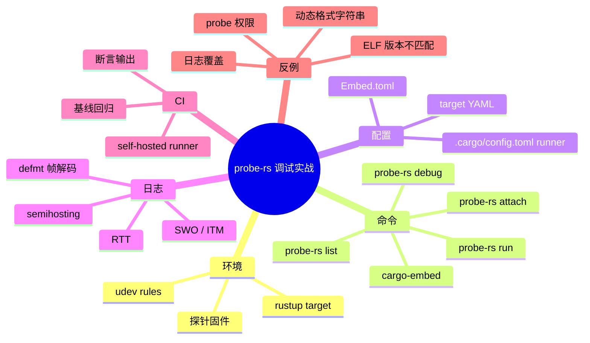
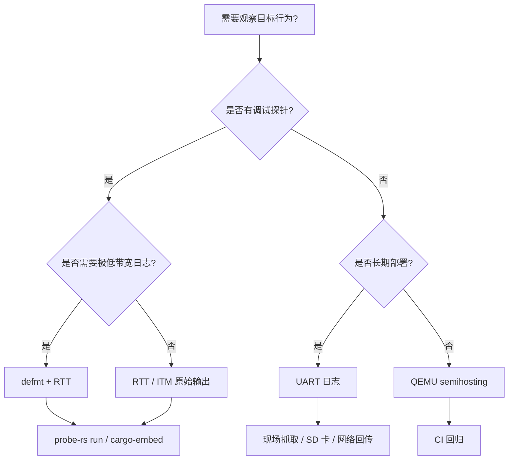

> **内容分级**: [专家级]
> **代码状态**: ⚠️ 裸机/目标平台相关 Rust 代码标注 `rust,ignore`/`no_run`，host 平台无法直接编译；配套可编译示例见 [`crates/c13_embedded/examples/probe_rs_debug_blinky.rs`](../../../../../crates/c13_embedded/examples/probe_rs_debug_blinky.rs)
> **定理链**: N/A — 描述性/工程性文档
>
> **本节关键术语**: probe-rs · cargo-embed · RTT · SWO · ITM · semihosting · target YAML · flash algorithm · debug sequence · defmt decode — [完整对照表](../../00_meta/01_terminology/01_terminology_glossary.md)

# probe-rs 与嵌入式调试实战

> **EN**: probe-rs and Embedded Debugging in Practice
> **Summary**: Practical guide to using probe-rs for flashing, RTT/SWO logging, scripting, and CI-based hardware debugging of no_std Rust firmware.
> **Rust 版本**: 1.97.1+ (Edition 2024)
>
> **受众**: [进阶/专家]
> **Bloom 层级**: L4–L5
> **权威来源**: 本文件为 `concept/` 权威页。
> **A/S/P 标记**: **P+A** — Procedure + Application — Application + Procedure
> **双维定位**: P×App — 在真实硬件上把 probe-rs 调试链路跑通并纳入 CI
> **定位**: 聚焦 probe-rs 的实际操作面：从环境安装、target YAML 校准、`cargo embed`/`probe-rs run`/`probe-rs attach` 命令矩阵，到 defmt 帧解码、RTT/SWO/semihosting 选型、脚本化 HIL 与 CI 模板。配套示例已在 `thumbv7em-none-eabihf` 上验证编译。
> **前置概念**:
> [defmt / probe-rs / Knurling 调试架构与原理](36_defmt_probe_rs_architecture.md) ·
> [嵌入式调试与日志](20_embedded_debugging_logging.md) ·
> [嵌入式硬件测试矩阵](50_embedded_hardware_test_matrix.md) ·
> [no_std 启动流程与运行时深度解析](27_no_std_startup_runtime_deep_dive.md) ·
> [Cortex-M 与 RISC-V 中断异常模型](14_interrupt_and_exception_model.md)
> **后置概念**:
> [嵌入式硬件端到端验证](45_embedded_hardware_validation.md) ·
> [嵌入式测试与 CI 策略](32_embedded_testing_and_ci_strategies.md) ·
> [安全关键嵌入式 Rust 指南：MISRA-Rust、Ferrocene 与 IEC 61508](30_misra_rust_safety_critical_guidelines.md) ·
> [测验：安全与测试生态（L6）](../13_quizzes/03_quiz_security_testing.md) ·
> [Rust vs Ada/SPARK](../../05_comparative/01_systems_languages/07_rust_vs_ada_spark.md)

---

> **来源**:
> [probe.rs](https://probe.rs/) ·
> [probe-rs crate](https://crates.io/crates/probe-rs) ·
> [probe-rs GitHub](https://github.com/probe-rs/probe-rs) ·
> [defmt Book](https://defmt.ferrous-systems.com/) ·
> [Knurling](https://knurling.ferrous-systems.com/) ·
> [cargo-embed](https://probe.rs/docs/tools/cargo-embed/) ·
> [The Embedded Rust Book](https://docs.rust-embedded.org/book/) ·
> [The Rustonomicon](https://doc.rust-lang.org/nomicon/) ·
> [A Survey of Rust Embedded Development (arXiv)](https://arxiv.org/abs/2311.05063) ·
> [ARM CoreSight](https://developer.arm.com/ip-products/system-ip/coresight-debug-and-trace)

---

## 🧠 知识结构图



## 📑 目录

- [probe-rs 与嵌入式调试实战](#probe-rs-与嵌入式调试实战)
  - [🧠 知识结构图](#-知识结构图)
  - [📑 目录](#-目录)
  - [一、权威定义](#一权威定义)
  - [二、环境准备与目标校准](#二环境准备与目标校准)
    - [2.1 安装](#21-安装)
    - [2.2 校准 chip 名称](#22-校准-chip-名称)
    - [2.3 Linux udev 规则](#23-linux-udev-规则)
  - [三、命令矩阵](#三命令矩阵)
    - [3.1 probe-rs run](#31-probe-rs-run)
    - [3.2 probe-rs attach](#32-probe-rs-attach)
    - [3.3 probe-rs debug](#33-probe-rs-debug)
    - [3.4 cargo-embed](#34-cargo-embed)
  - [四、defmt 帧解码与 ELF 绑定](#四defmt-帧解码与-elf-绑定)
  - [五、传输层对比：RTT / SWO / ITM / Semihosting / UART](#五传输层对比rtt--swo--itm--semihosting--uart)
  - [六、目标端测量：DWT CYCCNT + 硬件断点](#六目标端测量dwt-cyccnt--硬件断点)
  - [七、脚本化与 CI HIL](#七脚本化与-ci-hil)
    - [7.1 用 probe-rs 作为库](#71-用-probe-rs-作为库)
    - [7.2 HIL 断言脚本示例](#72-hil-断言脚本示例)
    - [7.3 GitHub Actions 片段](#73-github-actions-片段)
  - [八、反例与失效模式](#八反例与失效模式)
  - [九、决策树：调试链路选型](#九决策树调试链路选型)
  - [十、权威来源索引](#十权威来源索引)
  - [十一、相关概念](#十一相关概念)

---

## 一、权威定义

> **probe.rs docs**: probe-rs is a modern, embedded debugging toolkit designed to be the Rust-native replacement for OpenOCD and vendor-specific tools.

**probe-rs**：用 Rust 编写的跨平台调试与烧录工具链，统一抽象了探针（probe）、目标（target）、会话（session）、核心（core）与 flash loader。它支持 CMSIS-DAP / ST-Link / J-Link 等后端，提供 CLI 与 Rust API 两种形态。

**target YAML**：probe-rs 对每个芯片的机器可读描述，包含 flash 算法、debug sequence、内存区域、核心类型。`probe-rs chip list` 与 `probe-rs chip info <CHIP>` 是校准 chip 名称的权威入口。

**flash algorithm**：一段运行在目标 RAM 中的小程序，负责把 ELF 段写入片内/片外 flash。probe-rs 的 flash algorithm 用 YAML 描述并在运行时加载，避免了为每个芯片维护独立二进制 blob。

**debug sequence**：复位、解锁、连接目标所需的步骤序列。某些安全 MCU（如 nRF53 应用核）需要先解锁再 attach。

判定依据：probe-rs 把“vendor tool + OpenOCD + 手动脚本”的历史包袱替换为单一 Rust 原生工具链，并通过 target YAML 把芯片支持数据化。

---

## 二、环境准备与目标校准

### 2.1 安装

```bash
# 推荐固定版本，避免 chip YAML 漂移
 cargo install probe-rs-tools --version 0.24.0 --locked

# 验证
probe-rs --version
probe-rs list
```

### 2.2 校准 chip 名称

```bash
# 列出所有支持的芯片
probe-rs chip list | grep -i stm32f446

# 查看芯片详情（内存布局、核心、flash 算法）
probe-rs chip info STM32F446RETx

# 列出已连接的探针
probe-rs list
```

### 2.3 Linux udev 规则

```bash
# 安装 probe-rs 提供的 udev 规则，避免每次用 sudo
probe-rs udev  > /etc/udev/rules.d/69-probe-rs.rules
udevadm control --reload-rules
udevadm trigger
```

---

## 三、命令矩阵

### 3.1 probe-rs run

```bash
# 默认：编译、烧录、运行、捕获 RTT/defmt 输出
cargo run --target thumbv7em-none-eabihf

# 显式指定芯片与探针
probe-rs run --chip STM32F446RETx --probe 0483:374b \
  target/thumbv7em-none-eabihf/debug/firmware
```

### 3.2 probe-rs attach

```bash
# 附加到已在运行的目标，不重置、不重新烧录
probe-rs attach --chip STM32F446RETx
```

### 3.3 probe-rs debug

```bash
# 交互式 GDB 服务器，配合 arm-none-eabi-gdb 使用
probe-rs debug --chip STM32F446RETx --protocol swd
```

### 3.4 cargo-embed

```toml
# Embed.toml
[default.general]
chip = "STM32F446RETx"

[default.rtt]
enabled = true
channels = [
    { up = 0, name = "defmt", format = "Defmt" },
]

[default.gdb]
enabled = false
```

```bash
# 等价于 cargo run，但使用 Embed.toml 中的配置
cargo embed --target thumbv7em-none-eabihf
```

---

## 四、defmt 帧解码与 ELF 绑定

> defmt 的目标端只输出压缩后的二进制帧，主机端需要**同一个 ELF 文件**才能完成解码。这是 probe-rs `run` 与 `cargo-embed` 自动处理的关键步骤。

```rust,ignore
// 目标端代码（需依赖 defmt、defmt-rtt、panic-probe）
#![no_std]
#![no_main]

use defmt_rtt as _;
use panic_probe as _;

#[defmt::panic_handler]
fn panic() -> ! {
    cortex_m::asm::udf()
}

#[cortex_m_rt::entry]
fn main() -> ! {
    defmt::info!("boot: version={}", 1u32);

    let sensor = 0x1A3Bu16;
    defmt::debug!("sensor read: {=u16:x}", sensor);

    loop { cortex_m::asm::wfi(); }
}
```

> **关键约束**：
>
> 1. 动态格式字符串（如 `defmt::info!("value: {}", x)` 中的 `"value: {}"` 在运行期变化）不被允许；格式串必须在编译期驻留。
> 2. 烧录到板子的 ELF 必须与主机端解码用的 ELF 一致，否则帧 ID 错位。
> 3. `defmt::timestamp!` 的实现应尽量使用 DWT CYCCNT，减少目标端开销。

---

## 五、传输层对比：RTT / SWO / ITM / Semihosting / UART

| 传输层 | 所需硬件 | 带宽 | 侵入性 | 典型用途 | probe-rs 支持 |
|:---|:---|:---:|:---:|:---|:---:|
| RTT | 调试探针 + 目标 RAM buffer | 中 | 低 | defmt 日志、printf 式调试 | ✅ |
| SWO / ITM | 带 SWO 的探针（ST-Link v2+ / J-Link） | 高 | 极低 | 高频 trace、时间戳、中断事件 | ✅（部分） |
| Semihosting | 调试探针 | 低 | 高 | QEMU 退出、文件 I/O、测试 harness | ✅ |
| UART | USB-UART 转接板 | 高 | 中 | 长期现场日志、不依赖调试器 | ❌（probe-rs 不处理 UART） |

判定依据：

- **RTT** 是 probe-rs + defmt 的默认选择，无需额外引脚。
- **SWO/ITM** 适合需要亚微秒级时间戳的实时分析，但探针与芯片必须支持 SWO。
- **Semihosting** 在真实硬件上很慢，主要用于 QEMU 回归测试。
- **UART** 适合脱离调试器后的现场日志，但probe-rs不直接处理。

---

## 六、目标端测量：DWT CYCCNT + 硬件断点

> 本节配套示例文件：[`crates/c13_embedded/examples/probe_rs_debug_blinky.rs`](../../../../../crates/c13_embedded/examples/probe_rs_debug_blinky.rs)。
> 该示例演示如何在 `thumbv7em-none-eabihf` 上使能 DWT 周期计数器，并在循环中触发 `bkpt` 供 probe-rs 捕获。

```rust,ignore
//! 在目标端用 DWT CYCCNT 测量周期并触发硬件断点。
//! 完整代码见 crates/c13_embedded/examples/probe_rs_debug_blinky.rs
#![no_std]
#![no_main]

use panic_halt as _;

const DEMCR: *mut u32 = 0xE000_EDFC as *mut u32;
const DWT_CTRL: *mut u32 = 0xE000_1000 as *mut u32;
const DWT_CYCCNT: *mut u32 = 0xE000_1004 as *mut u32;

#[cortex_m_rt::entry]
fn main() -> ! {
    unsafe {
        core::ptr::write_volatile(DEMCR, core::ptr::read_volatile(DEMCR) | (1 << 24));
        core::ptr::write_volatile(DWT_CYCCNT, 0);
        core::ptr::write_volatile(DWT_CTRL, core::ptr::read_volatile(DWT_CTRL) | (1 << 0));
    }

    loop {
        let start = unsafe { core::ptr::read_volatile(DWT_CYCCNT) };

        // 待测代码区 ...
        for _ in 0..100_000 { cortex_m::asm::nop(); }

        let end = unsafe { core::ptr::read_volatile(DWT_CYCCNT) };
        let _elapsed = end.wrapping_sub(start);

        // probe-rs attach 时可在此暂停
        cortex_m::asm::bkpt();
    }
}
```

编译与运行：

```bash
cargo build -p c13_embedded --target thumbv7em-none-eabihf --example probe_rs_debug_blinky
probe-rs run --chip STM32F446RETx \
  target/thumbv7em-none-eabihf/debug/examples/probe_rs_debug_blinky
```

---

## 七、脚本化与 CI HIL

### 7.1 用 probe-rs 作为库

probe-rs 除了 CLI 也提供 Rust crate，可用于自定义测试 harness：

```rust,ignore
// build-dependency 或独立测试工具
use probe_rs::{Probe, Session};

fn run_hil_test(chip: &str) -> anyhow::Result<()> {
    let probes = Probe::list_all();
    let probe = probes.first().ok_or("no probe")?.open()?;
    let mut session = probe.attach(chip, Default::default())?;
    let mut core = session.core(0)?;

    core.reset()?;
    // 读取寄存器/内存做断言
    let sp: u32 = core.read_core_reg(core.registers().sp)?;
    assert_eq!(sp & 0xF000_0000, 0x2000_0000, "SP not in RAM");
    Ok(())
}
```

### 7.2 HIL 断言脚本示例

```bash
#!/usr/bin/env bash
set -euo pipefail

cargo build -p c13_embedded --target thumbv7em-none-eabihf --example hardware_test_matrix_blinky

# 运行并捕获输出；成功时固件应打印 "OK" 或通过 semihosting exit 0
timeout 30 probe-rs run --chip STM32F446RETx \
  target/thumbv7em-none-eabihf/debug/examples/hardware_test_matrix_blinky \
  | tee /tmp/hil.log

grep -q "OK" /tmp/hil.log || { echo "HIL test failed"; exit 1; }
```

### 7.3 GitHub Actions 片段

```yaml
hil-probe-rs:
  runs-on: [self-hosted, hil-stm32]
  steps:
    - uses: actions/checkout@v4
    - uses: dtolnay/rust-toolchain@stable
      with:
        targets: thumbv7em-none-eabihf
    - name: Install probe-rs
      run: cargo install probe-rs-tools --version 0.24.0 --locked
    - name: HIL smoke test
      run: bash scripts/hil/probe_rs_smoke.sh
```

---

## 八、反例与失效模式

| 反例 | 现象 | 正确做法 |
|:---|:---|:---|
| ELF 与固件版本不匹配 | defmt 输出乱码或崩溃 | CI 产物中保留 ELF，probe-rs 使用同一次构建的 ELF |
| 动态格式字符串 | `error: format string must be a string literal` | 使用编译期常量或 defmt 的 `interned string` 机制 |
| RTT buffer 过小 | 高速日志丢帧 | 在 `Embed.toml` 中增大 `up_channels` buffer |
| 在 ISR 中 `await` | 编译失败或运行时不可预期 | Embassy 任务绑定到中断；RTIC 硬件任务不能 await |
| probe-rs 权限不足 | `Permission denied` / 找不到探针 | Linux 安装 udev 规则；Windows 安装 WinUSB/libusb 驱动 |
| 用 semihosting 做生产日志 | 极慢、影响实时性 | 生产环境用 RTT/UART，semihosting 仅用于测试 |
| 忽略 `defmt::timestamp!` | 时间戳缺失或不准 | 在 firmware 中实现基于 CYCCNT 的 timestamp handler |

---

## 九、决策树：调试链路选型



---

## 十、权威来源索引

| 主题 | 权威来源 | 链接 |
|:---|:---|:---|
| probe-rs 官方文档 | probe-rs team | <https://probe.rs/> |
| cargo-embed 配置 | probe-rs docs | <https://probe.rs/docs/tools/cargo-embed/> |
| defmt 帧协议 | Ferrous Systems | <https://defmt.ferrous-systems.com/> |
| Knurling 模板与 flip-link | Ferrous Systems | <https://knurling.ferrous-systems.com/> |
| ARM CoreSight 调试架构 | ARM | <https://developer.arm.com/ip-products/system-ip/coresight-debug-and-trace> |
| The Embedded Rust Book | rust-embedded | <https://docs.rust-embedded.org/book/> |

---

## 十一、相关概念

- [defmt / probe-rs / Knurling 调试架构与原理](36_defmt_probe_rs_architecture.md)
- [嵌入式硬件测试矩阵](50_embedded_hardware_test_matrix.md)
- [嵌入式硬件端到端验证](45_embedded_hardware_validation.md)
- [嵌入式调试与日志](20_embedded_debugging_logging.md)
- [嵌入式测试与 CI 策略](32_embedded_testing_and_ci_strategies.md)
- [测验：安全与测试生态（L6）](../13_quizzes/03_quiz_security_testing.md)
- [Embassy 异步框架深度解析](34_embassy_framework_deep_dive.md)
- [RTIC 实时任务调度框架深度解析](35_rtic_framework_deep_dive.md)
- [Rust vs Ada/SPARK](../../05_comparative/01_systems_languages/07_rust_vs_ada_spark.md)
