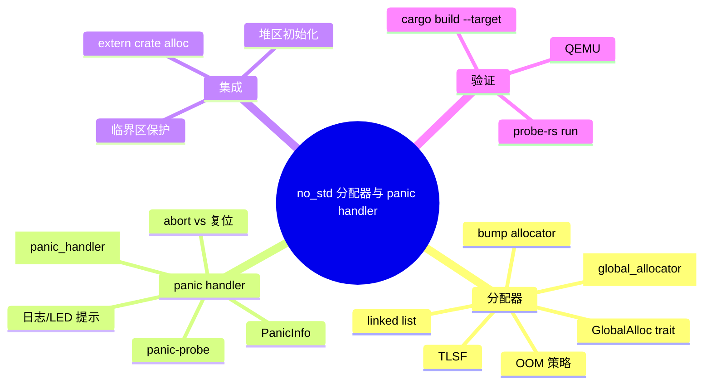
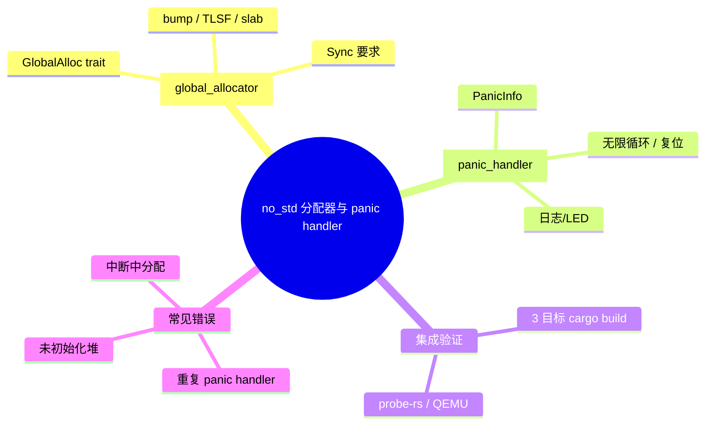

> **内容分级**: [专家级]
> **代码状态**: ⚠️ 裸机/目标平台相关代码标注 `rust,ignore`/`no_run`，host 平台无法直接编译；纯 `core`/`alloc` 片段可在 host 上检查
> **定理链**: N/A — 工程性/架构性文档
>
# no_std 分配器与 panic handler
>
> **EN**: no_std Allocators and Panic Handlers
> **Summary**: A canonical integration guide for `#![no_std]` runtimes: implementing `#[global_allocator]`, selecting embedded allocators, writing custom `#[panic_handler]`, handling OOM, and validating the resulting firmware on ARM Cortex-M and RISC-V hardware.
> **Rust 版本**: 1.97.0+ (Edition 2024)
>
> **受众**: [专家]
> **Bloom 层级**: L4
> **权威来源**: 本文件为 `concept/` 权威页。
> **A/S/P 标记**: **S+A+P** — Structure + Application + Procedure
> **双维定位**: P×Cre — 在裸机目标上构建可启动、可调试、带堆分配的 no_std 固件
> **前置概念**: [no_std 与裸机 Rust](38_no_std_bare_metal_rust.md) · [嵌入式内存分配器](16_embedded_memory_allocators.md) · [panic_handler 与 no_std 运行时](18_panic_runtime_no_std.md) · [no_std alloc crate 生态](48_no_std_alloc_crate_ecosystem.md)
> **后置概念**: [临界区与裸机同步](53_critical_sections_and_sync_on_bare_metal.md) · [链接脚本与内存布局](54_linker_scripts_and_memory_layout.md) · [嵌入式内存布局与堆安全](29_embedded_memory_layout_and_heap_safety.md)

---

> **来源**: [The Embedded Rust Book](https://docs.rust-embedded.org/book/) · [The Embedonomicon](https://docs.rust-embedded.org/embedonomicon/) · [Rust Reference — Panic Handler](https://doc.rust-lang.org/reference/runtime.html#the-panic_handler-attribute) · [Rust Reference — The no_std attribute](https://doc.rust-lang.org/reference/names/preludes.html#the-no_std-attribute) · [embedded-alloc crate](https://docs.rs/embedded-alloc/) · [linked_list_allocator crate](https://docs.rs/linked_list_allocator/) · [critical-section crate](https://docs.rs/critical-section/) · [Ferrous Systems — Knurling](https://knurling.ferrous-systems.com/) · [Rust for Linux — Kernel Rust](https://www.kernel.org/doc/html/latest/rust/index.html)
>
> **横向对比**: [C/C++ 嵌入式堆管理](../../05_comparative/01_systems_languages/01_rust_vs_cpp.md) · [Rust vs Zig 裸机生态](../../05_comparative/01_systems_languages/06_rust_vs_zig.md)

---

## 🧠 知识结构图



## 📑 目录

- [no\_std 分配器与 panic handler](#no_std-分配器与-panic-handler)
  - [🧠 知识结构图](#-知识结构图)
  - [📑 目录](#-目录)
  - [一、权威定义](#一权威定义)
  - [二、`#[global_allocator]` 与 `GlobalAlloc`](#二global_allocator-与-globalalloc)
    - [2.1 OOM 策略](#21-oom-策略)
  - [三、嵌入式分配器选型](#三嵌入式分配器选型)
    - [3.1 使用 `embedded-alloc`（TLSF）](#31-使用-embedded-alloctlsf)
    - [3.2 最小 bump allocator](#32-最小-bump-allocator)
  - [四、`#[panic_handler]` 契约](#四panic_handler-契约)
    - [4.1 复位 vs 挂起](#41-复位-vs-挂起)
  - [五、分配器 + panic handler 集成示例](#五分配器--panic-handler-集成示例)
  - [六、反例与失效模式](#六反例与失效模式)
    - [反例 1：同时使用 panic-halt 和自定义 panic handler](#反例-1同时使用-panic-halt-和自定义-panic-handler)
    - [反例 2：分配器非 `Sync`](#反例-2分配器非-sync)
    - [反例 3：中断中调用非重入分配器](#反例-3中断中调用非重入分配器)
    - [反例 4：未初始化堆就使用 `Box`](#反例-4未初始化堆就使用-box)
  - [七、硬件实测与 CI 验证](#七硬件实测与-ci-验证)
  - [八、决策树](#八决策树)
  - [九、相关概念](#九相关概念)
  - [🧭 思维导图（Mindmap）](#-思维导图mindmap)

---

## 一、权威定义

> **The Embedonomicon**: `#![no_std]` only removes `std` from the prelude; `core` and `alloc` remain available. `alloc` requires a global allocator, and a `no_std` binary requires a panic handler.

**`#[global_allocator]`**：在 `#![no_std]` crate 中启用 `alloc`  crate 时，必须提供的全局堆分配器。它必须实现 `core::alloc::GlobalAlloc` trait，并标注为 `static` 且 `Sync`。

**`#[panic_handler]`**：`no_std` 环境下自定义 panic 行为的函数，签名为 `fn(&PanicInfo) -> !`，即在 panic 后永不返回。桌面 Rust 由标准库或 `panic = "abort"` 提供，裸机必须由用户显式提供。

判定依据：一个可启动的 `no_std + alloc` 裸机固件必须同时满足：

1. 存在唯一的 `#[global_allocator]`（若使用 `alloc`）；
2. 存在唯一的 `#[panic_handler]`；
3. 堆区域在链接脚本中可用且已初始化；
4. 分配器实现与中断/并发模型兼容。

---

## 二、`#[global_allocator]` 与 `GlobalAlloc`

`GlobalAlloc` 要求实现两个核心方法：

```rust,ignore
use core::alloc::{GlobalAlloc, Layout};

unsafe impl GlobalAlloc for MyAllocator {
    unsafe fn alloc(&self, layout: Layout) -> *mut u8;
    unsafe fn dealloc(&self, ptr: *mut u8, layout: Layout);
}
```

- `alloc`：按 `Layout` 的对齐与大小返回内存；失败时返回 `null_mut()`。
- `dealloc`：释放先前由 `alloc` 返回的内存。

在 `#![no_std]` 中使用 `alloc` 需要：

```rust,ignore
#![no_std]
extern crate alloc; // 显式引入 alloc

#[global_allocator]
static ALLOCATOR: MyAllocator = MyAllocator::new();
```

### 2.1 OOM 策略

Rust 1.97 在 `no_std` 中不再使用 `#[alloc_error_handler]`（该 attribute 已移除）。`GlobalAlloc::alloc` 返回 `null_mut()`，调用者需检查返回值。`Vec` 等标准集合在 OOM 时会触发 panic，因此 `panic_handler` 实际上成为 OOM 的最后防线。

---

## 三、嵌入式分配器选型

| 分配器 | 确定性 | 碎片化 | 释放支持 | 适用场景 |
|---|---|---|---|---|
| bump allocator | 最高 | 无 | 不支持 | 一次性初始化、日志缓冲 |
| slab / arena | 高 | 低 | 可批量重置 | 同尺寸对象池 |
| TLSF (`embedded-alloc`) | 高 | 中 | 支持 | 通用实时系统 |
| linked list allocator | 中 | 高 | 支持 | 教学/原型 |

> **来源**: TLSF 实时分配器由 Masmano et al. 提出，被 `embedded-alloc` 采用（[Springer — Real-Time Systems](https://link.springer.com/article/10.1007/s11241-008-9052-7)）。

### 3.1 使用 `embedded-alloc`（TLSF）

```rust,ignore
#![no_std]
extern crate alloc;

use embedded_alloc::LlffHeap as Heap;

#[global_allocator]
static HEAP: Heap = Heap::empty();

fn init_heap() {
    // 在 main 中尽早初始化，传入链接脚本预留的堆区
    use core::mem::MaybeUninit;
    const HEAP_SIZE: usize = 1024;
    static mut HEAP_MEM: [MaybeUninit<u8>; HEAP_SIZE] = [MaybeUninit::uninit(); HEAP_SIZE];
    unsafe { HEAP.init(HEAP_MEM.as_ptr() as usize, HEAP_SIZE) }
}
```

### 3.2 最小 bump allocator

```rust,ignore
use core::alloc::{GlobalAlloc, Layout};
use core::cell::UnsafeCell;
use core::sync::atomic::{AtomicUsize, Ordering};

const HEAP_SIZE: usize = 1024;

struct BumpAllocator {
    heap: UnsafeCell<[u8; HEAP_SIZE]>,
    next: AtomicUsize,
}

// 单核裸机 + 关中断/临界区保护下可安全标记 Sync
unsafe impl Sync for BumpAllocator {}

unsafe impl GlobalAlloc for BumpAllocator {
    unsafe fn alloc(&self, layout: Layout) -> *mut u8 {
        let start = self.next.fetch_add(layout.size(), Ordering::Relaxed);
        let aligned = (start + layout.align() - 1) & !(layout.align() - 1);
        let end = aligned.saturating_add(layout.size());
        if end > HEAP_SIZE {
            return core::ptr::null_mut();
        }
        unsafe { (*self.heap.get()).as_mut_ptr().add(aligned) }
    }

    unsafe fn dealloc(&self, _ptr: *mut u8, _layout: Layout) {
        // bump 策略不支持释放
    }
}
```

---

## 四、`#[panic_handler]` 契约

最小实现：

```rust,ignore
#![no_std]

use core::panic::PanicInfo;

#[panic_handler]
fn panic(_info: &PanicInfo) -> ! {
    loop {
        // 可在此翻转 GPIO 或写入 UART
        cortex_m::asm::wfi(); // ARM
    }
}
```

带诊断信息的实现：

```rust,ignore
use core::fmt::Write;
use core::panic::PanicInfo;

struct Uart;

impl Write for Uart {
    fn write_str(&mut self, s: &str) -> core::fmt::Result {
        // 向 UART 发送字符串
        Ok(())
    }
}

#[panic_handler]
fn panic(info: &PanicInfo) -> ! {
    let mut uart = Uart;
    let _ = writeln!(uart, "PANIC: {}", info);

    // 可选：触发系统复位
    // cortex_m::peripheral::SCB::sys_reset();

    loop { cortex_m::asm::wfi(); }
}
```

### 4.1 复位 vs 挂起

| 策略 | 优点 | 缺点 |
|---|---|---|
| 无限循环/WFI | 便于 attach 调试器查看现场 | 可能浪费功耗 |
| 系统复位 | 自动恢复 | 丢失 panic 现场 |
| 写日志后复位 | 兼顾调试与恢复 | 需要非易失存储或日志通道 |

---

## 五、分配器 + panic handler 集成示例

以下为本仓库可编译验证的完整示例：
[`crates/c13_embedded/examples/no_std_allocators_and_panic_handlers.rs`](../../../../crates/c13_embedded/examples/no_std_allocators_and_panic_handlers.rs)

```rust,ignore
#![no_std]
#![no_main]
extern crate alloc;

use core::alloc::{GlobalAlloc, Layout};
use core::cell::UnsafeCell;
use core::panic::PanicInfo;
use core::sync::atomic::{AtomicUsize, Ordering};

// ---------- panic handler ----------
#[panic_handler]
fn panic(_info: &PanicInfo) -> ! {
    loop {
        #[cfg(target_arch = "arm")]
        cortex_m::asm::wfi();
        #[cfg(target_arch = "riscv32")]
        riscv::asm::wfi();
    }
}

// ---------- bump allocator ----------
const HEAP_SIZE: usize = 1024;

struct BumpAllocator {
    heap: UnsafeCell<[u8; HEAP_SIZE]>,
    next: AtomicUsize,
}

unsafe impl Sync for BumpAllocator {}

unsafe impl GlobalAlloc for BumpAllocator {
    unsafe fn alloc(&self, layout: Layout) -> *mut u8 {
        let start = self.next.fetch_add(layout.size(), Ordering::Relaxed);
        let end = start.saturating_add(layout.size());
        if end > HEAP_SIZE {
            return core::ptr::null_mut();
        }
        unsafe { (*self.heap.get()).as_mut_ptr().add(start) }
    }

    unsafe fn dealloc(&self, _ptr: *mut u8, _layout: Layout) {}
}

#[global_allocator]
static ALLOCATOR: BumpAllocator = BumpAllocator::new();

// ---------- critical-section protected shared state ----------
static COUNTER: critical_section::Mutex<core::cell::RefCell<u32>> =
    critical_section::Mutex::new(core::cell::RefCell::new(0));

#[cortex_m_rt::entry] // 或 #[riscv_rt::entry]
fn main() -> ! {
    use alloc::vec::Vec;

    let mut v = Vec::new();
    v.push(1u8);
    v.push(2);

    loop {
        critical_section::with(|cs| {
            *COUNTER.borrow(cs).borrow_mut() += 1;
        });
    }
}
```

---

## 六、反例与失效模式

### 反例 1：同时使用 panic-halt 和自定义 panic handler

`panic-halt` crate 已经提供了一个 `#[panic_handler]`。若再自定义一个，链接器会报错重复定义。

```rust,ignore
// 错误：与 `use panic_halt as _;` 冲突
use panic_halt as _;

#[panic_handler]
fn panic(_info: &PanicInfo) -> ! { loop {} }
```

### 反例 2：分配器非 `Sync`

```rust,ignore
struct BadAllocator;
unsafe impl GlobalAlloc for BadAllocator { /* ... */ }

#[global_allocator]
static ALLOCATOR: BadAllocator = BadAllocator; // 错误：BadAllocator 未实现 Sync
```

### 反例 3：中断中调用非重入分配器

在临界区外，中断服务例程若调用 `Vec::push`，可能与主循环的分配操作交错，导致堆损坏。

```rust,ignore
#[interrupt]
fn TIM2() {
    let mut v = unsafe { SHARED_VEC.as_mut().unwrap() };
    v.push(1); // 危险：未关中断/未加锁
}
```

### 反例 4：未初始化堆就使用 `Box`

```rust,ignore
#[global_allocator]
static HEAP: Heap = Heap::empty();

fn main() {
    let _b = Box::new(1); // 运行时崩溃：堆未初始化
}
```

---

## 七、硬件实测与 CI 验证

本仓库 `crates/c13_embedded` 提供可编译验证的综合示例，覆盖 3 个裸机目标：

```bash
# ARM Cortex-M4F
 cargo build -p c13_embedded --target thumbv7em-none-eabihf \
   --example no_std_allocators_and_panic_handlers

# ARM Cortex-M3
 cargo build -p c13_embedded --target thumbv7m-none-eabi \
   --example no_std_allocators_and_panic_handlers

# RISC-V 32-bit
 cargo build -p c13_embedded --target riscv32imac-unknown-none-elf \
   --example no_std_allocators_and_panic_handlers
```

真实硬件运行（示例，需替换为实际芯片）：

```bash
# ARM — 通过 probe-rs 烧录并运行
probe-rs run --chip STM32F446RETx \
  target/thumbv7em-none-eabihf/debug/examples/no_std_allocators_and_panic_handlers

# RISC-V — 通过 QEMU virt 模拟运行
qemu-system-riscv32 -machine virt -nographic \
  -kernel target/riscv32imac-unknown-none-elf/debug/examples/no_std_allocators_and_panic_handlers
```

---

## 八、决策树

```text
是否需要堆分配？
├── 否 → 使用 heapless / arrayvec / 静态数组，无需 global_allocator
└── 是 → 是否需要释放？
    ├── 否/一次性 → bump allocator / arena
    └── 是 → 是否需要硬实时确定性？
        ├── 是 → TLSF (embedded-alloc)
        └── 否 → linked-list allocator / custom slab

panic 策略？
├── 调试阶段 → 输出信息后无限循环
├── 生产阶段 → 复位或看门狗超时复位
└── 需记录现场 → panic-probe + defmt
```

---

## 九、相关概念

- [嵌入式内存分配器](16_embedded_memory_allocators.md)
- [panic_handler 与 no_std 运行时](18_panic_runtime_no_std.md)
- [临界区与裸机同步](53_critical_sections_and_sync_on_bare_metal.md)
- [链接脚本与内存布局](54_linker_scripts_and_memory_layout.md)
- [no_std alloc crate 生态](48_no_std_alloc_crate_ecosystem.md)
- [裸机 Rust](47_bare_metal_rust.md)

---

## 🧭 思维导图（Mindmap）


