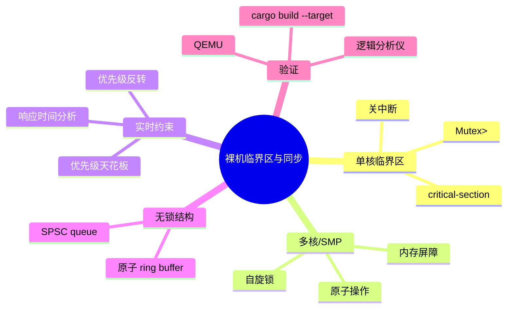
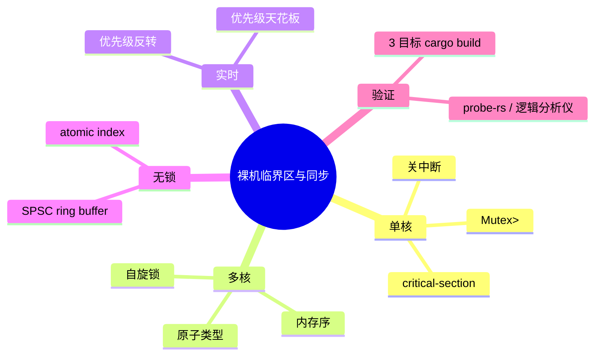

> **内容分级**: [专家级]
> **代码状态**: ⚠️ 裸机/目标平台相关代码标注 `rust,ignore`/`no_run`，host 平台无法直接编译
> **定理链**: N/A — 工程性/架构性文档
>
# 裸机临界区与同步
>
> **EN**: Critical Sections and Synchronization on Bare Metal
> **Summary**: A canonical guide to safe shared-state synchronization in single-core and multi-core bare-metal Rust: disabling interrupts, the `critical-section` crate, `Mutex<RefCell<T>>`, atomic rings, priority ceilings, and hardware-validated examples for ARM Cortex-M and RISC-V.
> **Rust 版本**: 1.97.0+ (Edition 2024)
>
> **受众**: [专家]
> **Bloom 层级**: L4
> **权威来源**: 本文件为 `concept/` 权威页。
> **A/S/P 标记**: **S+A+P** — Structure + Application + Procedure
> **双维定位**: P×Eva — 在裸机环境中选择并正确实现同步策略
> **前置概念**: [no_std 同步原语](15_no_std_synchronization_primitives.md) · [Cortex-M 与 RISC-V 中断异常模型](14_interrupt_and_exception_model.md) · [原子操作](../../03_advanced/00_concurrency/06_atomics_and_memory_ordering.md)
> **后置概念**: [RTIC vs Embassy 实时框架对比](55_rtic_vs_embassy_real_time_frameworks.md) · [裸机中断与并发模型](42_interrupts_and_concurrency_on_bare_metal.md) · [嵌入式内存布局与堆安全](29_embedded_memory_layout_and_heap_safety.md)

---

> **来源**: [critical-section crate](https://docs.rs/critical-section/) · [cortex-m crate](https://docs.rs/cortex-m/) · [riscv crate](https://docs.rs/riscv/) · [Rust Atomics and Locks](https://marabos.nl/atomics/) · [The Embedded Rust Book](https://docs.rust-embedded.org/book/) · [RTIC Book](https://rtic.rs/2/book/en/) · [Embassy Book](https://embassy.dev/book/) · [Ferrous Systems — Rust Training](https://rust-training.ferrous-systems.com/latest/book/)
>
> **横向对比**: [Rust vs C/C++ 并发模型](../../05_comparative/01_systems_languages/01_rust_vs_cpp.md) · [RTOS 与 Rust 调度模型对比](46_rtos_and_scheduling_in_rust.md)

---

## 🧠 知识结构图



## 📑 目录

- [裸机临界区与同步](#裸机临界区与同步)
  - [🧠 知识结构图](#-知识结构图)
  - [📑 目录](#-目录)
  - [一、权威定义](#一权威定义)
  - [二、单核裸机：关中断即临界区](#二单核裸机关中断即临界区)
  - [三、`critical-section` 生态标准](#三critical-section-生态标准)
  - [四、`Mutex<RefCell<T>>` 模式](#四mutexrefcellt-模式)
  - [五、无锁结构：原子 ring buffer](#五无锁结构原子-ring-buffer)
  - [六、多核与 SMP 扩展](#六多核与-smp-扩展)
  - [七、实时系统中的优先级问题](#七实时系统中的优先级问题)
  - [八、反例与失效模式](#八反例与失效模式)
  - [九、硬件实测与 CI 验证](#九硬件实测与-ci-验证)
  - [十、决策树](#十决策树)
  - [十一、相关概念](#十一相关概念)
  - [🧭 思维导图（Mindmap）](#-思维导图mindmap)

---

## 一、权威定义

> **Rust Atomics and Locks**: In bare-metal systems without an operating system, disabling interrupts is often the only way to implement a critical section on a single-core processor.

**临界区（Critical Section）**：访问共享资源的一段代码，执行期间必须保证不被并发上下文打断。在单核裸机中，通常通过临时禁止中断实现；在多核裸机中，需要自旋锁或原子操作序列。

**裸机同步原语**：在没有 OS 调度器、没有 `std::sync` 的环境中提供的并发保护机制，包括关中断临界区、原子类型、自旋锁和无锁数据结构。

判定依据：裸机中的并发主要来自中断与主循环、多核之间的交错。正确选择同步策略取决于核心数、实时性要求、共享数据大小和中断延迟预算。

---

## 二、单核裸机：关中断即临界区

在单核系统中，只要禁止中断，当前执行流就不会被 ISR 抢占，因此形成了最强同步保证。

### 2.1 ARM Cortex-M

```rust,ignore
use cortex_m::interrupt;

static mut COUNTER: u32 = 0;

fn increment() {
    interrupt::free(|_cs| {
        // 此处中断被屏蔽
        unsafe { COUNTER += 1; }
    });
}
```

### 2.2 RISC-V

```rust,ignore
use riscv::interrupt;

static mut COUNTER: u32 = 0;

fn increment() {
    interrupt::free(|| {
        unsafe { COUNTER += 1; }
    });
}
```

> **注意**：`static mut` 在 Rust 2024 中仍然可用，但在中断内外共享时极易出错；推荐使用 `critical_section::Mutex<RefCell<T>>` 或原子类型。

---

## 三、`critical-section` 生态标准

[critical-section](https://docs.rs/critical-section/) 是 Rust embedded WG 推荐的事实标准临界区抽象。它把“获取/释放临界区”的底层实现与上层 API 解耦：

- `critical_section::with(|cs| { ... })` 获取一个不可伪造的 `CriticalSection<'_>` token；
- 单核 ARM 由 `cortex-m` crate 的 `critical-section-single-core` feature 提供实现；
- 单核 RISC-V 由 `riscv` crate 的 `critical-section-single-hart` feature 提供实现；
- 多核目标由具体 HAL/BSP 提供实现。

```rust,ignore
use critical_section::Mutex;
use core::cell::RefCell;

static COUNTER: Mutex<RefCell<u32>> = Mutex::new(RefCell::new(0));

fn increment() {
    critical_section::with(|cs| {
        *COUNTER.borrow(cs).borrow_mut() += 1;
    });
}

fn read() -> u32 {
    critical_section::with(|cs| *COUNTER.borrow(cs).borrow())
}
```

### 3.1 为什么 `Mutex<RefCell<T>>`

- `Mutex` 保证“持有 token 才能访问”；
- `RefCell` 在运行期提供内部可变性；
- 组合后在单核裸机中零额外运行时开销（临界区实现就是关中断）。

---

## 四、`Mutex<RefCell<T>>` 模式

这是 Rust embedded 中最常见的共享可变状态模式：

```rust,ignore
#![no_std]

use core::cell::RefCell;
use critical_section::Mutex;

pub struct SharedState {
    pub counter: u32,
    pub flags: u8,
}

static STATE: Mutex<RefCell<SharedState>> =
    Mutex::new(RefCell::new(SharedState { counter: 0, flags: 0 }));

pub fn update_flags(new_flags: u8) {
    critical_section::with(|cs| {
        STATE.borrow(cs).borrow_mut().flags = new_flags;
    });
}

pub fn get_counter() -> u32 {
    critical_section::with(|cs| STATE.borrow(cs).borrow().counter)
}
```

**限制**：

- 不可在临界区内嵌套执行可能再次获取临界区的操作（会导致死锁或中断关闭时间过长）；
- 临界区代码应尽量短小，避免影响中断延迟。

---

## 五、无锁结构：原子 ring buffer

对于生产者/消费者场景，可以使用原子索引实现单生产者单消费者（SPSC）无锁队列：

```rust,ignore
use core::cell::UnsafeCell;
use core::sync::atomic::{AtomicUsize, Ordering};

const N: usize = 16;

struct SpscRing<T, const N: usize> {
    buffer: UnsafeCell<[T; N]>,
    head: AtomicUsize,
    tail: AtomicUsize,
}

unsafe impl<T: Send, const N: usize> Sync for SpscRing<T, N> {}

impl<T: Copy + Default, const N: usize> SpscRing<T, N> {
    const fn new() -> Self {
        Self {
            buffer: UnsafeCell::new([T::default(); N]),
            head: AtomicUsize::new(0),
            tail: AtomicUsize::new(0),
        }
    }

    fn push(&self, value: T) -> bool {
        let head = self.head.load(Ordering::Relaxed);
        let next = (head + 1) % N;
        if next == self.tail.load(Ordering::Acquire) {
            return false; // 满
        }
        unsafe { (*self.buffer.get())[head] = value };
        self.head.store(next, Ordering::Release);
        true
    }

    fn pop(&self) -> Option<T> {
        let tail = self.tail.load(Ordering::Relaxed);
        if tail == self.head.load(Ordering::Acquire) {
            return None; // 空
        }
        let value = unsafe { (*self.buffer.get())[tail] };
        self.tail.store((tail + 1) % N, Ordering::Release);
        Some(value)
    }
}
```

> **来源**: SPSC ring buffer 是嵌入式中经典的无锁模式，Michael & Scott 队列是其多生产者扩展（[ACM — Simple, Fast, and Practical Non-Blocking and Blocking Concurrent Queue Algorithms](https://dl.acm.org/doi/10.1145/248052.248106)）。

---

## 六、多核与 SMP 扩展

多核裸机不能使用关中断实现临界区，因为另一个核心仍可访问共享内存。需要：

1. **自旋锁（spinlock）**：基于原子交换或 LL/SC 指令；
2. **原子操作 + memory ordering**：`AtomicU32::fetch_add` 等；
3. **内存屏障**：确保 store/load 顺序在多核间可见。

```rust,ignore
use core::sync::atomic::{AtomicBool, Ordering};

struct SpinLock {
    locked: AtomicBool,
}

impl SpinLock {
    const fn new() -> Self {
        Self { locked: AtomicBool::new(false) }
    }

    fn lock(&self) {
        while self.locked.swap(true, Ordering::Acquire) {
            // 自旋；真实实现可插入 WFE/PAUSE
            core::hint::spin_loop();
        }
    }

    fn unlock(&self) {
        self.locked.store(false, Ordering::Release);
    }
}
```

---

## 七、实时系统中的优先级问题

### 7.1 优先级反转（Priority Inversion）

低优先级任务持有共享资源时，高优先级任务被阻塞，而中等优先级任务又抢占了低优先级任务，导致高优先级任务间接等待中等优先级任务。

### 7.2 优先级天花板协议（Priority Ceiling Protocol, PCP）

为每个资源分配一个等于所有访问该资源的任务中最高优先级的“天花板优先级”。任务访问资源时临时提升到该优先级，退出时恢复。PCP 可阻止优先级反转并保证无死锁。RTIC 框架在编译期自动实现 PCP。

---

## 八、反例与失效模式

### 反例 1：单核裸机使用自旋锁

```rust,ignore
fn bad() {
    loop {
        while LOCK.swap(true, Ordering::Acquire) {} // 自旋
        // 若同一核心已持有锁，将永远自旋
    }
}
```

### 反例 2：在临界区内执行耗时操作

```rust,ignore
critical_section::with(|_cs| {
    // 错误：临界区内阻塞等待外设，导致中断延迟不可接受
    while !peripheral.ready() {}
});
```

### 反例 3：中断嵌套导致死锁

```rust,ignore
static X: Mutex<RefCell<u32>> = Mutex::new(RefCell::new(0));

#[interrupt]
fn ISR_A() {
    critical_section::with(|cs| {
        *X.borrow(cs).borrow_mut() += 1;
        // 若 ISR_B 优先级更高且也尝试获取 X，则死锁
    });
}
```

### 反例 4：多核使用关中断临界区

```rust,ignore
// 错误：多核系统中关中断不能阻止其他核心访问共享内存
interrupt::free(|_cs| {
    SHARED += 1;
});
```

---

## 九、硬件实测与 CI 验证

本仓库 `crates/c13_embedded` 提供可编译验证的临界区示例：

```bash
# ARM Cortex-M4F
 cargo build -p c13_embedded --target thumbv7em-none-eabihf \
   --example no_std_allocators_and_panic_handlers

# ARM Cortex-M3
 cargo build -p c13_embedded --target thumbv7m-none-eabi \
   --example no_std_allocators_and_panic_handlers

# RISC-V 32-bit
 cargo build -p c13_embedded --target riscv32imac-unknown-none-elf \
   --example no_std_allocators_and_panic_handlers
```

真实硬件调试建议：

- 使用逻辑分析仪观察 ISR 与主循环的时序；
- 使用 `probe-rs` + `defmt` 输出临界区进入/退出日志；
- 通过人为触发高优先级中断验证无死锁。

---

## 十、决策树

```text
核心数？
├── 单核
│   ├── 共享状态简单 → critical-section::Mutex<RefCell<T>>
│   └── 生产者/消费者 → 原子 SPSC ring buffer
└── 多核
    ├── 简单计数器/标志 → AtomicUxx
    ├── 短临界区 → 自旋锁
    └── 复杂共享状态 → RTIC / Embassy 提供的同步原语

实时性要求？
├── 硬实时 → 优先无锁/原子，必要时 PCP
└── 软实时 → critical-section 即可，注意关闭中断时长
```

---

## 十一、相关概念

- [no_std 同步原语](15_no_std_synchronization_primitives.md)
- [裸机中断与并发模型](42_interrupts_and_concurrency_on_bare_metal.md)
- [RTIC vs Embassy 实时框架对比](55_rtic_vs_embassy_real_time_frameworks.md)
- [RTOS 与 Rust 调度模型对比](46_rtos_and_scheduling_in_rust.md)
- [嵌入式内存布局与堆安全](29_embedded_memory_layout_and_heap_safety.md)
- [原子操作](../../03_advanced/00_concurrency/06_atomics_and_memory_ordering.md)

---

## 🧭 思维导图（Mindmap）



## 来源与延伸阅读

> 以下链接按 P0（官方/语言级）、P1（学术/形式化）与 P2（社区/生态）分级，用于补全本页的国际化权威来源覆盖。

- **P0**: [The Rust Reference — Unsafe Blocks](https://doc.rust-lang.org/reference/unsafe-blocks.html)
- **P0**: [The Rust Reference — Static Items](https://doc.rust-lang.org/reference/items/static-items.html)
- **P0**: [The Rustonomicon — Atomics](https://doc.rust-lang.org/nomicon/atomics.html)
- **P0**: [The rustc Developer Guide](https://rustc-dev-guide.rust-lang.org/)
