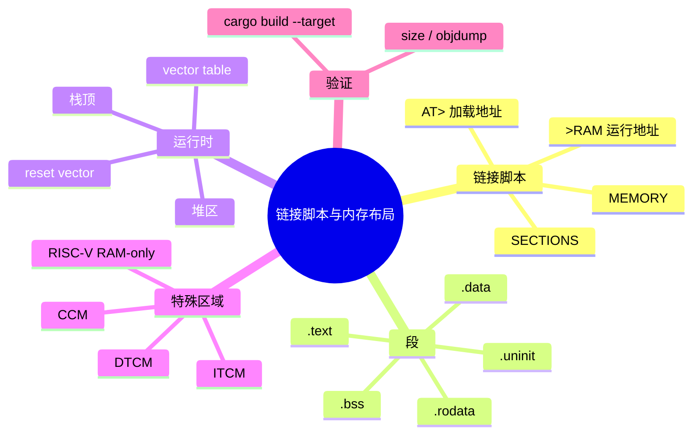
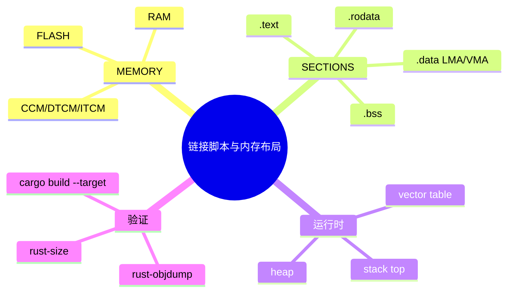

> **内容分级**: [专家级]
> **代码状态**: ⚠️ 裸机/目标平台相关代码标注 `rust,ignore`/`no_run`，host 平台无法直接编译
> **定理链**: N/A — 工程性/架构性文档
>
# 链接脚本与内存布局
>
> **EN**: Linker Scripts and Memory Layout for Embedded Rust
> **Summary**: A canonical reference for embedded linker scripts: MEMORY and SECTIONS commands, load vs. runtime addresses, `#[link_section]`, stack/heap placement, ARM CCM/DTCM/ITCM, RISC-V RAM-only boot, and build-validated examples for ARM Cortex-M and RISC-V targets.
> **Rust 版本**: 1.97.0+ (Edition 2024)
>
> **受众**: [专家]
> **Bloom 层级**: L4
> **权威来源**: 本文件为 `concept/` 权威页。
> **A/S/P 标记**: **S+P** — Structure + Procedure
> **双维定位**: P×App — 把编译产物正确映射到目标芯片的物理地址空间
> **前置概念**: [裸机启动与链接脚本](13_bare_metal_boot_linker_script.md) · [交叉编译](02_cross_compilation.md) · [嵌入式内存布局与堆安全](29_embedded_memory_layout_and_heap_safety.md)
> **后置概念**: [no_std 分配器与 panic handler](52_no_std_allocators_and_panic_handlers.md) · [裸机 Rust](47_bare_metal_rust.md) · [RISC-V 与 AVR 嵌入式 Rust 开发](21_riscv_avr_embedded.md)

---

> **来源**: [The Embedonomicon](https://docs.rust-embedded.org/embedonomicon/) · [GNU ld Manual](https://sourceware.org/binutils/docs/ld/) · [LLD Documentation](https://lld.llvm.org/) · [ARMv7-M Architecture Reference Manual](https://developer.arm.com/documentation/ddi0403/latest/) · [ARMv8-M Architecture Reference Manual](https://developer.arm.com/documentation/ddi0553/latest/) · [RISC-V Privileged Specification](https://riscv.org/technical/specifications/) · [cortex-m-rt crate](https://docs.rs/cortex-m-rt/) · [riscv-rt crate](https://docs.rs/riscv-rt/) · [Ferrocene Language Specification](https://spec.ferrocene.dev/)
>
> **横向对比**: [Rust vs C/C++ 嵌入式启动](../../05_comparative/01_systems_languages/01_rust_vs_cpp.md) · [Rust vs Zig 裸机生态](../../05_comparative/01_systems_languages/06_rust_vs_zig.md)

---

## 🧠 知识结构图



## 📑 目录

- [链接脚本与内存布局](#链接脚本与内存布局)
  - [🧠 知识结构图](#-知识结构图)
  - [📑 目录](#-目录)
  - [一、权威定义](#一权威定义)
  - [二、GNU ld / LLD 链接脚本核心](#二gnu-ld--lld-链接脚本核心)
    - [2.1 `MEMORY` 命令](#21-memory-命令)
    - [2.2 `SECTIONS` 命令](#22-sections-命令)
    - [2.3 链接器符号](#23-链接器符号)
  - [三、ARM Cortex-M 典型内存布局](#三arm-cortex-m-典型内存布局)
  - [四、RISC-V RAM-only 启动布局](#四risc-v-ram-only-启动布局)
  - [五、加载地址与运行地址分离](#五加载地址与运行地址分离)
  - [六、Rust 段属性](#六rust-段属性)
    - [6.1 `#[link_section = ".name"]`](#61-link_section--name)
    - [6.2 `#[used]` 与 `#[no_mangle]`](#62-used-与-no_mangle)
  - [七、特殊内存区域](#七特殊内存区域)
    - [7.1 ARM CCM（Core-Coupled Memory）](#71-arm-ccmcore-coupled-memory)
    - [7.2 DTCM / ITCM](#72-dtcm--itcm)
    - [7.3 栈顶与堆区](#73-栈顶与堆区)
  - [八、反例与失效模式](#八反例与失效模式)
    - [反例 1：内存区域大小与实际芯片不符](#反例-1内存区域大小与实际芯片不符)
    - [反例 2：向量表未对齐](#反例-2向量表未对齐)
    - [反例 3：`.data` 复制源地址错误](#反例-3data-复制源地址错误)
    - [反例 4：CCM 上放 DMA 缓冲区](#反例-4ccm-上放-dma-缓冲区)
  - [九、硬件实测与 CI 验证](#九硬件实测与-ci-验证)
  - [十、决策树](#十决策树)
  - [十一、相关概念](#十一相关概念)
  - [🧭 思维导图（Mindmap）](#-思维导图mindmap)

---

## 一、权威定义

> **The Embedonomicon**: The linker script is the bridge between the compiler's output and the target device's memory layout. It tells the linker where each section of the program should be placed.

**链接脚本（linker script）**：GNU ld / LLD 使用的文本脚本，通过 `MEMORY` 与 `SECTIONS` 命令描述目标地址空间的物理布局，把编译产物中的 `.text`、`.rodata`、`.data`、`.bss` 等 section 映射到 Flash、RAM 或特殊内存区域。

**加载地址（LMA）与运行地址（VMA）**：

- LMA（Load Memory Address）：程序烧录到非易失存储器（Flash）中的地址；
- VMA（Virtual Memory Address）：程序运行时在 RAM 中的地址。
`.data` 段通常 LMA 在 Flash、VMA 在 RAM，启动代码负责从 LMA 复制到 VMA。

判定依据：裸机固件能否正确启动，首先取决于链接脚本是否与实际芯片的内存映射一致；其次取决于启动代码是否正确完成 `.data` 复制和 `.bss` 清零。

---

## 二、GNU ld / LLD 链接脚本核心

### 2.1 `MEMORY` 命令

```ld
MEMORY
{
  FLASH (rx)  : ORIGIN = 0x0800_0000, LENGTH = 1024K
  RAM   (rwx) : ORIGIN = 0x2000_0000, LENGTH = 128K
}
```

- `r` = read, `w` = write, `x` = execute；
- `ORIGIN` 为区域起始地址；
- `LENGTH` 为区域大小。

### 2.2 `SECTIONS` 命令

```ld
SECTIONS
{
  .text : {
    *(.text .text.*);
  } > FLASH

  .rodata : ALIGN(4) {
    *(.rodata .rodata.*);
  } > FLASH

  .data : ALIGN(4) {
    _sdata = .;
    *(.data .data.*);
    _edata = .;
  } > RAM AT > FLASH

  .bss (NOLOAD) : ALIGN(4) {
    _sbss = .;
    *(.bss .bss.*);
    _ebss = .;
  } > RAM
}
```

### 2.3 链接器符号

启动代码通过链接器导出的符号初始化 RAM：

```rust,ignore
extern "C" {
    static mut _sdata: u8;
    static mut _edata: u8;
    static mut _sidata: u8;
    static mut _sbss: u8;
    static mut _ebss: u8;
}
```

- `_sidata`：`.data` 在 Flash 中的源地址；
- `_sdata` / `_edata`：`.data` 在 RAM 中的目标地址范围；
- `_sbss` / `_ebss`：`.bss` 在 RAM 中的范围。

---

## 三、ARM Cortex-M 典型内存布局

```ld
/* STM32F4xx 示例 */
MEMORY
{
  FLASH (rx) : ORIGIN = 0x08000000, LENGTH = 1024K
  RAM   (rwx): ORIGIN = 0x20000000, LENGTH = 128K
}

_stack_top = ORIGIN(RAM) + LENGTH(RAM);
```

启动后：

1. 从 `0x0800_0000` 取出初始 SP（`_stack_top`）和 PC（Reset_Handler）；
2. `cortex-m-rt` 将 `.data` 从 Flash 复制到 RAM；
3. 清零 `.bss`；
4. 调用 `main`。

---

## 四、RISC-V RAM-only 启动布局

部分 RISC-V 开发板或 QEMU virt 从 RAM 启动，没有独立 Flash：

```ld
MEMORY
{
  RAM (rwxa) : ORIGIN = 0x80000000, LENGTH = 128K
}

REGION_ALIAS("REGION_TEXT", RAM);
REGION_ALIAS("REGION_RODATA", RAM);
REGION_ALIAS("REGION_DATA", RAM);
REGION_ALIAS("REGION_BSS", RAM);
REGION_ALIAS("REGION_HEAP", RAM);
REGION_ALIAS("REGION_STACK", RAM);
```

> **来源**: `riscv-rt` 0.18 默认 link.x 使用 `REGION_TEXT` / `REGION_RODATA` / `REGION_DATA` / `REGION_BSS` / `REGION_HEAP` / `REGION_STACK` 这些别名，由用户 `memory.x` 提供具体区域定义。

`riscv-rt` 启动代码同样完成 `.data`/`.bss` 初始化，然后跳转到 `main`。

---

## 五、加载地址与运行地址分离

`.data` 段包含已初始化的全局变量，其初始值必须存储在 Flash 中，但运行时位于 RAM。链接脚本通过 `AT > FLASH` 指定 LMA：

```ld
.data : ALIGN(4) {
    _sdata = .;
    *(.data .data.*);
    _edata = .;
} > RAM AT > FLASH
```

启动代码：

```rust,ignore
unsafe {
    let src = &_sidata as *const u8;
    let dst = &mut _sdata as *mut u8;
    let len = &_edata as *const u8 as usize - &_sdata as *const u8 as usize;
    core::ptr::copy_nonoverlapping(src, dst, len);

    let bss_start = &mut _sbss as *mut u8;
    let bss_len = &_ebss as *const u8 as usize - &_sbss as *const u8 as usize;
    core::ptr::write_bytes(bss_start, 0, bss_len);
}
```

---

## 六、Rust 段属性

### 6.1 `#[link_section = ".name"]`

把变量或函数放到指定 section：

```rust,ignore
#[link_section = ".rodata.config"]
static CONFIG: [u8; 4] = [0x01, 0x02, 0x03, 0x04];

#[link_section = ".noinit"]
static mut PERSISTENT: u32 = 0;
```

### 6.2 `#[used]` 与 `#[no_mangle]`

```rust,ignore
#[used]
#[no_mangle]
#[link_section = ".bootloader_marker"]
static BOOT_MARKER: u32 = 0xDEAD_BEEF;
```

- `#[used]`：防止链接器因 `--gc-sections` 丢弃该符号；
- `#[no_mangle]`：保持符号名不变，便于链接脚本或外部代码引用。

---

## 七、特殊内存区域

### 7.1 ARM CCM（Core-Coupled Memory）

CCM 是 Cortex-M4/M7 上的一块快速 RAM，但通常**不可被 DMA 访问**。把 DMA 缓冲区错误地放到 CCM 会导致静默数据错误。

```ld
MEMORY
{
  RAM (rwx) : ORIGIN = 0x20000000, LENGTH = 128K
  CCM (rw)  : ORIGIN = 0x10000000, LENGTH = 64K
}

SECTIONS
{
  .ccm (NOLOAD) : { *(.ccm .ccm.*); } > CCM
}
```

### 7.2 DTCM / ITCM

- ITCM（Instruction Tightly Coupled Memory）：用于存放时间关键代码；
- DTCM（Data Tightly Coupled Memory）：用于存放时间关键数据。

### 7.3 栈顶与堆区

链接脚本通常导出 `_stack_top` 或 `_stack_start`，运行时初始化 SP。堆区可由分配器在启动时从 `.bss` 末端到栈底之间划分。

---

## 八、反例与失效模式

### 反例 1：内存区域大小与实际芯片不符

```ld
RAM (rwx): ORIGIN = 0x20000000, LENGTH = 256K  /* 错误：实际只有 128K */
```

结果：链接成功，但运行到高地址时触发 HardFault。

### 反例 2：向量表未对齐

Cortex-M 要求向量表 256 字节对齐（具体取决于中断数量）。若链接脚本使 `.text` 起始地址未对齐，启动可能失败。

### 反例 3：`.data` 复制源地址错误

启动代码若误用 `_sdata` 作为复制源，会把 RAM 中的垃圾复制到 RAM，导致初始化值错误。

### 反例 4：CCM 上放 DMA 缓冲区

```rust,ignore
#[link_section = ".ccm"]
static mut DMA_BUF: [u8; 256] = [0; 256];
// 若 CCM 不支持 DMA，外设将读不到数据
```

---

## 九、硬件实测与 CI 验证

本仓库 `crates/c13_embedded/build.rs` 在交叉编译时自动生成 `memory.x`，支持 ARM 与 RISC-V 目标：

```bash
# ARM Cortex-M4F
 cargo build -p c13_embedded --target thumbv7em-none-eabihf \
   --example no_std_allocators_and_panic_handlers

# ARM Cortex-M3
 cargo build -p c13_embedded --target thumbv7m-none-eabi \
   --example no_std_qemu_blinky

# RISC-V 32-bit
 cargo build -p c13_embedded --target riscv32imac-unknown-none-elf \
   --example riscv_minimal_blinky
```

验证链接结果的常用工具：

```bash
# 查看 section 大小与地址
rust-size target/thumbv7em-none-eabihf/debug/examples/no_std_allocators_and_panic_handlers

# 查看反汇编
rust-objdump -d target/thumbv7em-none-eabihf/debug/examples/no_std_allocators_and_panic_handlers

# 查看符号地址
rust-nm target/thumbv7em-none-eabihf/debug/examples/no_std_allocators_and_panic_handlers | grep _stack
```

---

## 十、决策树

```text
目标是否有独立 Flash？
├── 是（ARM Cortex-M 等）→ MEMORY { FLASH; RAM; }，.data AT > FLASH
└── 否（RISC-V RAM 启动等）→ REGION_ALIAS 全部指向 RAM

是否需要 DMA？
├── 是 → 确保 DMA 缓冲区不在 CCM/ITCM
└── 否 → 可利用 CCM 做快速数据/栈

是否需要栈溢出检测？
├── 是 → 链接脚本中精确标定栈底，运行时填充哨兵值
└── 否 → 栈顶 = ORIGIN(RAM) + LENGTH(RAM)
```

---

## 十一、相关概念

- [裸机启动与链接脚本](13_bare_metal_boot_linker_script.md)
- [嵌入式内存布局与堆安全](29_embedded_memory_layout_and_heap_safety.md)
- [no_std 分配器与 panic handler](52_no_std_allocators_and_panic_handlers.md)
- [RISC-V 与 AVR 嵌入式 Rust 开发](21_riscv_avr_embedded.md)
- [裸机 Rust](47_bare_metal_rust.md)
- [Cortex-M 与 RISC-V 中断异常模型](14_interrupt_and_exception_model.md)

---

## 🧭 思维导图（Mindmap）


