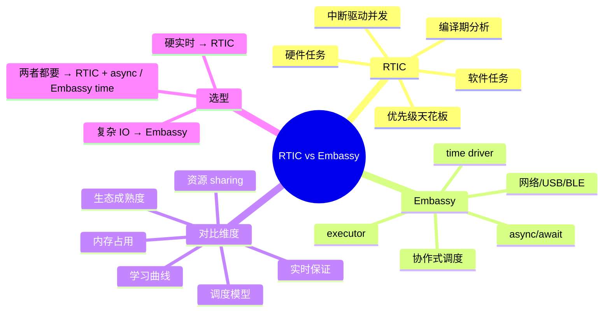
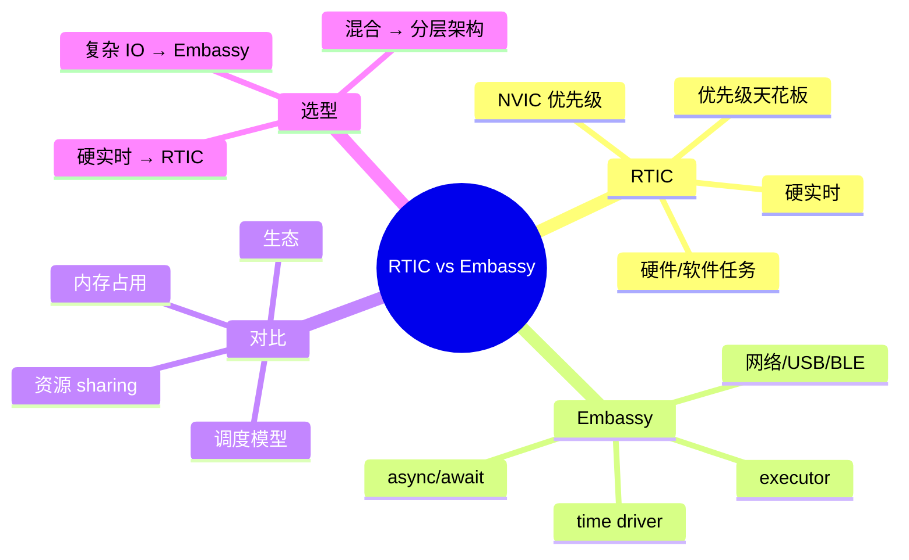

> **内容分级**: [专家级]
> **代码状态**: ⚠️ 目标平台相关代码标注 `rust,ignore`/`no_run`，host 平台无法直接编译
> **定理链**: N/A — 架构/工程性文档
>
# RTIC 与 Embassy 实时框架对比
>
> **EN**: RTIC vs Embassy: Real-Time Frameworks in Rust
> **Summary**: A comparative canonical reference for RTIC and Embassy in embedded Rust: scheduling models, resource sharing, timing guarantees, hardware abstraction, memory footprint, and selection criteria for bare-metal real-time systems.
> **Rust 版本**: 1.97.0+ (Edition 2024)
>
> **受众**: [专家]
> **Bloom 层级**: L4
> **权威来源**: 本文件为 `concept/` 权威页。
> **A/S/P 标记**: **S+A** — Structure + Application
> **双维定位**: P×Eva — 在硬实时与异步并发之间为具体项目选择合适框架
> **前置概念**: [Embassy 异步框架深度解析](34_embassy_framework_deep_dive.md) · [RTIC 实时任务调度框架深度解析](35_rtic_framework_deep_dive.md) · [裸机与嵌入式中的 Async](11_async_no_std_embedded.md) · [临界区与裸机同步](53_critical_sections_and_sync_on_bare_metal.md)
> **后置概念**: [RTOS 与 Rust 调度模型对比](46_rtos_and_scheduling_in_rust.md) · [嵌入式 RTOS 与安全关键框架对比](26_embedded_rtos_and_safety_critical_frameworks.md) · [嵌入式网络与 IoT 协议](31_embedded_networking_and_iot_protocols.md)

---

> **来源**: [RTIC Book](https://rtic.rs/2/book/en/) · [RTIC GitHub](https://github.com/rtic-rs/rtic) · [RTIC on crates.io](https://crates.io/crates/rtic) · [RTIC docs.rs](https://docs.rs/rtic) · [Embassy Book](https://embassy.dev/book/) · [Embassy GitHub](https://github.com/embassy-rs/embassy) · [Embassy Executor on crates.io](https://crates.io/crates/embassy-executor) · [Embassy docs.rs](https://docs.rs/embassy-executor) · [The Embedded Rust Book](https://docs.rust-embedded.org/book/) · [Rust Embedded Working Group](https://github.com/rust-embedded/wg) · [Ferrous Systems — Rust Training](https://rust-training.ferrous-systems.com/latest/book/) · [Awesome Embedded Rust](https://github.com/rust-embedded/awesome-embedded-rust) · [Rust Reference](https://doc.rust-lang.org/reference/)
>
> **横向对比**: [RTOS 与 Rust 调度模型对比](46_rtos_and_scheduling_in_rust.md) · [裸机 Rust](47_bare_metal_rust.md) · [Rust vs Ada/SPARK](../../05_comparative/01_systems_languages/07_rust_vs_ada_spark.md)

---

## 🧠 知识结构图



## 📑 目录

- [RTIC 与 Embassy 实时框架对比](#rtic-与-embassy-实时框架对比)
  - [🧠 知识结构图](#-知识结构图)
  - [📑 目录](#-目录)
  - [一、权威定义](#一权威定义)
  - [二、RTIC 核心模型](#二rtic-核心模型)
    - [2.1 任务类型](#21-任务类型)
    - [2.2 资源模型](#22-资源模型)
    - [2.3 优先级天花板协议](#23-优先级天花板协议)
  - [三、Embassy 核心模型](#三embassy-核心模型)
    - [3.1 Executor 与任务](#31-executor-与任务)
    - [3.2 异步原语](#32-异步原语)
    - [3.3 Time driver](#33-time-driver)
  - [四、维度对比](#四维度对比)
  - [五、资源与同步机制对比](#五资源与同步机制对比)
    - [5.1 RTIC：`lock` + 优先级提升](#51-rticlock--优先级提升)
    - [5.2 Embassy：`embassy-sync` 原语](#52-embassyembassy-sync-原语)
  - [六、内存占用与启动开销](#六内存占用与启动开销)
    - [6.1 RTIC](#61-rtic)
    - [6.2 Embassy](#62-embassy)
  - [七、典型代码形态](#七典型代码形态)
    - [7.1 RTIC：周期任务 + 共享计数器](#71-rtic周期任务--共享计数器)
    - [7.2 Embassy：周期闪烁 + 网络监听](#72-embassy周期闪烁--网络监听)
  - [八、反例与失效模式](#八反例与失效模式)
    - [反例 1：在 Embassy 中做硬实时控制](#反例-1在-embassy-中做硬实时控制)
    - [反例 2：在 RTIC 软件任务中 await 阻塞操作](#反例-2在-rtic-软件任务中-await-阻塞操作)
    - [反例 3：混合 RTIC 与 Embassy 而没有统一 time driver](#反例-3混合-rtic-与-embassy-而没有统一-time-driver)
    - [反例 4： Embassy 任务 arena 过小](#反例-4-embassy-任务-arena-过小)
  - [九、硬件实测与 CI 验证](#九硬件实测与-ci-验证)
  - [十、决策树](#十决策树)
  - [十一、相关概念](#十一相关概念)
  - [🧭 思维导图（Mindmap）](#-思维导图mindmap)

---

## 一、权威定义

> **RTIC Book**: RTIC is a hardware-accelerated Rust concurrency runtime for single-core embedded systems. It uses the hardware interrupt priority mechanism to provide scheduling, and leverages Rust's ownership and type system to guarantee memory safety and deadlock freedom.

> **Embassy Book**: Embassy is a modern asynchronous execution framework, designed for embedded devices. It allows you to write firmware as a set of concurrent tasks that run asynchronously.

**RTIC（Real-Time Interrupt-driven Concurrency）**：基于硬件中断优先级的单核嵌入式并发框架。它将任务映射到 NVIC 优先级，将共享资源映射到 Rust 所有权，在编译期完成资源冲突分析，实现零运行时调度开销和硬实时保证。

**Embassy**：基于 `async/await` 的协作式嵌入式运行时。它提供 executor、time driver、网络栈、USB/BLE 协议栈等，适合复杂 IO 驱动和事件驱动应用。

判定依据：选择框架的核心在于调度模型需求——硬实时、可预测响应时间优先选 RTIC；复杂异步状态机、网络协议栈优先选 Embassy。

---

## 二、RTIC 核心模型

### 2.1 任务类型

- **硬件任务（Hardware task）**：直接绑定硬件中断（`#[task(binds = TIM2)]`），中断触发时立即执行；
- **软件任务（Software task）**：由 `rtic-monotonics` 的单调时钟或 `spawn` 触发，调度到某个 NVIC 优先级；
- **空闲任务（Idle task）**：最低优先级循环，可被任何任务抢占。

### 2.2 资源模型

```rust,ignore
#[rtic::app(device = stm32f4xx_hal::pac, peripherals = true)]
mod app {
    #[shared]
    struct Shared {
        counter: u32,
    }

    #[local]
    struct Local {
        state: u8,
    }

    #[init]
    fn init(cx: init::Context) -> (Shared, Local) { /* ... */ }

    #[task(binds = TIM2, shared = [counter])]
    fn tick(cx: tick::Context) {
        cx.shared.counter.lock(|c| *c += 1);
    }
}
```

### 2.3 优先级天花板协议

RTIC 自动为每个共享资源计算优先级天花板（所有访问该资源的任务中的最高优先级）。`lock` 时临时提升任务优先级，退出时恢复。这保证了：

- 无优先级反转；
- 无死锁；
- 响应时间可分析。

---

## 三、Embassy 核心模型

### 3.1 Executor 与任务

```rust,ignore
#[embassy_executor::main]
async fn main(_spawner: Spawner) {
    let mut led = Output::new(p.PA5, Level::Low, Speed::Low);
    let mut ticker = Ticker::every(Duration::from_millis(500));

    loop {
        led.toggle();
        ticker.next().await;
    }
}
```

### 3.2 异步原语

- `Timer::after(duration).await`：单次延时；
- `Ticker`：周期性触发；
- `Signal` / `Channel` / `Mutex`：任务间同步；
- `embassy-net`：基于 `smoltcp` 的 TCP/UDP 网络栈。

### 3.3 Time driver

Embassy 需要一个硬件定时器作为 time driver，为所有异步延时提供时间基准。不同芯片通过 `embassy-stm32` / `embassy-nrf` / `embassy-rp` 等 HAL 提供具体实现。

---

## 四、维度对比

| 维度 | RTIC | Embassy |
|---|---|---|
| **调度模型** | 抢占式，基于 NVIC 优先级 | 协作式，基于 executor poll |
| **任务类型** | 硬件任务 + 软件任务 + 空闲任务 | async task |
| **实时保证** | 硬实时，响应时间可分析 | 软实时，依赖协作式调度 |
| **资源 sharing** | `#[shared]` + `lock`，编译期 PCP | `embassy-sync::Mutex` / `Channel` |
| **内存占用** | 静态分配，无堆 | 静态任务 arena，可配置大小 |
| **学习曲线** | 需理解 NVIC 优先级与 PCP | 需理解 async/await 与 Pin |
| **生态** | 实时控制、电机驱动、传感器融合 | 网络、USB、BLE、复杂状态机 |
| **多核支持** | RTIC 2 开始支持多核（SMP） | Embassy 通过多 executor 支持多核 |

---

## 五、资源与同步机制对比

### 5.1 RTIC：`lock` + 优先级提升

```rust,ignore
#[task(binds = USART1, shared = [buffer])]
fn usart1(cx: usart1::Context) {
    cx.shared.buffer.lock(|buf| buf.push(byte));
}
```

优点：无运行时锁对象，零额外内存开销。

### 5.2 Embassy：`embassy-sync` 原语

```rust,ignore
use embassy_sync::mutex::Mutex;
use embassy_sync::blocking_mutex::raw::ThreadModeRawMutex;

static BUFFER: Mutex<ThreadModeRawMutex, RefCell<Vec<u8>>> =
    Mutex::new(RefCell::new(Vec::new()));

async fn producer() {
    let mut buf = BUFFER.lock().await;
    buf.borrow_mut().push(1);
}
```

优点：与 async 生态无缝集成，适合跨任务长持有。

---

## 六、内存占用与启动开销

### 6.1 RTIC

- 所有任务与资源在编译期静态分配；
- 无动态堆分配；
- 运行时仅保存/恢复寄存器上下文。

### 6.2 Embassy

- 任务 arena 大小在编译期配置（`embassy-executor` feature）；
- 每个 Future 占用栈/静态空间取决于状态机大小；
- `embassy-net` 等协议栈会占用较多 RAM。

---

## 七、典型代码形态

### 7.1 RTIC：周期任务 + 共享计数器

```rust,ignore
#[rtic::app(device = stm32f4xx_hal::pac, peripherals = true, dispatchers = [TIM3])]
mod app {
    use rtic_monotonics::systick::*;

    #[shared]
    struct Shared { counter: u32 }

    #[local]
    struct Local {}

    #[init]
    fn init(cx: init::Context) -> (Shared, Local) {
        let _ = Systick::start(cx.core.SYST, 168_000_000);
        tick::spawn().ok();
        (Shared { counter: 0 }, Local {})
    }

    #[task(shared = [counter])]
    async fn tick(cx: tick::Context) {
        loop {
            Systick::delay(1000.millis()).await;
            cx.shared.counter.lock(|c| *c += 1);
        }
    }
}
```

### 7.2 Embassy：周期闪烁 + 网络监听

```rust,ignore
#[embassy_executor::main]
async fn main(spawner: Spawner) {
    let p = embassy_stm32::init(Default::default());
    let led = Output::new(p.PA5, Level::Low, Speed::Low);

    spawner.spawn(blink(led)).unwrap();
    spawner.spawn(net_task()).unwrap();
}

#[embassy_executor::task]
async fn blink(mut led: Output<'static>) {
    loop {
        led.toggle();
        Timer::after(Duration::from_millis(500)).await;
    }
}
```

---

## 八、反例与失效模式

### 反例 1：在 Embassy 中做硬实时控制

Embassy 是协作式调度，如果某个任务长时间不 yield，其他任务会错过截止期。

```rust,ignore
#[embassy_executor::task]
async fn bad() {
    loop {
        // 错误：忙等待，不 await
        while !sensor.ready() {}
    }
}
```

### 反例 2：在 RTIC 软件任务中 await 阻塞操作

RTIC 软件任务虽然支持 async，但不应在临界区内或高优先级任务中执行长等待。

### 反例 3：混合 RTIC 与 Embassy 而没有统一 time driver

两者使用不同的 time driver 会导致时间基准不一致，延时行为难以预测。

### 反例 4： Embassy 任务 arena 过小

```toml
[dependencies]
embassy-executor = { version = "0.6", features = ["task-arena-size-32768"] }
```

若 arena 过小，动态 spawn 会失败。

---

## 九、硬件实测与 CI 验证

本仓库 `crates/c13_embedded` 的 `real-hardware-demos` 目录包含 RTIC 与 Embassy 真实硬件示例：

```bash
# RTIC demo（需对应芯片支持）
cd crates/c13_embedded/real-hardware-demos/rtic-demo
cargo build --release

# Embassy demo（需对应芯片支持）
cd crates/c13_embedded/real-hardware-demos/embassy-demo
cargo build --release
```

对于无真实硬件的 CI，可通过 `--target` 验证编译：

```bash
# 验证 RTIC 示例能否针对 thumbv7em 编译
cargo build -p c13_embedded --target thumbv7em-none-eabihf --example cortex_m_minimal_blinky

# 验证 Embassy 相关依赖在 host 上 check（需 feature 控制）
cargo check -p c13_embedded
```

> **说明**：RTIC 与 Embassy 依赖具体芯片 HAL，本仓库为避免 host 构建失败，将相关模块配置为仅在非 ARM/RISC-V 裸机目标外编译。真实硬件项目应添加对应 `embassy-stm32` / `embassy-nrf` / `embassy-rp` 或 `rtic-monotonics` 依赖。

---

## 十、决策树

```text
应用主要需求？
├── 硬实时控制、电机、传感器融合
│   └── RTIC（优先级天花板、响应时间可分析）
├── 复杂 IO、网络、USB、BLE、事件状态机
│   └── Embassy（async/await、丰富协议栈）
├── 两者都需要
│   ├── 以硬实时为主 → RTIC + rtic-monotonics async
│   └── 以复杂 IO 为主 → Embassy + 高优先级中断处理关键路径
└── 极简裸机
    └── 直接 cortex-m-rt / riscv-rt + 中断 + critical-section
```

---

## 十一、相关概念

- [RTIC 实时任务调度框架深度解析](35_rtic_framework_deep_dive.md)
- [Embassy 异步框架深度解析](34_embassy_framework_deep_dive.md)
- [RTOS 与 Rust 调度模型对比](46_rtos_and_scheduling_in_rust.md)
- [裸机与嵌入式中的 Async](11_async_no_std_embedded.md)
- [临界区与裸机同步](53_critical_sections_and_sync_on_bare_metal.md)
- [嵌入式 RTOS 与安全关键框架对比](26_embedded_rtos_and_safety_critical_frameworks.md)

---

## 🧭 思维导图（Mindmap）



---

## 来源与延伸阅读

### P1 学术/形式化来源

- [Eriksson et al. — Real-time for the masses, step 1 (IEEE SIES 2013)](https://ieeexplore.ieee.org/document/6601482)

### P2 社区/生态来源

- [RTIC Book](https://rtic.rs/2/book/en/)
- [Embassy Book](https://embassy.dev/book/)
- [RTIC on docs.rs](https://docs.rs/rtic/latest/rtic/)
- [embassy-executor on docs.rs](https://docs.rs/embassy-executor/latest/embassy_executor/)
- [rtic-rs/rtic on GitHub](https://github.com/rtic-rs/rtic)
- [embassy-rs/embassy on GitHub](https://github.com/embassy-rs/embassy)
