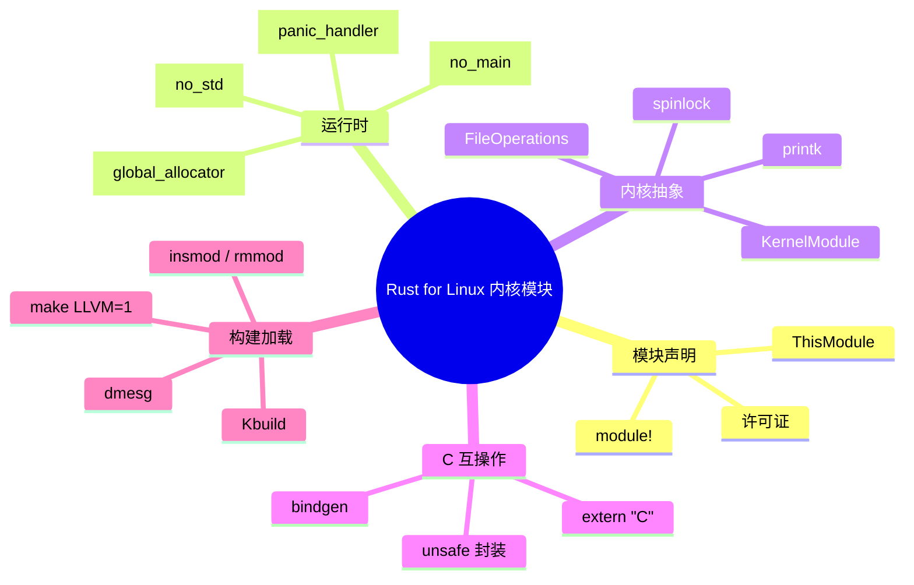
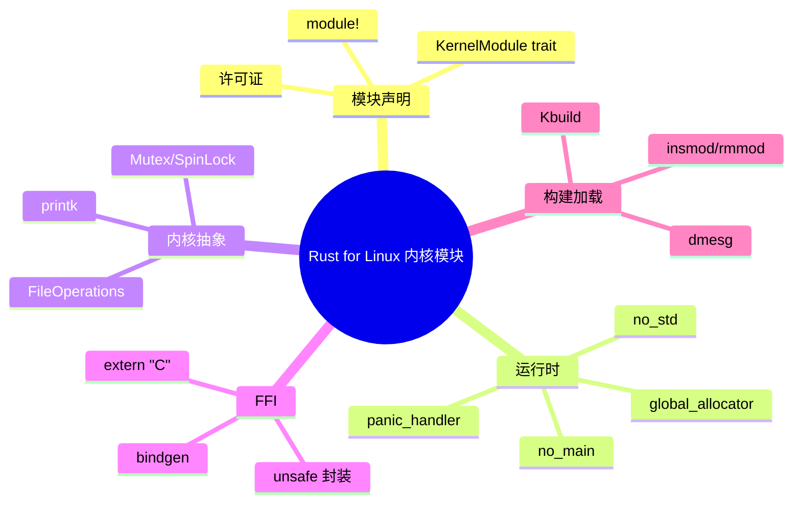

> **内容分级**: [专家级]
> **代码状态**: ⚠️ 内核模块代码标注 `rust,ignore`/`no_run`，host 平台无法直接编译
> **定理链**: N/A — 工程性/架构性文档
>
# Rust for Linux 内核模块基础
>
> **EN**: Rust for Linux Kernel Module Basics
> **Summary**: A hands-on canonical introduction to writing Linux kernel modules in Rust: module declaration, no_std/no_main runtime, panic handler, alloc configuration, C FFI bindings, kernel abstractions, and build/insmod/rmmod workflows aligned with the upstream Rust for Linux project.
> **Rust 版本**: 1.97.0+ (Edition 2024)
>
> **受众**: [专家]
> **Bloom 层级**: L4
> **权威来源**: 本文件为 `concept/` 权威页。
> **A/S/P 标记**: **S+A+P** — Structure + Application + Procedure
> **双维定位**: P×App — 在 Linux 内核中编写、编译并加载最小 Rust 模块
> **前置概念**: [Rust for Linux：操作系统内核中的内存安全](../../07_future/04_research_and_experimental/04_rust_for_linux.md) · [Unsafe Rust](../../03_advanced/02_unsafe/01_unsafe.md) · [FFI](../../03_advanced/04_ffi/01_rust_ffi.md) · [no_std 与裸机 Rust](38_no_std_bare_metal_rust.md)
> **后置概念**: [操作系统内核开发](05_os_kernel.md) · [C-to-Rust 翻译生态](08_c_to_rust_translation.md) · [安全关键系统](43_rust_safety_critical_systems.md)

---

> **来源**: [Rust for Linux](https://rust-for-linux.com/) · [Linux Kernel Rust Documentation](https://www.kernel.org/doc/html/latest/rust/index.html) · [Rust for Linux Samples](https://github.com/Rust-for-Linux/linux/tree/rust-next/samples/rust) · [LWN — Rust in the Linux Kernel](https://lwn.net/Articles/829858/) · [Google Security Blog — Rust in Linux](https://security.googleblog.com/2021/04/rust-in-linux-kernel.html) · [The Rust Reference — no_std](https://doc.rust-lang.org/reference/names/preludes.html#the-no_std-attribute) · [The Embedonomicon](https://docs.rust-embedded.org/embedonomicon/)
>
> **横向对比**: [Rust vs C/C++ 内核开发](../../05_comparative/01_systems_languages/01_rust_vs_cpp.md) · [Rust vs Ada/SPARK](../../05_comparative/01_systems_languages/07_rust_vs_ada_spark.md)

---

## 🧠 知识结构图



## 📑 目录

- [Rust for Linux 内核模块基础](#rust-for-linux-内核模块基础)
  - [🧠 知识结构图](#-知识结构图)
  - [📑 目录](#-目录)
  - [一、权威定义](#一权威定义)
  - [二、最小模块结构](#二最小模块结构)
    - [2.1 `module!` 宏](#21-module-宏)
  - [三、`#![no_std]` 与 `#[no_main]` 运行时](#三no_std-与-no_main-运行时)
    - [3.1 Panic handler](#31-panic-handler)
    - [3.2 `no_main`](#32-no_main)
  - [四、分配器与 `alloc`](#四分配器与-alloc)
    - [4.1 分配器限制](#41-分配器限制)
  - [五、内核抽象层：模块、文件操作、锁](#五内核抽象层模块文件操作锁)
    - [5.1 文件操作](#51-文件操作)
    - [5.2 锁](#52-锁)
    - [5.3 日志](#53-日志)
  - [六、与 C 内核 API 的 FFI](#六与-c-内核-api-的-ffi)
    - [6.1 手动绑定](#61-手动绑定)
    - [6.2 bindgen 生成绑定](#62-bindgen-生成绑定)
  - [七、构建、加载与卸载](#七构建加载与卸载)
    - [7.1 构建环境](#71-构建环境)
    - [7.2 加载模块](#72-加载模块)
    - [7.3 调试](#73-调试)
  - [八、反例与失效模式](#八反例与失效模式)
    - [反例 1：在内核中使用 `std`](#反例-1在内核中使用-std)
    - [反例 2：在中断上下文使用可能睡眠的锁](#反例-2在中断上下文使用可能睡眠的锁)
    - [反例 3：未处理 `Result` 导致 panic](#反例-3未处理-result-导致-panic)
    - [反例 4：忘记在 `drop` 中清理资源](#反例-4忘记在-drop-中清理资源)
  - [九、CI 验证与测试策略](#九ci-验证与测试策略)
  - [十、决策树](#十决策树)
  - [十一、相关概念](#十一相关概念)
  - [🧭 思维导图（Mindmap）](#-思维导图mindmap)

---

## 一、权威定义

> **Linux Kernel Rust Documentation**: Rust support in the Linux kernel allows writing kernel code, including modules and drivers, with the memory safety guarantees of Rust while retaining the ability to interface with the existing C codebase.

**Rust for Linux**：将 Rust 引入 Linux 内核开发的项目。它提供内核 Rust 抽象层、C 绑定生成、模块宏和构建集成，使开发者能够用 Rust 编写内核模块和驱动程序。

**内核模块（Kernel module）**：可在运行时被加载到内核地址空间的二进制对象（`.ko`）。与裸机程序类似，内核模块运行在 `no_std` 环境中，但由 Linux 内核提供调度、内存管理、同步原语等 OS 服务。

判定依据：一个可加载的 Rust 内核模块必须声明模块元数据、提供 panic handler、可选全局分配器，并实现 `KernelModule` trait。

---

## 二、最小模块结构

```rust,ignore
// SPDX-License-Identifier: GPL-2.0
#![no_std]
#![no_main]

use kernel::prelude::*;

module! {
    type: RustMinimal,
    name: b"rust_minimal",
    author: b"Rust for Linux",
    description: b"Minimal Rust kernel module",
    license: b"GPL v2",
}

struct RustMinimal;

impl kernel::Module for RustMinimal {
    fn init(_module: &'static ThisModule) -> Result<Self> {
        pr_info!("Rust minimal module initialized\n");
        Ok(RustMinimal)
    }
}

impl Drop for RustMinimal {
    fn drop(&mut self) {
        pr_info!("Rust minimal module exiting\n");
    }
}
```

### 2.1 `module!` 宏

`module!` 宏展开为：

- 模块元数据（name, author, license 等）；
- `init` / `exit` 入口的 C 兼容 shim；
- `no_mangle` 导出符号供 `modprobe`/`insmod` 使用。

---

## 三、`#![no_std]` 与 `#[no_main]` 运行时

内核模块与裸机程序类似，不链接 `std`，也不使用默认 `main`：

```rust,ignore
#![no_std]
#![no_main]
```

### 3.1 Panic handler

Rust for Linux 提供 `kernel::panic` 相关支持。最小实现：

```rust,ignore
use core::panic::PanicInfo;

#[panic_handler]
fn panic(info: &PanicInfo) -> ! {
    // 内核中不能调用 printk 进入 panic 路径，通常调用 kernel oops 辅助函数
    kernel::bug_with_message!("Rust panic: {:?}", info);
    loop {}
}
```

> **注意**：实际 Rust for Linux 源码通过 `kernel` crate 提供统一的 panic handler，用户模块通常无需重复定义。

### 3.2 `no_main`

模块入口由 `module!` 宏和 `KernelModule::init` 定义，不需要 `fn main()`。

---

## 四、分配器与 `alloc`

内核 Rust 代码可以选择性使用 `alloc`。Rust for Linux 提供基于内核 `kmalloc`/`kfree` 的全局分配器。

```rust,ignore
#![no_std]
#![feature(allocator_api)]

extern crate alloc;

use alloc::vec::Vec;

#[global_allocator]
static ALLOCATOR: kernel::KernelAllocator = kernel::KernelAllocator;

fn example() -> Result<(), Error> {
    let mut v = Vec::new();
    v.push(1);
    v.push(2);
    Ok(())
}
```

### 4.1 分配器限制

- 内核分配可能睡眠（GFP_KERNEL）或不可睡眠（GFP_ATOMIC）；
- 中断上下文必须使用 GFP_ATOMIC 类分配；
- Rust `alloc` 默认接口不区分 GFP 标志，因此在内核中应谨慎使用 `Vec::push` 等隐式分配。

---

## 五、内核抽象层：模块、文件操作、锁

### 5.1 文件操作

```rust,ignore
use kernel::file_operations::{FileOperations, File, IoctlCommand};
use kernel::sync::Mutex;

struct RustDevice {
    state: Mutex<u32>,
}

#[vtable]
impl FileOperations for RustDevice {
    fn open(_device: &Self, _file: &File) -> Result<Self::Data> {
        Ok(())
    }

    fn read(_device: &Self, _file: &File, _data: &mut UserSlicePtrWriter, _offset: u64) -> Result<usize> {
        Ok(0)
    }
}
```

### 5.2 锁

Rust for Linux 提供 `kernel::sync::Mutex`、`SpinLock` 等封装，内部调用内核的 `mutex_lock` / `spin_lock`，并在 Drop 时自动释放。

```rust,ignore
use kernel::sync::Mutex;

static COUNTER: Mutex<u32> = Mutex::new(0);

fn increment() {
    let mut guard = COUNTER.lock();
    *guard += 1;
}
```

### 5.3 日志

```rust,ignore
pr_info!("Hello from Rust module\n");
pr_err!("An error occurred: {:?}\n", err);
```

---

## 六、与 C 内核 API 的 FFI

### 6.1 手动绑定

```rust,ignore
extern "C" {
    fn some_kernel_fn(arg: c_int) -> c_int;
}

pub fn safe_wrapper(arg: i32) -> i32 {
    // 前置条件检查
    unsafe { some_kernel_fn(arg) }
}
```

### 6.2 bindgen 生成绑定

Rust for Linux 通过 Kbuild 集成 bindgen，从 C 头文件生成 `bindings.rs`：

```makefile
# Kbuild
obj-$(CONFIG_RUST_MY_MODULE) += my_module.o
my_module-objs := my_module.rust.o
```

```rust,ignore
// 生成的绑定中通常包含
use bindings::*;
```

---

## 七、构建、加载与卸载

### 7.1 构建环境

需要配置好 Rust for Linux 内核源码树：

```bash
# 克隆 Rust for Linux 分支
git clone https://github.com/Rust-for-Linux/linux.git
cd linux
make LLVM=1 rustavailable      # 检查 Rust 支持
make LLVM=1 menuconfig         # 启用 CONFIG_RUST / CONFIG_SAMPLE_RUST
make LLVM=1 -j$(nproc)
```

### 7.2 加载模块

```bash
# 复制编译出的 .ko 到目标机
sudo insmod rust_minimal.ko
sudo dmesg | tail

# 卸载
sudo rmmod rust_minimal
```

### 7.3 调试

```bash
sudo dmesg -w &
sudo insmod rust_minimal.ko
sudo rmmod rust_minimal
```

---

## 八、反例与失效模式

### 反例 1：在内核中使用 `std`

```rust,ignore
use std::vec::Vec; // 错误：内核中没有 std
```

### 反例 2：在中断上下文使用可能睡眠的锁

```rust,ignore
fn irq_handler() {
    let guard = COUNTER.lock(); // 错误：若 COUNTER 是 Mutex，可能睡眠
}
```

应使用 `SpinLock` 或 `RawSpinLock`。

### 反例 3：未处理 `Result` 导致 panic

内核 panic 会导致系统崩溃或 oops。所有可能失败的内核 API 返回值都应显式处理。

### 反例 4：忘记在 `drop` 中清理资源

```rust,ignore
impl Drop for MyModule {
    fn drop(&mut self) {
        // 错误：未释放已注册的字符设备
    }
}
```

---

## 九、CI 验证与测试策略

由于 Rust for Linux 需要完整的内核源码树和特定工具链，本地 CI 通常采用以下策略：

1. **编译检查**：在已配置的内核源码树中运行 `make LLVM=1`；
2. **QEMU 启动测试**：使用 `rust-for-linux/linux` 提供的 QEMU 脚本加载模块并检查 `dmesg`；
3. **静态分析**：运行 `cargo check` 于模块源码（需 stub 化的 kernel crate）。

本仓库不直接包含完整内核构建环境，但提供概念性示例与构建命令模板。实际验证应在 Rust for Linux 源码树中进行：

```bash
# 在 Rust for Linux 源码树中
make LLVM=1 samples/rust/rust_minimal.ko
```

---

## 十、决策树

```text
是否在内核中引入 Rust？
├── 是 → 是否有现成 C 驱动需要逐步替换？
│   ├── 是 → 从 C FFI 封装开始，逐步重写核心路径
│   └── 否 → 直接编写新 Rust 模块
└── 否 → 评估用户态 Rust 方案（eBPF / 用户空间驱动）

模块复杂度？
├── 简单日志/演示 → rust_minimal 模板
├── 字符设备 → 实现 FileOperations
└── 网络/块设备 → 参考 rust-net / rust-block 示例
```

---

## 十一、相关概念

- [Rust for Linux：操作系统内核中的内存安全](../../07_future/04_research_and_experimental/04_rust_for_linux.md)
- [操作系统内核开发](05_os_kernel.md)
- [C-to-Rust 翻译生态](08_c_to_rust_translation.md)
- [Unsafe Rust](../../03_advanced/02_unsafe/01_unsafe.md)
- [FFI](../../03_advanced/04_ffi/01_rust_ffi.md)
- [no_std 与裸机 Rust](38_no_std_bare_metal_rust.md)
- [安全关键系统](43_rust_safety_critical_systems.md)

---

## 🧭 思维导图（Mindmap）


