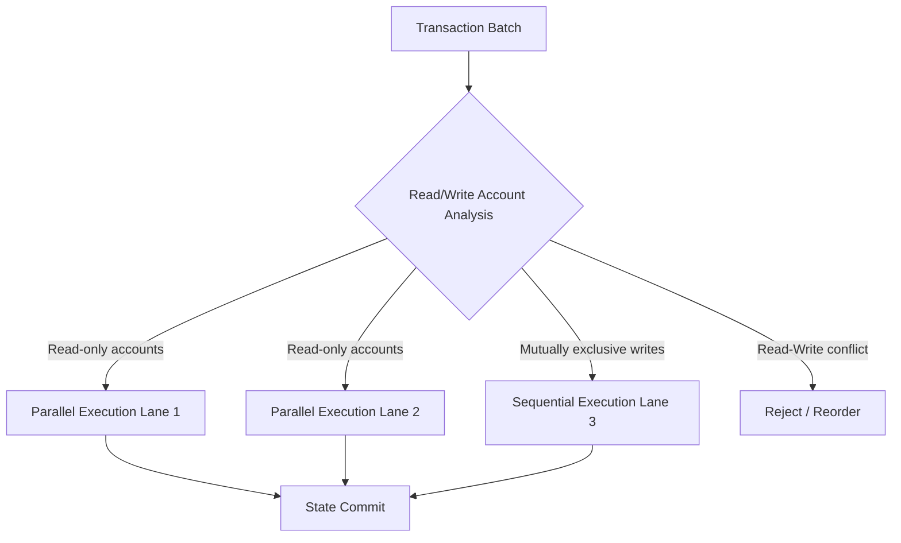

# Blockchain & Smart Contract Security（区块链与智能合约安全）

> **层级**: L6 应用主题
> **前置概念**: [Ownership](../01_foundation/01_ownership.md) · [Borrowing](../01_foundation/02_borrowing.md) · [Lifetimes](../01_foundation/03_lifetimes.md) · [Type System](../01_foundation/04_type_system.md) · [Unsafe](../03_advanced/03_unsafe.md) · [Linear Logic](../04_formal/01_linear_logic.md)
> **后置概念**: [Formal Ecosystem Tower](./05_formal_ecosystem_tower.md) · [Application Domains](./04_application_domains.md)
> **主要来源**: [Solana Docs] · [Polkadot Substrate Docs] · [Near Protocol Docs] · [Kani Verification Blog] · [Rust in Blockchain Report] · [Wikipedia: Blockchain] · [Wikipedia: Smart contract]

---

> **Bloom 层级**: 分析 → 评价
**变更日志**:

- v1.0 (2026-05-13): 初始版本——覆盖 Rust 区块链生态、合约安全形式化、Kani 验证与 L1-L4 映射

---

## 权威定义

> **[Wikipedia — Blockchain]** A blockchain is a distributed ledger with growing lists of records (blocks) that are securely linked together via cryptographic hashes.
> **来源**: <https://en.wikipedia.org/wiki/Blockchain>

> **[Wikipedia — Smart contract]** A smart contract is a self-executing program with the terms of the agreement between buyer and seller being directly written into lines of code.
> **来源**: <https://en.wikipedia.org/wiki/Smart_contract>

> **[Ethereum Docs]** Smart contract security is the practice of creating and maintaining smart contracts that are resilient to attacks, bugs, and unintended behavior.

---

## 认知路径（Cognitive Path）

> **学习递进**: 从"区块链为什么需要 Rust"的直觉，深入到"类型系统如何消除整类合约漏洞"的形式化理解。

### 第 1 步：为什么区块链领域特别需要内存安全？

智能合约一旦部署即不可篡改，漏洞意味着**不可逆的资金损失**（The DAO、Parity 多签冻结等事件）。传统 EVM/Solidity 合约依赖运行时检查和人工审计，而 Rust 的编译期保证可消除整类漏洞。

### 第 2 步：Rust 链与 EVM 链的本质差异是什么？

Solana/Polkadot/Near 等 Rust 链将**合约执行模型**从"单线程状态机"推进到"并行交易处理"（Sealevel）或"异构分片"（Substrate）。Rust 的所有权模型天然匹配这种并行资源管理需求。

### 第 3 步：类型系统如何替代安全审计的一部分工作？

重入攻击、整数溢出、未初始化存储——这些在 Solidity 中需要人工审计的漏洞，在 Rust 中由编译器**statically reject**。理解这种"漏洞类别消除"机制，是评估 Rust 链安全优势的核心。

### 第 4 步：形式化验证在合约中的边界在哪里？

Kani 等工具可以验证 unsafe 边界和整数无溢出，但无法验证**业务逻辑正确性**（如"只有所有者才能转账"）。类型系统消除"如何做"的错误，形式化验证消除"做什么"的偏差。

---

## 一、Rust 在区块链领域的独特优势

### 1.1 内存安全 ⟹ 合约无重入/溢出漏洞

| 漏洞类别 | Solidity/EVM 现状 | Rust 合约的编译期保证 |
|:---|:---|:---|
| **重入攻击 (Reentrancy)** | 依赖 `checks-effects-interactions` 模式和人工审计 | 所有权 + `&mut` 独占访问 ⟹ 同一时刻只有一个调用者可修改状态 |
| **整数溢出** | Solidity 0.8+ 引入运行时 checked math（gas 开销） | `u64`/`u128` 默认 panic on overflow；`checked_add` 强制显式处理 |
| **未初始化存储指针** | 可指向 slot 0（即 `owner` 等敏感状态） | `Option<T>` + 编译期初始化检查 ⟹ 不存在未初始化变量 |
| **栈深度攻击** | EVM 1024 栈深度限制可被利用 | 无显式栈深度限制；调用栈由操作系统管理，且受 Rust 的 safe 边界保护 |
| **时间操纵 (Timestamp)** | `block.timestamp` 可被矿工操纵 | 类型系统无法阻止时间操纵，但 `Instant` / `Slot` 类型可强制显式处理 |

> **核心洞察**: Rust 不是"让漏洞更难发生"，而是**让整类漏洞在编译期成为不可类型化的程序**。这是从"防御性编程"到"构造性安全"的范式跃迁。

### 1.2 无 GC 的确定性执行

区块链要求**完全确定性**——相同的输入必须在所有节点上产生相同的输出。Rust 的无垃圾回收（GC-less）内存管理消除了 GC 暂停和内存布局非确定性，使得 Rust 合约的执行时间可预测性远高于 Go 或 Java 实现。

```rust,ignore
// ✅ Solana Program: 确定性的 CPI（Cross-Program Invocation）
use solana_program::{account_info::AccountInfo, entrypoint, entrypoint::ProgramResult, pubkey::Pubkey};

entrypoint!(process_instruction);

fn process_instruction(
    _program_id: &Pubkey,
    accounts: &[AccountInfo],
    _instruction_data: &[u8],
) -> ProgramResult {
    // accounts 的所有权由运行时借出，编译期保证无别名写
    let account = &accounts[0];
    let mut data = account.try_borrow_mut_data()?; // ← 运行时借用检查
    data[0] = 1;
    Ok(())
}
```

> **Solana 运行时借用检查**: Sealevel 并行执行引擎在**运行时**对账户状态进行借用检查（与 Rust 编译期借用检查同构），确保并行交易无数据竞争。

---

## 二、Rust 链架构对比

### 2.1 Solana (Sealevel)：并行合约执行引擎

| 维度 | Solana 设计 | Rust 角色 |
|:---|:---|:---|
| **执行模型** | Sealevel：基于账户访问模式的并行交易执行 | Rust `AccountInfo` 的 `&` / `&mut` 语义映射到运行时读/写锁 |
| **状态模型** | 账户存储（非 UTXO 亦非 EVM 状态树） | `Account` 结构体的序列化/反序列化由 Rust 类型系统约束 |
| **程序语言** | Rust（主要）、C | `no_std` + `solana-program` crate |
| **关键安全机制** | 运行时借用检查 + 租金机制 | Rust 所有权防止账户数据别名写；租金防止状态膨胀 |



> **来源**: [Solana Docs — Sealevel] · [Anatoly Yakovenko — Sealevel Paper]

### 2.2 Polkadot (Substrate)：异构分片与 FRAME

| 维度 | Substrate 设计 | Rust 角色 |
|:---|:---|:---|
| **架构** | 中继链 + 平行链（heterogeneous sharding） | Substrate 节点完全用 Rust 编写；FRAME 宏生成 pallet 脚手架 |
| **合约层** | pallet-contracts（Wasm）+ ink!（Rust DSL） | ink! 是嵌入式 DSL，利用 Rust 宏生成合约 ABI |
| **升级机制** | 无分叉运行时升级（Wasm 替换） | `sp_version` + `wasm-builder` 的编译期版本校验 |
| **形式化方向** | KILT、Interlay 等团队使用 Kani 验证 pallet | Rust 类型系统 + Kani 覆盖 unsafe 和算术边界 |

```rust,ignore
// ✅ ink! 智能合约：Rust 宏 DSL
#[ink::contract]
mod erc20 {
    use ink_storage::Mapping;

    #[ink(storage)]
    pub struct Erc20 {
        total_supply: Balance,
        balances: Mapping<AccountId, Balance>,
    }

    impl Erc20 {
        #[ink(constructor)]
        pub fn new(initial_supply: Balance) -> Self {
            let mut balances = Mapping::default();
            let caller = Self::env().caller();
            balances.insert(caller, &initial_supply);
            Self { total_supply: initial_supply, balances }
        }

        #[ink(message)]
        pub fn transfer(&mut self, to: AccountId, value: Balance) -> bool {
            let from = self.env().caller();
            // Rust 类型系统：Balance 是 u128，溢出默认 panic（或显式 checked）
            let from_balance = self.balance_of(from);
            if from_balance < value { return false; }
            self.balances.insert(from, &(from_balance - value));
            let to_balance = self.balance_of(to);
            self.balances.insert(to, &(to_balance + value));
            true
        }
    }
}
```

### 2.3 Near Protocol：用户友好与分片执行

| 维度 | Near 设计 | Rust 角色 |
|:---|:---|:---|
| **合约语言** | Rust、AssemblyScript | `near-sdk-rs` 提供 Rust 绑定 |
| **状态模型** | Trie-based 账户状态 | Rust `LookupMap` / `UnorderedMap` 封装 trie 访问 |
| **Promise API** | 异步跨合约调用的 first-class 抽象 | Rust `Promise` 类型封装异步调用链，编译期保证回调签名匹配 |

---

## 三、智能合约安全形式化：与 EVM/Solidity 对比

### 3.1 漏洞类别消除矩阵

| 漏洞 | Solidity 根源 | Rust 消除机制 | 形式化根基 |
|:---|:---|:---|:---|
| **重入 (Reentrancy)** | 默认 call 传递控制流 + 可重入锁需手动实现 | `&mut self` 独占 ⟹ 编译期保证无并发写；运行时借用检查覆盖跨程序调用 | 线性逻辑：资源不可复制、不可丢弃 |
| **整数溢出** | 默认 wrapping（0.8 前）或 checked（0.8+，gas 开销） | 默认 panic；`checked_add` / `saturating_add` 强制显式分支 | 类型系统：数值操作返回 `Option<T>` |
| **访问控制遗漏** | `onlyOwner` 修饰器需手动添加 | 无直接帮助，但 `Auth` 类型可通过类型状态模式强制检查 | Typestate：权限作为类型参数 |
| **未检查的外部调用返回值** | `call` 返回 `bool` 可被忽略 | `Result<T, E>` 的 `#[must_use]` 强制处理错误 | 代数数据类型：错误不可静默丢弃 |
| **时间操纵** | `block.timestamp` 为普通 `uint256` | 无根本解决，但 `Slot` / `Epoch` 新类型可限制误用 | 新类型模式（Newtype） |
| **Delegatecall 注入** | `delegatecall` 可任意修改调用者状态 | Rust 无 delegatecall 等价物；Wasm 模块边界隔离 | 模块边界 = 所有权隔离 |

> **关键论证**: Rust 消除的不是"所有漏洞"，而是**与内存安全和类型错误相关的系统性漏洞类别**。业务逻辑漏洞（如价格预言机操纵、闪电贷攻击）仍需形式化规约和审计。

### 3.2 形式化验证工具链：Kani 在合约验证中的应用

Kani（AWS 开发的 Rust 模型检测器）可直接验证 ink! / Solana 合约中的关键不变量：

```rust,ignore
// ✅ Kani 验证：账户余额非负 + 总量守恒
#[cfg(kani)]
mod verification {
    use super::*;

    #[kani::proof]
    fn verify_transfer_preserves_invariant() {
        // 符号化输入
        let initial_supply: u128 = kani::any();
        let sender: AccountId = kani::any();
        let receiver: AccountId = kani::any();
        let amount: u128 = kani::any();

        kani::assume(initial_supply <= 1_000_000_000_000); // 合理范围假设
        kani::assume(sender != receiver);

        let mut contract = Erc20::new(initial_supply);
        contract.balances.insert(sender, &initial_supply);

        let total_before = contract.total_supply;

        // 执行 transfer
        contract.transfer(receiver, amount);

        // 验证总量守恒
        assert_eq!(contract.total_supply, total_before);

        // 验证无账户余额为负（Rust u128 本身保证，但 Kani 验证逻辑路径）
        let sender_balance = contract.balance_of(sender);
        let receiver_balance = contract.balance_of(receiver);
        kani::cover!(sender_balance == 0); // 覆盖边界情况
        kani::cover!(receiver_balance == initial_supply);
    }
}
```

| Kani 特性 | 合约验证应用 |
|:---|:---|
| `#[kani::proof]` | 验证函数级不变量（如转账后总量守恒） |
| `kani::any()` | 符号化输入，覆盖所有分支 |
| `kani::assume()` | 编码前置条件（如"余额充足"） |
| `--unwind` | 限制循环展开，防止验证不终止 |
| `--coverage` | 生成覆盖报告，确认边界情况被验证 |

> **来源**: [AWS Kani Blog] · [Kani Documentation] · [ink! Verification Guide]

---

## 四、与 L1-L4 的关系映射

| L1-L4 核心概念 | 在区块链中的表达 | 安全效应 |
|:---|:---|:---|
| **L1 所有权** | 账户状态 `AccountInfo` 的独占/共享访问控制 | 编译期防止同一账户被多个交易并发修改（重入消除） |
| **L1 生命周期** | 合约存储引用的有效性由区块高度/epoch 约束 | 状态引用不会指向已清理的账户（无 use-after-free） |
| **L2 Trait / 泛型** | `Balance: CheckedAdd`、代币标准的 `PSP22` / `SPL` trait | 标准接口的编译期兼容性检查 |
| **L3 Unsafe** | 合约底层的序列化/VM 边界（如 Solana 的 `solana-program`） | `unsafe` 集中在运行时 crate，合约开发者保持 safe |
| **L4 线性逻辑** | 代币作为线性资源（不可复制、不可凭空产生） | 总量守恒由类型系统保证 |

---

## 五、待补充与演进方向（TODOs）

- [ ] **高**: 补充 Move 语言（Sui/Aptos）与 Rust 合约的所有权模型对比
- [ ] **高**: 补充形式化验证工具在 Substrate pallet 中的实际案例（如 Interlay 的 Kani 应用）
- [ ] **中**: 补充 Rust 合约的 gas 计量模型与 EVM gas 的对比分析
- [ ] **低**: 跟踪 Rust 区块链语言规范（如 Solana SBF、Polkadot PVF）的形式化语义进展

---

## 相关概念链接

| 概念 | 文件 | 关系 |
|:---|:---|:---|
| 所有权 | [`../01_foundation/01_ownership.md`](../01_foundation/01_ownership.md) | 合约状态独占访问的根基 |
| 借用检查 | [`../01_foundation/02_borrowing.md`](../01_foundation/02_borrowing.md) | Sealevel 运行时并行调度同构 |
| 生命周期 | [`../01_foundation/03_lifetimes.md`](../01_foundation/03_lifetimes.md) | 跨区块状态引用有效性 |
| 类型系统 | [`../01_foundation/04_type_system.md`](../01_foundation/04_type_system.md) | 漏洞类别消除机制 |
| Unsafe | [`../03_advanced/03_unsafe.md`](../03_advanced/03_unsafe.md) | VM 运行时底层边界 |
| 线性逻辑 | [`../04_formal/01_linear_logic.md`](../04_formal/01_linear_logic.md) | 代币作为线性资源的形式化 |
| 形式化验证工具链 | [`../04_formal/05_verification_toolchain.md`](../04_formal/05_verification_toolchain.md) | Kani / Verus 的验证理论 |
| 核心库谱系 | [`./03_core_crates.md`](./03_core_crates.md) | `solana-program`、`ink` 等 crate 定位 |
| 应用领域 | [`./04_application_domains.md`](./04_application_domains.md) | 区块链作为 L6 应用域 |

> **[来源: Solana Docs; Polkadot Substrate Docs; Near Protocol Docs; Kani Verification Blog; Rust in Blockchain Report]** 区块链分析基于官方协议文档和形式化验证研究。✅

> **[来源: Smart Contract Security Research; Reentrancy Attack Analysis; The DAO Post-Mortem]** 合约安全分析基于已公开的安全事件和研究文献。✅

> **[来源: RustBelt: POPL 2018; Linear Logic; Separation Logic]** 形式化映射基于 RustBelt 和分离逻辑的理论框架。✅
