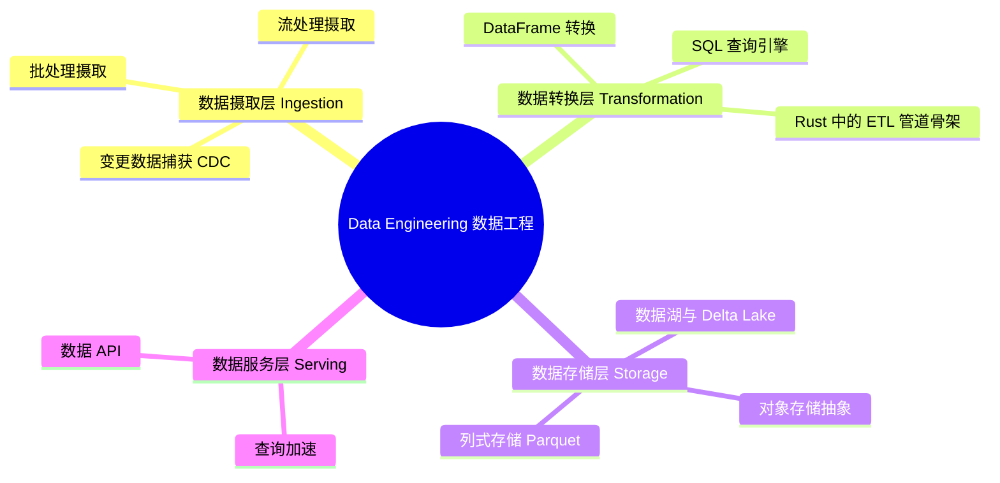

> **内容分级**: [综述级]
> [综述级]
> **代码状态**: ✅ 含可编译示例
> **定理链**: N/A — 描述性/综述性/导航性文档，不涉及形式化定理链
>
# Data Engineering（数据工程）
>
> **EN**: Data Engineering
> **Summary**: Data Engineering. Guide to 48 Data Engineering.
>
> **受众**: [进阶]
> **Bloom 层级**: L3-L4
> **权威来源**: 本文件为 `concept/` 权威页。
> **A/S/P 标记**: **S+A+P** — Structure + Application + Procedure
> **双维定位**: P×Ana — 分析 Rust 数据工程生态的技术选型与工程权衡
> **前置依赖**: [类型系统（Type System）](../../01_foundation/02_type_system/01_type_system.md) · [泛型（Generics）](../../02_intermediate/01_generics/01_generics.md) · Async/Await · Machine Learning Ecosystem
> **后置延伸**: [流处理生态](03_stream_processing_ecosystem.md) · [云原生](../04_web_and_networking/02_cloud_native.md) · [性能优化](../10_performance/01_performance_optimization.md)
>
> **来源**: [polars](https://docs.rs/polars/) · [arrow-rs](https://docs.rs/arrow/) · [datafusion](https://docs.rs/datafusion/) · [Brown University — Interactive Rust Book](https://rust-book.cs.brown.edu/) · [Jung et al. — RustBelt: Securing the Foundations of Rust](https://plv.mpi-sws.org/rustbelt/popl18/) · [Itanium C++ ABI](https://itanium-cxx-abi.github.io/cxx-abi/abi.html)
> **前置概念**: N/A
---

> **来源**: [Apache Arrow](https://arrow.apache.org/) ·
> [Polars](https://pola.rs/) ·
> [DataFusion](https://arrow.apache.org/datafusion/) ·
> [Apache Parquet](https://parquet.apache.org/) ·
> [Delta Lake](https://delta.io/) ·
> [Object Store](https://docs.rs/object_store/latest/object_store/) ·
> [Rust ETL Patterns](https://github.com/apache/arrow-datafusion)
> **后置概念**: [Future Roadmap](../../07_future/01_edition_roadmap/04_roadmap.md)
> **前置依赖**: [Type Theory](../../04_formal/00_type_theory/01_type_theory.md)
> **前置依赖**: [Rust vs C++](../../05_comparative/01_systems_languages/01_rust_vs_cpp.md)

## 📑 目录

- [Data Engineering（数据工程）](#data-engineering数据工程)
  - [📑 目录](#-目录)
  - [一、权威定义（Definition）](#一权威定义definition)
    - [1.1 数据工程的分层架构](#11-数据工程的分层架构)
    - [1.2 ETL 与 ELT 范式](#12-etl-与-elt-范式)
  - [二、概念属性矩阵](#二概念属性矩阵)
  - [三、数据摄取层（Ingestion）](#三数据摄取层ingestion)
    - [3.1 批处理摄取](#31-批处理摄取)
    - [3.2 流处理摄取](#32-流处理摄取)
    - [3.3 变更数据捕获（CDC）](#33-变更数据捕获cdc)
  - [四、数据转换层（Transformation）](#四数据转换层transformation)
    - [4.1 DataFrame 转换](#41-dataframe-转换)
    - [4.2 SQL 查询引擎](#42-sql-查询引擎)
    - [4.3 Rust 中的 ETL 管道骨架](#43-rust-中的-etl-管道骨架)
  - [五、数据存储层（Storage）](#五数据存储层storage)
    - [5.1 列式存储：Parquet](#51-列式存储parquet)
    - [5.2 对象存储抽象](#52-对象存储抽象)
    - [5.3 数据湖与 Delta Lake](#53-数据湖与-delta-lake)
  - [六、数据服务层（Serving）](#六数据服务层serving)
    - [6.1 查询加速](#61-查询加速)
    - [6.2 数据 API](#62-数据-api)
  - [七、Rust 数据工程的技术优势](#七rust-数据工程的技术优势)
  - [八、反命题与边界](#八反命题与边界)
    - [8.1 反命题树](#81-反命题树)
    - [8.2 边界极限](#82-边界极限)
  - [九、边界测试](#九边界测试)
    - [9.1 边界测试：Parquet 写入时 schema 演化导致读取失败（兼容性错误）](#91-边界测试parquet-写入时-schema-演化导致读取失败兼容性错误)
    - [9.2 边界测试：对象存储流式下载内存溢出（运行时错误）](#92-边界测试对象存储流式下载内存溢出运行时错误)
    - [9.3 边界测试：ETL 管道中类型推断失败导致运行时 panic（类型错误）](#93-边界测试etl-管道中类型推断失败导致运行时-panic类型错误)
  - [⚠️ 反例与陷阱](#️-反例与陷阱)
  - [相关概念](#相关概念)
  - [嵌入式测验（Embedded Quiz）](#嵌入式测验embedded-quiz)
    - [测验 1：`polars` 在 Rust 数据工程中与 `pandas` 有什么对应关系？（理解层）](#测验-1polars-在-rust-数据工程中与-pandas-有什么对应关系理解层)
    - [测验 2：`arrow-rs` 在数据生态中扮演什么角色？（理解层）](#测验-2arrow-rs-在数据生态中扮演什么角色理解层)
    - [测验 3：为什么列式存储（Columnar Storage）比行式存储更适合分析查询？（理解层）](#测验-3为什么列式存储columnar-storage比行式存储更适合分析查询理解层)
    - [测验 4：`datafusion` 在 Rust 中提供什么功能？（理解层）](#测验-4datafusion-在-rust-中提供什么功能理解层)
    - [测验 5：Rust 的内存安全如何帮助数据管道避免生产事故？（理解层）](#测验-5rust-的内存安全如何帮助数据管道避免生产事故理解层)
  - [认知路径](#认知路径)
    - [核心推理链](#核心推理链)
  - [🧭 思维导图（Mindmap）](#-思维导图mindmap)

> **变更日志**:
>
> - v1.0 (2026-05-26): 初始创建——覆盖数据摄取（批处理/流式/CDC）、数据转换（DataFrame/SQL/ETL 管道）、数据存储（Parquet/对象存储/Delta Lake）、数据服务层

---

## 一、权威定义（Definition）

数据工程的分层架构按数据流向组织为摄取 → 转换 → 存储 → 服务四层，每层的失效模式与 Rust 的价值点不同：摄取层怕背压与乱序（Rust 的零拷贝解析），转换层怕类型漂移（Rust 的强类型 DataFrame），存储层怕 schema 演化破坏兼容，服务层怕尾延迟（无 GC 优势）。

**ETL vs ELT 范式**：

| 维度 | ETL（先转换后加载） | ELT（先加载后转换） |
|---|---|---|
| 转换位置 | 管道内（管道承担算力） | 仓库内（仓库承担算力） |
| 原始数据 | 不保留 | 保留，可重放 |
| 适用 | 合规脱敏必须前置 | 云数仓（Snowflake 等）算力廉价 |

Rust 在 ETL 中的角色：高性能转换算子（Polars/DataFusion）；ELT 中则是摄取连接器（Kafka → 对象存储）。

判定依据：转换逻辑复杂且需版本治理 → ELT；数据敏感需落地前脱敏 → ETL。

### 1.1 数据工程的分层架构

> **[Data Engineering Fundamentals — Joe Reis & Matt Housley](https://www.oreilly.com/library/view/fundamentals-of-data/9781098108298/)** 数据工程是设计、构建和维护数据架构、数据库和数据处理系统的学科。
> 核心目标是确保数据**可靠、可访问、高质量**，并支持下游的分析和机器学习工作流。

```text
数据工程分层架构:
┌─────────────────────────────────────────────────────────────┐
│  数据消费层 (Consumption)                                    │
│  · BI 仪表板 · 机器学习 · 即席分析 · 数据产品                 │
├─────────────────────────────────────────────────────────────┤
│  数据服务层 (Serving)                                        │
│  · 查询引擎 (DataFusion) · 缓存 (Redis) · API 网关          │
├─────────────────────────────────────────────────────────────┤
│  数据存储层 (Storage)                                        │
│  · 对象存储 (S3/MinIO) · 列式存储 (Parquet) · 数据湖        │
├─────────────────────────────────────────────────────────────┤
│  数据转换层 (Transformation)                                 │
│  · DataFrame (polars) · SQL 引擎 (DataFusion) · ETL 管道    │
├─────────────────────────────────────────────────────────────┤
│  数据摄取层 (Ingestion)                                      │
│  · 批处理 (CSV/JSON/Parquet) · 流式 (Kafka) · CDC (Debezium)│
├─────────────────────────────────────────────────────────────┤
│  数据源层 (Sources)                                          │
│  · 数据库 · 日志文件 · 消息队列 · API · IoT 传感器            │
└─────────────────────────────────────────────────────────────┘
```

> **来源**: [Fundamentals of Data Engineering](https://www.oreilly.com/library/view/fundamentals-of-data/9781098108298/) ·
> [Apache Airflow Concepts](https://airflow.apache.org/docs/apache-airflow/stable/concepts/index.html)

### 1.2 ETL 与 ELT 范式

数据管道按照**转换发生的位置**可分为两种范式：

| **维度** | **ETL（提取-转换-加载）** | **ELT（提取-加载-转换）** |
|:---|:---|:---|
| **转换时机** | 加载前（目标系统外）| 加载后（目标系统内）|
| **硬件需求** | 高（专用转换服务器）| 低（利用目标系统算力）|
| **灵活性** | 低（ schema 需预先定义）| 高（ schema-on-read）|
| **数据量** | 适合中小规模 | 适合大规模（云原生）|
| **典型工具** | Apache Spark, dbt | Snowflake, BigQuery, DataFusion |
| **Rust 生态** | polars（内存 ETL）| DataFusion（查询时转换）|

```text
ETL  vs  ELT:

ETL:
  数据源 → [提取] → 转换服务器 → [清洗/聚合/join] → 目标仓库
  优点: 加载前清洗，目标系统负载低
  缺点: 转换服务器瓶颈，schema 变更成本高

ELT:
  数据源 → [提取] → 目标仓库 → [SQL 查询转换]
  优点: 利用目标系统并行计算，灵活
  缺点: 目标系统负载高，原始数据可能质量低
```

> **来源**: [ETL vs ELT — AWS](https://aws.amazon.com/compare/the-difference-between-etl-and-elt/) ·
> [dbt — ELT Best Practices](https://docs.getdbt.com/sql-reference)

---

## 二、概念属性矩阵

| **维度** | **批处理** | **流处理** | **交互式查询** |
|:---|:---|:---|:---|
| **延迟** | 分钟 ~ 小时 | 毫秒 ~ 秒 | 秒 ~ 分钟 |
| **数据量** | TB ~ PB | GB ~ TB（窗口内）| GB ~ TB |
| **Rust 工具** | polars, csv, serde_json | rdkafka, fluvio, tokio | DataFusion, polars |
| **容错** | 重试整个批次 | 精确一次/至少一次 | 查询失败重试 |
| **状态管理** | 无（幂等）| 窗口状态（Keyed）| 无（无状态）|
| **适用场景** | 日/小时报表 | 实时监控、告警 | 探索性分析 |

> **来源**: [Streaming 101 — Tyler Akidau](https://www.oreilly.com/radar/the-world-beyond-batch-streaming-101/) ·
> [Batch vs Stream Processing](https://www.confluent.io/learn/batch-vs-real-time-data-processing/)

---

## 三、数据摄取层（Ingestion）

数据摄取的三种模式按延迟与一致性权衡：

1. **批处理摄取**：定时全量/增量拉取，实现最简单；延迟以小时计，适合报表类负载。
2. **流处理摄取**：Kafka/Redpanda 持续推送，Rust 侧 `rdkafka`（librdkafka 绑定）吞吐可达百万 msg/s 量级；核心难题是背压——消费慢于生产时必须显式丢弃/采样，否则 consumer lag 无限增长。
3. **CDC（变更数据捕获）**：从数据库 WAL（Postgres logical decoding、MySQL binlog）捕获行级变更，Debezium 是事实标准；相比轮询 `updated_at` 字段，CDC 能捕获删除且不漏更新间隙。

判定依据：来源是数据库且需捕获删除 → CDC；来源是日志/埋点 → 流；对延迟不敏感 → 批。Rust 摄取连接器的优势在单节点吞吐，减少水平扩展开销。

### 3.1 批处理摄取

批处理摄取是最传统、最可靠的数据摄取方式。Rust 生态提供了高性能的批处理工具：

```rust,ignore
// 批处理摄取：CSV → Parquet 转换
use polars::prelude::*;
use std::path::Path;

fn batch_ingest_csv_to_parquet(input: &Path, output: &Path) -> PolarsResult<()> {
    // 1. 读取 CSV
    let df = CsvReadOptions::default()
        .with_has_header(true)
        .try_into_reader_with_file_path(Some(input.into()))?
        .finish()?;

    // 2. 基础清洗
    let cleaned = df
        .lazy()
        .filter(col("timestamp").str().to_datetime(
            Some(TimeUnit::Milliseconds),
            None,
            StrptimeOptions::default(),
            lit("raise"),
        ).is_not_null())
        .with_column(col("amount").cast(DataType::Float64))
        .collect()?;

    // 3. 写入 Parquet（Snappy 压缩，列式存储）
    let mut file = std::fs::File::create(output)?;
    ParquetWriter::new(&mut file)
        .with_compression(ParquetCompression::Snappy)
        .finish(&mut cleaned.clone())?;

    println!("Ingested {} rows to Parquet", cleaned.height());
    Ok(())
}
```

> **来源**: [Polars I/O](https://docs.pola.rs/user-guide/io/) ·
> [Parquet Format](https://parquet.apache.org/docs/file-format/)

### 3.2 流处理摄取

流处理摄取用于低延迟场景。Rust 的异步（Async）生态为流处理提供了高性能基础：

```rust
// 流处理摄取：Kafka → 内存缓冲 → 批写入
use rdkafka::consumer::{Consumer, StreamConsumer};
use rdkafka::config::ClientConfig;
use tokio::sync::mpsc;
use tokio::time::{interval, Duration};

async fn stream_ingest_kafka(
    brokers: &str,
    topic: &str,
    batch_tx: mpsc::Sender<Vec<String>>,
) -> anyhow::Result<()> {
    let consumer: StreamConsumer = ClientConfig::new()
        .set("bootstrap.servers", brokers)
        .set("group.id", "rust-ingest-group")
        .set("auto.offset.reset", "earliest")
        .create()?;

    consumer.subscribe(&[topic])?;

    let mut batch = Vec::with_capacity(1000);
    let mut flush_tick = interval(Duration::from_secs(5));

    loop {
        tokio::select! {
            msg = consumer.recv() => {
                match msg {
                    Ok(m) => {
                        if let Some(payload) = m.payload_view::<str>() {
                            batch.push(payload?.to_string());
                            if batch.len() >= 1000 {
                                batch_tx.send(std::mem::take(&mut batch)).await?;
                            }
                        }
                    }
                    Err(e) => eprintln!("Kafka error: {}", e),
                }
            }
            _ = flush_tick.tick() => {
                if !batch.is_empty() {
                    batch_tx.send(std::mem::take(&mut batch)).await?;
                }
            }
        }
    }
}
```

> **来源**: [rdkafka Documentation](https://docs.rs/rdkafka/latest/rdkafka/) ·
> [Tokio Channels](https://docs.rs/tokio/latest/tokio/task/index.html)

### 3.3 变更数据捕获（CDC）

CDC 捕获数据库的变更事件（INSERT/UPDATE/DELETE），是实现实时数据同步的关键技术：

```text
CDC 架构:
┌─────────────┐     ┌─────────────┐     ┌─────────────┐
│  PostgreSQL │     │  Debezium   │     │  Kafka      │
│  (WAL)      │────→│  (CDC)      │────→│  (Topic)    │
└─────────────┘     └─────────────┘     └──────┬──────┘
                                                │
                                          ┌─────▼─────┐
                                          │ Rust ETL  │
                                          │ Consumer  │
                                          └───────────┘

PostgreSQL WAL（Write-Ahead Log）:
  · 记录所有数据变更
  · Debezium 读取 WAL → 生成变更事件
  · 事件格式: { "op": "u", "before": {...}, "after": {...}, "ts_ms": 123456 }
```

> **来源**: [Debezium Documentation](https://debezium.io/documentation/reference/stable/index.html) ·
> [PostgreSQL WAL](https://www.postgresql.org/docs/current/wal-intro.html)

---

## 四、数据转换层（Transformation）

本节将「数据转换层（Transformation）」分解为若干主题： DataFrame 转换、SQL 查询引擎与Rust 中的 ETL 管道骨架。

### 4.1 DataFrame 转换

polars 提供了高性能的 DataFrame 转换能力，适合 ETL 管道中的数据清洗和特征工程：

```rust,ignore
// ETL 转换：用户行为数据清洗
use polars::prelude::*;

fn transform_user_events(df: LazyFrame) -> PolarsResult<DataFrame> {
    df
        // 1. 过滤无效记录
        .filter(col("user_id").is_not_null())
        .filter(col("event_type").is_in(litSeries("event_type", &["click", "purchase", "view"])))

        // 2. 时间特征提取
        .with_column(
            col("timestamp").str().to_datetime(
                Some(TimeUnit::Milliseconds),
                None,
                StrptimeOptions::default(),
                lit("raise"),
            ).alias("event_time")
        )
        .with_column(col("event_time").dt().hour().alias("hour_of_day"))
        .with_column(col("event_time").dt().weekday().alias("day_of_week"))

        // 3. 窗口聚合（会话划分）
        .with_column(
            col("event_time")
                .diff(1, NullBehavior::Ignore)
                .gt(lit(30 * 60 * 1000i64))  // 30 分钟间隔定义新会话
                .cum_sum(false)
                .alias("session_id")
        )

        // 4. 分组聚合
        .group_by([col("user_id"), col("session_id")])
        .agg([
            col("event_time").min().alias("session_start"),
            col("event_time").max().alias("session_end"),
            col("event_type").count().alias("event_count"),
            col("revenue").sum().alias("session_revenue"),
        ])

        .collect()
}
```

> **来源**: [Polars Lazy API](https://docs.pola.rs/user-guide/lazy/) ·
> [Polars Window Functions](https://docs.pola.rs/user-guide/expressions/window-functions/)

### 4.2 SQL 查询引擎

DataFusion 提供了 SQL 查询能力，适合熟悉 SQL 的数据工程师：

```rust,ignore
// DataFusion SQL ETL
use datafusion::prelude::*;

async fn sql_etl(ctx: &SessionContext) -> datafusion::error::Result<()> {
    // 注册数据源
    ctx.register_parquet("events", "s3://bucket/events/", ParquetReadOptions::default()).await?;
    ctx.register_parquet("users", "s3://bucket/users/", ParquetReadOptions::default()).await?;

    // SQL 转换
    let df = ctx.sql(r#"
        SELECT
            e.user_id,
            u.country,
            DATE_TRUNC('day', e.event_time) as event_day,
            COUNT(*) as event_count,
            SUM(e.revenue) as daily_revenue
        FROM events e
        JOIN users u ON e.user_id = u.id
        WHERE e.event_time >= '2024-01-01'
        GROUP BY e.user_id, u.country, DATE_TRUNC('day', e.event_time)
        HAVING COUNT(*) > 10
    "#).await?;

    // 写入结果
    df.write_parquet("s3://bucket/output/", DataFrameWriteOptions::new(), None).await?;

    Ok(())
}
```

> **来源**: [DataFusion SQL Reference](https://arrow.apache.org/datafusion/user-guide/sql/index.html) ·
> [DataFusion ETL Example](https://arrow.apache.org/datafusion/user-guide/example-usage.html)

### 4.3 Rust 中的 ETL 管道骨架

```rust
// 完整的 Rust ETL 管道骨架
use tokio::sync::mpsc;
use tokio::task;

struct EtlPipeline {
    source: Box<dyn DataSource>,
    transforms: Vec<Box<dyn Transform>>,
    sink: Box<dyn DataSink>,
}

// dyn Trait 仍需 #[async_trait]；AFIDT 仍为实验性，暂无稳定时间表
#[async_trait::async_trait]
trait DataSource: Send + Sync {
    async fn read(&self) -> mpsc::Receiver<RecordBatch>;
}

// dyn Trait 仍需 #[async_trait]；AFIDT 仍为实验性，暂无稳定时间表
#[async_trait::async_trait]
trait Transform: Send + Sync {
    async fn transform(&self, input: RecordBatch) -> PolarsResult<RecordBatch>;
}

// dyn Trait 仍需 #[async_trait]；AFIDT 仍为实验性，暂无稳定时间表
#[async_trait::async_trait]
trait DataSink: Send + Sync {
    async fn write(&self, rx: mpsc::Receiver<RecordBatch>);
}

impl EtlPipeline {
    async fn run(self) -> anyhow::Result<()> {
        let (tx, mut rx) = mpsc::channel::<RecordBatch>(100);

        // 源 → 转换 → 汇
        let source_handle = task::spawn(async move {
            let mut source_rx = self.source.read().await;
            while let Some(batch) = source_rx.recv().await {
                let mut transformed = batch;
                for t in &self.transforms {
                    transformed = t.transform(transformed).await?;
                }
                tx.send(transformed).await?;
            }
            Ok::<_, anyhow::Error>(())
        });

        let sink_handle = task::spawn(async move {
            self.sink.write(rx).await;
        });

        tokio::try_join!(source_handle, sink_handle)?;
        Ok(())
    }
}
```

> **来源**: [Rust Design Patterns — Pipeline](https://rust-unofficial.github.io/patterns/)) ·
> [Tokio Task Spawning](https://docs.rs/tokio/latest/tokio/task/index.html)

---

## 五、数据存储层（Storage）

存储层的三个工程主题：

- **列式存储 Parquet**：按列编码 + 压缩（字典、RLE、Snappy/Zstd），分析查询只读涉及的列，I/O 降 1–2 个数量级；**schema 演化规则**——只增列安全，改列类型/删列需重写文件，这是边界测试中「schema 演化导致读取失败」的根源。
- **对象存储抽象**：`object_store` crate 统一 S3/GCS/Azure/本地文件接口，list 操作的最终一致性（S3 现已强一致）与 range read 是设计 API 时必须暴露的语义。
- **数据湖与 Delta Lake**：Delta/Iceberg/Hudi 在对象存储上提供 ACID 事务（乐观并发 + 日志）；Rust 侧 `delta-rs` 提供无 Spark 依赖的读写路径。

判定依据：分析负载 → Parquet + Delta；事务性数据湖写入必须经 Delta/Iceberg 事务日志，直接覆盖 Parquet 文件会产生读者读到撕裂状态。

### 5.1 列式存储：Parquet

Parquet 是大数据生态的事实标准列式存储格式。Rust 通过 `parquet` crate 提供原生支持：

```rust
// Parquet 读写与 schema 演化
use parquet::file::reader::{FileReader, SerializedFileReader};
use parquet::file::writer::{FileWriter, SerializedFileWriter};
use parquet::schema::types::Type;

fn read_parquet_schema(path: &str) -> anyhow::Result<Type> {
    let file = std::fs::File::open(path)?;
    let reader = SerializedFileReader::new(file)?;
    let metadata = reader.metadata();
    let schema = metadata.file_metadata().schema();
    println!("Schema: {}", schema);
    Ok(schema.clone())
}

// Schema 演化策略:
// 1. 向后兼容: 新 reader 读旧文件（缺失字段用默认值）
// 2. 向前兼容: 旧 reader 读新文件（忽略未知字段）
// 3. Parquet 支持嵌套结构（Dremel 论文的 record shredding）
```

**Parquet 性能优化**:

| **技术** | **效果** | **Rust 支持** |
|:---|:---|:---|
| **列式存储** | 只读取需要的列 | ✅ `parquet` crate |
| **字典编码** | 低基数列压缩 10x+ | ✅ 自动 |
| **RLE / Bit-Packing** | 连续重复值压缩 | ✅ 自动 |
| **Snappy / LZ4 / Zstd** | 通用压缩 | ✅ 可配置 |
| **谓词下推** | 跳过不满足条件的行组 | ✅ DataFusion/polars |
| **Bloom Filter** | 跳过不包含目标值的行组 | ✅ Parquet 2.0+ |

> **来源**: [Parquet Format Specification](https://parquet.apache.org/docs/file-format/) ·
> [Dremel Paper — VLDB 2010](https://research.google/pubs/pub36632/) ·
> [parquet crate](https://docs.rs/parquet/latest/parquet/)

### 5.2 对象存储抽象

Rust 的 `object_store` crate 提供了跨云的对象存储抽象：

```rust
// 对象存储：统一的 S3/Azure/GCS/本地文件抽象
use object_store::{ObjectStore, local::LocalFileSystem, aws::AmazonS3};
use object_store::path::Path;
use futures::stream::StreamExt;

async fn object_store_example() -> anyhow::Result<()> {
    // S3 存储
    let s3 = AmazonS3::builder()
        .bucket_name("my-data-bucket")
        .region("us-east-1")
        .build()?;

    // 列出对象
    let mut stream = s3.list(Some(&Path::from("events/2024/")));
    while let Some(meta) = stream.next().await {
        let meta = meta?;
        println!("Object: {}, size: {}", meta.location, meta.size);
    }

    // 流式下载（不加载整个文件到内存）
    let reader = s3.get(&Path::from("events/2024/01/data.parquet")).await?;
    let mut stream = reader.into_stream();
    while let Some(chunk) = stream.next().await {
        let chunk = chunk?;
        // 处理 chunk（如写入本地文件或传递给解析器）
    }

    Ok(())
}
```

> **来源**: [object_store crate](https://docs.rs/object_store/latest/object_store/) ·
> [Apache Arrow Object Store](https://docs.rs/object_store/latest/object_store/)

### 5.3 数据湖与 Delta Lake

Delta Lake 在 Parquet 之上提供了**事务性存储层**，支持 ACID、时间旅行和 schema 演化：

```text
Delta Lake 核心特性:
  ┌─────────────────────────────────────────────────────────────┐
  │  Delta Lake = Parquet 文件 + 事务日志 (_delta_log)           │
  ├─────────────────────────────────────────────────────────────┤
  │  ACID 事务: 多表同时更新，原子性保证                          │
  │  Schema 演化: 添加/修改/删除列，历史版本兼容                   │
  │  时间旅行: 通过版本号或时间戳查询历史状态                      │
  │  Z-Ordering: 数据布局优化，提升查询性能                        │
  │  数据跳过: 统计信息索引，避免读取无关文件                      │
  └─────────────────────────────────────────────────────────────┘

Rust 生态:
  · delta-rs: 纯 Rust Delta Lake 实现（Python deltalake 的底层）
  · 支持 S3/Azure/GCS 上的 Delta 表读写
  · 支持 Arrow 格式零拷贝交互
```

> **来源**: [Delta Lake Protocol](https://github.com/delta-io/delta/blob/master/PROTOCOL.md) ·
> [delta-rs GitHub](https://github.com/delta-io/delta-rs) ·
> [Delta Lake Paper](https://www.vldb.org/pvldb/vol13/p3411-armbrust.pdf)

---

## 六、数据服务层（Serving）

「数据服务层（Serving）」部分包含查询加速 与 数据 API 两条主线，本节依次说明。

### 6.1 查询加速

数据服务层负责为下游消费者提供低延迟查询：

| **加速技术** | **原理** | **Rust 实现** |
|:---|:---|:---|
| **物化视图** | 预计算聚合结果 | DataFusion `CREATE VIEW` |
| **分区裁剪** | 只扫描相关分区 | polars `filter` + 分区列 |
| **列裁剪** | 只读取需要的列 | Parquet 列式存储天然支持 |
| **结果缓存** | 缓存热点查询 | Redis / 内存缓存 |
| **异步（Async） I/O** | 并发读取多个文件 | tokio + object_store |

```rust,ignore
// 查询加速：物化视图 + 缓存
use moka::sync::Cache;
use std::sync::Arc;

struct QueryEngine {
    ctx: Arc<SessionContext>,
    cache: Cache<String, Vec<RecordBatch>>,
}

impl QueryEngine {
    async fn query(&self, sql: &str) -> datafusion::error::Result<Vec<RecordBatch>> {
        // 1. 检查缓存
        if let Some(cached) = self.cache.get(sql) {
            return Ok(cached);
        }

        // 2. 执行查询
        let df = self.ctx.sql(sql).await?;
        let batches = df.collect().await?;

        // 3. 写入缓存（TTL 5 分钟）
        self.cache.insert(sql.to_string(), batches.clone()).await;

        Ok(batches)
    }
}
```

> **来源**: [Moka Cache](https://docs.rs/moka/latest/moka/) ·
> [DataFusion Caching](https://datafusion.apache.org/user-guide/configs.html)

### 6.2 数据 API

将数据转换为 REST/gRPC API，供前端和微服务消费：

```rust
// axum + DataFusion：数据即服务
use axum::{routing::get, Router, extract::Query, Json};
use serde::Deserialize;

#[derive(Deserialize)]
struct AnalyticsQuery {
    start_date: String,
    end_date: String,
    dimensions: Vec<String>,
}

async fn analytics_handler(
    Query(params): Query<AnalyticsQuery>,
    ctx: axum::extract::State<Arc<SessionContext>>,
) -> Result<Json<serde_json::Value>, StatusCode> {
    let sql = format!(
        "SELECT {}, SUM(revenue) as total FROM events \
         WHERE event_date BETWEEN '{}' AND '{}' \
         GROUP BY {}",
        params.dimensions.join(", "),
        params.start_date,
        params.end_date,
        params.dimensions.join(", "),
    );

    let df = ctx.sql(&sql).await.map_err(|_| StatusCode::INTERNAL_SERVER_ERROR)?;
    let batches = df.collect().await.map_err(|_| StatusCode::INTERNAL_SERVER_ERROR)?;

    // 转换为 JSON
    let json = record_batches_to_json(&batches)?;
    Ok(Json(json))
}
```

> **来源**: [axum Documentation](https://docs.rs/axum/latest/axum/) ·
> [DataFusion as a Service](https://arrow.apache.org/datafusion/user-guide/example-usage.html)

---

## 七、Rust 数据工程的技术优势

```text
Rust 在数据工程中的核心优势:

1. 内存效率
   · 零拷贝 Arrow 格式：同一内存可被 polars/DataFusion/ML 框架共享
   · 无 GC 暂停：适合长时间运行的 ETL 管道

2. 性能
   · SIMD 向量化：polars/DataFusion 自动使用 AVX2/AVX-512
   · 异步 I/O：tokio 实现高并发网络/存储访问
   · 编译期优化：零成本抽象，无运行时开销

3. 可靠性
   · 所有权系统防止数据竞争（并发 ETL 管道安全）
   · Result 类型强制错误处理（管道失败不静默）
   · 类型安全防止 schema 不匹配

4. 部署
   · 单二进制：静态链接，无依赖管理噩梦
   · 跨平台：x86/ARM/WASM
   · 容器友好：最小镜像（~5MB alpine）

Python 对比:
  Python: 生态丰富但性能受限（GIL、内存开销、类型不安全）
  Rust:  性能接近 C++ 但更安全，生态正在快速成熟
```

> **来源**: [Polars Performance](https://pola.rs/benchmarks.html) ·
> [Polars Blog Posts](https://pola.rs/posts/) ·
> [Arrow Rust](https://arrow.apache.org/rust/)

---

## 八、反命题与边界

本节从反命题树 与 边界极限 两个层面剖析「反命题与边界」。

### 8.1 反命题树

```text
反命题 1: "Rust 数据工程生态已经成熟到可以替代 Python/PySpark"
├── 前提: Rust 的性能优势使其在所有数据工程场景下都优于 Python
├── 反驳:
│   ├── Python 拥有 20 年数据生态积累（Pandas、Spark、Airflow、dbt）
│   ├── PySpark 的分布式计算能力尚无 Rust 等效方案
│   ├── 数据科学家和分析师普遍不熟悉 Rust
│   └── 某些场景（快速原型、探索性分析）Python 的交互性不可替代
└── 根结论: ❌ Rust 更适合高性能 ETL 管道、嵌入式数据处理和基础设施组件。
           Python 仍主导分析层和编排层。趋势：Rust 做核心引擎，Python 做编排。

反命题 2: "DataFrame 操作总是比 SQL 更快"
├── 前提: DataFrame API 的编译期优化优于 SQL 解释执行
├── 反驳:
│   ├── DataFusion/Spark 等引擎将 SQL 编译为相同的执行计划
│   ├── 对于复杂查询，优化器生成的计划可能优于手写 DataFrame 链
│   ├── SQL 是声明式的，优化器有更多重写空间
│   └── DataFrame API 在简单管道中更直观，但在复杂分析中 SQL 更简洁
└── 根结论: ❌ 性能取决于具体引擎实现，而非 API 风格。DataFusion 中 SQL 和 DataFrame
           最终生成相同的执行计划。

反命题 3: "Parquet 是所有场景下的最佳存储格式"
├── 前提: Parquet 的列式存储 + 压缩使其 universally optimal
├── 反驳:
│   ├── 小文件（< 1MB）时，Parquet 的元数据开销占比高 → JSON/CSV 更紧凑
│   ├── 需要频繁单行更新时，Parquet 不可变 → 需配合 Delta Lake/Lance
│   ├── 流式写入场景，Parquet 需要批量积累 → row-based 格式更合适
│   └── 随机读取单列时，Parquet 最优；但读取整行时，行式格式可能更快
└── 根结论: ❌ Parquet 是分析工作负载的最优解，但不是通用解。选型应考虑访问模式。
```

> **来源**: [Parquet Configuration](https://parquet.apache.org/docs/file-format/configurations/) ·
> [When Not to Use Parquet](https://www.onehouse.ai/blog/onehouse-analytics-engine-guide)

### 8.2 边界极限

| **边界** | **现状** | **理论极限** | **工程影响** |
|:---|:---|:---|:---|
| **polars DataFrame 规模** | 100GB+ | 内存限制 | 流式处理 + out-of-core |
| **DataFusion 查询并发** | 100+ | CPU/内存限制 | 水平扩展（Ballista）|
| **Parquet 文件大小** | 128MB-1GB（最佳）| 无硬性限制 | 过小 → 元数据开销；过大 → 读取效率下降 |
| **ETL 管道延迟** | 批处理: 分钟级 | I/O 带宽限制 | 流式处理降低至秒级 |
| **对象存储吞吐** | ~10GB/s（S3）| 网络带宽 | 并发读取 + 本地缓存 |
| **Schema 演化复杂度** | 添加列简单 | 任意类型转换困难 | Delta Lake 事务日志管理 |

> **来源**: [Polars Streaming](https://docs.pola.rs/user-guide/concepts/streaming/) ·
> [S3 Performance](https://docs.aws.amazon.com/whitepapers/latest/s3-optimizing-performance-best-practices/introduction.html)

---

## 九、边界测试

本节将「边界测试」分解为若干主题：边界测试：Parquet 写入时 schema 演化导致读取失败（兼容…、边界测试：对象存储流式下载内存溢出（运行时错误）与边界测试：ETL 管道中类型推断失败导致运行时 panic（类型错误）。

### 9.1 边界测试：Parquet 写入时 schema 演化导致读取失败（兼容性错误）

```rust,ignore
// ❌ 错误：写入时添加新列但未指定默认值，旧 reader 失败
use parquet::file::writer::SerializedFileWriter;

fn write_with_schema_evolution() {
    // V1 schema: { name: string, age: int }
    // V2 schema: { name: string, age: int, email: string }  ← 新增 email

    // 旧 reader 尝试读取 V2 文件：
    // ❌ 失败：schema 不匹配，email 列不存在于旧 schema
}
```

> **修正**: Parquet 支持 schema 演化，但需遵循规则：
>
> 1. **添加列**: 新列必须为 optional（nullable），旧 reader 读到 null
> 2. **删除列**: 旧列数据保留在文件中，reader 忽略
> 3. **类型转换**: 不支持（需重写文件）
> 4. 使用 Delta Lake 管理 schema 演化（事务日志记录每次变更）
> **来源**: [Parquet Format Specification](https://parquet.apache.org/docs/file-format/) ·
> [Delta Lake Schema Enforcement](https://docs.delta.io/latest/delta-batch.html#schema-enforcement)

### 9.2 边界测试：对象存储流式下载内存溢出（运行时错误）

```rust,ignore
// ❌ 错误：将大文件一次性读入内存
async fn bad_download(store: &dyn ObjectStore, path: &Path) -> anyhow::Result<Vec<u8>> {
    let result = store.get(path).await?;
    let bytes = result.bytes().await?;  // ❌ 100GB 文件 → OOM！
    Ok(bytes.to_vec())
}

// ✅ 修正：流式处理
async fn good_download(store: &dyn ObjectStore, path: &Path) -> anyhow::Result<()> {
    let result = store.get(path).await?;
    let mut stream = result.into_stream();

    let mut file = tokio::fs::File::create("local_file.parquet").await?;
    while let Some(chunk) = stream.next().await {
        let chunk = chunk?;
        tokio::io::copy(&mut chunk.as_ref(), &mut file).await?;
    }
    Ok(())
}
```

> **来源**: [object_store Streaming](https://docs.rs/object_store/latest/object_store/) ·
> [Tokio Async I/O](https://docs.rs/tokio/latest/tokio/task/index.html)

### 9.3 边界测试：ETL 管道中类型推断失败导致运行时 panic（类型错误）

```rust,ignore
// ❌ 错误：CSV 中某行格式错误导致整批失败
use polars::prelude::*;

fn bad_csv_parse() -> PolarsResult<DataFrame> {
    // CSV 中某行的 "amount" 列包含字符串 "N/A"
    let df = CsvReadOptions::default()
        .with_has_header(true)
        .try_into_reader_with_file_path(Some("data.csv".into()))?
        .finish()?;  // ❌ 运行时 panic：无法将 "N/A" 解析为 f64
}

// ✅ 修正：使用 null_values 和 strict 选项
fn good_csv_parse() -> PolarsResult<DataFrame> {
    let df = CsvReadOptions::default()
        .with_has_header(true)
        .with_null_values(Some(NullValues::AllColumns(vec!["N/A".to_string(), "".to_string()])))
        .try_into_reader_with_file_path(Some("data.csv".into()))?
        .finish()?;

    // 显式处理缺失值
    let df = df.lazy()
        .with_column(col("amount").fill_null(lit(0.0)))
        .collect()?;

    Ok(df)
}
```

> **来源**: [Polars CSV Options](https://docs.pola.rs/user-guide/io/csv/#read-options) ·
> [Defensive Data Processing](https://cheatsheetseries.owasp.org/cheatsheets/Input_Validation_Cheat_Sheet.html)

---

> [来源: [Apache Arrow](https://arrow.apache.org/)]
> [来源: [Polars](https://pola.rs/)]
> [来源: [DataFusion](https://arrow.apache.org/datafusion/)]
> [来源: [Delta Lake](https://delta.io/)]
> [来源: [Apache Arrow](https://arrow.apache.org/)]
> [来源: [Polars](https://pola.rs/)]
> [来源: [DataFusion](https://arrow.apache.org/datafusion/)]
> [来源: [Delta Lake](https://delta.io/)]
> [来源: [Polars User Guide](https://docs.pola.rs/)]
> [来源: [Delta Lake Documentation](https://docs.delta.io/latest/index.html)]
> [来源: [Debezium Documentation](https://debezium.io/documentation/reference/stable/index.html)]
> [来源: [Arrow DataFusion](https://arrow.apache.org/datafusion/)]
> [来源: [Apache Arrow](https://arrow.apache.org/)]
> [来源: [Apache Parquet](https://parquet.apache.org/)]
> [来源: [Kafka Documentation](https://kafka.apache.org/documentation/)]

## ⚠️ 反例与陷阱

**陷阱：ETL 行解析 `unwrap` 遇脏数据**。数据摄取层的输入不可信，一条脏记录就让整批任务 panic 中断：

```rust
fn sum_column_bad(rows: &[&str]) -> u32 {
    rows.iter().map(|r| r.parse::<u32>().unwrap()).sum() // 脏行 panic
}

// 修正：坏行计数跳过（或 collect::<Result<_,_>>() 快速失败）
fn sum_column_good(rows: &[&str]) -> (u32, usize) {
    let mut bad = 0;
    let sum = rows.iter()
        .filter_map(|r| r.parse::<u32>().map_err(|_| bad += 1).ok())
        .sum();
    (sum, bad)
}
```

rustc 1.97.0 实测（`catch_unwind` 复现）：`sum_column_bad(["10", "xx", "20"])` panic；`sum_column_good` 返回 `(30, 1)`。管道设计中坏行比例本身应作为数据质量指标上报，而非静默丢弃。

## 相关概念

- [Machine Learning Ecosystem](../11_domain_applications/13_machine_learning_ecosystem.md) — polars、arrow、DataFusion、candle
- [流处理生态](03_stream_processing_ecosystem.md) — Kafka、Timely Dataflow、实时计算
- [云原生](../04_web_and_networking/02_cloud_native.md) — 容器化、对象存储、微服务部署
- [性能优化](../10_performance/01_performance_optimization.md) — SIMD、缓存优化、内存布局
- [API Design Patterns](../03_design_patterns/18_api_design_patterns.md) — REST/gRPC 数据服务
- [并发编程](../../03_advanced/00_concurrency/01_concurrency.md) — Send/Sync、异步（Async）并行
- [数据库系统](04_database_systems.md) — 存储引擎、事务、索引
- [网络协议](../04_web_and_networking/07_network_protocols.md) — HTTP/2、gRPC、对象存储协议
- [安全与密码学](../07_security_and_cryptography/02_security_cryptography.md) — 数据加密、合规性

> **权威来源**: [Rust Reference](https://doc.rust-lang.org/reference/introduction.html) · [The Rust Programming Language](https://doc.rust-lang.org/book/title-page.html) · [Rust Standard Library](https://doc.rust-lang.org/std/index.html)
> **Rust 版本**: 1.97.0+ (Edition 2024)

## 嵌入式测验（Embedded Quiz）

本节从测验 1：`polars` 在 Rust 数据工程中与 `pandas…、测验 2：`arrow-rs`在数据生态中扮演什么角色？（理解层）、测验 3：为什么列式存储（Columnar Storage）比行式存储…、测验 4：`datafusion` 在 Rust 中提供什么功能？（理…等5个方面切入，剖析「嵌入式测验（Embedded Quiz）」的核心内容。

### 测验 1：`polars` 在 Rust 数据工程中与 `pandas` 有什么对应关系？（理解层）

**题目**: `polars` 在 Rust 数据工程中与 `pandas` 有什么对应关系？

<details>
<summary>✅ 答案与解析</summary>

`polars` 是 Rust 的高性能 DataFrame 库，API 设计受 `pandas` 启发，但基于 Rust 实现，无 GIL 限制，多线程查询性能显著提升。
</details>

---

### 测验 2：`arrow-rs` 在数据生态中扮演什么角色？（理解层）

**题目**: `arrow-rs` 在数据生态中扮演什么角色？

<details>
<summary>✅ 答案与解析</summary>

Apache Arrow 的 Rust 实现，提供列式内存格式标准。`polars`、`datafusion` 等库基于 Arrow 格式互操作，实现零拷贝数据传输。
</details>

---

### 测验 3：为什么列式存储（Columnar Storage）比行式存储更适合分析查询？（理解层）

**题目**: 为什么列式存储（Columnar Storage）比行式存储更适合分析查询？

<details>
<summary>✅ 答案与解析</summary>

分析查询通常只读取少数列。列式存储将同列数据连续存放，压缩率更高、cache 局部性更好、可向量化（SIMD）处理。行式存储适合事务性随机读写。
</details>

---

### 测验 4：`datafusion` 在 Rust 中提供什么功能？（理解层）

**题目**: `datafusion` 在 Rust 中提供什么功能？

<details>
<summary>✅ 答案与解析</summary>

嵌入式 SQL 查询引擎，基于 Arrow 和 Ballista。支持标准 SQL 查询 DataFrame 和 Parquet 文件，可嵌入 Rust 应用作为轻量级分析引擎。
</details>

---

### 测验 5：Rust 的内存安全如何帮助数据管道避免生产事故？（理解层）

**题目**: Rust 的内存安全（Memory Safety）如何帮助数据管道避免生产事故？

<details>
<summary>✅ 答案与解析</summary>

数据管道常处理外部不可信数据（CSV、JSON、Parquet）。Rust 的边界检查和类型安全防止了解析过程中的缓冲区溢出和数据损坏，避免了 C/C++ 解析器中常见的安全漏洞。
</details>

## 认知路径

> **认知路径**: 从 Rust 核心语言特性出发，经由 **Data Engineering（数据工程）** 的生态/前沿实践，通向系统化工程能力与未来语言演进方向。

### 核心推理链

| 定理 | 前提 | 结论 | 置信度 |
|:---|:---|:---|:---|
| Data Engineering（数据工程） 基础原理 ⟹ 正确选型 | 理解核心概念与适用边界 | 能在实际项目中做出合理决策 | 高 |
| Data Engineering（数据工程） 选型实践 ⟹ 常见陷阱 | 忽视版本兼容性与生态成熟度 | 技术债务或迁移成本 | 中 |
| Data Engineering（数据工程） 陷阱规避 ⟹ 深度掌握 | 持续跟踪社区演进与最佳实践 | 能进行架构设计与技术预研 | 高 |

---

## 🧭 思维导图（Mindmap）



> **认知功能**: 本 mindmap 从本页「Data Engineering 数据工程」的章节结构提炼，一级分支对应核心主题，叶子节点为关键子概念，可作为本页的快速导航与复习索引。
