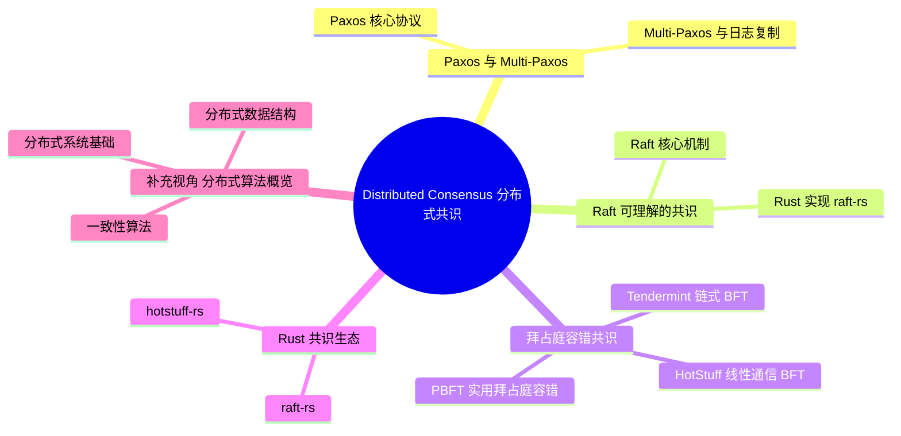

> **内容分级**: [综述级]
> [专家级]
> **代码状态**: ✅ 含可编译示例
> **定理链**: N/A — 描述性/综述性/导航性文档，不涉及形式化定理链
>
# Distributed Consensus（分布式共识）
>
> **EN**: Distributed Consensus
> **Summary**: Formal foundations and engineering trade-offs of distributed consensus algorithms (Raft, PBFT, HotStuff) and their Rust implementations.
>
> **受众**: [进阶]
> **Bloom 层级**: L4-L5
> **权威来源**: 本文件为 `concept/` 权威页。
> **A/S/P 标记**: **S+A+P** — Structure + Application + Procedure
> **双维定位**: C×Eva — 评价分布式共识算法的安全性、活性与工程实现权衡
> **前置依赖**: 分布式系统 · [并发编程](../../03_advanced/00_concurrency/01_concurrency.md) · 网络协议 · [类型系统（Type System）](../../01_foundation/02_type_system/01_type_system.md)
> **后置延伸**: [区块链](../11_domain_applications/01_blockchain.md) · [云原生](../04_web_and_networking/02_cloud_native.md) · [微服务架构](../03_design_patterns/05_microservice_patterns.md)
>
> **来源**: [raft-rs](https://docs.rs/raft/) · [hotstuff-rs](https://docs.rs/hotstuff-rs/)
> **前置概念**: N/A
---

> **来源**:
> [Raft Paper — Ongaro & Ousterhout 2014](https://raft.github.io/raft.pdf) ·
> [PBFT Paper — Castro & Liskov 1999](https://pmg.csail.mit.edu/papers/osdi99.pdf) ·
> [HotStuff Paper — Yin et al. 2019](https://arxiv.org/abs/1803.05069) ·
> [FLP Result — Fischer, Lynch, Paterson 1985](https://groups.csail.mit.edu/tds/papers/Lynch/jacm85.pdf) ·
> [Paxos Made Simple — Lamport 2001](https://lamport.azurewebsites.net/pubs/paxos-simple.pdf) ·
> [Tendermint BFT](https://docs.tendermint.com/master/introduction/what-is-tendermint.html)
> **后置概念**: [Future Roadmap](../../07_future/01_edition_roadmap/04_roadmap.md)
> **前置依赖**: [Type Theory](../../04_formal/00_type_theory/01_type_theory.md)
> **前置依赖**: [Rust vs C++](../../05_comparative/01_systems_languages/01_rust_vs_cpp.md)
>
> **形式理论分工（Canonical）**: 共识的**形式理论**——FLP 不可能性证明骨架、部分同步与故障检测器、CAP/PACELC 形式化、Paxos/Raft/PBFT 不变量与安全性论证、所有权类型系统 ⟹ 共识实现安全的机制分析——以 [L4 分布式共识与不可能性理论](../../04_formal/07_concurrency_semantics/06_distributed_consensus_theory.md) 为权威页；本页保留**算法机制教程、Rust 生态对比、选型决策树与边界测试**视角，理论推导不再展开。

## 📑 目录

- [Distributed Consensus（分布式共识）](#distributed-consensus分布式共识)
  - [📑 目录](#-目录)
  - [一、权威定义（Definition）](#一权威定义definition)
    - [1.1 共识问题的形式化定义](#11-共识问题的形式化定义)
    - [1.2 FLP 不可能结果](#12-flp-不可能结果)
    - [1.3 容错模型](#13-容错模型)
  - [二、概念属性矩阵](#二概念属性矩阵)
  - [三、Paxos 与 Multi-Paxos](#三paxos-与-multi-paxos)
    - [3.1 Paxos 核心协议](#31-paxos-核心协议)
    - [3.2 Multi-Paxos 与日志复制](#32-multi-paxos-与日志复制)
  - [四、Raft：可理解的共识](#四raft可理解的共识)
    - [4.1 Raft 核心机制](#41-raft-核心机制)
    - [4.2 Rust 实现：raft-rs](#42-rust-实现raft-rs)
  - [五、拜占庭容错共识](#五拜占庭容错共识)
    - [5.1 PBFT：实用拜占庭容错](#51-pbft实用拜占庭容错)
    - [5.2 HotStuff：线性通信 BFT](#52-hotstuff线性通信-bft)
    - [5.3 Tendermint：链式 BFT](#53-tendermint链式-bft)
  - [六、共识算法对比](#六共识算法对比)
    - [6.1 能力矩阵](#61-能力矩阵)
    - [6.2 选型决策树](#62-选型决策树)
  - [七、Rust 共识生态](#七rust-共识生态)
    - [7.1 raft-rs](#71-raft-rs)
    - [7.2 hotstuff-rs / tendermint-rs](#72-hotstuff-rs--tendermint-rs)
  - [八、反命题与边界](#八反命题与边界)
    - [8.1 反命题树](#81-反命题树)
    - [8.2 边界极限](#82-边界极限)
  - [九、边界测试](#九边界测试)
    - [9.1 边界测试：网络分区导致脑裂（安全性违反）](#91-边界测试网络分区导致脑裂安全性违反)
    - [9.2 边界测试：Leader 崩溃后未提交的日志丢失（活性违反）](#92-边界测试leader-崩溃后未提交的日志丢失活性违反)
    - [9.3 边界测试：拜占庭节点发送矛盾消息（安全性违反）](#93-边界测试拜占庭节点发送矛盾消息安全性违反)
  - [⚠️ 反例与陷阱](#️-反例与陷阱)
  - [相关概念](#相关概念)
  - [嵌入式测验（Embedded Quiz）](#嵌入式测验embedded-quiz)
    - [测验 1：Raft 共识算法的核心状态有哪三种？（理解层）](#测验-1raft-共识算法的核心状态有哪三种理解层)
    - [测验 2：为什么分布式共识需要"多数派"（Quorum）确认？（理解层）](#测验-2为什么分布式共识需要多数派quorum确认理解层)
    - [测验 3：Rust 的 `tikv` / `openraft` 在共识实现中有什么优势？（理解层）](#测验-3rust-的-tikv--openraft-在共识实现中有什么优势理解层)
    - [测验 4："脑裂"（Split-Brain）是什么？Raft 如何防止它？（理解层）](#测验-4脑裂split-brain是什么raft-如何防止它理解层)
    - [测验 5：在 Rust 中实现分布式共识时，为什么通常使用 `serde` + `tokio` 组合？（理解层）](#测验-5在-rust-中实现分布式共识时为什么通常使用-serde--tokio-组合理解层)
  - [认知路径](#认知路径)
    - [核心推理链](#核心推理链)
  - [补充视角：分布式算法概览](#补充视角分布式算法概览)
    - [分布式系统基础](#分布式系统基础)
    - [一致性算法](#一致性算法)
    - [分布式数据结构](#分布式数据结构)
    - [分布式计算模型](#分布式计算模型)
  - [🧭 思维导图（Mindmap）](#-思维导图mindmap)

> **变更日志**:
>
> - v1.0 (2026-05-26): 初始创建——覆盖共识形式化定义、FLP 不可能性、Paxos/Multi-Paxos、Raft、PBFT/HotStuff/Tendermint、Rust 实现、选型决策树

---

## 一、权威定义（Definition）

共识问题的形式化：在异步（Async）网络中，一组进程各自持有初始值，要求所有非故障进程最终**决定（decide）**同一个值，且满足一致性（agreement）、有效性（validity）、终止性（termination）。

**FLP 不可能结果**（Fischer–Lynch–Paterson, 1985）：在**纯异步**系统中，即使只有一个进程可能崩溃（crash failure），也不存在确定性的共识算法保证终止。工程上的出路是放宽「纯异步」假设：

- **部分同步模型**（DLS）：网络延迟最终有界（GST 之后），Paxos/Raft 在此模型下保证活性；
- **故障检测器**（♢P 等）：引入不可靠但最终准确的故障检测。

容错模型分级：崩溃容错（CFT，容忍 f 个崩溃节点需 ≥2f+1 节点）vs 拜占庭容错（BFT，容忍 f 个任意行为节点需 ≥3f+1）。

判定依据：选 CFT 还是 BFT 取决于节点是否互相信任——单组织内部署选 CFT，多组织/公链选 BFT。

### 1.1 共识问题的形式化定义

> **[FLP Result — Fischer, Lynch, Paterson 1985](https://groups.csail.mit.edu/tds/papers/Lynch/jacm85.pdf)** 分布式共识是分布式计算中最基础的问题之一。在异步（Async）系统中，即使只有一个进程可能故障，也不存在确定性的共识算法。这一**不可能结果**（Impossibility Result）深刻影响了后续所有共识协议的设计——它们必须在**同步假设**、**随机化**或**故障模型限制**之间做出权衡。[来源: [FLP Paper](https://groups.csail.mit.edu/tds/papers/Lynch/jacm85.pdf)]

共识问题的形式化定义（针对状态机复制）：

```text
分布式共识问题:
  给定 n 个进程（节点），每个进程提出一个值（提案），
  所有非故障进程必须就同一个值达成一致。

安全属性 (Safety):
  1. 一致性 (Agreement): 两个非故障节点不会决定不同的值
  2. 有效性 (Validity): 决定的值必须是某个节点提出的

活性属性 (Liveness):
  3. 终止性 (Termination): 所有非故障节点最终必须决定一个值

状态机复制 (SMR):
  将共识扩展为一系列值的共识（日志复制）。
  若所有节点以相同顺序应用相同的操作序列，则状态一致。
```

> **来源**: [FLP Result](https://groups.csail.mit.edu/tds/papers/Lynch/jacm85.pdf) · [Consensus in Distributed Systems](https://algodist.labri.fr/index.php/Main/GT)

### 1.2 FLP 不可能结果

> **FLP — Fischer, Lynch, Paterson, JACM 1985** 在**纯异步（Async）系统**（消息延迟无上界）中，即使只有一个进程可能崩溃（Crash-Stop），也不存在确定性的共识算法能同时满足安全性和终止性。

```text
FLP 不可能性的直观解释:

假设算法即将达成一致，此时:
  · 进程 A 收到消息 m1 后决定值 v1
  · 进程 B 收到消息 m2 后决定值 v2

若网络延迟使得 m1 和 m2 的到达顺序不确定，
则 A 和 B 可能决定不同的值 → 违反一致性。

若算法等待"足够长"以确保一致性，
但异步系统中"足够长"无法定义（延迟无上界）→ 可能永远等待。

绕过 FLP 的策略:
  1. 故障检测器 (Failure Detectors): 假设同步足够检测故障
  2. 随机化 (Randomization): 引入概率终止（Ben-Or, Rabin）
  3. 部分同步 (Partial Synchrony): 系统最终变得同步（PBFT, Tendermint）
  4. 领导者选举超时: Raft 使用随机超时打破对称性
```

> **来源**: [FLP Paper](https://groups.csail.mit.edu/tds/papers/Lynch/jacm85.pdf) · [Impossibility of Distributed Consensus with One Faulty Process](https://dl.acm.org/doi/10.1145/3149.214121)

### 1.3 容错模型

| **故障模型** | **故障行为** | **容忍比例** | **典型算法** |
|:---|:---|:---:|:---|
| **崩溃停止** (Crash-Stop) | 节点停止响应 | f < n/2 | Paxos, Raft, ZAB |
| **崩溃恢复** (Crash-Recovery) | 节点崩溃后恢复 | 需持久化日志 | Raft + snapshot |
| **遗漏故障** (Omission) | 消息丢失 | f < n/2 | 类似崩溃停止 |
| **拜占庭故障** (Byzantine) | 任意恶意行为 | f < n/3 | PBFT, HotStuff, Tendermint |
| **自时钟拜占庭** (BFT + Clock) | 拜占庭 + 时钟漂移 | f < n/3 | Tendermint, Casper |

> **来源**: [Fault-Tolerant Distributed Systems](https://www.microsoft.com/en-us/research/publication/byzantine-generals-problem/) · [Byzantine Generals Problem — Lamport 1982](https://dl.acm.org/doi/10.1145/357172.357176)

---

## 二、概念属性矩阵

| **维度** | **Paxos** | **Raft** | **PBFT** | **HotStuff** | **Tendermint** |
|:---|:---|:---|:---|:---|:---|
| **容错类型** | 崩溃停止 | 崩溃停止 | 拜占庭 | 拜占庭 | 拜占庭 |
| **最大容错** | f < n/2 | f < n/2 | f < n/3 | f < n/3 | f < n/3 |
| **通信复杂度** | O(n²) | O(n) | O(n²) | O(n) | O(n²) |
| **领导者更换** | 复杂 | 简单（心跳超时）| 视图更换 | 简单（链式）| 轮询/质押权重 |
| **活性保证** | 需同步假设 | 随机超时 | 需同步假设 | 需同步假设 | 需同步假设 |
| **可理解性** | 低 | 高 | 中 | 中 | 中 |
| **Rust 实现** | 无原生 | raft-rs | 有限 | 研究原型 | tendermint-rs |
| **应用场景** | Chubby, ZooKeeper | etcd, TiKV | 联盟链 | Diem/Libra | Cosmos, BSC |

> **来源**: [Raft Paper](https://raft.github.io/raft.pdf) · [PBFT Paper](https://pmg.csail.mit.edu/papers/osdi99.pdf) · [HotStuff Paper](https://arxiv.org/abs/1803.05069)

---

## 三、Paxos 与 Multi-Paxos

Paxos 是共识算法的理论原点，理解它要区分**单值共识**与**日志复制**两个层次：

- **Paxos 核心协议**: 两阶段（Prepare/Promise → Accept/Accepted）保证即使面对消息丢失与节点重启，集群最多就一个值达成一致；关键不变量是“多数派相交”——任意两个多数派必有公共节点，使提案号单调性得以传递。
- **Multi-Paxos 与日志复制**: 单值 Paxos 每定一个值都要两轮通信；Multi-Paxos 通过稳定 leader 把 Prepare 阶段摊销为一次，后续日志条目只需 Accept 轮——这正是工程系统（Chubby、早期 ZooKeeper 类实现）采用的形态。

判定依据：Paxos 的正确性论证优美但实现陷阱密集（提案号管理、活锁避免）；新项目应优先 Raft 系实现，Paxos 知识主要用于读懂既有系统与论文。

### 3.1 Paxos 核心协议

> **[Paxos Made Simple — Lamport 2001](https://lamport.azurewebsites.net/pubs/paxos-simple.pdf)** Paxos 是 Leslie Lamport 提出的经典共识算法。核心角色：**提案者**（Proposer）、**接受者**（Acceptor）、**学习者**（Learner）。协议分为两阶段：**Prepare/Promise** 和 **Accept/Accepted**。[来源: [Paxos Made Simple](https://lamport.azurewebsites.net/pubs/paxos-simple.pdf)]

```text
Paxos 两阶段协议:

Phase 1 — Prepare:
  Proposer → Acceptor: Prepare(n)   // n 是递增的提案编号
  Acceptor → Proposer: Promise(n, v) // 承诺不再接受编号 < n 的提案，返回已接受的最高编号值 v

Phase 2 — Accept:
  Proposer → Acceptor: Accept(n, v)  // 若多数 Promised，提出值 v
  Acceptor → Proposer: Accepted(n, v) // 若 n 是最高编号，接受值 v

值确定:
  一旦多数 Acceptor 接受了某个值，该值被确定（Chosen）
  Learner 通过查询 Acceptor 获知已确定的值
```

**Paxos 的安全保证**:

```text
证明: 两个不同的值 v1 ≠ v2 不能被同时确定

反设: v1 和 v2 都被确定了。
  · v1 被确定 → 存在多数集 Q1 接受了 v1
  · v2 被确定 → 存在多数集 Q2 接受了 v2
  · Q1 ∩ Q2 ≠ ∅（鸽巢原理，任意两个多数集相交）
  · 存在某个 Acceptor a ∈ Q1 ∩ Q2
  · a 接受了 v1（编号 n1）和 v2（编号 n2）
  · 若 n1 < n2: a 在 Promise(n2) 时已承诺不接受 < n2 的提案，矛盾！
  · 若 n2 < n1: 同理矛盾
  · 故 n1 = n2 → v1 = v2（同一编号只能接受一个值）
```

> **来源**: [Paxos Made Simple](https://lamport.azurewebsites.net/pubs/paxos-simple.pdf) · [The Part-Time Parliament — Lamport 1998](https://lamport.azurewebsites.net/pubs/lamport-paxos.pdf)

### 3.2 Multi-Paxos 与日志复制

Multi-Paxos 将 Paxos 扩展为**日志复制协议**——对一系列槽位（Slot）运行 Paxos，每个槽位共识一个日志条目：

```text
Multi-Paxos 优化:

原始 Paxos: 每个日志条目独立运行两阶段 → O(2n²) 消息/条目
Multi-Paxos: 选举稳定 Leader 后，Leader 直接发送 Accept（跳过 Prepare）
             → O(n) 消息/条目（Leader → Followers）

Leader 选举:
  · 多数 Acceptor 承诺某个 Leader 的提案编号
  · Leader 维护 lease，期间其他 Proposer 不会提出更高编号

日志空洞 (Log Holes):
  · 节点可能缺少某些槽位的日志
  · 通过 Leader 补全：Follower 向 Leader 请求缺失条目
```

> **来源**: [Paxos Made Live — Chandra et al. 2007](https://read.seas.harvard.edu/~kohler/class/08w-dsi/chandra07paxos.pdf)

---

## 四、Raft：可理解的共识

Raft 把共识分解为三个相对独立的子问题，这是其「可理解性」的来源：

1. **Leader 选举**：随机化选举超时（150–300ms）避免 split vote；获得多数投票者成为 Leader，任期（term）单调递增作为逻辑时钟。
2. **日志复制**：Leader 追加条目并复制到多数派即提交；**Log Matching 特性**——两节点某索引处 term 相同，则此前所有日志相同，这是安全性的核心不变量。
3. **安全性**：选举限制（候选人日志必须不落后于多数派）保证已提交条目不丢失。

Rust 实现 `raft-rs`（TiKV 抽出的核心库）只提供状态机式的 `RawNode`：消息收发、持久化、定时器全由调用方驱动——这种「库而非框架」设计让 Raft 核心可单元测试（直接喂消息序列），但集成成本高，上层需自建传输与存储。

判定依据：自己实现 Raft 只应发生在学习场景；生产用 raft-rs 或 etcd 类成品。

### 4.1 Raft 核心机制

> **[Raft — Ongaro & Ousterhout, ATC 2014](https://raft.github.io/raft.pdf)**
> Raft 是为**可理解性**设计的共识算法。
> 与 Paxos 相比，Raft 将问题分解为三个独立子问题：
> **领导者选举**（Leader Election）、**日志复制**（Log Replication）、**安全性**（Safety）。
> 通过**强领导者**（Strong Leader）简化设计：所有日志条目只从 Leader 流向 Follower。
> [来源: [Raft Paper](https://raft.github.io/raft.pdf)]

```text
Raft 状态机:

每个节点处于三种状态之一:
  ┌─────────┐     ┌─────────┐     ┌─────────┐
  │ Follower│ ←── │ Candidate│ ←── │  Leader │
  └────┬────┘     └────┬────┘     └─────────┘
       │               │
       └── 超时未收到心跳 ─→ Candidate
       ←── 发现更高任期 Leader ──

任期 (Term):
  · 单调递增的整数，用于区分 Leader 的时代
  · 每个 Term 最多一个 Leader
  · 旧 Term 的 Leader 发现新 Term 时立即降级
```

```rust,ignore
// Raft 节点核心状态（教育性简化）
#[derive(Debug, Clone)]
enum NodeState {
    Follower,
    Candidate { votes_received: usize },
    Leader,
}

struct RaftNode {
    id: NodeId,
    state: NodeState,
    current_term: u64,
    voted_for: Option<NodeId>,
    log: Vec<LogEntry>,
    commit_index: usize,
    last_applied: usize,

    // Leader 状态（仅 Leader 使用）
    next_index: HashMap<NodeId, usize>,   // 每个 Follower 的下一个发送索引
    match_index: HashMap<NodeId, usize>,  // 每个 Follower 已匹配的最高索引
}

#[derive(Debug, Clone)]
struct LogEntry {
    term: u64,
    command: Vec<u8>,
}
```

**Raft 日志复制流程**:

```text
客户端 → Leader: 提交命令 Cmd

Leader:
  1. 将 Cmd 追加到本地日志（赋予新索引和当前 Term）
  2. 并行发送 AppendEntries RPC 给所有 Follower

Follower:
  · 若 Term < current_term → 拒绝
  · 若前一个日志索引/Term 不匹配 → 拒绝（Leader 递减 next_index 重试）
  · 否则追加日志，返回成功

Leader:
  3. 收到多数成功后，标记该条目为 committed
  4. 应用到状态机，返回客户端
  5. 在下次心跳中通知 Follower commit_index
```

> **来源**: [Raft Paper](https://raft.github.io/raft.pdf) · [Raft Visualization](https://raft.github.io/) · [Consensus: Bridging Theory and Practice — Ongaro 2014](https://web.stanford.edu/~ouster/cgi-bin/papers/OngaroPhD.pdf)

### 4.2 Rust 实现：raft-rs

> **[raft-rs](https://github.com/tikv/raft-rs)** 是 PingCAP（TiKV 团队）开发的 Raft 共识库，生产级实现。被 TiKV、TiDB、etcd-rs 等项目使用。设计目标：**高性能**、**模块（Module）化**、**易于集成**。[来源: [raft-rs GitHub](https://github.com/tikv/raft-rs)]

```rust,ignore
// raft-rs 基础使用
use raft::{Config, Raft, Storage, RawNode, eraftpb::Message};
use std::sync::Arc;

fn setup_raft_node(id: u64, peers: Vec<u64>, storage: Arc<dyn Storage>) -> Raft<Arc<dyn Storage>> {
    let config = Config {
        id,
        election_tick: 10,        // 选举超时（心跳倍数）
        heartbeat_tick: 3,        // 心跳间隔
        max_size_per_msg: 1024 * 1024,
        max_inflight_msgs: 256,
        ..Config::default()
    };

    let mut raft = Raft::new(&config, storage).unwrap();

    // 初始化集群配置
    if id == 1 {
        // 首个节点成为初始 Leader
        raft.become_candidate();
        raft.become_leader();
    }

    raft
}

// 处理 Raft 消息循环
fn raft_event_loop(mut raft: Raft<Arc<dyn Storage>>) {
    loop {
        // 1. 处理接收到的消息
        while let Some(msg) = receive_network_message() {
            raft.step(msg).unwrap();
        }

        // 2. 获取待发送的消息
        let messages = raft.ready().messages;
        for msg in messages {
            send_network_message(msg);
        }

        // 3. 获取已提交的日志条目并应用到状态机
        if let Some(commit_index) = raft.ready().commit_index {
            apply_committed_entries(commit_index);
        }

        // 4. 保存持久化状态（Term、Vote、Log）
        save_hard_state(raft.hard_state());
    }
}
```

**raft-rs 的线程安全设计**:

```text
raft-rs 的单线程核心 + 异步网络:
  ┌─────────────────┐
  │  Raft 状态机    │  ← 单线程（无锁，顺序执行）
  │  (raft::Raft)   │
  └────────┬────────┘
           │ Ready（待发送消息、已提交日志、持久化状态）
           ▼
  ┌─────────────────┐
  │  网络层（tokio） │  ← 多线程异步发送/接收
  │  存储层（RocksDB）│  ← 多线程异步持久化
  └─────────────────┘

Rust 优势:
  · 单线程状态机天然避免数据竞争
  · Ready 结构体的所有权转移确保状态一致性
  · Storage trait 允许自定义持久化后端
```

> **来源**: [raft-rs Documentation](https://docs.rs/raft/latest/raft/) · [TiKV Architecture](https://tikv.org/docs/) · [etcd Raft](https://github.com/etcd-io/raft)

---

## 五、拜占庭容错共识

拜占庭容错（BFT）假设节点可能**任意作恶**（而非仅崩溃），代价是节点数要求从 2f+1 提高到 3f+1，通信复杂度从 O(n) 升到 O(n²) 起步。三个协议代表三代演进：

| 协议 | 核心贡献 | 代价 |
|---|---|---|
| PBFT | 首个实用的 BFT，三阶段（pre-prepare/prepare/commit）达成共识 | 视图切换复杂、O(n²) 消息 |
| HotStuff | 门限签名聚合把通信降到线性 O(n)，流水线化提案 | 依赖聚合签名密码学 |
| Tendermint | 链式 BFT + 锁定机制，工程化程度高（Cosmos 底座） | 单轮延迟受最慢多数派节点影响 |

判定依据：联盟链/许可链场景 BFT 是刚需，HotStuff 系（含其变体）是当前默认选择；信任域内部的系统不需要 BFT，Raft 足够且成本低一个量级。

### 5.1 PBFT：实用拜占庭容错

> **[PBFT — Castro & Liskov, OSDI 1999](https://pmg.csail.mit.edu/papers/osdi99.pdf)** PBFT（Practical Byzantine Fault Tolerance）是第一个实用的拜占庭容错共识算法。在异步（Async）网络 + n ≥ 3f + 1 条件下，容忍 f 个拜占庭节点。核心机制：**三阶段提交**（Pre-Prepare / Prepare / Commit）+ **视图更换**（View Change）。[来源: [PBFT Paper](https://pmg.csail.mit.edu/papers/osdi99.pdf)]

```text
PBFT 正常流程（三阶段）:

Phase 1 — Pre-Prepare:
  Client → Leader (Primary): <REQUEST, o, t, c>
  Primary → All Replicas: <<PRE-PREPARE, v, n, d>, m>
    v = view number, n = sequence number, d = digest(m), m = 客户端消息

Phase 2 — Prepare:
  Replica i → All Replicas: <PREPARE, v, n, d, i>
  Replica i 接受 Prepare 当且仅当:
    · 签名有效
    · 视图 v 是当前视图
    · 未接受过同一 <v, n> 的不同 d'

Phase 3 — Commit:
  Replica i → All Replicas: <COMMIT, v, n, d, i>
  Replica i 进入 prepared 状态当收到 2f 个匹配 Prepare（含自己）
  Replica i 进入 committed-local 状态当收到 2f+1 个匹配 Commit（含自己）
  committed-local → 执行操作并回复客户端

安全性证明:
  · 若正确节点 i 和 j 分别 prepared(m, v, n) 和 prepared(m', v, n)
  · 则至少有一个正确节点同时发送了对 m 和 m' 的 Prepare
  · 但正确节点不会发送矛盾 Prepare → m = m'
```

**PBFT 的局限**:

| **局限** | **影响** | **缓解** |
|:---|:---|:---|
| **O(n²) 消息** | 100 节点 = 10k 消息/请求 | HotStuff 降为 O(n) |
| **视图更换复杂** | Leader 故障时协议复杂 | Tendermint 简化视图更换 |
| **同步假设** | 需假设消息延迟有界 | 超时参数调优 |
| **无激励机制** | 联盟链场景适用 | 公链需额外经济模型 |

> **来源**: [PBFT Paper](https://pmg.csail.mit.edu/papers/osdi99.pdf) · [PBFT Replication Wiki](https://en.wikipedia.org/wiki/Byzantine_fault)

### 5.2 HotStuff：线性通信 BFT

> **[HotStuff — Yin et al., PODC 2019](https://arxiv.org/abs/1803.05069)** HotStuff 是 Diem（原 Libra）区块链的共识核心。核心创新：**链式 BFT**（Chained BFT）——将三阶段提交组织为投票链，实现**线性通信复杂度**（O(n) 消息/视图）和**简化的视图更换**。[来源: [HotStuff Paper](https://arxiv.org/abs/1803.05069)]

```text
HotStuff 链式结构:

每个提案包含:
  · 命令 (Command)
  · 父哈希 (Parent Hash) → 链接到前一个提案
  · QC (Quorum Certificate) → 父提案的 2f+1 个投票聚合签名

链式三阶段:
  New View → Prepare → Pre-Commit → Commit → Decide
  （每个阶段产生一个 QC，QC 成为下一个视图的输入）

Leader 更换:
  · 新 Leader 收集最高 QC（来自 2f+1 个节点）
  · 基于最高 QC 的链继续构建
  · 无需复杂的视图更换协议

线性通信:
  · Leader 广播提案: O(n)
  · 节点回复投票: O(n)
  · Leader 聚合签名（QC）: O(1) 大小
  · 总计: O(n) 消息，O(1) 额外状态/节点
```

> **来源**: [HotStuff Paper](https://arxiv.org/abs/1803.05069) · [Diem BFT](https://developers.diem.com/docs/technical-papers/the-diem-blockchain-paper/) · [Chained HotStuff](https://hackernoon.com/chained-hotstuff-a-enhanced-hotstuff-protocol-for-improved-performance)

### 5.3 Tendermint：链式 BFT

> **[Tendermint BFT](https://docs.tendermint.com/master/introduction/what-is-tendermint.html)** Tendermint 是 Cosmos 生态的共识引擎，结合了**链式 BFT 共识**和**P2P 网络层**。特色：**即时最终性**（Instant Finality）——区块一旦提交即不可回滚（与比特币的概率最终性不同）。**质押权重**（Stake-Weighted Voting）——投票权重与质押代币数量成正比。[来源: [Tendermint Documentation](https://docs.tendermint.com/)]

```text
Tendermint 共识流程:

NewHeight → Propose → Prevote → Precommit → Commit

Propose:
  · 轮值 Leader（按质押权重选举）提出区块
  · 广播提案 + 父区块的 LastCommit

Prevote:
  · 验证者广播 Prevote 投票
  · 若收到 2/3+ 质押权重的 Prevote → Polka（锁定的信号）

Precommit:
  · 验证者广播 Precommit 投票
  · 若收到 2/3+ 质押权重的 Precommit → 区块提交

锁定规则:
  · 验证者在 Prevote 阶段锁定在最高提案
  · 锁定时只能投票给相同（或更高）提案
  · 防止在同一高度提交两个不同区块
```

> **来源**: [Tendermint Core Documentation](https://docs.tendermint.com/master/introduction/what-is-tendermint.html) · [Cosmos SDK](https://docs.cosmos.network/) · [Tendermint BFT Paper](https://arxiv.org/abs/1807.04938)

---

## 六、共识算法对比

共识算法选型按两条主线判读：

**能力矩阵**：

| 算法 | 容错模型 | 消息复杂度 | 确认延迟 | Leader 依赖 |
|---|---|---|---|---|
| Paxos | CFT | O(n) | 2 RTT | 弱（多提案者） |
| Raft | CFT | O(n) | 2 RTT | 强 |
| PBFT | BFT | O(n²) | 3 阶段 | 强（view change 昂贵） |
| HotStuff | BFT | O(n) | 流水线 | 强（线性 view change） |

**选型决策树**：节点互相信任？是 → 需要已有生态？是 → Raft（raft-rs / etcd）；否 → Paxos 变体。不信任 → 节点数 <100？是 → PBFT/HotStuff；否 → 考虑 PoW/PoS 类开放成员协议。

关键边界：BFT 的 O(n²) 通信使 PBFT 类算法在 >100 节点时不可用，这是公链放弃经典 BFT 转向抽样式协议的根本原因。

### 6.1 能力矩阵

| **评估维度** | **Paxos** | **Raft** | **PBFT** | **HotStuff** | **Tendermint** |
|:---|:---|:---|:---|:---|:---|
| **容错类型** | 崩溃停止 | 崩溃停止 | 拜占庭 | 拜占庭 | 拜占庭 |
| **消息复杂度** | O(n²) | O(n) | O(n²) | O(n) | O(n²) |
| **视图更换** | 复杂 | 简单 | 复杂 | 简单 | 中等 |
| **最终性** | 即时 | 即时 | 即时 | 即时 | 即时 |
| **吞吐量** | 中 | 高（10k+ TPS）| 中 | 高（100k+ TPS）| 中（1k-5k TPS）|
| **延迟** | 2-3 RTT | 1-2 RTT | 3 RTT | 3 RTT | 3 RTT |
| **公链适配** | ❌ | ❌ | ❌ | ✅ | ✅ |
| **能源效率** | N/A | N/A | N/A | N/A | PoS（低能耗）|
| **治理模型** | 无 | 无 | 许可制 | 许可/无许可 | 质押治理 |

> **来源**: [Consensus Compare](https://ieeexplore.ieee.org/document/8326838) · [HotStuff Benchmarks](https://arxiv.org/abs/1803.05069)

### 6.2 选型决策树

```text
是否需要容忍恶意节点（拜占庭故障）？
  ├── 否 → 崩溃停止容错足够？
  │         ├── 是 → 需要最高可理解性？
  │         │         ├── 是 → Raft ✅（etcd, TiKV）
  │         │         └── 否 → 已有 Paxos 基础设施？
  │         │                   ├── 是 → Multi-Paxos ✅（Chubby）
  │         │                   └── 否 → Raft ✅
  │         └── 否 → 不需要容错（单机）→ 单节点数据库 ✅
  └── 是 → 公链 / 无许可网络？
            ├── 是 → 需要最高吞吐？
            │         ├── 是 → HotStuff ✅（Diem, Celo）
            │         └── 否 → Cosmos 生态？
            │                   ├── 是 → Tendermint ✅（Cosmos, BSC）
            │                   └── 否 → 其他 PoS 链 → HotStuff/Tendermint ✅
            └── 否 → 联盟链 / 许可网络？
                      ├── 是 → 节点数 < 20？
                      │         ├── 是 → PBFT ✅（Hyperledger Fabric）
                      │         └── 否 → HotStuff ✅（线性通信优势）
                      └── 否 → 研究原型 → 任意 BFT ✅
```

> **来源**: [Consensus in Blockchain](https://arxiv.org/abs/1904.04098) · [Comparing BFT Protocols](https://decentralizedthoughts.github.io/2019-06-23-what-is-the-difference-between/)

---

## 七、Rust 共识生态

Rust 共识生态的分层清晰：**库层**提供共识状态机，**应用层**证明其可支撑生产系统：

- **raft-rs**: 从 TiKV 抽出的 Raft 库，只实现共识核心（选举、日志复制、成员变更），存储与网络由使用者注入——这种“状态机 + 回调”设计正是 Rust trait 抽象的典型应用，`openraft` 是其后起之秀，API 更现代且支持异步。
- **hotstuff-rs / tendermint-rs**: BFT 侧的实现，tendermint-rs 同时包含轻客户端验证逻辑，服务于 Cosmos 生态的 Rust 链。

生产背书：TiKV（raft-rs）与众多 Cosmos SDK 链（tendermint-rs 的 Go 原型）验证了协议实现可承载 PB 级数据与金融级正确性要求。判定依据：构建存储/数据库选 raft-rs 或 openraft；链场景按目标生态选 BFT 实现。

### 7.1 raft-rs

> **[raft-rs](https://github.com/tikv/raft-rs)** 是 Rust 生态中最成熟的 Raft 实现，由 TiKV/TiDB 团队维护。生产验证：支撑 TiKV（分布式 KV 存储）和 TiDB（分布式 SQL 数据库）的元数据共识。[来源: [raft-rs GitHub](https://github.com/tikv/raft-rs)]

```text
raft-rs 核心特性:
  · 内存安全：无数据竞争、无 use-after-free
  · 模块化：Raft 核心与网络/存储解耦（通过 trait）
  · 性能：单 Leader 可达 100k+ 写入/秒
  · 成员变更：Joint Consensus 算法（Raft 论文第 6 节）
  · 快照：Log Compaction 支持

使用 raft-rs 的项目:
  · TiKV: 分布式事务 KV 存储
  · TiDB: 分布式 HTAP 数据库
  · dragonboat: 高性能多组 Raft（Raft 论文第 10 节）
```

> **来源**: [raft-rs Documentation](https://docs.rs/raft/latest/raft/) · [TiKV Deep Dive](https://tikv.org/deep-dive/introduction/)

### 7.2 hotstuff-rs / tendermint-rs

Rust 在 BFT 共识领域的生态仍在发展中：

| **项目** | **算法** | **状态** | **说明** |
|:---|:---|:---:|:---|
| **tendermint-rs** | Tendermint | 活跃 | informalsystems 维护，Cosmos 生态官方 Rust 绑定 |
| **hotstuff-rs** | HotStuff | 研究 | 学术研究原型，非生产级 |
| **pbft-rs** | PBFT | 实验 | 教育实现 |
| **bft-core** | 通用 BFT | 实验 | 模块（Module）化 BFT 框架 |

```rust
// tendermint-rs 基础使用
use tendermint::{block::Block, consensus::State};
use tendermint_rpc::{Client, HttpClient};

async fn query_tendermint_consensus() -> anyhow::Result<()> {
    let client = HttpClient::new("http://localhost:26657")?;

    / 查询当前共识状态
    let state = client.consensus_state().await?;
    println!("Round: {}, Step: {:?}", state.round, state.step);

    // 查询最新区块
    let block = client.latest_block().await?;
    println!("Block height: {}, Hash: {}", block.block.header.height, block.block_id.hash);

    Ok(())
}
```

> **来源**: [tendermint-rs GitHub](https://github.com/informalsystems/tendermint-rs) · [Cosmos SDK Rust](https://github.com/cosmos/cosmos-rust)

---

## 八、反命题与边界

共识算法的科普中流传三个需要纠偏的命题，本节分别给出反命题树与根结论：

1. **“Raft 完全替代了 Paxos”**：Raft 胜在可理解性，但 Multi-Paxos 及其变体（EPaxos、Flexible Paxos）在广域网与高吞吐场景优化空间更大；Raft 的强 Leader 设计在跨地域部署中反而是瓶颈。
2. **“BFT 只在区块链有用”**：任何多组织协作且不能完全信任参与方的系统（联盟链、阈值签名、卫星集群抗辐射故障）都需要拜占庭容错。
3. **“共识算法保证 100% 可用”**：FLP 不可能性与 CAP 定理决定了分区时一致性与可用性不可兼得；超过容错阈值（崩溃 ≥ n/2、拜占庭 ≥ n/3）任何算法都无法达成一致。

工程含义：选型先看部署拓扑（同机房/跨地域）与信任模型，共识算法不提供“永不停机”承诺，需配监控与降级策略。

### 8.1 反命题树

```text
反命题 1: "Raft 完全替代了 Paxos"
├── 前提: Raft 更易理解，因此更优
├── 反驳:
│   ├── Paxos/Multi-Paxos 在高吞吐场景下优化空间更大（如 Google Chubby）
│   ├── 某些 Paxos 变体（如 EPaxos, Flexible Paxos）在广域网中表现更好
│   ├── Raft 的强 Leader 设计在跨地域部署中成为瓶颈
│   └── 已有 Paxos 基础设施的系统迁移成本极高
└── 根结论: ❌ Raft 是教学和新系统的首选，但 Paxos 家族在特定场景（广域网、
           高吞吐、无 Leader 偏好）中仍有优势。

反命题 2: "BFT 共识仅在区块链中有用"
├── 前提: BFT 的开销只有在去中心化金融中才值得
├── 反驳:
│   ├── 联盟链（Hyperledger Fabric）使用 PBFT 保证跨组织信任
│   ├── 分布式密钥管理（如阈值签名）需要 BFT
│   ├── 航空航天系统（卫星集群）使用 BFT 应对辐射导致的随机故障
│   └── 任何多组织协作且不能完全信任参与方的场景
└── 根结论: ❌ BFT 共识适用于任何需要容忍恶意行为的分布式系统，不限于区块链。

反命题 3: "共识算法可以保证系统 100% 可用"
├── 前提: 正确的共识算法确保系统永不停止
├── 反驳:
│   ├── FLP 不可能性：异步系统中不可能同时保证安全和终止
│   ├── 网络分区时，Raft 选择一致性而非可用性（CAP 定理）
│   ├── 拜占庭节点 ≥ n/3 时，BFT 算法无法达成一致
│   └── 实现 bug（如 Raft 的 pre-vote 优化不当）可能导致活锁
└── 根结论: ❌ 共识算法在网络分区或超过容错阈值时无法保证可用性。
           工程上通过监控、自动恢复和降级策略缓解。
```

> **来源**: [CAP Theorem](https://en.wikipedia.org/wiki/CAP_theorem) · [Raft Dissertation](https://web.stanford.edu/~ouster/cgi-bin/papers/OngaroPhD.pdf) · [Byzantine Fault Tolerance](https://en.wikipedia.org/wiki/Byzantine_fault)

### 8.2 边界极限

| **边界** | **现状** | **理论极限** | **工程影响** |
|:---|:---|:---|:---|
| **Raft 吞吐量** | 100k+ 写入/秒（内存）| 网络带宽 / Leader CPU | 批处理 + pipeline |
| **Raft 延迟** | ~1ms（局域网）| 2 RTT | 跨地域部署 → 100ms+ |
| **BFT 节点规模** | 10-100（HotStuff）| n ≥ 3f+1 | 线性通信算法扩展更好 |
| **网络分区恢复** | 自动（Raft）| 需人工干预（某些场景）| 监控 + 自动故障转移 |
| **日志恢复** | snapshot + 增量 | 完整日志重放 | snapshot 频率权衡 |
| **成员变更** | Joint Consensus | 运行时（Runtime）任意变更 | 需计划维护窗口 |

> **来源**: [Raft Performance](https://tikv.org/docs/) · [PBFT Scalability](https://ieeexplore.ieee.org/document/8326838)

---

## 九、边界测试

共识实现的安全性（safety）与活性（liveness）在不同失效场景下分别受威胁。本章覆盖三个经典边界：

1. **网络分区导致脑裂（安全性违反）**：少数派分区若被允许服务写入，网络恢复后产生冲突状态；Raft 的多数派提交规则 + pre-vote 机制保证少数派无法当选，从协议层杜绝脑裂。
2. **Leader 崩溃后未提交日志丢失（活性/一致性边界）**：仅 Leader 本地持有的日志条目随崩溃丢失——正确实现要求“已复制到多数派”才向客户端确认，客户端需对超时请求幂等重试。
3. **拜占庭节点发送矛盾消息（安全性违反）**：CFT 算法（Raft/Paxos）假设节点只崩溃不撒谎，面对恶意节点必须升级为 BFT（PBFT/Tendermint），代价是消息复杂度从 O(n) 升到 O(n²)。

每节给出失效时序图、协议防线与实现检查点。

### 9.1 边界测试：网络分区导致脑裂（安全性违反）

```rust,ignore
// ❌ 错误：网络分区后，两个分区各自选举 Leader
// 场景: 5 节点集群，3 节点分区 A，2 节点分区 B

// 分区 A（3 节点 = 多数）:
//   → 选举 Leader A1，继续服务客户端

// 分区 B（2 节点 = 少数）:
//   → 超时后尝试选举，但无法获得多数票
//   → 若无 pre-vote 机制，可能反复超时（活锁）

// 若使用旧实现（无 pre-vote）:
//   分区 B 的节点 term 不断增加，
//   网络恢复后，分区 A 的 Leader 被迫下台，
//   但期间两个分区的客户端看到不同的状态 → 脑裂！

// ✅ 修正: Raft 的 pre-vote 机制
//   Candidate 在增加 Term 前，先发送 PreVote RPC
//   若无法获得多数 PreVote，不增加 Term，避免干扰现有 Leader
```

> **来源**: [Raft Pre-Vote](https://raft.github.io/raft.pdf) §9.6 · [Raft Thesis](https://web.stanford.edu/~ouster/cgi-bin/papers/OngaroPhD.pdf) §3.4

### 9.2 边界测试：Leader 崩溃后未提交的日志丢失（活性违反）

```rust,ignore
// ❌ 错误：Leader 崩溃前未将日志复制到多数节点
// 场景:
//   1. Leader L 收到客户端命令，追加到本地日志（索引 10）
//   2. L 只复制到 1 个 Follower（未达到多数）
//   3. L 崩溃
//   4. 新 Leader 选举，不包含索引 10 的节点可能成为 Leader
//   5. 客户端收到超时，重试 → 命令可能执行两次！

// 问题: Leader 未确认提交就崩溃 → 日志不一致

// ✅ 修正:
//   1. Leader 只在日志被多数复制后才回复客户端成功
//   2. 客户端使用唯一请求 ID，服务端去重
//   3. 新 Leader 的选举限制：只有包含最新 committed 日志的节点才能成为 Leader
```

> **来源**: [Raft Leader Election Restriction](https://raft.github.io/raft.pdf) §5.4.1 · [Raft Log Consistency](https://raft.github.io/raft.pdf) §5.3

### 9.3 边界测试：拜占庭节点发送矛盾消息（安全性违反）

```rust,ignore
// ❌ 错误：拜占庭 Leader 向不同节点发送不同的提案
// 场景: 4 节点，f=1（最多 1 个拜占庭节点）
//   拜占庭 Leader 向节点 A, B 发送提案 P1
//   拜占庭 Leader 向节点 C, D 发送提案 P2

// 若 A, B 达成 prepared(P1)，C, D 达成 prepared(P2)
// 但 n=4, 2f+1=3，没有多数集同时支持 P1 和 P2
// → 安全性未被破坏

// 但若节点数计算错误（如 n=3, f=1）:
//   2f+1 = 3，只有一个正确节点需要配合拜占庭节点
//   → 安全性可能被破坏！

// ✅ 修正: 严格满足 n ≥ 3f + 1
//   f=1 → n ≥ 4
//   f=2 → n ≥ 7
//   任何声称 f < n/3 不满足的系统都不安全
```

> **来源**: [PBFT Safety Proof](https://pmg.csail.mit.edu/papers/osdi99.pdf) §4 · [Byzantine Fault Tolerance](https://en.wikipedia.org/wiki/Byzantine_fault)

---

## ⚠️ 反例与陷阱

**陷阱：Raft 状态跨线程裸引用（Reference）共享**。共识节点的 `term`/`voted_for` 更新必须串行化；试图让两个线程同时持 `&mut` 修改同一字段，编译期即被拒绝：

```rust,compile_fail
struct NodeState { term: u64, voted_for: Option<u64> }

fn elect(state: &mut NodeState) {
    std::thread::scope(|s| {
        s.spawn(|| { state.term += 1; });
        s.spawn(|| { state.term += 1; }); // 第二个 &mut
    });
}
```

rustc 1.97.0 实测：`error[E0499]: cannot borrow *state.term as mutable more than once at a time`。

**修正**：`Arc<Mutex<NodeState>>` 共享所有权（Ownership） + 互斥；注意持有锁期间不得做网络 I/O，否则选举超时会被锁竞争放大：

```rust,ignore
use std::sync::{Arc, Mutex};
fn elect(state: Arc<Mutex<NodeState>>) {
    std::thread::scope(|s| {
        for _ in 0..2 {
            let st = Arc::clone(&state);
            s.spawn(move || { st.lock().unwrap().term += 1; });
        }
    });
}
```

## 相关概念

- [分布式系统](../04_web_and_networking/01_distributed_systems.md) — CAP 定理、一致性（Coherence）模型、分区容错
- [区块链](../11_domain_applications/01_blockchain.md) — 智能合约、共识激励、密码学原语
- [微服务架构](../03_design_patterns/05_microservice_patterns.md) — 服务发现、配置中心、领导者选举
- [CQRS & Event Sourcing](../03_design_patterns/07_cqrs_event_sourcing.md) — 事件日志、状态重建
- [云原生](../04_web_and_networking/02_cloud_native.md) — Kubernetes、服务网格、可观测性
- [网络协议](../04_web_and_networking/07_network_protocols.md) — QUIC、gRPC、序列化
- [并发编程](../../03_advanced/00_concurrency/01_concurrency.md) — 原子操作（Atomic Operations）、内存顺序、锁
- [因果序与向量时钟](09_causal_ordering_vector_clocks.md) — Lamport 偏序、向量时钟：共识「全序广播」抹平的正是这个偏序
- [CRDT 谱系](08_crdt_type_zoo.md) — 无共识路线：用合并格代数替代全序达成收敛
- [L4 线性化与一致性谱系](../../04_formal/07_concurrency_semantics/02_linearizability_and_consistency.md) — 线性化的形式定义：Raft 在多机实现的对象级语义
- [L4 分布式共识与不可能性理论](../../04_formal/07_concurrency_semantics/06_distributed_consensus_theory.md) — FLP/CAP/PACELC 与 Paxos/Raft/PBFT 的形式理论权威页（证明骨架、不变量、仲裁算术）
- [性能优化](../10_performance/01_performance_optimization.md) — 批处理、流水线、零拷贝
- [安全与密码学](../07_security_and_cryptography/02_security_cryptography.md) — 数字签名、阈值密码学

> **权威来源**: [Rust Reference](https://doc.rust-lang.org/reference/introduction.html) · [The Rust Programming Language](https://doc.rust-lang.org/book/title-page.html) · [Rust Standard Library](https://doc.rust-lang.org/std/index.html)
> **Rust 版本**: 1.97.0+ (Edition 2024)

## 嵌入式测验（Embedded Quiz）

本节围绕「嵌入式测验（Embedded Quiz）」展开，依次讨论测验 1：Raft 共识算法的核心状态有哪三种？（理解层）、测验 2：为什么分布式共识需要"多数派"（Quorum）确认？（理解层）、测验 3：Rust 的 `tikv` / `openraft` 在共识…、测验 4："脑裂"（Split-Brain）是什么？Raft 如何防止…等5个方面。

### 测验 1：Raft 共识算法的核心状态有哪三种？（理解层）

**题目**: Raft 共识算法的核心状态有哪三种？

<details>
<summary>✅ 答案与解析</summary>

Follower（跟随者，接收日志）、Candidate（候选者，发起选举）、Leader（领导者，处理客户端请求并复制日志）。
</details>

---

### 测验 2：为什么分布式共识需要"多数派"（Quorum）确认？（理解层）

**题目**: 为什么分布式共识需要"多数派"（Quorum）确认？

<details>
<summary>✅ 答案与解析</summary>

保证任何两个多数派集合至少有一个节点交集，确保已提交的日志不会被覆盖。这是线性一致性（Coherence）和安全性的基础。
</details>

---

### 测验 3：Rust 的 `tikv` / `openraft` 在共识实现中有什么优势？（理解层）

**题目**: Rust 的 `tikv` / `openraft` 在共识实现中有什么优势？

<details>
<summary>✅ 答案与解析</summary>

内存安全（Memory Safety）消除了 C++ 共识实现中的缓冲区溢出和 use-after-free 风险。 fearless 并发使多线程日志复制和状态机应用更安全。
</details>

---

### 测验 4："脑裂"（Split-Brain）是什么？Raft 如何防止它？（理解层）

**题目**: "脑裂"（Split-Brain）是什么？Raft 如何防止它？

<details>
<summary>✅ 答案与解析</summary>

脑裂指网络分区导致两个节点都认为自己是 leader。Raft 通过任期（Term）机制和选举超时随机化防止：旧任期的 leader 收到更高任期时自动降级。
</details>

---

### 测验 5：在 Rust 中实现分布式共识时，为什么通常使用 `serde` + `tokio` 组合？（理解层）

**题目**: 在 Rust 中实现分布式共识时，为什么通常使用 `serde` + `tokio` 组合？

<details>
<summary>✅ 答案与解析</summary>

`serde` 保证消息序列化的类型安全（日志条目、投票请求）。`tokio` 提供异步（Async）网络 IO 和超时管理，处理 leader 选举和心跳的并发需求。
</details>

## 认知路径

> **认知路径**: 从 Rust 核心语言特性出发，经由 **Distributed Consensus（分布式共识）** 的生态/前沿实践，通向系统化工程能力与未来语言演进方向。

### 核心推理链

| 定理 | 前提 | 结论 | 置信度 |
|:---|:---|:---|:---|
| Distributed Consensus（分布式共识） 基础原理 ⟹ 正确选型 | 理解核心概念与适用边界 | 能在实际项目中做出合理决策 | 高 |
| Distributed Consensus（分布式共识） 选型实践 ⟹ 常见陷阱 | 忽视版本兼容性与生态成熟度 | 技术债务或迁移成本 | 中 |
| Distributed Consensus（分布式共识） 陷阱规避 ⟹ 深度掌握 | 持续跟踪社区演进与最佳实践 | 能进行架构设计与技术预研 | 高 |

---

## 补充视角：分布式算法概览

> 本节选编自 `crates/c08_algorithms/docs/tier_04_advanced/03_distributed_algorithms.md`，
> 作为 canonical 分布式共识概念页的广度补充。

### 分布式系统基础

- **CAP 定理**：一致性（Coherence）、可用性、分区容错性不可同时满足。
- **分布式时钟**：Lamport 时间戳、向量时钟用于事件排序。
- **故障模型**：崩溃停止、崩溃恢复、拜占庭故障。

### 一致性算法

| 算法 | 一致性级别 | 容错模型 | 典型应用 |
| :--- | :--- | :--- | :--- |
| Paxos | 强一致 | 崩溃故障 | Chubby、ZooKeeper |
| Raft | 强一致 | 崩溃故障 | etcd、TiKV、Consul |
| 2PC | 强一致 | 协调者单点 | 传统分布式事务 |

### 分布式数据结构

- **DHT**：分布式哈希表，去中心化键值存储。
- **CRDT**：无冲突复制数据类型，支持最终一致与离线编辑。
- **向量时钟**：记录多副本事件因果关系。

### 分布式计算模型

- **MapReduce**：批处理并行计算。
- **BSP**：大同步并行模型。
- **Pregel**：图计算迭代模型。

---

## 🧭 思维导图（Mindmap）



> **认知功能**: 本 mindmap 从本页「Distributed Consensus 分布式共识」的章节结构提炼，一级分支对应核心主题，叶子节点为关键子概念，可作为本页的快速导航与复习索引。
