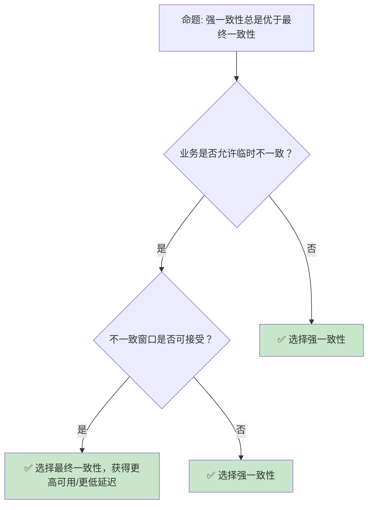
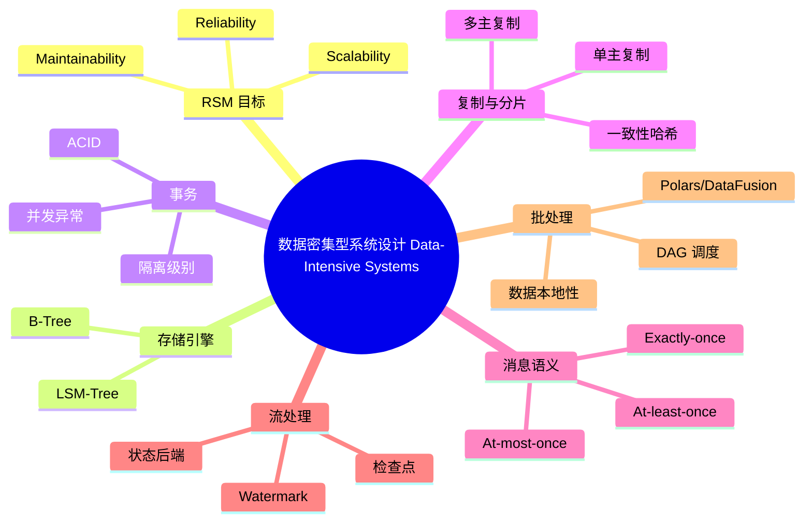

> **内容分级**: [专家级]
> **代码状态**: ✅ 含可编译示例
> **定理链**: N/A — 描述性/综述性/导航性文档，不涉及形式化定理链
>

# 数据密集型系统设计：存储、事务、复制与流批一体

> **EN**: Data-Intensive Systems Design
> **Summary**: Data-Intensive Systems Design — design principles for storage engines (B-tree/LSM), transaction isolation, replication/sharding, message delivery semantics, stream processing (watermarks/state), and batch scheduling, with Rust ecosystem examples.
> **Rust 版本**: 1.97.0+ (Edition 2024)
> **受众**: [进阶]
> **Bloom 层级**: L6
> **权威来源**: 本文件为 `concept/` 权威页。
> **A/S/P 标记**: **P+S+A** — Procedure + Structure + Application
> **双维定位**: C×Syn — 综合数据密集型系统的存储、一致性、流批处理设计
> **前置概念**: [Database Systems](04_database_systems.md) · [Data Engineering](05_data_engineering.md) · [Distributed Consensus](06_distributed_consensus.md) · [Stream Processing Ecosystem](03_stream_processing_ecosystem.md)
> **后置概念**: [Distributed Systems Protocols](11_distributed_systems_protocols.md) · [Performance Engineering Architecture](../10_performance/02_performance_engineering_architecture.md) · [Cloud Native](../04_web_and_networking/02_cloud_native.md)
>
> **来源**: [Designing Data-Intensive Applications — Martin Kleppmann](https://dataintensive.net/) · [DDIA 作者演讲与博客](https://martin.kleppmann.com/) · [Calm Theorem — Ameloot et al.](https://dl.acm.org/doi/10.1145/263690.263807) · [Apache Kafka Documentation](https://kafka.apache.org/documentation/) · [Apache Flink Documentation](https://nightlies.apache.org/flink/flink-docs-stable/) · [Apache Spark Documentation](https://spark.apache.org/docs/latest/)

---

> **来源**: [Database Internals — Alex Petrov](https://www.oreilly.com/library/view/database-internals/9781492043397/) · [Readings in Database Systems (Red Book)](http://www.redbook.io/) · [Google Spanner Paper](https://research.google/pubs/pub39966/) · [Amazon Aurora Paper](https://www.usenix.org/conference/atc18/presentation/verbitski) · [MapReduce Paper](https://research.google/pubs/pub62/) · [Polars](https://pola.rs/) · [DataFusion](https://arrow.apache.org/datafusion/) · [Apache Arrow](https://arrow.apache.org/)

## 📑 目录

- [数据密集型系统设计：存储、事务、复制与流批一体](#数据密集型系统设计存储事务复制与流批一体)
  - [📑 目录](#-目录)
  - [一、核心概念](#一核心概念)
    - [1.1 数据密集型系统的可靠性、可扩展性、可维护性](#11-数据密集型系统的可靠性可扩展性可维护性)
    - [1.2 存储引擎：B-Tree 与 LSM-Tree](#12-存储引擎b-tree-与-lsm-tree)
    - [1.3 事务与隔离级别](#13-事务与隔离级别)
    - [1.4 复制与分片](#14-复制与分片)
    - [1.5 消息语义：最多一次 / 至少一次 / 恰好一次](#15-消息语义最多一次--至少一次--恰好一次)
    - [1.6 流处理：Watermark、状态与检查点](#16-流处理watermark状态与检查点)
    - [1.7 批处理调度与资源管理](#17-批处理调度与资源管理)
  - [二、架构决策矩阵](#二架构决策矩阵)
  - [三、反命题与边界分析](#三反命题与边界分析)
    - [3.1 反命题树](#31-反命题树)
    - [3.2 边界极限](#32-边界极限)
  - [四、常见陷阱](#四常见陷阱)
  - [五、Rust 生态映射](#五rust-生态映射)
  - [六、边界测试](#六边界测试)
    - [6.1 边界测试：丢失更新与写偏斜（并发异常）](#61-边界测试丢失更新与写偏斜并发异常)
    - [6.2 边界测试：流处理 watermark 过晚导致数据静默丢失（逻辑错误）](#62-边界测试流处理-watermark-过晚导致数据静默丢失逻辑错误)
    - [6.3 边界测试：至少一次语义下重复消费（逻辑错误）](#63-边界测试至少一次语义下重复消费逻辑错误)
  - [相关概念](#相关概念)
  - [🧭 思维导图（Mindmap）](#-思维导图mindmap)

**变更日志**:

- v1.0 (2026-07-30): Wave 9 新增——数据密集型系统设计权威页，覆盖存储引擎、事务隔离、复制分片、消息语义、流处理 watermark/状态、批处理调度

---

## 一、核心概念

数据密集型系统的设计围绕三个目标展开：**可靠性**（Reliability）、**可扩展性**（Scalability）、**可维护性**（Maintainability）。这些目标通常互相牵制，工程师需要根据业务约束做出取舍。

```text
数据密集型系统的三大目标:

  可靠性 (Reliability)
  ├── 容错: 部分组件故障时系统继续工作
  ├── 弹性: 从故障中自动恢复
  └── 可预测的性能

  可扩展性 (Scalability)
  ├── 水平扩展: 加机器分摊负载
  ├── 垂直扩展: 单机性能提升
  └── 数据/负载增长时的表现可预测

  可维护性 (Maintainability)
  ├── 可运维性: 监控、部署、故障排查
  ├── 简单性: 消除意外复杂度
  └── 可演化性: 适应需求变化
```

> **认知功能**: 数据密集型系统设计的本质是**在一致性、可用性、分区容错性（CAP）之间做有意识的权衡**。
> [来源: [Designing Data-Intensive Applications](https://dataintensive.net/)]

---

### 1.1 数据密集型系统的可靠性、可扩展性、可维护性

> **[Designing Data-Intensive Applications — Martin Kleppmann](https://dataintensive.net/)** 将数据密集型系统的核心目标归纳为 RSM：Reliability、Scalability、Maintainability。这三大目标构成评估任何数据系统的基准框架。

| 目标 | 定义 | 典型指标 |
|:---|:---|:---|
| **Reliability** | 系统在 adversity（硬件故障、软件错误、人为失误）下继续正确运行 | MTTF、MTTR、错误率 |
| **Scalability** | 系统应对负载增长的能力 | 吞吐量、延迟、资源利用率 |
| **Maintainability** | 系统长期运行和演化的成本 | 部署频率、MTTR、文档完整性 |

**故障 vs 失效**：

- **故障（Fault）**: 组件偏离其规范，可能是硬件故障、网络分区、软件 bug。
- **失效（Failure）**: 系统整体停止向用户提供服务。
- 设计目标是**容错（fault-tolerant）**——通过冗余、复制、降级等机制防止单点故障演变为系统失效。

> **关键洞察**: Netflix 的"Chaos Monkey"实践表明，**有意引入故障**是验证可靠性的有效手段。数据系统应在设计阶段就考虑故障注入测试。
> [来源: [Chaos Engineering Book](https://www.oreilly.com/library/view/chaos-engineering/9781491983817/)]

---

### 1.2 存储引擎：B-Tree 与 LSM-Tree

存储引擎的选择直接影响读写性能、空间放大和写入放大。两大主流结构是 **B-Tree** 和 **LSM-Tree**。

| 特性 | B-Tree | LSM-Tree |
|:---|:---|:---|
| **读取性能** | 稳定 O(log n)，适合点查 | 可能需合并多层，适合范围扫描 |
| **写入性能** | 随机写，可能触发页分裂 | 顺序写，高吞吐 |
| **写入放大** | 较高（原地更新页） | 较低到中等（compaction 开销） |
| **读取放大** | 低 | 较高（需检查 memtable + SSTable） |
| **空间放大** | 较低 | 较高（多版本、待 compaction） |
| **适用场景** | OLTP、索引 | 时序、日志、高写入吞吐 |
| **代表系统** | PostgreSQL、SQLite、MySQL InnoDB | RocksDB、LevelDB、ScyllaDB |

**B-Tree 核心机制**：

```text
B-Tree:
  ├── 平衡多叉树，每个节点包含多个 key 和 pointer
  ├── 树高度稳定，点查只需 O(log n)
  ├── 更新时可能触发页分裂/合并
  └── 适合读取为主的 OLTP 工作负载
```

**LSM-Tree 核心机制**：

```text
LSM-Tree:
  ├── 写入先进入 memtable（内存有序结构）
  ├── memtable 满后刷盘为 immutable SSTable
  ├── 后台 compaction 合并 SSTable，清除旧版本
  └── 读取需查 memtable + bloom filter + 多层 SSTable
```

**Rust 生态**：

- **RocksDB 绑定**：`rust-rocksdb` 是工业级 LSM 引擎的 Rust 接口。
- **sled**：纯 Rust 嵌入式 KV 存储，使用 modern Bw-Tree 变体。
- **RisingWave / Materialize**：基于 LSM-Tree / shared-nothing 架构的 Rust 流数据库。

> **关键洞察**: "B-Tree vs LSM-Tree"不是优劣之分，而是**工作负载适配**。读多写少用 B-Tree，写多读少且可接受 compaction 抖动用 LSM-Tree。
> [来源: [Database Internals](https://www.oreilly.com/library/view/database-internals/9781492043397/)]

---

### 1.3 事务与隔离级别

> **事务**是一组操作的逻辑单元，满足 ACID 属性：原子性（Atomicity）、一致性（Consistency）、隔离性（Isolation）、持久性（Durability）。其中**隔离级别**是最常被误解和误配置的维度。

```text
ACID:

  Atomicity（原子性）
  ├── 事务要么全成功，要么全回滚
  └── 通过 undo log / WAL 实现

  Consistency（一致性）
  ├── 事务完成后数据库保持在有效状态
  └── 依赖约束、触发器、应用层不变量

  Isolation（隔离性）
  ├── 并发事务互不干扰的程度
  └── 由隔离级别定义

  Durability（持久性）
  ├── 已提交事务的结果不会丢失
  └── 通过 WAL 和复制实现
```

**SQL 标准隔离级别与异常**：

| 隔离级别 | 脏读 | 不可重复读 | 幻读 | 实现代价 |
|:---|:---:|:---:|:---:|:---|
| READ UNCOMMITTED | ✅ 允许 | ✅ 允许 | ✅ 允许 | 最低 |
| READ COMMITTED | ❌ 禁止 | ✅ 允许 | ✅ 允许 | 低 |
| REPEATABLE READ | ❌ 禁止 | ❌ 禁止 | 部分允许 | 中 |
| SERIALIZABLE | ❌ 禁止 | ❌ 禁止 | ❌ 禁止 | 高 |

> **注意**: 实际数据库的隔离级别实现常与标准有差异。例如 PostgreSQL 的 REPEATABLE READ 使用快照隔离，MySQL InnoDB 的 REPEATABLE READ 默认使用 next-key locking。

**并发异常示例**：

- **脏读（Dirty Read）**: 读到其他事务未提交的数据。
- **不可重复读（Non-repeatable Read）**: 同一事务内两次读取同一行得到不同结果。
- **幻读（Phantom Read）**: 同一事务内两次查询范围得到不同行集合。
- **丢失更新（Lost Update）**: 两个事务同时读取并修改同一数据，后提交者覆盖前者。
- **写偏斜（Write Skew）**: 两个事务读取重叠数据集并各自写入，导致违反业务不变量。

> **关键洞察**: 默认使用 READ COMMITTED 通常是合理的起点；只有在明确需要可串行化语义时才使用 SERIALIZABLE，因为后者会显著降低并发度。
> [来源: [A Critique of ANSI SQL Isolation Levels](https://www.microsoft.com/en-us/research/wp-content/uploads/2016/02/tr-95-51.pdf)]

---

### 1.4 复制与分片

> **复制（Replication）** 和 **分片（Sharding/Partitioning）** 是数据系统扩展的两大基本技术。复制解决可用性和读取扩展，分片解决数据量和写入扩展。

**复制模式**：

| 模式 | 机制 | 优点 | 缺点 |
|:---|:---|:---|:---|
| **单主复制** | 一个 leader，多个 follower | 简单、一致性强 | leader 瓶颈 |
| **多主复制** | 多个可写节点 | 写入扩展、就近写入 | 冲突解决复杂 |
| **无主复制** | 客户端写入多个节点 | 高可用、低延迟 | 读取修复、仲裁机制 |

**分片策略**：

| 策略 | 机制 | 优点 | 缺点 |
|:---|:---|:---|:---|
| **Key Range** | 按 key 范围分片 | 范围扫描高效 | 热点（如时间戳前缀） |
| **Hash** | 按 key 哈希分片 | 负载均匀 | 范围扫描需跨分片 |
| **复合** | 先按维度分桶，再按范围 | 兼顾两者 | 实现复杂 |

**Rust 生态示例**：

```rust,ignore
// 简单一致性哈希分片（教学示例）
use std::collections::BTreeMap;

struct ConsistentHashRing {
    ring: BTreeMap<u64, String>,
    replicas: usize,
}

impl ConsistentHashRing {
    fn new(nodes: &[String], replicas: usize) -> Self {
        let mut ring = BTreeMap::new();
        for node in nodes {
            for i in 0..replicas {
                let key = format!("{}:{}", node, i);
                let hash = seahash::hash(key.as_bytes());
                ring.insert(hash, node.clone());
            }
        }
        Self { ring, replicas }
    }

    fn get_node(&self, key: &str) -> Option<&String> {
        let hash = seahash::hash(key.as_bytes());
        self.ring.range(hash..).next().map(|(_, v)| v)
            .or_else(|| self.ring.values().next())
    }
}
```

> **关键洞察**: 复制和分片是**正交**的。一个系统可以同时使用分片 + 每个分片多副本。CAP 定理提醒我们在分区时必须在一致性和可用性之间选择。
> [来源: [CAP Twelve Years Later](https://sites.cs.ucsb.edu/~rich/class/cs293b-cloud/papers/brewer-cap.pdf)]

---

### 1.5 消息语义：最多一次 / 至少一次 / 恰好一次

消息系统（Kafka、RabbitMQ、Pulsar）的交付语义直接影响应用正确性。

| 语义 | 含义 | 实现代价 | 适用场景 |
|:---|:---|:---|:---|
| **At-most-once** | 消息可能丢失，但不重复 | 最低 | 可容忍丢失的指标、日志 |
| **At-least-once** | 消息不丢失，但可能重复 | 中 | 大多数业务系统（配合幂等） |
| **Exactly-once** | 消息不丢失且不重复 | 高 | 金融交易、状态精确系统 |

> **重要**: "恰好一次"在分布式系统中通常指 **exactly-once processing semantics**，即端到端语义的组合：至少一次交付 + 幂等消费 + 事务性 offset 提交。真正的物理上只交付一次在网络层不可能，因为确认消息本身可能丢失。

**幂等性设计**：

```rust
use std::collections::HashSet;

struct IdempotentProcessor {
    processed_ids: HashSet<String>,
}

impl IdempotentProcessor {
    fn process(&mut self, id: String, payload: impl FnOnce()) {
        if self.processed_ids.insert(id.clone()) {
            payload();
            println!("processed {}", id);
        } else {
            println!("duplicate ignored {}", id);
        }
    }
}

fn main() {
    let mut processor = IdempotentProcessor { processed_ids: HashSet::new() };
    processor.process("order-42".to_string(), || println!("charging order 42"));
    processor.process("order-42".to_string(), || println!("charging order 42")); // 幂等忽略
}
```

> **关键洞察**: 大多数系统应选择 **at-least-once + 幂等消费者**。exactly-once 需要事务性状态存储和协调，仅在严格正确性场景使用。
> [来源: [Kafka Delivery Semantics](https://kafka.apache.org/documentation/#semantics)]

---

### 1.6 流处理：Watermark、状态与检查点

> **流处理**与批处理的根本区别是数据无界、到达无序、时间语义复杂。Watermark、状态和检查点是流处理系统的三个核心机制。

```text
流处理时间语义:

  Event Time: 事件实际发生的时间（业务时间）
  Processing Time: 事件被处理的时间（机器时间）
  Ingestion Time: 事件进入系统的时间
```

**Watermark**：

- Watermark 是一个时间戳，表示"小于该时间戳的数据应该都已经到达"。
- 用于触发事件时间窗口的计算和清理过期状态。
- 配置过紧会丢弃延迟数据，配置过松会延长状态持有时间。

**状态后端**：

| 后端 | 特点 | 适用 |
|:---|:---|:---|
| Memory | 低延迟，重启丢失 | 测试、低重要性 |
| RocksDB | 大状态、可恢复 | 生产、大状态 |
| 远程存储 | 超大状态、持久化 | 长窗口、合规 |

**检查点（Checkpoint）**：

- 定期将算子状态持久化到分布式存储。
- 故障时从最近检查点恢复，保证 at-least-once 或 exactly-once。
- 检查点间隔是延迟与恢复粒度的权衡。

**Rust 生态**：

- **timely-dataflow / differential-dataflow**：低层流处理引擎，支持逻辑时间和增量计算。
- **tokio-stream / futures**：应用层异步流抽象。
- **RisingWave / Materialize**：Rust 实现的流数据库，内置 watermark 和物化视图。

> **关键洞察**: 流处理系统的正确性很大程度取决于**事件时间语义**和**状态管理**。忽略 watermark 会导致静默的数据丢失或结果延迟。
> [来源: [Streaming Systems Book](https://www.oreilly.com/library/view/streaming-systems/9781491983879/)]

---

### 1.7 批处理调度与资源管理

> **批处理**处理有界数据集，核心挑战是**把大任务拆分为可调度、可容错、可扩展的小任务**。调度器、数据本地性和容错机制是三大设计焦点。

**批处理框架对比**：

| 框架 | 调度模型 | 数据抽象 | Rust 生态对应 |
|:---|:---|:---|:---|
| **MapReduce** | 两阶段 map/reduce | 键值对 | 教学/历史 |
| **Spark** | DAG 执行、内存计算 | RDD/DataFrame | Polars/DataFusion（单机/嵌入式） |
| **Flink** | 流批统一 | DataStream | timely-dataflow |
| **Ray** | 任务图 + actor | ObjectRef | N/A（主要 Python） |

**调度关键概念**：

- **数据本地性**: 把任务调度到数据所在节点，减少网络传输。
- **推测执行（Speculative Execution）**: 对慢任务启动副本，取最先完成的结果。
- **DAG 优化**: 基于执行计划做谓词下推、列裁剪、连接重排。

**Rust 批处理生态**：

- **Polars**：DataFrame API，单机高性能批处理。
- **DataFusion**：SQL 查询引擎，可嵌入应用。
- **Ballista**：DataFusion 的分布式调度器（Rust 实现）。
- **Apache Arrow**：列式内存格式，实现零拷贝数据交换。

> **关键洞察**: 批处理的未来是**流批统一**——用同一套语义和引擎处理有界和无界数据。Flink 和 Spark Structured Streaming 是这一趋势的代表。
> [来源: [Apache Spark Documentation](https://spark.apache.org/docs/latest/)]

---

## 二、架构决策矩阵

```text
场景 → 方案 → Rust 生态

高吞吐写入（日志/时序）:
  → LSM-Tree（RocksDB）
  → rust-rocksdb, sled

OLTP 点查:
  → B-Tree / Bw-Tree
  → PostgreSQL 绑定, sled

事务性工作负载:
  → 串行化或快照隔离
  → sqlx + PostgreSQL, rustqlite

读取扩展:
  → 单主复制 + 读副本
  → 应用层路由

写入扩展:
  → 分片（一致性哈希）
  → 自研分片逻辑

消息传递:
  → at-least-once + 幂等
  → rdkafka, fluvio, lapin

流处理:
  → watermark + 检查点
  → timely-dataflow, tokio-stream

批处理:
  → DataFrame / SQL 引擎
  → polars, datafusion, ballista
```

> **架构洞察**: 选型应先从**访问模式**和**一致性需求**出发，再匹配存储引擎和计算框架，而不是反过来。
> [来源: [Designing Data-Intensive Applications](https://dataintensive.net/)]

---

## 三、反命题与边界分析

数据密集型系统设计中有三个常见误判：

1. **"强一致性总是最好的选择"** —— 不成立。强一致性意味着更高的延迟和更低的可用性；许多场景（如社交点赞、推荐系统）最终一致即可。
2. **"分区/分片能解决所有扩展问题"** —— 不成立。分片引入跨分片查询、事务和再平衡复杂度；数据访问热点可能使分片效果大打折扣。
3. **"exactly-once 是真的只交付一次"** —— 不成立。分布式系统无法保证物理上的 exactly-once；它实际上是"恰好一次处理语义"的组合。

### 3.1 反命题树



> **认知功能**: 一致性不是越强越好，而是**与业务语义匹配**。银行转账需要强一致，社交 feed 不需要。
> [来源: [PACELC Theorem](https://cs.brown.edu/courses/csci2270/archives/2017/papers/abadi-pacelc.pdf)]

### 3.2 边界极限

| **边界** | **现状** | **理论极限** | **工程影响** |
|:---|:---|:---|:---|
| **串行化并发度** | 高冲突场景性能急剧下降 | 可串行化调度 | 乐观/悲观控制选择 |
| **LSM 读取放大** | 100x+（未优化） | 单层 SSTable | compaction 策略调优 |
| **分布式事务延迟** | 数十到数百毫秒 | 2PC/3PC 的网络 RTT |  saga 模式补偿 |
| **exactly-once 成本** | 事务性 offset + 状态 | 无法物理消除重复 | 评估是否真需要 |
| **流状态大小** | 受限于状态后端 | 无限（理论） | 状态 TTL、分层存储 |

> **边界要点**: 数据系统的边界主要与**一致性成本、存储放大、分布式事务延迟、消息语义成本和状态规模**相关。
> [来源: [Calm Theorem](https://dl.acm.org/doi/10.1145/263690.263807)]

---

## 四、常见陷阱

```text
陷阱 1: 默认使用最强隔离级别
  ❌ 所有事务都 SERIALIZABLE
     // 严重降低并发，无必要

  ✅ 从 READ COMMITTED 开始，仅在必要时升级

陷阱 2: 忽视写入放大
  ❌ LSM-Tree 默认参数用于所有场景
     // compaction 抖动、写放大爆炸

  ✅ 根据 SSD/HDD、写入量、读取模式调参

陷阱 3: 跨分片事务滥用
  ❌ 在分片架构中频繁使用分布式事务
     // 性能差、可用性低

  ✅ 按业务边界聚合数据，使用 saga/补偿模式

陷阱 4: 假设 exactly-once 免费
  ❌ "框架说支持 exactly-once 就不管幂等"
     // 端到端语义仍需应用层保证

  ✅ 明确 exactly-once 范围，配合幂等/去重

陷阱 5: 无界状态增长
  ❌ 流处理窗口永不清理
     // OOM

  ✅ 配置 watermark、状态 TTL、增量检查点
```

> **陷阱总结**: 数据密集型系统的陷阱多与**过度一致、忽视存储成本、滥用分布式事务、误解消息语义**和**无界状态**相关。
> [来源: [DDIA Chapter 7 — Transactions](https://dataintensive.net/)]

---

## 五、Rust 生态映射

| 数据系统领域 | 推荐 Rust crate/项目 | 说明 |
|:---|:---|:---|
| 列式 DataFrame | `polars` | 高性能，受 pandas 启发 |
| SQL 查询引擎 | `datafusion` | 嵌入式分析引擎 |
| 分布式 SQL | `ballista` | DataFusion 的分布式调度 |
| LSM KV | `rust-rocksdb` | RocksDB 绑定 |
| 嵌入式 KV | `sled` | 纯 Rust Bw-Tree |
| Kafka 客户端 | `rdkafka` | librdkafka 绑定 |
| 流处理 | `timely-dataflow` / `differential-dataflow` | 低层引擎 |
| 异步流 | `tokio-stream` / `futures` | 应用层流抽象 |
| 列式内存格式 | `arrow-rs` | Apache Arrow Rust 实现 |
| 对象存储 | `object_store` | S3/GCS/Azure 统一接口 |
| 流数据库 | RisingWave / Materialize | Rust 实现的商业/开源产品 |

> **关键洞察**: Rust 数据生态正在从"高性能组件"走向"完整系统"（RisingWave、Materialize、Polars 云）。其无 GC、内存安全和 fearless 并发特性使其特别适合构建数据基础设施。
> [来源: [Polars](https://pola.rs/)] · [来源: [DataFusion](https://arrow.apache.org/datafusion/)]

---

## 六、边界测试

数据密集型系统的边界测试聚焦三类高危场景：并发异常、流处理 watermark 误配、消息语义误解。

### 6.1 边界测试：丢失更新与写偏斜（并发异常）

```rust
// ❌ 错误：读取-修改-写入无并发控制
use std::sync::{Arc, Mutex};

fn bad_increment(counter: Arc<Mutex<u64>>) {
    let current = *counter.lock().unwrap(); // 读取
    let new = current + 1;                  // 修改
    *counter.lock().unwrap() = new;         // 写入（可能丢失其他线程的更新）
}

// ✅ 修正：持有锁跨越整个 RMW 序列
fn good_increment(counter: Arc<Mutex<u64>>) {
    let mut guard = counter.lock().unwrap();
    *guard += 1;
}

fn main() {
    let counter = Arc::new(Mutex::new(0));
    bad_increment(Arc::clone(&counter));
    good_increment(Arc::clone(&counter));
    assert_eq!(*counter.lock().unwrap(), 2);
}
```

> **修正**: 读取-修改-写入（RMW）操作必须原子执行。在数据库中对应使用 `SELECT FOR UPDATE`、乐观锁或原子操作。Rust 的 `Mutex` 所有权语义天然防止 RMW 拆分，但数据库层面的并发仍需显式控制。
> [来源: [DDIA Chapter 7](https://dataintensive.net/)]

### 6.2 边界测试：流处理 watermark 过晚导致数据静默丢失（逻辑错误）

```rust,ignore
// ❌ 错误：watermark 过紧，延迟数据被丢弃
fn bad_window(events: Stream<Event>) -> Stream<WindowResult> {
    events
        .assign_timestamps(|e| e.timestamp)
        .with_watermark(Duration::from_secs(1)) // 只允许 1 秒延迟
        .window(Duration::from_secs(60))
        .sum()
        // 任何延迟超过 1 秒的数据被静默丢弃
}

// ✅ 修正：合理 watermark + 侧输出处理延迟数据
fn good_window(events: Stream<Event>) -> (Stream<WindowResult>, Stream<Event>) {
    events
        .assign_timestamps(|e| e.timestamp)
        .with_watermark(Duration::from_secs(60))
        .window(Duration::from_secs(60))
        .allowed_lateness(Duration::from_secs(300)) // 5 分钟延迟窗口
        .sum_with_late_output()
}
```

> **修正**: Watermark 是**启发式**而非保证。业务上重要的延迟数据应通过侧输出（side output）处理，而不是静默丢弃。
> [来源: [Apache Flink Watermarks](https://nightlies.apache.org/flink/flink-docs-stable/docs/concepts/time/)]

### 6.3 边界测试：至少一次语义下重复消费（逻辑错误）

```rust
// ❌ 错误：at-least-once 语义下无幂等保护
use std::collections::HashSet;

fn charge_card(_order_id: &str, _amount: u64) {
    // 模拟扣款
}

fn process_payment(order_id: &str, amount: u64) {
    // 若 consumer 处理完消息但 offset 提交失败，消息会被重新消费
    // → 同一订单被扣款两次
    charge_card(order_id, amount);
}

// ✅ 修正：按业务 ID 幂等
fn process_payment_idempotent(
    processed: &mut HashSet<String>,
    order_id: String,
    amount: u64
) {
    if processed.insert(order_id.clone()) {
        charge_card(&order_id, amount);
    }
}

fn main() {
    let mut processed = HashSet::new();
    process_payment_idempotent(&mut processed, "order-42".to_string(), 100);
    process_payment_idempotent(&mut processed, "order-42".to_string(), 100); // 幂等忽略
}
```

> **修正**: 在 at-least-once 语义下，重复消费是必然的。必须通过业务 ID 去重、数据库唯一约束或状态存储实现幂等。
> [来源: [Kafka Delivery Semantics](https://kafka.apache.org/documentation/#semantics)]

---

## 相关概念

- [Database Systems](04_database_systems.md) — 数据库系统基础
- [Data Engineering](05_data_engineering.md) — ETL/ELT、DataFrame、对象存储
- [Distributed Consensus](06_distributed_consensus.md) — Raft/Paxos、一致性
- [Stream Processing Ecosystem](03_stream_processing_ecosystem.md) — Rust 流处理生态
- [Distributed Systems Protocols](11_distributed_systems_protocols.md) — 分布式协议
- [Performance Engineering Architecture](../10_performance/02_performance_engineering_architecture.md) — 性能工程
- [Cloud Native](../04_web_and_networking/02_cloud_native.md) — 云原生部署
- [Concurrency](../../03_advanced/00_concurrency/01_concurrency.md) — 并发模型
- [Async/Await](../../03_advanced/01_async/01_async.md) — 异步编程

> **权威来源**: [Rust Reference](https://doc.rust-lang.org/reference/introduction.html) · [The Rust Programming Language](https://doc.rust-lang.org/book/title-page.html) · [Rust Standard Library](https://doc.rust-lang.org/std/index.html)

---

## 🧭 思维导图（Mindmap）



> **认知功能**: 本 mindmap 从本页「数据密集型系统设计」的章节结构提炼，一级分支对应核心主题，叶子节点为关键子概念，可作为本页的快速导航与复习索引。
