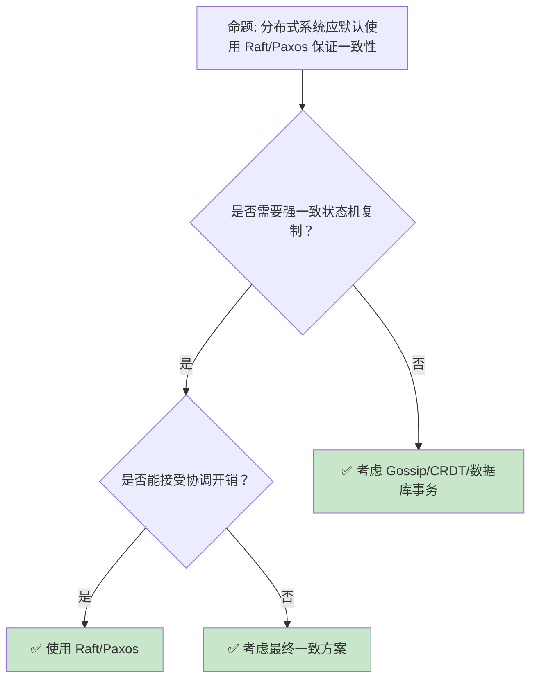
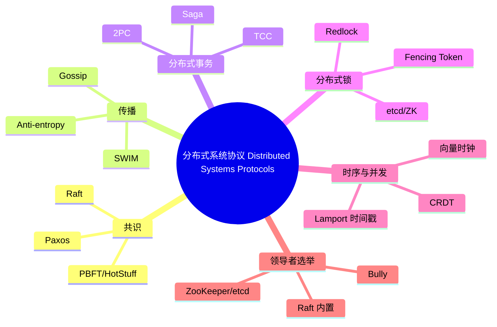

> **内容分级**: [专家级]
> **代码状态**: ✅ 含可编译示例
> **定理链**: N/A — 描述性/综述性/导航性文档，不涉及形式化定理链
>

# 分布式系统协议：共识、传播、事务与时序

> **EN**: Distributed Systems Protocols
> **Summary**: Distributed Systems Protocols — engineering tour of Paxos/Raft, gossip protocols, 2PC/TCC, distributed locks, CRDT/vector clocks, and leader election, with Rust ecosystem implementations (raft-rs, openraft, artillery) and links to the consensus theory canonical page.
> **Rust 版本**: 1.97.0+ (Edition 2024)
> **受众**: [进阶]
> **Bloom 层级**: L5-L6
> **权威来源**: 本文件为 `concept/` 权威页。
> **A/S/P 标记**: **P+S+A** — Procedure + Structure + Application
> **双维定位**: C×App — 应用分布式协议解决工程问题
> **前置概念**: [Distributed Consensus](06_distributed_consensus.md) · [CRDT Type Zoo](08_crdt_type_zoo.md) · [Causal Ordering and Vector Clocks](09_causal_ordering_vector_clocks.md) · [Network Protocols](../04_web_and_networking/07_network_protocols.md)
> **后置概念**: [Data-Intensive Systems Design](10_data_intensive_systems_design.md) · [Blockchain](../11_domain_applications/01_blockchain.md) · [Cloud Native](../04_web_and_networking/02_cloud_native.md)
>
> **来源**: [Paxos Made Simple — Lamport 2001](https://lamport.azurewebsites.net/pubs/paxos-simple.pdf) · [Raft Paper — Ongaro & Ousterhout 2014](https://raft.github.io/raft.pdf) · [SWIM Protocol Paper](https://www.cs.cornell.edu/projects/Quicksilver/public_pdfs/SWIM.pdf) · [2PC Survey](https://dl.acm.org/doi/10.1145/289.291) · [Amazon Dynamo Paper](https://www.allthingsdistributed.com/files/amazon-dynamo-sosp2007.pdf) · [Redlock Analysis — Martin Kleppmann](https://martin.kleppmann.com/2016/02/08/how-to-do-distributed-locking.html) · [CRDT Survey — Shapiro et al.](https://hal.inria.fr/file/index/docid/555588/filename/techreport.pdf)

---

> **来源**: [raft-rs](https://docs.rs/raft/) · [openraft](https://docs.rs/openraft/) · [artillery-core](https://docs.rs/artillery-core/) · [tikv/client-rust](https://github.com/tikv/client-rust) · [zero-to-production.com](https://www.zero-to-production.com/) · [Rust Atomics and Locks — Mara Bos](https://marabos.nl/atomics/)

## 📑 目录

- [分布式系统协议：共识、传播、事务与时序](#分布式系统协议共识传播事务与时序)
  - [📑 目录](#-目录)
  - [一、核心概念](#一核心概念)
    - [1.1 协议分层视角](#11-协议分层视角)
    - [1.2 共识协议：Paxos / Raft（概览）](#12-共识协议paxos--raft概览)
    - [1.3 Gossip 协议与成员发现](#13-gossip-协议与成员发现)
    - [1.4 分布式事务：2PC / TCC / Saga](#14-分布式事务2pc--tcc--saga)
    - [1.5 分布式锁](#15-分布式锁)
    - [1.6 CRDT 与向量时钟](#16-crdt-与向量时钟)
    - [1.7 领导者选举](#17-领导者选举)
  - [二、协议选型矩阵](#二协议选型矩阵)
  - [三、反命题与边界分析](#三反命题与边界分析)
    - [3.1 反命题树](#31-反命题树)
    - [3.2 边界极限](#32-边界极限)
  - [四、常见陷阱](#四常见陷阱)
  - [五、Rust 生态落地](#五rust-生态落地)
  - [六、边界测试](#六边界测试)
    - [6.1 边界测试：Redlock 时钟回拨导致锁失效（运行时安全漏洞）](#61-边界测试redlock-时钟回拨导致锁失效运行时安全漏洞)
    - [6.2 边界测试：CRDT 合并忽略业务语义（逻辑错误）](#62-边界测试crdt-合并忽略业务语义逻辑错误)
    - [6.3 边界测试：向量时钟比较误判并发（逻辑错误）](#63-边界测试向量时钟比较误判并发逻辑错误)
  - [相关概念](#相关概念)
  - [🧭 思维导图（Mindmap）](#-思维导图mindmap)

**变更日志**:

- v1.0 (2026-07-30): Wave 9 新增——分布式系统协议权威页，覆盖 Paxos/Raft 概览、Gossip、2PC/TCC/Saga、分布式锁、CRDT/向量时钟、领导者选举与 Rust 实现生态

---

## 一、核心概念

分布式系统协议解决四类核心问题：**一致性**（多个节点对某个值达成一致）、**传播**（信息如何高效可靠地扩散）、**事务**（跨多个节点的原子操作）、**时序**（事件因果关系的确定）。

```text
分布式系统协议地图:

  一致性 (Consensus)
  ├── Paxos / Multi-Paxos
  ├── Raft
  ├── PBFT / HotStuff（拜占庭容错）
  └── 权威页: 06_distributed_consensus.md

  传播 (Dissemination)
  ├── Gossip / Epidemic Broadcast
  ├── SWIM 成员发现
  └── Anti-entropy 修复

  事务 (Transactions)
  ├── 2PC（两阶段提交）
  ├── 3PC（三阶段提交）
  ├── TCC（Try-Confirm-Cancel）
  └── Saga（长事务补偿）

  时序 (Ordering)
  ├── 向量时钟（Vector Clocks）
  ├── Lamport 时间戳
  ├── CRDT（无冲突复制数据类型）
  └── 物理时钟与逻辑时钟
```

> **认知功能**: 协议选型应先看问题属于哪一类，再评估一致性强度、容错能力和工程复杂度。
> [来源: [Designing Data-Intensive Applications](https://dataintensive.net/)]

---

### 1.1 协议分层视角

从网络模型看，分布式协议运行在异步（Async）网络之上，面临消息延迟、丢失、乱序和重复。协议的设计必须在**正确性保证**与**工程可行性**之间取舍。

```text
分布式协议依赖的基础假设:

  网络:
  ├── 异步网络：消息延迟无上界
  ├── 可能丢包、乱序、重复
  └── 分区可能发生

  故障模型:
  ├── 崩溃停止（Crash-Stop）
  ├── 崩溃恢复（Crash-Recovery）
  ├── 遗漏故障（Omission）
  └── 拜占庭故障（Byzantine）

  正确性目标:
  ├── 安全性（Safety）: 不会发生坏事
  └── 活性（Liveness）: 最终会发生好事
```

> **关键洞察**: FLP 不可能结果表明，在纯异步网络中即使只有一个崩溃节点，也不存在确定性的共识算法。工程协议通过超时、故障检测器和随机化绕过这一理论极限。
> [来源: [FLP Result](https://groups.csail.mit.edu/tds/papers/Lynch/jacm85.pdf)]

---

### 1.2 共识协议：Paxos / Raft（概览）

> 共识的完整形式理论、FLP 证明、Paxos/Raft/PBFT 不变量与安全论证见权威页 [Distributed Consensus](06_distributed_consensus.md)。本节只保留工程选型视角和 Rust 实现要点。

| 协议 | 容错模型 | 消息复杂度 | 典型应用 | Rust 实现 |
|:---|:---|:---:|:---|:---|
| **Paxos** | 崩溃停止 | O(n²) | Chubby、ZooKeeper | 较少原生实现 |
| **Raft** | 崩溃停止 | O(n) | etcd、TiKV、Consul | raft-rs、openraft |
| **PBFT** | 拜占庭 | O(n²) | 联盟链 | 研究原型 |
| **HotStuff** | 拜占庭 | O(n) | Diem/Libra | hotstuff-rs |

**Raft 工程要点**：

- 将共识分解为**领导者选举**、**日志复制**、**安全性**三个子问题。
- Leader 选举使用随机超时避免 split vote。
- 已提交日志必须被复制到多数派。
- 生产实现需处理成员变更（Joint Consensus）和快照。

**Rust 示例 — Raft 节点状态（教育简化）**：

```rust
#[derive(Debug, Clone, PartialEq, Eq)]
enum NodeRole {
    Follower,
    Candidate,
    Leader,
}

struct RaftNode {
    id: u64,
    role: NodeRole,
    current_term: u64,
    voted_for: Option<u64>,
    commit_index: u64,
    last_applied: u64,
}

impl RaftNode {
    fn new(id: u64) -> Self {
        Self {
            id,
            role: NodeRole::Follower,
            current_term: 0,
            voted_for: None,
            commit_index: 0,
            last_applied: 0,
        }
    }

    // 收到更高任期时降级为 Follower
    fn observe_term(&mut self, term: u64) {
        if term > self.current_term {
            self.current_term = term;
            self.role = NodeRole::Follower;
            self.voted_for = None;
        }
    }
}

fn main() {
    let mut node = RaftNode::new(1);
    node.observe_term(5);
    assert_eq!(node.role, NodeRole::Follower);
    assert_eq!(node.current_term, 5);
}
```

> **关键洞察**: 生产环境中应直接使用成熟的 Raft 库（raft-rs、openraft），而不是自己实现。共识协议的正确性极易在边界条件（网络分区、成员变更、快照）上出错。
> [来源: [raft-rs](https://docs.rs/raft/)] · [来源: [openraft](https://docs.rs/openraft/)]

---

### 1.3 Gossip 协议与成员发现

> **Gossip 协议**（Epidemic Protocol）通过随机两两交换信息实现大规模集群中的状态传播。它保证最终一致性，但不保证即时一致性。

**SWIM 协议**（Scalable Weakly-consistent Infection-style Process Group Membership）是经典的成员发现协议：

```text
SWIM 协议:

  1. 故障检测
     ├── 随机选择目标节点发送 ping
     ├── 若超时，通过 k 个间接节点询问
     └── 确认故障则广播 suspect/fail 消息

  2. 传播（Dissemination）
     ├── 每个消息附带最近更新的成员状态
     └── 通过 gossip 机制逐步扩散到全网

  3. 优点
     ├── 可扩展到数千节点
     ├── 网络负载 O(log n) 每节点
     └── 弱一致性适合成员发现
```

**Gossip 适用场景**：

- 分布式缓存失效传播（如 Redis Cluster、Cassandra）。
- 成员发现和故障检测。
- 聚合计算（如 HyperLogLog 分布式近似统计）。

**Rust 生态**：

- **artillery-core**：Rust 实现的 SWIM/gossip 协议库。
- **mesh-network**：Rust P2P 网络实验项目。

> **关键洞察**: Gossip 适合**可容忍最终一致**的场景。对于必须立即一致的配置（如集群 Leader、分片映射），应使用共识协议而非 Gossip。
> [来源: [SWIM Protocol Paper](https://www.cs.cornell.edu/projects/Quicksilver/public_pdfs/SWIM.pdf)]

---

### 1.4 分布式事务：2PC / TCC / Saga

> **分布式事务**解决跨多个节点/服务的原子操作问题。不同协议在一致性强度、可用性和复杂度之间取舍。

| 模式 | 协议 | 优点 | 缺点 | 适用场景 |
|:---|:---|:---|:---|:---|
| **2PC** | 两阶段提交 | 强一致、简单理解 | 协调者单点、阻塞 | 传统单体拆分初期 |
| **3PC** | 三阶段提交 | 减少阻塞窗口 | 复杂、网络分区仍可能不一致 | 较少使用 |
| **TCC** | Try-Confirm-Cancel | 业务层面控制、无全局锁 | 业务侵入大 | 电商库存、支付 |
| **Saga** | 补偿事务 | 高可用、最终一致 | 补偿设计复杂 | 长事务、微服务 |

**2PC 流程**：

```text
2PC 两阶段提交:

  Phase 1 — Prepare:
    Coordinator → Participants: PREPARE
    Participants: 锁定资源，写 redo/undo，回复 YES/NO

  Phase 2 — Commit/Rollback:
    若所有 YES → Coordinator 发送 COMMIT
    若任一 NO → Coordinator 发送 ROLLBACK
    Participants: 执行并释放锁

  风险:
    ├── Coordinator 崩溃 → 参与者阻塞等待
    └── 网络分区 → 部分提交部分回滚
```

**Saga 模式**：

```text
Saga:
  ├── 将长事务拆分为多个本地事务
  ├── 每个本地事务有对应的补偿操作
  └── 若某步失败，执行已完步骤的补偿

  示例：酒店预订 Saga
    T1: 预订酒店 → C1: 取消酒店
    T2: 预订租车 → C2: 取消租车
    T3: 预订机票 → C3: 取消机票
```

> **关键洞察**: 现代微服务架构倾向于 **Saga + 最终一致**，而非 2PC。2PC 的阻塞特性在高可用系统中难以接受。
> [来源: [Saga Pattern — Chris Richardson](https://microservices.io/patterns/data/saga.html)]

---

### 1.5 分布式锁

> **分布式锁**用于在分布式环境中协调对共享资源的访问。与单机锁不同，分布式锁必须考虑网络分区、时钟不可靠和客户端崩溃。

**常见实现**：

| 实现 | 机制 | 优点 | 风险 |
|:---|:---|:---|:---|
| **Redis Redlock** | 向多个 Redis 实例加锁，多数成功即获得锁 | 简单、低延迟 | 时钟回拨、GC 暂停导致锁失效 |
| **ZooKeeper / etcd** | 基于临时顺序节点的锁 | 与客户端会话绑定，崩溃自动释放 | 依赖协调服务可用性 |
| **数据库行锁** | `SELECT FOR UPDATE` / 唯一索引 | 已有基础设施 | 死锁、性能差 |

**Redlock 争议**：

> Martin Kleppmann 指出，Redlock 依赖**时钟同步**，而分布式系统中的时钟并不可靠。GC 暂停、时钟回拨或网络延迟都可能使客户端在锁过期后仍执行临界区代码，导致互斥失效。

**安全使用分布式锁的要求**：

1. 锁必须具有**过期时间**（防止客户端崩溃后死锁）。
2. 操作必须在锁过期前完成，或通过**看门狗续期**。
3. 释放锁时必须使用**唯一 token**（防止误删他人锁）。
4. 高安全场景优先使用 ZooKeeper/etcd 而非 Redis。

> **关键洞察**: 分布式锁不是"分布式版的 Mutex"。它需要处理租约、 fencing token、时钟不确定性和网络分区。
> [来源: [How to do distributed locking — Martin Kleppmann](https://martin.kleppmann.com/2016/02/08/how-to-do-distributed-locking.html)]

---

### 1.6 CRDT 与向量时钟

> **CRDT（Conflict-free Replicated Data Types）** 是无冲突复制数据类型，通过数学结构保证多个副本独立更新后最终收敛到一致状态，**无需共识协议**。

| CRDT 类型 | 示例 | 合并策略 |
|:---|:---|:---|
| **G-Counter** | 计数器 | 每个副本取最大值 |
| **PN-Counter** | 可增可减计数器 | 分别合并增/减 G-Counter |
| **G-Set** | 只增集合 | 并集 |
| **OR-Set** | 增删集合 | 唯一标签标记元素 |
| **LWW-Register** | 最后写入胜出寄存器 | 时间戳比较 |

**Rust 示例 — G-Counter**：

```rust
#[derive(Debug, Clone)]
struct GCounter {
    counts: Vec<u64>,
}

impl GCounter {
    fn new(replicas: usize) -> Self {
        Self { counts: vec![0; replicas] }
    }

    fn increment(&mut self, replica_id: usize) {
        self.counts[replica_id] += 1;
    }

    fn value(&self) -> u64 {
        self.counts.iter().sum()
    }

    fn merge(&mut self, other: &Self) {
        for (a, b) in self.counts.iter_mut().zip(&other.counts) {
            *a = (*a).max(*b);
        }
    }
}

fn main() {
    let mut a = GCounter::new(2);
    let mut b = GCounter::new(2);

    a.increment(0);
    a.increment(0);
    b.increment(1);

    a.merge(&b);
    println!("merged value: {}", a.value()); // 3
}
```

**向量时钟（Vector Clocks）**：

- 每个节点维护一个向量，记录自己对其他节点事件计数的认知。
- 通过比较向量时钟判断事件因果关系：
  - `VC1 < VC2`：事件 1 发生在事件 2 之前。
  - `VC1 || VC2`：事件并发，需冲突解决。

详细内容见 [Causal Ordering and Vector Clocks](09_causal_ordering_vector_clocks.md) 和 [CRDT Type Zoo](08_crdt_type_zoo.md)。

> **关键洞察**: CRDT 和向量时钟代表了"接受并发、 eventual consistency"的路线，与共识协议的"强一致、全序"路线互补。离线协作、边缘计算等场景特别适合 CRDT。
> [来源: [CRDT Survey](https://hal.inria.fr/file/index/docid/555588/filename/techreport.pdf)]

---

### 1.7 领导者选举

> **领导者选举（Leader Election）** 是分布式系统中常见的协调问题：从一组节点中选出一个 Leader，其他节点作为 Follower，Leader 负责协调写操作或任务分配。

**常见实现方式**：

| 方式 | 机制 | 优点 | 缺点 |
|:---|:---|:---|:---|
| **Bully 算法** | 进程 ID 最大者胜 | 简单 | 网络分区时多 Leader |
| **Ring 算法** | 令牌环传递 | 无单点 | 延迟高 |
| **ZooKeeper / etcd** | 临时顺序节点 | 可靠、与会话绑定 | 依赖外部服务 |
| **Raft 内置** | 任期与投票 | 与共识一体 | 实现复杂 |

**基于 etcd 的领导者选举骨架**：

```rust,ignore
// 依赖: etcd-client
use etcd_client::{Client, LeaseGrantOptions};

async fn try_become_leader(etcd: &mut Client, candidate: &str) -> anyhow::Result<bool> {
    // 1. 授予短租约
    let lease = etcd.lease_grant(10, None).await?;

    // 2. 尝试创建带租约的键（原子 compare-and-create）
    let key = "/leader";
    let txn = etcd.txn().await?
        .when([etcd_client::TxnOp::cmp(
            key, etcd_client::CompareOp::Equal, ""
        )])
        .and_then([etcd_client::TxnOp::put(
            key, candidate, Some(etcd_client::PutOptions::new().with_lease(lease.id()))
        )])
        .or_else([])
        .commit().await?;

    Ok(txn.succeeded())
}
```

> **关键洞察**: 领导者选举常与租约（lease）结合，防止旧 Leader 在网络分区后继续服务。租约到期后必须主动下台。
> [来源: [etcd Leader Election](https://etcd.io/docs/v3.5/dev-guide/api_concurrency_reference_v3/)]

---

## 二、协议选型矩阵

```text
问题 → 协议 → Rust 生态

需要强一致状态机复制:
  → Raft / Paxos
  → raft-rs, openraft

需要大规模成员发现:
  → SWIM / Gossip
  → artillery-core

需要跨服务原子事务:
  → Saga / TCC
  → 自研协调器 + sqlx/sea-orm

需要协调共享资源:
  → 分布式锁（etcd/ZooKeeper）
  → etcd-client, zookeeper-client

需要离线/最终一致:
  → CRDT
  → crdts crate, rust-crdt

需要事件因果关系:
  → 向量时钟
  → 自研或 rust-vclock
```

> **架构洞察**: 不要为用协议而用协议。多数系统只需要"Raft 做元数据共识 + Saga 做业务事务 + CRDT/向量时钟处理边缘并发"。
> [来源: [Designing Data-Intensive Applications](https://dataintensive.net/)]

---

## 三、反命题与边界分析

分布式系统协议领域存在三个常见误判：

1. **"所有分布式系统都需要 Raft"** —— 不成立。只有需要强一致状态机复制的场景（如元数据、配置）才需要 Raft；很多场景用 Gossip、CRDT 或数据库事务更合适。
2. **"分布式锁和单机锁一样安全"** —— 不成立。分布式锁受网络分区、时钟和 GC 影响，必须配合 fencing token 和租约。
3. **"CRDT 能解决所有一致性难题"** —— 不成立。CRDT 只适合特定数据类型和语义；业务逻辑冲突（如火车票超售）无法自动合并，仍需业务规则。

### 3.1 反命题树



> **认知功能**: 协议选型的核心是**匹配一致性强需求**。强一致有代价，只有在业务真正需要时才支付。
> [来源: [CAP Theorem](https://en.wikipedia.org/wiki/CAP_theorem)]

### 3.2 边界极限

| **边界** | **现状** | **理论极限** | **工程影响** |
|:---|:---|:---|:---|
| **Raft 节点规模** | 3-7 节点最佳 | f < n/2 | 更多节点降低可用性 |
| **Gossip 收敛时间** | O(log n) 轮 | 网络直径 | 大集群需调优 fanout |
| **2PC 阻塞时间** | 协调者故障期间 | 无上限 | 生产环境倾向 Saga |
| **分布式锁精度** | 租约粒度 | 时钟不确定性 | 高安全用 etcd/ZK |
| **CRDT 状态增长** | 可能无限（OR-Set 标签） | 理论无限 | 需要状态修剪机制 |

> **边界要点**: 分布式协议的边界主要与**节点规模、收敛时间、阻塞风险、时钟不确定性和 CRDT 状态增长**相关。
> [来源: [FLP Result](https://groups.csail.mit.edu/tds/papers/Lynch/jacm85.pdf)] · [来源: [CRDT Survey](https://hal.inria.fr/file/index/docid/555588/filename/techreport.pdf)]

---

## 四、常见陷阱

```text
陷阱 1: 自己实现 Raft
  ❌ 为学习之外的场景手写 Raft
     // 边界条件（pre-vote、成员变更、快照）极易出错

  ✅ 使用 raft-rs / openraft 等成熟库

陷阱 2: 忽视时钟问题
  ❌ Redis Redlock 在无 NTP 监控环境使用
     // 时钟回拨导致锁被两个客户端同时持有

  ✅ 使用 fencing token + 租约，或改用 etcd

陷阱 3: 滥用 2PC
  ❌ 微服务中所有跨服务调用都用 2PC
     // 可用性低、阻塞风险

  ✅ 优先 Saga / TCC，2PC 只用于遗留系统

陷阱 4: CRDT 误用
  ❌ 用 G-Counter 做可减库存
     // 语义不匹配，会超卖

  ✅ 用 PN-Counter 或设计业务规则处理冲突

陷阱 5: 忽略向量时钟的并发情况
  ❌ 认为向量时钟总能给出全序
     // 并发事件需要业务冲突解决

  ✅ 区分 happens-before 与 concurrent
```

> **陷阱总结**: 分布式协议的陷阱多与**重复造轮子、忽视时钟、滥用强一致、CRDT 语义误用**和**误解事件顺序**相关。
> [来源: [Fallacies of Distributed Computing](https://en.wikipedia.org/wiki/Fallacies_of_distributed_computing)]

---

## 五、Rust 生态落地

| 协议/领域 | Rust crate/项目 | 说明 |
|:---|:---|:---|
| Raft 共识 | `raft-rs` | TiKV 抽出的 Raft 核心 |
| Raft 共识 | `openraft` | 现代异步 Raft 实现 |
| Gossip/SWIM | `artillery-core` | Rust P2P/gossip 库 |
| etcd 客户端 | `etcd-client` | 分布式锁、Leader 选举 |
| CRDT | `crdts` / `rust-crdt` | 多种 CRDT 实现 |
| Kafka 客户端 | `rdkafka` | 消息传递与流处理 |
| 流数据库 | RisingWave / Materialize | Rust 实现的流处理系统 |
| KV 存储 | TiKV / sled | 使用 Raft 或 Bw-Tree |

> **关键洞察**: Rust 在分布式基础设施领域的优势是**内存安全 + 高性能 + fearless 并发**。TiKV、RisingWave、Materialize 等产品证明了 Rust 可以支撑 PB 级分布式系统。
> [来源: [TiKV](https://tikv.org/)] · [来源: [RisingWave](https://docs.risingwave.com/)]

---

## 六、边界测试

分布式协议最容易出错的边界是时钟、并发合并和锁失效。

### 6.1 边界测试：Redlock 时钟回拨导致锁失效（运行时安全漏洞）

```rust,ignore
// ❌ 错误：Redlock 在时钟不可靠环境下不加 fencing token
async fn bad_critical_section(redis: &redis::Client, lock_key: &str) {
    let lock = redlock::RedLock::new(vec!["redis://localhost".to_string()]);
    let lock = lock.lock(lock_key, 1000).unwrap();

    // 若此时系统时钟回拨，锁可能已被其他客户端获取
    // 但本客户端仍继续执行临界区
    modify_shared_resource().await;
}

// ✅ 修正：使用 fencing token，资源服务验证 token 单调递增
async fn good_critical_section(etcd: &mut etcd_client::Client, lock_key: &str) {
    let lease = etcd.lease_grant(10, None).await.unwrap();
    // 获取锁时记录单调递增 token
    let token = acquire_lock_with_token(etcd, lock_key, lease.id()).await.unwrap();
    // 资源服务校验 token 是否大于当前持有值
    modify_shared_resource_with_token(token).await;
}
```

> **修正**: 分布式锁必须防止客户端在锁过期后继续操作。fencing token 是最可靠的机制——资源服务维护最新 token，拒绝旧 token 的请求。
> [来源: [How to do distributed locking — Martin Kleppmann](https://martin.kleppmann.com/2016/02/08/how-to-do-distributed-locking.html)]

### 6.2 边界测试：CRDT 合并忽略业务语义（逻辑错误）

```rust
// 前置：G-Counter 定义（来自前文）
#[derive(Debug, Clone)]
struct GCounter {
    counts: Vec<u64>,
}

impl GCounter {
    fn new(replicas: usize) -> Self {
        Self { counts: vec![0; replicas] }
    }
    fn increment(&mut self, replica_id: usize) {
        self.counts[replica_id] += 1;
    }
    fn value(&self) -> u64 {
        self.counts.iter().sum()
    }
}

// ❌ 错误：用 G-Counter 表示可减库存
struct BadInventory {
    increments: GCounter,
}

// 卖出商品后无法表达减少 → 超卖

// ✅ 修正：使用 PN-Counter 或业务级冲突解决
struct PnCounter {
    increments: Vec<u64>,
    decrements: Vec<u64>,
}

impl PnCounter {
    fn value(&self) -> i64 {
        let inc: u64 = self.increments.iter().sum();
        let dec: u64 = self.decrements.iter().sum();
        (inc as i64) - (dec as i64)
    }

    fn merge(&mut self, other: &Self) {
        for (a, b) in self.increments.iter_mut().zip(&other.increments) {
            *a = (*a).max(*b);
        }
        for (a, b) in self.decrements.iter_mut().zip(&other.decrements) {
            *a = (*a).max(*b);
        }
    }
}

fn main() {
    let mut pn = PnCounter {
        increments: vec![5, 0],
        decrements: vec![2, 0],
    };
    assert_eq!(pn.value(), 3);
}
```

> **修正**: CRDT 选型必须匹配业务语义。库存需要表达减少，应使用 PN-Counter 或基于业务规则的手动冲突解决，而非简单的 G-Counter。
> [来源: [CRDT Survey](https://hal.inria.fr/file/index/docid/555588/filename/techreport.pdf)]

### 6.3 边界测试：向量时钟比较误判并发（逻辑错误）

```rust
#[derive(Debug, Clone)]
struct VectorClock {
    clock: Vec<u64>,
}

impl VectorClock {
    fn happens_before(&self, other: &Self) -> Option<bool> {
        let mut all_le = true;
        let mut all_ge = true;
        let mut any_lt = false;
        let mut any_gt = false;

        for (a, b) in self.clock.iter().zip(&other.clock) {
            if a < b { any_lt = true; }
            if a > b { any_gt = true; }
        }

        if any_lt && !any_gt { return Some(true); }   // self < other
        if any_gt && !any_lt { return Some(false); }  // self > other
        if !any_lt && !any_gt { return Some(false); } // equal
        None // concurrent
    }
}

fn main() {
    let a = VectorClock { clock: vec![1, 0, 0] };
    let b = VectorClock { clock: vec![0, 1, 0] };

    assert_eq!(a.happens_before(&b), None); // 并发！
}
```

> **修正**: 向量时钟返回并发时，必须调用业务冲突解决逻辑，不能简单选择其中一个版本。并发不等于"晚发生"，手工合并可能是必要的。
> [来源: [Causal Ordering and Vector Clocks](09_causal_ordering_vector_clocks.md)]

---

## 相关概念

- [Distributed Consensus](06_distributed_consensus.md) — Paxos/Raft/PBFT 完整理论与 Rust 实现
- [CRDT Type Zoo](08_crdt_type_zoo.md) — CRDT 类型谱系
- [Causal Ordering and Vector Clocks](09_causal_ordering_vector_clocks.md) — 因果序与向量时钟
- [Data-Intensive Systems Design](10_data_intensive_systems_design.md) — 数据系统整体设计
- [Stream Processing Ecosystem](03_stream_processing_ecosystem.md) — 流处理生态
- [Network Protocols](../04_web_and_networking/07_network_protocols.md) — QUIC、gRPC、序列化
- [Concurrency](../../03_advanced/00_concurrency/01_concurrency.md) — 并发原语
- [Async/Await](../../03_advanced/01_async/01_async.md) — 异步网络 I/O

> **权威来源**: [Rust Reference](https://doc.rust-lang.org/reference/introduction.html) · [The Rust Programming Language](https://doc.rust-lang.org/book/title-page.html) · [Rust Standard Library](https://doc.rust-lang.org/std/index.html)

---

## 🧭 思维导图（Mindmap）



> **认知功能**: 本 mindmap 从本页「分布式系统协议」的章节结构提炼，一级分支对应协议类别，叶子节点为关键协议/机制，可作为本页的快速导航与复习索引。
