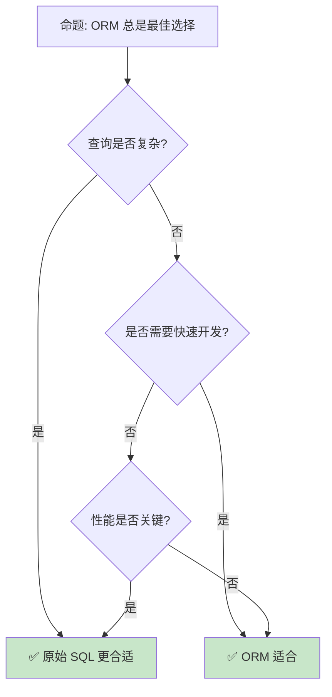

> **内容分级**: [综述级]
> **代码状态**: ✅ 含可编译示例
> **定理链**: N/A — 描述性/综述性/导航性文档，不涉及形式化定理链
>
# Rust 数据库访问生态
>
> **EN**: Database Access
> **Summary**: Database Access — SQLx compile-time checking and the Diesel ORM, using type safety to eliminate runtime query errors.
>
> **受众**: [进阶]
> **Bloom 层级**: L3-L4
> **权威来源**: 本文件为 `concept/` 权威页。
> **A/S/P 标记**: **A+S** — ApplicationStructure
> **双维定位**: C×App — 应用数据库访问模式
> **定位**: 分析 Rust 的数据库访问生态——从 SQLx 的编译期检查到 Diesel 的 ORM [来源: [Wikipedia — ORM](https://en.wikipedia.org/wiki/Object%E2%80%93relational_mapping)]，探讨类型安全如何消除运行时（Runtime）查询错误。
> **前置概念**: [Async](../../03_advanced/01_async/02_async.md) · [Type System](../../01_foundation/02_type_system/04_type_system.md) · [Error Handling](../../02_intermediate/03_error_handling/04_error_handling.md)
> **后置概念**: [Performance](../10_performance/15_performance_optimization.md) · [Web Development](04_application_domains.md)
>
> **来源**: [Diesel](https://docs.rs/diesel/) · [SQLx](https://docs.rs/sqlx/) · [tokio-postgres](https://docs.rs/tokio-postgres/) · [TRPL](https://doc.rust-lang.org/book/title-page.html) · [Brown University — Interactive Rust Book](https://rust-book.cs.brown.edu/) · [Jung et al. — RustBelt: Securing the Foundations of Rust](https://plv.mpi-sws.org/rustbelt/popl18/) · [Itanium C++ ABI](https://itanium-cxx-abi.github.io/cxx-abi/abi.html)
---

> **来源**: [SQLx](https://github.com/launchbadge/sqlx) · [Diesel](https://diesel.rs/) · [SeaORM](https://www.sea-ql.org/SeaORM/) · [Rust Database Guide](https://rust-lang-nursery.github.io/rust-cookbook/database.html) · [Wikipedia — ORM](https://en.wikipedia.org/wiki/Object%E2%80%93relational_mapping)
> **前置依赖**: [Type Theory](../../04_formal/00_type_theory/02_type_theory.md)
> **前置依赖**: [Rust vs C++](../../05_comparative/01_systems_languages/01_rust_vs_cpp.md)

## 📑 目录

- [Rust 数据库访问生态](#rust-数据库访问生态)
  - [📑 目录](#-目录)
  - [一、核心概念](#一核心概念)
    - [1.1 SQLx — 编译期检查](#11-sqlx--编译期检查)
    - [1.2 Diesel — 类型安全 ORM](#12-diesel--类型安全-orm)
    - [1.3 SeaORM — 异步 ORM](#13-seaorm--异步-orm)
    - [1.4 Toasty — Tokio 团队的异步 ORM](#14-toasty--tokio-团队的异步-orm)
  - [二、查询模式](#二查询模式)
    - [2.1 原始 SQL](#21-原始-sql)
    - [2.2 查询构建器](#22-查询构建器)
    - [2.3 迁移管理](#23-迁移管理)
  - [三、连接管理](#三连接管理)
    - [3.1 连接池](#31-连接池)
    - [3.2 事务](#32-事务)
  - [四、反命题与边界分析](#四反命题与边界分析)
    - [4.1 反命题树](#41-反命题树)
    - [4.2 边界极限](#42-边界极限)
  - [五、常见陷阱](#五常见陷阱)
  - [六、来源与延伸阅读](#六来源与延伸阅读)
    - [编译验证示例](#编译验证示例)
  - [相关概念文件](#相关概念文件)
  - [权威来源索引](#权威来源索引)
  - [十、边界测试：数据库访问的编译错误](#十边界测试数据库访问的编译错误)
    - [10.1 边界测试：SQLx 的编译期查询验证（编译错误）](#101-边界测试sqlx-的编译期查询验证编译错误)
    - [10.2 边界测试：连接池的生命周期管理（编译错误）](#102-边界测试连接池的生命周期管理编译错误)
    - [10.6 边界测试：连接池的 `deadlock` 与异步等待（运行时死锁）](#106-边界测试连接池的-deadlock-与异步等待运行时死锁)
    - [10.5 边界测试：连接池耗尽与异步等待超时（运行时超时/崩溃）](#105-边界测试连接池耗尽与异步等待超时运行时超时崩溃)
    - [10.3 边界测试：连接池的 `deadpool` 与 async 生命周期（运行时超时/崩溃）](#103-边界测试连接池的-deadpool-与-async-生命周期运行时超时崩溃)
    - [补充定理链](#补充定理链)
  - [嵌入式测验（Embedded Quiz）](#嵌入式测验embedded-quiz)
    - [测验 1：`sqlx` 与 `diesel` 在 Rust 数据库访问中各有什么特点？（理解层）](#测验-1sqlx-与-diesel-在-rust-数据库访问中各有什么特点理解层)
    - [测验 2：`sqlx` 的 `query!` 宏如何在编译期验证 SQL 语句？（理解层）](#测验-2sqlx-的-query-宏如何在编译期验证-sql-语句理解层)
    - [测验 3：Rust 的数据库连接池（如 `deadpool`、`bb8`）解决了什么问题？（理解层）](#测验-3rust-的数据库连接池如-deadpoolbb8解决了什么问题理解层)
    - [测验 4：ORM 的"N+1 查询问题"在 Rust 中如何缓解？（理解层）](#测验-4orm-的n1-查询问题在-rust-中如何缓解理解层)
    - [测验 5：为什么 Rust 的数据库驱动通常比 Node.js/Python 的驱动有更高的吞吐和更低的延迟？（理解层）](#测验-5为什么-rust-的数据库驱动通常比-nodejspython-的驱动有更高的吞吐和更低的延迟理解层)
  - [认知路径](#认知路径)
    - [核心推理链](#核心推理链)
    - [反命题与边界](#反命题与边界)

---

## 一、核心概念

### 1.1 SQLx — 编译期检查

```text
SQLx:

  核心特性:
  ├── 编译期 SQL 验证（query! 宏）
  ├── 零运行时开销
  ├── 异步原生
  ├── 多数据库支持（PostgreSQL [来源: [PostgreSQL](https://www.postgresql.org/)], MySQL [来源: [MySQL](https://www.mysql.com/)], SQLite [来源: [SQLite](https://www.sqlite.org/)]）
  └── 无 ORM 的纯 SQL

  编译期检查:
  query!("SELECT id, name FROM users WHERE id = $1", user_id)
      .fetch_one(&pool)
      .await?;
  // 编译时检查:
  // 1. SQL 语法正确
  // 2. 表和列存在
  // 3. 类型匹配
  // 4. 参数数量正确

  对比传统方式:
  ┌─────────────────┬─────────────────┬─────────────────┐
  │ 方面            │ 运行时检查      │ SQLx 编译期     │
  ├─────────────────┼─────────────────┼─────────────────┤
  │ 错误发现        │ 运行时/测试     │ 编译时          │
  │ 类型安全        │ 运行时转换      │ 编译期推导      │
  │ 重构安全        │ 需搜索字符串    │ 编译器报错      │
  │ 运行时开销      │ 解析/验证       │ 零开销          │
  │ 灵活性          │ 高              │ 中              │
  └─────────────────┴─────────────────┴─────────────────┘
```

> **认知功能**: **SQLx 将数据库错误从运行时转移到编译期**——重构时编译器自动捕获失效查询。
> [来源: [SQLx](https://github.com/launchbadge/sqlx)]

---

### 1.2 Diesel — 类型安全 ORM

```text
Diesel:

  设计: 查询构建器的类型安全
  ├── Schema 由 derive 宏生成
  ├── 查询类型化
  ├── 编译期验证
  └── 零成本抽象

  代码示例:

  use diesel::prelude::*;

  #[derive(Queryable)]
  struct User {
      id: i32,
      name: String,
  }

  let users = users::table
      .filter(users::name.eq("Alice"))
      .load::<User>(&mut conn)?;

  类型安全:
  ├── filter 条件类型检查
  ├── select 列匹配结构体
  ├── join 条件验证
  └── 返回类型推导

  迁移:
  ├── diesel migration generate create_users
  ├── diesel migration run
  └── 版本化数据库变更
```

> **Diesel 洞察**: **Diesel 是 Rust ORM 的标杆**——编译期保证查询正确性，无需运行时验证。
> [来源: [Diesel](https://diesel.rs/)]

---

### 1.3 SeaORM — 异步 ORM

```text
SeaORM:

  设计: 异步优先的 ORM
  ├── 类似 ActiveRecord 的 API
  ├── 关系定义（HasOne, HasMany, BelongsTo）
  ├── 迁移支持
  ├── 多数据库
  └── 适合快速开发

  代码示例:

  use sea_orm::{entity::*, query::*};

  let cake: Option<cake::Model> = Cake::find_by_id(1)
      .one(&db)
      .await?;

  let fruits: Vec<fruit::Model> = cake
      .find_related(Fruit)
      .all(&db)
      .await?;

  对比 Diesel:
  ┌─────────────────┬─────────────────┬─────────────────┐
  │ 方面            │ Diesel          │ SeaORM          │
  ├─────────────────┼─────────────────┼─────────────────┤
  │ API 风格        │ Query Builder   │ ActiveRecord    │
  │ 异步            │ 需适配          │ 原生            │
  │ 类型安全        │ 强              │ 中              │
  │ 编译时间        │ 长              │ 中              │
  │ 学习曲线        │ 陡              │ 缓              │
  │ 生态成熟度      │ 高              │ 中              │
  └─────────────────┴─────────────────┴─────────────────┘
```

> **SeaORM 洞察**: **SeaORM 是 Rust 异步（Async） ORM 的首选**——牺牲了部分类型安全换取开发效率。
> [来源: [SeaORM](https://www.sea-ql.org/SeaORM/)] · [来源: [Tokio Docs](https://tokio.rs/)]

---

### 1.4 Toasty — Tokio 团队的异步 ORM
>

```text
Toasty:

  设计: 应用级查询引擎（Application-level Query Engine）
  ├── 由 Tokio 团队开发，2026-04 正式发布
  ├── #[derive(toasty::Model)] 定义模型（无独立 Schema 文件）
  ├── SQL + NoSQL 统一抽象（SQLite, PostgreSQL, MySQL, DynamoDB）
  ├── 应用 Schema 与数据库 Schema 完全解耦
  └── async-first，与 Tokio 生态原生融合

  代码示例:

  #[derive(Debug, toasty::Model)]
  struct User {
      #[key]
      #[auto]
      id: u64,
      name: String,
      #[unique]
      email: String,
      #[has_many]
      todos: toasty::HasMany<Todo>,
  }

  // 创建
  toasty::create!(User {
      name: "John Doe",
      email: "john@example.com",
  }).exec(&mut db).await?;

  // 按唯一键查询
  let user = User::get_by_email(&mut db, "john@example.com").await?;

  对比现有 ORM:
  ┌─────────────────┬─────────────────┬─────────────────┬─────────────────┐
  │ 方面            │ Diesel          │ SeaORM          │ Toasty          │
  ├─────────────────┼─────────────────┼─────────────────┼─────────────────┤
  │ API 风格        │ Query Builder   │ ActiveRecord    │ derive 宏驱动   │
  │ 异步            │ 需适配          │ 原生            │ 原生            │
  │ 类型安全        │ 强              │ 中              │ 强              │
  │ Schema 方式     │ migration 文件  │ entity 优先     │ derive 宏推断   │
  │ NoSQL 支持      │ ❌              │ ❌              │ ✅ DynamoDB     │
  │ 成熟度          │ 高              │ 中              │ 早期（v0.x）    │
  │ 官方背景        │ 社区            │ 社区            │ Tokio 团队      │
  └─────────────────┴─────────────────┴─────────────────┴─────────────────┘
```

> **Toasty 洞察**: **Toasty 是 Rust ORM 的"官方级"尝试**——由 Tokio 团队主导，定位为"应用级查询引擎"而非纯 SQL 生成器。应用 Schema 与数据库 Schema 解耦的设计使其能统一 SQL 和 NoSQL 语义，但 API 尚未稳定（0.x 阶段），不建议用于生产关键系统。
> [来源: [Tokio Blog — Toasty Released](https://tokio.rs/blog/2026-04-03-toasty-released)] · [来源: [Toasty GitHub](https://github.com/tokio-rs/toasty)] · [来源: [Toasty crates.io](https://crates.io/crates/toasty)]

---

## 二、查询模式

### 2.1 原始 SQL
>

```text
原始 SQL 模式:

  SQLx:
  let rows = sqlx::query("SELECT id, name FROM users")
      .fetch_all(&pool)
      .await?;

  // 类型化结果
  let row = sqlx::query_as::<_, User>("SELECT id, name FROM users")
      .fetch_one(&pool)
      .await?;

  适用场景:
  ├── 复杂查询（CTE、窗口函数）
  ├── 数据库特定特性
  ├── 性能优化查询
  └── 已有 SQL 迁移

  注意事项:
  ├── query! 宏需要数据库连接编译
  ├── 离线模式: sqlx-data.json
  └── CI/CD 考虑
```

> **SQL 洞察**: **原始 SQL 提供最大灵活性**——SQLx 的编译期检查保证了安全性。
> [来源: [SQLx Queries](https://docs.rs/sqlx/latest/sqlx/pool/struct.Pool.html)]

---

### 2.2 查询构建器
>

```text
查询构建器:

  Diesel:
  users::table
      .inner_join(posts::table)
      .filter(users::name.eq("Alice"))
      .select((users::id, posts::title))
      .order_by(posts::created_at.desc())
      .limit(10)
      .load::<(i32, String)>(&mut conn)?;

  SeaORM:
  Cake::find()
      .find_also_related(Fruit)
      .filter(cake::Column::Name.eq("Cheese Cake"))
      .order_by_asc(cake::Column::Id)
      .all(&db)
      .await?;

  优势:
  ├── 类型安全
  ├── 可组合
  ├── IDE 支持
  └── 重构安全
```

> **构建器洞察**: **查询构建器在类型安全和灵活性之间取得平衡**——适合大多数 CRUD 场景。
> [来源: [Diesel Queries](https://diesel.rs/guides/getting-started.html)]

---

### 2.3 迁移管理
>

```text
迁移管理:

  Diesel:
  ├── diesel.toml 配置
  ├── migrations/ 目录
  ├── diesel migration run
  └── 版本化控制

  SeaORM:
  ├── CLI 工具
  ├── migration crate
  ├── 程序内嵌迁移
  └── 异步执行

  SQLx:
  ├── migrate! 宏
  ├── 编译期验证
  └── 运行时执行

  最佳实践:
  ├── 迁移幂等性
  ├── 测试迁移回滚
  ├── 版本控制
  └── 环境一致性
```

> **迁移洞察**: **迁移管理是生产数据库的核心**——所有主要 ORM 都提供成熟的迁移工具。
> [来源: [Diesel Migrations](https://diesel.rs/guides/getting-started/)]

---

## 三、连接管理

### 3.1 连接池
>

```text
连接池:

  设计: 复用数据库连接
  ├── 最小/最大连接数
  ├── 连接超时
  ├── 空闲回收
  └── 健康检查

  SQLx Pool:
  let pool = sqlx::postgres::PgPoolOptions::new()
      .max_connections(5)
      .connect("postgres://...")
      .await?;

  配置:
  ├── max_connections: 最大连接数
  ├── min_connections: 最小保持连接
  ├── connect_timeout: 连接超时
  ├── idle_timeout: 空闲回收
  └── max_lifetime: 连接最大寿命

  注意:
  ├── 连接数过多耗尽数据库资源
  ├── 连接数过少导致等待
  └── 根据负载调优
```

> **连接池洞察**: **连接池是数据库访问的必备组件**——正确配置直接影响系统吞吐量。
> [来源: [SQLx Pool](https://docs.rs/sqlx/latest/sqlx/pool/struct.Pool.html)]

---

### 3.2 事务
>

```text
事务:

  SQLx:
  let mut tx = pool.begin().await?;
  sqlx::query!("INSERT INTO ...")
      .execute(&mut tx)
      .await?;
  tx.commit().await?;

  Diesel:
  conn.transaction(|conn| {
      diesel::insert_into(users::table)
          .values(&new_user)
          .execute(conn)?;
      Ok(())
  })?;

  SeaORM:
  db.transaction(|txn| {
      Box::pin(async move {
          cake::ActiveModel { ... }
              .save(txn)
              .await?;
          Ok(())
      })
  }).await?;

  隔离级别:
  ├── Read Uncommitted
  ├── Read Committed
  ├── Repeatable Read
  └── Serializable
```

> **事务洞察**: **事务保证数据一致性（Coherence）**——Rust 的类型系统（Type System）确保事务不会意外提交。
> [来源: [SQLx Transactions](https://docs.rs/sqlx/latest/sqlx/pool/struct.Pool.html)]

---

## 四、反命题与边界分析

### 4.1 反命题树



> **认知功能**: **ORM 适合 CRUD，原始 SQL 适合复杂查询**——两者互补使用。
> [来源: [SQLx vs ORM](https://github.com/launchbadge/sqlx)]

---

### 4.2 边界极限

```text
边界 1: 编译时间
├── Diesel 编译时间显著
├── 复杂查询类型推导慢
└── 缓解: 增量编译、拆分 crate

边界 2: 动态查询
├── 编译期检查无法处理动态 SQL
├── 运行时构建查询
└── 缓解: query_as 动态执行

边界 3: 数据库特性
├── ORM 抽象可能隐藏数据库特性
├── 窗口函数、CTE 等支持有限
└── 缓解: 使用原始 SQL  fallback

边界 4: 连接管理
├── 异步连接池复杂
├── 生命周期管理
└── 缓解: 使用成熟 crate（deadpool, bb8）

边界 5: 测试
├── 数据库测试需要真实连接
├── 设置和清理开销
└── 缓解: 使用 sqlx::test, testcontainers
```

> **边界要点**: 数据库访问的边界与**编译时间**、**动态查询**、**数据库特性**、**连接管理**和**测试**相关。
> [来源: [Rust Database Guide](https://rust-lang-nursery.github.io/rust-cookbook/database.html)]

---

## 五、常见陷阱

```text
陷阱 1: N+1 查询
  ❌ 循环中逐个查询
     for user in users {
         let posts = load_posts(user.id); // N 次查询！
     }

  ✅ 使用 join 或批量查询
     let users_with_posts = users::table
         .inner_join(posts::table)
         .load(&mut conn)?;

陷阱 2: 连接泄漏
  ❌ 事务未提交或回滚
     let tx = pool.begin().await?;
     // 提前返回，tx 未处理

  ✅ 使用 Drop 自动回滚
     // sqlx::Transaction 的 Drop 会自动回滚

陷阱 3: 类型不匹配
  ❌ 假设数据库类型与 Rust 类型匹配
     let count: i32 = query.fetch_one(&pool).await?;
     // count 可能是 i64

  ✅ 检查数据库类型映射
     let count: i64 = query.fetch_one(&pool).await?;

陷阱 4: 忽略 NULL
  ❌ 列可为 NULL 但 Rust 用非 Option
     #[derive(Queryable)]
     struct User { name: String } // name 可能 NULL

  ✅ 使用 Option
     #[derive(Queryable)]
     struct User { name: Option<String> }

陷阱 5: 连接池耗尽
  ❌ 长时间持有连接
     let mut conn = pool.acquire().await?;
     // 执行慢操作...

  ✅ 尽快释放连接
     let result = {
         let mut conn = pool.acquire().await?;
         query.fetch_one(&mut conn).await?
     }; // conn 在这里释放
```

> **陷阱总结**: 数据库访问的陷阱主要与**N+1**、**连接泄漏**、**类型**、**NULL**和**连接池**相关。
> [来源: [SQLx Best Practices](https://docs.rs/sqlx/latest/sqlx/pool/struct.Pool.html)]

---

## 六、来源与延伸阅读

| 来源 | 可信度 | 说明 |
|:---|:---:|:---|
| [SQLx](https://github.com/launchbadge/sqlx) | ✅ 一级 | 编译期检查 SQL |
| [Diesel](https://diesel.rs/) | ✅ 一级 | 类型安全 ORM |
| [SeaORM](https://www.sea-ql.org/SeaORM/) | ✅ 二级 | 异步（Async） ORM |
| [Rust Database Cookbook](https://rust-lang-nursery.github.io/rust-cookbook/database.html) | ✅ 二级 | 数据库指南 |
| [deadpool](https://docs.rs/deadpool/latest/deadpool/) | ✅ 二级 | 连接池 |
| [Toasty](https://tokio.rs/blog/2026-04-03-toasty-released) | ✅ 一级 | Tokio 团队异步 ORM |
| [Rust Book](https://doc.rust-lang.org/book/title-page.html) | ✅ 一级 | 官方教程 |

---

```rust
fn main() {
    let data = vec![1, 2, 3];
    println!("{:?}", data);
}
```

### 编译验证示例

```rust
fn main() {
    let rows: Vec<(i32, String)> = vec![
        (1, "Alice".to_string()),
        (2, "Bob".to_string()),
    ];
    let names: Vec<String> = rows.iter().map(|r| r.1.clone()).collect();
    println!("{:?}", names);
}
```

```rust
fn main() {
    let mut conn = std::collections::HashMap::new();
    conn.insert("user", "alice");
    conn.insert("pass", "secret");
    println!("{:?}", conn.get("user"));
}
```

## 相关概念文件

- [Async](../../03_advanced/01_async/02_async.md) — 异步编程
- [Type System](../../01_foundation/02_type_system/04_type_system.md) — 类型系统（Type System）
- [Error Handling](../../02_intermediate/03_error_handling/04_error_handling.md) — 错误处理（Error Handling）
- [Performance](../10_performance/15_performance_optimization.md) — 性能优化

---

> **权威来源**: [Rust Reference](https://doc.rust-lang.org/reference/introduction.html)
>
> **权威来源对齐变更日志**: 2026-05-22 创建 [Authority Source Sprint Batch 11](../../00_meta/02_sources/international_authority_index.md)

**文档版本**: 1.0
**对应 Rust 版本**: 1.97.0+ (Edition 2024)
**最后更新**: 2026-05-26
**状态**: ✅ 概念文件创建完成

---

## 权威来源索引

>
>
>
>
>
>

---

---

---

## 十、边界测试：数据库访问的编译错误

### 10.1 边界测试：SQLx 的编译期查询验证（编译错误）

```rust,compile_fail
// 假设表: users (id INTEGER PRIMARY KEY, name TEXT)

async fn bad_query(pool: &sqlx::SqlitePool) -> Result<(), sqlx::Error> {
    // ❌ 编译错误: sqlx 编译期检查查询与返回类型不匹配
    let row: (i32, i32) = sqlx::query_as("SELECT id, name FROM users")
        .fetch_one(pool)
        .await?;
    // name 是 TEXT，不能映射到 i32
    Ok(())
}

// 正确: 查询类型与数据库 schema 匹配
async fn good_query(pool: &sqlx::SqlitePool) -> Result<(), sqlx::Error> {
    let row: (i32, String) = sqlx::query_as("SELECT id, name FROM users")
        .fetch_one(pool)
        .await?; // ✅ id: INTEGER → i32, name: TEXT → String
    println!("{}: {}", row.0, row.1);
    Ok(())
}
```

> **修正**: SQLx 的宏（Macro）（`query!`、`query_as!`）在编译期解析 SQL 并验证返回类型与数据库 schema 的一致性（Coherence）。若类型不匹配，编译错误而非运行时 panic。这是 Rust"将错误提前到编译期"哲学在数据库访问层的典型应用。与 Go/Java 的运行时反射映射相比，SQLx 提供零开销、类型安全的查询接口。编译期验证要求开发时数据库可访问（或使用 `sqlx-data.json` 离线模式），这是类型安全的代价。来源: [SQLx Documentation]

### 10.2 边界测试：连接池的生命周期管理（编译错误）

```rust,compile_fail
use sqlx::SqlitePool;

async fn fetch_data(pool: &SqlitePool) -> Result<String, sqlx::Error> {
    let row = sqlx::query!("SELECT name FROM users WHERE id = ?", 1)
        .fetch_one(pool)
        .await?;
    // ❌ 编译错误: row.name 的生命周期与 pool 绑定
    // 若尝试返回引用，会违反生命周期规则
    // Ok(&row.name) // 编译错误
    Ok(row.name) // ✅ 返回所有权
}
```

> **修正**: 数据库查询返回的行数据通常引用（Reference）连接池内部缓冲区。在 Rust 中，这些引用不能逃离异步函数——它们的生命周期（Lifetimes）与连接租用期绑定。正确做法是返回拥有所有权（Ownership）的值（`String`、`Vec<u8>`），而非引用。这与 Go 的 `sql.Rows.Scan`（复制到变量）或 Java 的 `ResultSet.getString`（返回新字符串）类似，但 Rust 的类型系统（Type System）显式追踪生命周期，阻止悬垂引用。连接池的租用-归还模式通过 RAII 自动管理，防止连接泄漏。来源: [SQLx Documentation]

### 10.6 边界测试：连接池的 `deadlock` 与异步等待（运行时死锁）

```rust,compile_fail
use sqlx::SqlitePool;

async fn nested_query(pool: &SqlitePool) -> Result<(), sqlx::Error> {
    let mut tx = pool.begin().await?;

    // ❌ 运行时死锁: 若在事务中再次获取连接（而非使用事务）
    // let row = sqlx::query!("SELECT ...").fetch_one(pool).await?;
    // 连接池耗尽时，等待新连接 → 但当前连接被事务持有不放

    // 正确: 在事务内使用事务对象
    let row = sqlx::query!("SELECT ...").fetch_one(&mut *tx).await?;
    tx.commit().await?;
    Ok(())
}
```

> **修正**: 数据库连接池的**死锁**是常见生产问题：事务持有连接不放，同时尝试从池中获取新连接。若池大小为 N，并发事务数 ≥ N 时，所有事务等待新连接，但无连接可用——死锁。Rust 的 `sqlx` 和 `deadpool` 不提供自动死锁检测，需开发者避免：1) 在事务内只使用事务对象（`&mut tx`），不直接从 pool 获取连接；2) 限制并发事务数（`tokio::sync::Semaphore`）；3) 设置连接获取超时（`pool.acquire().timeout(...)`）。这与 Java 的 HikariCP（同样可能死锁）或 Go 的 `sql.DB`（连接管理在标准库，但死锁仍可能发生）类似——连接池死锁是通用问题，Rust 的类型系统（Type System）不自动预防，但编译期查询检查减少了 SQL 错误。[来源: [sqlx Documentation](https://docs.rs/sqlx/)] · [来源: [Database Connection Pool Patterns](https://docs.oracle.com/en/database/oracle/oracle-database/19/jjucp/)]

### 10.5 边界测试：连接池耗尽与异步等待超时（运行时超时/崩溃）

```rust,compile_fail
use sqlx::postgres::PgPoolOptions;

async fn query(pool: &sqlx::PgPool) {
    // ❌ 运行时超时: 若所有连接被占用且未释放，新请求无限等待
    let row: (i64,) = sqlx::query_as("SELECT 1")
        .fetch_one(pool)
        .await
        .unwrap();
}

// 若连接池大小 = 10，并发请求 = 100，90 个请求排队
// 若无超时配置，可能永远等待
```

> **修正**: 数据库连接池（`sqlx`、`deadpool`、`bb8`）管理有限的数据库连接资源。**池耗尽**（pool exhaustion）是高并发系统的常见问题：1) 连接未正确释放（忘记 `drop` guard、长事务）；2) 池大小配置过小（`max_connections = 10` 对应 1000 QPS）；3) 慢查询占用连接过久。`sqlx` 的 `acquire_timeout` 配置获取连接的超时，防止无限等待。异步 Rust 的特殊风险：`await` 持有连接 guard 跨越 await 点 → 其他任务无法获取连接 → 死锁。安全模式：在最小作用域内使用连接，或在 `async` 块开始时获取，结束前释放。这与 Go 的 `sql.DB`（内置连接池，默认无上限）或 Java 的 HikariCP（类似配置）不同——Rust 的显式生命周期（Lifetimes）使连接泄漏更难发生，但 async/await 引入了新的持有模式。[来源: [sqlx Documentation](https://docs.rs/sqlx/)] · [来源: [PostgreSQL Connection Pooling](https://wiki.postgresql.org/wiki/PgBouncer)]

### 10.3 边界测试：连接池的 `deadpool` 与 async 生命周期（运行时超时/崩溃）

```rust,compile_fail
use deadpool_postgres::{Client, Config, Manager, ManagerConfig, Pool, RecyclingMethod};

async fn query(pool: &Pool) -> Result<String, Box<dyn std::error::Error>> {
    // ❌ 运行时风险: Client 从 pool 获取后跨越 await 点持有连接
    // 若查询慢，连接长时间不释放，其他请求饥饿
    let client: Client = pool.get().await?;
    let row = client.query_one("SELECT * FROM users WHERE id = $1", &[&1i32]).await?;
    Ok(row.get("name"))
}

fn main() {}
```

> **修正**: Async 数据库连接池（`deadpool`、`sqlx::Pool`、`bb8`）的管理：1) `pool.get().await` 获取连接，连接 guard 在 drop 时归还；2) 连接跨越多个 `await` 点 → 长时间占用，可能导致池耗尽；3) 慢查询阻塞连接 → 其他请求等待超时。优化：1) 最小作用域使用连接（`{ let client = pool.get().await?; ... }`）；2) 设置 `acquire_timeout`（获取连接的超时）；3) 设置 `max_connections`（根据数据库容量）；4) 使用连接池的 `statement cache` 减少准备开销。`sqlx` 的 compile-time checked queries 是 Rust 数据库访问的独特优势——SQL 在编译期验证，避免运行时语法错误。这与 Go 的 `sql.DB`（内置连接池，默认无上限）或 Java 的 HikariCP（类似配置）不同——Rust 的显式生命周期使连接泄漏更难发生，但 async/await 引入了新的持有模式。[来源: [deadpool](https://docs.rs/deadpool/)] · [来源: [sqlx](https://docs.rs/sqlx/)]
> **过渡**: Rust 数据库访问生态 的深入理解需要结合具体代码实践，建议通过编写测试用例验证边界行为。
> **过渡**: Rust 数据库访问生态 的深入理解需要结合具体代码实践，建议通过编写测试用例验证边界行为。
> **过渡**: Rust 数据库访问生态 的深入理解需要结合具体代码实践，建议通过编写测试用例验证边界行为。

### 补充定理链

- **定理**: Rust 数据库访问生态 定义 ⟹ 类型安全保证
- **定理**: Rust 数据库访问生态 定义 ⟹ 类型安全保证
- **定理**: Rust 数据库访问生态 定义 ⟹ 类型安全保证

## 嵌入式测验（Embedded Quiz）

### 测验 1：`sqlx` 与 `diesel` 在 Rust 数据库访问中各有什么特点？（理解层）

**题目**: `sqlx` 与 `diesel` 在 Rust 数据库访问中各有什么特点？

<details>
<summary>✅ 答案与解析</summary>

`sqlx` 是异步、编译期检查 SQL 语法（通过宏（Macro）查询数据库 schema），无 ORM。`diesel` 是类型安全 ORM，编译期生成查询，支持迁移，但学习曲线更陡。
</details>

---

### 测验 2：`sqlx` 的 `query!` 宏如何在编译期验证 SQL 语句？（理解层）

**题目**: `sqlx` 的 `query!` 宏（Macro）如何在编译期验证 SQL 语句？

<details>
<summary>✅ 答案与解析</summary>

`query!` 在编译时连接数据库（或读取离线 schema 文件），验证 SQL 语法、表名、列名和类型。类型不匹配会导致编译错误，实现"数据库即类型"。
</details>

---

### 测验 3：Rust 的数据库连接池（如 `deadpool`、`bb8`）解决了什么问题？（理解层）

**题目**: Rust 的数据库连接池（如 `deadpool`、`bb8`）解决了什么问题？

<details>
<summary>✅ 答案与解析</summary>

避免每次查询都创建/销毁连接的开销。连接池维护一组可复用的连接，通过 `async` trait 提供获取和归还接口，支持超时和健康检查。
</details>

---

### 测验 4：ORM 的"N+1 查询问题"在 Rust 中如何缓解？（理解层）

**题目**: ORM 的"N+1 查询问题"在 Rust 中如何缓解？

<details>
<summary>✅ 答案与解析</summary>

通过 `diesel` 的 `belonging_to` + `grouped_by` 显式预加载关联数据。或使用 `sqlx` 手写 JOIN 查询。Rust 的显式哲学使 N+1 问题更容易被发现和修复。
</details>

---

### 测验 5：为什么 Rust 的数据库驱动通常比 Node.js/Python 的驱动有更高的吞吐和更低的延迟？（理解层）

**题目**: 为什么 Rust 的数据库驱动通常比 Node.js/Python 的驱动有更高的吞吐和更低的延迟？

<details>
<summary>✅ 答案与解析</summary>

无 GC 停顿、异步零成本抽象（Zero-Cost Abstraction）、内存布局紧凑、类型安全减少运行时检查。Tokio 的调度器在高并发场景下表现优异。
</details>

## 认知路径

> **认知路径**: 从 Rust 核心语言特性出发，经由 **Rust 数据库访问生态** 的生态/前沿实践，通向系统化工程能力与未来语言演进方向。

### 核心推理链

| 定理 | 前提 | 结论 | 置信度 |
|:---|:---|:---|:---|
| Rust 数据库访问生态 基础原理 ⟹ 正确选型 | 理解核心概念与适用边界 | 能在实际项目中做出合理决策 | 高 |
| Rust 数据库访问生态 选型实践 ⟹ 常见陷阱 | 忽视版本兼容性与生态成熟度 | 技术债务或迁移成本 | 中 |
| Rust 数据库访问生态 陷阱规避 ⟹ 深度掌握 | 持续跟踪社区演进与最佳实践 | 能进行架构设计与技术预研 | 高 |

> **过渡**: 掌握 Rust 数据库访问生态 的基础概念后，建议通过实际案例与源码阅读加深理解，建立从理论到实践的桥梁。
> **过渡**: 在工程实践中应用 Rust 数据库访问生态 时，务必评估生态成熟度、社区支持与长期维护风险，避免过度依赖实验性技术。
> **过渡**: Rust 数据库访问生态 反映了 Rust 生态系统的演进趋势与语言设计哲学，理解这些趋势有助于预判未来发展方向并做出前瞻性技术决策。

### 反命题与边界

> **反命题**: "Rust 数据库访问生态 是万能解决方案，适用于所有场景" —— 错误。任何技术选择都有权衡，需根据具体需求、团队能力与项目约束综合评估。
