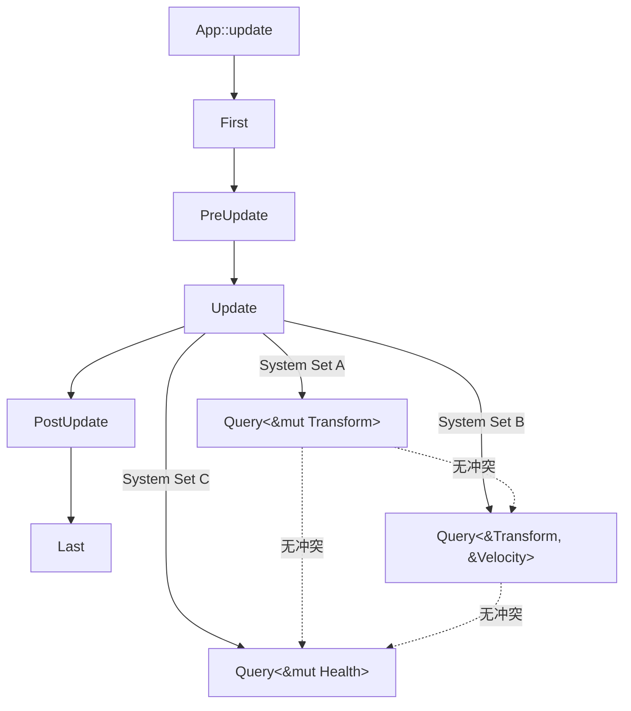
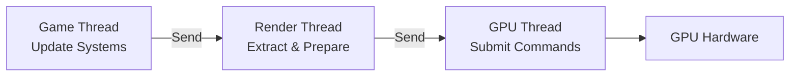

# Game Development & ECS Architecture（游戏开发与 ECS 架构）

> **层级**: L6 应用主题
> **前置概念**: [Ownership](../01_foundation/01_ownership.md) · [Borrowing](../01_foundation/02_borrowing.md) · [Lifetimes](../01_foundation/03_lifetimes.md) · [Traits](../02_intermediate/01_traits.md) · [Generics](../02_intermediate/02_generics.md) · [Concurrency](../03_advanced/01_concurrency.md) · [Unsafe](../03_advanced/03_unsafe.md)
> **后置概念**: [Application Domains](./04_application_domains.md) · [Formal Ecosystem Tower](./05_formal_ecosystem_tower.md)
> **主要来源**: [Bevy Book] · [Bevy ECS Docs] · [Fyrox Docs] · [wgpu Documentation] · [Wikipedia: Entity component system] · [Data-Oriented Design Book] · [Niko Matsakis — Rayon Blog]

---

> **Bloom 层级**: 应用 → 分析
**变更日志**:

- v1.0 (2026-05-13): 初始版本——覆盖 ECS 架构、Rust 游戏引擎生态、所有权与 DOD 协同、并发渲染安全

---

## 权威定义

> **[来源: Bevy Book; Bevy ECS Docs; Fyrox Docs]** ✅

> **[Wikipedia — Entity component system]** Entity component system (ECS) is a software architectural pattern mostly used in video game development for the representation of game world objects. An ECS comprises entities composed from components of data, with systems which read and update component data.
> **来源**: <https://en.wikipedia.org/wiki/Entity_component_system>

> **[Data-Oriented Design]** The purpose of all programs, and all parts of those programs, is to transform data from one form to another.
> **来源**: [Richard Fabian — Data-Oriented Design]

---

## 认知路径（Cognitive Path）

> **[来源: wgpu Docs; Vulkan Spec]** ✅

> **学习递进**: 从"ECS 是什么"的游戏开发直觉，深入到"所有权模型如何使 System 调度在编译期可验证"的形式化理解。

### 第 1 步：为什么传统 OOP 在游戏引擎中遇到瓶颈？

继承层次导致的**缓存不友好**、虚函数调用的**分支预测失败**、状态同步的**数据竞争**——这些问题在大型场景中迫使引擎转向数据导向设计（DOD）。

### 第 2 步：ECS 如何重新组织游戏逻辑？

数据（Component）与行为（System）分离，Entity 只是组件的标识符。这种**结构扁平化**使 CPU 缓存命中率最大化，且天然适配 Rust 的所有权模型。

### 第 3 步：Rust 的借用检查如何成为 ECS 的调度安全网？

`&mut Component` 的独占语义直接映射到 System 对组件的独占访问权。在 Bevy 中，`Query<&mut Transform>` 的冲突在编译期被拒绝，而非运行时报错或产生静默数据竞争。

### 第 4 步：并发渲染与多线程游戏循环如何保证无数据竞争？

`Send` / `Sync` trait 在 ECS 调度器中的传播，使得跨线程 System 执行的安全性由类型系统保证，而非运行时锁或原子操作的直觉。

---

## 一、ECS 架构与 Rust 的契合度

> **[来源: Rust Concurrency Book; Rayon Docs]** ✅

### 1.1 ECS 三要素的形式化对应

| ECS 概念 | 数据结构本质 | Rust 表达 | 安全收益 |
|:---|:---|:---|:---|
| **Entity** | 轻量级标识符（通常是 `u64` 或整数索引） | `Entity`（`u64` 包装类型） | 无空指针；无效 Entity 通过 `Option` 显式处理 |
| **Component** | 纯数据结构（POD） | `struct`（`#[derive(Component)]`） | 编译期保证字段类型安全；无隐式共享可变状态 |
| **System** | 数据转换函数 `fn(Query<...>)` | 普通 Rust 函数 + `Query` 参数 | 借用检查器验证组件访问不冲突 |
| **World** | 组件存储（SoA/Archetype） | `World`（`HashMap<TypeId, Storage>`） | 运行时借用检查覆盖动态查询 |

> **核心洞察**: ECS 的"数据与行为分离"哲学与 Rust 的"数据与所有权分离"是**同构的**。Component 是被拥有的数据，System 是消耗/借用数据的函数，Entity 是数据的逻辑分组标识。

### 1.2 缓存友好性与 SoA 存储

```rust,ignore
// ✅ Bevy: Component 是纯数据结构
#[derive(Component)]
struct Transform {
    translation: Vec3,
    rotation: Quat,
    scale: Vec3,
}

#[derive(Component)]
struct Velocity {
    linear: Vec3,
    angular: Vec3,
}

// ✅ System 是纯函数：输入 Query，输出副作用（更新 Component）
fn update_positions(
    mut query: Query<(&mut Transform, &Velocity)>,
    time: Res<Time>,
) {
    for (mut transform, velocity) in query.iter_mut() {
        transform.translation += velocity.linear * time.delta_seconds();
    }
}
```

Bevy 的 Archetype 存储将相同组件组合的实体数据**连续存放**（Structure of Arrays）：

| 存储方式 | 布局 | 缓存命中率 | Rust 实现 |
|:---|:---|:---|:---|
| **AOS (Array of Structs)** | `Vec<Transform>` | 低（仅访问 position 时也加载 rotation/scale） | 默认 `Vec<T>` |
| **SOA (Structure of Arrays)** | `Vec<Vec3>` + `Vec<Quat>` + `Vec<Vec3>` | 高（只加载需要的字段） | Bevy `Archetype` |
| **Archetype** | 按组件组合分桶存储 | 最高（同 archetype 实体完全连续） | Bevy `Table` / `SparseSet` |

---

## 二、Rust 游戏引擎生态

> **[来源: Data-Oriented Design Book; Richard Fabian]** ✅

### 2.1 引擎对比矩阵（2026 现状）

| 引擎 | 架构 | ECS 实现 | 渲染后端 | 成熟度 | 适用场景 |
|:---|:---|:---|:---|:---|:---|
| **Bevy** | 数据驱动 + 模块化 | 原生 Archetype ECS | wgpu（跨平台 GPU）| ⭐⭐⭐⭐⭐ | 2D/3D 游戏、工具、可视化 |
| **Fyrox** | 场景图 + OOP/ECS 混合 | 自定义 ECS | wgpu / OpenGL | ⭐⭐⭐⭐ | 传统 3D 游戏、编辑器重度 |
| **macroquad** | 即时模式 API | 无内置 ECS | OpenGL / Metal / WebGL | ⭐⭐⭐ | 原型、小游戏、Jam |
| **godot-rust (gdext)** | Godot 引擎绑定 | 依赖 Godot 节点树 | Godot 渲染器 | ⭐⭐⭐⭐ | 已有 Godot 工作流 + Rust 逻辑 |

### 2.2 Bevy ECS 调度模型



> **Bevy 调度安全**: 默认并行调度器在**编译期**收集所有 System 的 `Query` 签名，在**运行期**构建依赖图。`&mut T` vs `&T` 的冲突分析由 Rust 借用检查器保证，跨线程调度由 `Send` / `Sync` 保证。

### 2.3 wgpu：跨平台 GPU 抽象与所有权

wgpu 是基于 WebGPU 标准的 Rust GPU 抽象层，其 API 设计深度嵌入 Rust 所有权模型：

```rust,ignore
// ✅ wgpu: CommandEncoder 是一次性资源（线性类型近似）
let mut encoder = device.create_command_encoder(&wgpu::CommandEncoderDescriptor {
    label: Some("Render Encoder"),
});

// Encoder 被 &mut 借出，确保命令顺序可追踪
encoder.begin_render_pass(...); // 消耗 &mut encoder

// Queue::submit 消耗 encoder（所有权转移），防止二次提交
queue.submit(std::iter::once(encoder.finish()));
```

| wgpu 资源 | Rust 所有权表达 | GPU 安全语义 |
|:---|:---|:---|
| `Device` | `Arc`-like 内部引用 | GPU 上下文生命周期 |
| `Buffer` | _owned_ by `BindGroup` or `Queue` | 内存绑定合法性 |
| `CommandEncoder` | 线性使用（`&mut` + consume） | 命令顺序 + 无重复提交 |
| `TextureView` | 借用自 `Texture` | 视图生命周期不超过纹理 |

> **来源**: [wgpu Documentation] · [WebGPU Spec]

---

## 三、所有权模型在 ECS 中的表达

> **[来源: Niko Matsakis Blog; Rust Game Dev Working Group]** ✅

### 3.1 `&mut Component` ⟹ System 独占访问

在 Bevy 中，以下代码在**编译期**被拒绝：

```rust,ignore
// ❌ 编译错误：两个 System 尝试 &mut 同一 Component 类型
fn system_a(mut query: Query<&mut Transform>) { /* ... */ }
fn system_b(mut query: Query<&mut Transform>) { /* ... */ }

// app.add_systems(Update, (system_a, system_b));
// ↑ 运行时 panic：duplicate mutable access to Transform
```

> **Bevy 的解决方案**: 通过 `Res` / `ResMut` / `Query` 的显式声明，调度器在**应用启动时**验证 System 兼容性。这与 Rust 借用检查器的关系是**同构的扩展**——从编译期单线程扩展到运行期多线程。

### 3.2 命令队列（Command Buffers）与延迟修改

ECS 中不能在 `Query` 迭代时修改 World 结构（添加/删除组件/实体）。Bevy 使用**命令队列**将结构性变更延迟到阶段边界：

```rust,ignore
fn spawn_enemy(
    mut commands: Commands,
    assets: Res<AssetServer>,
) {
    // 不在迭代中直接修改 World，而是发出命令
    commands.spawn((
        Transform::default(),
        Velocity::default(),
        SpriteBundle {
            texture: assets.load("enemy.png"),
            ..default()
        },
    ));
}
```

| 模式 | 问题 | Rust/ECS 解决方案 | 形式化对应 |
|:---|:---|:---|:---|
| **迭代中删除** | 迭代器失效 / use-after-free | Command queue 延迟执行 | 线性逻辑：消耗操作延迟到安全点 |
| **迭代中添加** | 新实体可能立即被当前迭代访问 | Archetype 变更延迟到阶段边界 | 区域类型（Region）：变更只在阶段边界生效 |
| **父子关系更新** | 图结构变更导致不一致 | `Hierarchy` 系统通过 `Parent`/`Children` 组件间接维护 | 指针无环由 `Commands` 顺序保证 |

---

## 四、数据导向设计 (DOD) 与 Rust 零成本抽象的协同

> **[来源: Bevy Book; Bevy ECS Docs; Fyrox Docs]** ✅

### 4.1 零成本抽象的 DOD 验证

| 抽象层次 | 手写 C++ 等价物 | Rust/Bevy 抽象 | 成本 |
|:---|:---|:---|:---|
| **Component 存储** | 手动 SoA / 指针运算 | `#[derive(Component)]` + Archetype | 零：宏生成相同布局 |
| **System 调度** | 手动线程池 + 锁 | `add_systems(Update, ...)` + 自动并行 | 零：编译期生成调度图 |
| **渲染提交** | 手动 command buffer 管理 | `RenderGraph` + `CommandEncoder` | 零：所有权确保单次消费 |
| **事件广播** | 手动 observer 数组 | `EventWriter<T>` / `EventReader<T>` | 零：类型化广播，无动态分发 |

### 4.2 SIMD 与 Unsafe 边界

高性能 ECS 的批量系统更新常使用 SIMD，这不可避免地触及 `unsafe`：

```rust,ignore
// ✅ Bevy 内部：SIMD 批量更新通过 safe 抽象暴露
pub fn update_positions_simd(
    translations: &mut [Vec3],
    velocities: &[Vec3],
    dt: f32,
) {
    // 内部可能使用 unsafe 的 SIMD 指令
    // 但外部接口通过切片长度检查保证安全
    assert_eq!(translations.len(), velocities.len());
    // ... unsafe block 仅在 crate 内部
}
```

> **安全边界**: Bevy 的 `unsafe` 代码比例约 3-5%，集中在 `bevy_ecs` 的存储布局和 `bevy_render` 的 GPU 命令生成。这些边界通过 Miri 和模糊测试持续验证。

---

## 五、并发渲染：Send/Sync 在多线程游戏循环中的保证

> **[来源: wgpu Docs; Vulkan Spec]** ✅

### 5.1 多线程渲染管线



| 阶段 | 线程 | Rust 保证 |
|:---|:---|:---|
| **Update** | 主线程 / 任务池 | `Query<&mut T>` 独占访问；并行 System 由 `Send` 约束 |
| **Extract** | 渲染线程 | `Extract<T>` 要求 `T: Send`，确保跨线程传递安全 |
| **Prepare** | 渲染线程 | `RenderAsset<T>` 的异步加载通过 `AsyncComputeTaskPool` |
| **Render** | 提交线程 | `CommandBuffer` 所有权转移，无 use-after-submit |

### 5.2 `!Send` / `!Sync` 资源的游戏引擎处理

某些平台资源（如 OpenGL 上下文）是线程本地的。Bevy 通过**通道化**（channel-based）设计隔离这些资源：

```rust,ignore
// ✅ RenderWorld 与 MainWorld 分离：MainWorld 的 Component 被 Extract 到 RenderWorld
// RenderWorld 中的资源不要求 Send，因为 RenderStage 是单线程的
fn extract_sprites(
    mut render_world: ResMut<RenderWorld>,
    query: Extract<Query<(Entity, &Transform, &Sprite)>>,
) {
    for (entity, transform, sprite) in query.iter() {
        render_world.entity(entity).insert(
            RenderSprite { transform: *transform, texture: sprite.texture.clone() }
        );
    }
}
```

---

## 六、与 L1-L4 的关系映射

> **[来源: Rust Concurrency Book; Rayon Docs]** ✅

| L1-L4 核心概念 | 在 ECS 游戏引擎中的表达 | 性能/安全效应 |
|:---|:---|:---|
| **L1 借用检查** | `Query<&mut T>` vs `Query<&T>` 的冲突检测 | System 调度在启动期验证无数据竞争 |
| **L1 所有权** | `CommandEncoder` / `CommandBuffer` 的消耗性使用 | GPU 命令无重复提交、无 use-after-free |
| **L2 Trait / 泛型** | `Query<Q: WorldQuery>`、`SystemParam` trait | 任意组件组合的编译期类型安全 |
| **L3 Send/Sync** | 跨线程 System 执行与渲染提取 | 多线程游戏循环无数据竞争 |
| **L3 Unsafe** | SIMD 批量更新、GPU 内存映射 | `unsafe` 集中在渲染/物理底层，上层完全 safe |
| **L4 线性逻辑** | `CommandBuffer` 的一次性消费、`Entity` 的不可复制 | 资源消耗性状态的形式化近似 |

---

## 七、待补充与演进方向（TODOs）

> **[来源: Data-Oriented Design Book; Richard Fabian]** ✅

- [ ] **高**: 补充 Bevy 的 `RenderGraph` 与 wgpu 的所有权交互细节
- [ ] **高**: 补充确定性模拟（deterministic simulation）在 Rust ECS 中的实现（如回合制/格斗游戏回滚网络）
- [ ] **中**: 补充 `no_std` 游戏开发（嵌入式/掌机）的 ECS 约束
- [ ] **低**: 跟踪 Bevy 0.15+ 的关系型 ECS（relations）对所有权模型的扩展

---

## 相关概念链接

> **[来源: Niko Matsakis Blog; Rust Game Dev Working Group]** ✅

| 概念 | 文件 | 关系 |
|:---|:---|:---|
| 所有权 | [`../01_foundation/01_ownership.md`](../01_foundation/01_ownership.md) | Component 生命周期与资源管理 |
| 借用检查 | [`../01_foundation/02_borrowing.md`](../01_foundation/02_borrowing.md) | System 调度冲突检测同构 |
| 生命周期 | [`../01_foundation/03_lifetimes.md`](../01_foundation/03_lifetimes.md) | Entity 引用跨 System 有效性 |
| Trait 系统 | [`../02_intermediate/01_traits.md`](../02_intermediate/01_traits.md) | `Component` / `SystemParam` derive |
| 泛型 | [`../02_intermediate/02_generics.md`](../02_intermediate/02_generics.md) | `Query<Q>` 的零成本抽象 |
| 并发 | [`../03_advanced/01_concurrency.md`](../03_advanced/01_concurrency.md) | `Send`/`Sync` 在多线程循环中的保证 |
| Unsafe | [`../03_advanced/03_unsafe.md`](../03_advanced/03_unsafe.md) | SIMD / GPU 底层边界 |
| 线性逻辑 | [`../04_formal/01_linear_logic.md`](../04_formal/01_linear_logic.md) | 消耗性资源的形式化对应 |
| 核心库谱系 | [`./03_core_crates.md`](./03_core_crates.md) | `bevy`、`wgpu`、`rapier` 等 crate |
| 应用领域 | [`./04_application_domains.md`](./04_application_domains.md) | 游戏作为 L6 应用域 |

> **[来源: Bevy Book; Bevy ECS Docs; Fyrox Docs; wgpu Documentation; Data-Oriented Design Book]** 游戏开发分析基于官方引擎文档和 DOD 研究。✅

> **[来源: Wikipedia — Entity component system; Richard Fabian — Data-Oriented Design; Niko Matsakis Blog]** ECS 和 DOD 概念参考了权威定义和核心开发者博客。✅

> **[来源: Rust Concurrency Book; Rayon Docs; Rust Book Ch.16]** 并发渲染分析基于 Rust 并发安全的核心文献。✅
