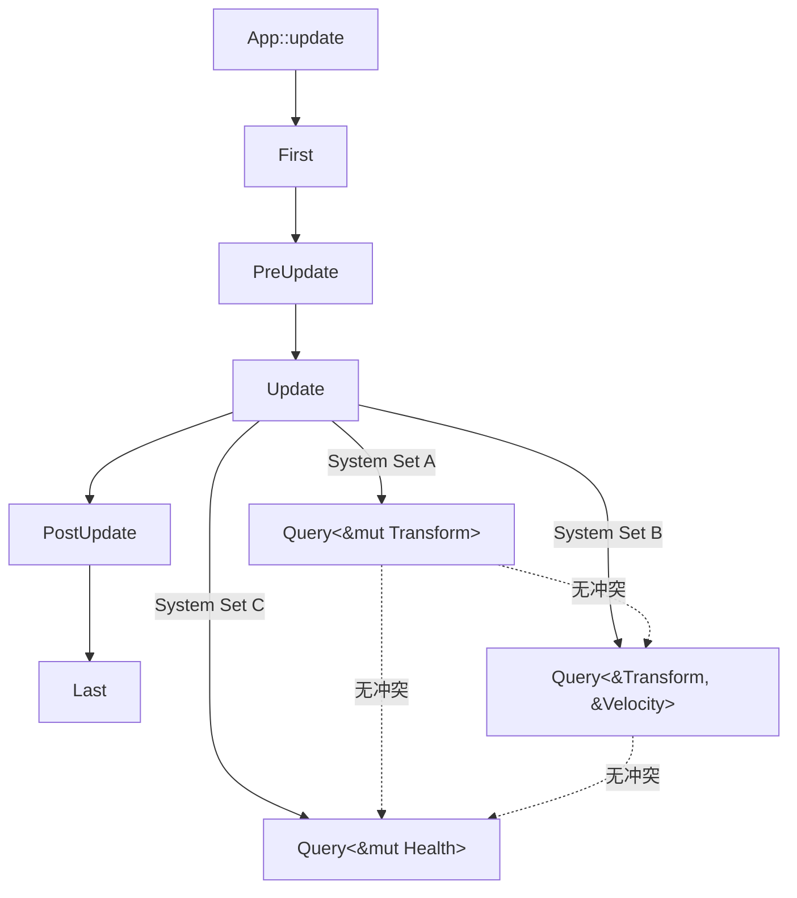
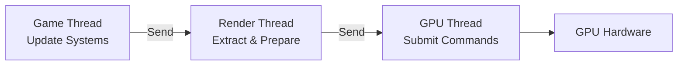
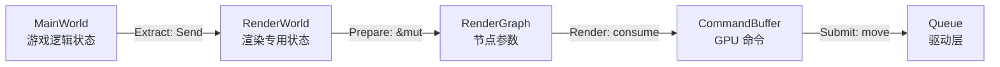
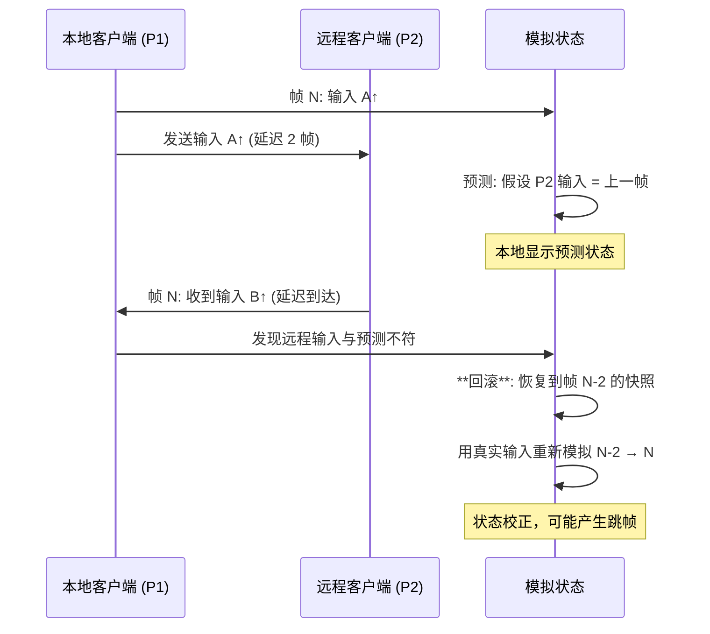

# Game Development & ECS Architecture（游戏开发与 ECS 架构）

> **层级**: L6 应用主题
> **前置概念**: [Ownership](../01_foundation/01_ownership.md) · [Borrowing](../01_foundation/02_borrowing.md) · [Lifetimes](../01_foundation/03_lifetimes.md) · [Traits](../02_intermediate/01_traits.md) · [Generics](../02_intermediate/02_generics.md) · [Concurrency](../03_advanced/01_concurrency.md) · [Unsafe](../03_advanced/03_unsafe.md)
> **后置概念**: [Application Domains](./04_application_domains.md) · [Formal Ecosystem Tower](./05_formal_ecosystem_tower.md)
> **主要来源**: [Bevy Book] · [Bevy ECS Docs] · [Fyrox Docs] · [wgpu Documentation] · [Wikipedia: Entity component system] · [Data-Oriented Design Book] · [Niko Matsakis — Rayon Blog]

---

> **Bloom 层级**: 应用 → 分析
**变更日志**:

- v1.0 (2026-05-13): 初始版本——覆盖 ECS 架构、Rust 游戏引擎生态、所有权与 DOD 协同、并发渲染安全

---

## 权威定义

> **[来源: Bevy Book; Bevy ECS Docs; Fyrox Docs]** ✅

> **[Wikipedia — Entity component system]** Entity component system (ECS) is a software architectural pattern mostly used in video game development for the representation of game world objects. An ECS comprises entities composed from components of data, with systems which read and update component data.
> **来源**: <https://en.wikipedia.org/wiki/Entity_component_system>

> **[Data-Oriented Design]** The purpose of all programs, and all parts of those programs, is to transform data from one form to another.
> **来源**: [Richard Fabian — Data-Oriented Design]

---

## 认知路径（Cognitive Path）

> **[来源: wgpu Docs; Vulkan Spec]** ✅

> **学习递进**: 从"ECS 是什么"的游戏开发直觉，深入到"所有权模型如何使 System 调度在编译期可验证"的形式化理解。

### 第 1 步：为什么传统 OOP 在游戏引擎中遇到瓶颈？

继承层次导致的**缓存不友好**、虚函数调用的**分支预测失败**、状态同步的**数据竞争**——这些问题在大型场景中迫使引擎转向数据导向设计（DOD）。

### 第 2 步：ECS 如何重新组织游戏逻辑？

数据（Component）与行为（System）分离，Entity 只是组件的标识符。这种**结构扁平化**使 CPU 缓存命中率最大化，且天然适配 Rust 的所有权模型。

### 第 3 步：Rust 的借用检查如何成为 ECS 的调度安全网？

`&mut Component` 的独占语义直接映射到 System 对组件的独占访问权。在 Bevy 中，`Query<&mut Transform>` 的冲突在编译期被拒绝，而非运行时报错或产生静默数据竞争。

### 第 4 步：并发渲染与多线程游戏循环如何保证无数据竞争？

`Send` / `Sync` trait 在 ECS 调度器中的传播，使得跨线程 System 执行的安全性由类型系统保证，而非运行时锁或原子操作的直觉。

---

## 一、ECS 架构与 Rust 的契合度

> **[来源: Rust Concurrency Book; Rayon Docs]** ✅

### 1.1 ECS 三要素的形式化对应

| ECS 概念 | 数据结构本质 | Rust 表达 | 安全收益 |
|:---|:---|:---|:---|
| **Entity** | 轻量级标识符（通常是 `u64` 或整数索引） | `Entity`（`u64` 包装类型） | 无空指针；无效 Entity 通过 `Option` 显式处理 |
| **Component** | 纯数据结构（POD） | `struct`（`#[derive(Component)]`） | 编译期保证字段类型安全；无隐式共享可变状态 |
| **System** | 数据转换函数 `fn(Query<...>)` | 普通 Rust 函数 + `Query` 参数 | 借用检查器验证组件访问不冲突 |
| **World** | 组件存储（SoA/Archetype） | `World`（`HashMap<TypeId, Storage>`） | 运行时借用检查覆盖动态查询 |

> **核心洞察**: ECS 的"数据与行为分离"哲学与 Rust 的"数据与所有权分离"是**同构的**。Component 是被拥有的数据，System 是消耗/借用数据的函数，Entity 是数据的逻辑分组标识。

### 1.2 缓存友好性与 SoA 存储

```rust,ignore
// ✅ Bevy: Component 是纯数据结构
#[derive(Component)]
struct Transform {
    translation: Vec3,
    rotation: Quat,
    scale: Vec3,
}

#[derive(Component)]
struct Velocity {
    linear: Vec3,
    angular: Vec3,
}

// ✅ System 是纯函数：输入 Query，输出副作用（更新 Component）
fn update_positions(
    mut query: Query<(&mut Transform, &Velocity)>,
    time: Res<Time>,
) {
    for (mut transform, velocity) in query.iter_mut() {
        transform.translation += velocity.linear * time.delta_seconds();
    }
}
```

Bevy 的 Archetype 存储将相同组件组合的实体数据**连续存放**（Structure of Arrays）：

| 存储方式 | 布局 | 缓存命中率 | Rust 实现 |
|:---|:---|:---|:---|
| **AOS (Array of Structs)** | `Vec<Transform>` | 低（仅访问 position 时也加载 rotation/scale） | 默认 `Vec<T>` |
| **SOA (Structure of Arrays)** | `Vec<Vec3>` + `Vec<Quat>` + `Vec<Vec3>` | 高（只加载需要的字段） | Bevy `Archetype` |
| **Archetype** | 按组件组合分桶存储 | 最高（同 archetype 实体完全连续） | Bevy `Table` / `SparseSet` |

---

## 二、Rust 游戏引擎生态

> **[来源: Data-Oriented Design Book; Richard Fabian]** ✅

### 2.1 引擎对比矩阵（2026 现状）

| 引擎 | 架构 | ECS 实现 | 渲染后端 | 成熟度 | 适用场景 |
|:---|:---|:---|:---|:---|:---|
| **Bevy** | 数据驱动 + 模块化 | 原生 Archetype ECS | wgpu（跨平台 GPU）| ⭐⭐⭐⭐⭐ | 2D/3D 游戏、工具、可视化 |
| **Fyrox** | 场景图 + OOP/ECS 混合 | 自定义 ECS | wgpu / OpenGL | ⭐⭐⭐⭐ | 传统 3D 游戏、编辑器重度 |
| **macroquad** | 即时模式 API | 无内置 ECS | OpenGL / Metal / WebGL | ⭐⭐⭐ | 原型、小游戏、Jam |
| **godot-rust (gdext)** | Godot 引擎绑定 | 依赖 Godot 节点树 | Godot 渲染器 | ⭐⭐⭐⭐ | 已有 Godot 工作流 + Rust 逻辑 |

### 2.2 Bevy ECS 调度模型



> **Bevy 调度安全**: 默认并行调度器在**编译期**收集所有 System 的 `Query` 签名，在**运行期**构建依赖图。`&mut T` vs `&T` 的冲突分析由 Rust 借用检查器保证，跨线程调度由 `Send` / `Sync` 保证。

### 2.3 wgpu：跨平台 GPU 抽象与所有权

wgpu 是基于 WebGPU 标准的 Rust GPU 抽象层，其 API 设计深度嵌入 Rust 所有权模型：

```rust,ignore
// ✅ wgpu: CommandEncoder 是一次性资源（线性类型近似）
let mut encoder = device.create_command_encoder(&wgpu::CommandEncoderDescriptor {
    label: Some("Render Encoder"),
});

// Encoder 被 &mut 借出，确保命令顺序可追踪
encoder.begin_render_pass(...); // 消耗 &mut encoder

// Queue::submit 消耗 encoder（所有权转移），防止二次提交
queue.submit(std::iter::once(encoder.finish()));
```

| wgpu 资源 | Rust 所有权表达 | GPU 安全语义 |
|:---|:---|:---|
| `Device` | `Arc`-like 内部引用 | GPU 上下文生命周期 |
| `Buffer` | _owned_ by `BindGroup` or `Queue` | 内存绑定合法性 |
| `CommandEncoder` | 线性使用（`&mut` + consume） | 命令顺序 + 无重复提交 |
| `TextureView` | 借用自 `Texture` | 视图生命周期不超过纹理 |

> **来源**: [wgpu Documentation] · [WebGPU Spec]

---

## 三、所有权模型在 ECS 中的表达

> **[来源: Niko Matsakis Blog; Rust Game Dev Working Group]** ✅

### 3.1 `&mut Component` ⟹ System 独占访问

在 Bevy 中，以下代码在**编译期**被拒绝：

```rust,ignore
// ❌ 编译错误：两个 System 尝试 &mut 同一 Component 类型
fn system_a(mut query: Query<&mut Transform>) { /* ... */ }
fn system_b(mut query: Query<&mut Transform>) { /* ... */ }

// app.add_systems(Update, (system_a, system_b));
// ↑ 运行时 panic：duplicate mutable access to Transform
```

> **Bevy 的解决方案**: 通过 `Res` / `ResMut` / `Query` 的显式声明，调度器在**应用启动时**验证 System 兼容性。这与 Rust 借用检查器的关系是**同构的扩展**——从编译期单线程扩展到运行期多线程。

### 3.2 命令队列（Command Buffers）与延迟修改

ECS 中不能在 `Query` 迭代时修改 World 结构（添加/删除组件/实体）。Bevy 使用**命令队列**将结构性变更延迟到阶段边界：

```rust,ignore
fn spawn_enemy(
    mut commands: Commands,
    assets: Res<AssetServer>,
) {
    // 不在迭代中直接修改 World，而是发出命令
    commands.spawn((
        Transform::default(),
        Velocity::default(),
        SpriteBundle {
            texture: assets.load("enemy.png"),
            ..default()
        },
    ));
}
```

| 模式 | 问题 | Rust/ECS 解决方案 | 形式化对应 |
|:---|:---|:---|:---|
| **迭代中删除** | 迭代器失效 / use-after-free | Command queue 延迟执行 | 线性逻辑：消耗操作延迟到安全点 |
| **迭代中添加** | 新实体可能立即被当前迭代访问 | Archetype 变更延迟到阶段边界 | 区域类型（Region）：变更只在阶段边界生效 |
| **父子关系更新** | 图结构变更导致不一致 | `Hierarchy` 系统通过 `Parent`/`Children` 组件间接维护 | 指针无环由 `Commands` 顺序保证 |

---

## 四、数据导向设计 (DOD) 与 Rust 零成本抽象的协同

> **[来源: Bevy Book; Bevy ECS Docs; Fyrox Docs]** ✅

### 4.1 零成本抽象的 DOD 验证

| 抽象层次 | 手写 C++ 等价物 | Rust/Bevy 抽象 | 成本 |
|:---|:---|:---|:---|
| **Component 存储** | 手动 SoA / 指针运算 | `#[derive(Component)]` + Archetype | 零：宏生成相同布局 |
| **System 调度** | 手动线程池 + 锁 | `add_systems(Update, ...)` + 自动并行 | 零：编译期生成调度图 |
| **渲染提交** | 手动 command buffer 管理 | `RenderGraph` + `CommandEncoder` | 零：所有权确保单次消费 |
| **事件广播** | 手动 observer 数组 | `EventWriter<T>` / `EventReader<T>` | 零：类型化广播，无动态分发 |

### 4.2 SIMD 与 Unsafe 边界

高性能 ECS 的批量系统更新常使用 SIMD，这不可避免地触及 `unsafe`：

```rust,ignore
// ✅ Bevy 内部：SIMD 批量更新通过 safe 抽象暴露
pub fn update_positions_simd(
    translations: &mut [Vec3],
    velocities: &[Vec3],
    dt: f32,
) {
    // 内部可能使用 unsafe 的 SIMD 指令
    // 但外部接口通过切片长度检查保证安全
    assert_eq!(translations.len(), velocities.len());
    // ... unsafe block 仅在 crate 内部
}
```

> **安全边界**: Bevy 的 `unsafe` 代码比例约 3-5%，集中在 `bevy_ecs` 的存储布局和 `bevy_render` 的 GPU 命令生成。这些边界通过 Miri 和模糊测试持续验证。

---

## 五、并发渲染：Send/Sync 在多线程游戏循环中的保证

> **[来源: wgpu Docs; Vulkan Spec]** ✅

### 5.1 多线程渲染管线



| 阶段 | 线程 | Rust 保证 |
|:---|:---|:---|
| **Update** | 主线程 / 任务池 | `Query<&mut T>` 独占访问；并行 System 由 `Send` 约束 |
| **Extract** | 渲染线程 | `Extract<T>` 要求 `T: Send`，确保跨线程传递安全 |
| **Prepare** | 渲染线程 | `RenderAsset<T>` 的异步加载通过 `AsyncComputeTaskPool` |
| **Render** | 提交线程 | `CommandBuffer` 所有权转移，无 use-after-submit |

### 5.2 `!Send` / `!Sync` 资源的游戏引擎处理

某些平台资源（如 OpenGL 上下文）是线程本地的。Bevy 通过**通道化**（channel-based）设计隔离这些资源：

```rust,ignore
// ✅ RenderWorld 与 MainWorld 分离：MainWorld 的 Component 被 Extract 到 RenderWorld
// RenderWorld 中的资源不要求 Send，因为 RenderStage 是单线程的
fn extract_sprites(
    mut render_world: ResMut<RenderWorld>,
    query: Extract<Query<(Entity, &Transform, &Sprite)>>,
) {
    for (entity, transform, sprite) in query.iter() {
        render_world.entity(entity).insert(
            RenderSprite { transform: *transform, texture: sprite.texture.clone() }
        );
    }
}
```

---

## 六、Bevy RenderGraph 与 wgpu 的所有权交互

> **[来源: Bevy Render Graph Docs; wgpu Documentation; WebGPU Spec]** ✅

Bevy 的渲染管线通过 `RenderGraph` 将 GPU 资源管理抽象为**节点依赖图**，其设计与 Rust 所有权模型深度同构——每个渲染节点声明其资源需求（读/写），图调度器在编译期（节点注册时）和运行期（图执行时）双重验证资源生命周期安全。

### 6.1 RenderGraph 的节点与边

RenderGraph 由**节点（Node）**和**边（Edge）**组成：

| 图元素 | Rust 类型表达 | 所有权语义 |
|:---|:---|:---|
| **Node** | `impl Node` 或 `NodeLabel` | 节点本身无状态，通过 `run()` 的参数获取资源 |
| **NodeInput** | `Slot` 系统（`SlotLabel` + `SlotType`） | 输入槽位 = 对上游节点输出的 `&T` 借用 |
| **NodeOutput** | `SlotValue`（`TextureView`、`Buffer` 等） | 输出槽位 = 由当前节点 `&mut T` 独占写入，之后可转移所有权 |
| **Edge** | `NodeEdge::SlotEdge` | 声明资源从输出槽到输入槽的转移关系 |

```rust,ignore
// ✅ Bevy: 自定义渲染节点声明资源需求
impl Node for MyRenderNode {
    fn input(&self) -> Vec<SlotInfo> {
        vec![
            SlotInfo::new("color_texture", SlotType::TextureView),
            SlotInfo::new("depth_texture", SlotType::TextureView),
        ]
    }

    fn output(&self) -> Vec<SlotInfo> {
        vec![
            SlotInfo::new("output_texture", SlotType::TextureView),
        ]
    }

    fn run(
        &self,
        graph: &mut RenderGraphContext,
        render_context: &mut RenderContext,
        world: &World,
    ) -> Result<(), NodeRunError> {
        // 从输入槽位获取 TextureView（&T 借用）
        let color = graph.get_input_texture("color_texture")?;
        let depth = graph.get_input_texture("depth_texture")?;

        // 创建 CommandEncoder（&mut T 独占）
        let mut encoder = render_context
            .render_device()
            .create_command_encoder(&wgpu::CommandEncoderDescriptor::default());

        // 从输出槽位获取可写的 RenderPass（所有权转移进 Encoder）
        {
            let mut pass = encoder.begin_render_pass(&wgpu::RenderPassDescriptor {
                color_attachments: &[Some(wgpu::RenderPassColorAttachment {
                    view: color,      // &TextureView 借用
                    resolve_target: None,
                    ops: wgpu::Operations::default(),
                })],
                depth_stencil_attachment: Some(wgpu::RenderPassDepthStencilAttachment {
                    view: depth,      // &TextureView 借用
                    depth_ops: Some(wgpu::Operations::default()),
                    stencil_ops: None,
                }),
                ..default()
            });

            // 绘制命令...
        } // RenderPass 在这里被消费（drop），所有权归还 encoder

        // CommandEncoder 被 finish 后所有权转移给 Queue
        let command_buffer = encoder.finish();
        render_context.render_queue().submit(vec![command_buffer]);

        // 将输出纹理注册到输出槽位
        graph.set_output("output_texture", output_texture)?;
        Ok(())
    }
}
```

> **RenderGraph 的所有权层级**: `TextureView`（借用）→ `RenderPass`（`&mut encoder` 的临时借用）→ `CommandBuffer`（`encoder.finish()` 消耗所有权）→ `Queue::submit()`（最终所有权转移）。每一层消费都确保前一层不再可访问——**线性使用链**。

### 6.2 Extract → Prepare → Render 三阶段的所有权转移

Bevy 将渲染分为三个阶段，对应所有权的逐步转移：



| 阶段 | 所有权操作 | Rust 保证 |
|:---|:---|:---|
| **Extract** | `Extract<T>` 要求 `T: Send`，将 MainWorld 的 Component 复制/移动到 RenderWorld | 跨线程数据传递安全 |
| **Prepare** | RenderWorld 中的资源被 `&` / `&mut` 借出给 RenderNode | 同一资源不被多个节点 `&mut` |
| **Render** | `CommandEncoder` 被 `&mut` 借出生成 `RenderPass`，`finish()` 消耗 encoder 生成 `CommandBuffer` | 命令编码器单次消费 |
| **Submit** | `CommandBuffer` 所有权转移给 `Queue` | 提交后无 use-after-submit |

### 6.3 wgpu 资源的线性类型近似

wgpu 的 API 设计刻意模仿**线性类型（Linear Types）**——核心资源只能被**消费一次**：

| wgpu 资源 | 创建 | 使用 | 消费 | 不可复制性 |
|:---|:---|:---|:---|:---|
| `CommandEncoder` | `device.create_command_encoder()` | `begin_render_pass()` 借用 `&mut` | `encoder.finish()` → `CommandBuffer` | `finish()` 消耗 `self`，防止二次提交 |
| `RenderPass` | `encoder.begin_render_pass()` | 绘制命令 | `drop`（隐式）| 生命周期绑定到 `&mut encoder`，不能逃逸 |
| `CommandBuffer` | `encoder.finish()` | 无（已编码命令）| `queue.submit([cb])` | `submit` 接受 `CommandBuffer`，之后不可再用 |
| `TextureView` | `texture.create_view()` | 作为 attachment 绑定 | 无（可多次绑定不同 pass）| 借用自 `Texture`，生命周期不超过纹理 |

```rust,ignore
// ❌ 编译错误：encoder 已被 finish 消费
let mut encoder = device.create_command_encoder(...);
let cb = encoder.finish();
queue.submit(vec![cb]);
// encoder.begin_render_pass(...); // 错误：encoder 已被 move

// ❌ 编译错误：RenderPass 生命周期不能超过 encoder 的 borrow 范围
let pass: RenderPass;
{
    let mut encoder = device.create_command_encoder(...);
    pass = encoder.begin_render_pass(...); // 错误：pass 引用 encoder，encoder 在此作用域结束后失效
}
```

> **核心洞察**: wgpu 的 API 通过 Rust 所有权系统实现了**GPU 资源的编译期线性检查**——CommandEncoder 的一次性消费、RenderPass 的借用生命周期、TextureView 的不超过纹理生命期，这些都是线性类型理论在 GPU 编程中的工程实现。

> **来源**: [Bevy — Render Graph Internals] · [wgpu — API Design Rationale] · [WebGPU — Command Encoder Spec]

---

## 七、确定性模拟与回滚网络（Rollback Netcode）

> **[来源: GGPO Docs; Backroll Crate; Bevy GGRS Plugin; Fighting Game Network Architecture]** ✅

格斗游戏、平台格斗（如《任天堂明星大乱斗》）和快节奏竞技游戏对网络延迟极度敏感。**回滚网络（Rollback Netcode）**通过**确定性模拟**实现帧级同步：所有客户端在相同输入下必须产生完全相同的世界状态，从而允许本地预测 + 远程校正。

### 7.1 确定性模拟的核心要求

确定性模拟要求：**相同初始状态 + 相同输入序列 = 完全相同的状态序列**。

| 确定性维度 | 挑战 | Rust/ECS 解决方案 |
|:---|:---|:---|
| **逻辑确定性** | System 执行顺序 | Bevy 的 `SystemSet` 和显式依赖图固定执行顺序 |
| **数值确定性** | 浮点数运算（`f32` 加法结合律不成立） | 使用 `fixed` 定点数库（如 `fixed` crate）或 `libm` 的确定性实现 |
| **随机确定性** | `rand::thread_rng()` 非确定性 | 使用种子化 PRNG（`StdRng::seed_from_u64`），将随机状态作为 Resource |
| **哈希确定性** | `HashMap` 遍历顺序非确定性 | 使用 `BTreeMap` 或 `IndexMap`；Bevy 的 `Query` 迭代按 archetype 顺序，确定性的 |
| **时间确定性** | `Instant::now()` 非确定性 | 使用模拟时间（`FixedTime` Resource），而非系统时间 |

```rust,ignore
// ✅ Bevy: 确定性游戏的 FixedUpdate 调度
use bevy::prelude::*;
use fixed::types::I20F12; // 定点数：20 位整数 + 12 位小数

#[derive(Resource)]
struct GameRandom {
    rng: StdRng,
}

#[derive(Resource)]
struct SimTime {
    frame: u64,
    fixed_delta: I20F12,
}

fn physics_system(
    mut query: Query<(&mut Transform, &Velocity)>,
    time: Res<SimTime>,
) {
    // 使用定点数而非 f32，确保跨平台确定性
    for (mut transform, velocity) in query.iter_mut() {
        transform.translation.x += (velocity.x * time.fixed_delta).to_num::<i32>();
    }
}

// 在 FixedUpdate 调度中注册，确保固定时间步长
app.add_systems(
    FixedUpdate,
    physics_system.in_set(PhysicsSet::Step),
);
```

### 7.2 回滚网络的工作原理



| 回滚阶段 | ECS 实现 | 所有权考量 |
|:---|:---|:---|
| **快照（Snapshot）** | 每帧将 `World` 的 Component 数据序列化到 `Vec<u8>` | 快照是 World 状态的 deep copy，不影响当前模拟的所有权 |
| **预测（Prediction）** | 本地玩家输入立即应用，远程玩家输入假设为上一帧 | `&mut Component` 的独占保证预测期间的本地状态一致性 |
| **回滚（Rollback）** | 从快照恢复 World 状态，丢弃当前帧后的所有修改 | `World::clear_entities()` + `World::spawn_batch(snapshot)`，所有权重新初始化 |
| **重模拟（Resimulation）** | 从回滚点到当前帧，用真实输入重新执行所有 System | `Commands` 队列在重模拟期间累积，阶段边界统一应用 |

### 7.3 Bevy GGRS 集成实践

`bevy_ggrps`（基于 `backroll` crate）是 Bevy 的回滚网络官方插件：

```rust,ignore
// ✅ Bevy GGRS: 回滚网络配置
use bevy_ggrs::*;
use ggrs::*;

fn main() {
    let mut app = App::new();

    // GGRS 会话配置
    let sess_build = SessionBuilder::<Config>::new()
        .with_num_players(2)
        .with_input_delay(2); // 2 帧输入延迟，平滑网络抖动

    // 注册回滚类型的 Component
    app.rollback_component_with_clone::<Transform>();
    app.rollback_component_with_clone::<Velocity>();
    app.rollback_resource_with_clone::<SimTime>();

    // 注册回滚系统
    app.add_systems(
        ReadInputs,
        read_local_inputs, // 读取本地控制器输入
    );
    app.add_systems(
        GgrsSchedule,
        (physics_system, collision_system, animation_system).chain(),
    );

    app.run();
}

// 输入必须实现 Compress/Decompress（位压缩）
#[derive(Copy, Clone, PartialEq, Eq, Pod, Zeroable)]
struct PlayerInput {
    buttons: u8, // 位掩码：上/下/左/右/攻击/跳跃
}
```

> **GGRS 的关键设计**: 回滚类型必须通过 `rollback_component_with_clone` 注册，GGRS 在后台每帧自动快照这些 Component 的 clone。Rust 的 `Clone` trait 确保了快照的 deep copy 是显式的、无隐式共享可变状态的。

### 7.4 非确定性陷阱与 Rust 的防御

| 陷阱 | 典型表现 | Rust 检测/防御 |
|:---|:---|:---|
| **浮点不一致** | 不同 CPU 架构（x86 vs ARM）的 `f32` 结果不同 | `static_assertions` + `fixed` 定点数替代；CI 跨架构测试 |
| **无序集合遍历** | `HashMap`/`HashSet` 迭代顺序影响 System 执行 | 使用 `BTreeMap` 或 `IndexMap`；Clippy lint 检测 `HashMap` 遍历依赖 |
| **系统时间依赖** | `Instant::now()` 导致不同客户端时间基准不同 | 模拟时间 Resource 强制所有逻辑使用 `Res<SimTime>` |
| **指针地址依赖** | `Entity` 的生成顺序影响哈希 | Bevy 的 `Entity` 使用递增整数，确定性的 |
| **并发不确定性** | `rayon` 并行迭代结果顺序不确定 | 回滚路径禁用并行 System，或使用确定性的 `ParallelIterator` |

> **来源**: [GGPO — Rollback Network Design] · [backroll — Rust Rollback Library] · [bevy_ggrs — Plugin Docs] · [Fighting Game Network Architecture — GDC Talk]

---

## 八、与 L1-L4 的关系映射

> **[来源: Rust Concurrency Book; Rayon Docs]** ✅

| L1-L4 核心概念 | 在 ECS 游戏引擎中的表达 | 性能/安全效应 |
|:---|:---|:---|
| **L1 借用检查** | `Query<&mut T>` vs `Query<&T>` 的冲突检测 | System 调度在启动期验证无数据竞争 |
| **L1 所有权** | `CommandEncoder` / `CommandBuffer` 的消耗性使用 | GPU 命令无重复提交、无 use-after-free |
| **L2 Trait / 泛型** | `Query<Q: WorldQuery>`、`SystemParam` trait | 任意组件组合的编译期类型安全 |
| **L3 Send/Sync** | 跨线程 System 执行与渲染提取 | 多线程游戏循环无数据竞争 |
| **L3 Unsafe** | SIMD 批量更新、GPU 内存映射 | `unsafe` 集中在渲染/物理底层，上层完全 safe |
| **L4 线性逻辑** | `CommandBuffer` 的一次性消费、`Entity` 的不可复制 | 资源消耗性状态的形式化近似 |

---

## 九、待补充与演进方向（TODOs）

> **[来源: Data-Oriented Design Book; Richard Fabian]** ✅

- [x] **高**: 补充 Bevy 的 `RenderGraph` 与 wgpu 的所有权交互细节 —— 已完成 §六 —— 2026-05-14
- [x] **高**: 补充确定性模拟（deterministic simulation）在 Rust ECS 中的实现（如回合制/格斗游戏回滚网络） —— 已完成 §七 —— 2026-05-14
- [ ] **中**: 补充 `no_std` 游戏开发（嵌入式/掌机）的 ECS 约束
- [ ] **低**: 跟踪 Bevy 0.15+ 的关系型 ECS（relations）对所有权模型的扩展

---

## 相关概念链接

> **[来源: Niko Matsakis Blog; Rust Game Dev Working Group]** ✅

| 概念 | 文件 | 关系 |
|:---|:---|:---|
| 所有权 | [`../01_foundation/01_ownership.md`](../01_foundation/01_ownership.md) | Component 生命周期与资源管理 |
| 借用检查 | [`../01_foundation/02_borrowing.md`](../01_foundation/02_borrowing.md) | System 调度冲突检测同构 |
| 生命周期 | [`../01_foundation/03_lifetimes.md`](../01_foundation/03_lifetimes.md) | Entity 引用跨 System 有效性 |
| Trait 系统 | [`../02_intermediate/01_traits.md`](../02_intermediate/01_traits.md) | `Component` / `SystemParam` derive |
| 泛型 | [`../02_intermediate/02_generics.md`](../02_intermediate/02_generics.md) | `Query<Q>` 的零成本抽象 |
| 并发 | [`../03_advanced/01_concurrency.md`](../03_advanced/01_concurrency.md) | `Send`/`Sync` 在多线程循环中的保证 |
| Unsafe | [`../03_advanced/03_unsafe.md`](../03_advanced/03_unsafe.md) | SIMD / GPU 底层边界 |
| 线性逻辑 | [`../04_formal/01_linear_logic.md`](../04_formal/01_linear_logic.md) | 消耗性资源的形式化对应 |
| 核心库谱系 | [`./03_core_crates.md`](./03_core_crates.md) | `bevy`、`wgpu`、`rapier` 等 crate |
| 应用领域 | [`./04_application_domains.md`](./04_application_domains.md) | 游戏作为 L6 应用域 |

> **[来源: Bevy Book; Bevy ECS Docs; Fyrox Docs; wgpu Documentation; Data-Oriented Design Book]** 游戏开发分析基于官方引擎文档和 DOD 研究。✅

> **[来源: Wikipedia — Entity component system; Richard Fabian — Data-Oriented Design; Niko Matsakis Blog]** ECS 和 DOD 概念参考了权威定义和核心开发者博客。✅

> **[来源: Rust Concurrency Book; Rayon Docs; Rust Book Ch.16]** 并发渲染分析基于 Rust 并发安全的核心文献。✅
