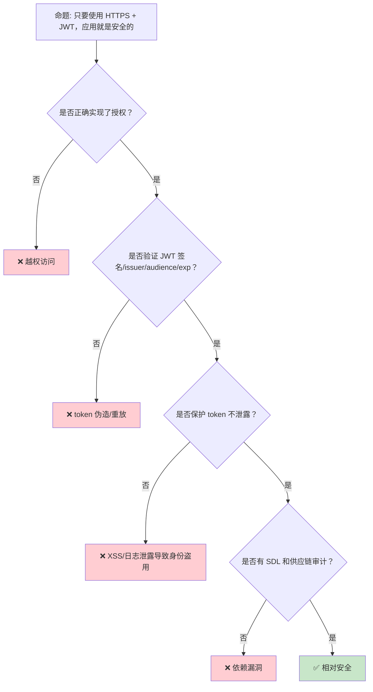
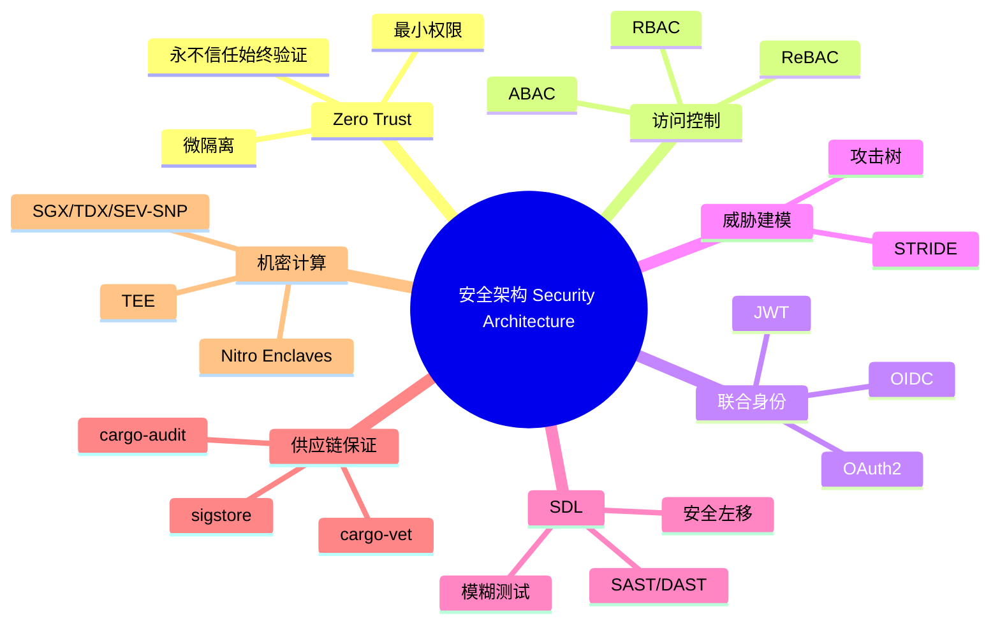

> **内容分级**: [专家级]
> **代码状态**: ✅ 含可编译示例
> **定理链**: N/A — 描述性/综述性/导航性文档，不涉及形式化定理链
>

# 安全架构：身份、信任、威胁与供应链的系统设计

> **EN**: Security Architecture
> **Summary**: Security Architecture — identity-centric design (Zero Trust, RBAC/ABAC/ReBAC), federated authentication (OAuth2/OIDC/JWT), threat modeling (STRIDE/Attack Trees), secure software development lifecycle (SDL), and supply-chain assurance (cargo-audit/vet/sigstore) plus confidential computing, mapped to Rust engineering practices.
> **Rust 版本**: 1.97.0+ (Edition 2024)
> **受众**: [进阶]
> **Bloom 层级**: L6
> **权威来源**: 本文件为 `concept/` 权威页。
> **A/S/P 标记**: **P+S+A** — Procedure + Structure + Application
> **双维定位**: P×Eva — 评估系统级安全架构的选型、威胁建模与供应链保证
> **前置概念**: [Security Practices](01_security_practices.md) · [Security and Cryptography](02_security_cryptography.md) · [Cargo Vet and Supply-Chain Auditing](03_cargo_vet_supply_chain.md) · [Type System](../../01_foundation/02_type_system/01_type_system.md)
> **后置概念**: [Blockchain](../11_domain_applications/01_blockchain.md) · [Cloud Native](../04_web_and_networking/02_cloud_native.md) · [Microservice Patterns](../03_design_patterns/05_microservice_patterns.md)
>
> **来源**: [NIST Zero Trust Architecture (SP 800-207)](https://csrc.nist.gov/publications/detail/sp/800-207/final) · [OAuth 2.0 — RFC 6749](https://tools.ietf.org/html/rfc6749) · [OpenID Connect Core 1.0](https://openid.net/specs/openid-connect-core-1_0.html) · [STRIDE — Microsoft](https://learn.microsoft.com/en-us/azure/security/develop/threat-modeling-tool-threats) · [Microsoft SDL](https://www.microsoft.com/en-us/securityengineering/sdl) · [OWASP SAMM](https://owaspsamm.org/) · [Sigstore](https://www.sigstore.dev/) · [Confidential Computing Consortium](https://confidentialcomputing.io/)

---

> **来源**: [RFC 7519 — JWT](https://tools.ietf.org/html/rfc7519) · [RFC 7662 — Token Introspection](https://tools.ietf.org/html/rfc7662) · [NIST SP 800-63 — Digital Identity Guidelines](https://pages.nist.gov/800-63-3/) · [OWASP ASVS](https://owasp.org/www-project-application-security-verification-standard/) · [cargo-audit](https://github.com/RustSec/rustsec/tree/main/cargo-audit) · [cargo-vet](https://mozilla.github.io/cargo-vet/) · [Rust Secure Code WG](https://github.com/rust-secure-code/wg) · [Zero Trust Architecture: A Survey (arXiv)](https://arxiv.org/abs/2503.11659)

## 📑 目录

- [安全架构：身份、信任、威胁与供应链的系统设计](#安全架构身份信任威胁与供应链的系统设计)
  - [📑 目录](#-目录)
  - [一、核心概念](#一核心概念)
    - [1.1 Zero Trust：永不信任，始终验证](#11-zero-trust永不信任始终验证)
    - [1.2 访问控制模型：RBAC / ABAC / ReBAC](#12-访问控制模型rbac--abac--rebac)
    - [1.3 联合身份：OAuth2 / OIDC / JWT](#13-联合身份oauth2--oidc--jwt)
    - [1.4 威胁建模：STRIDE 与攻击树](#14-威胁建模stride-与攻击树)
    - [1.5 安全开发生命周期（SDL）](#15-安全开发生命周期sdl)
    - [1.6 供应链保证：cargo-audit / cargo-vet / sigstore](#16-供应链保证cargo-audit--cargo-vet--sigstore)
    - [1.7 机密计算：TEE 与隐私增强技术](#17-机密计算tee-与隐私增强技术)
  - [二、架构决策矩阵](#二架构决策矩阵)
  - [三、反命题与边界分析](#三反命题与边界分析)
    - [3.1 反命题树](#31-反命题树)
    - [3.2 边界极限](#32-边界极限)
  - [四、常见陷阱](#四常见陷阱)
  - [五、Rust 工程落地](#五rust-工程落地)
  - [六、边界测试](#六边界测试)
    - [6.1 边界测试：JWT 无签名验证导致身份伪造（运行时安全漏洞）](#61-边界测试jwt-无签名验证导致身份伪造运行时安全漏洞)
    - [6.2 边界测试：RBAC 角色过度授权（逻辑漏洞）](#62-边界测试rbac-角色过度授权逻辑漏洞)
    - [6.3 边界测试：时序侧信道泄露密码比较结果（运行时信息泄露）](#63-边界测试时序侧信道泄露密码比较结果运行时信息泄露)
  - [反例 / 边界测试 / 常见陷阱](#反例--边界测试--常见陷阱)
    - [把 JWT 签名密钥硬编码在源码或普通环境变量中](#把-jwt-签名密钥硬编码在源码或普通环境变量中)
  - [相关概念](#相关概念)
  - [🧭 思维导图（Mindmap）](#-思维导图mindmap)

**变更日志**:

- v1.0 (2026-07-30): Wave 9 新增——安全架构权威页，覆盖 Zero Trust、RBAC/ABAC/ReBAC、OAuth2/OIDC/JWT、STRIDE/攻击树、SDL、供应链保证与机密计算

---

## 一、核心概念

系统级安全架构的核心是**把信任从网络边界转移到身份与数据**。传统"城堡+护城河"模型假设内网即安全，而现代分布式系统（云原生、微服务、远程办公）要求每个访问请求都必须经过身份验证、授权、最小权限和审计。

```text
安全架构的五大支柱:

  身份 (Identity)
  ├── 认证: 你是谁？（OAuth2/OIDC/JWT）
  ├── 授权: 你能做什么？（RBAC/ABAC/ReBAC）
  └── 生命周期: 入职/转岗/离职/密钥轮换

  信任 (Trust)
  ├── Zero Trust: 永不假设网络位置可信
  ├── 最小权限: 只授予完成任务所需的最小权限
  └── 持续验证: 每次请求都重新评估

  威胁 (Threat)
  ├── STRIDE 分类: Spoofing/Tampering/Repudiation/Information Disclosure/DoS/Elevation
  ├── 攻击树: 系统分解攻击路径
  └── 威胁建模: 在编码前识别攻击面

  流程 (Process)
  ├── SDL: 安全左移
  ├── 代码审查与静态分析
  └── 应急响应与 CVE 跟踪

  供应链 (Supply Chain)
  ├── 依赖审计: cargo-audit / cargo-vet
  ├── 制品签名: sigstore / cosign
  └── 来源证明: SLSA / SBOM
```

> **认知功能**: 安全架构不是单一工具或语言特性，而是贯穿**身份、信任、威胁、流程、供应链**的系统工程 discipline。
> [来源: [NIST SP 800-207](https://csrc.nist.gov/publications/detail/sp/800-207/final)]

---

### 1.1 Zero Trust：永不信任，始终验证

> **[NIST SP 800-207](https://csrc.nist.gov/publications/detail/sp/800-207/final)** Zero Trust Architecture（ZTA）的核心假设：**网络位置（内网/外网）不再决定信任级别**。每个访问请求都必须基于动态策略进行评估，且假设网络已经遭到入侵。

```text
Zero Trust 三大原则:

  1. 永不信任，始终验证
     ├── 所有流量都必须认证
     ├── 授权基于完整上下文（身份、设备健康、行为、数据敏感度）
     └── 默认拒绝（default deny）

  2. 最小权限访问
     ├── 按需授予
     ├── 即时（JIT）提升
     └── 持续评估并动态撤销

  3. 假设失陷
     ├── 内网扫描与分段
     ├── 微隔离（micro-segmentation）
     └── 全面日志与异常检测
```

**传统边界模型 vs Zero Trust**：

| 维度 | 传统边界模型 | Zero Trust |
|:---|:---|:---|
| 信任基础 | 网络位置（内网可信） | 身份、设备、行为、上下文 |
| 默认策略 | 内网允许 | 默认拒绝 |
| 访问粒度 | 粗粒度（进入内网即可横向移动） | 细粒度（按资源/操作/上下文） |
| 威胁假设 | 外部攻击者 | 外部 + 内部 + 已失陷 |
| Rust 落地 | 较少 | 服务网格 mTLS、SPIFFE/SPIRE 身份 |

> **关键洞察**: Zero Trust 不是产品，而是**架构原则**。实现它需要身份基础设施、策略引擎、可观测性和自动化响应的协同。
> [来源: [NIST Zero Trust](https://csrc.nist.gov/publications/detail/sp/800-207/final)]

---

### 1.2 访问控制模型：RBAC / ABAC / ReBAC

访问控制模型从"角色"进化到"属性"再到"关系"，本质是**授权决策所需的上下文越来越丰富**。

| 模型 | 决策依据 | 优点 | 缺点 | 典型场景 |
|:---|:---|:---|:---|:---|
| **RBAC**（基于角色） | 用户所属角色 | 简单、易于审计 | 角色爆炸、粒度粗 | 企业内部系统 |
| **ABAC**（基于属性） | 主体/客体/环境属性 | 细粒度、动态 | 策略复杂、难调试 | 云 IAM、IoT |
| **ReBAC**（基于关系） | 实体间关系图 | 自然表达社交/资源关系 | 图查询复杂 | Google Zanzibar、协作应用 |

**Rust 示例 — RBAC 授权检查**：

```rust
use std::collections::{HashMap, HashSet};

#[derive(Debug, Clone, PartialEq, Eq, Hash)]
enum Permission {
    Read,
    Write,
    Delete,
    Admin,
}

#[derive(Debug, Clone, PartialEq, Eq, Hash)]
enum Role {
    Viewer,
    Editor,
    Admin,
}

struct RbacEngine {
    role_permissions: HashMap<Role, HashSet<Permission>>,
    user_roles: HashMap<String, HashSet<Role>>,
}

impl RbacEngine {
    fn new() -> Self {
        let mut role_permissions = HashMap::new();
        role_permissions.insert(Role::Viewer, HashSet::from([Permission::Read]));
        role_permissions.insert(Role::Editor, HashSet::from([Permission::Read, Permission::Write]));
        role_permissions.insert(Role::Admin, HashSet::from([Permission::Read, Permission::Write, Permission::Delete, Permission::Admin]));

        Self {
            role_permissions,
            user_roles: HashMap::new(),
        }
    }

    fn assign_role(&mut self, user: &str, role: Role) {
        self.user_roles.entry(user.to_string()).or_default().insert(role);
    }

    fn is_allowed(&self, user: &str, permission: &Permission) -> bool {
        self.user_roles.get(user)
            .map(|roles| roles.iter()
                .any(|role| self.role_permissions.get(role)
                    .map(|perms| perms.contains(permission))
                    .unwrap_or(false)))
            .unwrap_or(false)
    }
}

fn main() {
    let mut rbac = RbacEngine::new();
    rbac.assign_role("alice", Role::Editor);

    assert!(rbac.is_allowed("alice", &Permission::Read));
    assert!(rbac.is_allowed("alice", &Permission::Write));
    assert!(!rbac.is_allowed("alice", &Permission::Admin));
    assert!(!rbac.is_allowed("bob", &Permission::Read)); // 未分配角色
}
```

> **设计要点**: RBAC 在小型组织中足够，但随着角色数量增长会出现**角色爆炸**（role explosion）。此时应过渡到 ABAC 或 ReBAC，将授权逻辑从角色枚举迁移到可组合的策略规则。
> [来源: [NIST RBAC Standard](https://csrc.nist.gov/projects/role-based-access-control)] · [来源: [Google Zanzibar](https://research.google/pubs/pub48190/)]

---

### 1.3 联合身份：OAuth2 / OIDC / JWT

> **[OAuth 2.0 — RFC 6749](https://tools.ietf.org/html/rfc6749)** 是授权框架，解决"第三方应用如何安全地代表用户访问资源"的问题。**OpenID Connect（OIDC）** 建立在 OAuth2 之上，增加了身份层（ID Token）。**JWT（RFC 7519）** 是承载声明的紧凑、自包含令牌格式。

```text
OAuth2 / OIDC / JWT 关系:

  OAuth2: 授权框架
  ├── Authorization Code Flow（推荐）
  ├── Client Credentials Flow（M2M）
  ├── Device Code Flow（输入受限设备）
  └── 不定义 token 格式

  OIDC: 身份层（建立在 OAuth2 之上）
  ├── ID Token: JWT，包含用户身份声明
  ├── UserInfo Endpoint
  └── 标准化 claims（sub, name, email 等）

  JWT: 令牌格式
  ├── Header: 算法与类型
  ├── Payload: claims（iss, sub, aud, exp, iat 等）
  └── Signature: 防止篡改
```

**关键安全属性**：

| 属性 | 要求 | 常见错误 |
|:---|:---|:---|
| **签名验证** | 必须验证 `alg` 和签名 | 接受 `alg: none` |
| **issuer 验证** | 校验 `iss` 来自可信 IdP | 接受任意 issuer |
| **audience 验证** | 校验 `aud` 是自己的 client_id | 接受其他服务的 token |
| **过期时间** | 必须检查 `exp` | 忽略过期 |
| **机密性** | token 在 HTTP header / cookie 中传输需 TLS | 明文传输 |

**Rust 示例 — JWT 声明校验骨架（std-only，真实场景需用 `jsonwebtoken` 等 crate）**：

```rust
use std::collections::HashSet;

#[derive(Debug, Clone)]
struct JwtClaims {
    sub: String,
    iss: String,
    aud: String,
    exp: u64,
}

struct JwtValidator {
    trusted_issuers: HashSet<String>,
    expected_audience: String,
    clock_skew_secs: u64,
}

impl JwtValidator {
    fn validate(&self, claims: &JwtClaims, now: u64) -> Result<(), &'static str> {
        // 1. 验证 issuer
        if !self.trusted_issuers.contains(&claims.iss) {
            return Err("untrusted issuer");
        }

        // 2. 验证 audience
        if claims.aud != self.expected_audience {
            return Err("invalid audience");
        }

        // 3. 验证过期时间（允许少量时钟偏移）
        if claims.exp + self.clock_skew_secs < now {
            return Err("token expired");
        }

        Ok(())
    }
}

fn main() {
    let validator = JwtValidator {
        trusted_issuers: HashSet::from(["https://idp.example.com".to_string()]),
        expected_audience: "my-rust-api".to_string(),
        clock_skew_secs: 60,
    };

    let valid_claims = JwtClaims {
        sub: "user-123".to_string(),
        iss: "https://idp.example.com".to_string(),
        aud: "my-rust-api".to_string(),
        exp: 1_900_000_000,
    };

    assert!(validator.validate(&valid_claims, 1_700_000_000).is_ok());
}
```

> **关键洞察**: JWT 不是加密格式，只是签名格式。敏感声明应加密（JWE）或避免放入 token。"接受所有 issuer" 或 "忽略签名" 是最常见的灾难性配置错误。
> [来源: [OAuth.net](https://oauth.net/2/)] · [来源: [JWT.io](https://jwt.io/)]

---

### 1.4 威胁建模：STRIDE 与攻击树

> **[STRIDE — Microsoft](https://learn.microsoft.com/en-us/azure/security/develop/threat-modeling-tool-threats)** 是系统化的威胁分类框架：Spoofing（伪装）、Tampering（篡改）、Repudiation（否认）、Information Disclosure（信息泄露）、Denial of Service（拒绝服务）、Elevation of Privilege（权限提升）。

```text
STRIDE 分类与缓解:

  Spoofing（伪装）
  ├── 威胁: 冒充用户/服务
  └── 缓解: 强认证、MFA、服务身份（mTLS/SPIFFE）

  Tampering（篡改）
  ├── 威胁: 修改传输/存储中的数据
  └── 缓解: MAC/签名、TLS、完整性校验

  Repudiation（否认）
  ├── 威胁: 用户否认执行过某操作
  └── 缓解: 不可抵赖日志、审计追踪、数字签名

  Information Disclosure（信息泄露）
  ├── 威胁: 未授权访问敏感数据
  └── 缓解: 加密、最小权限、数据脱敏

  Denial of Service（拒绝服务）
  ├── 威胁: 耗尽资源
  └── 缓解: 限流、熔断、资源配额、验证码

  Elevation of Privilege（权限提升）
  ├── 威胁: 普通用户获得管理员权限
  └── 缓解: RBAC/ABAC、权限审查、沙箱
```

**攻击树**是 STRIDE 的延伸：以攻击目标为根节点，逐层分解为子目标与原子操作，并给每个叶子节点分配可行性与影响评分。

```text
攻击树示例：窃取 API 用户凭证

root("窃取 API 用户凭证")
├── 社会工程
│   ├── 钓鱼邮件
│   └── 伪造客服
├── 技术攻击
│   ├── 拦截未加密流量
│   ├── 利用 XSS 窃取 token
│   └── 暴力破解弱密码
└── 供应链攻击
    ├── 窃取开发者凭证
    └── 在依赖中植入键盘记录
```

> **工程实践**: 威胁建模应在**设计阶段**进行，而非上线前。每个威胁条目都应映射到缓解措施、测试用例和监控告警。
> [来源: [OWASP Threat Modeling](https://owasp.org/www-community/Application_Threat_Modeling)]

---

### 1.5 安全开发生命周期（SDL）

> **[Microsoft SDL](https://www.microsoft.com/en-us/securityengineering/sdl)** 将安全活动嵌入软件开发生命周期的每个阶段，核心思想是**安全左移**——越早发现和修复问题，成本越低。

```text
SDL 阶段与活动:

  需求阶段
  ├── 定义安全需求与合规要求
  ├── 威胁建模
  └── 选择安全框架（ASVS、NIST CSF）

  设计阶段
  ├── 安全设计审查
  ├── 最小权限设计
  └── 隐私影响评估

  实现阶段
  ├── 安全编码规范
  ├── 静态分析（SAST）
  ├── 依赖审计（cargo-audit/vet）
  └── 代码审查

  验证阶段
  ├── 动态分析（DAST）
  ├── 模糊测试（fuzzing）
  ├── 渗透测试
  └── 威胁模型更新

  发布阶段
  ├── 最终安全审查
  ├── 事件响应计划
  └── 安全文档

  运维阶段
  ├── 漏洞响应
  ├── 日志监控
  └── 定期重新评估
```

**Rust 生态中的 SDL 工具映射**：

| SDL 活动 | Rust 工具/实践 |
|:---|:---|
| 静态分析 | `cargo clippy`、semgrep、`cargo-geiger` |
| 依赖审计 | `cargo audit`、`cargo vet`、`cargo deny` |
| 模糊测试 | `cargo-fuzz`、`afl.rs` |
| 内存安全验证 | Miri、AddressSanitizer、ThreadSanitizer |
| 制品签名 | `cargo sigstore`（实验性）、`cosign` |
| SBOM | `cargo cyclonedx`、`cargo sbom` |

> **关键洞察**: Rust 的内存安全消除了 SDL 中一大类传统活动（缓冲区溢出、use-after-free 审计），但**逻辑漏洞、访问控制错误和供应链风险**仍需完整的 SDL 流程覆盖。
> [来源: [Microsoft SDL](https://www.microsoft.com/en-us/securityengineering/sdl)] · [来源: [OWASP SAMM](https://owaspsamm.org/)]

---

### 1.6 供应链保证：cargo-audit / cargo-vet / sigstore

现代项目的依赖树深度可达数百层，**供应链安全**已从可选活动变为质量门禁。Rust 生态提供三层防护：

| 工具 | 解决的问题 | 证据形式 |
|:---|:---|:---|
| **cargo-audit** | 已知漏洞（RustSec Advisory DB） | CVE/RUSTSEC 命中报告 |
| **cargo-vet** | "这段代码有没有人按标准审过？" | audits.toml / config.toml / imports.lock |
| **cargo-deny** | 许可证、来源、漏洞策略执行 | 策略配置文件 |
| **sigstore/cosign** | 制品签名与可验证供应链 | 签名、SLSA 来源证明 |

详细机制见 [cargo vet 与供应链审计](03_cargo_vet_supply_chain.md)。本节强调架构层面的集成模式：

```text
供应链保证架构:

  开发阶段
  ├── cargo deny check advisories/licenses/bans
  └── cargo vet suggest

  CI 阶段（阻断门）
  ├── cargo audit --no-fetch
  ├── cargo vet --locked
  └── cargo deny check

  发布阶段
  ├── SBOM 生成（cyclonedx）
  ├── 制品签名（cosign / sigstore）
  └── SLSA 来源证明

  运维阶段
  ├── 订阅 RustSec RSS
  └── 漏洞响应流程（RUSTSEC → patch → 重审）
```

> **关键洞察**: cargo-audit 回答"是否有已知漏洞"，cargo-vet 回答"是否有人审查过"。两者互补：一个查"已发现的问题"，一个查"是否有人看过"。
> [来源: [RustSec](https://rustsec.org/)] · [来源: [cargo-vet](https://mozilla.github.io/cargo-vet/)] · [来源: [Sigstore](https://www.sigstore.dev/)]

---

### 1.7 机密计算：TEE 与隐私增强技术

> **[Confidential Computing Consortium](https://confidentialcomputing.io/)** 机密计算通过**可信执行环境（TEE）**保护使用中的数据，确保即使操作系统、hypervisor 或云服务提供商被攻破，敏感计算仍保持机密和完整。

| TEE 技术 | 提供商/实现 | 关键特性 |
|:---|:---|:---|
| **Intel SGX** | Intel | 进程级 enclave，硬件内存加密 |
| **Intel TDX** | Intel | VM 级 TEE，更强的兼容性和可用内存 |
| **AMD SEV-SNP** | AMD | VM 级内存加密，抵御 hypervisor 攻击 |
| **ARM TrustZone** | ARM | 安全世界 vs 正常世界 |
| **AWS Nitro Enclaves** | AWS | 隔离计算环境，与主实例通过 vsock 通信 |
| **Azure Confidential Computing** | Microsoft | SGX/TDX 云服务集成 |

**Rust 与 TEE 的关系**：

- Rust 的内存安全使其成为 enclave 内代码的理想语言，减少 enclave 攻击面。
- `teaclave-sgx-sdk`（Apache Teaclave）提供在 Intel SGX 中运行 Rust 代码的 SDK。
- 机密计算与密码学结合形成**隐私增强技术（PETs）**：同态加密、安全多方计算（MPC）、零知识证明（ZKP）。

```rust,ignore
// AWS Nitro Enclaves: 通过 vsock 与父实例通信的 Rust 骨架
// 依赖: nsm-io, aws-nitro-enclaves-nsm-api
use aws_nitro_enclaves_nsm_api::api::{Request, Response};
use aws_nitro_enclaves_nsm_api::driver::{nsm_init, nsm_exit, nsm_process_request};

fn get_attestation_document(user_data: &[u8]) -> Vec<u8> {
    let nsm_fd = nsm_init();
    let request = Request::Attestation {
        user_data: Some(user_data.to_vec()),
        nonce: None,
        public_key: None,
    };
    let response = nsm_process_request(nsm_fd, request);
    nsm_exit(nsm_fd);

    match response {
        Response::Attestation { document } => document,
        _ => panic!("unexpected NSM response"),
    }
}
```

> **边界要点**: TEE 不是银弹。侧信道攻击（缓存计时、功耗分析）、enclave 内部漏洞和供应链攻击仍可绕过 TEE。机密计算应作为**纵深防御**的一层，而非唯一防线。
> [来源: [Confidential Computing Consortium](https://confidentialcomputing.io/)] · [来源: [AWS Nitro Enclaves](https://aws.amazon.com/ec2/nitro/nitro-enclaves/)]

---

## 二、架构决策矩阵

```text
场景 → 安全架构方案 → Rust 落地

Zero Trust 微服务:
  → 服务网格 mTLS + SPIFFE/SPIRE 身份
  → rustls + tonic（gRPC TLS）

API 授权:
  → 简单场景: RBAC
  → 动态上下文: ABAC / OPA
  → 协作/社交: ReBAC / Zanzibar

用户认证:
  → Web/移动应用: OIDC Authorization Code Flow + PKCE
  → 服务间: OAuth2 Client Credentials
  → 设备: Device Code Flow

威胁建模:
  → 新产品/重大变更: STRIDE
  → 攻击路径量化: 攻击树
  → 合规驱动: OWASP ASVS

供应链保证:
  → 已知漏洞: cargo-audit
  → 依赖审查: cargo-vet
  → 制品签名: cosign / sigstore
  → SBOM: cargo cyclonedx

敏感数据处理:
  → 静态数据: AES-GCM / ChaCha20-Poly1305
  → 传输中: TLS 1.3
  → 使用中: TEE / MPC / 同态加密
```

> **架构洞察**: 安全架构选型的核心是**匹配威胁模型与工程成本**。小型项目不需要完整的 Zero Trust + ReBAC，但任何处理用户数据的系统都应具备认证、授权、审计和漏洞响应能力。
> [来源: [OWASP ASVS](https://owasp.org/www-project-application-security-verification-standard/)]

---

## 三、反命题与边界分析

安全架构领域存在三个危险误判：

1. **"用了 HTTPS 和 JWT 就安全了"** —— 不成立。TLS 保护传输机密性，JWT 提供认证载体，但授权错误、token 泄露、配置缺陷（如接受 `alg: none`）仍可造成严重漏洞。
2. **"Zero Trust 就是买零信任产品"** —— 不成立。Zero Trust 是架构原则，涉及身份、设备、网络、应用、数据五个层面的改造；单一产品无法覆盖全部。
3. **"开源依赖经过广泛使用所以安全"** —— 不成立。广泛使用不等于经过审计，也不等于无已知漏洞；RUSTSEC 中大量漏洞影响的是流行 crate。

### 3.1 反命题树



> **认知功能**: 安全是**层次化**的。每一层都有其责任边界，忽视任何一层都会引入可被利用的缺口。
> [来源: [OWASP Top 10](https://owasp.org/www-project-top-ten/)]

### 3.2 边界极限

| **边界** | **现状** | **理论极限** | **工程影响** |
|:---|:---|:---|:---|
| **JWT 撤销** | 短有效期 + 刷新令牌 + 黑名单 | 完全即时撤销需中心状态 | 高安全场景用 token introspection |
| **ABAC 性能** | 毫秒级策略评估 | 复杂策略与大数据集 | 缓存策略决策、策略分发 |
| **TEE 侧信道** | 软件缓解 | 硬件级完全消除极难 | 高安全场景需额外防护 |
| **供应链审计** | 采样/公共审计集 | 全依赖树完全人工审计不可行 | 分层：核心依赖深审，外围依赖用工具 |
| **威胁建模覆盖** | 关键流程 | 100% 自动化识别不可行 | 持续迭代、红队验证 |

> **边界要点**: 安全架构的边界主要与**即时撤销、策略性能、侧信道、审计成本**和**威胁建模自动化**相关。
> [来源: [NIST Cybersecurity Framework](https://www.nist.gov/cyberframework)]

---

## 四、常见陷阱

```text
陷阱 1: JWT "alg: none"
  ❌ 接受 alg=none 或跳过签名验证
     // 攻击者可伪造任意 token

  ✅ 强制白名单算法（如 RS256/ES256），严格验证签名

陷阱 2: 角色爆炸
  ❌ 为每个业务场景创建新角色
     // 角色矩阵失控，审计困难

  ✅ 组合基础权限，用 ABAC/ReBAC 补充动态上下文

陷阱 3: 日志泄露敏感声明
  ❌ log::info!("user token: {}", jwt);
     // token 进入日志，可被具有日志访问权限的人滥用

  ✅ 只记录 sub/iss/aud/exp 等非敏感元数据

陷阱 4: 供应链工具孤岛
  ❌ 只运行 cargo audit，不做 cargo vet
     // 已知漏洞无，但没人审查过的依赖仍可投毒

  ✅ audit + vet + deny + sigstore 多层防护

陷阱 5: TEE 盲信
  ❌ 把所有敏感逻辑丢进 enclave，忽略侧信道
     // enclave 内代码漏洞同样可被利用

  ✅ TEE + 密码学 + 最小攻击面 + 侧信道审计
```

> **陷阱总结**: 安全架构的陷阱多与**配置错误、权限过度、日志泄露、工具孤岛**和**过度信任单一技术**相关。
> [来源: [OWASP Cheat Sheet Series](https://cheatsheetseries.owasp.org/)]

---

## 五、Rust 工程落地

Rust 在安全架构中的价值不仅在于内存安全，还在于**类型系统可以编码安全不变量**。示例包括：

- 用 newtype 区分"已验证 token"和"原始字符串"。
- 用 `secrecy::Secret` 防止敏感字符串进入日志。
- 用 `const fn` 或类型状态机强制最小权限状态转换。
- 用 `cargo audit` / `cargo vet` 将供应链安全变成 CI 门禁。

```rust
use std::marker::PhantomData;

// 类型状态：未验证 / 已验证
struct Unverified;
struct Verified;

struct JwtToken<State> {
    raw: String,
    _state: PhantomData<State>,
}

impl JwtToken<Unverified> {
    fn new(raw: String) -> Self {
        Self { raw, _state: PhantomData }
    }

    // 只有经过验证后才能获得 Verified token
    fn verify(self) -> Result<JwtToken<Verified>, &'static str> {
        // 实际应调用 jsonwebtoken 等 crate 验证签名
        if self.raw.starts_with("eyJ") {
            Ok(JwtToken { raw: self.raw, _state: PhantomData })
        } else {
            Err("invalid jwt format")
        }
    }
}

impl JwtToken<Verified> {
    fn subject(&self) -> &str {
        // 实际应解析 claims
        "user-123"
    }
}

fn main() {
    let token = JwtToken::new("eyJhbGciOiJSUzI1NiJ9...".to_string());
    let verified = token.verify().expect("verify");
    println!("subject: {}", verified.subject());

    // 编译错误：未验证 token 不能调用 subject
    // let unverified = JwtToken::new("xxx".to_string());
    // println!("{}", unverified.subject());
}
```

> **工程建议**: 把"必须验证后才能使用"编码进类型，使不安全状态在编译期不可表示。这与 "Parse, Don't Validate" 一脉相承。
> [来源: [Parse Don't Validate](https://lexi-lambda.github.io/blog/2019/11/05/parse-don-t-validate/)]

---

## 六、边界测试

安全架构的边界测试聚焦三类高危场景：token 验证绕过、授权过度和侧信道泄露。

### 6.1 边界测试：JWT 无签名验证导致身份伪造（运行时安全漏洞）

```rust,ignore
// ❌ 错误：不验证签名，只解析 Base64
fn insecure_decode(token: &str) -> serde_json::Value {
    let parts: Vec<&str> = token.split('.').collect();
    let payload = base64::decode(parts[1]).unwrap();
    serde_json::from_slice(&payload).unwrap()
}

// 攻击者可构造 alg=none 或自行签名的 token
// 例如 header: {"alg":"none"}, payload: {"sub":"admin","role":"admin"}
// 服务端若只解析 payload，则直接获得管理员身份
```

> **修正**: 使用 `jsonwebtoken` 或 `jwt-simple` 等 crate，强制指定允许的算法并验证签名、issuer、audience 和过期时间。永远不要把 `alg: none` 加入白名单。
> [来源: [JWT Best Practices — RFC 8725](https://tools.ietf.org/html/rfc8725)]

### 6.2 边界测试：RBAC 角色过度授权（逻辑漏洞）

```rust
// ❌ 错误：Admin 角色包含所有权限，但所有"内部员工"都被分配 Admin
enum Role { Admin, User }

fn can_delete(role: Role) -> bool {
    matches!(role, Role::Admin)
}

fn main() {
    // 所有员工都拿到 Admin →  anyone 都能删除
    assert!(can_delete(Role::Admin));
}
```

> **修正**: 遵循最小权限原则。将"内部员工"与"管理员"拆分为不同角色，并按业务功能分配权限。定期审计有效权限（effective permissions）。
> [来源: [NIST SP 800-53 — AC-6 Least Privilege](https://csrc.nist.gov/publications/detail/sp/800-53/rev-5/final)]

### 6.3 边界测试：时序侧信道泄露密码比较结果（运行时信息泄露）

```rust,ignore
// ❌ 错误：提前返回的非常量时间比较（运行时信息泄露风险）
fn insecure_compare(a: &[u8], b: &[u8]) -> bool {
    a == b // 编译器可能生成提前返回的代码
}

// 攻击场景：
// guess "a..." → 1μs（第一个字节错误，立即返回）
// guess "p..." → 2μs（第一个字节正确，继续比较）
// ... 可逐字节恢复 secret
```

> **修正**: 密码学比较使用 `subtle::ConstantTimeEq` 或库提供的 verify 函数。Rust 标准库的 `==` 不保证常量时间。
> [来源: [subtle crate](https://docs.rs/subtle/latest/subtle/)] · [来源: [Constant-Time Programming](https://bearssl.org/constanttime.html)]

---

## 反例 / 边界测试 / 常见陷阱

### 把 JWT 签名密钥硬编码在源码或普通环境变量中

**错误场景**：为了部署方便，把 HMAC 对称密钥或 RSA 私钥直接写在 `const JWT_SECRET: &str = "..."` 或 `.env` 文件里，并随仓库提交。

```rust,ignore
// ❌ 错误：密钥硬编码在源码中
const JWT_SECRET: &str = "my-super-secret-key-12345";

fn sign_token(claims: &Claims) -> String {
    jsonwebtoken::encode(
        &Header::default(),
        claims,
        &EncodingKey::from_secret(JWT_SECRET.as_bytes()),
    ).unwrap()
}
```

**为何错误**：源码一旦泄露（开源、内部仓库暴露、供应链攻击），攻击者即可伪造任意 JWT；同时硬编码密钥无法轮换，也无法审计谁访问过密钥。

**正确做法**：使用专用密钥管理系统（KMS/HSM/Vault）或云托管密钥；运行时通过安全通道注入密钥，并启用自动轮换、最小权限访问和审计日志；高安全场景使用非对称算法并把私钥留在独立签名服务中。

---

## 相关概念

- [Security Practices](01_security_practices.md) — 通用安全编程实践
- [Security and Cryptography](02_security_cryptography.md) — 密码学原语与 TLS
- [Cargo Vet and Supply-Chain Auditing](03_cargo_vet_supply_chain.md) — 供应链审计机制
- [Microservice Patterns](../03_design_patterns/05_microservice_patterns.md) — 服务间认证与授权
- [Cloud Native](../04_web_and_networking/02_cloud_native.md) — 云原生安全与可观测性
- [Network Protocols](../04_web_and_networking/07_network_protocols.md) — TLS 1.3 / mTLS
- [Type System](../../01_foundation/02_type_system/01_type_system.md) — 用类型编码安全不变量
- [Error Handling](../../02_intermediate/03_error_handling/02_error_handling_deep_dive.md) — 安全敏感错误处理
- [Rust 安全保证的边界条件全景](../../05_comparative/03_domain_comparisons/01_safety_boundaries.md)
- [企业架构框架：TOGAF · Zachman · FEAF · BDAT](../../06_ecosystem/14_enterprise_architecture/01_enterprise_architecture_frameworks.md)

> **权威来源**: [Rust Reference](https://doc.rust-lang.org/reference/introduction.html) · [The Rust Programming Language](https://doc.rust-lang.org/book/title-page.html) · [Rust Standard Library](https://doc.rust-lang.org/std/index.html)

---

## 🧭 思维导图（Mindmap）



> **认知功能**: 本 mindmap 从本页「安全架构」的章节结构提炼，一级分支对应核心支柱，叶子节点为关键子概念，可作为本页的快速导航与复习索引。
