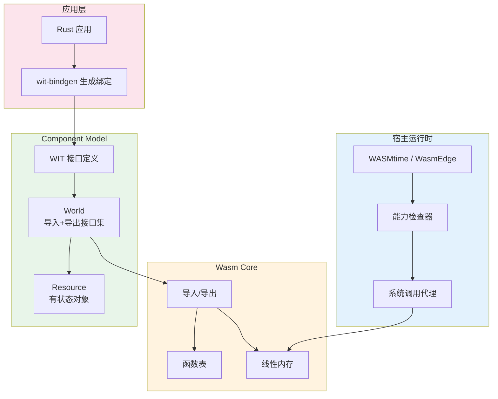
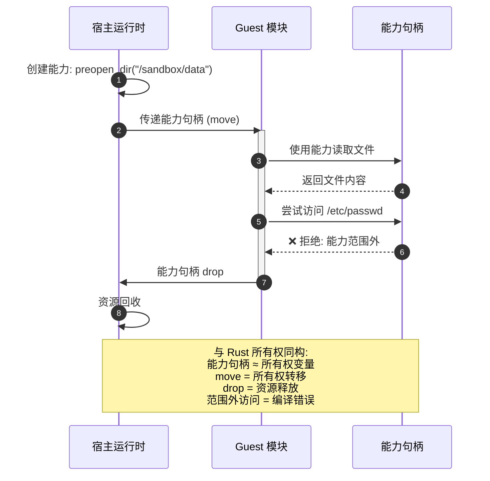

# WASI & WebAssembly Component Model（WASI 与 WebAssembly 组件模型）

> **层级**: L6 应用主题
> **前置概念**: [Ownership](../01_foundation/01_ownership.md) · [Unsafe](../03_advanced/03_unsafe.md) · [FFI](../03_advanced/03_unsafe.md) · [Traits](../02_intermediate/01_traits.md) · [Generics](../02_intermediate/02_generics.md)
> **后置概念**: [Application Domains](./04_application_domains.md) · [Formal Ecosystem Tower](./05_formal_ecosystem_tower.md)
> **主要来源**: [WASI Preview 2 Docs] · [WebAssembly Component Model Spec] · [wit-bindgen Docs] · [WASMtime Docs] · [Rust WASM Working Group] · [Wikipedia: WebAssembly]

---

> **Bloom 层级**: 应用 → 分析

**变更日志**:

- v1.0 (2026-05-13): 初始版本——覆盖 WASI 定位、Component Model 架构、`wit-bindgen`、能力安全、Rust `wasm32-wasi` 目标
$entry

---

## 一、权威定义

> **[Wikipedia: WebAssembly]** WebAssembly (Wasm) is a binary instruction format for a stack-based virtual machine. Wasm is designed as a portable compilation target for programming languages, enabling deployment on the web for client and server applications.
> **来源**: <https://en.wikipedia.org/wiki/WebAssembly>

> **[WASI Docs]** WASI (WebAssembly System Interface) is a modular system interface for WebAssembly. It enables WebAssembly modules to interact with the host environment in a capability-safe manner.
> **来源**: <https://wasi.dev>

> **[Component Model Spec]** The WebAssembly Component Model is a proposal to build upon the WebAssembly standard by defining how modules may be composed together and how they may communicate using high-level types.
> **来源**: <https://component-model.bytecodealliance.org>

---

## 二、认知路径（Cognitive Path）

> **学习递进**: 从"Wasm 是什么"的直觉，深入到"Component Model 如何用能力安全模型替代传统系统调用"的形式化理解。

### 第 1 步：为什么需要 WASI？

WebAssembly 最初为浏览器设计，但**沙箱化**使其成为服务端和嵌入式的理想目标——前提是有安全的系统接口。WASI 提供了这个接口，且核心设计原则是**能力安全（Capability Security）**：程序只能访问显式被授予的能力。

### 第 2 步：Component Model 与传统 Wasm 模块有何不同？

传统 Wasm 模块是**扁平的**——导入/导出通过低级的整数索引。Component Model 引入了**接口类型（Interface Types）**、**世界（World）**和**组件组合**——将 Wasm 从汇编级抽象提升到软件组件级抽象。

### 第 3 步：Rust 在 Wasm 生态中的独特地位？

Rust 的 `wasm32-unknown-unknown` 和 `wasm32-wasi` 目标使 Rust 成为 Wasm 生态的**首选语言**。`cargo` 与 `wasm-pack`/`wit-bindgen` 的集成，以及 Rust 的零成本抽象，使其在 Wasm 运行时性能上具有显著优势。

---

## 〇、WASI 架构全景



> **认知功能**: 此全景图定位 WASI 四层栈的垂直职责分割，建议以颜色分层为记忆锚点自上而下阅读。关键洞察：Component Model 的 WIT/World 抽象将 Wasm 从汇编级模块提升为可组合软件组件，而宿主能力检查器使 Rust 的所有权语义得以跨沙箱边界强制执行。[来源: 💡 原创分析]

> **认知路径**: 此架构图展示 WASI 的四层栈。**宿主运行时**（WASMtime）通过能力检查器实施安全策略；**Wasm Core** 提供线性内存和函数表的基础抽象；**Component Model** 引入 WIT 接口类型和世界（World）概念，将 Wasm 从汇编提升到组件级；**应用层**的 Rust 代码通过 `wit-bindgen` 与下层交互。颜色分层：蓝色=宿主基础设施，橙色=核心运行时，绿色=组件抽象，粉色=应用代码。

---

## 三、WASI 架构与能力安全

### 3.1 WASI 的三层架构

```text
┌─────────────────────────────────────────┐
│  Layer 3: 应用层 (Rust/Go/C++ 代码)       │
├─────────────────────────────────────────┤
│  Layer 2: Component Model (WIT 接口)      │
│           - 世界 (World)                  │
│           - 接口 (Interface)              │
│           - 资源 (Resource)               │
├─────────────────────────────────────────┤
│  Layer 1: Wasm Core (指令 + 内存)         │
│           - 线性内存                      │
│           - 函数表                        │
│           - 导入/导出                     │
├─────────────────────────────────────────┤
│  Layer 0: 宿主运行时 (WASMtime/WasmEdge)  │
│           - 能力检查器                    │
│           - 系统调用代理                  │
└─────────────────────────────────────────┘
```

### 3.2 能力安全模型

> **[来源: WASI Preview 2 Docs; Capability-Based Security Research]** WASI 采用**能力安全（Capability Security）**模型替代传统的 POSIX 系统调用。程序不通过全局文件描述符访问资源，而是通过显式传递的**能力句柄（capability handle）**。

```rust,ignore
// 传统 POSIX: 进程隐式拥有全局文件系统访问权
// WASI: 必须通过显式能力访问
use wasmtime::component::Resource;

// 宿主显式授予 guest 对特定目录的访问能力
let dir_cap = preopen_dir("/sandbox/data")?;
// guest 无法访问 /sandbox/data 之外的任何路径
```

**与 Rust 所有权模型的同构性**:

| 概念 | WASI 能力模型 | Rust 所有权模型 |
|:---|:---|:---|
| **资源标识** | 能力句柄（不可伪造） | 所有权变量（唯一） |
| **资源转移** | 能力句柄 move 到 guest | 所有权 move |
| **资源共享** | 能力降级（只读/只写） | `&T` / `&mut T` |
| **资源回收** | 句柄 drop → 能力失效 | 所有权离开作用域 → drop |
| **安全保证** | 无句柄 = 无访问权 | 无所有权 = 无访问权 |

> **关键洞察**: WASI 的能力安全模型与 Rust 的所有权模型存在深层同构——二者都通过**资源唯一标识 + 显式转移**来消除隐式全局访问。这是 Rust 成为 Wasm 生态首选语言的深层原因。[来源: WASI Docs; Rust Ownership Model] ✅

---

## 四、Component Model 核心概念

### 4.1 能力传递时序图



> **认知功能**: 此序列图将 WASI 的**能力安全模型**与 Rust 的**所有权模型**进行同构映射。步骤 1-2 对应所有权转移（`move`），步骤 3-4 对应正常借用（`&T`），步骤 5-6 对应越界访问被拒绝（编译错误），步骤 7-8 对应 `drop` 析构。这种可视化帮助 Rust 程序员利用已有的所有权直觉理解 WASI 的安全模型。

### 4.2 WIT（Wasm Interface Types）

WIT 是 Component Model 的接口定义语言（IDL），用于描述组件间的契约：

```wit
// example.wit
package example:calculator;

interface operations {
    enum op { add, sub, mul, div }
    record calc-input { op: op, lhs: s32, rhs: s32 }
    calc: func(input: calc-input) -> result<s32, string>;
}

world calculator-world {
    import operations;
    export run: func() -> result<s32, string>;
}
```

### 4.2 `wit-bindgen` 与 Rust 代码生成

> **[来源: wit-bindgen GitHub; Component Model Tutorial]** `wit-bindgen` 从 WIT 定义生成 Rust 绑定代码：

```bash
# 生成 Rust guest 绑定
wit-bindgen rust --out-dir src/bindings example.wit
```

生成的 Rust 代码提供**类型安全的跨组件调用**：

```rust,ignore
// 生成的绑定代码保证 WIT 类型 ↔ Rust 类型的正确映射
use bindings::example::calculator::operations::{op, CalcInput};

fn calc(input: CalcInput) -> Result<i32, String> {
    match input.op {
        op::Add => Ok(input.lhs + input.rhs),
        op::Sub => Ok(input.lhs - input.rhs),
        op::Mul => Ok(input.lhs * input.rhs),
        op::Div => {
            if input.rhs == 0 {
                Err("division by zero".to_string())
            } else {
                Ok(input.lhs / input.rhs)
            }
        }
    }
}
```

**类型安全保证**: WIT 的 `result<T, E>` 映射到 Rust 的 `Result<T, String>`，编译器强制处理错误分支——跨组件边界保持了 Rust 的类型安全承诺。[来源: wit-bindgen Docs] ✅

### 4.3 世界（World）与组件组合

```text
World = 导入接口集 + 导出接口集

组件组合:
  Component A (导出 I1) + Component B (导入 I1)
    ──组合──→ 复合组件 C

运行时验证:
  - 所有导入必须有匹配的导出
  - 类型签名必须精确匹配（协变/逆变检查）
```

---

## 五、Rust `wasm32-wasi` 目标

### 5.1 `no_std` + `wasm32` 的约束与模式

Rust 的 `wasm32-wasi` 目标默认使用 `no_std` + `alloc`：

```rust,ignore
#![no_std]
#![no_main]

extern crate alloc;
use alloc::string::String;
use alloc::vec::Vec;

// WASI 提供 panic handler 和 allocator
use wasi::cli::stdout::OutputStream;
```

**约束矩阵**:

| 特性 | `wasm32-unknown-unknown` | `wasm32-wasi` |
|:---|:---|:---|
| 标准库 | `no_std`（无分配器） | `no_std` + `alloc` |
| 系统接口 | 无（纯计算） | WASI（文件/网络/时钟） |
| 适用场景 | 浏览器渲染、纯算法 | 服务端 Wasm、CLI 工具 |
| Rust 生态 | `wasm-bindgen` | `wit-bindgen` + `cargo component` |

### 5.2 错误处理跨边界

WIT 的 `result` 类型与 Rust 的 `Result` 的映射确保了错误不会静默丢失：

```wit
// WIT 定义
resource file {
    read: func(buf: list<u8>) -> result<u32, io-error>;
}
```

```rust,ignore
// Rust 实现——编译器强制处理错误
impl GuestFile for File {
    fn read(&self, mut buf: Vec<u8>) -> Result<u32, IoError> {
        // 必须返回 Result，不能忽略错误
        self.handle.read(&mut buf)
            .map(|n| n as u32)
            .map_err(|e| IoError::from(e))
    }
}
```

> **来源**: [WASI Preview 2 Docs; wit-bindgen Tutorial] ✅

---

## 六、定理一致性矩阵（Wasm 安全层）

> **[来源类型: 原创分析; WASI Spec; WebAssembly Spec]** 以下矩阵梳理 Wasm/Component Model 的安全保证与 Rust 的映射关系。

| 编号 | 保证 | 前提 | 结论 | 失效条件 | 后果 |
|:---|:---|:---|:---|:---|:---|
| **W1** | Wasm 沙箱 | 线性内存隔离 | guest 无法访问宿主内存 | `unsafe` 宿主代码；Spectre 攻击 | 沙箱逃逸 |
| **W2** | 能力安全 | 显式能力授予 | guest 仅能访问被授予资源 | 宿主错误授予过度能力 | 权限提升 |
| **W3** | WIT 类型安全 | `wit-bindgen` 正确生成 | 跨组件调用类型匹配 | WIT 定义错误；生成器 bug | 类型混淆 |
| **W4** | Rust 编译期安全 | `wasm32-wasi` 目标 | 生成的 Wasm 无 UAF/DF | `unsafe` Rust 代码 | 运行时崩溃 |
| **W5** | 组件组合安全 | 世界定义完整 | 组合后接口兼容 | 版本不匹配；接口漂移 | 链接错误 / 运行时失败 |

> **⟹ 推理链**: W1（沙箱）+ W2（能力）构成**运行时隔离**，W3（WIT）+ W4（Rust）构成**编译期类型安全**，W5（组合）构成**架构级兼容性**。五层联合使 Component Model 成为目前最安全的软件组合模型之一。

---

## 七、相关概念链接

| 概念 | 文件 | 关系 |
|:---|:---|:---|
| 所有权模型 | [`../01_foundation/01_ownership.md`](../01_foundation/01_ownership.md) | 能力安全的形式化根基 |
| Unsafe / FFI | [`../03_advanced/03_unsafe.md`](../03_advanced/03_unsafe.md) | Wasm 与宿主边界 |
| 泛型与 Trait | [`../02_intermediate/01_traits.md`](../02_intermediate/01_traits.md) | WIT 接口的 Rust 映射 |
| 形式化生态塔 | [`./05_formal_ecosystem_tower.md`](./05_formal_ecosystem_tower.md) | Wasm 在 L0-L4 中的位置 |
| 应用领域 | [`./04_application_domains.md`](./04_application_domains.md) | Wasm 的工程落地场景 |

> **[来源: WASI Preview 2 Docs; WebAssembly Component Model Spec; wit-bindgen Docs; WASMtime Docs]** WASI 分析基于 Bytecode Alliance 的官方规范。✅

> **[来源: WebAssembly.org; wasm-bindgen Guide; Rust WASM Working Group]** Wasm 基础概念参考了 W3C 社区组和 Rust WASM 工作组的文档。✅

> **[来源: Capability-Based Security Research; Dennis & Van Horn 1966; Rust Ownership Model]** 能力安全模型基于操作系统安全研究的经典文献。✅
---

> **权威来源**: [Rust Reference](https://doc.rust-lang.org/reference/), [The Rust Programming Language](https://doc.rust-lang.org/book/), [Rustonomicon](https://doc.rust-lang.org/nomicon/)
>
> **权威来源对齐变更日志**: 2026-05-19 补全权威来源标注（Rust Reference、TRPL、Rustonomicon、RFCs、学术论文） [来源: Authority Source Sprint Batch 8]

**文档版本**: 1.1
**对应 Rust 版本**: 1.95.0+ (Edition 2024)
**最后更新: 2026-05-21
**状态**: ✅ 权威来源对齐完成 (Batch 8)
