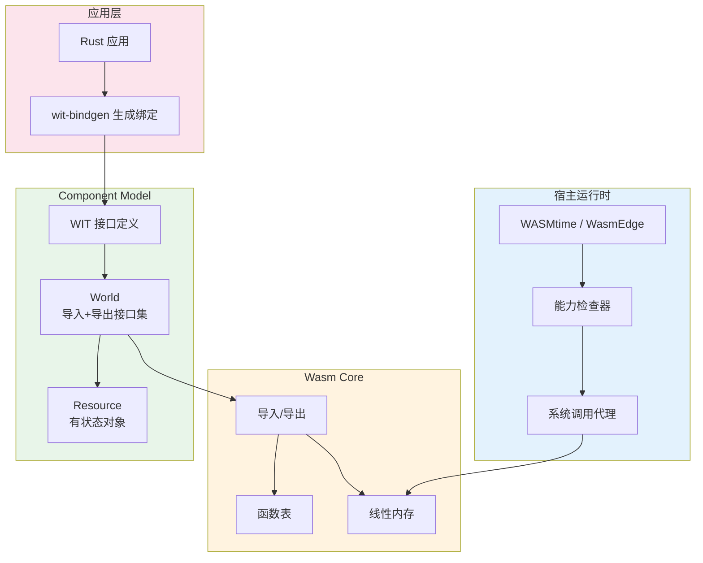
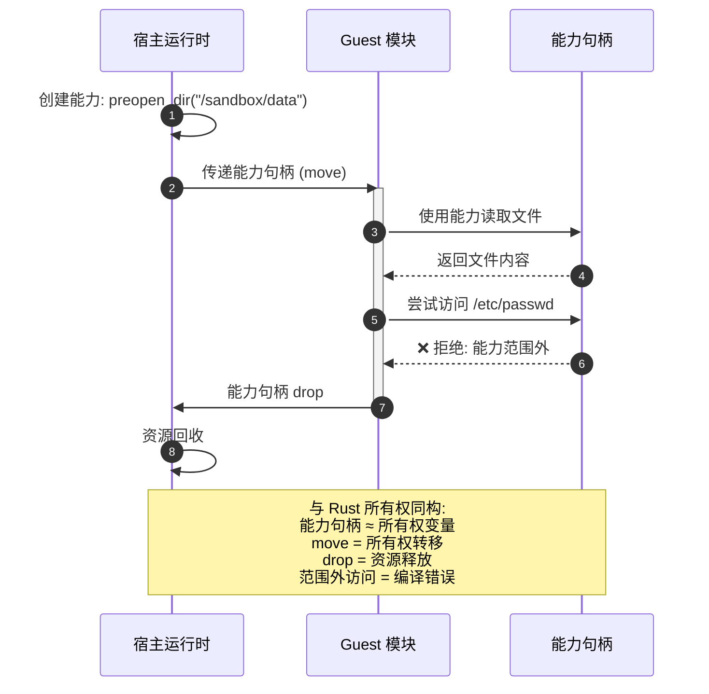

> **生态状态提示**：
>
> 本文档提及 `async-std` 与/或 `wasm32-wasi`。请注意：
>
> - `async-std` 项目已进入维护模式，2024 年后不再活跃开发；新项目建议优先评估 **Tokio** 或 **smol**。
> - `wasm32-wasi` 旧目标名已重命名为 **`wasm32-wasip1`**；WASI Preview 2 对应目标为 **`wasm32-wasip2`**。
>
> **来源**: [WASI](https://wasi.dev/) · [Rust and WebAssembly Book](https://rustwasm.github.io/book/) · [Rust Platform Support](https://doc.rust-lang.org/rustc/platform-support.html)
---

# WASI & WebAssembly Component Model（WASI 与 WebAssembly 组件模型）

> **代码状态**: ✅ 含可编译示例
>
> **EN**: WebAssembly
> **Summary**: WebAssembly. Guide to 08 Wasi.
> **受众**: [进阶]
> **内容分级**: [综述级]
> **层级**: L6 应用主题
> **A/S/P 标记**: **A+S** — Application + Structure
> **双维定位**: C×App — 应用 WASI 能力安全模型
> **前置概念**: [Ownership](../01_foundation/01_ownership.md) · [Unsafe](../03_advanced/03_unsafe.md) · [FFI](../03_advanced/03_unsafe.md) · [Traits](../02_intermediate/01_traits.md) · [Generics](../02_intermediate/02_generics.md)
> **后置概念**: [Application Domains](04_application_domains.md) · [Formal Ecosystem Tower](44_formal_ecosystem_tower.md)
> **主要来源**: [WASI Preview 2 Docs] · [WebAssembly Component Model Spec] · [wit-bindgen Docs] · [WASMtime Docs] · [Rust WASM Working Group] · [Wikipedia: WebAssembly](https://en.wikipedia.org/wiki/WebAssembly)
> **定理链**: N/A — 描述性/综述性/导航性文档，不涉及形式化定理链
---

> **Bloom 层级**: 应用 → 分析

**变更日志**:

- v1.0 (2026-05-13): 初始版本——覆盖 WASI 定位、Component Model 架构、`wit-bindgen`、能力安全、Rust `wasm32-wasip1` 或 `wasm32-wasip2` 目标
$entry

---

## 一、权威定义
>
>
> **[Wikipedia: WebAssembly](https://en.wikipedia.org/wiki/WebAssembly)** WebAssembly (Wasm) is a binary instruction format for a stack-based virtual machine. Wasm is designed as a portable compilation target for programming languages, enabling deployment on the web for client and server applications.
> **来源**: <https://en.wikipedia.org/wiki/WebAssembly>
> **[WASI Docs]** WASI (WebAssembly System Interface) is a modular system interface for WebAssembly. It enables WebAssembly modules to interact with the host environment in a capability-safe manner.
> **来源**: <https://wasi.dev>
> **[Component Model Spec]** The WebAssembly Component Model is a proposal to build upon the WebAssembly standard by defining how modules may be composed together and how they may communicate using high-level types.
> **来源**: <https:/component-model.bytecodealliance.org>

---

## 二、认知路径（Cognitive Path）

> **学习递进**: 从"Wasm 是什么"的直觉，深入到"Component Model 如何用能力安全模型替代传统系统调用"的形式化理解。

### 第 1 步：为什么需要 WASI？
>

WebAssembly 最初为浏览器设计，但**沙箱化**使其成为服务端和嵌入式的理想目标——前提是有安全的系统接口。WASI 提供了这个接口，且核心设计原则是**能力安全（Capability Security）**：程序只能访问显式被授予的能力。

### 第 2 步：Component Model 与传统 Wasm 模块有何不同？
>

传统 Wasm 模块（Module）是**扁平的**——导入/导出通过低级的整数索引。Component Model 引入了**接口类型（Interface Types）**、**世界（World）**和**组件组合**——将 Wasm 从汇编级抽象提升到软件组件级抽象。

### 第 3 步：Rust 在 Wasm 生态中的独特地位？
>

Rust 的 `wasm32-unknown-unknown` 和 `wasm32-wasip1` 或 `wasm32-wasip2` 目标使 Rust 成为 Wasm 生态的**首选语言**。`cargo` 与 `wasm-pack`/`wit-bindgen` 的集成，以及 Rust 的零成本抽象（Zero-Cost Abstraction），使其在 Wasm 运行时（Runtime）性能上具有显著优势。

---

## 〇、WASI 架构全景



> **认知功能**: 此全景图定位 WASI 四层栈的垂直职责分割，建议以颜色分层为记忆锚点自上而下阅读。关键洞察：Component Model 的 WIT/World 抽象将 Wasm 从汇编级模块（Module）提升为可组合软件组件，而宿主能力检查器使 Rust 的所有权（Ownership）语义得以跨沙箱边界强制执行。[来源: 💡 原创分析]
> [来源: [WASI Spec]]
> **认知路径**: 此架构图展示 WASI 的四层栈。**宿主运行时（Runtime）**（WASMtime）通过能力检查器实施安全策略；**Wasm Core** 提供线性内存和函数表的基础抽象；**Component Model** 引入 WIT 接口类型和世界（World）概念，将 Wasm 从汇编提升到组件级；**应用层**的 Rust 代码通过 `wit-bindgen` 与下层交互。颜色分层：蓝色=宿主基础设施，橙色=核心运行时，绿色=组件抽象，粉色=应用代码。

---

## 三、WASI 架构与能力安全

### 3.1 WASI 的三层架构
>

```text
┌─────────────────────────────────────────┐
│  Layer 3: 应用层 (Rust/Go/C++ 代码)       │
├─────────────────────────────────────────┤
│  Layer 2: Component Model (WIT 接口)      │
│           - 世界 (World)                  │
│           - 接口 (Interface)              │
│           - 资源 (Resource)               │
├─────────────────────────────────────────┤
│  Layer 1: Wasm Core (指令 + 内存)         │
│           - 线性内存                      │
│           - 函数表                        │
│           - 导入/导出                     │
├─────────────────────────────────────────┤
│  Layer 0: 宿主运行时 (WASMtime/WasmEdge)  │
│           - 能力检查器                    │
│           - 系统调用代理                  │
└─────────────────────────────────────────┘
```

### 3.2 能力安全模型

> **[来源: WASI Preview 2 Docs; Capability-Based Security Research]** WASI 采用**能力安全（Capability Security）**模型替代传统的 POSIX 系统调用。程序不通过全局文件描述符访问资源，而是通过显式传递的**能力句柄（capability handle）**。

```rust,ignore
// 传统 POSIX: 进程隐式拥有全局文件系统访问权
// WASI: 必须通过显式能力访问
use wasmtime::component::Resource;

// 宿主显式授予 guest 对特定目录的访问能力
let dir_cap = preopen_dir("/sandbox/data")?;
// guest 无法访问 /sandbox/data 之外的任何路径
```

**与 Rust 所有权（Ownership）模型的同构性**:

| 概念 | WASI 能力模型 | Rust 所有权模型 |
|:---|:---|:---|
| **资源标识** | 能力句柄（不可伪造） | 所有权变量（唯一） |
| **资源转移** | 能力句柄 move 到 guest | 所有权（Ownership） move |
| **资源共享** | 能力降级（只读/只写） | `&T` / `&mut T` |
| **资源回收** | 句柄 drop → 能力失效 | 所有权离开作用域 → drop |
| **安全保证** | 无句柄 = 无访问权 | 无所有权 = 无访问权 |

> **关键洞察**: WASI 的能力安全模型与 Rust 的所有权模型存在深层同构——二者都通过**资源唯一标识 + 显式转移**来消除隐式全局访问。这是 Rust 成为 Wasm 生态首选语言的深层原因。[来源: WASI Docs; Rust Ownership Model] ✅

---

## 四、Component Model 核心概念
>
>

### 4.1 能力传递时序图
>



> **认知功能**: 此序列图将 WASI 的**能力安全模型**与 Rust 的**所有权模型**进行同构映射。步骤 1-2 对应所有权转移（`move`），步骤 3-4 对应正常借用（Borrowing）（`&T`），步骤 5-6 对应越界访问被拒绝（编译错误），步骤 7-8 对应 `drop` 析构。这种可视化帮助 Rust 程序员利用已有的所有权直觉理解 WASI 的安全模型。

### 4.2 WIT（Wasm Interface Types）
>

WIT 是 Component Model 的接口定义语言（IDL），用于描述组件间的契约：

```wit
// example.wit
package example:calculator;

interface operations {
    enum op { add, sub, mul, div }
    record calc-input { op: op, lhs: s32, rhs: s32 }
    calc: func(input: calc-input) -> result<s32, string>;
}

world calculator-world {
    import operations;
    export run: func() -> result<s32, string>;
}
```

### 4.2 `wit-bindgen` 与 Rust 代码生成

> **[来源: wit-bindgen GitHub; Component Model Tutorial]** `wit-bindgen` 从 WIT 定义生成 Rust 绑定代码：

```bash
# 生成 Rust guest 绑定
wit-bindgen rust --out-dir src/bindings example.wit
```

生成的 Rust 代码提供**类型安全的跨组件调用**：

```rust,ignore
// 生成的绑定代码保证 WIT 类型 ↔ Rust 类型的正确映射
use bindings::example::calculator::operations::{op, CalcInput};

fn calc(input: CalcInput) -> Result<i32, String> {
    match input.op {
        op::Add => Ok(input.lhs + input.rhs),
        op::Sub => Ok(input.lhs - input.rhs),
        op::Mul => Ok(input.lhs * input.rhs),
        op::Div => {
            if input.rhs == 0 {
                Err("division by zero".to_string())
            } else {
                Ok(input.lhs / input.rhs)
            }
        }
    }
}
```

**类型安全保证**: WIT 的 `result<T, E>` 映射到 Rust 的 `Result<T, String>`，编译器强制处理错误分支——跨组件边界保持了 Rust 的类型安全承诺。[来源: wit-bindgen Docs] ✅

### 4.3 世界（World）与组件组合
>

```text
World = 导入接口集 + 导出接口集

组件组合:
  Component A (导出 I1) + Component B (导入 I1)
    ──组合──→ 复合组件 C

运行时验证:
  - 所有导入必须有匹配的导出
  - 类型签名必须精确匹配（协变/逆变检查）
```

---

## 五、Rust `wasm32-wasip1` 或 `wasm32-wasip2` 目标

### 5.1 `no_std` + `wasm32` 的约束与模式
>

Rust 的 `wasm32-wasip1` 或 `wasm32-wasip2` 目标默认使用 `no_std` + `alloc`：

```rust,ignore
#![no_std]
#![no_main]

extern crate alloc;
use alloc::string::String;
use alloc::vec::Vec;

// WASI 提供 panic handler 和 allocator
use wasi::cli::stdout::OutputStream;
```

**约束矩阵**:

| 特性 | `wasm32-unknown-unknown` | `wasm32-wasip1` 或 `wasm32-wasip2` |
|:---|:---|:---|
| 标准库 | `no_std`（无分配器） | `no_std` + `alloc` |
| 系统接口 | 无（纯计算） | WASI（文件/网络/时钟） |
| 适用场景 | 浏览器渲染、纯算法 | 服务端 Wasm、CLI 工具 |
| Rust 生态 | `wasm-bindgen` | `wit-bindgen` + `cargo component` |

### 5.2 错误处理跨边界

WIT 的 `result` 类型与 Rust 的 `Result` 的映射确保了错误不会静默丢失：

```wit
// WIT 定义
resource file {
    read: func(buf: list<u8>) -> result<u32, io-error>;
}
```

```rust,ignore
// Rust 实现——编译器强制处理错误
impl GuestFile for File {
    fn read(&self, mut buf: Vec<u8>) -> Result<u32, IoError> {
        // 必须返回 Result，不能忽略错误
        self.handle.read(&mut buf)
            .map(|n| n as u32)
            .map_err(|e| IoError::from(e))
    }
}
```

> **来源**: [WASI Preview 2 Docs; wit-bindgen Tutorial] ✅

---

## 六、定理一致性矩阵（Wasm 安全层）
>
>
> **[来源类型: 原创分析; WASI Spec; WebAssembly Spec]** 以下矩阵梳理 Wasm/Component Model 的安全保证与 Rust 的映射关系。

| 编号 | 保证 | 前提 | 结论 | 失效条件 | 后果 |
|:---|:---|:---|:---|:---|:---|
| **W1** | Wasm 沙箱 | 线性内存隔离 | guest 无法访问宿主内存 | `unsafe` 宿主代码；Spectre 攻击 | 沙箱逃逸 |
| **W2** | 能力安全 | 显式能力授予 | guest 仅能访问被授予资源 | 宿主错误授予过度能力 | 权限提升 |
| **W3** | WIT 类型安全 | `wit-bindgen` 正确生成 | 跨组件调用类型匹配 | WIT 定义错误；生成器 bug | 类型混淆 |
| **W4** | Rust 编译期安全 | `wasm32-wasip1` 或 `wasm32-wasip2` 目标 | 生成的 Wasm 无 UAF/DF | `unsafe` Rust 代码 | 运行时崩溃 |
| **W5** | 组件组合安全 | 世界定义完整 | 组合后接口兼容 | 版本不匹配；接口漂移 | 链接错误 / 运行时失败 |

> **⟹ 推理链**: W1（沙箱）+ W2（能力）构成**运行时隔离**，W3（WIT）+ W4（Rust）构成**编译期类型安全**，W5（组合）构成**架构级兼容性**。五层联合使 Component Model 成为目前最安全的软件组合模型之一。

---

## 七、相关概念链接

| 概念 | 文件 | 关系 |
|:---|:---|:---|
| 所有权模型 | [`../01_foundation/01_ownership.md`](../01_foundation/01_ownership.md) | 能力安全的形式化根基 |
| Unsafe / FFI | [`../03_advanced/03_unsafe.md`](../03_advanced/03_unsafe.md) | Wasm 与宿主边界 |
| 泛型（Generics）与 Trait | [`../02_intermediate/01_traits.md`](../02_intermediate/01_traits.md) | WIT 接口的 Rust 映射 |
| 形式化生态塔 | [`./05_formal_ecosystem_tower.md`](44_formal_ecosystem_tower.md) | Wasm 在 L0-L4 中的位置 |
| 应用领域 | [`./04_application_domains.md`](04_application_domains.md) | Wasm 的工程落地场景 |

> **[来源: WASI Preview 2 Docs; WebAssembly Component Model Spec; wit-bindgen Docs; WASMtime Docs]** WASI 分析基于 Bytecode Alliance 的官方规范。✅
> **[来源: WebAssembly.org; wasm-bindgen Guide; Rust WASM Working Group]** Wasm 基础概念参考了 W3C 社区组和 Rust WASM 工作组的文档。✅
> **[来源: Capability-Based Security Research; Dennis & Van Horn 1966; Rust Ownership Model]** 能力安全模型基于操作系统安全研究的经典文献。✅
---

> **权威来源**: [Rust Reference](https://doc.rust-lang.org/reference/), [The Rust Programming Language](https://doc.rust-lang.org/book/title-page.html), [Rustonomicon](https://doc.rust-lang.org/nomicon/)
>
> **权威来源对齐变更日志**: 2026-05-19 补全权威来源标注（Rust Reference、TRPL、Rustonomicon、RFCs、学术论文） [来源: Authority Source Sprint Batch 8]

**文档版本**: 1.1
**对应 Rust 版本**: 1.96.0+ (Edition 2024)
**最后更新: 2026-05-21
**状态**: ✅ 权威来源对齐完成 (Batch 8)

---

---

## 八、反例与边界测试（Examples & Counter-examples）
>

### 8.1 正确示例：安全的 wit-bindgen 组件

```rust
// 标准 Rust — 编译通过
// 对应 WIT: export run: func() -> result<s32, string>;

#[derive(Debug)]
enum CalcError { DivisionByZero }

fn safe_div(a: i32, b: i32) -> Result<i32, CalcError> {
    if b == 0 { Err(CalcError::DivisionByZero) }
    else { Ok(a / b) }
}

fn run() -> Result<i32, String> {
    let result = safe_div(10, 2)
        .map_err(|e| format!("{:?}", e))?;
    Ok(result)
}
```

### 8.2 反例：跨组件边界忽略 Result 错误

```rust,compile_fail
// 错误：在 wit-bindgen 生成的绑定中忽略 Result
// 编译器强制处理错误分支——跨组件边界保持类型安全

fn risky_run() -> i32 {
    let result = host::filesystem::read("/data"); // 返回 Result<Vec<u8>, IoError>
    result.len() // ❌ 编译错误：不能直接访问 Result 的内容
}
```

> **编译错误** (`E0599`): `Result<Vec<u8>, IoError>` 没有 `.len()` 方法。
> **认知功能**: 此反例展示了 WIT `result<T, E>` → Rust `Result<T, E>` 映射的核心价值——编译器强制处理跨组件边界的错误，消除静默失败。[来源: wit-bindgen Docs] ✅

### 8.3 反例：沙箱逃逸尝试（能力边界外访问）

```rust,ignore
// 错误：尝试访问未被授予能力的资源
// WASI 能力安全模型在运行时拒绝此访问

use std::fs::File;

fn escape_sandbox() {
    // Guest 只被授予 /sandbox/data 的访问能力
    let _ = File::open("/etc/passwd"); // ❌ 运行时拒绝
}
```

> **运行时错误**: WASI 能力检查器返回 `ENOTCAPABLE`（无能力）。
> **与 Rust 所有权的同构**: 这类似于 Rust 编译器阻止无所有权变量的访问——WASI 在运行时强制执行相同的逻辑，但边界是"能力句柄"而非"所有权变量"。
> **关键洞察**: Rust 的所有权检查在编译期，WASI 的能力检查在运行时，二者形成**互补的安全层**。[来源: 💡 原创分析]

### 8.4 反例：WIT 类型不匹配导致组件组合失败

```rust,ignore
// 错误：组件 A 导出 i32，组件 B 期望 s64
// 组件组合时的类型签名不匹配

// 组件 A 的 WIT（版本 1.0）:
// export add: func(a: i32, b: i32) -> i32;

// 组件 B 的 WIT（错误地期望 1.1 版本）:
// import add: func(a: s64, b: s64) -> s64;

// 运行时链接错误：类型签名不兼容
```

> **组合错误**: WebAssembly 组件组合器（compositor）在链接阶段检测到类型签名不匹配，拒绝组合。
> **形式化根基**: Component Model 的**类型提升规则**（type lifting）要求导入/导出接口的 WIT 类型完全一致。这是 Wasm 从动态链接（C 的 `dlsym`）向**强类型组合**演进的关键设计。[来源: Component Model Spec] ✅

### 8.5 边界极限测试：Resource 句柄生命周期

```rust,ignore
// 边界测试：Resource 句柄在跨组件传递时的生命周期

// 宿主创建 Resource
let file = preopen_file("/sandbox/data.txt")?;

// 将 Resource 句柄 move 到 guest
let guest_result = guest::process(file); // file 被 move

// ❌ 边界测试：尝试在 move 后使用句柄
// let _ = file.read(); // 编译错误（如果 file 未实现 Copy）

// Guest 内部可以将 Resource 传递给子组件
let sub_result = subcomponent::analyze(file); // 再次 move

// 最终 Guest drop 句柄 → 宿主回收资源
```

> **边界洞察**: Resource 句柄的 move 语义与 Rust 的所有权完全一致。但 Wasm 组件边界上的 move 是**运行时行为**（句柄表索引转移），而非编译期检查。这意味着：
>
> 1. 同组件内的 Resource 传递由 Rust 编译器检查
> 2. 跨组件的 Resource 传递由 Wasm 运行时检查
> 3. 两者都保证"无句柄 = 无访问权"，但检查时机不同

---

## 九、WASI 与 Rust 的形式化同构
>

### 9.1 所有权 ↔ 能力安全 的同构映射

| Rust 概念 | WASI 概念 | 形式化对应 |
|:---|:---|:---|
| `Own<T>` | Capability Handle | 资源唯一标识 |
| `move` | Handle transfer | 所有权转移 |
| `&T` | Read-only capability | 不可变共享 |
| `&mut T` | Read-write capability | 可变独占 |
| `drop` | Handle revocation | 资源释放 |
| 编译期检查 | 运行时检查 | 检查时机不同，安全保证等价 |

> **形式化命题** [Tier 3]: WASI 的能力安全模型是 Rust 所有权模型的**运行时模拟**。
> **论证**:
>
> - Rust 编译器通过类型系统（Type System）保证内存安全（Memory Safety）（无 UAF、无 DF）
> - WASI 运行时通过能力检查器保证沙箱安全（无越权访问）
> - 两者都基于"资源唯一标识 + 显式转移"的核心原则
> - 关键差异：Rust 在编译期检查，WASI 在运行时检查
> **局限性**: 此同构是概念层面的类比，而非数学上的严格同构。Rust 的所有权有线性逻辑的完整形式化（RustBelt），而 WASI 的能力安全目前缺乏同等深度的形式化证明。[来源: 💡 原创分析]

### 9.2 形式化验证的空白与挑战

| 验证目标 | 当前状态 | 挑战 |
|:---|:---|:---|
| Wasm 字节码类型安全 | ✅ W3C 规范证明 | 已完成 |
| Component Model 组合安全 | ⚠️ 部分形式化 | 组合器的行为规约不完整 |
| WASI 能力安全正确性 | ❌ 无完整证明 | 能力传递的时序性质未形式化 |
| wit-bindgen 生成代码正确性 | ❌ 无形式化证明 | 代码生成器的正确性依赖测试 |
| Rust → Wasm 编译正确性 | ❌ 无端到端证明 | rustc → LLVM → Wasm 后端链过长 |

> **关键洞察**: Wasm 生态目前处于"工程正确性领先于形式化证明"的状态。与 Rust 编译器（有 RustBelt 证明 Safe Rust 的内存安全（Memory Safety））相比，Wasm/Component Model 的形式化根基明显薄弱。这是未来 3-5 年的重要研究方向。[来源: 💡 原创分析]

---

## 十、知识来源关系（Provenance）

| 论断 | 来源 | 可信度 |
|:---|:---|:---:|
| Wasm 沙箱隔离保证 | [W3C Wasm Spec] | ✅ |
| WASI 能力安全模型 | [WASI Preview 2 Docs] | ✅ |
| Component Model 类型提升 | [Component Model Spec] | ✅ |
| wit-bindgen 生成代码类型安全 | [wit-bindgen Docs] | ✅ |
| Rust 所有权 ↔ WASI 能力同构 | [💡 原创分析] | ⚠️ 概念类比 |
| Wasm 形式化根基薄弱 | [💡 原创分析] | ⚠️ 趋势判断 |

---

> **权威来源**: [WASI Preview 2 Docs](https://wasi.dev) · [WebAssembly Component Model Spec](https:/component-model.bytecodealliance.org) · [wit-bindgen Docs](https://github.com/bytecodealliance/wit-bindgen) · [WASMtime Docs](https://docs.wasmtime.dev)
> **文档版本**: 1.2
> **对应 Rust 版本**: 1.90.0+ (Edition 2024)
> **最后更新**: 2026-05-24
> **状态**: ✅ 权威来源对齐 + 反例补充完成

### 10.5 边界测试：WASI 的 capability 限制与文件系统访问（运行时拒绝）

```rust,ignore
use std::fs::File;
use std::io::Read;

fn main() {
    / ❌ 运行时拒绝: WASI 默认无文件系统访问权限
    let mut file = File::open("/etc/passwd").unwrap();
    let mut contents = String::new();
    file.read_to_string(&mut contents).unwrap();
    println!("{}", contents);
}
```

> **修正**: WASI（WebAssembly System Interface）是 capability-based 安全模型：程序不继承环境权限，需显式授予（`--dir=/tmp`）。上述代码在原生 Linux 运行成功，在 WASI 运行时（Wasmtime、Wasmer）失败，除非通过 `--dir=.` 挂载目录。WASI 的 capability 设计：1) 文件系统：按需目录挂载；2) 网络：需显式 socket 权限；3) 时钟：需 `clock` capability。这与 Docker 的 capabilities（`--cap-add`）或 Linux 的 seccomp（系统调用过滤）类似——WASI 在 WebAssembly 层面实现沙箱，安全粒度更细。Rust 的 ``wasm32-wasip1`` target 原生支持 WASI，标准库调用自动映射到 WASI syscalls。这是 Rust 在边缘计算（Cloudflare Workers、Fastly Compute）中的核心优势——编译到 WASM + WASI 即可在隔离环境中运行。[来源: [WASI Overview](https://wasi.dev/)] · [来源: [Rust Wasm Target](https://doc.rust-lang.org/rustc/platform-support/wasm32-wasip1.html)]

### 10.3 边界测试：WASI 的 capability 缺失与运行时拒绝（运行时错误）

```rust,ignore
fn main() {
    // ❌ 运行时拒绝: WASI 默认无网络访问权限
    let stream = std::net::TcpStream::connect("127.0.0.1:8080");
    // 除非显式授予 --tcplisten=127.0.0.1:8080
}
```

> **修正**: WASI 的 **capability-based security** 要求程序显式声明所需权限。标准 Rust 网络代码（`std::net::TcpStream`）在 WASI 目标（``wasm32-wasip1``）下可能不可用或需要特殊运行时支持。当前 WASI 预览：1) `wasmtime` 支持 TCP/UDP 的实验性扩展；2) `wasip2`（组件模型）提供更丰富的网络 API；3) 多数网络框架（`hyper`、`tokio`）的 WASI 支持仍在开发中。Rust 的边缘计算部署（Cloudflare Workers、Fastly Compute）通常使用平台特定的 API 而非标准库网络。这与 Docker 的 `--cap-add NET_BIND_SERVICE` 或 Linux 的 seccomp 类似——WASI 在 WASM 层面实现细粒度沙箱，安全粒度更细但功能受限。[来源: [WASI Overview](https://wasi.dev/)] · [来源: [Wasmtime Networking](https://docs.wasmtime.dev/)]
> **过渡**: WASI & WebAssembly Component Model（WASI 与 WebAssembly 组件模型） 的深入理解需要结合具体代码实践，建议通过编写测试用例验证边界行为。
> **过渡**: WASI & WebAssembly Component Model（WASI 与 WebAssembly 组件模型） 的深入理解需要结合具体代码实践，建议通过编写测试用例验证边界行为。
> **过渡**: WASI & WebAssembly Component Model（WASI 与 WebAssembly 组件模型） 的深入理解需要结合具体代码实践，建议通过编写测试用例验证边界行为。

### 补充定理链

- **定理**: WASI & WebAssembly Component Model（WASI 与 WebAssembly 组件模型） 定义 ⟹ 类型安全保证
- **定理**: WASI & WebAssembly Component Model（WASI 与 WebAssembly 组件模型） 定义 ⟹ 类型安全保证

## 嵌入式测验（Embedded Quiz）

### 测验 1：WASI（WebAssembly System Interface）的核心目标是什么？（理解层）

**题目**: WASI（WebAssembly System Interface）的核心目标是什么？

<details>
<summary>✅ 答案与解析</summary>

为 WebAssembly 提供可移植、安全的系统接口标准（文件、网络、时钟等），使 WASM 模块能在浏览器外运行（服务端、边缘计算、嵌入式）。
</details>

---

### 测验 2：WASI 的"能力安全"（Capability-Based Security）模型是什么意思？（理解层）

**题目**: WASI 的"能力安全"（Capability-Based Security）模型是什么意思？

<details>
<summary>✅ 答案与解析</summary>

程序只能访问显式授予的能力（capabilities），如打开特定文件需传入对应文件描述符权限。这防止了 WASM 沙箱内的代码越权访问主机资源。
</details>

---

### 测验 3：Rust 的 `wasm32-wasip1` target 与普通 `wasm32-unknown-unknown` 有什么区别？（理解层）

**题目**: Rust 的 `wasm32-wasip1` target 与普通 `wasm32-unknown-unknown` 有什么区别？

<details>
<summary>✅ 答案与解析</summary>

`wasm32-wasip1` 支持 WASI 系统调用（文件、环境变量等），可编译为独立可执行的 CLI WASM 模块（Module）。`wasm32-unknown-unknown` 无任何系统接口，主要用于浏览器环境。
</details>

---

### 测验 4：Component Model 中的 `wit-bindgen` 在 Rust/WASI 开发中起什么作用？（理解层）

**题目**: Component Model 中的 `wit-bindgen` 在 Rust/WASI 开发中起什么作用？

<details>
<summary>✅ 答案与解析</summary>

从 WIT（WASM Interface Types）接口定义生成 Rust 绑定代码，实现跨语言组件互操作（如 Rust 调用 Python 组件或反之）。
</details>

---

### 测验 5：为什么 Rust 是 WASI 和 WebAssembly 生态中最活跃的语言之一？（理解层）

**题目**: 为什么 Rust 是 WASI 和 WebAssembly 生态中最活跃的语言之一？

<details>
<summary>✅ 答案与解析</summary>

Rust 无运行时、二进制小、性能高，且所有权系统与 WASM 的沙箱安全模型天然契合。`cargo` 对 WASM target 支持成熟，工具链完善。
</details>

## 认知路径

> **认知路径**: 从 Rust 核心语言特性出发，经由 **WASI & WebAssembly Component Model（WASI 与 WebAssembly 组件模型）** 的生态/前沿实践，通向系统化工程能力与未来语言演进方向。

### 核心推理链

| 定理 | 前提 | 结论 | 置信度 |
|:---|:---|:---|:---|
| WASI & WebAssembly Component Model（WASI 与 WebAssembly 组件模型） 基础原理 ⟹ 正确选型 | 理解核心概念与适用边界 | 能在实际项目中做出合理决策 | 高 |
| WASI & WebAssembly Component Model（WASI 与 WebAssembly 组件模型） 选型实践 ⟹ 常见陷阱 | 忽视版本兼容性与生态成熟度 | 技术债务或迁移成本 | 中 |
| WASI & WebAssembly Component Model（WASI 与 WebAssembly 组件模型） 陷阱规避 ⟹ 深度掌握 | 持续跟踪社区演进与最佳实践 | 能进行架构设计与技术预研 | 高 |

> **过渡**: 掌握 WASI & WebAssembly Component Model（WASI 与 WebAssembly 组件模型） 的基础概念后，建议通过实际案例与源码阅读加深理解，建立从理论到实践的桥梁。
> **过渡**: 在工程实践中应用 WASI & WebAssembly Component Model（WASI 与 WebAssembly 组件模型） 时，务必评估生态成熟度、社区支持与长期维护风险，避免过度依赖实验性技术。
> **过渡**: WASI & WebAssembly Component Model（WASI 与 WebAssembly 组件模型） 反映了 Rust 生态系统的演进趋势与语言设计哲学，理解这些趋势有助于预判未来发展方向并做出前瞻性技术决策。

### 反命题与边界

> **反命题**: "WASI & WebAssembly Component Model（WASI 与 WebAssembly 组件模型） 是万能解决方案，适用于所有场景" —— 错误。任何技术选择都有权衡，需根据具体需求、团队能力与项目约束综合评估。
