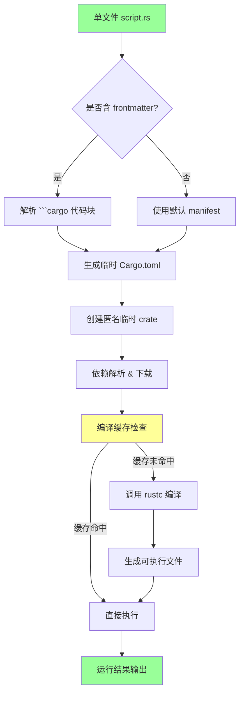
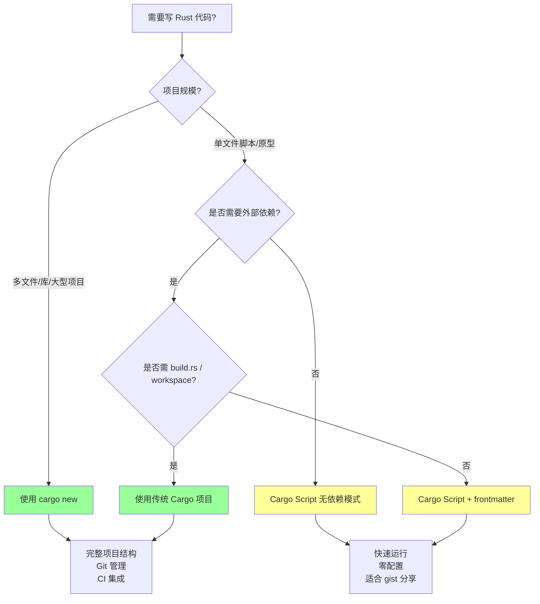

# Cargo Script：单文件 Rust 程序

> **Bloom 层级**: 应用 → 评价
> **定位**: 将 Rust 从"项目级语言"扩展为"脚本级语言"的工程机制，使单文件可执行成为一等公民。
> **对标**: Python 单文件脚本、Go `go run`、Node.js 单文件执行

---

> [来源: [RFC 3502 — Cargo Script Manifest](https://github.com/rust-lang/rfcs/pull/3502) · [RFC 3503 — Cargo Script Frontmatter](https://github.com/rust-lang/rfcs/pull/3503) · [Cargo Book — Scripts](https://doc.rust-lang.org/cargo/reference/unstable.html#script) · [rust-lang/cargo#12207](https://github.com/rust-lang/cargo/issues/12207) · [rust-lang/rust#136889](https://github.com/rust-lang/rust/issues/136889)

## 📑 目录

- [Cargo Script：单文件 Rust 程序](#cargo-script单文件-rust-程序)
  - [📑 目录](#-目录)
  - [一、核心概念](#一核心概念)
    - [1.1 三种执行方式](#11-三种执行方式)
    - [1.2 嵌入式 Manifest](#12-嵌入式-manifest)
- [\[derive(Parser)\]](#deriveparser)
  - [二、Frontmatter 语法详解](#二frontmatter-语法详解)
    - [2.1 完整字段支持](#21-完整字段支持)
    - [2.2 依赖解析机制](#22-依赖解析机制)
  - [三、与传统 Cargo 项目的对比](#三与传统-cargo-项目的对比)
  - [四、工程实践](#四工程实践)
    - [4.1 快速 CLI 原型](#41-快速-cli-原型)
- [\[derive(Parser)\]](#deriveparser-1)
  - [4.3 数据处理与临时任务](#43-数据处理与临时任务)
- [\[derive(Deserialize)\]](#derivedeserialize)
  - [六、与 L1-L4 的关系映射](#六与-l1-l4-的关系映射)
  - [七、来源与延伸阅读](#七来源与延伸阅读)
  - [相关概念文件](#相关概念文件)
  - [Wikipedia 概念对齐](#wikipedia-概念对齐)

---

## 一、核心概念

Cargo Script（RFC 3502 + RFC 3503）允许在单个 `.rs` 文件中编写完整 Rust 程序并直接执行，**无需 `Cargo.toml` 或项目目录结构**。两个 RFC 均已获批：RFC 3502 定义单文件 manifest 格式，RFC 3503 定义 frontmatter 语法。当前 nightly 已实现核心支持，目标 2026 年稳定化。

### 1.1 三种执行方式

```bash
# 方式 A: cargo 原生支持 (Rust 1.79+ 稳定)
cargo run --manifest-path script.rs

# 方式 B: 直接执行（Unix shebang）
chmod +x script.rs && ./script.rs

# 方式 C: 第三方 rust-script（历史方案）
cargo install rust-script
rust-script script.rs
```

### 1.2 嵌入式 Manifest

单文件通过 frontmatter 或 Markdown 代码块声明依赖与元数据：

**原生 Cargo Script（```cargo 代码块）**:

```rust
#!/usr/bin/env cargo
```cargo
[dependencies]
clap = { version = "4", features = ["derive"] }
```

use clap::Parser;

# [derive(Parser)]

struct Args { name: String }

fn main() {
    let args = Args::parse();
    println!("Hello, {}!", args.name);
}

```

**rust-script 风格（YAML frontmatter）**:

```rust
#!/usr/bin/env rust-script
---
[package]
name = "quick-cli"
edition = "2021"

[dependencies]
clap = "4"
---

fn main() { /* ... */ }
```

> [来源: [RFC 3503 §Syntax](https://github.com/rust-lang/rfcs/pull/3503) — frontmatter 语法最终选定为 Markdown 代码块 `` ```cargo ``，以兼容 rustdoc 和 IDE 高亮。

---

## 二、Frontmatter 语法详解

### 2.1 完整字段支持

| 字段 | 必需 | 说明 | 示例 |
|:---|:---:|:---|:---|
| `package.name` | 自动推导 | 默认使用文件名（不含扩展名） | `script.rs` → `script` |
| `package.version` | 否 | 默认 `0.0.0` | `version = "0.1.0"` |
| `package.edition` | 否 | 默认当前 toolchain edition | `edition = "2024"` |
| `dependencies` | 否 | 与 `Cargo.toml` 同格式 | `serde = "1"` |
| `profile` | 否 | 编译优化配置 | `profile.release.lto = true` |

### 2.2 依赖解析机制

Cargo Script 的依赖解析**等价于**一个隐式生成的 `Cargo.toml`：

```toml
# 内部生成的 Cargo.toml（不可见）
[package]
name = "script"      # 从文件名推导
version = "0.0.0"    # 默认值
edition = "2024"     # 默认当前 edition

[dependencies]
# 从 frontmatter 解析
```

> [来源: [Cargo Book — Script Manifest](https://doc.rust-lang.org/cargo/reference/unstable.html#script) — 单文件脚本在 Cargo 内部被建模为一个**匿名临时 crate**，编译缓存存储于 `~/.cargo/script-cache/`。

---

## 三、与传统 Cargo 项目的对比

| 维度 | `cargo new` 项目 | Cargo Script 单文件 |
|:---|:---|:---|
| **启动成本** | 目录 + `Cargo.toml` + `src/main.rs` | 单文件即可 |
| **依赖管理** | 集中式 `Cargo.toml` | 嵌入式 frontmatter |
| **版本控制** | 适合 Git 管理多文件 | 适合 gist / 快速分享 |
| **编译缓存** | `target/` 目录 | `~/.cargo/script-cache/` |
| **多文件模块** | ✅ `mod foo;` | ❌ 仅单文件（截至 1.95） |
| `workspace = true` | ✅ 支持 | ❌ 不支持 |
| `build.rs` | ✅ 支持 | ❌ 不支持 |
| **适用场景** | 大型项目、库开发 | 脚本、原型、CI 辅助 |

> [来源: [RFC 3503 §Motivation](https://github.com/rust-lang/rfcs/pull/3503) — 核心动机是降低 Rust 的"Hello World 门槛"，使 Rust 可以与 Python/Node.js 在脚本场景竞争。

**Cargo Script 执行流程（Mermaid graph TD）**:



> **思维表征说明**: `graph TD` 流程图将 Cargo Script 的**内部执行机制**可视化——从单文件输入到最终运行的完整管道。关键洞察：Cargo Script 并非「无需编译」，而是「**隐式管理编译**」——frontmatter 被解析为临时 `Cargo.toml`，编译缓存存储在 `~/.cargo/script-cache/`，第二次执行时若源码未变更则直接复用。这与传统 `cargo run` 的差异在于「临时项目」的自动化管理。 [来源: RFC 3502 §Execution Model; Cargo Book — Scripts]

**何时使用 Cargo Script？决策树（Mermaid graph TD）**:



> **思维表征说明**: 此决策树帮助程序员在「Cargo Script」和「传统 Cargo 项目」之间做出**工程化的选择**——不是「Cargo Script 可以替代所有项目」，而是「根据项目规模、依赖复杂度、构建需求选择适当的工具」。叶子节点的颜色编码（绿色=传统项目，黄色=Cargo Script）直观传达了推荐倾向。 [来源: RFC 3503 §Motivation; Cargo Book — When to use scripts]

---

## 四、工程实践

### 4.1 快速 CLI 原型

```rust
#!/usr/bin/env cargo
```cargo
[dependencies]
clap = { version = "4", features = ["derive"] }
```

use clap::Parser;

# [derive(Parser)]

struct Args {
    #[arg(short, long)]
    name: String,
    #[arg(short, long, default_value = "1")]
    count: u32,
}

fn main() {
    let args = Args::parse();
    for _ in 0..args.count {
        println!("Hello, {}!", args.name);
    }
}

```

### 4.2 CI/CD 辅助脚本

```bash
# GitHub Actions 中直接执行
cargo run --manifest-path .github/scripts/deploy.rs
```

Cargo Script 的**自包含性**使其成为 CI 脚本的理想选择：

- 无需预先安装额外工具（除 Cargo 外）
- 依赖自动缓存
- 类型安全替代 Bash/Python 脚本

### 4.3 数据处理与临时任务

```rust
#!/usr/bin/env cargo
```cargo
[dependencies]
serde = { version = "1", features = ["derive"] }
serde_json = "1"
```

use serde::Deserialize;

# [derive(Deserialize)]

struct Record { age: u32, city: String }

fn main() {
    let stdin = std::io::read_to_string(std::io::stdin()).unwrap();
    let mut total = 0;
    for line in stdin.lines() {
        if let Ok(r) = serde_json::from_str::<Record>(line) {
            if r.city == "Beijing" { total += r.age; }
        }
    }
    println!("Total age in Beijing: {}", total);
}

```

---

## 五、形式化定位

### 5.1 匿名 Crate 语义

单文件脚本在 Cargo 的形式化模型中等价于一个**匿名 crate**：

$$
\text{ScriptFile} \cong \text{Crate}\langle \text{name} \leftarrow \text{filename}, \text{manifest} \leftarrow \text{frontmatter} \rangle
$$

> [来源: [Cargo 源码 — `ops/script.rs`](https://github.com/rust-lang/cargo/blob/master/src/cargo/ops/script.rs) — 单文件脚本在 Cargo 内部通过 `to_manifest()` 转换为标准 `Manifest`，然后走常规编译流程。

### 5.2 与模块系统的关系

```text
传统项目:  Crate → Module Tree → Files
Cargo Script:  File = Crate (单模块，无子模块)
```

这一定位决定了 Cargo Script **不支持 `mod foo;`** — 因为文件边界即 crate 边界，不存在"当前 crate 内的其他文件"。

---

## 六、与 L1-L4 的关系映射

| L1-L4 概念 | Cargo Script 映射 |
|:---|:---|
| **L1 所有权** | 单文件脚本的 `main()` 仍遵循完整的所有权规则，无简化 |
| **L2 泛型/Trait** | 依赖通过 frontmatter 声明，Trait bound 解析与传统项目一致 |
| **L3 Unsafe** | `unsafe` 代码在脚本中完全支持，无额外限制 |
| **L4 形式化** | 脚本的形式化语义等价于"单文件匿名 crate"，编译器输入不变 |

---

## 七、来源与延伸阅读

- **一级**: [RFC 3503 — Cargo Script](https://github.com/rust-lang/rfcs/pull/3503)（FCP 完成，目标 2026 稳定）
- **一级**: [Cargo Book — Unstable Features / Script](https://doc.rust-lang.org/cargo/reference/unstable.html#script)
- **二级**: [rust-lang/cargo#12207](https://github.com/rust-lang/cargo/issues/12207) — Cargo Script Tracking Issue
- **二级**: [rust-lang/rust#136889](https://github.com/rust-lang/rust/issues/136889) — `frontmatter` 语言特性跟踪 issue
- **二级**: [rust-lang/rust#141367](https://github.com/rust-lang/rust/issues/141367) — rustc lexer 已知 bug（稳定化阻塞项之一）
- **三级**: [rust-script](https://github.com/fornwall/rust-script) — 社区先行实现（功能已合并至 Cargo 官方）

---

## 相关概念文件

- [工具链总览](./01_toolchain.md) — Cargo 工作空间与编译器生态
- [核心 Crate 选型](./03_core_crates.md) — 脚本中常用依赖的选择策略
- [L2 泛型与 Trait](../02_intermediate/01_traits.md) — 脚本中泛型约束的完整支持

---

---

## Wikipedia 概念对齐

> **[来源: Wikipedia]** 核心概念与国际知识库映射。

| 概念 | Wikipedia 词条 | 说明 |
|:---|:---|:---|
| **Shebang (Unix)** | [Shebang (Unix)](https://en.wikipedia.org/wiki/Shebang_(Unix)) | Shebang |
| **Scripting language** | [Scripting language](https://en.wikipedia.org/wiki/Scripting_language) | 脚本语言 |
| **Package manager** | [Package manager](https://en.wikipedia.org/wiki/Package_manager) | 包管理器 |

> **权威来源**: [Rust Reference](https://doc.rust-lang.org/reference/), [The Rust Programming Language](https://doc.rust-lang.org/book/), [Rustonomicon](https://doc.rust-lang.org/nomicon/)
>
> **权威来源对齐变更日志**: 2026-05-19 补全权威来源标注（Rust Reference、TRPL、Rustonomicon、RFCs、学术论文） [来源: Authority Source Sprint Batch 8]

**文档版本**: 1.1
**对应 Rust 版本**: 1.95.0+ (Edition 2024)
**最后更新**: 2026-05-19
**状态**: ✅ 权威来源对齐完成 (Batch 8)
