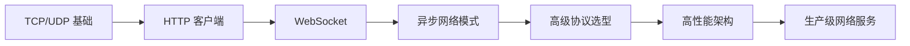
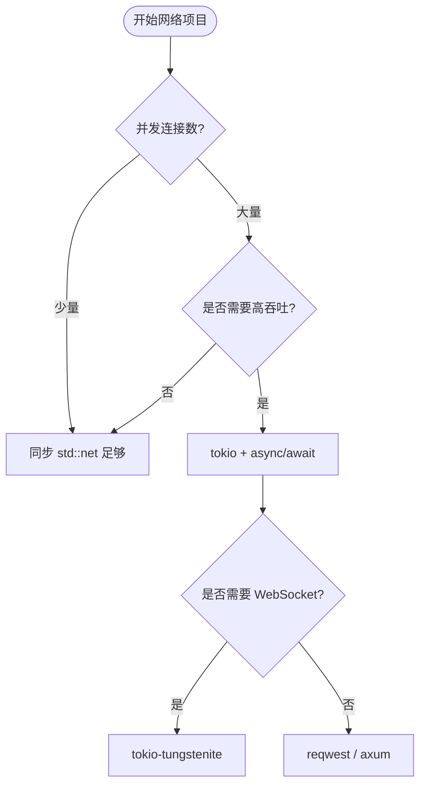

> **EN**: Rust Network Programming Quick Start
> **Summary**: A learning-oriented quick-start guide for Rust network programming, from TCP/UDP basics to HTTP/WebSocket, with staged paths, code examples, Cargo.toml templates, and links to canonical concept pages.
> **权威来源**: [The Rust Programming Language](https://doc.rust-lang.org/book/title-page.html) · [Rust By Example](https://doc.rust-lang.org/rust-by-example/index.html) · [Tokio 文档](https://tokio.rs/)
> **受众**: [进阶]
> **内容分级**: [指南级]
> **Bloom 层级**: L2-L3
> **权威来源**: 本文件为 `concept/` 权威页。
> **A/S/P 标记**: **A+P** — ApplicationProcedure
> **定位**: 为 Rust 网络编程提供分阶段学习路径与场景化导航，链接到权威概念页获取深度解释。
> **前置概念**: [Async](../../03_advanced/01_async/02_async.md) · [Network Protocols](../04_web_and_networking/38_network_protocols.md)
> **后置概念**: [High-Performance Network Service Architecture](../04_web_and_networking/39_high_performance_network_service_architecture.md) · [Distributed Systems](../04_web_and_networking/18_distributed_systems.md)

---

# Rust 网络编程快速入门

## 一、30 秒速览

| 目标 | 推荐主题 | 预计时间 |
| :--- | :--- | :--- |
| 了解全局 | [网络协议](../04_web_and_networking/38_network_protocols.md) | 15 分钟 |
| 动手实践 | TCP/UDP 示例与 HTTP/WebSocket 示例 | 1 小时 |
| 技术选型 | [高级网络协议概览](01_advanced_network_protocols.md) | 30 分钟 |
| 系统学习 | [异步（Async）编程](../../03_advanced/01_async/02_async.md) + [并发模式](../../03_advanced/00_concurrency/10_concurrency_patterns.md) | 1 周 |

## 二、学习路径总览



## 三、推荐学习路径

### 路径 1：快速实战（2 小时）

1. 阅读 [网络协议](../04_web_and_networking/38_network_protocols.md) 了解协议层次。
2. 编写 TCP 服务器/客户端。
3. 编写 UDP 发送/接收程序。
4. 使用 HTTP 客户端发送请求。
5. 了解超时、重试、重连机制。

### 路径 2：系统学习（1 周）

- Day 1–2：异步（Async） trait/closure、TCP/UDP 编程。
- Day 3–4：HTTP 客户端、WebSocket 客户端与 DNS 解析。
- Day 5：协议对比与技术选型。
- Day 6–7：综合项目（聊天室、代理或简单网关）。

### 路径 3：深度研究（1 个月）

- Week 1：协议实现与对比分析。
- Week 2：性能优化与连接池设计。
- Week 3：[自定义协议实现](03_custom_protocol_implementation.md)。
- Week 4：[高性能网络服务架构](../04_web_and_networking/39_high_performance_network_service_architecture.md)。

## 四、按场景选择起点

| 场景 | 起点 | 关键概念 |
| :--- | :--- | :--- |
| 我是初学者 | [网络协议](../04_web_and_networking/38_network_protocols.md) → TCP/UDP 示例 | socket、async/await |
| 我要做技术选型 | [高级网络协议概览](01_advanced_network_protocols.md) → 协议对比矩阵 | gRPC、MQTT、QUIC、AMQP |
| 我要解决具体问题 | [HTTP 客户端开发](../04_web_and_networking/41_http_client_development.md) | 超时、重试、连接池 |
| 我要理解架构设计 | [高性能网络服务架构](../04_web_and_networking/39_high_performance_network_service_architecture.md) | Tower、背压、负载均衡 |

## 五、基础代码示例

### 同步 TCP Echo 服务器

```rust
use std::net::{TcpListener, TcpStream};
use std::io::{Read, Write};

fn handle_client(mut stream: TcpStream) -> std::io::Result<()> {
    let mut buf = [0u8; 1024];
    loop {
        let n = stream.read(&mut buf)?;
        if n == 0 { break; }
        stream.write_all(&buf[..n])?;
    }
    Ok(())
}

fn main() -> std::io::Result<()> {
    let listener = TcpListener::bind("127.0.0.1:8080")?;
    for stream in listener.incoming().flatten() {
        std::thread::spawn(|| handle_client(stream).unwrap());
    }
    Ok(())
}
```

### 异步 TCP Echo 服务器

```rust
use tokio::net::{TcpListener, TcpStream};
use tokio::io::{AsyncReadExt, AsyncWriteExt};

async fn handle_client(mut socket: TcpStream) -> std::io::Result<()> {
    let mut buf = [0u8; 1024];
    loop {
        let n = socket.read(&mut buf).await?;
        if n == 0 { return Ok(()); }
        socket.write_all(&buf[..n]).await?;
    }
}

#[tokio::main]
async fn main() -> std::io::Result<()> {
    let listener = TcpListener::bind("127.0.0.1:8080").await?;
    loop {
        let (socket, _) = listener.accept().await?;
        tokio::spawn(handle_client(socket));
    }
}
```

### UDP 发送与接收

```rust
use std::net::UdpSocket;

fn main() -> std::io::Result<()> {
    let socket = UdpSocket::bind("0.0.0.0:0")?;
    socket.send_to(b"hello", "127.0.0.1:34254")?;

    let mut buf = [0u8; 1024];
    let (n, src) = socket.recv_from(&mut buf)?;
    println!("received {} bytes from {}", n, src);
    Ok(())
}
```

### HTTP 客户端请求

```rust
use reqwest::Error;

#[tokio::main]
async fn main() -> Result<(), Error> {
    let body = reqwest::get("https://httpbin.org/ip")
        .await?
        .text()
        .await?;
    println!("{}", body);
    Ok(())
}
```

### Cargo.toml 模板

```toml
[dependencies]
tokio = { version = "1", features = ["full"] }
reqwest = { version = "0.12", features = ["json"] }
tokio-tungstenite = "0.24"
serde = { version = "1", features = ["derive"] }
```

## 六、异步网络编程模式

> 内容来源：`crates/c10_networks/docs/tier_04_advanced/02_async_network_programming_patterns.md`，已按 AGENTS.md §6.4 迁移至此。

Rust 异步网络编程中常见的并发架构模式可归纳为下表：

| 模式 | 核心思想 | 典型 Rust 实现 |
| :--- | :--- | :--- |
| **Actor** | 消息传递、独立执行体 | `tokio::sync::mpsc` + task |
| **Reactor** | 事件循环 + I/O 多路复用 | `tokio::net` / `mio` |
| **Proactor** | 异步 I/O 完成回调 | io_uring / 运行时（Runtime）封装 |
| **CSP** | 通道通信的顺序进程 | `tokio::sync::{mpsc, broadcast}` |
| **异步流** | `Stream` 组合子与背压 | `tokio-stream` / `futures::Stream` |
| **工作窃取** | 任务调度负载均衡 | `tokio` 的 work-stealing runtime |

关键机制包括：

- **背压（Backpressure）**：通过有界通道或 `Stream::buffered` 限制上游速率，避免内存无限增长。
- **异步取消**：使用 `tokio::select!` 或 `CancellationToken` 实现优雅关闭。
- **Future 组合**：`and_then`、`or_else`、`select` 等组合子可组合多个异步操作。
- **超时与错误传播**：`tokio::time::timeout` 与 `?` 在 async 函数中协同工作。

```rust
use tokio::time::{timeout, Duration};

async fn fetch_with_limit(url: &str) -> Result<String, Box<dyn std::error::Error>> {
    let resp = timeout(Duration::from_secs(5), reqwest::get(url)).await??;
    Ok(resp.text().await?)
}
```

## 七、网络工程实践要点

> 内容来源：`crates/c10_networks/docs/tier_04_advanced/04_network_engineering_practices.md`，已按 AGENTS.md §6.4 迁移至此。

生产级 Rust 网络应用需要关注以下工程实践：

| 实践 | 说明 |
| :--- | :--- |
| **可观测性** | 日志聚合、指标收集（Prometheus）、分布式追踪（OpenTelemetry/Jaeger） |
| **灰度发布** | 金丝雀、蓝绿部署，逐步放量验证 |
| **限流** | 令牌桶、漏桶，保护后端资源 |
| **熔断降级** | 快速失败与降级策略，防止故障级联 |
| **超时重试** | 指数退避 + 抖动，避免惊群 |
| **幂等性** | 请求去重、幂等键，保证重试安全 |

Rust 生态推荐工具：

- `tokio::time::timeout` / `tower::retry`：超时与重试。
- `tower::limit::RateLimit` / `Governor`：限流。
- `reqwest-tracing` / `opentelemetry`：可观测性。

## 八、同步 vs 异步决策树



## 九、学习目标检验

- **初级（1–2 周）**：能编写 TCP/UDP 程序，使用 HTTP 客户端，理解重连/超时/重试。
- **中级（3–4 周）**：实现 WebSocket 自动重连与心跳，进行 DNS 多记录查询与缓存，理解协议权衡。
- **高级（1–2 个月）**：设计高性能网络架构，进行系统性技术选型，实现生产级网络应用。

## 十、相关权威页

- [网络协议：QUIC/HTTP-3 与 Rust 实现](../04_web_and_networking/38_network_protocols.md)
- [HTTP 客户端开发](../04_web_and_networking/41_http_client_development.md)
- [高级网络协议概览](01_advanced_network_protocols.md)
- [自定义协议实现](03_custom_protocol_implementation.md)
- [网络安全](02_network_security.md)
- [异步编程](../../03_advanced/01_async/02_async.md)
- [并发模式](../../03_advanced/00_concurrency/10_concurrency_patterns.md)
- [Rust vs Go（网络并发场景对比）](../../05_comparative/01_systems_languages/02_rust_vs_go.md)

## 过渡段

> **过渡**: 从 TCP/UDP 基础过渡到 std 与 tokio 的选择，可以根据并发需求确定异步策略。
>
> **过渡**: 从异步选择过渡到错误处理（Error Handling）与超时，可以建立健壮网络客户端的基本模式。
>
> **过渡**: 从可运行示例过渡到生产部署，可以引入连接池、重试与可观测性等工程要素。
>

## 定理链

| 定理 | 前提 | 结论 |
|:---|:---|:---|
| std 网络 ⟹ 简单性 | 无需额外运行时（Runtime）依赖 | 适合低并发或学习场景 |
| tokio ⟹ 可扩展性 | 与 async/await 集成 | 适合高并发 I/O 服务 |
| 示例驱动 ⟹ 降低上手成本 | 从最小可运行代码开始 | 加速学习曲线 |
