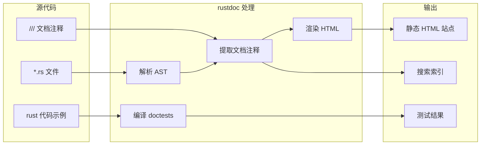
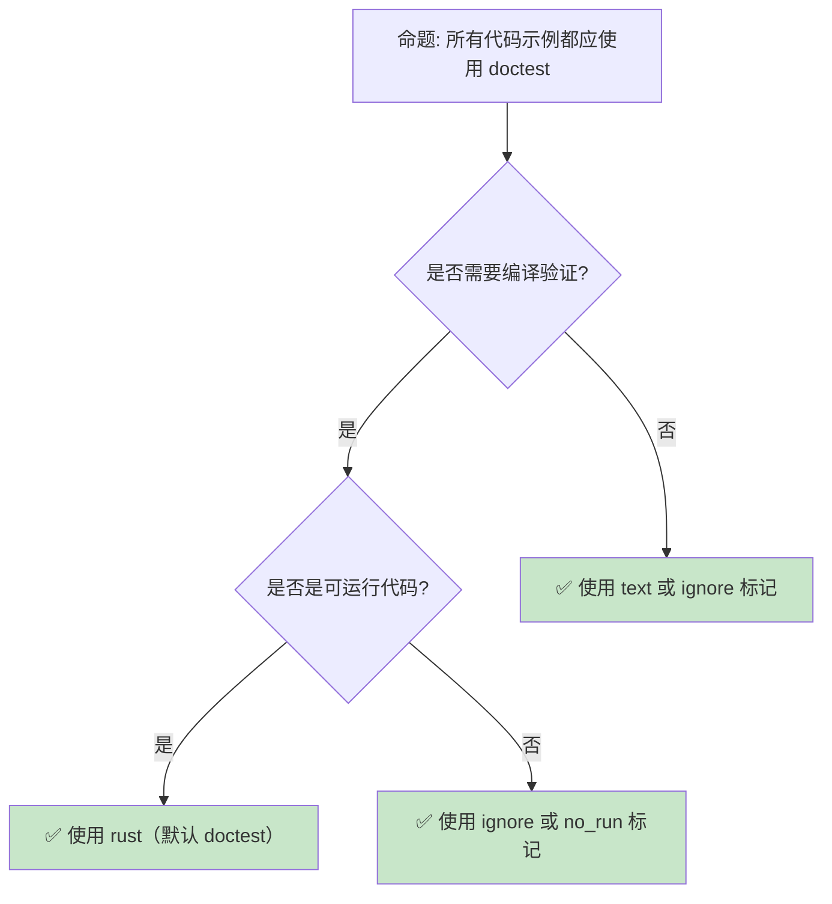

> **内容分级**: [综述级]
> **代码状态**: ✅ 含可编译示例
> **定理链**: N/A — 描述性/综述性/导航性文档，不涉及形式化定理链

# 文档生态：rustdoc、文档测试与 API 文档规范
>
> **EN**: Documentation
> **Summary**: Writing and publishing Rust documentation with rustdoc, doc tests, and crate docs.
> **Rust 版本**: 1.97.0+ (Edition 2024)
> **受众**: [进阶]
> **Bloom 层级**: L2-L4
> **权威来源**: 本文件为 `concept/` 权威页。
> **A/S/P 标记**: **A** — Application
> **双维定位**: F×App — 文档工具和约定的应用
> **定位**: 覆盖 Rust **文档生态**的核心工具与实践——从 rustdoc 的渲染机制、文档测试（doctest）、到 API 文档规范（[RFC 1574](https://rust-lang.github.io/rfcs//1574-more-api-documentation-conventions.html)）和 mdBook 静态站点生成，分析 Rust 文档文化如何成为语言生态的竞争优势。
> **前置概念**: [Macros](../../03_advanced/03_proc_macros/01_macros.md) · [Module System](../../02_intermediate/05_modules_and_visibility/01_module_system.md)
> **后置概念**: [Cargo Toolchain](../00_toolchain/01_toolchain.md) · [WebAssembly](../11_domain_applications/03_webassembly.md)

---

> **来源**: · [Brown University — Interactive Rust Book](https://rust-book.cs.brown.edu/) · [Jung et al. — RustBelt: Securing the Foundations of Rust](https://plv.mpi-sws.org/rustbelt/popl18/) · [Itanium C++ ABI](https://itanium-cxx-abi.github.io/cxx-abi/abi.html)
> [rustdoc Documentation](https://doc.rust-lang.org/rustdoc/) ·
> [RFC 1574 — API Documentation](https://github.com/rust-lang/rfcs/pull/1574) ·
> [mdBook Guide](https://rust-lang.github.io/mdBook/) ·
> [RFC 1946 — Intra-rustdoc links](https://github.com/rust-lang/rfcs/pull/1946) ·
> [docs.rs](https://docs.rs/about)
> **前置依赖**: [Type Theory](../../04_formal/00_type_theory/01_type_theory.md)
> **前置依赖**: [Rust vs C++](../../05_comparative/01_systems_languages/01_rust_vs_cpp.md)

## 📑 目录

- [文档生态：rustdoc、文档测试与 API 文档规范](#文档生态rustdoc文档测试与-api-文档规范)
  - [📑 目录](#-目录)
  - [一、核心概念](#一核心概念)
    - [1.1 rustdoc：编译器集成的文档生成器](#11-rustdoc编译器集成的文档生成器)
    - [1.2 文档测试（Doc Tests）](#12-文档测试doc-tests)
    - [1.3 文档作为类型系统的一部分](#13-文档作为类型系统的一部分)
  - [二、技术细节](#二技术细节)
    - [2.1 文档注释语法](#21-文档注释语法)
    - [2.2 Intra-doc Links](#22-intra-doc-links)
    - [2.3 mdBook 与知识体系站点](#23-mdbook-与知识体系站点)
  - [三、最佳实践](#三最佳实践)
  - [四、反命题与边界分析](#四反命题与边界分析)
    - [4.1 反命题树](#41-反命题树)
    - [4.2 边界极限](#42-边界极限)
  - [五、常见陷阱](#五常见陷阱)
  - [六、来源与延伸阅读](#六来源与延伸阅读)
  - [相关概念](#相关概念)
  - [权威来源索引](#权威来源索引)
  - [十、边界测试：文档工具的编译错误](#十边界测试文档工具的编译错误)
    - [10.1 边界测试：`doctest` 中的隐式 `main`（编译错误）](#101-边界测试doctest-中的隐式-main编译错误)
    - [10.2 边界测试：`rustdoc` 的链接解析失败（编译错误）](#102-边界测试rustdoc-的链接解析失败编译错误)
    - [10.4 边界测试：`doctest` 的 `compile_fail` 与 `ignore` 的误用（测试失败）](#104-边界测试doctest-的-compile_fail-与-ignore-的误用测试失败)
  - [嵌入式测验（Embedded Quiz）](#嵌入式测验embedded-quiz)
    - [测验 1：`rustdoc` 如何运行文档中的代码示例（doctests）？（理解层）](#测验-1rustdoc-如何运行文档中的代码示例doctests理解层)
    - [测验 2：`///` 和 `//!` 在 Rust 文档注释中有什么区别？（理解层）](#测验-2-和--在-rust-文档注释中有什么区别理解层)
    - [测验 3：为什么建议在公共 API 的文档示例中使用 `assert!` 或 `assert_eq!`？（理解层）](#测验-3为什么建议在公共-api-的文档示例中使用-assert-或-assert_eq理解层)
    - [测验 4：`cargo doc` 生成的文档中，`[dependencies]` 的文档链接是如何自动生成的？（理解层）](#测验-4cargo-doc-生成的文档中dependencies-的文档链接是如何自动生成的理解层)
    - [测验 5：`#[doc(hidden)]` 属性有什么用途？（理解层）](#测验-5dochidden-属性有什么用途理解层)
  - [认知路径](#认知路径)
    - [核心推理链](#核心推理链)
    - [反命题与边界](#反命题与边界)

---

## 一、核心概念
>
>

### 1.1 rustdoc：编译器集成的文档生成器
>



> **认知功能**: 此图展示 rustdoc 的**工作流**——它不仅是文档渲染器，还是**文档测试运行器**。这是 Rust 文档生态区别于其他语言的关键特性。
> [来源: [TRPL](https://doc.rust-lang.org/book/title-page.html)]
> **使用建议**: 将 rustdoc 视为 CI 的一部分——`cargo test --doc` 应在每次提交时运行。
> **关键洞察**: rustdoc 与**编译器共享 AST**——它直接读取编译器的解析结果，确保文档与代码始终同步。
> [来源: [rustdoc Documentation](https://doc.rust-lang.org/rustdoc/)]

---

### 1.2 文档测试（Doc Tests）
>

```text
文档测试: 将示例代码作为测试运行

  基本语法:
  /// ```
  /// let x = add(2, 3);
  /// assert_eq!(x, 5);
  /// ```
  pub fn add(a: i32, b: i32) -> i32 { a + b }

  运行方式:
  ├── cargo test --doc        // 仅运行文档测试
  ├── cargo test              // 运行所有测试（包括 doctest）
  └── rustdoc --test src/lib.rs  // 直接使用 rustdoc

  属性控制:
  ├── ```ignore    // 不编译（展示不可运行代码）
  ├── ```no_run    // 编译但不运行（如 panic 示例）
  ├── ```should_panic  // 期望 panic
  ├── ```edition2021   // 指定 edition
  ├── ```compile_fail  // 期望编译失败（演示错误）
  └── ```text      // 纯文本，不编译

  隐藏代码:
  /// ```
  /// # use my_crate::setup;  // # 前缀的代码被隐藏
  /// # setup();
  /// let result = my_function();
  /// ```
```

> **Doctest 洞察**: Rust 的**文档测试**是生态的独特优势——示例代码不会过时，因为 CI 会验证它们是否能编译和运行。这解决了技术文档的**示例腐烂**（bit rot）问题。
> [来源: [TRPL — Documentation Comments](https://doc.rust-lang.org/book/ch14-02-publishing-to-crates-io.html#documentation-comments)]

---

### 1.3 文档作为类型系统的一部分
>

```text
Rust 文档文化的独特性:

  1. 文档即契约
  ├── Safety 注释: /// # Safety 段落说明 unsafe 前置条件
  ├── Panic 注释: /// # Panics 段落说明 panic 条件
  └── Errors 注释: /// # Errors 段落说明错误情况

  2. 文档即示例
  ├── 每个公共 API 都有可运行的示例
  ├── 示例覆盖典型用例和边界情况
  └── doctest 确保示例始终有效

  3. 文档即规范
  ├── RFC 1574 定义标准文档结构
  ├── docs.rs 自动生成所有 crate 的文档
  └── cargo doc 在本地生成文档

  4. 与其他语言的对比:
  ┌───────────┬─────────────────┬─────────────────┬─────────────────┐
  │ 特性      │ Rust            │ Python          │ JavaScript      │
  ├───────────┼─────────────────┼─────────────────┼─────────────────┤
  │ 文档测试  │ 内置            │ 需 doctest 库   │ 无原生支持      │
  │ 生成工具  │ rustdoc（集成） │ Sphinx/ pydoc   │ JSDoc/ TSDoc    │
  │ 托管平台  │ docs.rs（自动） │ ReadTheDocs     │ 无统一平台      │
  │ 类型链接  │ intra-doc links │ 无              │ 无              │
  └───────────┴─────────────────┴─────────────────┴─────────────────┘
```

> **文档文化洞察**: Rust 的文档生态不是**事后补充**，而是**开发流程的组成部分**——从 [RFC 1574](https://rust-lang.github.io/rfcs//1574-more-api-documentation-conventions.html) 的标准化到 docs.rs 的自动托管，文档质量被提升到与代码质量同等重要的地位。
> [来源: [RFC 1574 — API Documentation](https://github.com/rust-lang/rfcs/pull/1574)]

---

## 二、技术细节

Rust 文档工具链的三个技术主题对应“写在哪、怎么链、怎么出版”：

- **文档注释语法**: `///` 为紧随其后的项写文档（outer），`//!` 为包含它的模块/crate 写文档（inner）；支持完整 Markdown，标题层级从 `##` 起（`#` 保留给项名）。约定俗成的章节：`# Examples`（示例）、`# Errors`（返回 `Result` 的错误条件）、`# Panics`、`# Safety`（unsafe fn 的契约，缺它 `clippy::missing_safety_doc` 会警告）。
- **Intra-doc Links**: ``[`Type::method`]`` 直接链接到项的文档页，链接目标由 rustdoc 解析——写错路径在 `cargo doc` 时报 warning（配 `-D warnings` 可升级为门禁），这是文档与代码同步腐烂的最有效防线。
- **mdBook 与知识体系站点**: API 文档（rustdoc）讲“是什么”，mdBook 讲“为什么与怎么用”；两者经 intra-doc link 的反向引用（书内链 docs.rs）形成闭环。

判定依据：公共 API 缺 `# Examples` 与 `# Errors` 章节是文档债务的明确信号。

### 2.1 文档注释语法
>

```rust,ignore
/// 单行文档注释（推荐用于函数/结构体）
pub fn example() {}

/** 块文档注释（推荐用于长文档）
 * # 概述
 *
 * 这是一个示例函数，展示了块文档注释的用法。
 *
 * # 示例
 *
 * ```
 * use my_crate::example;
 * example();
 * ```
 *
 * # 安全性
 *
 * 此函数是安全的，不需要 unsafe 块。
 */
pub fn documented() {}

// 模块级文档（放在文件开头或 //!）
//! # My Crate
//!
//! 这是 crate 级别的文档，使用 `//!` 前缀。
//!
//! ## 功能
//!
//! - 功能 A
//! - 功能 B
```

> **注释规范**: `///` 用于项文档，`//!` 用于容器（模块（Module）/crate）文档。[RFC 1574](https://rust-lang.github.io/rfcs//1574-more-api-documentation-conventions.html) 建议使用 Markdown 格式和特定章节结构（Examples、Panics、Errors、Safety）。
> [来源: [RFC 1574 — Documentation Conventions](https://rust-lang.github.io/rfcs//1574-more-api-documentation-conventions.html)]

---

### 2.2 Intra-doc Links
>

```rust
/// 使用 [`MyStruct`] 进行演示。
///
/// 也可以使用 [完整路径](crate::module::MyStruct)。
///
/// 引用 Trait 方法: [`Trait::method`](Trait::method)
///
/// 引用标准库: [`Vec::push`] 或 [`std::vec::Vec`]
///
/// 引用外部 crate: [`serde::Serialize`]
pub fn demo() {}

// Intra-doc links 的优势:
// - 编译期验证链接目标存在
// - 重命名时自动更新（重构安全）
// - 生成可点击的 HTML 链接
// - 支持路径解析（包括 use 别名）
```

> **Intra-doc Links**: intra-doc links 是 Rust 文档的**杀手级特性**——它们在编译期验证链接有效性，解决了技术文档中最常见的**链接腐烂**问题。
> [来源: [RFC 1946 — Intra-rustdoc links](https://github.com/rust-lang/rfcs/pull/1946)]

---

### 2.3 mdBook 与知识体系站点
>

```text
mdBook: Rust 生态的静态站点生成器

  设计目标:
  ├── 为 Rust 官方文档（The Book、Reference、Nomicon）提供支持
  ├── Markdown 源文件 → 静态 HTML
  ├── 支持数学公式（MathJax/KaTeX）
  ├── 支持代码高亮和可编辑代码块
  └── 插件系统（预处理器/后处理器）

  本知识体系的 mdBook 配置:
  ├── book.toml: 站点配置（标题、作者、输出设置）
  ├── SUMMARY.md: 目录结构（自动生成）
  ├── src/: Markdown 源文件
  └── 主题: 自定义 CSS + Mermaid 支持

  Mermaid 集成:
  ├── mdBook 原生不支持 Mermaid
  ├── 通过 custom head（header.hbs）注入 Mermaid.js
  └── 实现: 页面加载时自动渲染 ```mermaid 代码块

  部署流程:
  1. 运行 generate_summary.py 生成 SUMMARY.md
  2. mdbook build 生成静态站点
  3. 部署到 GitHub Pages / Netlify / 自有服务器
```

> **mdBook 洞察**: mdBook 的设计哲学与 Rust 一致——**简单、可扩展、以内容为中心**。它不试图成为全能 CMS，而是专注于将 Markdown 转换为漂亮的文档站点。
> [来源: [mdBook Documentation](https://rust-lang.github.io/mdBook/)]

---

## 三、最佳实践

```text
API 文档规范（RFC 1574 推荐）:

  公共 API 文档结构:
  /// 简短描述（一句话）
  ///
  /// 详细描述（多段，说明功能、设计意图）
  ///
  /// # 示例
  ///
  /// ```
  /// use my_crate::my_function;
  /// let result = my_function(42);
  /// assert_eq!(result, 42);
  /// ```
  ///
  /// # Panics
  ///
  /// 说明什么情况下会 panic。
  ///
  /// # Errors
  ///
  /// 如果返回 Result，说明可能的错误情况。
  ///
  /// # Safety
  ///
  /// 如果是 unsafe 函数，说明调用者需要保证的前置条件。
  ///
  /// # 另见
  ///
  /// - [`related_function`]
  /// - [模块文档](crate::module)

  Crate 级别文档（lib.rs 开头）:
  //! # Crate 名称
  //!
  //! 简短描述 crate 的功能和用途。
  //!
  //! ## 快速开始
  //!
  //! ```
  //! use my_crate::Client;
  //! let client = Client::new();
  //! ```
  //!
  //! ## 功能特性
  //!
  //! - 特性 A
  //! - 特性 B
  //!
  //! ## 最低支持 Rust 版本（MSRV）
  //!
  //! 本 crate 的 MSRV 是 1.97.0。

  文档质量检查清单:
  ├── 所有 pub 项都有文档注释
  ├── 所有示例代码都能通过 doctest
  ├── 所有 intra-doc links 有效
  ├── Safety 注释完整（unsafe API）
  └── CHANGELOG.md 记录重大变更
```

> **最佳实践**: Rust 的文档规范不是**可选的**——`cargo doc` 会对未文档化的公共项发出警告（`#[warn(missing_docs)]`）， crates.io 上的高质量 crate 都有完整的文档。
> [来源: [Rust API Guidelines — Documentation](https://rust-lang.github.io/api-guidelines//documentation.html)]

---

## 四、反命题与边界分析

文档工程的两个高频误判：

- **“文档应该等 API 稳定后再写”** —— 不成立。文档是 API 设计的检验工具——写不出清晰示例的 API 通常是设计有问题（参数太多、所有权语义混乱）；推迟文档等于推迟设计反馈。Rust 的 doctest 机制让“文档即测试”，示例代码随 API 变化而编译失败，不存在“先写后腐烂”的经典借口。
- **“文档注释越详细越好”** —— 不成立。注释复述代码（“// 把 x 加一”）是纯噪声；文档的价值在**契约层信息**——为什么存在、不变量是什么、边界条件如何、与其他 API 的分工。实现细节留给代码本身，意图与约束留给文档。
- **边界极限**: 内部工具/原型代码的文档投入应与受众规模匹配——强制所有私有函数写文档会降低真实信号的信噪比。

### 4.1 反命题树
>



> **认知功能**: 此决策树帮助选择正确的代码块属性。核心原则是**默认使用 doctest**，只有在确实不需要验证时才使用 ignore/text。
> **使用建议**: doctest 会增加编译时间，但对于公共 API 的示例来说是值得的。
> [来源: [rustdoc — Documentation tests](https://doc.rust-lang.org/rustdoc/write-documentation/documentation-tests.html)]

---

### 4.2 边界极限
>

```text
边界 1: doctest 的编译时间
├── doctest 需要编译和运行，增加 CI 时间
├── 复杂示例可能依赖外部资源（数据库、网络）
├── 解决方案: 使用 #[cfg(doctest)] 条件编译
└── 或使用 ```no_run 编译但不运行

边界 2: 文档与实现的同步
├── 重构时文档可能过时（即使 doctest 通过）
├── 语义变更可能不影响示例代码的编译
├── 解决方案: 代码审查时强制检查文档更新
└── 使用 intra-doc links 减少手动维护

边界 3: 私有 API 的文档
├── rustdoc 默认不渲染私有项文档
├── 但可以通过 --document-private-items 生成
├── 内部文档需求与公开文档的冲突
└── 解决方案: CI 生成两套文档（公开 + 内部）

边界 4: mdBook 的 Mermaid 支持
├── mdBook 原生不支持 Mermaid
├── 需要自定义 head 模板注入 JS
├── 大页面可能有性能问题
└── 替代方案: 预渲染 Mermaid 为 SVG（mdbook-mermaid 插件）

边界 5: docs.rs 资源限制与默认目标策略
├── docs.rs 对 crate 构建有时间限制
├── 非常大的 crate 可能构建失败
├── 自定义构建脚本可能被限制
├── 2026-05-01 起，docs.rs 默认仅构建 **1 个目标**（x86_64-unknown-linux-gnu）
│   └── 此前默认构建 5 个目标；需多目标文档时须在 Cargo.toml 显式声明
└── 解决方案: 使用 docs.rs metadata 配置构建设项
```

> **边界要点**: 文档生态的边界主要与**编译时间**、**同步维护**、**工具限制**和**托管平台约束**相关。2026-05-01 的默认目标变更意味着跨平台 crate 需要主动配置 `[package.metadata.docs.rs]`，否则 Windows/macOS 等目标文档将不再自动生成。
> [来源: [docs.rs Build Limits](https://docs.rs/about/builds)] ·
> [来源: [Rust Blog — docs.rs: building fewer targets by default](https://blog.rust-lang.org/2026/04/04/docsrs-only-default-targets/)]

---

## 五、常见陷阱
>

```text
陷阱 1: 忘记 doctest 会失败
  ❌ ```rust
     let x = std::fs::read_to_string("file.txt").unwrap();
     // doctest 运行时文件可能不存在！

  ✅ ```no_run
     // 或提供 mock 数据
     let x = "mock data".to_string();

陷阱 2: 文档注释中的代码不合法
  ❌ /// let x = 1 + ;  // 语法错误

  ✅ 运行 cargo test --doc 确保所有示例通过

陷阱 3: intra-doc links 指向私有项
  ❌ /// 参见 [`private_helper`]
     // private_helper 是私有的，链接无效

  ✅ 只链接公共 API，或使用 [文本](path) 格式

陷阱 4: 文档与实现不同步
  ❌ 函数签名变更后忘记更新文档中的示例

  ✅ 将 cargo test --doc 加入 CI
     // doctest 失败会阻止合并

陷阱 5: 过度文档化
  ❌ 为每个私有函数写长文档
  // 维护成本高，收益低

  ✅ 优先文档化公共 API
  // 私有函数用简洁注释说明意图即可
```

> **陷阱总结**: 文档生态的陷阱主要与**doctest 可靠性**、**链接有效性**、**同步维护**和**文档优先级**相关。
> [来源: [Rust [RFC 1574](https://rust-lang.github.io/rfcs//1574-more-api-documentation-conventions.html) — Common Mistakes](https://rust-lang.github.io/rfcs//1574-more-api-documentation-conventions.html)]

---

## 六、来源与延伸阅读

| 来源 | 可信度 | 说明 |
|:---|:---:|:---|
| [rustdoc Documentation](https://doc.rust-lang.org/rustdoc/) | ✅ 一级 | 官方文档工具 |
| [RFC 1574 — API Documentation](https://github.com/rust-lang/rfcs/pull/1574) | ✅ 一级 | 文档规范 RFC |
| [mdBook Guide](https://rust-lang.github.io/mdBook/) | ✅ 一级 | 静态站点生成器 |
| [RFC 1946 — Intra-doc Links](https://github.com/rust-lang/rfcs/pull/1946) | ✅ 一级 | 内部链接 RFC |
| [docs.rs](https://docs.rs/about) | ✅ 一级 | crate 文档托管 |
| [Rust API Guidelines — Documentation](https://rust-lang.github.io/api-guidelines//documentation.html) | ✅ 一级 | API 文档指南 |

---

## 相关概念

- [Cargo Toolchain](../00_toolchain/01_toolchain.md) — Cargo 与 rustdoc 集成
- [Macros](../../03_advanced/03_proc_macros/01_macros.md) — 文档宏（doc comments）
- [Module System](../../02_intermediate/05_modules_and_visibility/01_module_system.md) — 模块（Module）级文档

---

> **权威来源**: [Rust Reference](https://doc.rust-lang.org/reference/introduction.html), [The Rust Programming Language](https://doc.rust-lang.org/book/title-page.html)
>
> **权威来源对齐变更日志**: 2026-05-22 创建 [Authority Source Sprint Batch 9](../../00_meta/02_sources/05_international_authority_index.md)

**文档版本**: 1.0
**最后更新**: 2026-05-22
**状态**: ✅ 概念文件创建完成

---

## 权威来源索引

>
>
>
>
>

---

## 十、边界测试：文档工具的编译错误

文档工具的边界测试覆盖 doctest 与链接解析的三类典型失败：

- **doctest 的隐式 `main`**: rustdoc 自动为示例包裹 `fn main()`——示例中显式写 `fn main` 会导致嵌套错误；需要 `?` 传播时用 `# fn main() -> Result<(), E> { ... # Ok(()) # }` 的隐藏行模式，以 `#` 开头的行参与编译但不渲染。
- **intra-doc link 解析失败**: ``[`Foo`]`` 找不到目标时 rustdoc 报 warning——常见原因是未 `use` 引入或路径歧义（同名项在不同模块）；用全路径 ``[`crate::mod::Foo`]`` 或 `foo@`/`type@` 消歧前缀解决。
- **`compile_fail` 与 `no_run` 标注**: `` ```compile_fail `` 断言示例**必须**编译失败（用于展示反模式），若示例意外通过编译，测试失败——这会把“反例有效性”纳入 CI 监控；`no_run` 编译但不执行（需要外部资源的示例）。

判定依据：`RUSTDOCFLAGS="-D warnings" cargo doc` 应纳入 CI，文档质量与代码质量同权。

### 10.1 边界测试：`doctest` 中的隐式 `main`（编译错误）

```rust,compile_fail
/// ```rust
/// let x = 5;
/// assert_eq!(x, 5);
/// ```
fn documented() {}

// doctest 中以下代码会失败:
// ```rust,compile_fail
// fn no_main() {
//     // ❌ doctest 默认包裹在 fn main() 中
//     // return 类型不匹配会导致编译错误
// }
// ```
```

> **修正**: Rust 的文档测试（doctest）自动将代码块包裹在 `fn main() { ... }` 中。
> 若代码块包含 `fn main()` 或返回类型，需使用 `no_run` 或 `compile_fail` 属性。`compile_fail` 属性验证代码确实编译失败
> ——这是测试"编译期保证"的独特方式。
> 与 Python 的 doctest（只检查输出）不同，Rust 的 doctest是完整的编译-运行测试，确保文档中的代码始终有效。
> [来源: [Rust Reference](https://doc.rust-lang.org/reference/introduction.html)]

### 10.2 边界测试：`rustdoc` 的链接解析失败（编译错误）

```rust
/// See [NonExistent] for more details.
/// // ❌ rustdoc 警告: unresolved link to `NonExistent`
pub fn linked() {}

/// See [`String`] for more details.
/// // ✅ 正确链接到标准库类型
pub fn linked_fixed() {}
```

> **修正**:
> Rust 1.48+ 的 `rustdoc` 支持 intra-doc links——用 `[`Name`]` 语法链接到 crate 内的项或标准库类型。
> 未解析的链接产生编译警告（CI 中可提升为错误）。这要求文档维护者确保所有引用（Reference）有效，避免死链接。
> 与 JavaDoc 或 Doxygen 的外部链接不同，Rust 的 intra-doc links 在编译期验证目标存在，将文档一致性（Coherence）检查提前到构建阶段。
> [来源: [Rust Reference](https://doc.rust-lang.org/reference/introduction.html)]

### 10.4 边界测试：`doctest` 的 `compile_fail` 与 `ignore` 的误用（测试失败）

```rust,ignore
/// ```compile_fail
/// let x: i32 = "hello";
/// ```
fn documented_function() {}

fn main() {}
```

> **修正**:
> Rust 的 **doctest**（文档测试）支持 `compile_fail` 属性：代码应编译失败，若编译通过则测试失败。
> `ignore` 属性：跳过测试（不编译也不运行）。`no_run` 属性：编译但不运行。
> 常见误用：
>
> 1) `compile_fail` 用于运行时（Runtime）错误代码（应使用 `no_run` 或 `should_panic`）；
> 2) `ignore` 用于依赖外部资源的测试（正确）；
> 3) `compile_fail` 代码实际编译通过（测试失败）。
>
> doctest 的编写原则：
>
> 1) `compile_fail` — 仅用于展示编译错误；
> 2) `no_run` — 用于无限循环或 I/O 代码；
> 3) 无属性 — 正常编译运行；
> 4) `ignore` — 平台特定或需要外部设置的代码。
> 这与 Python 的 doctest（运行示例代码，验证输出）或 Elixir 的 doctests（类似 Python）不同
> ——Rust 的 doctest 支持编译失败验证，是文档即测试的强大工具。
> [来源: [The Rust Programming Language](https://doc.rust-lang.org/rustdoc/write-documentation/documentation-tests.html)] ·
> [来源: [Rustdoc Book](https://doc.rust-lang.org/rustdoc/index.html)]

## 嵌入式测验（Embedded Quiz）

以下测验检验本章五个 Rust 文档工程判断点：

- 测验 1：**doctest 运行机制**——rustdoc 提取 ```rust 代码块包装为 `main` 编译运行，失败即 `cargo test` 失败；这让文档示例成为“永不过期的测试”，也是本章反复强调示例必须可编译的原因。
- 测验 2：**`///` vs `//!`**——前者注释紧随其后的项，后者注释包含它的模块/crate，位置写错会导致文档挂错对象。
- 测验 3：**示例中为何用 `assert!`**——无断言的示例只验证“能编译运行”，断言才把示例变成行为规约；文档示例是用户最先抄的代码，必须正确且完整。
- 测验 4–5：**`cargo doc` 的依赖文档与 intra-doc links**——`--no-deps`/`--document-private-items` 的取舍与 `[`Type`]` 链接的解析规则。

先独立作答，再展开 `<details>` 核对解析。

### 测验 1：`rustdoc` 如何运行文档中的代码示例（doctests）？（理解层）

**题目**: `rustdoc` 如何运行文档中的代码示例（doctests）？

<details>
<summary>✅ 答案与解析</summary>

`rustdoc` 提取 Markdown 代码块中标记为 `rust` 的示例，将其包装为 `main` 函数后编译运行。失败会导致 `cargo test` 报错。
</details>

---

### 测验 2：`///` 和 `//!` 在 Rust 文档注释中有什么区别？（理解层）

**题目**: `///` 和 `//!` 在 Rust 文档注释中有什么区别？

<details>
<summary>✅ 答案与解析</summary>

`///` 为紧随其后的项（函数、结构体（Struct）等）添加文档。`//!` 为包含它的模块（Module）或 crate 添加模块级/ crate 级文档。
</details>

---

### 测验 3：为什么建议在公共 API 的文档示例中使用 `assert!` 或 `assert_eq!`？（理解层）

**题目**: 为什么建议在公共 API 的文档示例中使用 `assert!` 或 `assert_eq!`？

<details>
<summary>✅ 答案与解析</summary>

因为 doctests 会实际执行这些断言。通过断言可以验证示例代码的正确性，确保文档不会随代码更新而过时（文档即测试）。
</details>

---

### 测验 4：`cargo doc` 生成的文档中，`[dependencies]` 的文档链接是如何自动生成的？（理解层）

**题目**: `cargo doc` 生成的文档中，`[dependencies]` 的文档链接是如何自动生成的？

<details>
<summary>✅ 答案与解析</summary>

`rustdoc` 自动为类型和 trait 生成交叉引用（Reference）链接。通过 `#[doc(inline)]`、`#[doc(no_inline)]` 和 `intra-doc links`（如 `[MyType](crate::module::MyType)`）控制链接行为。
</details>

---

### 测验 5：`#[doc(hidden)]` 属性有什么用途？（理解层）

**题目**: `#[doc(hidden)]` 属性有什么用途？

<details>
<summary>✅ 答案与解析</summary>

隐藏某项不出现在公共文档中。常用于：1) 内部实现细节；2) 已废弃但需向后兼容的 API；3) 宏（Macro）展开产生的中间项。
</details>

## 认知路径

> **认知路径**: 从 Rust 核心语言特性出发，经由 **文档生态：rustdoc、文档测试与 API 文档规范** 的生态/前沿实践，通向系统化工程能力与未来语言演进方向。

### 核心推理链

| 定理 | 前提 | 结论 | 置信度 |
|:---|:---|:---|:---|
| 文档生态：rustdoc、文档测试与 API 文档规范 基础原理 ⟹ 正确选型 | 理解核心概念与适用边界 | 能在实际项目中做出合理决策 | 高 |
| 文档生态：rustdoc、文档测试与 API 文档规范 选型实践 ⟹ 常见陷阱 | 忽视版本兼容性与生态成熟度 | 技术债务或迁移成本 | 中 |
| 文档生态：rustdoc、文档测试与 API 文档规范 陷阱规避 ⟹ 深度掌握 | 持续跟踪社区演进与最佳实践 | 能进行架构设计与技术预研 | 高 |

### 反命题与边界

> **反命题**: "文档生态：rustdoc、文档测试与 API 文档规范 是万能解决方案，适用于所有场景" —— 错误。
> 任何技术选择都有权衡，需根据具体需求、团队能力与项目约束综合评估。
