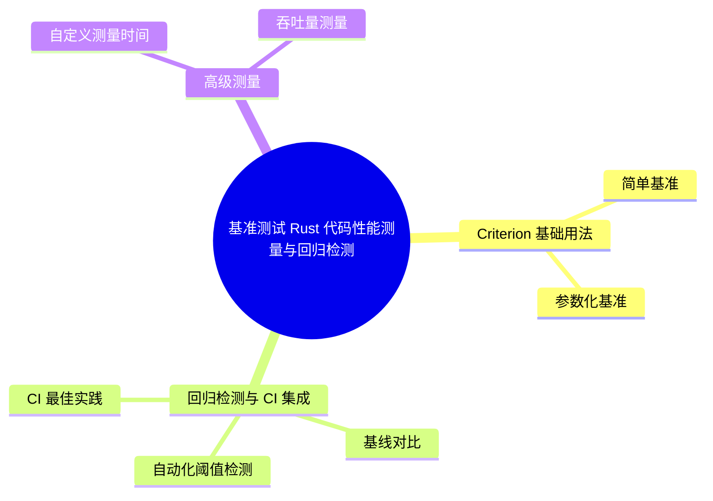

> **EN**: Benchmarking with Criterion in Rust
> **Summary**: Statistical benchmarking in Rust with Criterion.rs: multi-sample measurement with confidence intervals, parameterized and throughput benches, baseline storage for automated regression detection, CI integration, and the measurement hygiene (warm-up, noise isolation, allocator effects) needed before optimizing.
> **Rust 版本**: 1.97.0+ (Edition 2024)
> **权威来源**: [Criterion.rs Book](https://bheisler.github.io/criterion.rs/book/) · [The Rust Programming Language](https://doc.rust-lang.org/book/title-page.html) · [Rust Reference](https://doc.rust-lang.org/reference/)
> **受众**: [进阶]
> **内容分级**: [指南级]
> **Bloom 层级**: L2-L4
> **权威来源**: 本文件为 `concept/` 权威页。
> **A/S/P 标记**: **A+P** — ApplicationProcedure
> **定位**: 覆盖 Rust 生态中使用 `criterion` 进行基准测试的完整流程，从简单基准、参数化基准到回归检测与 CI 集成。
> **前置概念**: [Testing](03_testing.md) · [Performance Optimization](../10_performance/01_performance_optimization.md)
> **后置概念**: [Algorithm Engineering Practice](../11_domain_applications/08_algorithm_engineering_practice.md) · [Rust vs C++：性能与抽象对比](../../05_comparative/01_systems_languages/01_rust_vs_cpp.md)

---

# 基准测试：Rust 代码性能测量与回归检测

性能优化没有度量就是猜测。本文系统介绍 Rust 基准测试方法论，覆盖七个主题：为什么需要基准测试、Criterion 基础用法、回归检测与 CI 集成、高级测量技术、常见陷阱、flamegraph 剖析与优化工作流闭环。核心立场有三：

1. **统计显著性优先**：单次 `Instant::now()` 测量受噪声支配，Criterion 的多次采样 + 置信区间是得出“真的变快了”结论的最低标准。
2. **参数化优于单点**：只有对不同输入规模分别测量，才能区分“常数优化”与“复杂度改进”——复杂度曲线是验证 O(n log n) 优于 O(n²) 的唯一证据。
3. **回归检测自动化**：基准不进 CI 就会腐烂；`criterion` 的基线对比配合 CI 阈值报警，才能把性能当作持续维护的质量属性。

阅读路径：动机（一）→ 上手（二）→ 工程化（三、七）。

## 一、为什么需要基准测试

在优化 Rust 代码之前，必须先**可重复地测量**性能。`criterion` 是 Rust 生态事实上的统计性基准测试框架，它提供：

- 多次采样与统计置信区间
- 参数化基准（`bench_with_input`）
- 自定义测量时间与吞吐量
- 基线对比与回归检测

## 二、Criterion 基础用法

Criterion 的基准分两种形态，覆盖从单点验证到参数扫描的需求：

- **简单基准**: `c.bench_function("name", |b| b.iter(|| f(black_box(x)))`——`black_box` 阻止编译器把被测代码优化掉（常量传播会消除整个计算），`iter` 的闭包会被重复执行直到统计显著；基准函数必须**只测目标代码**，输入准备放在闭包外。
- **参数化基准**: `Benchmark::new(...).with_function(...)` + `bench_with_input` 对一组输入规模（如 n = 10/100/1000/10000）分别测量，产出的是**复杂度曲线**——这是验证“O(n log n) 实现真的优于 O(n²)”的唯一方式，单点测量看不出渐进行为。

判定依据：PR 中的性能主张若只有单点数据，应要求补参数化基准；`black_box` 缺失的基准数据一律不可信。

### 2.1 简单基准

```rust
use criterion::{black_box, criterion_group, criterion_main, Criterion};

fn fibonacci(n: u64) -> u64 {
    match n {
        0 | 1 => 1,
        n => fibonacci(n - 1) + fibonacci(n - 2),
    }
}

fn criterion_benchmark(c: &mut Criterion) {
    c.bench_function("fib 20", |b| b.iter(|| fibonacci(black_box(20))));
}

criterion_group!(benches, criterion_benchmark);
criterion_main!(benches);
```

**关键点**：

- `black_box`：阻止编译器对测试目标进行死码消除或常量折叠。
- `criterion_group!` / `criterion_main!`：组织基准并生成 `main` 入口。

### 2.2 参数化基准

```rust,ignore
use criterion::{BenchmarkId, Criterion, criterion_group, criterion_main};

fn benchmark_with_sizes(c: &mut Criterion) {
    let mut group = c.benchmark_group("vec_operations");
    for size in [10, 100, 1000, 10000].iter() {
        group.bench_with_input(BenchmarkId::from_parameter(size), size, |b, &size| {
            b.iter(|| {
                let mut vec = Vec::with_capacity(size);
                for i in 0..size {
                    vec.push(black_box(i));
                }
                vec
            });
        });
    }
    group.finish();
}

criterion_group!(benches, benchmark_with_sizes);
criterion_main!(benches);
```

## 三、回归检测与 CI 集成

基准测试的长期价值在回归检测，三个环节构成可持续的 CI 防线：

- **基线对比**: Criterion 自动把本次结果与上次基线（`target/criterion`）比较并报告变化百分比与统计显著性；本地开发靠此发现意外劣化，CI 中需要持久化基线（cache 或独立基线仓库）才能跨 runner 对比。
- **自动化阈值检测**: 常见策略是“劣化超过阈值（如 +10%）且统计显著即失败”；阈值必须按基准的噪声水平设定——IO 相关基准噪声大，阈值过紧会产生大量误报导致警报疲劳。
- **CI 最佳实践**: 基准 runner 需专用（不与构建任务共享机器）、CPU 频率锁定、禁用 Turbo Boost；容器化 CI 的邻居噪声是基准数据失真的首要原因。

判定依据：没有噪声控制措施的 CI 基准只会产生随机红绿灯——宁可只跑编译期检查 + 本地定期基准，也不要虚假自动化的回归门禁。

### 3.1 基线对比

```bash
# 保存基线
cargo bench --save-baseline before

# 修改代码后再次运行
cargo bench --save-baseline after

# 比较两次结果
cargo install critcmp
critcmp before after
```

### 3.2 自动化阈值检测

```rust
const THRESHOLD: f64 = 1.05; // 允许 5% 波动

fn check_regression(baseline: f64, current: f64) -> bool {
    current / baseline > THRESHOLD
}
```

### 3.3 CI 最佳实践

- 在隔离且稳定的运行器上执行 `cargo bench`。
- 固定 CPU 频率、禁用 Turbo Boost、隔离其他负载。
- 将 `target/criterion` 报告作为 artifact 保存。
- 对关键基准设置 ≥5% 的回归门槛，失败时阻断合并。

## 四、高级测量

高级测量能力解决两类“默认配置测不准”的场景：

- **自定义测量时间**: `measurement_time()` 与 `sample_size()` 控制统计投入——微秒级快函数需要长测量时间摊薄计时器开销，秒级慢函数需要减少样本数控制总时长；`warm_up_time` 对缓存敏感的代码（如内存分配器行为）必须显式设置，否则前几次迭代的冷缓存数据污染分布。
- **吞吐量测量**: `Throughput::Bytes(n)` / `Throughput::Elements(n)` 让 Criterion 直接报告 MB/s 或 elements/s——把“每次迭代耗时”换算为业务可理解的速率，对编解码、解析、序列化类代码是唯一有沟通价值的呈现方式。

判定依据：测量配置的原则是“让单次迭代的量化误差 < 1%”——快函数加长测量，慢函数减样本；报告一律换算为吞吐单位。

### 4.1 自定义测量时间

```rust
use criterion::{Criterion, measurement::WallTime};
use std::time::Duration;

fn custom_measurement(c: &mut Criterion<WallTime>) {
    let mut group = c.benchmark_group("custom");
    group.measurement_time(Duration::from_secs(10));
    group.sample_size(1000);
    group.warm_up_time(Duration::from_secs(3));
    group.bench_function("my_function", |b| b.iter(|| {}));
    group.finish();
}
```

### 4.2 吞吐量测量

```rust
use criterion::{Criterion, Throughput, BenchmarkId};

fn throughput_benchmark(c: &mut Criterion) {
    let mut group = c.benchmark_group("throughput");
    for size in [1024, 10240, 102400].iter() {
        group.throughput(Throughput::Bytes(*size as u64));
        let data = vec![0u8; *size];
        group.bench_with_input(BenchmarkId::from_parameter(size), size, |b, _| {
            b.iter(|| data.iter().filter(|&&x| x > 128).count())
        });
    }
    group.finish();
}
```

## 五、基准测试检查清单

- [ ] 使用 `black_box` 防止编译器优化干扰测量。
- [ ] 覆盖多个输入规模，避免单点结论。
- [ ] 固定运行环境（CPU、内存、负载隔离）。
- [ ] 多次运行并记录系统信息。
- [ ] 与上一次基线对比，识别统计显著性回归。
- [ ] 对关键路径设置 CI 阈值并自动告警。

## 六、来源

- [Criterion.rs Book](https://bheisler.github.io/criterion.rs/book/)
- [Rust Performance Book](https://nnethercote.github.io/perf-book/)

---

## ⚠️ 反例与陷阱

**反例：stable 工具链上使用内置 `#[bench]`** —— 内置 bench 框架至今未稳定。

```rust,compile_fail
// rustc 1.97.0 实测：error[E0554]: `#![feature]` may not be used
// on the stable release channel
#![feature(test)]
extern crate test;
#[bench]
fn b(b: &mut test::Bencher) { b.iter(|| 1 + 1); }
fn main() {}
```

**修正对照**：stable 上用 criterion（统计严谨的第三方基准框架）；`#[bench]` 仅限 nightly。

```rust
// criterion 用法（Cargo.toml: [dev-dependencies] criterion = "0.5"）
// benches/my_bench.rs:
// use criterion::{criterion_group, criterion_main, Criterion};
// fn bench(c: &mut Criterion) { c.bench_function("add", |b| b.iter(|| 1 + 1)); }
// criterion_group!(benches, bench);
// criterion_main!(benches);
fn main() {}
```

**陷阱要点**：内置 `test` crate 长期停留在 nightly（`E0554`），且只给均值不给置信区间；生产基准测试的事实标准是 criterion + `cargo bench` 的 bench target 约定。

---

## 国际权威参考 / International Authority References（P0 官方 · P1 学术 · P2 生态）

> 依据 `AGENTS.md` §2「对齐网络国际化权威内容」补充：仅追加已验证可达的权威链接，不改动正文事实。

- **P1 学术/形式化**: [Mytkowicz et al.: Producing Wrong Data Without Doing Anything Obviously Wrong! (ASPLOS 2009)](https://dl.acm.org/doi/10.1145/1508284.1508275)

---

## 🧭 思维导图（Mindmap）



> **认知功能**: 本 mindmap 从本页「基准测试 Rust 代码性能测量与回归检测」的章节结构提炼，一级分支对应核心主题，叶子节点为关键子概念，可作为本页的快速导航与复习索引。
