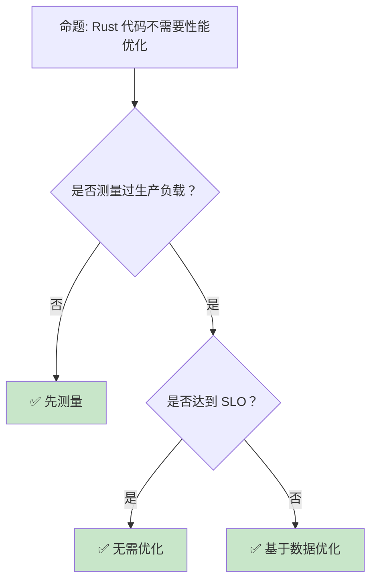
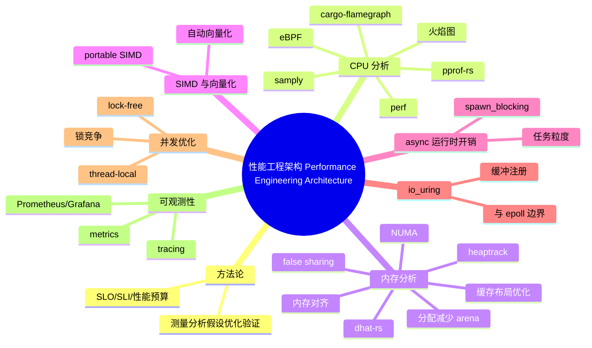

> **内容分级**: [专家级]
> **代码状态**: ✅ 含可编译示例
> **定理链**: N/A — 描述性/综述性/导航性文档，不涉及形式化定理链
>

# 性能工程架构：系统级测量、分析与优化

> **EN**: Performance Engineering Architecture
> **Summary**: Performance Engineering Architecture — system-level performance methodology: flamegraphs (perf/cargo-flamegraph/samply), heap profiling (dhat-rs/heaptrack), cache/layout, allocation reduction, SIMD/portable SIMD, async overhead, io_uring, lock contention, NUMA, pprof, tracing/metrics, and SLO/SLI/performance budgets, with Rust examples and ecosystem tooling.
> **Rust 版本**: 1.97.0+ (Edition 2024)
> **受众**: [进阶]
> **Bloom 层级**: L6
> **权威来源**: 本文件为 `concept/` 权威页。
> **A/S/P 标记**: **P+S+A** — Procedure + Structure + Application
> **双维定位**: P×Eva — 评估系统级性能瓶颈与优化策略
> **前置概念**: [Performance Optimization](01_performance_optimization.md) · [Concurrency](../../03_advanced/00_concurrency/01_concurrency.md) · [Async/Await](../../03_advanced/01_async/01_async.md) · [Memory Management](../../02_intermediate/02_memory_management/01_memory_management.md)
> **后置概念**: [Data-Intensive Systems Design](../06_data_and_distributed/10_data_intensive_systems_design.md) · [Cloud Native](../04_web_and_networking/02_cloud_native.md) · [Microservice Patterns](../03_design_patterns/05_microservice_patterns.md)
>
> **来源**: [Systems Performance — Brendan Gregg](http://www.brendangregg.com/systems-performance-book.html) · [BPF Performance Tools — Brendan Gregg](http://www.brendangregg.com/bpf-performance-tools-book.html) · [Flamegraphs](https://www.brendangregg.com/flamegraphs.html) · [cargo-flamegraph](https://github.com/flamegraph-rs/flamegraph) · [samply](https://github.com/mstange/samply) · [Linux perf](https://perf.wiki.kernel.org/) · [eBPF.io](https://ebpf.io/) · [dhat-rs](https://docs.rs/dhat/latest/dhat/) · [heaptrack](https://github.com/KDE/heaptrack) · [pprof-rs](https://github.com/tikv/pprof-rs) · [bumpalo](https://docs.rs/bumpalo/) · [The Rust Performance Book](https://nnethercote.github.io/perf-book/) · [tokio-uring](https://docs.rs/tokio-uring/) · [io_uring paper](https://kernel.dk/io_uring.pdf)

---

> **来源**: [Google SRE Book — SLI/SLO](https://sre.google/sre-book/table-of-contents/) · [Site Reliability Engineering Workbook](https://sre.google/workbook/table-of-contents/) · [Criterion.rs](https://bheisler.github.io/criterion.rs/book/) · [tokio-tracing](https://docs.rs/tracing/latest/tracing/) · [metrics-rs](https://docs.rs/metrics/latest/metrics/) · [numactl](https://linux.die.net/man/8/numactl) · [Effective Rust — Brown University](https://rust-book.cs.brown.edu/) · [Zero To Production in Rust](https://www.zero-to-production.com/)

## 📑 目录

- [性能工程架构：系统级测量、分析与优化](#性能工程架构系统级测量分析与优化)
  - [📑 目录](#-目录)
  - [一、核心概念](#一核心概念)
    - [1.1 性能工程的方法论](#11-性能工程的方法论)
    - [1.2 测量 vs 猜测](#12-测量-vs-猜测)
    - [1.3 性能预算与 SLO/SLI](#13-性能预算与-slosli)
  - [二、CPU 与火焰图分析](#二cpu-与火焰图分析)
    - [2.1 Linux perf 与火焰图](#21-linux-perf-与火焰图)
    - [2.2 pprof-rs 与 Rust 程序](#22-pprof-rs-与-rust-程序)
    - [2.3 eBPF 动态追踪](#23-ebpf-动态追踪)
    - [2.4 cargo-flamegraph：一行命令生成火焰图](#24-cargo-flamegraph一行命令生成火焰图)
    - [2.5 samply：Firefox Profiler 格式的采样器](#25-samplyfirefox-profiler-格式的采样器)
  - [三、内存分析](#三内存分析)
    - [3.1 堆分析：dhat-rs 与 heaptrack](#31-堆分析dhat-rs-与-heaptrack)
    - [3.2 内存对齐与 false sharing](#32-内存对齐与-false-sharing)
    - [3.3 NUMA 与本地性](#33-numa-与本地性)
    - [3.4 缓存与内存布局优化](#34-缓存与内存布局优化)
    - [3.5 分配减少：arena、对象池与预分配](#35-分配减少arena对象池与预分配)
    - [3.6 SIMD 与 portable SIMD](#36-simd-与-portable-simd)
    - [3.7 async 运行时开销](#37-async-运行时开销)
    - [3.8 io\_uring 深入：与 epoll 的边界](#38-io_uring-深入与-epoll-的边界)
  - [四、并发与锁](#四并发与锁)
    - [4.1 锁竞争检测](#41-锁竞争检测)
    - [4.2 Lock-free 与 Wait-free](#42-lock-free-与-wait-free)
  - [五、可观测性与指标](#五可观测性与指标)
    - [5.1 tracing 与结构化日志](#51-tracing-与结构化日志)
    - [5.2 metrics 与性能仪表板](#52-metrics-与性能仪表板)
  - [六、架构决策矩阵](#六架构决策矩阵)
  - [七、反命题与边界分析](#七反命题与边界分析)
    - [7.1 反命题树](#71-反命题树)
    - [7.2 边界极限](#72-边界极限)
  - [八、常见陷阱](#八常见陷阱)
  - [九、边界测试](#九边界测试)
    - [9.1 边界测试：perf 采样偏差（测量误差）](#91-边界测试perf-采样偏差测量误差)
    - [9.2 边界测试：false sharing 导致伪竞争（运行时性能退化）](#92-边界测试false-sharing-导致伪竞争运行时性能退化)
    - [9.3 边界测试：堆分析器本身改变分配行为（测量误差）](#93-边界测试堆分析器本身改变分配行为测量误差)
  - [反例 / 边界测试 / 常见陷阱](#反例--边界测试--常见陷阱)
    - [在 debug 模式下做性能剖析并据此优化](#在-debug-模式下做性能剖析并据此优化)
  - [相关概念](#相关概念)
  - [🧭 思维导图（Mindmap）](#-思维导图mindmap)

**变更日志**:

- v1.0 (2026-07-30): Wave 9 新增——性能工程架构权威页，覆盖火焰图、perf/eBPF、堆分析、锁竞争、NUMA、内存对齐、pprof、tracing/metrics、SLO/SLI 与性能预算
- v1.1 (2026-07-31): Wave D 扩展——新增 cargo-flamegraph、samply、缓存/布局优化、分配减少、SIMD/portable SIMD、async 运行时开销、io_uring 深入

---

## 一、核心概念

性能工程架构关注**系统级性能**：不是单个函数的优化，而是识别端到端瓶颈、建立测量基线、设定性能预算，并通过可观测性持续监控。

```text
性能工程架构的层次:

  业务层
  ├── SLO/SLI/性能预算
  ├── 用户体验指标（延迟、错误率、吞吐）
  └── 成本约束

  应用层
  ├── 算法与数据结构
  ├── 并发模型
  ├── 内存分配模式
  └── 框架与库选择

  运行时层
  ├── 垃圾回收 / 分配器（jemalloc/mimalloc）
  ├── 线程调度
  └── async 运行时（tokio）

  系统层
  ├── CPU 缓存、分支预测、流水线
  ├── 内存带宽与 NUMA
  ├── 磁盘 I/O 与网络 I/O
  └── 内核调度与中断
```

> **认知功能**: 系统级性能工程的核心是**先测量，后假设，再验证**。过早优化和盲目使用 unsafe 都是反模式。
> [来源: [Systems Performance — Brendan Gregg](http://www.brendangregg.com/systems-performance-book.html)]

---

### 1.1 性能工程的方法论

> **[The Rust Performance Book](https://nnethercote.github.io/perf-book/)** 和系统性能工程都强调同一个流程：**测量 → 分析 → 假设 → 优化 → 验证**。

```text
性能工程五步法:

  1. 定义目标
     ├── 延迟 P50/P95/P99
     ├── 吞吐（req/s, events/s）
     ├── 资源利用率上限
     └── 成本约束

  2. 建立基线
     ├── Criterion 微基准
     ├── 负载测试（k6, locust, wrk）
     └── 生产流量 replay

  3. 定位瓶颈
     ├── CPU: perf / flamegraph
     ├── 内存: dhat / heaptrack
     ├── I/O: iostat, bpftrace
     └── 锁: perf lock, tokio-console

  4. 提出假设并优化
     ├── 只优化热点
     ├── 一次只改一个变量
     └── 记录改动与预期收益

  5. 验证回归
     ├── 重新测量
     ├── CI 性能回归检测
     └── 监控系统长期趋势
```

> **关键洞察**: 80% 的性能问题来自 20% 的代码。火焰图和剖析器的价值在于帮助识别这 20%。
> [来源: [Amdahl's Law](https://en.wikipedia.org/wiki/Amdahl%27s_law)]

---

### 1.2 测量 vs 猜测

性能工程最常见的反模式是**基于直觉而非数据优化**。Rust 社区中流传的许多"常识"在测量后往往不成立：

| 常见假设 | 实际测量结果 |
|:---|:---|
| 迭代器比循环慢 | release 模式下通常相同 |
| `Rc` 很慢 | 引用计数通常不是热点 |
| `unsafe` 一定更快 | 多数情况下与安全代码无差异 |
| 泛型导致二进制膨胀 | 确实会膨胀，但通常不影响运行时性能 |
| 小结构体复制很贵 | 寄存器内联后通常免费 |

> **工程纪律**: 任何优化提交必须附上前后的基准数据。没有测量证据的优化应被拒绝。
> [来源: [Rust Performance Book — Profiling](https://nnethercote.github.io/perf-book/profiling.html)]

---

### 1.3 性能预算与 SLO/SLI

> **[Google SRE Book](https://sre.google/sre-book/table-of-contents/)** 中，SLI（Service Level Indicator）是指标，SLO（Service Level Objective）是目标，SLA（Service Level Agreement）是对外承诺。性能预算是工程团队内部把 SLO 拆解到各组件的定量约束。

| 概念 | 定义 | 示例 |
|:---|:---|:---|
| **SLI** | 服务质量指标 | P99 延迟 200ms |
| **SLO** | 目标 | P99 延迟 ≤ 200ms，错误率 ≤ 0.1% |
| **SLA** | 对外合同 | 未达 SLO 时赔偿客户 |
| **性能预算** | 组件级约束 | API 网关占 20ms，数据库查询占 80ms |

**性能预算示例**：

```text
端到端请求: 100ms SLO
├── TLS 握手: 5ms
├── 认证/授权: 10ms
├── 业务逻辑: 40ms
├── 数据库查询: 30ms
├── 序列化/网络: 10ms
└── 余量: 5ms
```

> **关键洞察**: 性能预算把"系统要快"转化为可执行的工程约束，并在架构评审中作为门禁。
> [来源: [Google SRE Workbook](https://sre.google/workbook/table-of-contents/)]

---

## 二、CPU 与火焰图分析

### 2.1 Linux perf 与火焰图

> **[perf](https://perf.wiki.kernel.org/)** 是 Linux 内核提供的性能剖析工具，通过 PMU（Performance Monitoring Unit）或软件中断采样 CPU 事件。**火焰图（Flame Graph）** 将采样结果按调用栈宽度可视化，宽层即热点。

```bash
# 1. 安装火焰图工具
sudo apt install linux-tools-common linux-tools-generic

# 2. 采样
perf record -F 99 -g -- cargo run --release

# 3. 生成折叠栈
perf script | stackcollapse-perf.pl > out.folded

# 4. 生成火焰图
flamegraph.pl out.folded > flamegraph.svg
```

**读火焰图的纪律**：

- **宽度 = 时间占比**，高度 = 调用深度。
- 看底部的宽函数，而不是顶部的高塔。
- 颜色通常无意义，只用于区分相邻栈帧。

> **关键洞察**: 火焰图是系统级性能分析最直观的工具。它帮助团队从"我觉得这里慢"转向"数据表明这里占 35% CPU"。
> [来源: [Brendan Gregg — Flame Graphs](https://www.brendangregg.com/flamegraphs.html)]

---

### 2.2 pprof-rs 与 Rust 程序

> **[pprof-rs](https://github.com/tikv/pprof-rs)** 是 TiKV 团队开发的 Rust CPU profiler，可直接在 Rust 程序内采样并生成 pprof 兼容格式，适合集成到生产环境或测试脚本。

```rust,ignore
// 依赖: pprof = { version = "0.13", features = ["flamegraph"] }
use pprof::ProfilerGuard;
use std::fs::File;
use std::io::Write;

fn main() -> anyhow::Result<()> {
    let guard = ProfilerGuard::new(100)?;

    // 运行被测代码
    run_workload();

    if let Ok(report) = guard.report().build() {
        let mut file = File::create("profile.pb")?;
        let profile = report.pprof()?;
        file.write_all(&profile)?;

        // 生成火焰图
        let mut flamegraph = File::create("flamegraph.svg")?;
        report.flamegraph(&mut flamegraph)?;
    }

    Ok(())
}
```

> **关键洞察**: pprof-rs 的优势是**可编程**——可以嵌入到 CI、集成测试或生产环境的特定路径中，而不仅依赖外部 perf。
> [来源: [pprof-rs](https://github.com/tikv/pprof-rs)]

---

### 2.3 eBPF 动态追踪

> **[eBPF](https://ebpf.io/)** 允许在内核中安全地运行沙箱程序，用于动态追踪系统调用、网络包、文件 I/O 等，而不需要修改内核或重启服务。

**eBPF 在性能工程中的用途**：

| 用途 | 工具 | 场景 |
|:---|:---|:---|
| 系统调用追踪 | `bpftrace` | 高 syscalls/sec 分析 |
| 网络性能 | `tc-bpf`, `xdp` | 包处理延迟、丢包 |
| 文件 I/O | `biosnoop`, `ext4slower` | 慢磁盘操作定位 |
| 调度分析 | `runqlat`, `cpudist` | 调度延迟、CPU 排队 |
| Rust USDT | `tokio-tracing` + eBPF | 用户态动态探针 |

```bash
# 示例：统计每个进程的 syscalls 频率
bpftrace -e 'tracepoint:raw_syscalls:sys_enter { @syscalls[comm] = count(); }'

# 示例：查看 Rust 程序的 off-CPU 时间
bpftrace -e 'profile:hz:99 /comm == "my-rust-app"/ { @stack[kstack] = count(); }'
```

> **关键洞察**: eBPF 把 Linux 内核变成可观测平台。对于 Rust 服务，结合 USDT（User Statically-Defined Tracing）可以低开销地追踪应用级事件。
> [来源: [BPF Performance Tools](http://www.brendangregg.com/bpf-performance-tools-book.html)]

---

### 2.4 cargo-flamegraph：一行命令生成火焰图

> **[cargo-flamegraph](https://github.com/flamegraph-rs/flamegraph)** 是 Rust 生态的火焰图生成工具，封装了 `perf`（Linux）/ `dtrace`（macOS）采样与 Brendan Gregg 的火焰图脚本，使用 `cargo flamegraph --release` 即可直接得到 SVG。

```bash
# 安装
cargo install flamegraph

# 对默认二进制生成火焰图（默认 --release）
cargo flamegraph

# 指定 bench target 与自定义参数
cargo flamegraph --bench my_bench -- --ignored

# 输出文件：flamegraph.svg
```

**与 `perf` 的关系**：

| 维度 | 手动 `perf` | `cargo flamegraph` |
|:---|:---|:---|
| 采样后端 | Linux `perf` | Linux `perf` / macOS `dtrace` / Windows xperf |
| 调用栈解析 | 需手动 `stackcollapse-perf.pl` | 自动解析并生成 SVG |
| Rust 符号 | 需 `RUSTFLAGS="-C force-frame-pointers=yes"` | 默认尝试；建议显式设置 |
| 适用场景 | 服务器/容器精细控制 | 本地快速定位热点 |

**关键纪律**：

- 始终加 `--release`；debug 模式的调用栈与热点分布和线上差异巨大。
- 在 CI/容器内使用时确保 `perf_event_paranoid` 允许用户态采样。
- 对异步程序，宽塔可能落在 `poll` 调度层，需结合 `tracing` span 才能定位业务 handler。

> **关键洞察**: `cargo flamegraph` 把“从采样到可视化”的流程压缩为一条命令，降低了火焰图的使用门槛，但测量纪律（release、frame pointers、足够样本）仍需人工保证。
> [来源: [cargo-flamegraph README](https://github.com/flamegraph-rs/flamegraph)] · [来源: [Brendan Gregg — Flame Graphs](https://www.brendangregg.com/flamegraphs.html)]

---

### 2.5 samply：Firefox Profiler 格式的采样器

> **[samply](https://github.com/mstange/samply)** 是 Mozilla 开发的采样 profiler，输出 **Firefox Profiler** 兼容格式（支持时间轴、线程、标记），特别适合分析 Rust 程序的时序行为与多线程交互。

```bash
# 安装
cargo install samply

# 对 release 二进制采样并自动打开浏览器（生成可交互的 profiler 视图）
samply record ./target/release/myapp --arg value

# 也可以指定输出 JSON 后导入 https://profiler.firefox.com
samply record -o profile.json ./target/release/myapp
```

**与 `perf`/flamegraph 的互补场景**：

| 场景 | 推荐工具 |
|:---|:---|
| 只看 CPU 热点占比 | `cargo flamegraph` / `perf` |
| 观察多线程时序、阻塞、锁等待 | `samply` |
| macOS 本地开发 | `samply`（dtrace 需要 root，samply 更轻量） |
| 需要可共享的 Web 可视化 | `samply`（Firefox Profiler URL） |
| CI 自动化回归 | `perf` / `pprof-rs` |

> **关键洞察**: `samply` 的价值不在“找出最热函数”，而在“理解函数何时被调用、与谁并发、被什么阻塞”。对于 async/await 程序的调度卡顿分析尤为有效。
> [来源: [samply GitHub](https://github.com/mstange/samply)] · [来源: [Firefox Profiler](https://profiler.firefox.com/)]

---

## 三、内存分析

### 3.1 堆分析：dhat-rs 与 heaptrack

> **[dhat-rs](https://docs.rs/dhat/latest/dhat/)** 是 Rust 的堆分析器，来自 Valgrind 的 DHAT 工具，用于识别**分配热点、临时分配和生命周期问题**。

```rust,ignore
// 依赖: dhat = "0.3"
use dhat::{Dhat, DhatAlloc};

#[global_allocator]
static ALLOCATOR: DhatAlloc = DhatAlloc;

fn main() {
    let _dhat = Dhat::start_heap_profiling();

    // 被测代码
    process_data();
}
```

**heaptrack** 是 KDE 开发的 Linux 堆分析器，支持长时间采样和可视化：

```bash
# 录制
heaptrack ./target/release/myapp

# 分析
heaptrack --analyze heaptrack.myapp.*.gz
```

| 工具 | 特点 | 适用 |
|:---|:---|:---|
| **dhat-rs** | Rust 原生、低开销、统计分配生命周期 | 单元测试、CI |
| **heaptrack** | GUI 分析、长时间采样 | 交互式分析 |
| **valgrind massif** | 详细但慢 | 精确分析 |
| **jemalloc profiling** | 生产环境采样 | 在线诊断 |

> **关键洞察**: 内存性能问题往往来自**分配频率**而非分配大小。减少小对象分配（如热循环中的 `String`）通常比减少大对象更有收益。
> [来源: [dhat-rs](https://docs.rs/dhat/latest/dhat/)] · [来源: [heaptrack](https://github.com/KDE/heaptrack)]

---

### 3.2 内存对齐与 false sharing

> **内存对齐**影响 CPU 访问效率和 SIMD 可用性。**False sharing** 是并发性能杀手：两个线程修改同一缓存行（64 字节）中的不同变量，导致缓存行在核心间反复无效化。

**False sharing 示例**：

```rust
// ❌ 错误：两个线程修改相邻的 u64，位于同一缓存行
use std::sync::Arc;
use std::thread;

struct BadCounter {
    a: u64,
    b: u64,
}

fn main() {
    let counter = Arc::new(std::sync::Mutex::new(BadCounter { a: 0, b: 0 }));

    let c1 = Arc::clone(&counter);
    let t1 = thread::spawn(move || {
        for _ in 0..1_000_000 {
            c1.lock().unwrap().a += 1;
        }
    });

    let c2 = Arc::clone(&counter);
    let t2 = thread::spawn(move || {
        for _ in 0..1_000_000 {
            c2.lock().unwrap().b += 1;
        }
    });

    t1.join().unwrap();
    t2.join().unwrap();
}
```

> 注意：上述示例还使用了 `Mutex`，竞争本身已是瓶颈。更典型的 false sharing 场景是两个原子变量被不同线程修改。

**修正：使用 `#[repr(align(64))]` 让变量位于不同缓存行**：

```rust
use std::sync::atomic::{AtomicU64, Ordering};
use std::thread;

#[repr(align(64))]
struct PaddedCounter {
    value: AtomicU64,
}

fn main() {
    let a = PaddedCounter { value: AtomicU64::new(0) };
    let b = PaddedCounter { value: AtomicU64::new(0) };

    thread::scope(|s| {
        s.spawn(|| {
            for _ in 0..10_000_000 {
                a.value.fetch_add(1, Ordering::Relaxed);
            }
        });
        s.spawn(|| {
            for _ in 0..10_000_000 {
                b.value.fetch_add(1, Ordering::Relaxed);
            }
        });
    });

    println!("{} {}", a.value.load(Ordering::Relaxed), b.value.load(Ordering::Relaxed));
}
```

> **关键洞察**: False sharing 不会导致错误结果，但会显著降低多核扩展性。padding 到缓存行大小是常见优化。
> [来源: [Rust Performance Book — Cache Performance](https://nnethercote.github.io/perf-book/type-sizes.html)]

---

### 3.3 NUMA 与本地性

> **NUMA（Non-Uniform Memory Access）** 架构中，每个 CPU 插槽有本地内存；访问远程内存延迟更高。性能敏感应用需要考虑 NUMA 本地性。

```text
NUMA 优化原则:

  1. 线程绑定到本地 NUMA 节点
     ├── numactl --cpunodebind=0 --membind=0 ./app
     └── 或 pthread_setaffinity_np

  2. 内存分配本地性
     ├── 使用 localalloc / jemalloc 的 NUMA 感知
     └── 避免跨节点频繁访问

  3. 数据分区
     ├── 每个 NUMA 节点处理自己的数据分区
     └── 减少跨节点流量
```

**Rust 中的 NUMA 感知**：

- Rust 标准库不直接暴露 NUMA API，但可通过 `libc` 调用 `numa_*` 函数。
- 使用 `hwloc` 库绑定线程到特定核心/NUMA 节点。
- 容器环境中 NUMA 拓扑常被抽象化，需根据部署环境评估。

> **关键洞察**: NUMA 本地性对超高性能场景（如数据库、HPC）至关重要，但对普通 Web 服务影响较小。优化前先确认瓶颈确实在内存访问。
> [来源: [NUMA FAQ](https://www.kernel.org/doc/html/latest/admin-guide/mm/numa-memory-policy.html)]

---

### 3.4 缓存与内存布局优化

> **CPU 缓存层次**决定了程序实际能跑多快。Rust 程序员能直接控制的是**结构体字段顺序、对齐、热字段聚簇**，让频繁访问的数据落在同一缓存行，减少 cache miss。

**字段排序影响结构体大小与缓存效率**：

```rust
// ❌ 差布局：大量 padding，64 字节只装 3 个有效字段
#[derive(Default)]
struct BadLayout {
    flag: bool,      // 1 + 7 padding
    id: u64,         // 8
    count: u32,      // 4
    name: [u8; 4],   // 4
} // 24 bytes

// ✅ 好布局：按大小降序排列，padding 最小
#[derive(Default)]
struct GoodLayout {
    id: u64,         // 8
    count: u32,      // 4
    name: [u8; 4],   // 4
    flag: bool,      // 1 + 7 padding
} // 24 bytes（但热字段连续）
```

> 判定依据：可用 `cargo build --release` 后 `std::mem::size_of::<T>()` 实测；对热点结构体，用 `#[repr(C)]` 显式控制布局时需谨慎，因为默认 Rust 会重排字段优化。

**热字段聚簇**：把同一条代码路径访问的字段放在一起，避免跨缓存行读取。例如网络包头解析时，把长度、类型、标志位放在结构体前 8 字节。

> [来源: [Rust Performance Book — Type Sizes](https://nnethercote.github.io/perf-book/type-sizes.html)]

---

### 3.5 分配减少：arena、对象池与预分配

> **分配频率**常常是比分配大小更关键的性能瓶颈。Rust 中常用三种技术减少分配：**arena（ bump allocator ）**、**对象池**、**预分配容器容量**。

```rust
// ✅ 预分配容量，避免热循环中反复 realloc
let mut buf = Vec::with_capacity(1024);
for item in items {
    buf.push(item);
}

// ✅ bumpalo：短期对象的快速分配与一次性释放
use bumpalo::Bump;
let arena = Bump::new();
let parsed: &[u8] = arena.alloc_slice_copy(input);
// 离开作用域时整个 arena 一起释放
```

**对象池示例（连接/缓冲区复用）**：

```rust,ignore
// 使用 crossbeam::queue::ArrayQueue 做无锁缓冲区池
use crossbeam::queue::ArrayQueue;

static POOL: once_cell::sync::Lazy<ArrayQueue<Vec<u8>>> =
    once_cell::sync::Lazy::new(|| ArrayQueue::new(128));

fn acquire_buffer() -> Vec<u8> {
    POOL.pop().unwrap_or_else(|| Vec::with_capacity(8192))
}

fn release_buffer(mut buf: Vec<u8>) {
    buf.clear();
    let _ = POOL.push(buf);
}
```

**常见策略矩阵**：

| 问题 | 方案 | 代表 crate |
|:---|:---|:---|
| 热循环中小对象频繁分配 | arena / bump allocator | `bumpalo` |
| 解析器产生大量临时对象 | arena + 生命周期借用 | `bumpalo` |
| 网络缓冲区反复 alloc/free | 对象池 | `crossbeam::queue::ArrayQueue` |
| Vec 动态扩容 | 预分配 capacity | std |
| 短字符串分配 | 小字符串优化 | `smol_str`, `compact_str` |

> **关键洞察**: arena 的“一起释放”语义与 Rust 所有权模型天然契合——用短期借用的 arena 替代大量独立 Box，能显著降低分配器压力，但要求被分配对象的生命周期不超过 arena。
> [来源: [Rust Performance Book — Heap Allocations](https://nnethercote.github.io/perf-book/heap-allocations.html)] · [来源: [bumpalo docs](https://docs.rs/bumpalo/)]

---

### 3.6 SIMD 与 portable SIMD

> **SIMD（Single Instruction Multiple Data）** 允许一条指令同时处理多个数据元素。Rust 有两条使用路径：**编译器自动向量化**（推荐优先）与 **显式 portable SIMD**（`std::simd`，nightly 特性 `portable_simd`，或在稳定版用 `packed_simd_2`/`wide`）。

**自动向量化**：

```rust
pub fn sum_squares(v: &[f64]) -> f64 {
    v.iter().map(|x| x * x).sum()
}
```

编译器在 `-C target-cpu=native` 或 `-C target-feature=+avx2` 下常能自动向量化。先用 `cargo asm` 确认是否生成 `vfmadd`/`vpadd` 等 SIMD 指令，再决定是否手写 SIMD。

**显式 portable SIMD（nightly）**：

```rust,ignore
#![feature(portable_simd)]
use std::simd::{f64x4, Simd};

pub fn sum_squares_simd(v: &[f64]) -> f64 {
    let chunks = v.chunks_exact(4);
    let remainder = chunks.remainder();
    let sum_vec: f64x4 = chunks.map(|c| Simd::from_array([c[0], c[1], c[2], c[3]]))
        .map(|x| x * x)
        .fold(f64x4::splat(0.0), |a, b| a + b);
    let mut sum = sum_vec.reduce_add();
    for &x in remainder {
        sum += x * x;
    }
    sum
}
```

**陷阱**：

- 手动 SIMD 代码可读性差、边界处理繁琐，常不如编译器自动向量化。
- 跨平台需处理不同 vector width（SSE/AVX/AVX-512/NEON）。
- `std::simd` 尚未 stable；稳定版可用 `wide` / `packed_simd_2`。

> **关键洞察**: SIMD 的首要原则是“先测自动向量化”。手动 SIMD 应留给已确认的热点且数据宽度规整的场景；过早手动 SIMD 是常见的过度优化。
> [来源: [Rust Performance Book — SIMD](https://nnethercote.github.io/perf-book/simd.html)] · [来源: [std::simd tracking issue](https://github.com/rust-lang/rust/issues/86656)]

---

### 3.7 async 运行时开销

> **async/await 不是零成本抽象的上限**。任务创建、waker 唤醒、跨线程调度都有开销；过度细分任务或滥用 `spawn` 会让运行时开销超过业务收益。

**任务内存成本**：Tokio 任务至少包含 future 本身、join handle 元数据、waker 状态，通常数百字节到数 KB。把每个包都 `spawn` 会迅速耗尽内存。

```rust,ignore
// ❌ 过度细分：每个元素都 spawn
for item in items {
    tokio::spawn(process_one(item));
}

// ✅ 批量处理或 stream 流水线
use futures::stream::{self, StreamExt};
stream::iter(items)
    .map(|x| async move { process_one(x).await })
    .buffer_unordered(64)
    .collect::<Vec<_>>()
    .await;
```

**阻塞操作必须 offload**：

```rust,ignore
// ❌ 在 async worker 线程执行 CPU 密集或同步 I/O
async fn bad() {
    std::thread::sleep(std::time::Duration::from_secs(1)); // 阻塞 worker
}

// ✅ 使用 spawn_blocking
tokio::task::spawn_blocking(|| {
    std::thread::sleep(std::time::Duration::from_secs(1));
}).await?;
```

**关键指标**：

- 任务调度延迟（tokio RuntimeMetrics）
- worker 线程 starvation 时间
- spawned task 总数与完成速率

> **关键洞察**: async 的收益来自 I/O 等待期间的并发复用。任务粒度应匹配 I/O 边界，而不是把同步代码拆成无数 future。
> [来源: [Tokio RuntimeMetrics](https://docs.rs/tokio/latest/tokio/runtime/struct.RuntimeMetrics.html)] · [来源: [Rust Async Book](https://rust-lang.github.io/async-book/)]

---

### 3.8 io_uring 深入：与 epoll 的边界

> **`io_uring`**（Linux 5.1+）用一对共享内存环形队列（SQ/CQ）替代“一次 I/O 一次 syscall”，在 NVMe/高速网络场景下能显著降低延迟与 CPU 占用。Rust 生态主要通过 `tokio-uring` 与 `io-uring` crate 使用。

**缓冲注册的所有权约束**：

`IORING_REGISTER_BUFFERS` 预注册内存后，内核可直接 DMA。`tokio-uring` 要求缓冲区参数为 `'static`，因为缓冲区在内核持有期间不能被 Rust 释放——这一硬件约束被编码进类型系统：

```rust,ignore
use tokio_uring::fs::File;

let buf = vec![0u8; 4096];
let file = File::open("data.bin").await?;
let (res, buf) = file.read_at(buf, 0).await;
let n = res?;
// buf 的所有权在 future 完成后返回
```

**与 epoll 的边界**：

| 场景 | 推荐 |
|:---|:---|
| 千兆以下网络、通用 Web 服务 | epoll + tokio（成熟度/可移植性） |
| NVMe 存储、高 IOPS | io_uring |
| 100K+ QPS 网络服务 + Linux 5.10+ | 评估 tokio-uring |
| 跨平台需求 | 不能用 io_uring（Linux only） |

**生产注意**：

- 内核版本探测：部分 opcode（如 `IORING_OP_READ_MULTISHOT`）需要 6.x。
- 错误处理：`io_uring` 的完成队列可能返回 `-EAGAIN`、`-EINTR`，需与 syscall 语义对齐。
- 调试难度比 epoll 高，建议先用标准 tokio 建立基线，再按 profile 证据切换。

> **关键洞察**: io_uring 是“异步 syscall 批处理”，不是银弹。只有在 IOPS/QPS 已触达 epoll 瓶颈且团队能承担 Linux 专属复杂度时才引入。
> [来源: [tokio-uring docs](https://docs.rs/tokio-uring/)] · [来源: [io_uring paper](https://kernel.dk/io_uring.pdf)]

---

## 四、并发与锁

### 4.1 锁竞争检测

> 锁竞争是并发系统性能退化的主要原因之一。检测工具包括 `perf lock`、`cargo flamegraph` 和 `tokio-console`。

```bash
# perf lock 统计锁竞争
perf lock record ./target/release/myapp
perf lock report

# tokio-console 查看 async 任务和锁等待
cargo install tokio-console
tokio-console
```

**降低锁竞争的策略**：

| 策略 | 说明 | 适用 |
|:---|:---|:---|
| **缩小临界区** | 只在锁内做必要操作 | 通用 |
| **分片锁** | 每个分片一个锁 | 高并发数据结构 |
| **读写锁** | 读多写少 | `std::sync::RwLock`, `parking_lot::RwLock` |
| **Lock-free** | 原子操作替代锁 | 计数器、队列 |
| **Thread-local** | 每个线程私有状态 | 聚合统计 |

> **关键洞察**: 持有锁期间绝不要做 I/O 或长时间计算，否则会放大锁竞争。
> [来源: [Rust Atomics and Locks — Mara Bos](https://marabos.nl/atomics/)]

---

### 4.2 Lock-free 与 Wait-free

> **Lock-free** 保证系统整体持续前进（至少一个线程前进），**Wait-free** 保证每个线程都能在有限步内完成操作。两者都通过原子操作实现，避免互斥锁。

| 特性 | Lock-free | Wait-free |
|:---|:---|:---|
| 进度保证 | 至少一个线程前进 | 所有线程都有界前进 |
| 实现复杂度 | 高 | 极高 |
| 典型结构 | 无锁队列、栈、计数器 | 少数理论研究结构 |
| ABA 问题 | 可能出现 | 避免 |
| Rust 支持 | `crossbeam` 等 crate | 较少 |

**Rust 生态**：

- `crossbeam`: 无锁数据结构（channel、epoch-based GC）。
- `lockfree`: 无锁队列、栈。
- `concurrent-queue`: 无锁 MPMC 队列。

> **关键洞察**: 无锁不是银弹。它常引入 ABA 问题、内存排序复杂性和验证难度。只有在测量证明锁是瓶颈时才考虑。
> [来源: [Rust Atomics and Locks](https://marabos.nl/atomics/)]

---

## 五、可观测性与指标

### 5.1 tracing 与结构化日志

> **[tokio-tracing](https://docs.rs/tracing/latest/tracing/)** 是 Rust 生态的事实标准可观测性框架，提供结构化日志、span 和事件，比 `log` crate 更适合性能分析。

```rust,ignore
// 依赖: tracing, tracing-subscriber
use tracing::{info, instrument};

#[instrument]
async fn handle_request(user_id: u64) -> Result<String, &'static str> {
    info!(user_id, "processing request");

    let result = do_work().await?;

    info!(latency_ms = 42, "request completed");
    Ok(result)
}
```

**tracing 在性能工程中的价值**：

- 通过 span 测量端到端延迟。
- 结构化字段便于聚合和查询。
- 与 OpenTelemetry 集成实现分布式追踪。

> **关键洞察**: 性能问题首先表现为延迟分布的变化。tracing span 是理解请求生命周期最有效的手段之一。
> [来源: [tokio-tracing](https://docs.rs/tracing/latest/tracing/)]

---

### 5.2 metrics 与性能仪表板

> **[metrics-rs](https://docs.rs/metrics/latest/metrics/)** 是 Rust 的轻量级指标抽象，支持计数器、仪表盘、直方图，可导出到 Prometheus、StatsD 等后端。

```rust,ignore
// 依赖: metrics, metrics-exporter-prometheus
use metrics::{counter, histogram, gauge};
use std::time::Instant;

fn process() {
    let start = Instant::now();
    counter!("requests_total", 1);

    do_work();

    histogram!("request_duration_seconds", start.elapsed().as_secs_f64());
    gauge!("active_connections", 42.0);
}
```

**关键性能指标**：

| 指标类型 | 示例 | 用途 |
|:---|:---|:---|
| **Counter** | 请求总数、错误总数 | 速率、比率 |
| **Gauge** | 当前连接数、队列长度 | 瞬时值 |
| **Histogram** | 请求延迟、响应大小 | 分布、分位数 |

> **关键洞察**: 指标应该驱动告警和 SLO 评估，而不是替代剖析。指标告诉你"有问题"，火焰图和追踪告诉你"为什么"。
> [来源: [metrics-rs](https://docs.rs/metrics/latest/metrics/)] · [来源: [Google SRE Book](https://sre.google/sre-book/table-of-contents/)]

---

## 六、架构决策矩阵

```text
瓶颈 → 工具 → Rust 生态

CPU 热点:
  → perf / cargo flamegraph / pprof-rs
  → 优化算法、内联、SIMD

内存分配:
  → dhat-rs / heaptrack / jemalloc profiling
  → 预分配、arena、复用缓冲区

锁竞争:
  → perf lock / tokio-console
  → 缩小临界区、分片锁、lock-free

I/O 延迟:
  → eBPF / iostat / bpftrace
  → 异步 I/O、批处理、本地缓存

网络延迟:
  → tcpdump / eBPF
  → 连接池、TLS session 复用、压缩

NUMA/缓存:
  → numactl / perf c2c
  → 线程绑定、数据分区、缓存行对齐

可观测性:
  → tracing + metrics
  → OpenTelemetry、Prometheus、Grafana
```

> **架构洞察**: 系统级性能优化应**从外向内**：先确认 SLO 缺口，再用指标定位大致方向，最后用剖析器找到具体热点。
> [来源: [Systems Performance — Brendan Gregg](http://www.brendangregg.com/systems-performance-book.html)]

---

## 七、反命题与边界分析

性能工程架构中有三个常见误判：

1. **"Rust 自动高性能，无需优化"** —— 不成立。Rust 保证零成本抽象的上限，但不保证任意组合都快；糟糕的算法和架构仍会导致性能灾难。
2. **"unsafe 是性能优化的终点"** —— 不成立。多数情况下安全 Rust 与 unsafe 性能相同；unsafe 的真实价值只在借用检查无法表达的内存复用模式。
3. **" profiling 一次就够了"** —— 不成立。工作负载、数据分布、依赖版本都会变化，性能工程是持续活动。

### 7.1 反命题树



> **认知功能**: 性能优化必须**由数据驱动**。Rust 只是消除了某些性能下限，不保证上限。
> [来源: [Rust Performance Book](https://nnethercote.github.io/perf-book/)]

### 7.2 边界极限

| **边界** | **现状** | **理论极限** | **工程影响** |
|:---|:---|:---|:---|
| **perf 采样精度** | ~99Hz 典型 | 调度噪声、CPU 变频 | 多次运行、统计显著 |
| **火焰图分辨率** | 函数级 | 内联函数不可见 | 结合 `cargo asm` |
| **堆分析开销** | 10-100x 慢（dhat） | 必须采样降低 | 生产环境用采样 profiler |
| **false sharing 检测** | `perf c2c` | 需要特定硬件支持 | 常见于高并发计数器 |
| **NUMA 本地性收益** | 10-30% | 远程内存延迟 | 大内存应用收益明显 |

> **边界要点**: 性能工程的边界主要与**测量精度、分析开销、硬件支持**和**NUMA 拓扑**相关。
> [来源: [Systems Performance — Brendan Gregg](http://www.brendangregg.com/systems-performance-book.html)]

---

## 八、常见陷阱

```text
陷阱 1: 在 debug 模式下 profiling
  ❌ cargo run（默认 debug）
     // 结果完全不代表生产

  ✅ cargo run --release 或 cargo flamegraph --release

陷阱 2: 优化非热点代码
  ❌ 投入一周优化占 0.1% 的函数
     // 投入产出比极低

  ✅ 火焰图显示 >5% 的热点才值得优化

陷阱 3: 忽视测量噪声
  ❌ 单次微基准决定重构
     // CPU 频率、缓存状态导致 5-20% 波动

  ✅ Criterion 统计方法 + 多次运行

陷阱 4: 盲目使用 unsafe
  ❌ 用 unsafe 跳过边界检查
     // 现代 CPU 分支预测使边界检查几乎免费

  ✅ 先用 safe 代码 + 剖析验证

陷阱 5: 无性能预算上线
  ❌ "上线后再优化"
     // 技术债务累积，回滚困难

  ✅ 在架构设计阶段设定 SLO 和性能预算
```

> **陷阱总结**: 性能工程的陷阱多与**错误测量、优化非热点、忽视噪声、滥用 unsafe**和**缺失性能预算**相关。
> [来源: [Donald Knuth — Premature Optimization](https://dl.acm.org/doi/10.1145/356635.356640)]

---

## 九、边界测试

性能工程的边界测试聚焦测量失真、并发伪竞争和分析器副作用。

### 9.1 边界测试：perf 采样偏差（测量误差）

```rust,ignore
// ⚠️ 风险：短运行程序无法积累足够样本
fn main() {
    do_work(); // 只运行一次，perf 样本数不足
}

// ✅ 修正：循环运行足够长时间
fn main() {
    for _ in 0..1_000_000 {
        do_work();
    }
}
```

> **修正**: perf 是采样型 profiler，短运行程序会导致样本稀疏、热点识别不准。应循环运行足够长时间，或使用 Criterion 等统计工具。
> [来源: [perf Documentation](https://perf.wiki.kernel.org/)]

### 9.2 边界测试：false sharing 导致伪竞争（运行时性能退化）

```rust,ignore
// ❌ 错误：无 padding 的原子计数器数组
use std::sync::atomic::{AtomicU64, Ordering};

let counters: Vec<AtomicU64> = (0..8).map(|_| AtomicU64::new(0)).collect();
// 8 个 AtomicU64 共 64 字节，可能全部落在同一缓存行
// 8 个线程分别更新不同 counter，却因缓存行竞争而串行化

// ✅ 修正：padding 到 64 字节
#[repr(align(64))]
struct Padded(AtomicU64);
let counters: Vec<Padded> = (0..8).map(|_| Padded(AtomicU64::new(0))).collect();
```

> **修正**: 高并发计数器必须使用缓存行对齐的 padding。`#[repr(align(64))]` 确保每个计数器独占一个缓存行。
> [来源: [Rust Performance Book — Cache Performance](https://nnethercote.github.io/perf-book/type-sizes.html)]

### 9.3 边界测试：堆分析器本身改变分配行为（测量误差）

```rust,ignore
// ⚠️ 风险：dhat-rs 会记录每次分配，运行极慢
// 生产负载直接用 dhat 会导致行为变化

// ✅ 修正：对受控测试用例使用 dhat，生产环境用采样型 profiler
// jemalloc profiling 采样示例（通过 MALLOC_CONF）:
// MALLOC_CONF=prof:true,prof_active:false,lg_prof_sample:19 ./myapp
```

> **修正**: 全量堆分析器（dhat、valgrind）会显著改变分配行为和运行时特性。生产诊断应使用采样型 profiler（jemalloc、heaptrack 采样模式）。
> [来源: [jemalloc Profiling](http://jemalloc.net/jemalloc.3.html#prof)]

---

## 反例 / 边界测试 / 常见陷阱

### 在 debug 模式下做性能剖析并据此优化

**错误场景**：开发者运行 `cargo run`（默认 debug）后看到某个函数耗时占比高，于是投入大量精力重写算法；上线 release 后发现该函数根本不是热点。

```text
❌ 错误流程：
  cargo run                  # debug 模式，未优化，含溢出检查、断言
  perf record -F 99 -g -- ./target/debug/myapp
  # 火焰图显示某函数占比 30%
  # 重写后再次用 debug 验证 → 占比下降
```

**为何错误**：debug 模式关闭了大量编译器优化，包含整数溢出检查、debug_assert、未内联的泛型等，测得的调用栈和耗时与生产 release 差异巨大；据此优化会浪费工时，甚至引入不必要的 unsafe 或复杂度。

**正确做法**：所有性能测量必须在 `--release` 或等效优化配置下进行；微基准使用 Criterion.rs 并报告统计置信区间；上线前将优化前后同时在 release 模式下对比，确保收益真实存在。

---

## 相关概念

- [Performance Optimization](01_performance_optimization.md) — 微基准、编译器优化、标准库模式
- [Concurrency](../../03_advanced/00_concurrency/01_concurrency.md) — 锁、原子操作、内存顺序
- [Async/Await](../../03_advanced/01_async/01_async.md) — 异步运行时与任务调度
- [Memory Management](../../02_intermediate/02_memory_management/01_memory_management.md) — 内存布局与分配
- [Data-Intensive Systems Design](../06_data_and_distributed/10_data_intensive_systems_design.md) — 大数据系统性能
- [Cloud Native](../04_web_and_networking/02_cloud_native.md) — 云原生可观测性
- [Microservice Patterns](../03_design_patterns/05_microservice_patterns.md) — 服务性能边界
- [Rust 执行模型同构性矩阵](../../05_comparative/00_paradigms/02_execution_model_isomorphism.md)
- [企业架构框架：TOGAF · Zachman · FEAF · BDAT](../../06_ecosystem/14_enterprise_architecture/01_enterprise_architecture_frameworks.md)

> **权威来源**: [Rust Reference](https://doc.rust-lang.org/reference/introduction.html) · [The Rust Programming Language](https://doc.rust-lang.org/book/title-page.html) · [Rust Standard Library](https://doc.rust-lang.org/std/index.html)

---

## 🧭 思维导图（Mindmap）



> **认知功能**: 本 mindmap 从本页「性能工程架构」的章节结构提炼，一级分支对应性能工程核心领域，叶子节点为关键工具/概念，可作为本页的快速导航与复习索引。
