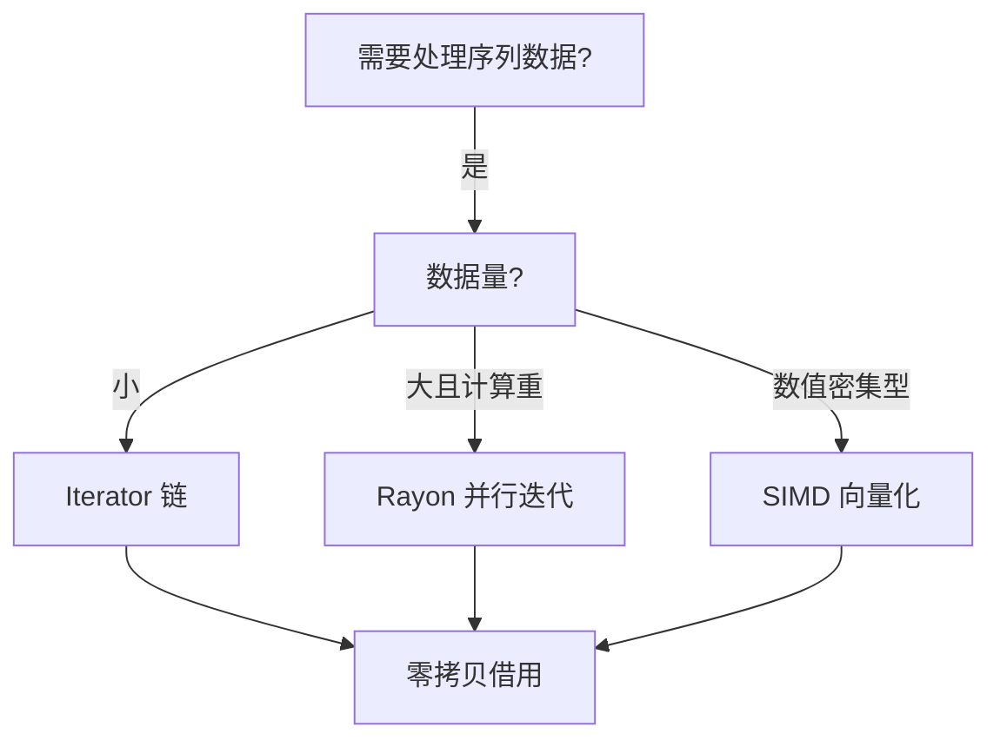
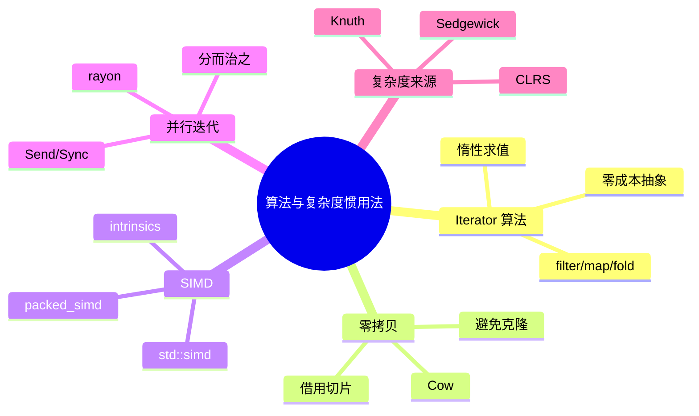

> **内容分级**: [专家级]

# 算法与复杂度惯用法（Algorithms and Complexity Idioms）

**EN**: Algorithms and Complexity Idioms in Rust
**Summary**: Rust-specific algorithmic idioms — iterator algorithms, zero-copy processing, SIMD, and parallel iterators — aligned with CLRS and Sedgewick.

> **Rust 版本**: 1.97.0+ (Edition 2024)
> **Bloom 层级**: L3-L6
> **权威来源**: 本文件为 `concept/` 权威页。
> **定位**: 补全 `concept/` 在算法领域的 Rust 特化内容：把 CLRS/Leiserson/Sedgewick 的通用算法思想翻译为 Rust 的迭代器、借用、零拷贝、SIMD、并行迭代器实现策略。
> **前置概念**: [Iterator](../../02_intermediate/07_iterators_and_closures/01_iterator_patterns.md) · [Generics](../../02_intermediate/01_generics/01_generics.md) · [Unsafe](../../03_advanced/02_unsafe/01_unsafe.md) · [Performance Optimization](01_performance_optimization.md) · [Rust vs C++](../../05_comparative/01_systems_languages/01_rust_vs_cpp.md)
> **后置概念**: [c08_algorithms crate docs](../../../crates/c08_algorithms/docs/README.md) · [Idioms Spectrum](../03_design_patterns/02_idioms_spectrum.md)

---

> **来源 / Provenance**:
> [Cormen, Leiserson, Rivest & Stein — *Introduction to Algorithms*, 4th ed.](https://mitpress.mit.edu/9780262046305/introduction-to-algorithms/) ·
> [Sedgewick & Wayne — *Algorithms*, 4th ed.](https://algs4.cs.princeton.edu/home/) ·
> [Knuth — *The Art of Computer Programming*](https://www-cs-faculty.stanford.edu/~knuth/taocp.html) ·
> [The Rust Performance Book](https://nnethercote.github.io/perf-book/) ·
> [Rayon docs](https://docs.rs/rayon/latest/rayon/) ·
> [packed_simd docs](https://docs.rs/packed_simd/latest/packed_simd/)

---

## 一、权威定义

**算法惯用法**: 在 Rust 中表达经典算法思想时，利用所有权、借用、迭代器、trait 等语言特性形成的**地道实现模式**。它不是新算法，而是算法在 Rust 中的最优编码方式。

> **来源**: [CLRS 2022](https://mitpress.mit.edu/9780262046305/introduction-to-algorithms/) · [Sedgewick & Wayne 2011](https://algs4.cs.princeton.edu/home/)

---

## 二、属性矩阵

| 惯用法 | 解决的问题 | Rust 特性 | 复杂度特征 | 国际来源 |
|:---|:---|:---|:---|:---|
| **Iterator 算法** | 避免显式索引循环 | `Iterator` trait + 适配器 | 通常与手写循环等价 | CLRS §2, Sedgewick |
| **零拷贝处理** | 减少堆分配与拷贝 | 借用、`Cow`、`&[T]` | 时间/空间双优 | Sedgewick §字符串 |
| **SIMD 向量化** | 数据并行加速 | `std::simd` / `packed_simd` | O(n/k) 有效并行度 | CLRS §多线程算法 |
| **并行迭代器** | 多核数据并行 | `rayon` | 分摊 O(n/p) | CLRS §多线程 |
| **缓存友好布局** | 减少缓存未命中 | `Vec<Struct>` vs `Struct<Vec>` | 常数级加速 | Sedgewick §性能 |

---

## 三、Rust 实现

### 3.1 Iterator 算法

```rust
// 惯用：过滤 + 映射 + 归约链
fn sum_of_even_squares(numbers: &[i32]) -> i32 {
    numbers
        .iter()
        .filter(|&&n| n % 2 == 0)
        .map(|&n| n * n)
        .sum()
}

// 等价手写循环（更冗长，优化后性能相同）
fn sum_of_even_squares_loop(numbers: &[i32]) -> i32 {
    let mut sum = 0;
    for &n in numbers {
        if n % 2 == 0 {
            sum += n * n;
        }
    }
    sum
}
```

### 3.2 零拷贝处理

```rust
use std::borrow::Cow;

fn normalize_name(name: &str) -> Cow<str> {
    if name.chars().all(|c| c.is_lowercase()) {
        Cow::Borrowed(name)
    } else {
        Cow::Owned(name.to_lowercase())
    }
}
```

### 3.3 SIMD 向量化

```rust,ignore
use std::simd::*;

// Rust 1.97 nightly/experimental：使用 std::simd 对数组求和
fn simd_sum(data: &[i32]) -> i32 {
    let chunks = data.chunks_exact(8);
    let remainder = chunks.remainder();
    let sum = chunks.fold(i32x8::splat(0), |acc, chunk| {
        acc + i32x8::from_slice(chunk)
    });
    sum.horizontal_sum() + remainder.iter().sum::<i32>()
}
```

> 注：`std::simd` 需要 nightly feature `portable_simd`；稳定环境可使用 `packed_simd` 或手写 intrinsics。

### 3.4 并行迭代器（Rayon）

```rust,ignore
use rayon::prelude::*;

fn parallel_sum(numbers: &[i64]) -> i64 {
    numbers.par_iter().sum()
}

fn parallel_filter_map(numbers: &[i32]) -> Vec<i32> {
    numbers
        .par_iter()
        .filter(|&&n| n > 0)
        .map(|&n| n * 2)
        .collect()
}
```

---

## 四、关系

- **Iterator 算法 ↔ Type System**: 迭代器链的类型在编译期确定，错误（如消费后复用）会被借用检查器捕获。
- **SIMD ↔ Unsafe**: SIMD intrinsics 常需 unsafe；`std::simd` 提供安全抽象但仍在稳定化中。
- **Parallel Iterators ↔ Send/Sync**: `rayon` 要求数据满足 `Send`/`Sync`，Rust 编译器自动验证并行安全性。

---

## 五、反例与边界

### 反例：在热路径上频繁分配

```rust,ignore
// ❌ 错误：每次迭代都分配新 Vec
let result: Vec<_> = data.iter()
    .map(|x| vec![*x; 10])
    .flatten()
    .collect();
```

**修正**: 预分配容量、使用 `flat_map`、避免中间集合。

### 边界：并行开销

数据量小或计算简单时，并行迭代器的线程调度开销可能超过收益。通常数组长度 >10k 或单元素计算较重时才使用 `rayon`。

---

## 六、决策树



---

## 七、思维导图



---

## 八、权威来源索引

- Cormen, T. H. et al. *Introduction to Algorithms*, 4th ed. MIT Press, 2022.
- Sedgewick, R. & Wayne, K. *Algorithms*, 4th ed. Addison-Wesley, 2011. [https://algs4.cs.princeton.edu/home/](https://algs4.cs.princeton.edu/home/)
- Knuth, D. E. *The Art of Computer Programming*. Addison-Wesley. [https://www-cs-faculty.stanford.edu/~knuth/taocp.html](https://www-cs-faculty.stanford.edu/~knuth/taocp.html)
- Nethercote, N. *The Rust Performance Book*. [https://nnethercote.github.io/perf-book/](https://nnethercote.github.io/perf-book/)
- [Rayon: data parallelism in Rust](https://docs.rs/rayon/latest/rayon/)
- [packed_simd](https://docs.rs/packed_simd/latest/packed_simd/)

> **文档版本**: 1.0 ｜ **最后更新**: 2026-07-31 ｜ **状态**: ✅ 新建权威页
