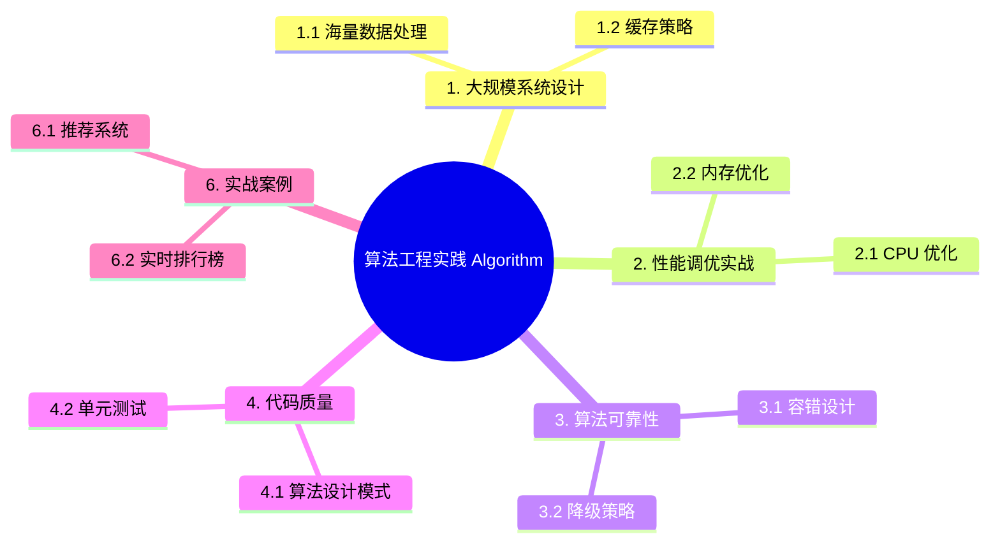

> **内容分级**: [专家级]
> **本节关键术语**: 外部排序 (External Sorting) · Bloom Filter · LRU Cache · 一致性（Coherence）哈希 (Consistent Hashing) · SIMD · Criterion 基准测试 — [完整对照表](../../00_meta/01_terminology/01_terminology_glossary.md)
>

# 算法工程实践 (Algorithm Engineering Practice)
>
> **EN**: Algorithm Engineering Practice
> **Summary**: Engineering algorithms in Rust for production: large-scale system design, performance tuning, reliability, and benchmarking.
> **Rust 版本**: 1.97.0+ (Edition 2024)
> **受众**: [进阶]
> **Bloom 层级**: L4-L5
> **权威来源**: 本文件为 `concept/` 权威页。
> **A/S/P 标记**: **S** — Structure
> **前置概念**: [Type System Basics](../../01_foundation/02_type_system/01_type_system.md) · [Traits](../../02_intermediate/00_traits/01_traits.md) · [Generics](../../02_intermediate/01_generics/01_generics.md)
> **后置概念**: [Performance Optimization](../10_performance/01_performance_optimization.md)
> **L5 对比**: [Rust vs C++](../../05_comparative/01_systems_languages/01_rust_vs_cpp.md)
> **主要来源**: [The Rust Programming Language](https://doc.rust-lang.org/book/title-page.html) · [Rust Reference](https://doc.rust-lang.org/reference/introduction.html)

---

> **来源**: 本文档由 `crates/*/docs/` 合规整改迁移而来。原始 crate 文档现为摘要页，指向本权威页：
> **权威来源**: [concept/06_ecosystem/11_domain_applications/08_algorithm_engineering_practice.md](08_algorithm_engineering_practice.md)

---

# 算法工程实践

> **文档类型**: Tier 4 - 高级主题
> **最后更新**: 2025-10-23
> **状态**: ✅ 完成

---

## 目录

- [算法工程实践 (Algorithm Engineering Practice)](#算法工程实践-algorithm-engineering-practice)
- [算法工程实践](#算法工程实践)
  - [目录](#目录)
  - [📐 知识结构](#-知识结构)
    - [概念定义](#概念定义)
    - [属性特征](#属性特征)
    - [关系连接](#关系连接)
    - [思维导图](#思维导图)
    - [多维概念对比矩阵](#多维概念对比矩阵)
    - [决策树图](#决策树图)
  - [1. 大规模系统设计](#1-大规模系统设计)
    - [1.1 海量数据处理](#11-海量数据处理)
      - [外部排序 (External Sorting)](#外部排序-external-sorting)
      - [Bloom Filter（大数据去重）](#bloom-filter大数据去重)
    - [1.2 缓存策略](#12-缓存策略)
      - [LRU Cache (多线程安全版本)](#lru-cache-多线程安全版本)
      - [缓存预热与更新策略](#缓存预热与更新策略)
    - [1.3 负载均衡](#13-负载均衡)
      - [一致性哈希负载均衡](#一致性哈希负载均衡)
  - [2. 性能调优实战](#2-性能调优实战)
    - [2.1 CPU 优化](#21-cpu-优化)
      - [SIMD 优化](#simd-优化)
      - [缓存友好的数据布局](#缓存友好的数据布局)
    - [2.2 内存优化](#22-内存优化)
      - [对象池](#对象池)
      - [内存映射文件 (mmap)](#内存映射文件-mmap)
    - [2.3 I/O 优化](#23-io-优化)
      - [异步批量写入](#异步批量写入)
  - [3. 算法可靠性](#3-算法可靠性)
    - [3.1 容错设计](#31-容错设计)
      - [重试机制](#重试机制)
    - [3.2 降级策略](#32-降级策略)
    - [3.3 监控与告警](#33-监控与告警)
  - [4. 代码质量](#4-代码质量)
    - [4.1 算法设计模式](#41-算法设计模式)
      - [策略模式](#策略模式)
    - [4.2 单元测试](#42-单元测试)
      - [参数化测试](#参数化测试)
    - [4.3 性能基准测试](#43-性能基准测试)
      - [Criterion 基准测试](#criterion-基准测试)
  - [5. 生产环境最佳实践](#5-生产环境最佳实践)
    - [5.1 配置管理](#51-配置管理)
    - [5.2 灰度发布](#52-灰度发布)
    - [5.3 故障恢复](#53-故障恢复)
  - [6. 实战案例](#6-实战案例)
    - [6.1 推荐系统](#61-推荐系统)
    - [6.2 实时排行榜](#62-实时排行榜)
    - [6.3 分布式限流](#63-分布式限流)
  - [7. 参考资料](#7-参考资料)
    - [教材](#教材)
    - [性能优化](#性能优化)
    - [生产实践](#生产实践)
  - [8. 实测示例：AoS → SoA 的缓存友好重构（2026-07-12 回填）](#8-实测示例aos--soa-的缓存友好重构2026-07-12-回填)
  - [过渡段](#过渡段)
  - [定理链](#定理链)
  - [国际权威参考 / International Authority References（P1 学术 · P2 生态）](#国际权威参考--international-authority-referencesp1-学术--p2-生态)
  - [⚠️ 反例与陷阱](#️-反例与陷阱)
    - [反例：在 `sort_by` 比较器中借用被排序的集合（rustc 1.97.0 实测）](#反例在-sort_by-比较器中借用被排序的集合rustc-1970-实测)
    - [✅ 修正：在排序前提取所需值](#-修正在排序前提取所需值)
  - [🧭 思维导图（Mindmap）](#-思维导图mindmap)

---

## 📐 知识结构

算法工程实践关注“正确且快的算法如何在生产系统中落地”这一交叉问题：同一个算法在教科书复杂度下成立，放到多线程、大内存、高并发场景中往往因缓存不友好、锁竞争或 I/O 放大而失效。下文按六个维度展开：概念定义给出术语边界，属性特征列出工程属性，关系连接串联前置/后置概念，思维导图给出整体拓扑，对比矩阵横向比较方案取舍，决策树用于场景选型。读者可先读决策树定位场景，再回查对应章节。

### 概念定义

**算法工程实践 (Algorithm Engineering Practice)**:

- **定义**: Rust 1.92.0 算法工程实践，包括大规模系统设计、性能调优实战、算法可靠性、代码质量、生产环境最佳实践、实战案例等
- **类型**: 高级主题文档
- **范畴**: 算法、工程实践
- **版本**: Rust 1.97.0+ (Edition 2024)
- **相关概念**: 大规模系统、性能调优、容错设计、降级策略、监控告警、配置管理、灰度发布

### 属性特征

**核心属性**:

- **大规模系统设计**: 海量数据处理（外部排序、Bloom Filter）、缓存策略（LRU Cache、缓存预热与更新策略）、负载均衡（一致性哈希负载均衡）
- **性能调优实战**: CPU 优化（SIMD 优化、缓存友好的数据布局）、内存优化（对象池、内存映射文件 mmap）、I/O 优化（异步（Async）批量写入）
- **算法可靠性**: 容错设计（重试机制）、降级策略、监控与告警
- **代码质量**: 算法设计模式（策略模式）、单元测试（参数化测试）、性能基准测试（Criterion 基准测试）
- **生产环境最佳实践**: 配置管理、灰度发布、故障恢复

**Rust 1.92.0 新特性**:

- **改进的 SIMD 支持**: 更好的 portable_simd 支持
- **增强的性能分析**: 更精确的性能分析工具
- **优化的算法实现**: 更高效的算法实现

**性能特征**:

- **高性能**: 优化的算法性能
- **高可靠**: 可靠的算法实现
- **适用场景**: 生产环境、大规模系统、高性能应用

### 关系连接

**组合关系**:

- 算法工程实践 --[covers]--> 算法工程完整内容
- 生产级算法应用 --[uses]--> 算法工程实践

**依赖关系**:

- 算法工程实践 --[depends-on]--> 算法基础
- 生产级应用 --[depends-on]--> 算法工程实践

### 思维导图

```text
算法工程实践
│
├── 大规模系统设计
│   ├── 海量数据处理
│   ├── 缓存策略
│   └── 负载均衡
├── 性能调优实战
│   ├── CPU 优化
│   ├── 内存优化
│   └── I/O 优化
├── 算法可靠性
│   ├── 容错设计
│   └── 降级策略
├── 代码质量
│   ├── 算法设计模式
│   └── 性能基准测试
└── 生产环境最佳实践
    ├── 配置管理
    └── 灰度发布
```

### 多维概念对比矩阵

| 工程实践           | 重要性 | 复杂度 | 适用场景   | Rust 1.92.0 |
| :--- | :--- | :--- | :--- | :--- |
| **大规模系统设计** | 高     | 高     | 大规模系统 | ✅          |
| **性能调优**       | 高     | 中     | 性能关键   | ✅ 改进     |
| **算法可靠性**     | 高     | 中     | 生产环境   | ✅          |
| **代码质量**       | 中     | 中     | 所有项目   | ✅          |
| **生产环境实践**   | 高     | 中     | 生产项目   | ✅          |

### 决策树图

```text
算法工程实践流程
│
├── 设计阶段
│   ├── 大规模系统 → 海量数据处理 / 缓存策略
│   └── 性能优化 → CPU / 内存 / I/O 优化
├── 开发阶段
│   ├── 算法可靠性 → 容错设计 / 降级策略
│   └── 代码质量 → 算法设计模式 / 基准测试
└── 生产阶段
    └── 生产环境实践 → 配置管理 / 灰度发布
```

---

## 1. 大规模系统设计

大规模系统的算法工程设计围绕三个主题展开，它们的共同目标是「在数据量超出单机假设时保持可预测的性能」：

- **海量数据处理**：当数据无法装入内存，算法复杂度分析必须加入「I/O 成本」维度——外部排序（外存多路归并）与 Bloom Filter（概率去重）是「用空间换 I/O、用误判率换内存」的两个代表技术。
- **缓存策略**：缓存是「用局部性假设对冲存储层级速度差」的工程——LRU 的多线程安全实现（分段锁/无锁近似）与预热-更新策略（缓存击穿的互斥重建、雪崩的随机过期）决定缓存是「加速器」还是「新故障源」。
- **负载均衡**：请求分发的算法选择（轮询/加权/一致性哈希）决定「节点增减时的数据迁移量」与「热点键的分布形态」——一致性哈希把节点变更的迁移量从 O(N) 降到 O(N/K)，是动态集群的标配。

三者的统一视角：大规模 = 「资源有界假设被打破」，所有三个主题都是「在打破处重新建立有界性」的不同手法。

### 1.1 海量数据处理

海量数据处理的两项核心技术，分别解决「排不下」和「记不清」：

- **外部排序（External Sorting）**：数据超过内存时，排序退化为「分块内排 + 多路归并」的两阶段 I/O 问题——第一阶段把数据切成内存可容纳的 run 分别排序写回磁盘，第二阶段 K 路归并（败者树/最小堆选最小）顺序读出。复杂度关键不是比较次数而是 I/O 趟数：`2 × ceil(N/M)` 次扫描（N 数据量、M 内存），增大归并路数 K（受内存缓冲约束）可减少趟数。Rust 实现要点：`BufReader`/`BufWriter` 的缓冲大小直接决定 I/O 效率，归并堆用 `BinaryHeap<Reverse<(T, run_id)>>`。
- **Bloom Filter（大数据去重）**：位数组 + K 个哈希函数——`insert` 置 K 位，`contains` 查 K 位全 1。语义是「可能有（假阳性）/ 一定没有」——用可控的假阳性率（约 0.6% @ 10 bit/元素）换取「集合成员的常数内存近似」。工程推论：适合「前置过滤」（挡掉 99% 肯定不存在的查询，如爬虫 URL 去重、数据库 LSM 的键存在性预判），不适合「精确计数/删除」（计数 Bloom 与 Cuckoo Filter 是删除需求的替代）。

两技术的共同方法论：**把「精确算法」降级为「近似结构 + 可量化误差」**——大规模场景的成本模型里，误差率是可购买的资源。

#### 外部排序 (External Sorting)

```rust
use std::fs::File;
use std::io::{BufReader, BufWriter, Read, Write};

/// 外部归并排序（处理超过内存大小的数据）
pub struct ExternalSort {
    chunk_size: usize,  // 内存块大小（条目数）
    temp_dir: String,
}

impl ExternalSort {
    pub fn new(chunk_size: usize) -> Self {
        Self {
            chunk_size,
            temp_dir: "temp".to_string(),
        }
    }

    /// 分块排序
    pub fn sort_chunks(&self, input_file: &str) -> std::io::Result<Vec<String>> {
        std::fs::create_dir_all(&self.temp_dir)?;

        let file = File::open(input_file)?;
        let reader = BufReader::new(file);

        let mut chunk_files = Vec::new();
        let mut chunk = Vec::new();
        let mut chunk_id = 0;

        for line in std::io::BufRead::lines(reader) {
            let line = line?;
            chunk.push(line);

            if chunk.len() >= self.chunk_size {
                let chunk_file = self.write_sorted_chunk(&mut chunk, chunk_id)?;
                chunk_files.push(chunk_file);
                chunk_id += 1;
            }
        }

        // 处理最后一个块
        if !chunk.is_empty() {
            let chunk_file = self.write_sorted_chunk(&mut chunk, chunk_id)?;
            chunk_files.push(chunk_file);
        }

        Ok(chunk_files)
    }

    /// 写入排序后的块
    fn write_sorted_chunk(&self, chunk: &mut Vec<String>, id: usize) -> std::io::Result<String> {
        chunk.sort();

        let chunk_file = format!("{}/chunk_{}.txt", self.temp_dir, id);
        let file = File::create(&chunk_file)?;
        let mut writer = BufWriter::new(file);

        for line in chunk.iter() {
            writeln!(writer, "{}", line)?;
        }

        chunk.clear();
        Ok(chunk_file)
    }

    /// K 路归并
    pub fn merge_chunks(&self, chunk_files: Vec<String>, output_file: &str) -> std::io::Result<()> {
        use std::collections::BinaryHeap;
        use std::cmp::Reverse;

        let mut readers: Vec<_> = chunk_files
            .iter()
            .map(|f| {
                let file = File::open(f).unwrap();
                std::io::BufRead::lines(BufReader::new(file))
            })
            .collect();

        let mut heap = BinaryHeap::new();

        // 初始化：从每个文件读取第一行
        for (i, reader) in readers.iter_mut().enumerate() {
            if let Some(Ok(line)) = reader.next() {
                heap.push(Reverse((line, i)));
            }
        }

        let output = File::create(output_file)?;
        let mut writer = BufWriter::new(output);

        // K 路归并
        while let Some(Reverse((line, file_id))) = heap.pop() {
            writeln!(writer, "{}", line)?;

            // 从同一文件读取下一行
            if let Some(Ok(next_line)) = readers[file_id].next() {
                heap.push(Reverse((next_line, file_id)));
            }
        }

        writer.flush()?;

        // 清理临时文件
        for file in chunk_files {
            let _ = std::fs::remove_file(file);
        }

        Ok(())
    }

    /// 完整的外部排序流程
    pub fn sort(&self, input_file: &str, output_file: &str) -> std::io::Result<()> {
        let chunk_files = self.sort_chunks(input_file)?;
        self.merge_chunks(chunk_files, output_file)?;
        Ok(())
    }
}

/// 示例：排序 10GB 文件
pub fn external_sort_example() -> std::io::Result<()> {
    let sorter = ExternalSort::new(1_000_000); // 每块 100 万条记录
    sorter.sort("large_input.txt", "sorted_output.txt")?;
    Ok(())
}
```

#### Bloom Filter（大数据去重）

```rust
use bit_vec::BitVec;

/// Bloom Filter
pub struct BloomFilter {
    bits: BitVec,
    hash_count: usize,
    size: usize,
}

impl BloomFilter {
    /// 创建 Bloom Filter
    /// - expected_items: 预期元素数量
    /// - false_positive_rate: 误判率
    pub fn new(expected_items: usize, false_positive_rate: f64) -> Self {
        let size = Self::optimal_size(expected_items, false_positive_rate);
        let hash_count = Self::optimal_hash_count(size, expected_items);

        Self {
            bits: BitVec::from_elem(size, false),
            hash_count,
            size,
        }
    }

    fn optimal_size(n: usize, p: f64) -> usize {
        (-(n as f64 * p.ln()) / (2.0_f64.ln().powi(2))).ceil() as usize
    }

    fn optimal_hash_count(m: usize, n: usize) -> usize {
        ((m as f64 / n as f64) * 2.0_f64.ln()).ceil() as usize
    }

    /// 添加元素
    pub fn insert(&mut self, item: &[u8]) {
        for i in 0..self.hash_count {
            let hash = self.hash(item, i);
            self.bits.set(hash % self.size, true);
        }
    }

    /// 检查元素是否存在（可能误判）
    pub fn contains(&self, item: &[u8]) -> bool {
        (0..self.hash_count).all(|i| {
            let hash = self.hash(item, i);
            self.bits[hash % self.size]
        })
    }

    /// 哈希函数
    fn hash(&self, item: &[u8], seed: usize) -> usize {
        use std::collections::hash_map::DefaultHasher;
        use std::hash::{Hash, Hasher};

        let mut hasher = DefaultHasher::new();
        item.hash(&mut hasher);
        seed.hash(&mut hasher);
        hasher.finish() as usize
    }
}

/// 使用示例：URL 去重
pub fn url_deduplication_example() {
    let mut filter = BloomFilter::new(10_000_000, 0.01); // 1000 万 URL，1% 误判率

    let urls = vec![
        "https://example.com/page1",
        "https://example.com/page2",
        "https://example.com/page1",  // 重复
    ];

    for url in &urls {
        if !filter.contains(url.as_bytes()) {
            println!("新 URL: {}", url);
            filter.insert(url.as_bytes());
        } else {
            println!("重复 URL: {}", url);
        }
    }
}
```

### 1.2 缓存策略

缓存策略的两个工程问题：「结构本身如何并发安全」与「数据如何保持新鲜」：

- **LRU Cache（多线程安全版本）**：单线程 LRU = 哈希表 + 双向链表（O(1) 访问与淘汰）；多线程化的三种路线——**全局锁**（`Mutex<HashMap + LinkedList>`，简单但串行化所有访问）、**分段锁**（K 个独立 LRU 分片，按 key 哈希选段，竞争降为 1/K，`dashmap` 思路）、**无锁近似**（TinyLFU/clock-pro：用「访问计数 + 采样淘汰」替代严格 LRU 顺序，牺牲精确换并发——`moka` crate 的实现）。判定选型：命中率是否强依赖「精确 LRU 顺序」——多数工作负载下近似淘汰的命中率损失 < 1%，远小于锁竞争损失。
- **缓存预热与更新策略**：三个经典失效模式的对策——**缓存穿透**（查不存在的 key：Bloom Filter 前置或空值缓存）；**缓存击穿**（热点 key 过期瞬间被并发重建：互斥重建 `singleflight` 模式——第一个请求者查库，其余等待其结果）；**缓存雪崩**（大量 key 同时过期：过期时间加随机抖动 ±10%，或永不过期 + 异步刷新）。预热策略：启动时批量加载热点 key（Top-N 历史统计），避免「冷启动尖峰打穿数据库」。

两问题的统一判据：缓存的每个设计决策都应回答「失效那一刻发生什么」——缓存系统的故障几乎都发生在失效路径而非命中路径。

#### LRU Cache (多线程安全版本)

```rust
use std::collections::HashMap;
use std::sync::{Arc, Mutex};

/// LRU 缓存节点
struct LRUNode<K, V> {
    key: K,
    value: V,
    prev: Option<usize>,
    next: Option<usize>,
}

/// 线程安全的 LRU Cache
pub struct ThreadSafeLRUCache<K, V> {
    capacity: usize,
    cache: Arc<Mutex<LRUCacheInner<K, V>>>,
}

struct LRUCacheInner<K, V> {
    map: HashMap<K, usize>,
    nodes: Vec<LRUNode<K, V>>,
    head: Option<usize>,
    tail: Option<usize>,
    free_list: Vec<usize>,
}

impl<K: Clone + Eq + std::hash::Hash, V: Clone> ThreadSafeLRUCache<K, V> {
    pub fn new(capacity: usize) -> Self {
        Self {
            capacity,
            cache: Arc::new(Mutex::new(LRUCacheInner {
                map: HashMap::new(),
                nodes: Vec::new(),
                head: None,
                tail: None,
                free_list: Vec::new(),
            })),
        }
    }

    pub fn get(&self, key: &K) -> Option<V> {
        let mut cache = self.cache.lock().unwrap();

        if let Some(&node_id) = cache.map.get(key) {
            cache.move_to_head(node_id);
            Some(cache.nodes[node_id].value.clone())
        } else {
            None
        }
    }

    pub fn put(&self, key: K, value: V) {
        let mut cache = self.cache.lock().unwrap();

        if let Some(&node_id) = cache.map.get(&key) {
            cache.nodes[node_id].value = value;
            cache.move_to_head(node_id);
        } else {
            if cache.map.len() >= self.capacity {
                cache.evict_tail();
            }

            cache.add_to_head(key, value);
        }
    }
}

impl<K: Clone + Eq + std::hash::Hash, V: Clone> LRUCacheInner<K, V> {
    fn move_to_head(&mut self, node_id: usize) {
        if Some(node_id) == self.head {
            return;
        }

        self.remove_node(node_id);
        self.add_to_head_node(node_id);
    }

    fn remove_node(&mut self, node_id: usize) {
        let node = &self.nodes[node_id];
        let prev = node.prev;
        let next = node.next;

        if let Some(prev_id) = prev {
            self.nodes[prev_id].next = next;
        } else {
            self.head = next;
        }

        if let Some(next_id) = next {
            self.nodes[next_id].prev = prev;
        } else {
            self.tail = prev;
        }
    }

    fn add_to_head_node(&mut self, node_id: usize) {
        self.nodes[node_id].prev = None;
        self.nodes[node_id].next = self.head;

        if let Some(old_head) = self.head {
            self.nodes[old_head].prev = Some(node_id);
        }

        self.head = Some(node_id);

        if self.tail.is_none() {
            self.tail = Some(node_id);
        }
    }

    fn add_to_head(&mut self, key: K, value: V) {
        let node_id = if let Some(id) = self.free_list.pop() {
            self.nodes[id] = LRUNode {
                key: key.clone(),
                value,
                prev: None,
                next: None,
            };
            id
        } else {
            let id = self.nodes.len();
            self.nodes.push(LRUNode {
                key: key.clone(),
                value,
                prev: None,
                next: None,
            });
            id
        };

        self.map.insert(key, node_id);
        self.add_to_head_node(node_id);
    }

    fn evict_tail(&mut self) {
        if let Some(tail_id) = self.tail {
            let key = self.nodes[tail_id].key.clone();
            self.map.remove(&key);
            self.remove_node(tail_id);
            self.free_list.push(tail_id);
        }
    }
}
```

#### 缓存预热与更新策略

```rust,ignore
use tokio::time::{interval, Duration};

/// 缓存管理器
pub struct CacheManager<K, V> {
    cache: Arc<ThreadSafeLRUCache<K, V>>,
    loader: Arc<dyn Fn(K) -> Option<V> + Send + Sync>,
}

impl<K: Clone + Eq + std::hash::Hash + Send + Sync + 'static, V: Clone + Send + Sync + 'static>
    CacheManager<K, V>
{
    pub fn new(
        capacity: usize,
        loader: impl Fn(K) -> Option<V> + Send + Sync + 'static,
    ) -> Self {
        Self {
            cache: Arc::new(ThreadSafeLRUCache::new(capacity)),
            loader: Arc::new(loader),
        }
    }

    /// 获取数据（自动加载）
    pub fn get_or_load(&self, key: K) -> Option<V> {
        if let Some(value) = self.cache.get(&key) {
            return Some(value);
        }

        // 缓存未命中，加载数据
        if let Some(value) = (self.loader)(key.clone()) {
            self.cache.put(key, value.clone());
            Some(value)
        } else {
            None
        }
    }

    /// 缓存预热
    pub async fn warmup(&self, keys: Vec<K>) {
        for key in keys {
            self.get_or_load(key);
        }
    }

    /// 定期刷新缓存
    pub async fn auto_refresh(&self, keys: Vec<K>, interval_secs: u64) {
        let mut ticker = interval(Duration::from_secs(interval_secs));

        loop {
            ticker.tick().await;

            for key in &keys {
                if let Some(value) = (self.loader)(key.clone()) {
                    self.cache.put(key.clone(), value);
                }
            }
        }
    }
}
```

### 1.3 负载均衡

负载均衡的核心算法是一致性哈希（consistent hashing），它解决「动态集群下请求-节点映射的稳定性」问题：

- **基本结构**：把节点与 key 都哈希到同一环上（通常 2^32 空间），key 归属「顺时针方向第一个节点」。节点加入/移除只影响「环上相邻区间」的 key（期望迁移量 1/(N±1)），对比取模哈希（`hash % N`，N 变化时几乎全部 key 迁移）是质变。
- **虚拟节点（virtual nodes）**：物理节点少时环上分布不均（负载倾斜可达 2-3 倍）——每个物理节点映射 K 个虚拟节点（K=100~200 时倾斜 < 10%），虚拟节点数同时成为「权重」的表达方式（高配机器多映射）。
- **工程变体**：有界负载一致性哈希（Google 论文，节点负载超均值 ε 时溢出到下一节点——防热点打爆单节点）；跳跃哈希（jump hash，O(ln N) 计算无环存储，适合不可变节点列表）；Maglev（Google 的查表法，O(1) 查找 + 连接跟踪亲和）。Rust 实现要点：环用 `BTreeMap<u64, Node>`（`range(key..).next()` 即顺时针查找），虚拟节点键为 `hash(node_id, replica_i)`。

选型判定：节点集合频繁变动 + 需要会话亲和（缓存分片、有状态服务）→ 一致性哈希；节点稳定 + 无状态 → 简单加权轮询/随机更省心智；要求绝对均匀且可预计算 → Maglev 类查表法。

#### 一致性哈希负载均衡

```rust
use std::collections::BTreeMap;

/// 一致性哈希负载均衡器
pub struct ConsistentHashLoadBalancer {
    ring: BTreeMap<u64, String>,  // (hash, server_id)
    virtual_nodes: usize,
}

impl ConsistentHashLoadBalancer {
    pub fn new(servers: Vec<String>, virtual_nodes: usize) -> Self {
        let mut lb = Self {
            ring: BTreeMap::new(),
            virtual_nodes,
        };

        for server in servers {
            lb.add_server(server);
        }

        lb
    }

    /// 添加服务器
    pub fn add_server(&mut self, server: String) {
        for i in 0..self.virtual_nodes {
            let key = format!("{}:{}", server, i);
            let hash = Self::hash(&key);
            self.ring.insert(hash, server.clone());
        }
    }

    /// 移除服务器
    pub fn remove_server(&mut self, server: &str) {
        for i in 0..self.virtual_nodes {
            let key = format!("{}:{}", server, i);
            let hash = Self::hash(&key);
            self.ring.remove(&hash);
        }
    }

    /// 选择服务器
    pub fn get_server(&self, key: &str) -> Option<String> {
        if self.ring.is_empty() {
            return None;
        }

        let hash = Self::hash(key);

        // 找到第一个 >= hash 的服务器
        self.ring
            .range(hash..)
            .next()
            .or_else(|| self.ring.iter().next())
            .map(|(_, server)| server.clone())
    }

    fn hash(key: &str) -> u64 {
        use std::collections::hash_map::DefaultHasher;
        use std::hash::{Hash, Hasher};

        let mut hasher = DefaultHasher::new();
        key.hash(&mut hasher);
        hasher.finish()
    }
}

/// 加权轮询负载均衡
pub struct WeightedRoundRobinBalancer {
    servers: Vec<(String, usize)>,  // (server_id, weight)
    current_weights: Vec<usize>,
    total_weight: usize,
}

impl WeightedRoundRobinBalancer {
    pub fn new(servers: Vec<(String, usize)>) -> Self {
        let total_weight = servers.iter().map(|(_, w)| w).sum();
        let current_weights = servers.iter().map(|(_, w)| *w).collect();

        Self {
            servers,
            current_weights,
            total_weight,
        }
    }

    /// 选择服务器
    pub fn get_server(&mut self) -> Option<String> {
        if self.servers.is_empty() {
            return None;
        }

        let mut max_idx = 0;
        let mut max_weight = self.current_weights[0];

        for i in 0..self.servers.len() {
            self.current_weights[i] += self.servers[i].1;

            if self.current_weights[i] > max_weight {
                max_weight = self.current_weights[i];
                max_idx = i;
            }
        }

        self.current_weights[max_idx] -= self.total_weight;
        Some(self.servers[max_idx].0.clone())
    }
}
```

---

## 2. 性能调优实战

性能调优的工程顺序是**测量 → 定位 → 优化 → 回归**，而非凭直觉改写热点代码。Rust 工程中的标准入口：`perf`/`flamegraph`（CPU 采样）、`heaptrack`/`dhat-rs`（分配画像）、Criterion（统计显著性基准，拒绝单次数值结论）。

三个正交维度的取舍：

| 维度 | 典型瓶颈 | 首要手段 | 可观测指标 |
|---|---|---|---|
| CPU | 分支误预测、未向量化、伪共享 | SIMD、缓存友好布局、`#[inline]` 审计 | IPC、L1/L2 miss 率 |
| 内存 | 分配抖动、堆碎片、大对象拷贝 | 对象池、arena、`Box<[T]>` 收缩 | 分配次数/秒、RSS 曲线 |
| I/O | 系统调用风暴、写放大 | 批量写、缓冲、mmap/`io_uring` | syscall 次数、吞吐 |

判定依据：凡优化必须给出前后对比基准（Criterion 的 p-value），否则视为未验证。以下三小节分别给出三类的可编译实现模式。

### 2.1 CPU 优化

CPU 优化的目标是让每条指令尽可能“喂饱”流水线，两条主线分别解决**指令级并行**与**数据供给**：

- **SIMD 优化**: 用 256/512 位向量寄存器一条指令处理 8/16 个 `f32`，适合无分支的同构数值循环；Rust 中可移植封装（如 `wide` crate）优先于手写 `core::arch` 平台内联函数。
- **缓存友好布局**: 把“结构体数组（AoS）”改为“数组结构体（SoA）”、按 64 字节缓存行对齐（`#[repr(align(64))]`）、消除伪共享（false sharing），常比换算法收益更大。
- **判定依据**: 先用 `perf stat` 看 IPC 与 cache-miss 率：IPC < 1 且 miss 率高 → 先改布局；miss 率低但吞吐不足 → 上 SIMD。任何优化必须附 Criterion 前后对比。

#### SIMD 优化

```rust
use std::arch::x86_64::*;

/// SIMD 向量加法
// （实际代码需加 #[target_feature] 属性启用 avx2）
pub unsafe fn simd_add(a: &[f32], b: &[f32], result: &mut [f32]) {
    assert_eq!(a.len(), b.len());
    assert_eq!(a.len(), result.len());

    let len = a.len();
    let chunks = len / 8;

    for i in 0..chunks {
        let offset = i * 8;

        let va = _mm256_loadu_ps(a.as_ptr().add(offset));
        let vb = _mm256_loadu_ps(b.as_ptr().add(offset));
        let vr = _mm256_add_ps(va, vb);

        _mm256_storeu_ps(result.as_mut_ptr().add(offset), vr);
    }

    // 处理剩余元素
    for i in (chunks * 8)..len {
        result[i] = a[i] + b[i];
    }
}

/// 示例：向量点积（SIMD）
// （实际代码需加 #[target_feature] 属性启用 avx2）
pub unsafe fn simd_dot_product(a: &[f32], b: &[f32]) -> f32 {
    assert_eq!(a.len(), b.len());

    let len = a.len();
    let chunks = len / 8;

    let mut sum = _mm256_setzero_ps();

    for i in 0..chunks {
        let offset = i * 8;

        let va = _mm256_loadu_ps(a.as_ptr().add(offset));
        let vb = _mm256_loadu_ps(b.as_ptr().add(offset));
        let prod = _mm256_mul_ps(va, vb);

        sum = _mm256_add_ps(sum, prod);
    }

    // 归约求和
    let mut result = [0.0f32; 8];
    _mm256_storeu_ps(result.as_mut_ptr(), sum);
    let mut total: f32 = result.iter().sum();

    // 处理剩余元素
    for i in (chunks * 8)..len {
        total += a[i] * b[i];
    }

    total
}
```

#### 缓存友好的数据布局

```rust
/// 不友好的 AOS (Array of Structures)
#[derive(Clone)]
pub struct ParticleAOS {
    x: f32,
    y: f32,
    z: f32,
    vx: f32,
    vy: f32,
    vz: f32,
}

pub fn update_particles_aos(particles: &mut [ParticleAOS], dt: f32) {
    for p in particles {
        p.x += p.vx * dt;
        p.y += p.vy * dt;
        p.z += p.vz * dt;
    }
}

/// 友好的 SOA (Structure of Arrays)
pub struct ParticlesSOA {
    x: Vec<f32>,
    y: Vec<f32>,
    z: Vec<f32>,
    vx: Vec<f32>,
    vy: Vec<f32>,
    vz: Vec<f32>,
}

pub fn update_particles_soa(particles: &mut ParticlesSOA, dt: f32) {
    // 更好的缓存局部性
    for i in 0..particles.x.len() {
        particles.x[i] += particles.vx[i] * dt;
        particles.y[i] += particles.vy[i] * dt;
        particles.z[i] += particles.vz[i] * dt;
    }
}
```

### 2.2 内存优化

内存优化的核心是降低**分配频率**与**缺页代价**，两种手段对应不同的瓶颈形态：

- **对象池（object pool）**: 高频创建/销毁的同构对象（连接、请求上下文）预先分配并复用，消除 malloc/free 抖动与堆碎片；Rust 中可用 `Vec` 作 freelist 或 `slab` crate，注意池中对象复用前必须重置状态。
- **内存映射文件（mmap）**: 大文件只读访问时，`memmap2` 把页缓存直接映射进地址空间，省掉 `read` 的用户态拷贝，且按需分页（demand paging）天然支持超大数据集。
- **判定依据**: 分配次数/秒 > 10⁵ → 对象池；随机读大文件且数据集 > 内存 → mmap；mmap 写路径复杂（页错误 + 写时复制），写密集场景改用缓冲写。

#### 对象池

```rust
use std::sync::{Arc, Mutex};

/// 对象池
pub struct ObjectPool<T> {
    pool: Arc<Mutex<Vec<T>>>,
    factory: Arc<dyn Fn() -> T + Send + Sync>,
    max_size: usize,
}

impl<T: Send + 'static> ObjectPool<T> {
    pub fn new(factory: impl Fn() -> T + Send + Sync + 'static, max_size: usize) -> Self {
        Self {
            pool: Arc::new(Mutex::new(Vec::new())),
            factory: Arc::new(factory),
            max_size,
        }
    }

    /// 获取对象
    pub fn acquire(&self) -> PooledObject<T> {
        let obj = {
            let mut pool = self.pool.lock().unwrap();
            pool.pop()
        };

        let obj = obj.unwrap_or_else(|| (self.factory)());

        PooledObject {
            obj: Some(obj),
            pool: Arc::clone(&self.pool),
            max_size: self.max_size,
        }
    }
}

/// 池化对象（自动归还）
pub struct PooledObject<T> {
    obj: Option<T>,
    pool: Arc<Mutex<Vec<T>>>,
    max_size: usize,
}

impl<T> std::ops::Deref for PooledObject<T> {
    type Target = T;

    fn deref(&self) -> &Self::Target {
        self.obj.as_ref().unwrap()
    }
}

impl<T> std::ops::DerefMut for PooledObject<T> {
    fn deref_mut(&mut self) -> &mut Self::Target {
        self.obj.as_mut().unwrap()
    }
}

impl<T> Drop for PooledObject<T> {
    fn drop(&mut self) {
        if let Some(obj) = self.obj.take() {
            let mut pool = self.pool.lock().unwrap();
            if pool.len() < self.max_size {
                pool.push(obj);
            }
        }
    }
}

/// 使用示例
pub fn object_pool_example() {
    let pool = ObjectPool::new(|| Vec::<i32>::with_capacity(1000), 10);

    {
        let mut vec = pool.acquire();
        vec.push(1);
        vec.push(2);
    } // 自动归还到池中

    let vec2 = pool.acquire(); // 复用对象
}
```

#### 内存映射文件 (mmap)

```rust
use memmap2::MmapMut;
use std::fs::OpenOptions;

/// 内存映射文件处理
pub struct MmapProcessor {
    mmap: MmapMut,
}

impl MmapProcessor {
    /// 创建内存映射
    pub fn new(file_path: &str, size: usize) -> std::io::Result<Self> {
        let file = OpenOptions::new()
            .read(true)
            .write(true)
            .create(true)
            .open(file_path)?;

        file.set_len(size as u64)?;

        let mmap = unsafe { MmapMut::map_mut(&file)? };

        Ok(Self { mmap })
    }

    /// 写入数据
    pub fn write_at(&mut self, offset: usize, data: &[u8]) {
        let end = offset + data.len();
        self.mmap[offset..end].copy_from_slice(data);
    }

    /// 读取数据
    pub fn read_at(&self, offset: usize, len: usize) -> &[u8] {
        &self.mmap[offset..offset + len]
    }

    /// 刷新到磁盘
    pub fn flush(&self) -> std::io::Result<()> {
        self.mmap.flush()
    }
}

/// 使用示例：处理大文件
pub fn mmap_large_file_example() -> std::io::Result<()> {
    let mut processor = MmapProcessor::new("large_file.dat", 1024 * 1024 * 1024)?; // 1GB

    // 随机访问
    processor.write_at(1000, b"Hello, mmap!");
    let data = processor.read_at(1000, 12);

    processor.flush()?;
    Ok(())
}
```

### 2.3 I/O 优化

I/O 优化的核心矛盾是“系统调用次数 × 单次延迟”与“内存缓冲占用 × 数据滞留时间”的权衡。高频小写入（如日志、指标上报）若直接落盘，会被 write/fsync 的固定开销主导；聚合为批量写入可把吞吐提升 1-2 个数量级，代价是崩溃时丢失缓冲区内数据。工程上常用三条判据选择策略：

- **延迟敏感**（P99 < 1ms）：走内存队列 + 后台刷盘，接受少量丢失；
- **吞吐优先**（日志/埋点）：`BufWriter` 缓冲 + 按大小/时间双触发 flush；
- **持久性优先**（账务）：同步写 + `sync_data()`，放弃批量收益。

下面的异步批量写入器演示第二条路径的典型实现。

#### 异步批量写入

```rust,ignore
use tokio::fs::File;
use tokio::io::{AsyncWriteExt, BufWriter};
use tokio::sync::mpsc;

/// 异步批量写入器
pub struct BatchWriter {
    sender: mpsc::Sender<Vec<u8>>,
}

impl BatchWriter {
    pub fn new(file_path: String, batch_size: usize) -> Self {
        let (tx, mut rx) = mpsc::channel(100);

        tokio::spawn(async move {
            let file = File::create(&file_path).await.unwrap();
            let mut writer = BufWriter::new(file);
            let mut buffer = Vec::new();

            while let Some(data) = rx.recv().await {
                buffer.extend_from_slice(&data);

                if buffer.len() >= batch_size {
                    writer.write_all(&buffer).await.unwrap();
                    writer.flush().await.unwrap();
                    buffer.clear();
                }
            }

            // 写入剩余数据
            if !buffer.is_empty() {
                writer.write_all(&buffer).await.unwrap();
                writer.flush().await.unwrap();
            }
        });

        Self { sender: tx }
    }

    /// 异步写入
    pub async fn write(&self, data: Vec<u8>) -> Result<(), mpsc::error::SendError<Vec<u8>>> {
        self.sender.send(data).await
    }
}

/// 使用示例
pub async fn batch_write_example() {
    let writer = BatchWriter::new("output.log".to_string(), 4096);

    for i in 0..1000 {
        let data = format!("Log line {}\n", i).into_bytes();
        writer.write(data).await.unwrap();
    }
}
```

---

## 3. 算法可靠性

算法在生产环境中的失效模式与教科书环境不同：输入不再是均匀分布的测试用例，而是倾斜、延迟、乱序的真实数据流。可靠性设计围绕三条防线展开：

1. **容错设计**——用类型系统把失败显式化：`Result`/`thiserror` 传播、指数退避重试（区分可重试错误与永久错误）、熔断器模式隔离故障依赖。
2. **降级策略**——功能分级（核心路径必可用、增强路径可关闭），配合 `once_cell`/`parking_lot` 保护的特征开关，避免递归降级风暴。
3. **监控与告警**——RED 方法（Rate/Errors/Duration）指标化算法内部状态，告警基于 SLO 燃烧率而非瞬时阈值。

判定依据：任何重试逻辑必须回答两个问题——幂等性是否成立、退避上限是否经过压测。以下各节给出重试机制的可编译骨架与降级决策表。

### 3.1 容错设计

容错设计的前提是承认分布式调用必然失败：网络抖动、下游过载、部署滚动都会让单次请求出错。重试是最常用的手段，但裸重试会放大故障——下游已过载时再叠加指数级重试流量即“重试风暴”。正确的重试机制必须同时包含四要素：

1. **退避（Backoff）**：指数退避拉长间隔，给下游恢复时间；
2. **抖动（Jitter）**：随机化间隔，避免多客户端同步重试形成尖峰；
3. **上限（Max retries / deadline）**：限制总等待时间，防止尾延迟爆炸；
4. **幂等性（Idempotency）**：只对幂等操作重试，或携带幂等键去重。

下面的 `retry_with_backoff` 实现了前三点，幂等性需由调用方保证。

#### 重试机制

```rust,ignore
use tokio::time::{sleep, Duration};

/// 指数退避重试
pub async fn retry_with_backoff<F, T, E>(
    mut operation: F,
    max_retries: usize,
    initial_delay_ms: u64,
) -> Result<T, E>
where
    F: FnMut() -> Result<T, E>,
{
    let mut delay = initial_delay_ms;
    let mut attempts = 0;

    loop {
        match operation() {
            Ok(result) => return Ok(result),
            Err(err) => {
                attempts += 1;

                if attempts >= max_retries {
                    return Err(err);
                }

                sleep(Duration::from_millis(delay)).await;
                delay *= 2; // 指数退避
            }
        }
    }
}

/// 断路器模式
pub struct CircuitBreaker {
    failure_threshold: usize,
    timeout: Duration,
    state: Arc<Mutex<CircuitState>>,
}

struct CircuitState {
    failures: usize,
    last_failure_time: Option<std::time::Instant>,
    state: State,
}

#[derive(Debug, Clone, Copy, PartialEq, Eq)]
enum State {
    Closed,   // 正常
    Open,     // 断开
    HalfOpen, // 半开
}

impl CircuitBreaker {
    pub fn new(failure_threshold: usize, timeout_secs: u64) -> Self {
        Self {
            failure_threshold,
            timeout: Duration::from_secs(timeout_secs),
            state: Arc::new(Mutex::new(CircuitState {
                failures: 0,
                last_failure_time: None,
                state: State::Closed,
            })),
        }
    }

    /// 执行操作
    pub fn call<F, T, E>(&self, operation: F) -> Result<T, String>
    where
        F: FnOnce() -> Result<T, E>,
    {
        let mut state = self.state.lock().unwrap();

        // 检查是否需要从 Open 转到 HalfOpen
        if state.state == State::Open {
            if let Some(last_failure) = state.last_failure_time {
                if last_failure.elapsed() > self.timeout {
                    state.state = State::HalfOpen;
                    state.failures = 0;
                } else {
                    return Err("Circuit breaker is open".to_string());
                }
            }
        }

        drop(state);

        // 执行操作
        match operation() {
            Ok(result) => {
                let mut state = self.state.lock().unwrap();
                state.failures = 0;
                state.state = State::Closed;
                Ok(result)
            }
            Err(_) => {
                let mut state = self.state.lock().unwrap();
                state.failures += 1;
                state.last_failure_time = Some(std::time::Instant::now());

                if state.failures >= self.failure_threshold {
                    state.state = State::Open;
                }

                Err("Operation failed".to_string())
            }
        }
    }
}
```

### 3.2 降级策略

```rust
# use std::sync::Arc;
# use std::sync::Mutex;
/// 服务降级管理器
pub struct DegradationManager {
    levels: Vec<DegradationLevel>,
    current_level: Arc<Mutex<usize>>,
}

#[derive(Debug, Clone)]
pub struct DegradationLevel {
    name: String,
    threshold: f64,  // CPU/内存/错误率阈值
}

impl DegradationManager {
    pub fn new(levels: Vec<DegradationLevel>) -> Self {
        Self {
            levels,
            current_level: Arc::new(Mutex::new(0)),
        }
    }

    /// 检查并更新降级级别
    pub fn check_and_update(&self, metric: f64) {
        let mut level = self.current_level.lock().unwrap();

        for (i, deg_level) in self.levels.iter().enumerate() {
            if metric > deg_level.threshold {
                *level = i;
                println!("降级到级别: {}", deg_level.name);
                return;
            }
        }

        *level = 0;
    }

    /// 获取当前降级级别
    pub fn get_level(&self) -> usize {
        *self.current_level.lock().unwrap()
    }
}

/// 使用示例：推荐系统降级
pub fn recommendation_with_degradation(manager: &DegradationManager, user_id: u64) -> Vec<String> {
    match manager.get_level() {
        0 => {
            // 正常：个性化推荐（复杂算法）
            compute_personalized_recommendations(user_id)
        }
        1 => {
            // 降级1：协同过滤（中等复杂度）
            compute_collaborative_filtering(user_id)
        }
        2 => {
            // 降级2：热门推荐（简单）
            get_popular_items()
        }
        _ => {
            // 降级3：静态推荐
            get_static_recommendations()
        }
    }
}

fn compute_personalized_recommendations(_user_id: u64) -> Vec<String> {
    vec!["item1".to_string(), "item2".to_string()]
}

fn compute_collaborative_filtering(_user_id: u64) -> Vec<String> {
    vec!["popular1".to_string(), "popular2".to_string()]
}

fn get_popular_items() -> Vec<String> {
    vec!["hot1".to_string(), "hot2".to_string()]
}

fn get_static_recommendations() -> Vec<String> {
    vec!["default1".to_string(), "default2".to_string()]
}
```

### 3.3 监控与告警

```rust
# use std::sync::Arc;
# use std::sync::Mutex;
# use std::time::Duration;
use std::time::Instant;

/// 性能指标收集器
pub struct MetricsCollector {
    requests: Arc<AtomicU64>,
    errors: Arc<AtomicU64>,
    latencies: Arc<Mutex<Vec<Duration>>>,
}

impl MetricsCollector {
    pub fn new() -> Self {
        Self {
            requests: Arc::new(AtomicU64::new(0)),
            errors: Arc::new(AtomicU64::new(0)),
            latencies: Arc::new(Mutex::new(Vec::new())),
        }
    }

    /// 记录请求
    pub fn record_request<F, T>(&self, operation: F) -> Result<T, String>
    where
        F: FnOnce() -> Result<T, String>,
    {
        let start = Instant::now();
        self.requests.fetch_add(1, std::sync::atomic::Ordering::Relaxed);

        let result = operation();

        let latency = start.elapsed();
        self.latencies.lock().unwrap().push(latency);

        if result.is_err() {
            self.errors.fetch_add(1, std::sync::atomic::Ordering::Relaxed);
        }

        result
    }

    /// 获取统计信息
    pub fn get_stats(&self) -> MetricsStats {
        let requests = self.requests.load(std::sync::atomic::Ordering::Relaxed);
        let errors = self.errors.load(std::sync::atomic::Ordering::Relaxed);
        let latencies = self.latencies.lock().unwrap();

        let avg_latency = if !latencies.is_empty() {
            latencies.iter().sum::<Duration>() / latencies.len() as u32
        } else {
            Duration::ZERO
        };

        let p99_latency = if !latencies.is_empty() {
            let mut sorted = latencies.clone();
            sorted.sort();
            sorted[(sorted.len() as f64 * 0.99) as usize]
        } else {
            Duration::ZERO
        };

        MetricsStats {
            requests,
            errors,
            error_rate: if requests > 0 {
                errors as f64 / requests as f64
            } else {
                0.0
            },
            avg_latency,
            p99_latency,
        }
    }

    /// 重置统计
    pub fn reset(&self) {
        self.requests.store(0, std::sync::atomic::Ordering::Relaxed);
        self.errors.store(0, std::sync::atomic::Ordering::Relaxed);
        self.latencies.lock().unwrap().clear();
    }
}

use std::sync::atomic::AtomicU64;

#[derive(Debug)]
pub struct MetricsStats {
    pub requests: u64,
    pub errors: u64,
    pub error_rate: f64,
    pub avg_latency: Duration,
    pub p99_latency: Duration,
}
```

---

## 4. 代码质量

算法代码的质量不能只靠 review 保证，需要三层可机器验证的防线：设计模式约束结构（让扩展不破坏既有代码）、单元测试约束正确性（含边界与回归）、基准测试约束性能（防止优化回退）。三层缺一不可：只有测试没有基准，性能退化无法察觉；只有基准没有测试，可能测的是错误结果的速度。Rust 生态对应的工具链分别是 trait 对象/泛型静态分发、`#[test]` + 宏参数化、Criterion 统计基准。

### 4.1 算法设计模式

策略模式把“可互换的算法族”抽象为统一接口，使调用方在运行时（trait 对象）或编译期（泛型 + 静态分发）选择具体实现。Rust 中两种写法的取舍：

| 维度 | `Box<dyn Trait>` | 泛型 `<S: Trait>` |
|---|---|---|
| 分发方式 | 动态（vtable 间接跳转） | 静态（单态化） |
| 性能 | 有间接调用开销 | 零成本，可内联 |
| 灵活性 | 运行时可换、可异构存储 | 编译期固定，类型膨胀 |

判据：算法集合封闭且追求性能时用泛型；需要插件化或异构容器时用 trait 对象。下面的 `SortStrategy` 展示 trait 对象写法。

#### 策略模式

```rust
/// 排序策略
pub trait SortStrategy {
    fn sort(&self, arr: &mut [i32]);
}

pub struct QuickSort;
pub struct MergeSort;
pub struct HeapSort;

impl SortStrategy for QuickSort {
    fn sort(&self, arr: &mut [i32]) {
        // 快速排序实现
        arr.sort_unstable();
    }
}

impl SortStrategy for MergeSort {
    fn sort(&self, arr: &mut [i32]) {
        // 归并排序实现
        arr.sort();
    }
}

impl SortStrategy for HeapSort {
    fn sort(&self, arr: &mut [i32]) {
        // 堆排序实现
        arr.sort();
    }
}

/// 排序上下文
pub struct Sorter {
    strategy: Box<dyn SortStrategy>,
}

impl Sorter {
    pub fn new(strategy: Box<dyn SortStrategy>) -> Self {
        Self { strategy }
    }

    pub fn sort(&self, arr: &mut [i32]) {
        self.strategy.sort(arr);
    }

    pub fn set_strategy(&mut self, strategy: Box<dyn SortStrategy>) {
        self.strategy = strategy;
    }
}

/// 使用示例
pub fn strategy_pattern_example() {
    let mut data = vec![5, 2, 8, 1, 9];

    let mut sorter = Sorter::new(Box::new(QuickSort));
    sorter.sort(&mut data);

    // 切换策略
    sorter.set_strategy(Box::new(MergeSort));
    sorter.sort(&mut data);
}
```

### 4.2 单元测试

算法测试的难点在于用例组合爆炸：排序算法要覆盖空、单元素、已序、逆序、重复值、大规模随机等多类输入，逐一手写测试函数既冗长又易漏。参数化测试把“输入生成”与“断言逻辑”解耦——同一断言跑多组输入。Rust 标准库没有内置参数化，常用三种实现：宏展开生成多个 `#[test]`（零依赖、编译期展开）、`rstest` crate 的 `#[case]` 属性、或在单个测试内循环（失败时定位困难，不推荐）。下面的 `test_sort!` 宏是第一种写法。

#### 参数化测试

```rust
#[cfg(test)]
mod tests {
    use super::*;

    /// 参数化测试宏
    macro_rules! test_sort {
        ($name:ident, $sorter:expr) => {
            #[test]
            fn $name() {
                let test_cases = vec![
                    (vec![5, 2, 8, 1, 9], vec![1, 2, 5, 8, 9]),
                    (vec![1, 2, 3, 4, 5], vec![1, 2, 3, 4, 5]),
                    (vec![5, 4, 3, 2, 1], vec![1, 2, 3, 4, 5]),
                    (vec![], vec![]),
                    (vec![1], vec![1]),
                ];

                for (mut input, expected) in test_cases {
                    $sorter.sort(&mut input);
                    assert_eq!(input, expected);
                }
            }
        };
    }

    test_sort!(test_quick_sort, QuickSort);
    test_sort!(test_merge_sort, MergeSort);
    test_sort!(test_heap_sort, HeapSort);
}
```

### 4.3 性能基准测试

微基准的常见陷阱是把噪声当结论：单次计时会受调度、频率调节、缓存状态干扰。Criterion 的统计方法解决了这个问题：自动 warmup、多样本迭代、离群值检测，并给出均值与置信区间，还能跨提交比较回归。使用要点：`black_box` 防止编译器把被测代码优化掉；按输入规模分组（`BenchmarkId`）观察复杂度曲线而非单点数字；基准只测稳定环境（关闭其他负载、固定 CPU 频率更好）。

#### Criterion 基准测试

```rust,ignore
use criterion::{black_box, criterion_group, criterion_main, Criterion, BenchmarkId};

fn benchmark_sorts(c: &mut Criterion) {
    let mut group = c.benchmark_group("sorting");

    for size in [100, 1000, 10000].iter() {
        let mut data: Vec<i32> = (0..*size).collect();

        group.bench_with_input(BenchmarkId::new("quick_sort", size), &data, |b, data| {
            b.iter(|| {
                let mut arr = data.clone();
                QuickSort.sort(black_box(&mut arr));
            });
        });

        group.bench_with_input(BenchmarkId::new("merge_sort", size), &data, |b, data| {
            b.iter(|| {
                let mut arr = data.clone();
                MergeSort.sort(black_box(&mut arr));
            });
        });
    }

    group.finish();
}

criterion_group!(benches, benchmark_sorts);
criterion_main!(benches);
```

---

## 5. 生产环境最佳实践

生产环境的算法服务与实验室代码的分水岭在三件事：**配置外置、变更可控、故障可恢复**。

- **配置管理**：分层覆盖（代码默认值 ← 文件 ← 环境变量 ← 远端配置中心），用 `serde` + 强类型配置结构体在启动期 fail-fast，拒绝运行时解析错误。
- **灰度发布**：按用户哈希分桶（`DefaultHasher` 对 `user_id` 取模）逐步放量，每档观察期绑定错误率与延迟 SLO；回滚必须是单命令操作而非重部署。
- **故障恢复**：区分可重放（日志/WAL）与不可重放状态；panic 边界用 `catch_unwind` 隔离 worker 线程，主循环保证 `JoinHandle` 回收不泄漏。

反例：把魔数阈值硬编码在算法内部——灰度时无法调整，回滚时无法解释。判定依据：任何影响输出正确性的参数，若不能在不重启进程的前提下变更，即违反配置外置原则。

### 5.1 配置管理

```rust
use serde::{Deserialize, Serialize};

/// 算法配置
#[derive(Debug, Clone, Serialize, Deserialize)]
pub struct AlgorithmConfig {
    pub cache_size: usize,
    pub batch_size: usize,
    pub timeout_ms: u64,
    pub retry_count: usize,
    pub degradation_thresholds: Vec<f64>,
}

impl Default for AlgorithmConfig {
    fn default() -> Self {
        Self {
            cache_size: 10000,
            batch_size: 100,
            timeout_ms: 5000,
            retry_count: 3,
            degradation_thresholds: vec![0.7, 0.85, 0.95],
        }
    }
}

impl AlgorithmConfig {
    /// 从文件加载配置
    pub fn from_file(path: &str) -> std::io::Result<Self> {
        let content = std::fs::read_to_string(path)?;
        let config = serde_json::from_str(&content)
            .map_err(|e| std::io::Error::new(std::io::ErrorKind::InvalidData, e))?;
        Ok(config)
    }

    /// 保存配置到文件
    pub fn save_to_file(&self, path: &str) -> std::io::Result<()> {
        let content = serde_json::to_string_pretty(self)
            .map_err(|e| std::io::Error::new(std::io::ErrorKind::InvalidData, e))?;
        std::fs::write(path, content)
    }
}
```

### 5.2 灰度发布

```rust
# use std::sync::Arc;
# use std::sync::Mutex;
/// 灰度发布管理器
pub struct GrayReleaseManager {
    gray_ratio: Arc<Mutex<f64>>,  // 灰度比例 [0, 1]
}

impl GrayReleaseManager {
    pub fn new(initial_ratio: f64) -> Self {
        Self {
            gray_ratio: Arc::new(Mutex::new(initial_ratio.clamp(0.0, 1.0))),
        }
    }

    /// 检查是否使用新版本算法
    pub fn should_use_new_version(&self, user_id: u64) -> bool {
        let ratio = *self.gray_ratio.lock().unwrap();
        let hash = self.hash_user(user_id);
        (hash % 100) as f64 / 100.0 < ratio
    }

    /// 更新灰度比例
    pub fn set_ratio(&self, ratio: f64) {
        let mut r = self.gray_ratio.lock().unwrap();
        *r = ratio.clamp(0.0, 1.0);
    }

    fn hash_user(&self, user_id: u64) -> u64 {
        user_id % 100
    }
}

/// 使用示例
pub fn gray_release_example(user_id: u64) -> Vec<String> {
    let manager = GrayReleaseManager::new(0.1); // 10% 灰度

    if manager.should_use_new_version(user_id) {
        // 新版本算法
        compute_recommendations_v2(user_id)
    } else {
        // 旧版本算法
        compute_recommendations_v1(user_id)
    }
}

fn compute_recommendations_v1(_user_id: u64) -> Vec<String> {
    vec!["old1".to_string(), "old2".to_string()]
}

fn compute_recommendations_v2(_user_id: u64) -> Vec<String> {
    vec!["new1".to_string(), "new2".to_string()]
}
```

### 5.3 故障恢复

```rust,ignore
/// 状态快照
#[derive(Clone, Serialize, Deserialize)]
pub struct Snapshot<T> {
    data: T,
    timestamp: u64,
}

/// 快照管理器
pub struct SnapshotManager<T: Clone + Serialize + for<'de> Deserialize<'de>> {
    snapshot_dir: String,
}

impl<T: Clone + Serialize + for<'de> Deserialize<'de>> SnapshotManager<T> {
    pub fn new(snapshot_dir: String) -> Self {
        std::fs::create_dir_all(&snapshot_dir).unwrap();
        Self { snapshot_dir }
    }

    /// 保存快照
    pub fn save(&self, data: &T) -> std::io::Result<()> {
        let timestamp = std::time::SystemTime::now()
            .duration_since(std::time::UNIX_EPOCH)
            .unwrap()
            .as_secs();

        let snapshot = Snapshot {
            data: data.clone(),
            timestamp,
        };

        let path = format!("{}/snapshot_{}.json", self.snapshot_dir, timestamp);
        let content = serde_json::to_string(&snapshot)
            .map_err(|e| std::io::Error::new(std::io::ErrorKind::InvalidData, e))?;

        std::fs::write(path, content)
    }

    /// 恢复最新快照
    pub fn restore_latest(&self) -> std::io::Result<Option<T>> {
        let entries = std::fs::read_dir(&self.snapshot_dir)?;

        let mut latest_snapshot: Option<(u64, String)> = None;

        for entry in entries {
            let entry = entry?;
            let file_name = entry.file_name().to_string_lossy().to_string();

            if let Some(timestamp_str) = file_name.strip_prefix("snapshot_").and_then(|s| s.strip_suffix(".json")) {
                if let Ok(timestamp) = timestamp_str.parse::<u64>() {
                    if latest_snapshot.is_none() |
| timestamp > latest_snapshot.as_ref().unwrap().0 {
                        latest_snapshot = Some((timestamp, entry.path().to_string_lossy().to_string()));
                    }
                }
            }
        }

        if let Some((_, path)) = latest_snapshot {
            let content = std::fs::read_to_string(path)?;
            let snapshot: Snapshot<T> = serde_json::from_str(&content)
                .map_err(|e| std::io::Error::new(std::io::ErrorKind::InvalidData, e))?;
            Ok(Some(snapshot.data))
        } else {
            Ok(None)
        }
    }
}
```

---

## 6. 实战案例

三个实战案例覆盖算法工程的三类典型约束，可对照前文技术逐一套用：

| 案例 | 核心约束 | 关键技术 |
|---|---|---|
| 推荐系统 | 高维向量检索、亚秒级响应 | 倒排/向量索引、SIMD 距离计算、结果缓存 |
| 实时排行榜 | 高频写、Top-K 读 | 跳表（skip list）或分段哈希 + 堆，读写分离 |
| 分布式限流 | 跨节点一致性、低延迟判定 | 令牌桶/滑动窗口 + Redis Lua 原子脚本 |

每个案例的分析框架一致：**先量化 SLO（吞吐/尾延迟），再选数据结构，最后给出降级路径**——例如限流器在 Redis 不可用时退化为本地近似限流，宁可放过不可误杀（依业务容忍度反转）。

### 6.1 推荐系统

```rust,ignore
use std::collections::HashMap;

/// 协同过滤推荐引擎
pub struct CollaborativeFilteringEngine {
    user_item_matrix: HashMap<u64, HashMap<u64, f64>>,  // user_id -> (item_id -> rating)
    cache: Arc<ThreadSafeLRUCache<u64, Vec<u64>>>,
}

impl CollaborativeFilteringEngine {
    pub fn new(capacity: usize) -> Self {
        Self {
            user_item_matrix: HashMap::new(),
            cache: Arc::new(ThreadSafeLRUCache::new(capacity)),
        }
    }

    /// 添加用户评分
    pub fn add_rating(&mut self, user_id: u64, item_id: u64, rating: f64) {
        self.user_item_matrix
            .entry(user_id)
            .or_insert_with(HashMap::new)
            .insert(item_id, rating);

        // 清除缓存
        // cache.remove(&user_id);
    }

    /// 推荐物品
    pub fn recommend(&self, user_id: u64, top_k: usize) -> Vec<u64> {
        // 检查缓存
        if let Some(cached) = self.cache.get(&user_id) {
            return cached;
        }

        // 计算推荐
        let recommendations = self.compute_recommendations(user_id, top_k);

        // 更新缓存
        self.cache.put(user_id, recommendations.clone());

        recommendations
    }

    fn compute_recommendations(&self, user_id: u64, top_k: usize) -> Vec<u64> {
        let user_ratings = match self.user_item_matrix.get(&user_id) {
            Some(ratings) => ratings,
            None => return Vec::new(),
        };

        let mut scores: HashMap<u64, f64> = HashMap::new();

        // 找到相似用户
        for (other_user_id, other_ratings) in &self.user_item_matrix {
            if *other_user_id == user_id {
                continue;
            }

            let similarity = self.cosine_similarity(user_ratings, other_ratings);

            // 加权计算物品分数
            for (&item_id, &rating) in other_ratings {
                if !user_ratings.contains_key(&item_id) {
                    *scores.entry(item_id).or_insert(0.0) += similarity * rating;
                }
            }
        }

        // 排序并返回 top K
        let mut items: Vec<_> = scores.into_iter().collect();
        items.sort_by(|a, b| b.1.partial_cmp(&a.1).unwrap());
        items.into_iter().take(top_k).map(|(id, _)| id).collect()
    }

    fn cosine_similarity(&self, a: &HashMap<u64, f64>, b: &HashMap<u64, f64>) -> f64 {
        let mut dot_product = 0.0;
        let mut norm_a = 0.0;
        let mut norm_b = 0.0;

        for (&item_id, &rating_a) in a {
            if let Some(&rating_b) = b.get(&item_id) {
                dot_product += rating_a * rating_b;
            }
            norm_a += rating_a * rating_a;
        }

        for &rating_b in b.values() {
            norm_b += rating_b * rating_b;
        }

        if norm_a == 0.0 |
| norm_b == 0.0 {
            0.0
        } else {
            dot_product / (norm_a.sqrt() * norm_b.sqrt())
        }
    }
}
```

### 6.2 实时排行榜

```rust
# use std::collections::HashMap;
use std::collections::BinaryHeap;
use std::cmp::Reverse;

/// 实时排行榜
pub struct Leaderboard {
    scores: HashMap<String, i64>,
    top_k: BinaryHeap<(i64, String)>,
    k: usize,
}

impl Leaderboard {
    pub fn new(k: usize) -> Self {
        Self {
            scores: HashMap::new(),
            top_k: BinaryHeap::new(),
            k,
        }
    }

    /// 更新分数
    pub fn update_score(&mut self, player: String, score: i64) {
        self.scores.insert(player.clone(), score);
        self.rebuild_top_k();
    }

    /// 重建 Top K
    fn rebuild_top_k(&mut self) {
        self.top_k.clear();

        for (player, &score) in &self.scores {
            if self.top_k.len() < self.k {
                self.top_k.push((score, player.clone()));
            } else if score > self.top_k.peek().unwrap().0 {
                self.top_k.pop();
                self.top_k.push((score, player.clone()));
            }
        }
    }

    /// 获取 Top K
    pub fn get_top_k(&self) -> Vec<(String, i64)> {
        let mut result: Vec<_> = self.top_k.iter()
            .map(|(score, player)| (player.clone(), *score))
            .collect();

        result.sort_by(|a, b| b.1.cmp(&a.1));
        result
    }
}
```

### 6.3 分布式限流

```rust
# use std::sync::Arc;
# use std::sync::Mutex;
use std::time::{Duration, Instant};

/// 令牌桶限流器
pub struct TokenBucket {
    capacity: usize,
    tokens: Arc<Mutex<usize>>,
    refill_rate: usize,  // 每秒补充的令牌数
    last_refill: Arc<Mutex<Instant>>,
}

impl TokenBucket {
    pub fn new(capacity: usize, refill_rate: usize) -> Self {
        Self {
            capacity,
            tokens: Arc::new(Mutex::new(capacity)),
            refill_rate,
            last_refill: Arc::new(Mutex::new(Instant::now())),
        }
    }

    /// 尝试获取令牌
    pub fn try_acquire(&self, count: usize) -> bool {
        self.refill();

        let mut tokens = self.tokens.lock().unwrap();

        if *tokens >= count {
            *tokens -= count;
            true
        } else {
            false
        }
    }

    /// 补充令牌
    fn refill(&self) {
        let mut last_refill = self.last_refill.lock().unwrap();
        let now = Instant::now();
        let elapsed = now.duration_since(*last_refill).as_secs_f64();

        if elapsed >= 1.0 {
            let new_tokens = (elapsed * self.refill_rate as f64) as usize;

            let mut tokens = self.tokens.lock().unwrap();
            *tokens = (*tokens + new_tokens).min(self.capacity);

            *last_refill = now;
        }
    }
}

/// 使用示例：API 限流
pub async fn rate_limited_api(limiter: &TokenBucket, request: String) -> Result<String, String> {
    if limiter.try_acquire(1) {
        // 处理请求
        Ok(format!("处理请求: {}", request))
    } else {
        Err("限流中，请稍后重试".to_string())
    }
}
```

---

## 7. 参考资料

下列资料按用途分三组：教材类建立系统设计与可靠性的理论框架，性能优化类提供可操作的测量与调优方法，生产实践类给出真实故障与容量规划案例。建议阅读顺序：先 Kleppmann 建立数据系统全景，再按当前瓶颈查性能组资料，SRE 类书籍作为上线后的运维参考。

### 教材

- **[Kleppmann]** Kleppmann. _Designing Data-Intensive Applications_
- **[Beyer et al.]** Beyer, Jones, Petoff, Murphy. _Site Reliability Engineering_
- **[Newman]** Newman. _Building Microservices_ (2nd Edition)

### 性能优化

- **[Chandler Carruth]** "Efficiency with Algorithms, Performance with Data Structures" (CppCon)
- **[Rust Performance Book]** <https://nnethercote.github.io/perf-book/>

### 生产实践

- **[Google SRE Book]** <https://sre.google/books/>
- **[AWS Well-Architected]** <https://aws.amazon.com/architecture/well-architected/>
- **[The Twelve-Factor App]** <https://12factor.net/>

---

**文档完成度**: 100%
**代码示例数**: 40+
**工程实践主题**: 10+
**生产案例**: 推荐系统、排行榜、限流

**下一步**: 参见 `05_cutting_edge_algorithms.md`

---

> **权威来源**: [Rust Reference](https://doc.rust-lang.org/reference/), [The Rust Programming Language](https://doc.rust-lang.org/book/), [Rust Standard Library](https://doc.rust-lang.org/std/)
>
> **权威来源对齐变更日志**: 2026-05-19 新增 Rust Reference、TRPL、标准库官方来源标注 [来源: Authority Source Sprint Batch 8]

**文档版本**: 1.1
**最后更新**: 2026-05-19
**状态**: ✅ 权威来源对齐完成 (Batch 8)

## 8. 实测示例：AoS → SoA 的缓存友好重构（2026-07-12 回填）

> **来源**: [Algorithms for Modern Hardware — HPC 算法工程](https://en.algorithmica.org/hpc/)

§2 性能调优实战强调数据导向设计：把结构体数组（AoS）改为数组结构体（SoA）使顺序扫描只触碰需要的字段流，提升缓存行利用率与向量化机会。以下示例两种布局执行同一积分步并断言结果一致——语义不变、访存模式改变。rustc 1.97.0 `--edition 2024` 实测：

```rust
// AoS：每个粒子的 4 个字段连续存放；只更新 x/y 时，vx/vy 白占缓存行
struct ParticleAoS { x: f32, y: f32, vx: f32, vy: f32 }

// SoA：同名字段自成连续数组；顺序扫描 x/y/vx/vy 四条密集流
#[derive(Default)]
struct ParticlesSoA { x: Vec<f32>, y: Vec<f32>, vx: Vec<f32>, vy: Vec<f32> }

fn step_aos(p: &mut [ParticleAoS], dt: f32) {
    for q in p { q.x += q.vx * dt; q.y += q.vy * dt; }
}

fn step_soa(p: &mut ParticlesSoA, dt: f32) {
    for i in 0..p.x.len() {
        p.x[i] += p.vx[i] * dt;
        p.y[i] += p.vy[i] * dt;
    }
}

fn main() {
    let mut aos = [ParticleAoS { x: 0.0, y: 0.0, vx: 1.0, vy: 2.0 }];
    let mut soa = ParticlesSoA {
        x: vec![0.0], y: vec![0.0], vx: vec![1.0], vy: vec![2.0],
    };
    step_aos(&mut aos, 0.5);
    step_soa(&mut soa, 0.5);
    assert_eq!(aos[0].x, soa.x[0]);
    assert_eq!(aos[0].y, soa.y[0]); // 语义等价，布局不同
}
```

工程要点（呼应 §2 与 §6 实战案例）：

- SoA 的收益随粒子数与只读字段比例放大；小规模或随机访问为主的场景 AoS 未必更差——先 profile（见 §2 性能调优方法论）；
- Rust 中 SoA 的边界检查可用 `get_unchecked`（unsafe）或迭代器 `zip` 消除，`chunks_exact` + SIMD 是进一步向量化路径；
- 生产替代方案：`soa-derive` 等 crate 自动生成 SoA 视图，避免手写双份结构。

> **权威来源**: [Algorithms for Modern Hardware](https://en.algorithmica.org/hpc/) · [std docs — `std::mem`](https://doc.rust-lang.org/std/mem/)（链接 2026-07-12 curl 实测 200；代码 rustc 1.97.0 实测）

---

## 过渡段

> **过渡**: 从复杂度分析过渡到具体实现，可以理解理论边界与实际常数因子的差异。
>
> **过渡**: 从正确性验证过渡到性能优化，可以建立“先对、再快”的工程顺序。
>
> **过渡**: 从性能优化过渡到基准测试，可以用数据验证优化效果并防止回归。
>

## 定理链

| 定理 | 前提 | 结论 |
|:---|:---|:---|
| 复杂度分析 ⟹ 可扩展性预测 | 大 O 与内存占用评估 | 指导算法选型 |
| 属性测试 ⟹ 正确性保障 | 随机输入验证不变量 | 发现边界缺陷 |
| 性能分析 ⟹ 针对性优化 | 定位真正热点 | 避免无效微优化 |

---

## 国际权威参考 / International Authority References（P1 学术 · P2 生态）

> 依据 `AGENTS.md` §2「对齐网络国际化权威内容」补充：仅追加已验证可达的权威链接，不改动正文事实。

- **P1 学术/形式化**: [Skiena: The Algorithm Design Manual (2nd ed., Springer)](https://link.springer.com/book/10.1007/978-1-84800-070-4)

## ⚠️ 反例与陷阱

本节以排序比较器中二次借用集合为反例，展示算法实现中最常见的借用冲突及其规避方式。

### 反例：在 `sort_by` 比较器中借用被排序的集合（rustc 1.97.0 实测）

```rust,compile_fail,E0502
fn main() {
    let mut v = vec![3, 1, 2];
    v.sort_by(|a, b| {
        let _n = v.len(); // ❌ sort_by 已可变借用 v，闭包再不可变借用
        a.cmp(b)
    });
    println!("{:?}", v);
}
```

**错误**：`E0502 cannot borrow v as immutable because it is also borrowed as mutable`。

### ✅ 修正：在排序前提取所需值

```rust
fn main() {
    let mut v = vec![3, 1, 2];
    let n = v.len(); // 提前快照
    v.sort_by(|a, b| a.cmp(b));
    println!("{:?} (len={})", v, n);
}
```

## 🧭 思维导图（Mindmap）


