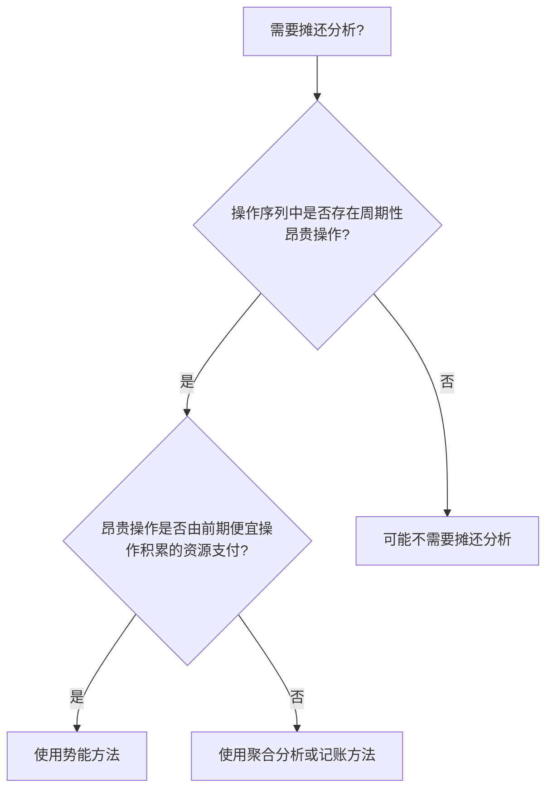
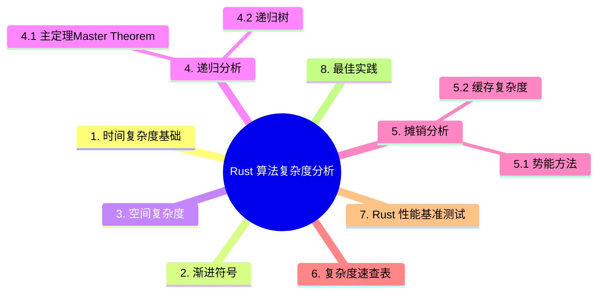

> **内容分级**: [综述级]
> **Bloom 层级**: L5-L6
> **代码状态**: ✅ 含可编译示例
>
# Rust 算法复杂度分析
>
> **EN**: Algorithm Complexity Analysis in Rust
> **Summary**: Time and space complexity analysis using Big-O, Omega, Theta, recurrence relations, and amortized analysis, with Rust code examples.
> **Rust 版本**: 1.97.0+ (Edition 2024)
>
> **受众**: [进阶]
> **权威来源**: 本文件为 `concept/` 权威页。
> **层级**: L6 应用主题
> **A/S/P 标记**: **P+S** — Procedure + Structure
> **前置概念**: [Type System Basics](../../01_foundation/02_type_system/01_type_system.md) · [Functions](../../01_foundation/07_modules_and_items/02_functions.md) · [Collections](../../01_foundation/05_collections/01_collections.md)
> **后置概念**: [算法与竞赛编程](07_algorithms_competitive_programming.md) · [算法工程实践](08_algorithm_engineering_practice.md)
>
> **来源**: [CLRS — Introduction to Algorithms](https://mitpress.mit.edu/9780262046305/introduction-to-algorithms/) · [The Rust Programming Language](https://doc.rust-lang.org/book/title-page.html)

---

## 1. 时间复杂度基础

时间复杂度描述算法执行时间随输入规模增长的变化趋势。

```rust
// O(1) - 常数时间
fn constant_time(arr: &[i32]) -> Option<i32> {
    arr.first().copied()
}

// O(n) - 线性时间
fn linear_time(arr: &[i32]) -> i32 {
    arr.iter().sum()
}

// O(log n) - 对数时间
fn binary_search(arr: &[i32], target: i32) -> Option<usize> {
    let mut left = 0;
    let mut right = arr.len();

    while left < right {
        let mid = left + (right - left) / 2;
        match arr[mid].cmp(&target) {
            std::cmp::Ordering::Equal => return Some(mid),
            std::cmp::Ordering::Less => left = mid + 1,
            std::cmp::Ordering::Greater => right = mid,
        }
    }
    None
}

// O(n log n) - 线性对数时间
fn merge_sort<T: Ord + Clone>(arr: &[T]) -> Vec<T> {
    if arr.len() <= 1 {
        return arr.to_vec();
    }
    let mid = arr.len() / 2;
    let left = merge_sort(&arr[..mid]);
    let right = merge_sort(&arr[mid..]);
    merge(&left, &right)
}

fn merge<T: Ord + Clone>(left: &[T], right: &[T]) -> Vec<T> {
    let mut result = Vec::with_capacity(left.len() + right.len());
    let (mut i, mut j) = (0, 0);
    while i < left.len() && j < right.len() {
        if left[i] <= right[j] {
            result.push(left[i].clone());
            i += 1;
        } else {
            result.push(right[j].clone());
            j += 1;
        }
    }
    result.extend_from_slice(&left[i..]);
    result.extend_from_slice(&right[j..]);
    result
}
```

## 2. 渐进符号

| 符号 | 含义 | 示例 |
| :--- | :--- | :--- |
| O (Big-O) | 上界 | 最坏情况 |
| Ω (Big-Omega) | 下界 | 最好情况 |
| Θ (Big-Theta) | 紧确界 | 平均/确定情况 |

## 3. 空间复杂度

空间复杂度描述算法运行所需的额外内存。

```rust,ignore
// O(1) 额外空间 - 原地排序
fn bubble_sort<T: Ord>(arr: &mut [T]) {
    let len = arr.len();
    for i in 0..len {
        for j in 0..len - 1 - i {
            if arr[j] > arr[j + 1] {
                arr.swap(j, j + 1);
            }
        }
    }
}

// O(n) 额外空间 - 归并排序
fn merge_sort_space<T: Ord + Clone>(arr: &[T]) -> Vec<T> {
    // 每次递归分配新数组
    merge_sort(arr)
}
```

## 4. 递归分析

递归算法的复杂度不能靠“数循环”得出，需要专门的求解工具。本节介绍两种互补方法：

- **主定理（Master Theorem）**：对形如 `T(n) = aT(n/b) + f(n)` 的递归式，比较 `f(n)` 与 `n^(log_b a)` 的阶直接给出闭式解——归并排序（a=b=2, f(n)=Θ(n)）落入第二种情形得 Θ(n log n)。适用前提是子问题规模均匀（等分）。
- **递归树**：展开调用树逐层求和，适用于主定理失效的情形（子问题规模不等、如 `T(n) = T(n/3) + T(2n/3) + O(n)`），也是推导主定理直觉的工具。

实践建议：面试/竞赛先尝试主定理三步判定，形式不齐时画两层递归树找每层的规律再求和。

### 4.1 主定理（Master Theorem）

对于形如 `T(n) = aT(n/b) + f(n)` 的递归式，主定理可直接给出渐近解：

- 若 `f(n) = O(n^c)` 且 `c < log_b(a)`，则 `T(n) = Θ(n^(log_b(a)))`。
- 若 `f(n) = Θ(n^(log_b(a)))`，则 `T(n) = Θ(n^(log_b(a)) log n)`。
- 若 `f(n) = Ω(n^c)` 且 `c > log_b(a)`，则 `T(n) = Θ(f(n))`。

### 4.2 递归树

通过展开递归调用树，逐层计算工作量，再求和得到总复杂度。

## 5. 摊销分析

摊销分析关注操作序列的平均代价，而非单次操作的最坏代价。

```rust
// Vec::push 是摊销 O(1)：
// 大多数 push 只需写入元素；偶尔触发扩容，代价为 O(n)，
// 但均摊到 n 次操作后，每次平均 O(1)。
```

### 5.1 势能方法摊还分析

势能方法（Potential Method）把数据结构视为一个具有「势能」的物理系统。每次操作的**摊还代价**定义为：

```text
摊还代价 = 实际代价 + 操作后的势能 - 操作前的势能
        = 实际代价 + ΔΦ
```

其中 `Φ(D_i)` 表示第 `i` 次操作后数据结构的势能。若势能设计得当，昂贵的操作会消耗之前积累的势能，而便宜的操作则积累势能。

**经典示例：`Vec::push`**

设 `Φ = 2n - m`，其中 `n` 为当前元素数，`m` 为容量。当容量足够时：

| 操作 | 实际代价 | ΔΦ | 摊还代价 |
|---|---|---|---|
| 普通 push（不扩容） | 1 | `+2` | 3 |
| 扩容 push（容量翻倍） | `n+1` | `-(n-2)` | 3 |

因此 `Vec::push` 的摊还代价为 O(1)。

```rust
fn push_amortized_analysis() {
    let mut v = Vec::with_capacity(4);
    for i in 0..10 {
        v.push(i); // 前 4 次不扩容，第 5 次扩容到 8，第 9 次扩容到 16
    }
    // 总拷贝次数 ≈ n，均摊到 n 次操作为 O(1)
}
```

**决策树：何时使用势能方法？**



### 5.2 缓存复杂度简介

现代 CPU 的内存层级意味着：**算法复杂度不仅要看比较/访问次数，还要看缓存未命中次数**。缓存复杂度（Cache Complexity）描述算法执行过程中 cache miss 的数量，通常用「缓存无关模型（Cache-Oblivious Model）」或「外部内存模型（External Memory Model）」分析。

| 复杂度模型 | 关注点 | 示例 |
|---|---|---|
| RAM 模型 | 基本操作次数 | 比较次数、赋值次数 |
| 外部内存模型 | I/O 次数（块传输） | 外部排序的扫描趟数 |
| 缓存无关模型 | 自动适应任意缓存行大小 | 分块矩阵乘法、van Emde Boas 布局 |

**Rust 工程启示**：

- 顺序访问 `Vec<T>` 的缓存友好度远高于链表；
- 分块（tiling）可将矩阵乘法的缓存复杂度从 O(n³) 降到 O(n³ / √Z)，其中 Z 为缓存大小；
- `rayon` 等并行库在拆分数组时尽量保持连续子数组，以提升局部性。

```rust
// ❌ 列优先访问，缓存未命中高
fn sum_columns_bad(matrix: &[Vec<f64>], n: usize) -> Vec<f64> {
    let mut sums = vec![0.0; n];
    for col in 0..n {
        for row in 0..n {
            sums[col] += matrix[row][col];
        }
    }
    sums
}

// ✅ 行优先访问，缓存友好
fn sum_rows_good(matrix: &[Vec<f64>], n: usize) -> Vec<f64> {
    let mut sums = vec![0.0; n];
    for row in 0..n {
        for col in 0..n {
            sums[row] += matrix[row][col];
        }
    }
    sums
}
```

## 6. 复杂度速查表

| 复杂度 | 增长速度 | 示例算法 |
| :--- | :--- | :--- |
| O(1) | 常数 | 数组访问 |
| O(log n) | 对数 | 二分搜索 |
| O(n) | 线性 | 线性搜索 |
| O(n log n) | 线性对数 | 归并排序、堆排序 |
| O(n²) | 平方 | 冒泡排序 |
| O(2ⁿ) | 指数 | 递归斐波那契 |

## 7. Rust 性能基准测试

使用 `criterion` 进行可重复的基准测试：

```rust
use criterion::{black_box, criterion_group, criterion_main, Criterion};

fn fibonacci(n: u64) -> u64 {
    match n {
        0 => 1,
        1 => 1,
        n => fibonacci(n - 1) + fibonacci(n - 2),
    }
}

fn criterion_benchmark(c: &mut Criterion) {
    c.bench_function("fib 20", |b| b.iter(|| fibonacci(black_box(20))));
}

criterion_group!(benches, criterion_benchmark);
criterion_main!(benches);
```

## 8. 最佳实践

- 先关注最坏情况复杂度，再考虑平均/摊销。
- 避免过早优化；先测量再优化。
- 利用 Rust 的迭代器（Iterator）和零成本抽象（Zero-Cost Abstraction）保持代码简洁且高效。
- 注意空间-时间权衡：有时用更多内存换取更快查询。

> **L5 对比**: [Rust vs C++](../../05_comparative/01_systems_languages/01_rust_vs_cpp.md)

---

> **来源**: [CLRS — Introduction to Algorithms](https://mitpress.mit.edu/9780262046305/introduction-to-algorithms/) · [Criterion.rs](https://bheisler.github.io/criterion.rs/book/)

---

## 国际权威参考 / International Authority References（P1 学术 · P2 生态）

> 依据 `AGENTS.md` §2「对齐网络国际化权威内容」补充：仅追加已验证可达的权威链接，不改动正文事实。

- **P2 生态/社区**: [docs.rs/rayon — 生态权威 API 文档](https://docs.rs/rayon) · [docs.rs/petgraph — 生态权威 API 文档](https://docs.rs/petgraph)
- **P1 学术/形式化**: [Skiena: The Algorithm Design Manual (2nd ed., Springer)](https://link.springer.com/book/10.1007/978-1-84800-070-4)
- **P1 学术**: [CLRS — Introduction to Algorithms (4th ed., MIT Press)](https://mitpress.mit.edu/9780262046305/introduction-to-algorithms/)
- **P1 学术**: [Frigo et al. — Cache-Oblivious Algorithms (ACM Transactions on Algorithms)](https://dl.acm.org/doi/10.1145/805685.805687)
- **P1 学术**: [Aggarwal & Vitter — The Input/Output Complexity of Sorting and Related Problems (Communications of the ACM)](https://dl.acm.org/doi/10.1145/48529.48535)

---

## ⚠️ 反例与陷阱：深递归导致栈溢出（运行时陷阱）

**反例**（运行时（Runtime）陷阱，代码可通过编译）：

```rust
fn sum_to(n: u64) -> u64 {
    if n == 0 { 0 } else { n + sum_to(n - 1) }
}
fn main() {
    println!("{}", sum_to(1_000_000));
}
```

Rust 不保证尾调用优化，O(n) 递归深度意味着 O(n) 栈空间；主线程默认 8 MiB 栈，百万级递归必然溢出——复杂度分析要同时算时间栈两维。

**修正**：

```rust
fn sum_to(n: u64) -> u64 {
    let mut acc = 0;
    for i in 1..=n { acc += i; }
    acc
}
fn main() {
    println!("{}", sum_to(1_000_000));
}
```

## 🧭 思维导图（Mindmap）


