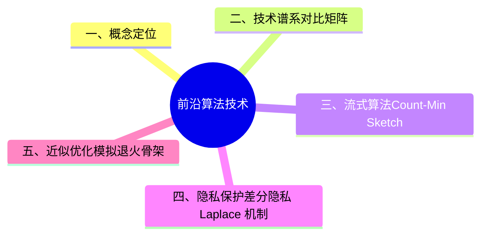

> **内容分级**: [综述级]
> **定理链**: N/A — 描述性/综述性/导航性文档，不涉及形式化定理链
> **代码状态**: ✅ 含可编译示例
>
# 前沿算法技术
>
> **EN**: Cutting-Edge Algorithm Technologies
> **Summary**: Cutting-edge algorithm technologies in Rust: probabilistic data structures, streaming algorithms, approximation and meta-heuristics, privacy-preserving computation, and links to machine learning and quantum ecosystems.
> **Rust 版本**: 1.97.0+ (Edition 2024)
>
> **受众**: [专家]
> **权威来源**: 本文件为 `concept/` 权威页。
> **层级**: L6 应用主题
> **A/S/P 标记**: **A+S** — Application + Structure
> **前置概念**: [算法复杂度分析](10_algorithm_complexity_analysis.md) · [算法工程实践](08_algorithm_engineering_practice.md)
> **后置概念**: [量子计算生态](16_quantum_computing_rust.md) · [机器学习生态](13_machine_learning_ecosystem.md)
> **相关概念**: [数据结构与 Rust](09_data_structures_in_rust.md) · [算法与竞赛编程](07_algorithms_competitive_programming.md) · [形式化算法理论](12_formal_algorithm_theory.md) · [工程实践与生产级模式](../03_design_patterns/13_engineering_and_production_patterns.md) · [前沿研究与创新模式](../03_design_patterns/12_frontier_research_and_innovative_patterns.md)
> **L5 对比视角**: [范式矩阵](../../05_comparative/00_paradigms/01_paradigm_matrix.md) · [Rust vs C++ 性能与抽象边界](../../05_comparative/01_systems_languages/01_rust_vs_cpp.md) · [安全边界对比](../../05_comparative/03_domain_comparisons/01_safety_boundaries.md)
>
> **来源**: [CLRS — Introduction to Algorithms](https://mitpress.mit.edu/9780262046305/introduction-to-algorithms/) · [The Rust Programming Language](https://doc.rust-lang.org/book/title-page.html) · [Mining of Massive Datasets](http://www.mmds.org/)

---

## 一、概念定位

前沿算法技术指在 Rust 生态中实现的新兴算法范式，涵盖**流式计算、概率数据结构、近似优化、隐私保护计算、机器学习系统与量子模拟**六大领域。Rust 的零成本抽象（Zero-Cost Abstraction）与内存安全（Memory Safety）保证，使这些算法在保持高性能的同时避免传统系统语言的内存风险。

## 二、技术谱系对比矩阵

| 领域 | 代表算法/结构 | Rust 优势 | 典型 crate | 精度/安全权衡 |
|:---|:---|:---|:---|:---|
| **流式算法** | Count-Min Sketch、HyperLogLog | 低内存、单次扫描 | 自研 / `bloom` | 概率误差换亚线性内存 |
| **近似/元启发式** | 模拟退火、遗传算法 | 组合优化零开销 | 自研泛型（Generics）实现 | 放弃全局最优换可扩展性 |
| **隐私保护** | 差分隐私、安全聚合 | 密码学原语类型安全 | `dalek`, `tfhe-rs` | 噪声换隐私保证 |
| **机器学习系统** | 梯度下降、神经网络图 | 无 GC 暂停、可预测延迟 | `candle`, `burn`, `tch` | 算子精度换训练速度 |
| **量子模拟** | Shor、Grover、量子门 | 可安全封装量子态借用（Borrowing） | `quair` / Qiskit 绑定 | 指数资源换模拟能力 |

## 三、流式算法：Count-Min Sketch

Count-Min Sketch 使用多个哈希函数在固定大小的计数器数组上估计元素频率，空间复杂度 $O((1/\varepsilon)\ln(1/\delta))$。

```rust
use std::collections::hash_map::DefaultHasher;
use std::hash::{Hash, Hasher};

pub struct CountMinSketch {
    width: usize,
    depth: usize,
    table: Vec<Vec<u64>>,
    salts: Vec<u64>,
}

impl CountMinSketch {
    pub fn new(epsilon: f64, delta: f64) -> Self {
        let width = (std::f64::consts::E / epsilon).ceil() as usize;
        let depth = (1.0 / delta).ln().ceil() as usize;
        let salts: Vec<u64> = (0..depth).map(|i| 0x9e3779b97f4a7c15 + i as u64).collect();
        Self {
            width,
            depth,
            table: vec![vec![0u64; width]; depth],
            salts,
        }
    }

    fn hash(&self, item: &[u8], salt: u64) -> usize {
        let mut hasher = DefaultHasher::new();
        item.hash(&mut hasher);
        salt.hash(&mut hasher);
        (hasher.finish() as usize) % self.width
    }

    pub fn add(&mut self, item: &[u8]) {
        for d in 0..self.depth {
            let idx = self.hash(item, self.salts[d]);
            self.table[d][idx] = self.table[d][idx].saturating_add(1);
        }
    }

    pub fn estimate(&self, item: &[u8]) -> u64 {
        (0..self.depth)
            .map(|d| self.table[d][self.hash(item, self.salts[d])])
            .min()
            .unwrap_or(0)
    }
}

pub fn top_k_frequencies<'a>(items: &'a [&'a str], k: usize) -> Vec<(&'a str, u64)> {
    use std::collections::HashMap;
    let mut exact: HashMap<&str, u64> = HashMap::new();
    for item in items {
        *exact.entry(item).or_insert(0) += 1;
    }
    let mut pairs: Vec<_> = exact.into_iter().collect();
    pairs.sort_by_key(|&(_, c)| std::cmp::Reverse(c));
    pairs.into_iter().take(k).collect()
}
```

## 四、隐私保护：差分隐私 Laplace 机制

差分隐私通过在查询结果上添加 calibrated 噪声，提供可量化的隐私保证。Laplace 机制适用于 $L_1$ 敏感度。

```rust,ignore
// 需 `rand` crate
pub struct LaplaceMechanism {
    epsilon: f64,
    sensitivity: f64,
}

impl LaplaceMechanism {
    pub fn new(epsilon: f64, sensitivity: f64) -> Self {
        assert!(epsilon > 0.0 && sensitivity > 0.0);
        Self { epsilon, sensitivity }
    }

    /// 从拉普拉斯分布采样：使用指数分布的逆变换采样
    pub fn sample(&self) -> f64 {
        let scale = self.sensitivity / self.epsilon;
        let u: f64 = rand::random::<f64>().clamp(1e-15, 1.0 - 1e-15);
        let sign = if u < 0.5 { -1.0 } else { 1.0 };
        let exp = -u.ln() * scale;
        sign * exp
    }

    pub fn release(&self, true_value: f64) -> f64 {
        true_value + self.sample()
    }
}

pub fn private_count(items: &[&str], epsilon: f64) -> f64 {
    let mechanism = LaplaceMechanism::new(epsilon, 1.0);
    let true_count = items.len() as f64;
    mechanism.release(true_count)
}
```

## 五、近似优化：模拟退火骨架

```rust,ignore
// 需 `rand` crate
use rand::Rng;

pub fn simulated_annealing<S, E, N, C>(
    mut state: S,
    mut energy: E,
    mut neighbor: N,
    mut cooling: C,
    iterations: usize,
) -> S
where
    E: FnMut(&S) -> f64,
    N: FnMut(&S) -> S,
    C: FnMut(usize) -> f64,
{
    let mut rng = rand::thread_rng();
    let mut current_energy = energy(&state);
    for i in 0..iterations {
        let candidate = neighbor(&state);
        let candidate_energy = energy(&candidate);
        let delta = candidate_energy - current_energy;
        let temp = cooling(i).max(1e-10);
        if delta < 0.0 || rng.gen::<f64>() < (-delta / temp).exp() {
            state = candidate;
            current_energy = candidate_energy;
        }
    }
    state
}
```

## 六、前沿算法决策树

```text
选择前沿算法技术
│
├─ 数据以流式到达且内存受限？
│  ├─ 需要频率估计 → Count-Min Sketch
│  └─ 需要基数估计 → HyperLogLog
│
├─ 需要优化 NP-hard / 组合问题？
│  ├─ 解空间巨大 → 模拟退火 / 遗传算法
│  └─ 可接受近似比 → 贪心 + 理论保证
│
├─ 输出涉及敏感个体数据？
│  ├─ 需要数学隐私保证 → 差分隐私
│  └─ 需要多方联合计算 → 安全多方计算 / 同态加密
│
├─ 需要数据驱动预测？
│  └─ 机器学习（梯度下降 / 神经网络）
│
└─ 需要利用量子加速？
   └─ 量子计算模拟或 Q# 互操作
```

## 七、与 Rust 核心概念的关联

- **零成本抽象（Zero-Cost Abstraction）**：流式算法依赖 SIMD 和缓存友好布局实现单遍扫描。
- **所有权（Ownership）与借用（Borrowing）**：量子态模拟中，借用检查器防止量子比特别名错误。
- **类型安全**：同态加密的密文类型通过泛型（Generics）在编译期区分明文/密文。
- **错误处理（Error Handling）**：隐私预算耗尽可建模为 `Result<T, PrivacyBudgetExhausted>`。

## 八、选型矩阵

| 场景 | 推荐算法族 | 精度 | 内存 | 安全保证 | Rust 实践 |
|:---|:---|:---|:---|:---|:---|
| 实时 UV 统计 | HyperLogLog | 1-2% 误差 | KB 级 | 无 | `bloom` / 自研 |
| 热门词频 Top-K | Count-Min Sketch | 高估可接受 | MB 级 | 无 | 泛型哈希 |
| 敏感查询发布 | Laplace 机制 | 噪声可控 | O(1) | $(\varepsilon,0)$-DP | `rand` |
| 旅行商/调度 | 模拟退火 | 近似解 | O(n) | 无 | 泛型骨架 |
| 神经网络推理 | 图优化 | 浮点精度 | 模型相关 | 模型保密 | `candle` |

---

> **来源**: [Rust Reference](https://doc.rust-lang.org/reference/), [The Rust Programming Language](https://doc.rust-lang.org/book/), [Rust Standard Library](https://doc.rust-lang.org/std/)
>
> **权威来源对齐变更日志**: 2026-07-09 由 `crates/c08_algorithms/docs/tier_04_advanced/05_cutting_edge_algorithms.md` 迁移整合；本次补全新增 Count-Min Sketch、差分隐私、模拟退火 Rust 示例与决策树

**状态**: ✅ 权威页（canonical）

## 过渡段

> **过渡**: 从研究论文过渡到原型实现，可以理解算法在实际类型系统（Type System）下的表达挑战。
>
> **过渡**: 从原型过渡到安全 Rust，可以用所有权（Ownership）与类型系统（Type System）保证关键不变量。
>
> **过渡**: 从安全实现过渡到性能基准，可以验证新算法在真实场景中的优势。
>

## 定理链

| 定理 | 前提 | 结论 |
|:---|:---|:---|
| Rust 内存安全（Memory Safety） ⟹ 更少并发 bug | 所有权与借用检查 | 降低新算法实现风险 |
| 类型系统 ⟹ 不变量强制 | 将算法前提编码为类型 | 编译期排除非法状态 |
| 基准测试 ⟹ 真实有效性 | 与现有实现对比 | 确认性能假设 |

---

## 国际权威参考 / International Authority References（P1 学术 · P2 生态）

> 依据 `AGENTS.md` §2「对齐网络国际化权威内容」补充：仅追加已验证可达的权威链接，不改动正文事实。

- **P2 生态/社区**: [docs.rs/rayon — 生态权威 API 文档](https://docs.rs/rayon) · [docs.rs/petgraph — 生态权威 API 文档](https://docs.rs/petgraph)
- **P1 学术/形式化**: [Skiena: The Algorithm Design Manual (2nd ed., Springer)](https://link.springer.com/book/10.1007/978-1-84800-070-4)

## 🧭 思维导图（Mindmap）



## ⚠️ 反例与陷阱

**陷阱（Bloom filter 假阳性当权威判断）**：概率型数据结构只保证「无假阴性」，`may_contain == true` 不代表元素一定存在；且标准 Bloom filter 不支持删除。把阳性结果直接当权威判断是典型误用：

```rust
use std::collections::HashSet;

struct Bloom { bits: Vec<bool>, k: usize }
impl Bloom {
    fn new(n: usize, k: usize) -> Self { Self { bits: vec![false; n], k } }
    fn hashes(&self, x: &str) -> Vec<usize> {
        let h = x.bytes().fold(0u64, |a, b| a.wrapping_mul(31).wrapping_add(b as u64));
        (0..self.k).map(|i| ((h.wrapping_add(i as u64 * 0x9E37_79B9)) as usize) % self.bits.len()).collect()
    }
    fn insert(&mut self, x: &str) { for i in self.hashes(x) { self.bits[i] = true; } }
    fn may_contain(&self, x: &str) -> bool { self.hashes(x).iter().all(|&i| self.bits[i]) }
}

fn main() {
    let mut bf = Bloom::new(64, 3);
    bf.insert("alice");
    if bf.may_contain("bob") {
        // 修正对照：阳性结果必须回源校验，不能作为权威判断
        let authoritative: HashSet<&str> = ["alice"].into_iter().collect();
        assert!(!authoritative.contains("bob"));
    }
    assert!(bf.may_contain("alice")); // 已插入元素必为阳性（无假阴性）
}
```

> 同理：Count-Min Sketch 只给上界估计、HyperLogLog 只给基数近似——所有概率型结构的结果都要按「估计」而非「事实」消费。
