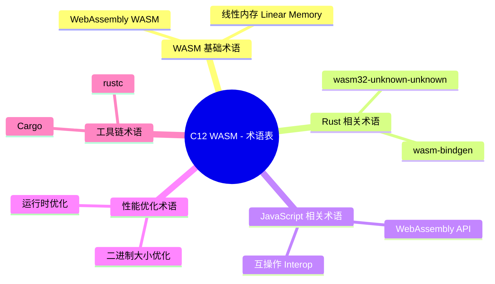

> **EN**: WebAssembly Glossary
> **Summary**: Authoritative concept page for `C12 WASM - 术语表`. Content migrated from `crates/c12_wasm/docs/tier_01_foundations/03_glossary.md`.
> **Rust 版本**: 1.97.0+ (Edition 2024)
> **受众**: [进阶]
> **内容分级**: [参考级]
> **Bloom 层级**: L1-L2
> **权威来源**: 本文件为 `concept/` 权威页。
> **A/S/P 标记**: **S** — Structure
> **双维定位**: S×Mem — WebAssembly 术语索引
> **前置依赖**: [WebAssembly](03_webassembly.md) · [Rust WebAssembly Advanced](17_webassembly_advanced.md)
> **后置概念**: [Wasm FAQ](19_wasm_faq.md) · [Wasm JavaScript Interop](20_wasm_javascript_interop.md)
> **定理链**: Terminology Standardization ⟹ Concept Alignment ⟹ Communication Efficiency
>
> **权威来源**: 本页为 `WebAssembly Glossary` 的权威概念页；crate 文档仅保留导航 stub。

# C12 WASM - 术语表

> **文档类型**: Tier 1 - 基础层
> **文档定位**: WASM 核心术语快速参考
> **项目状态**: ✅ 完整完成
> **相关文档**: [项目概览](/crates/c12_wasm/docs/tier_01_foundations/01_project_overview.md) | [主索引导航](/crates/c12_wasm/docs/tier_01_foundations/02_navigation.md) | [FAQ](/crates/c12_wasm/docs/tier_01_foundations/04_faq.md)

**最后更新**: 2025-12-11
**适用版本**: Rust 1.97.0+ / Edition 2024, WASM 2.0 + WASI 0.2

---

## 📋 目录

- [C12 WASM - 术语表](#c12-wasm---术语表)
  - [📋 目录](#-目录)
  - [🌐 WASM 基础术语](#-wasm-基础术语)
    - [WebAssembly (WASM)](#webassembly-wasm)
    - [线性内存 (Linear Memory)](#线性内存-linear-memory)
    - [模块 (Module)](#模块-module)
    - [实例 (Instance)](#实例-instance)
    - [WAT (WebAssembly Text Format)](#wat-webassembly-text-format)
    - [指令集 (Instruction Set)](#指令集-instruction-set)
    - [栈式虚拟机 (Stack-based VM)](#栈式虚拟机-stack-based-vm)
    - [导入/导出 (Import/Export)](#导入导出-importexport)
  - [🦀 Rust 相关术语](#-rust-相关术语)
    - [wasm32-unknown-unknown](#wasm32-unknown-unknown)
    - [wasm-bindgen](#wasm-bindgen)
    - [wasm-pack](#wasm-pack)
    - [类型映射 (Type Mapping)](#类型映射-type-mapping)
    - [内存分配 (Memory Allocation)](#内存分配-memory-allocation)
  - [🔗 JavaScript 相关术语](#-javascript-相关术语)
    - [WebAssembly API](#webassembly-api)
    - [互操作 (Interop)](#互操作-interop)
    - [绑定 (Binding)](#绑定-binding)
  - [⚡ 性能优化术语](#-性能优化术语)
    - [二进制大小优化](#二进制大小优化)
    - [运行时优化](#运行时优化)
    - [LTO (Link Time Optimization)](#lto-link-time-optimization)
    - [wasm-opt](#wasm-opt)
  - [🛠️ 工具链术语](#️-工具链术语)
    - [Cargo](#cargo)
    - [rustc](#rustc)
    - [wasmtime](#wasmtime)
    - [wasmer](#wasmer)
  - [📚 相关资源](#-相关资源)
  - [**适用版本**: Rust 1.97.0+ / Edition 2024, WASM 2.0 + WASI 0.2](#适用版本-rust-1970--edition-2024-wasm-20--wasi-02)
  - [过渡段](#过渡段)
  - [定理链](#定理链)
  - [国际权威参考 / International Authority References（P0 官方 · P1 学术 · P2 生态）](#国际权威参考--international-authority-referencesp0-官方--p1-学术--p2-生态)
  - [🧭 思维导图（Mindmap）](#-思维导图mindmap)

---

## 🌐 WASM 基础术语

WASM 基础术语构成理解整个生态的最小词汇表，可按“静态产物 → 运行实例 → 内存模型”三层归组：

- **静态层**: 模块（Module）是编译后的 `.wasm` 二进制，包含函数、表、内存与全局变量的声明；它是无状态的，可被多次实例化。
- **运行层**: 实例（Instance）是模块 + 导入绑定后的活对象，拥有自己的状态；宿主（Host）通过导入/导出函数与实例交互。
- **内存层**: 线性内存（Linear Memory）是一块可增长的连续字节数组（按 64KiB 页计），是 WASM 与外部交换复杂数据的唯一通道——所有字符串、结构体最终都编码在这块内存里。

其余术语（表 Table、全局 Global、起动函数 Start）均可挂接到这三层上理解。

### WebAssembly (WASM)

**定义**: 一种低级的二进制指令格式，设计为可移植的编译目标，用于在 Web 上部署高性能应用。

**特点**:

- 二进制格式，体积小
- 接近原生代码的执行速度
- 沙箱执行环境，安全性高
- 跨平台，一次编写到处运行

### 线性内存 (Linear Memory)

**定义**: WASM 模块（Module）的单一连续内存空间，用于存储数据。

**特点**:

- 从 0 开始的字节数组
- 可以动态增长（通过 `memory.grow`）
- 大小限制为 4GB（32位地址空间）
- JavaScript 可以访问和操作

### 模块 (Module)

**定义**: WASM 的编译单元，包含函数、内存、表等定义。

**组成**:

- **函数**: 定义和导入的函数
- **内存**: 线性内存定义
- **表**: 函数引用（Reference）表
- **全局变量**: 全局状态

### 实例 (Instance)

**定义**: 模块（Module）的运行时（Runtime）表示，包含已分配的内存和导出的函数。

**关系**: 模块 → 实例化 → 实例

### WAT (WebAssembly Text Format)

**定义**: WASM 的文本表示格式，人类可读的汇编语言。

**用途**:

- 手动编写 WASM 代码
- 调试和查看 WASM 模块
- 学习 WASM 指令集

### 指令集 (Instruction Set)

**定义**: WASM 虚拟机支持的操作指令集合。

**分类**:

- **数值操作**: 算术运算、比较
- **控制流**: 分支、循环、返回
- **内存操作**: 加载、存储
- **变量操作**: 局部变量、全局变量

### 栈式虚拟机 (Stack-based VM)

**定义**: 使用栈来存储操作数的虚拟机模型。

**特点**:

- 操作数在栈上传递
- 指令从栈顶弹出操作数
- 结果推回栈顶

### 导入/导出 (Import/Export)

**导入**: 模块需要的外部功能（函数、内存、表等）
**导出**: 模块提供给外部使用的功能

---

## 🦀 Rust 相关术语

Rust 相关术语围绕“目标 → 胶水 → 打包”的工具链与类型边界组织：

- **`wasm32-unknown-unknown`**: 最基础的编译目标，不预设任何宿主系统接口（无 WASI），产出需宿主提供导入才能做 I/O。
- **wasm-bindgen**: 生成 Rust↔JS 胶水层的工具与宏（`#[wasm_bindgen]`），定义了**类型映射（Type Mapping）**——`String` ↔ JS string（经编码拷贝）、`&[u8]` ↔ `Uint8Array` 视图、结构体 ↔ JS class 包装。
- **wasm-pack**: 面向 npm 生态的打包发布工具，串联 bindgen、优化与包元数据。

术语间的关键联系：类型映射的成本（拷贝次数）是互操作性能的决定因素，选工具链前先确认目标宿主是否支持组件模型——支持则 WIT 取代手写类型映射。

### wasm32-unknown-unknown

**定义**: Rust 的 WASM 编译目标三元组。

**组成**:

- **wasm32**: 32位 WASM 架构
- **unknown**: 未知操作系统
- **unknown**: 未知环境

### wasm-bindgen

**定义**: Rust 和 JavaScript 之间的绑定生成器。

**功能**:

- 自动生成类型转换代码
- 提供 Rust 和 JavaScript 互操作桥梁
- 支持复杂类型映射

### wasm-pack

**定义**: 用于构建、测试和发布 Rust 生成的 WASM 包的工具。

**功能**:

- 编译 Rust 代码到 WASM
- 生成 JavaScript 包装代码
- 创建 npm 包
- 发布到 npm registry

### 类型映射 (Type Mapping)

**定义**: Rust 类型到 JavaScript 类型的转换规则。

**常见映射**:

- `i32` → `number`
- `String` → `string`
- `Vec<T>` → `Array`
- `Result<T, E>` → `Promise`

### 内存分配 (Memory Allocation)

**定义**: 在 WASM 线性内存中分配空间。

**Rust 方式**:

- 使用 `Box<T>` 分配堆内存
- 使用 `Vec<T>` 动态数组
- 使用 `String` 字符串

---

## 🔗 JavaScript 相关术语

JavaScript 侧术语描述宿主如何消费 WASM 模块，核心是**实例化 API 的两种形态**：

- **`WebAssembly` API**: 浏览器/Node 内置命名空间，`compile`/`instantiate` 分离编译与实例化，`compileStreaming`/`instantiateStreaming` 直接消费 `fetch` 的 `Response`，边下载边编译——生产环境必须走 streaming 路径。
- **互操作（Interop）**: 泛指 JS 与 WASM 之间的数据交换，成本由调用开销 + 数据编组共同决定。
- **绑定（Binding）**: 预生成的胶水代码（如 wasm-bindgen 产物、emscripten 的 JS 库），把互操作细节封装为普通函数调用。

术语辨析：`instantiate(bytes)` 需要完整字节数组（双倍内存占用），`instantiateStreaming(response)` 则流式处理——大模块下两者首屏时间可差数倍。

### WebAssembly API

**定义**: JavaScript 提供的 WASM 操作接口。

**主要 API**:

- `WebAssembly.compile()`: 编译 WASM 二进制
- `WebAssembly.instantiate()`: 实例化模块
- `WebAssembly.Module`: 模块对象
- `WebAssembly.Instance`: 实例对象

### 互操作 (Interop)

**定义**: Rust WASM 模块与 JavaScript 代码之间的交互。

**方式**:

- 函数调用
- 内存共享
- 类型转换

### 绑定 (Binding)

**定义**: 将 Rust 函数、结构体（Struct）等暴露给 JavaScript。

**wasm-bindgen 提供**:

- `#[wasm_bindgen]` 宏（Macro）
- 自动生成绑定代码
- TypeScript 类型定义

---

## ⚡ 性能优化术语

WASM 性能优化术语围绕“二进制大小”与“运行时速度”两个往往冲突的目标组织：

- **二进制大小优化**：`opt-level = "s"/"z"`、`lto = true`、`strip = true` 与 wasm-opt 后处理，对首屏加载敏感的 Web 应用是首要指标；典型收益 20–30%。
- **运行时优化**：减少分配、算法优化、SIMD 指令与避免跨边界类型转换——注意 wasm↔JS 边界的字符串/数组拷贝常是真实瓶颈，优于微优化 Rust 内部循环。
- **LTO**：跨 crate 整体优化，同时改善大小与速度，代价是编译时间显著增加；`thin` 是常见的折中档。
- **wasm-opt**：Binaryen 工具链的后处理优化器，在 rustc/LLVM 优化之后进一步压缩与加速，发布构建的标准最后一步。

以下小节给出各术语的定义、方法与典型收益。

### 二进制大小优化

**定义**: 减小生成的 WASM 二进制文件大小。

**方法**:

- `opt-level = "s"` 或 `"z"`: 优化大小
- `lto = true`: 链接时优化
- `strip = true`: 去除调试符号
- `wasm-opt`: 二进制优化工具

### 运行时优化

**定义**: 提高 WASM 代码的执行性能。

**方法**:

- 减少内存分配
- 优化算法
- 使用 SIMD 指令
- 避免不必要的类型转换

### LTO (Link Time Optimization)

**定义**: 链接时优化，跨 crate 边界进行整体优化。

**效果**:

- 减少 20-30% 的二进制大小
- 提高运行时性能
- 增加编译时间

### wasm-opt

**定义**: Binaryen 项目提供的 WASM 优化工具。

**功能**:

- 优化二进制大小
- 优化执行性能
- 验证 WASM 模块正确性

---

## 🛠️ 工具链术语

WASM 工作流的工具链术语按编译—运行—封装三层组织：

- **编译层**：`cargo` 与 `rustc` 负责将 Rust 编译到 `wasm32-unknown-unknown`（浏览器）或 `wasm32-wasip1/p2`（WASI 服务端）目标，链接对应的标准库切片。
- **运行层**：`wasmtime`（Bytecode Alliance 的独立运行时，服务端/CLI/边缘计算标准选择）与 `wasmer`（支持多后端编译器与嵌入式场景）让 WASM 脱离浏览器运行；WASI 定义了它们共同的系统接口（文件、时钟、随机数）。
- **封装层**：`wasm-bindgen`/`wasm-pack` 处理 JS 胶水与 npm 发布（浏览器侧），`wizer` 做快照预初始化加速冷启动。

选型提示：服务端无特殊需求默认 wasmtime；需要嵌入式宿主或特定编译后端评估 wasmer。

### Cargo

**定义**: Rust 的包管理器和构建工具。

**WASM 相关**:

- `cargo build --target wasm32-unknown-unknown`
- `cargo test`
- `cargo publish`

### rustc

**定义**: Rust 编译器。

**WASM 编译**:

- 将 Rust 代码编译为 WASM
- 生成 `.wasm` 文件
- 链接 Rust 标准库

### wasmtime

**定义**: 独立的 WASM 运行时，可以在非浏览器环境中运行 WASM。

**用途**:

- 服务器端运行 WASM
- 命令行工具
- 边缘计算

### wasmer

**定义**: 高性能 WASM 运行时。

**特点**:

- 支持多种编译后端
- 高性能执行
- 丰富的 API

---

## 📚 相关资源

- [项目概览](/crates/c12_wasm/docs/tier_01_foundations/01_project_overview.md) - 了解整体架构
- [主索引导航](/crates/c12_wasm/docs/tier_01_foundations/02_navigation.md) - 找到学习路径
- [常见问题](/crates/c12_wasm/docs/tier_01_foundations/04_faq.md) - 解决疑问

---

**文档维护**: Documentation Team
**创建日期**: 2025-10-30
**适用版本**: Rust 1.97.0+ / Edition 2024, WASM 2.0 + WASI 0.2
---

> **权威来源**: [Rust Reference](https://doc.rust-lang.org/reference/), [The Rust Programming Language](https://doc.rust-lang.org/book/), [Rust Standard Library](https://doc.rust-lang.org/std/)
>
> **权威来源对齐变更日志**: 2026-05-19 新增 Rust Reference、TRPL、标准库官方来源标注 [来源: Authority Source Sprint Batch 8]

**文档版本**: 1.1
**最后更新**: 2026-05-19
**状态**: ✅ 权威来源对齐完成 (Batch 8)

---

> **向下引用（Reference）**: 参见 [08_rust_vs_javascript](../../05_comparative/02_managed_languages/03_rust_vs_javascript.md)

## 过渡段

> **过渡**: 从 wasm 术语过渡到浏览器/宿主环境，可以理解 WebAssembly 在不同运行时的角色。
>
> **过渡**: 从宿主环境过渡到 JS 互操作，可以建立 wasm 与 JavaScript 协同工作的视角。
>
> **过渡**: 从互操作过渡到性能优化，可以将术语理解与工程实践链接。
>

## 定理链

| 定理 | 前提 | 结论 |
|:---|:---|:---|
| 统一 wasm 术语 ⟹ 文档清晰 | 模块、实例、内存等概念一致 | 降低学习门槛 |
| 宿主 API 链接 ⟹ 快速定位 | 指向 WASI、JS API 等权威来源 | 缩短查阅时间 |
| 性能术语 ⟹ 优化焦点 | 加载、实例化、调用开销 | 指导性能调优方向 |

---

## 国际权威参考 / International Authority References（P0 官方 · P1 学术 · P2 生态）

> 依据 `AGENTS.md` §2「对齐网络国际化权威内容」补充：仅追加已验证可达的权威链接，不改动正文事实。

- **P1 学术/形式化**: [Haas et al.: Bringing the Web up to Speed with WebAssembly (PLDI 2017)](https://dl.acm.org/doi/10.1145/3062341.3062363)
- **P2 生态/社区**: [docs.rs/wasm-bindgen — WASM 绑定权威 API 文档](https://docs.rs/wasm-bindgen)

## 🧭 思维导图（Mindmap）

