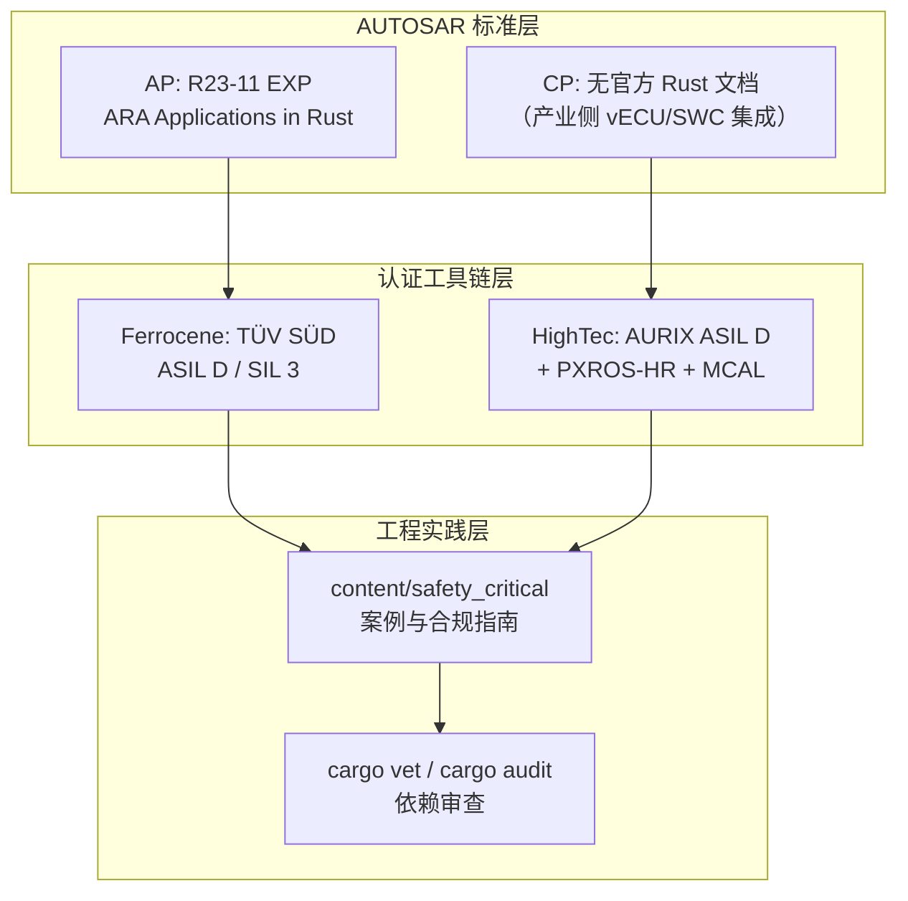
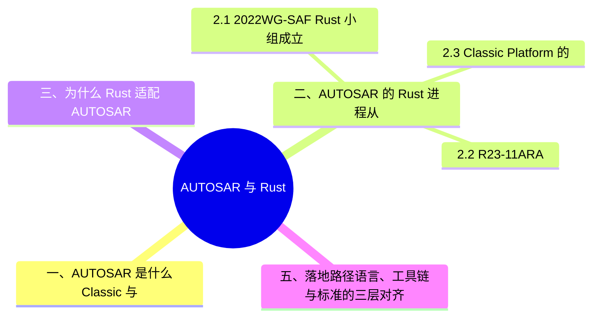

# AUTOSAR 与 Rust

> **EN**: AUTOSAR and Rust
> **Summary**: AUTOSAR (Classic/Adaptive Platform) and its relationship with Rust: the WG-SAF Rust initiative (2022), the R23-11 "Explanation of ARA Applications in Rust" document, Rust ecosystem crates for AUTOSAR data formats and protocols, and the certified-toolchain path for AUTOSAR projects.
> **Rust 版本**: 1.97.0+ (Edition 2024)
> **受众**: [进阶 / 专家]
> **内容分级**: [专家级]
> **Bloom 层级**: L3-L5
> **权威来源**: 本文件为 `concept/` 中 **AUTOSAR×Rust 概念**的权威页；汽车 ECU 工程案例见 [`content/safety_critical/`](../../../content/safety_critical/) 专题套件（canonical 分工：概念在本页，案例在 content）。
> **A/S/P 标记**: **S** — Structure
> **双维定位**: P×Und — 理解汽车软件标准体系中的 Rust 位置
> **前置概念**: [Ferrocene](../../07_future/02_preview_features/12_ferrocene_preview.md) · [认证工具链与认证包清单](../../04_formal/04_model_checking/10_certified_toolchains_and_packages.md) · [安全关键 Rust 专题索引](21_safety_critical_topic_index.md) · [Rust vs C++](../../05_comparative/01_systems_languages/01_rust_vs_cpp.md)
> **后置概念**: [Industrial Case Studies](14_industrial_case_studies.md) · [cargo vet 与供应链审计](../07_security_and_cryptography/03_cargo_vet_supply_chain.md)
>
> **来源**: [AUTOSAR Adaptive Platform](https://www.autosar.org/standards/adaptive-platform)（2026-07-12 curl 实测） · [AUTOSAR R23-11 — AUTOSAR_AP_EXP_ARARustApplications.pdf](https://www.autosar.org/fileadmin/standards/R23-11/AP/AUTOSAR_AP_EXP_ARARustApplications.pdf)（实测 200） · [AUTOSAR R24-11 同文档更新版](https://www.autosar.org/fileadmin/standards/R24-11/AP/AUTOSAR_AP_EXP_ARARustApplications.pdf)（实测 200） · [SemiEngineering — Rust and virtual ECUs transforming AUTOSAR Classic（2025-07-08）](https://semiengineering.com/driving-the-future-how-rust-and-virtual-ecus-are-transforming-autosar-classic-automotive-software/) · [Synopsys — Validation of AUTOSAR Classic ECUs Running Rust SWCs（2025-01-27）](https://www.synopsys.com/blogs/chip-design/validation-of-autosar-classic-ecus-running-rust-swcs-a-safer-path-to-automotive-software.html)（实测 200）
> **国际权威来源（2026-07-13 补录）**: **P0** [Ferrocene Language Specification](https://spec.ferrocene.dev/)（ISO 26262 认证 Rust 工具链的语言规范，curl 200 实测 2026-07-13） · **P1** [Jung et al. — RustBelt（POPL 2018）](https://plv.mpi-sws.org/rustbelt/popl18/)（汽车软件所依赖的内存安全（Memory Safety）形式化基础） · **P2** [Rust Blog — Announcing Rust 1.97.0](https://blog.rust-lang.org/2026/07/09/Rust-1.97.0/)（curl 200 实测）

---

## 📑 目录

- [AUTOSAR 与 Rust](#autosar-与-rust)
  - [📑 目录](#-目录)
  - [一、AUTOSAR 是什么：Classic 与 Adaptive 的分工](#一autosar-是什么classic-与-adaptive-的分工)
  - [二、AUTOSAR 的 Rust 进程：从 WG-SAF 到 R23-11](#二autosar-的-rust-进程从-wg-saf-到-r23-11)
    - [2.1 2022：WG-SAF Rust 小组成立](#21-2022wg-saf-rust-小组成立)
    - [2.2 R23-11：ARA Applications in Rust 解释性文档](#22-r23-11ara-applications-in-rust-解释性文档)
    - [2.3 Classic Platform 的 Rust 探索](#23-classic-platform-的-rust-探索)
  - [三、为什么 Rust 适配 AUTOSAR 的安全论证](#三为什么-rust-适配-autosar-的安全论证)
  - [四、Rust 侧的 AUTOSAR 生态](#四rust-侧的-autosar-生态)
  - [五、落地路径：语言、工具链与标准的三层对齐](#五落地路径语言工具链与标准的三层对齐)
  - [六、权威来源索引](#六权威来源索引)
  - [相关概念](#相关概念)
  - [🧭 思维导图（Mindmap）](#-思维导图mindmap)
  - [⚠️ 反例与陷阱](#️-反例与陷阱)

---

## 一、AUTOSAR 是什么：Classic 与 Adaptive 的分工

AUTOSAR（AUTomotive Open System ARchitecture）是汽车软件的 API 级标准体系，由车企、Tier-1 与工具商共同维护。它不是文本协议而是**带参考实现的接口标准**，分两个平台：

| 维度 | Classic Platform (CP) | Adaptive Platform (AP) |
|:---|:---|:---|
| 目标硬件 | MCU（如 AURIX、RH850），资源受限 | 高性能计算单元（SoC），POSIX OS（Linux/QNX） |
| 语言基线 | C | C++14（含 500+ 页 C++14 安全编码指南） |
| 通信 | 信号导向（CAN/LIN/FlexRay），RTE 静态生成 | 服务导向（SOME/IP、DDS），`ara::com` 动态绑定 |
| 典型场景 | 动力、底盘、车身 ECU | 自动驾驶、座舱、中央计算、OTA |
| 安全等级 | 至 ASIL D | QM–ASIL B/D 混合 |

Rust 进入 AUTOSAR 的两条路线因此不同：AP 是 POSIX + 现代语言生态，Rust 天然适配；CP 是裸机 C 世界，Rust 需借助认证工具链与 RTE 互操作。

---

## 二、AUTOSAR 的 Rust 进程：从 WG-SAF 到 R23-11

本节按时间线梳理 AUTOSAR 的 Rust 进程：2.1 WG-SAF 小组成立，2.2 R23-11 解释性文档发布，2.3 Classic Platform 的探索现状。

### 2.1 2022：WG-SAF Rust 小组成立

2022-03-14 AUTOSAR 宣布在**功能安全工作组（WG-SAF）**内成立 Rust 小组，2022 年 4 月正式启动，计划产出两份文档：

1. 在 AUTOSAR Adaptive Platform 项目中使用 Rust 的指导；
2. Rust 编码指南（对齐 AUTOSAR 已有的 C++14 编码指南传统）。

同年 ELISA Summit 上，WG-SAF 成员（Aptiv/Alten）发表 *AUTOSAR Adaptive Applications in Rust*，明确了技术路线：ara API 的 Rust 绑定需要把 C++ 的"文档约定的生命周期（Lifetimes）"变成编译器强制的生命周期、把自由函数（隐藏状态）变成方法、用 `Send`/`Sync` 替代共享可变状态的惯例。（该演讲原始 PDF 托管于 sched.com，2026-07-12 实测对爬虫返回 403；内容经检索结果与 R23-11 EXP 文档交叉核实。）

### 2.2 R23-11：ARA Applications in Rust 解释性文档

**R23-11（2023-11）** 发布 *Explanation of ARA Applications in Rust*（`AUTOSAR_AP_EXP_ARARustApplications.pdf`，文档编号 1079），首次在标准文档层面给出用 Rust 开发 AP 应用的初步框架；**R24-11（2024-11）** 发布同文档的更新版。性质是 **EXP（Explanation，解释性文档）**——不是规范性 API，而是官方认可的实践路径说明。

### 2.3 Classic Platform 的 Rust 探索

CP 侧没有等效的标准文档，但产业侧已出现可行路径：

- **vECU 工具链**：Synopsys Silver 等虚拟 ECU 平台支持在 AUTOSAR Classic 项目中集成并验证 Rust 编写的 SWC（Software Component），与既有 C 代码共存（[Synopsys 2025-01-27](https://www.synopsys.com/blogs/chip-design/validation-of-autosar-classic-ecus-running-rust-swcs-a-safer-path-to-automotive-software.html)、[SemiEngineering 2025-07-08](https://semiengineering.com/driving-the-future-how-rust-and-virtual-ecus-are-transforming-autosar-classic-automotive-software/)）；
- **混合开发**：把网络安全/内存安全敏感的模块（Module）用 Rust 实现，经 RTE 接口接入，其余保留 C——这与 HighTec AURIX Rust 平台（ISO 26262 ASIL D 认证）的 hybrid 模式一致（见 [认证工具链清单](../../04_formal/04_model_checking/10_certified_toolchains_and_packages.md) §3.2）。

---

## 三、为什么 Rust 适配 AUTOSAR 的安全论证

WG-SAF 的公开材料给出的核心理由：

| Rust 特性 | 对 AUTOSAR 安全论证的价值 |
|:---|:---|
| 编译器保证的内存安全（soundness） | 消除 C/C++ 中 UB 类缺陷的论证负担；访谈数据显示约 90% 传统静态分析检查被编译器覆盖 |
| `Send`/`Sync` 并发约束 | AP 多线程应用中数据竞争在编译期排除，支撑 freedom from interference 论证 |
| 显式生命周期 | C++ 中"文档约定"的生命周期变为可机器检查 |
| 显式 `pub`/`mut`/`clone`/`Result` 传播 | 与控制流可追溯性、错误处理（Error Handling）完整性直接对应 |
| async（协程状态机） | 对应 C++20 `co_await`，在 POSIX 侧高效多任务；但"染色"效应（阻塞/异步混用成本）仍需工程权衡 |
| 验证工具生态 | miri、kani、prusti、loom、creusot 等可纳入 V&V 证据链 |

> 生态配套：SAE International 的 **SAfEr Rust** 小组收集 Rust 的 ISO 26262 建议；Rust Foundation 的 [SCRC](https://rustfoundation.org/safety-critical-rust-consortium/) 推进编码指南——AUTOSAR WG-SAF、SAE、SCRC 构成 Rust 汽车标准化的三个互补阵地。

---

## 四、Rust 侧的 AUTOSAR 生态

截至 2026-07-12，Rust 侧**没有单一的 `autosar-rs` 官方实现**，生态由若干专精 crate 组成（GitHub 检索实测）：

| crate / 项目 | 作用 | 说明 |
|:---|:---|:---|
| `autosar-data`（DanielT） | ARXML 文件读写 | 解析/生成 AUTOSAR 模型交换格式，工具链侧基石 |
| `autosar-data-abstraction` | ARXML 抽象层 | 简化 `autosar-data` 的使用 |
| `dlt-parse-rs` | DLT 日志解析 | Diagnostic Log and Trace 报文解析 |
| `xcp-lite`（Vector） | XCP 协议 | 标定/测量协议 Rust 实现 |
| `ara-rs` | AP 开发工具包 | Cargo 原生的 ARXML 代码生成与类型化 async 通信（早期阶段） |
| `bsl`（Bareflank） | AUTOSAR 合规基础库 | constexpr 风格、AUTOSAR C++ 指南兼容的 header-only 库（C++/Rust 2018 标注） |

产业平台侧，AUTOSAR.io 的 **PARA** 宣称是首个 Rust 内核的 AUTOSAR Adaptive 兼容平台（ASIL-B / ASPICE CL2 认证，`ara::com`/`ara::exec`/`ara::log`/`ara::per`/`ara::core` 等模块 Rust 实现），代表"Rust 实现 AP 中间件本身"的方向。

---

## 五、落地路径：语言、工具链与标准的三层对齐



**选型要点**：

- AP 项目：上游 stable 或 Ferrocene 均可编译 Rust 代码，安全等级决定工具链；R23-11 EXP 文档是与 AUTOSAR 方法论对齐的起点。
- CP 项目：Rust 部分目前必须走认证工具链（HighTec AURIX 路径最成熟），经 RTE/MCAL 边界与 C 栈集成。
- 任何平台：`ara` API 绑定与 ARXML 工具均**无认证包**，安全关键路径上的使用按 [认证包清单页](../../04_formal/04_model_checking/10_certified_toolchains_and_packages.md) §4.3 的替代策略处理。

> **案例与工程细节**（canonical 分工）：汽车 ECU 的 AUTOSAR RTE 集成代码、CP/AP 落地案例见 [`content/safety_critical/07_case_studies/03_case_study_03_automotive_ecus.md`](../../../content/safety_critical/07_case_studies/03_case_study_03_automotive_ecus.md) 与 [安全关键 Rust 专题索引](21_safety_critical_topic_index.md)。

---

## 六、权威来源索引

| 来源 | 可信度 | 说明 |
|:---|:---:|:---|
| [AUTOSAR Adaptive Platform](https://www.autosar.org/standards/adaptive-platform) | ✅ 一级 | 官方标准门户（2026-07-12 实测可达） |
| [R23-11 EXP — ARA Applications in Rust](https://www.autosar.org/fileadmin/standards/R23-11/AP/AUTOSAR_AP_EXP_ARARustApplications.pdf) · [R24-11 更新版](https://www.autosar.org/fileadmin/standards/R24-11/AP/AUTOSAR_AP_EXP_ARARustApplications.pdf) | ✅ 一级 | AUTOSAR 官方 Rust 解释性文档（编号 1079，实测 200） |
| [Synopsys — AUTOSAR Classic ECUs Running Rust SWCs](https://www.synopsys.com/blogs/chip-design/validation-of-autosar-classic-ecus-running-rust-swcs-a-safer-path-to-automotive-software.html) | ✅ 二级 | CP 侧 Rust SWC 验证实践（2025-01-27，实测 200） |
| [SemiEngineering 2025-07-08](https://semiengineering.com/driving-the-future-how-rust-and-virtual-ecus-are-transforming-autosar-classic-automotive-software/) | ✅ 二级 | CP 侧 Rust SWC 与 vECU 产业进展 |
| [Safety-Critical Rust Consortium](https://rustfoundation.org/safety-critical-rust-consortium/) | ✅ 一级 | 行业治理与编码指南 |

---

## 相关概念

- [对应测验](../13_quizzes/04_quiz_domain_applications.md) — 领域应用生态（区块链/Wasm、游戏 ECS、ML 与数据科学、安全关键 AUTOSAR、量子计算、算法竞赛）

- [安全关键 Rust 专题索引](21_safety_critical_topic_index.md) — content/ 工程套件入口（ISO 26262/IEC 61508/DO-178C/MISRA）
- [Ferrocene](../../07_future/02_preview_features/12_ferrocene_preview.md) — 认证编译器路径
- [认证工具链与认证包清单](../../04_formal/04_model_checking/10_certified_toolchains_and_packages.md) — Ferrocene/HighTec/AdaCore 与认证 crate 现状
- [Industrial Case Studies](14_industrial_case_studies.md) — 工业应用案例
- [cargo vet 与供应链审计](../07_security_and_cryptography/03_cargo_vet_supply_chain.md) — 依赖审查机制

## 🧭 思维导图（Mindmap）



## ⚠️ 反例与陷阱

**陷阱（把「可编译」当「可认证」）**：AUTOSAR Adaptive / ASIL 项目中，常见错误是假设任意 crates.io 依赖都能进入认证范围——认证边界只覆盖工具链（如 Ferrocene）与经评审的代码子集，未评审第三方 crate 会直接导致安全案例（safety case）不成立。

**修正对照**（安全关键 crate 入口强制约束，编译通过）：

```rust
#![deny(unsafe_code)]
// 安全关键 crate 的入口约束：拒绝 unsafe，
// 迫使 unsafe 边界集中到少数经评审、有形式化论证的模块

fn add(a: i32, b: i32) -> i32 {
    a.wrapping_add(b)
}

fn main() {
    assert_eq!(add(1, 2), 3);
}
```

> 工程做法：依赖白名单 + `cargo vet` 供应链评审 + 认证工具链（Ferrocene）三者缺一不可；详见 WG-SAF 与 R23-11 文档对 ARA 应用的要求。
