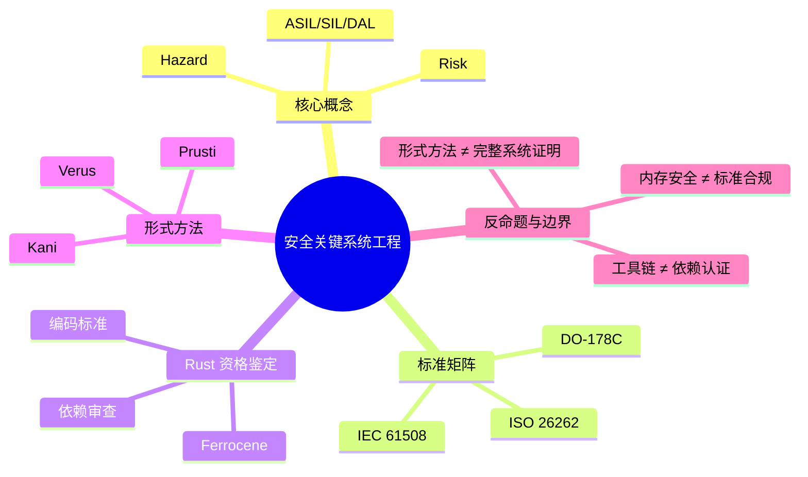

> **内容分级**: [专家级]
>
> **本节关键术语**: 功能安全 · 安全完整性等级 · DAL · ASIL · SIL · DO-178C · ISO 26262 · IEC 61508 · Ferrocene · 形式方法 — [完整对照表](../../00_meta/01_terminology/01_terminology_glossary.md)

# 安全关键系统工程

> **EN**: Safety-Critical Systems Engineering
> **Summary**: Safety-critical systems engineering standards (DO-178C, ISO 26262, IEC 61508), Rust qualification paths, Ferrocene, and formal methods integration.
> **Rust 版本**: 1.97.0+ (Edition 2024)
> **受众**: [专家]
> **Bloom 层级**: L5-L6
> **权威来源**: 本文件为 concept/ 权威页。
> **A/S/P 标记**: **P+S+A** — Procedure + Structure + Application
> **双维定位**: C×Eva — 评价 Rust 在安全关键标准下的资格鉴定与形式方法集成
> **定位**: 从安全关键概念与标准矩阵出发，梳理 Rust 在航空、汽车、工业功能安全中的资格鉴定路径与形式方法集成。
> **前置概念**: [形式化验证工具链](../../04_formal/04_model_checking/01_verification_toolchain.md) · [安全关键 Rust 专题索引](21_safety_critical_topic_index.md) · [AUTOSAR 与 Rust](22_autosar_and_rust.md) · [Rust 嵌入式系统开发](../05_systems_and_embedded/03_embedded_systems.md) · [Rust vs Ada/SPARK](../../05_comparative/01_systems_languages/07_rust_vs_ada_spark.md)
> **后置概念**: [航空航天认证与形式化方法](../../04_formal/04_model_checking/03_aerospace_certification_formal_methods.md) · [认证工具链与认证包清单](../../04_formal/04_model_checking/10_certified_toolchains_and_packages.md)

---

> **来源**:
> [ISO 26262 — Road vehicles — Functional safety](https://www.iso.org/standard/68383.html) ·
> [IEC 61508 — Functional safety of electrical/electronic/programmable electronic safety-related systems](https://webstore.iec.ch/publication/66912) ·
> [RTCA DO-178C — Software Considerations in Airborne Systems and Equipment Certification](https://my.rtca.org/nc__store) ·
> [Ferrocene Language Specification](https://spec.ferrocene.dev/) ·
> [Rust Safety-Critical Rust Consortium](https://rustfoundation.org/safety-critical-rust-consortium/)

---

## 📑 目录

- [安全关键系统工程](#安全关键系统工程)
  - [📑 目录](#-目录)
  - [一、权威定义](#一权威定义)
  - [二、安全关键概念](#二安全关键概念)
  - [三、标准矩阵](#三标准矩阵)
    - [3.1 DO-178C（航空）](#31-do-178c航空)
    - [3.2 ISO 26262（汽车）](#32-iso-26262汽车)
    - [3.3 IEC 61508（工业通用）](#33-iec-61508工业通用)
  - [四、Rust 资格鉴定与 Ferrocene](#四rust-资格鉴定与-ferrocene)
    - [4.1 工具链资格](#41-工具链资格)
    - [4.2 语言子集与编码标准](#42-语言子集与编码标准)
    - [4.3 供应链与依赖审查](#43-供应链与依赖审查)
  - [五、形式方法集成](#五形式方法集成)
    - [5.1 Kani](#51-kani)
    - [5.2 Prusti](#52-prusti)
    - [5.3 Verus](#53-verus)
  - [六、反命题与边界](#六反命题与边界)
    - [反命题：Rust 的内存安全自动满足 ASIL D / DAL A](#反命题rust-的内存安全自动满足-asil-d--dal-a)
    - [边界：Ferrocene 不覆盖所有 crates.io 依赖](#边界ferrocene-不覆盖所有-cratesio-依赖)
    - [边界：形式方法目前无法证明完整系统](#边界形式方法目前无法证明完整系统)
  - [七、嵌入式测验（Embedded Quiz）](#七嵌入式测验embedded-quiz)
    - [测验 1：DO-178C 中软件等级（DAL）最高的一级是什么？](#测验-1do-178c-中软件等级dal最高的一级是什么)
    - [测验 2：ISO 26262 中，ASIL D 与 ASIL A 相比，主要区别是什么？](#测验-2iso-26262-中asil-d-与-asil-a-相比主要区别是什么)
    - [测验 3：Ferrocene 工具链的主要价值在于？](#测验-3ferrocene-工具链的主要价值在于)
    - [测验 4：在 Rust 安全关键项目中，`#![deny(unsafe_code)]` 的主要目的是什么？](#测验-4在-rust-安全关键项目中denyunsafe_code-的主要目的是什么)
    - [测验 5：形式方法工具 Kani 最适合验证哪类属性？](#测验-5形式方法工具-kani-最适合验证哪类属性)
  - [八、权威来源索引](#八权威来源索引)
  - [🧭 思维导图（Mindmap）](#-思维导图mindmap)

---

## 一、权威定义

**安全关键系统（Safety-Critical System）**：其失效可能导致人员伤亡、重大财产损失或环境破坏的系统。

**安全关键系统工程** 是围绕以下核心问题展开的系统工程分支：

```text
核心问题:
  1. 系统在什么条件下会失效？
  2. 失效的概率和后果是什么？
  3. 如何把风险降低到可接受水平？
  4. 如何向监管机构证明风险已被控制？
```

Rust 进入该领域时，面临的不是“能否写出正确代码”，而是 **“能否通过标准化的证据链证明代码满足安全要求”**。

---

## 二、安全关键概念

| 概念 | 定义 | 工程意义 |
|:---|:---|:---|
| **危害（Hazard）** | 可能导致伤害的潜在系统状态 | 安全分析起点 |
| **风险（Risk）** | 危害发生概率 × 严重程度 | 决定需要何种安全完整性 |
| **安全功能（Safety Function）** | 用于实现或保持安全状态的函数 | 需要单独验证 |
| **故障（Fault）/ 失效（Failure）** | 故障是缺陷原因，失效是可见行为 | 区分设计错误与运行错误 |
| **共因失效（Common Cause Failure）** | 多个组件因同一原因同时失效 | 需要架构多样性缓解 |
| **诊断覆盖率（DC）** | 被检测到的危险故障比例 | 影响硬件指标计算 |

安全完整性等级把抽象风险映射为可量化的工程目标：

```text
SIL（IEC 61508）: SIL 1 → SIL 4，风险降低因子 10¹ → 10⁴
ASIL（ISO 26262）: QM → ASIL A → ASIL D，基于严重度/暴露度/可控性
DAL（DO-178C）    : DAL E → DAL A，软件对飞机/人员安全的影响递增
```

---

## 三、标准矩阵

### 3.1 DO-178C（航空）

DO-178C 是航空机载软件的国际事实标准，配套 DO-330（工具鉴定）、DO-331（模型驱动开发）、DO-332（OO 技术）、DO-333（形式化方法）。

```text
DO-178C 关键维度:
  软件等级（DAL）: E → D → C → B → A
  验证目标数量  :  随 DAL 增加，A 级约 66 个目标
  覆盖率要求    :  A 级要求语句覆盖、判定覆盖、MC/DC
  形式方法      :  DO-333 允许用形式化方法替代部分测试
```

Rust 映射：

- `cargo test` + 覆盖率工具 → 语句/判定/MC/DC 覆盖
- 形式工具（Kani/Verus）→ DO-333 形式方法补充证据
- Ferrocene → DO-330 工具链鉴定证据

### 3.2 ISO 26262（汽车）

ISO 26262 是道路车辆功能安全标准，核心流程：

```text
ISO 26262 V-model:
  概念阶段  →  系统级产品开发  →  硬件级产品开发  →  软件级产品开发
  每个阶段包含: 需求 → 设计 → 实现 → 验证 → 确认
```

| ASIL | 需求细化 | 设计方法 | 测试方法 | 工具鉴定 |
|:---|:---|:---|:---|
| QM | 推荐 | 推荐 | 推荐 | 无 |
| ASIL A/B | 要求 | 要求 | 要求 | 建议 |
| ASIL C/D | 强要求 | 强要求 | 强要求 | 要求 |

Rust 在汽车场景的优势：

- `Send`/`Sync` 支持 freedom from interference 论证
- 内存安全减少 ASIL 高等级中的常见缺陷类别
- `cargo vet`/`cargo audit` 支持软件组件鉴定与供应链安全

### 3.3 IEC 61508（工业通用）

IEC 61508 是跨行业的功能安全基础标准，定义了 SIL 1–4 和系统安全生命周期：

```text
IEC 61508 生命周期:
  整体安全生命周期  →  E/E/PE 系统安全生命周期  →  软件安全生命周期
  每个阶段产出安全计划、验证计划、确认计划等
```

对 Rust 的直接影响：

- 工具链需满足 SIL 目标对应的工具置信度（TCL）
- 编程语言选择需有使用证据与限制说明
- 编译器警告/错误输出需纳入配置管理

---

## 四、Rust 资格鉴定与 Ferrocene

### 4.1 工具链资格

在安全关键项目中，编译器是“工具”，需要按标准进行鉴定。Ferrocene 是目前最成熟的 Rust 鉴定路径：

```text
Ferrocene 资格范围:
  认证机构: TÜV SÜD
  适用标准: ISO 26262 ASIL D
            IEC 61508 SIL 3
            DO-178C / DO-330（作为经鉴定工具）
  交付物  : Ferrocene Language Specification
            编译器/工具链鉴定报告
            已知问题列表与使用限制
```

### 4.2 语言子集与编码标准

Ferrocene 定义了可验证的语言子集，禁止或限制某些 Rust 特性以降低认证风险：

```rust,ignore
#![deny(unsafe_code)]
// 安全关键 crate 入口：强制拒绝 unsafe，
// 把 unsafe 边界集中到少数经评审、有形式化论证的模块。

fn add(a: i32, b: i32) -> i32 {
    a.wrapping_add(b)
}
```

编码标准通常还包括：

- 避免使用 `std` 中未经鉴定的部分（`no_std` 或严格限制 `std` 使用）
- 禁用或审慎使用 `panic = "unwind"`
- 明确错误处理策略，禁止裸 `.unwrap()` 出现在安全路径

### 4.3 供应链与依赖审查

安全关键项目不能无差别使用 crates.io 依赖：

```text
依赖评审维度:
  功能必要性    : 该 crate 是否不可替代？
  代码质量      : 测试覆盖率、unsafe 密度、维护活跃度
  许可证        : 是否与交付物兼容？
  安全漏洞      : RUSTSEC 是否清零？
  工具鉴定      : 是否属于经鉴定的工具链/库？
```

Rust 工具链支持：

- `cargo vet`：依赖供应链审计
- `cargo audit`：RUSTSEC 漏洞扫描
- `cargo tree`：依赖可视化

---

## 五、形式方法集成

形式方法为安全关键系统提供高于测试的保障：测试只能展示存在错误，形式证明可以展示某类错误不存在。

### 5.1 Kani

Kani 是 Rust 的模型检查器，基于 CBMC：

```rust,ignore
#[cfg(kani)]
#[kani::proof]
fn saturating_add_never_overflows() {
    let a: u8 = kani::any();
    let b: u8 = kani::any();
    let _ = a.saturating_add(b); // 对所有 a,b 都不会 panic
}
```

Kani 适合验证 unsafe 边界、并发原语、算术溢出等属性。

### 5.2 Prusti

Prusti 是基于 Viper 的 Rust 契约式验证器：

```rust,ignore
// Prusti 风格前置/后置条件（概念语法，以实际工具版本为准）
#[requires(x >= 0)]
#[ensures(ret >= x)]
fn increment(x: i32) -> i32 {
    x + 1
}
```

Prusti 适合模块级函数正确性验证。

### 5.3 Verus

Verus 是面向 Rust 的定理证明器，支持并发协议验证：

```rust,ignore
// Verus 风格不变量与证明（概念示意）
verus! {
    struct Counter { value: u64 }

    impl Counter {
        fn increment(&mut self)
            requires old(self.value) < u64::MAX
            ensures self.value == old(self.value) + 1
        {
            self.value += 1;
        }
    }
}
```

Verus 适合系统级/协议级不变量证明，补充 ISO 26262 与 DO-178C 的高等级证据。

---

## 六、反命题与边界

### 反命题：Rust 的内存安全自动满足 ASIL D / DAL A

Rust 的 borrow checker 能消除大量内存错误，但功能安全标准关注的是 **过程、证据与风险降低**，而非语言特性本身。

满足 ASIL D / DAL A 还需要：

- 完整的需求追溯矩阵
- 充分的测试覆盖率（含 MC/DC）
- 经鉴定的工具链
- 安全分析（FMEA、FTA）
- 形式方法或等价强度的验证证据

### 边界：Ferrocene 不覆盖所有 crates.io 依赖

Ferrocene 认证的是编译器/工具链，而不是任意第三方 crate。安全关键路径上的 crate 仍需单独评审或替代。

### 边界：形式方法目前无法证明完整系统

Kani/Prusti/Verus 各有适用边界：

- Kani 受状态空间限制，不适合验证大型状态机
- Prusti 对复杂生命周期/unsafe 支持有限
- Verus 需要人工编写大量规约与证明提示

工程策略是 **分层验证**：形式方法覆盖关键不变量，测试覆盖集成行为，代码审查覆盖设计意图。

---

## 七、嵌入式测验（Embedded Quiz）

#### 测验 1：DO-178C 中软件等级（DAL）最高的一级是什么？

- A. DAL E
- B. DAL C
- C. DAL A
- D. DAL QM

<details><summary>答案与解析</summary>

**答案：C**

DO-178C 的软件等级从 DAL E（无安全影响）到 DAL A（灾难级失效影响）递增，A 级要求最严格的验证目标和覆盖率。

</details>

#### 测验 2：ISO 26262 中，ASIL D 与 ASIL A 相比，主要区别是什么？

- A. ASIL D 允许使用更多 unsafe 代码
- B. ASIL D 要求更严格的需求细化、设计方法、测试方法和工具鉴定
- C. ASIL D 只适用于硬件，不适用于软件
- D. ASIL D 不需要进行安全分析

<details><summary>答案与解析</summary>

**答案：B**

ASIL 从 QM 到 D 表示安全完整性要求递增，ASIL D 对需求、设计、测试和工具鉴定的要求最高。

</details>

#### 测验 3：Ferrocene 工具链的主要价值在于？

- A. 自动证明所有 Rust 程序无 bug
- B. 提供经第三方认证的编译器/工具链鉴定证据，支撑 ASIL D/SIL 3/DO-178C
- C. 替代 Kani、Prusti、Verus 等验证工具
- D. 让 crates.io 上的所有 crate 自动通过安全认证

<details><summary>答案与解析</summary>

**答案：B**

Ferrocene 提供的是工具链资格鉴定证据，帮助项目满足标准对编译器工具置信度的要求，但不替代验证工具或依赖评审。

</details>

#### 测验 4：在 Rust 安全关键项目中，`#![deny(unsafe_code)]` 的主要目的是什么？

- A. 提高运行时性能
- B. 强制 unsafe 边界集中到少数经评审的模块，降低认证风险
- C. 禁用所有外部依赖
- D. 自动生成形式化证明

<details><summary>答案与解析</summary>

**答案：B**

`#![deny(unsafe_code)]` 在 crate 层面禁止 unsafe，迫使需要 unsafe 的硬件访问/FFI 集中到少数经评审模块，便于安全案例论证。

</details>

#### 测验 5：形式方法工具 Kani 最适合验证哪类属性？

- A. UI 布局正确性
- B. 所有可能的并发死锁（任意规模）
- C. 算术溢出、unsafe 边界、小状态空间下的安全属性
- D. 数据库查询性能

<details><summary>答案与解析</summary>

**答案：C**

Kani 是基于 CBMC 的模型检查器，适合验证边界明确的属性，如溢出、数组越界、并发原语语义等，但受状态空间限制。

</details>

---

## 八、权威来源索引

- **ISO 26262** — *Road vehicles — Functional safety*. ISO, 2018.
- **IEC 61508** — *Functional safety of electrical/electronic/programmable electronic safety-related systems*. IEC, 2010.
- **RTCA DO-178C** — *Software Considerations in Airborne Systems and Equipment Certification*. RTCA, 2011.
- **RTCA DO-330** — *Software Tool Qualification Considerations*. RTCA, 2011.
- **RTCA DO-333** — *Formal Methods Supplement to DO-178C and DO-278A*. RTCA, 2011.
- **Ferrous Systems / Ferrocene** — [Ferrocene Language Specification](https://spec.ferrocene.dev/)
- **Rust Foundation** — [Safety-Critical Rust Consortium](https://rustfoundation.org/safety-critical-rust-consortium/)

> **相关文件**: [安全关键 Rust 专题索引](21_safety_critical_topic_index.md) · [AUTOSAR 与 Rust](22_autosar_and_rust.md) · [Rust 嵌入式系统开发](../05_systems_and_embedded/03_embedded_systems.md) · [航空航天认证与形式化方法](../../04_formal/04_model_checking/03_aerospace_certification_formal_methods.md) · [认证工具链与认证包清单](../../04_formal/04_model_checking/10_certified_toolchains_and_packages.md)
>
> **文档版本**: 1.0 ｜ **最后更新**: 2026-07-28 ｜ **状态**: ✅ 新建（Rust 1.97 对齐）

## 🧭 思维导图（Mindmap）



> **认知功能**: 本 mindmap 从概念、标准、资格鉴定、形式方法和边界五个维度组织内容，可作为复习与导航索引。
