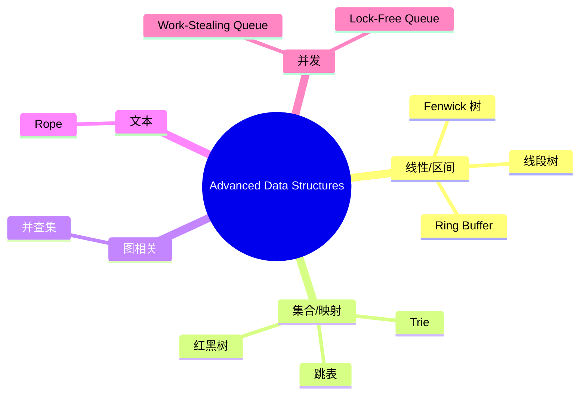

> **内容分级**: [专家级]
> **本节关键术语**: 并查集 · Trie · 线段树 · Fenwick 树 · 跳表 · 红黑树 · Rope · 环形缓冲区 · Work-Stealing Queue · 无锁队列 — [完整对照表](../../00_meta/01_terminology/01_terminology_glossary.md)

# 高级数据结构 Rust 实现

> **EN**: Advanced Data Structures Implementation in Rust
> **Summary**: Rust implementations and complexity analysis of union-find, trie, segment/Fenwick trees, skip list, red-black tree, rope, ring buffer, work-stealing queue, and lock-free queue, with application scenarios and boundary tests.
>
> **Rust 版本**: 1.97.0+ (Edition 2024)
> **受众**: [专家]
> **Bloom 层级**: L5-L6
> **权威来源**: 本文件为 `concept/` 权威页。
> **定位**: 本页讲解生产级/竞赛级常用高级数据结构的 Rust 实现要点、复杂度分析与适用场景，代码主要位于 `crates/c08_algorithms/src/data_structure/`。
>
> **前置概念**: [Ownership](../../01_foundation/01_ownership_borrow_lifetime/01_ownership.md) · [Generics](../../02_intermediate/01_generics/01_generics.md) · [Data Structures in Rust](09_data_structures_in_rust.md)
> **后置概念**: [Parallel Algorithms](25_parallel_algorithms.md) · [Algorithm Engineering Practice](08_algorithm_engineering_practice.md)

---

> **来源**:
> [Introduction to Algorithms (Cormen et al.)](https://mitpress.mit.edu/books/introduction-algorithms-fourth-edition) ·
> [Algorithm Engineering (Saunders / Demetrescu)](https://people.mpi-inf.mpg.de/~mehlhorn/LEDAbook.html) ·
> [Rust Atomics and Locks](https://marabos.nl/atomics/) ·
> [The Rust Programming Language](https://doc.rust-lang.org/book/title-page.html) ·
> [Rust for Rustaceans](https://rust-for-rustaceans.com/) ·
> [crossbeam crate](https://docs.rs/crossbeam/) ·
> [im crate](https://docs.rs/im/) ·
> [slab crate](https://docs.rs/slab/) ·
> [Rust Unofficial Algorithms](https://github.com/EbTech/rust-algorithms)

---

## 📑 目录

- [高级数据结构 Rust 实现](#高级数据结构-rust-实现)
  - [📑 目录](#-目录)
  - [一、数据结构选型总览](#一数据结构选型总览)
  - [二、并查集（Union-Find / DSU）](#二并查集union-find--dsu)
  - [三、Trie（前缀树）](#三trie前缀树)
  - [四、线段树与 Fenwick 树](#四线段树与-fenwick-树)
  - [五、跳表（Skip List）](#五跳表skip-list)
  - [六、红黑树（Red-Black Tree）](#六红黑树red-black-tree)
  - [七、Rope（绳索）](#七rope绳索)
  - [八、环形缓冲区（Ring Buffer）](#八环形缓冲区ring-buffer)
  - [九、Work-Stealing Queue](#九work-stealing-queue)
  - [十、无锁队列（Lock-Free Queue）](#十无锁队列lock-free-queue)
  - [十一、反例与陷阱](#十一反例与陷阱)
    - [反例 1：在并查集中递归路径压缩导致栈溢出](#反例-1在并查集中递归路径压缩导致栈溢出)
    - [反例 2：Ring Buffer 容量为 0](#反例-2ring-buffer-容量为-0)
    - [反例 3：Work-Stealing Queue 的 owner 与 thief 同时 pop/steal 同一元素](#反例-3work-stealing-queue-的-owner-与-thief-同时-popsteal-同一元素)
  - [十二、边界测试](#十二边界测试)
    - [12.1 边界测试：Fenwick 树索引越界](#121-边界测试fenwick-树索引越界)
    - [12.2 边界测试：Rope split 索引越界](#122-边界测试rope-split-索引越界)
    - [12.3 边界测试：红黑树重复插入](#123-边界测试红黑树重复插入)
  - [相关概念](#相关概念)
  - [十三、思维导图](#十三思维导图)
  - [十四、国际权威参考](#十四国际权威参考)

---

## 一、数据结构选型总览

| 数据结构 | 核心操作 | 时间复杂度 | Rust 典型场景 |
|:---|:---|:---|:---|
| 并查集 | union / find | 均摊 α(n) | 连通性、Kruskal MST |
| Trie | insert / search / prefix | O(m) | 自动补全、路由表 |
| Fenwick 树 | 点更新 / 前缀和 | O(log n) | 区间统计、逆序对 |
| 线段树 | 区间更新 / 区间查询 | O(log n) | RMQ、区间求和 |
| 跳表 | insert / delete / search | O(log n) 期望 | 有序集合 |
| 红黑树 | insert / delete / search | O(log n) 最坏 | 有序映射 |
| Rope | split / concat / insert | O(log n) | 大文本编辑器 |
| Ring Buffer | push / pop | O(1) | I/O 缓冲、队列 |
| Work-Stealing Queue | push / pop / steal | O(1) 均摊 | 任务调度器 |
| Lock-Free Queue | enqueue / dequeue | O(1) 均摊 | 高并发通道 |

---

## 二、并查集（Union-Find / DSU）

并查集维护一组不相交集合，支持合并与查询。路径压缩 + 按秩合并使单次操作接近 O(1)。

```rust
// 来源: crates/c08_algorithms/src/data_structure/dsu.rs
use c08_algorithms::data_structure::dsu::DisjointSet;

fn main() {
    let mut dsu = DisjointSet::new(5);
    dsu.union(0, 1);
    dsu.union(1, 2);
    assert!(dsu.connected(0, 2));
    assert!(!dsu.connected(0, 3));
}
```

> **Rust 实现要点**：用 `Vec<usize>` 存储父节点与秩，无需指针自引用，天然适合所有权模型。来源: [crates/c08_algorithms/src/data_structure/dsu.rs](../../../../crates/c08_algorithms/src/data_structure/dsu.rs)

---

## 三、Trie（前缀树）

Trie 用边表示字符，节点表示前缀，支持 O(m) 的字符串插入、查找与前缀匹配。

```rust
// 来源: crates/c08_algorithms/src/data_structure/trie.rs
use c08_algorithms::data_structure::trie::Trie;

fn main() {
    let mut trie = Trie::new();
    trie.insert("rust");
    trie.insert("rest");
    assert!(trie.search("rust"));
    assert!(trie.starts_with("ru"));
    assert!(!trie.search("ru"));
}
```

> **应用场景**：自动补全、敏感词过滤、IP 路由最长前缀匹配。来源: [crates/c08_algorithms/src/data_structure/trie.rs](../../../../crates/c08_algorithms/src/data_structure/trie.rs)

---

## 四、线段树与 Fenwick 树

Fenwick 树（Binary Indexed Tree）支持点更新与前缀和查询，代码极短；线段树支持更复杂的区间更新/查询。

```rust
// 来源: crates/c08_algorithms/src/data_structure/fenwick.rs
use c08_algorithms::data_structure::fenwick::Fenwick;

fn main() {
    let mut fw = Fenwick::new(5);
    fw.add(0, 1);
    fw.add(1, 2);
    fw.add(2, 3);
    assert_eq!(fw.range_sum(1, 3), 9);
}
```

> **选型**：点更新 + 前缀和 → Fenwick；区间更新/区间最值 → 线段树。来源: [fenwick.rs](../../../../crates/c08_algorithms/src/data_structure/fenwick.rs) · [segtree.rs](../../../../crates/c08_algorithms/src/data_structure/segtree.rs)

---

## 五、跳表（Skip List）

跳表用概率性多层链表实现有序集合，期望复杂度与红黑树相当，但实现更简单。

```rust
// 来源: crates/c08_algorithms/src/data_structure/skip_list.rs
use c08_algorithms::data_structure::skip_list::SkipList;

fn main() {
    let mut sl = SkipList::new();
    sl.insert(3);
    sl.insert(1);
    sl.insert(2);
    assert!(sl.contains(&2));
    sl.delete(&2);
    assert!(!sl.contains(&2));
}
```

> **来源**: [skip_list.rs](../../../../crates/c08_algorithms/src/data_structure/skip_list.rs)

---

## 六、红黑树（Red-Black Tree）

红黑树是自平衡 BST，保证最坏 O(log n) 的查找、插入、删除。Rust 中 `BTreeMap` 即基于 B 树，但教学实现有助于理解不变量。

```rust
// 来源: crates/c08_algorithms/src/data_structure/red_black_tree.rs
use c08_algorithms::data_structure::red_black_tree::RedBlackTree;

fn main() {
    let mut tree = RedBlackTree::new();
    tree.insert(5);
    tree.insert(3);
    tree.insert(7);
    assert!(tree.contains(5));
    assert!(!tree.contains(10));
}
```

> **来源**: [red_black_tree.rs](../../../../crates/c08_algorithms/src/data_structure/red_black_tree.rs)

---

## 七、Rope（绳索）

Rope 是用于大文本的平衡树/二叉树结构，支持 O(log n) 的拼接、分割、插入、删除，常用于文本编辑器。

```rust
// 来源: crates/c08_algorithms/src/data_structure/rope.rs
use c08_algorithms::data_structure::rope::Rope;

fn main() {
    let rope = Rope::from_string("Hello, ")
        .insert(7, "World")
        .insert(12, "!");
    assert_eq!(rope.to_string(), "Hello, World!");
}
```

> **来源**: [rope.rs](../../../../crates/c08_algorithms/src/data_structure/rope.rs)

---

## 八、环形缓冲区（Ring Buffer）

固定容量的 FIFO 数组结构，head/tail 指针循环移动，无锁版本可用于单生产者-单消费者场景。

```rust
// 来源: crates/c08_algorithms/src/data_structure/ring_buffer.rs
use c08_algorithms::data_structure::ring_buffer::RingBuffer;

fn main() {
    let mut rb = RingBuffer::new(3);
    rb.push(1).unwrap();
    rb.push(2).unwrap();
    assert_eq!(rb.pop(), Some(1));
    rb.push(3).unwrap();
    assert_eq!(rb.push(4), Err(4)); // 已满
}
```

> **来源**: [ring_buffer.rs](../../../../crates/c08_algorithms/src/data_structure/ring_buffer.rs)

---

## 九、Work-Stealing Queue

Chase-Lev 双端队列允许 owner 在尾部 push/pop，多个 thief 从头部 steal，是 Rayon、Tokio 调度器的核心。

```rust
// 来源: crates/c08_algorithms/src/data_structure/work_stealing_queue.rs
use c08_algorithms::data_structure::work_stealing_queue::WorkStealingQueue;

fn main() {
    let q = WorkStealingQueue::new();
    q.push(1);
    q.push(2);
    assert_eq!(q.pop(), Some(2));   // owner 从尾部弹出
    assert_eq!(q.steal(), Some(1)); // thief 从头部窃取
}
```

> **来源**: [work_stealing_queue.rs](../../../../crates/c08_algorithms/src/data_structure/work_stealing_queue.rs)

---

## 十、无锁队列（Lock-Free Queue）

Michael-Scott 队列基于 CAS 与 epoch-based 内存回收，支持多生产者-多消费者。

```rust
// 来源: crates/c08_algorithms/src/data_structure/lock_free_queue.rs
use c08_algorithms::data_structure::lock_free_queue::LockFreeQueue;

fn main() {
    let queue = LockFreeQueue::new();
    queue.enqueue(1);
    queue.enqueue(2);
    assert_eq!(queue.dequeue(), Some(1));
    assert_eq!(queue.dequeue(), Some(2));
}
```

> **来源**: [lock_free_queue.rs](../../../../crates/c08_algorithms/src/data_structure/lock_free_queue.rs)

---

## 十一、反例与陷阱

### 反例 1：在并查集中递归路径压缩导致栈溢出

```rust,ignore
// ❌ 深度递归的 find
fn find(&mut self, x: usize) -> usize {
    if self.parent[x] != x {
        self.parent[x] = self.find(self.parent[x]);
    }
    self.parent[x]
}

// 若 n = 10^6 且链退化，可能栈溢出
```

> **修正**：对极深数据使用迭代路径压缩，或用 `#[repr(transparent)]` 的栈外处理。来源: [dsu.rs](../../../../crates/c08_algorithms/src/data_structure/dsu.rs)

### 反例 2：Ring Buffer 容量为 0

```rust,ignore
let mut rb = RingBuffer::new(0);
rb.push(1).unwrap(); // panic 或无限错误
```

> **修正**：构造时断言 `capacity > 0`，或返回 `Result`。来源: [ring_buffer.rs](../../../../crates/c08_algorithms/src/data_structure/ring_buffer.rs)

### 反例 3：Work-Stealing Queue 的 owner 与 thief 同时 pop/steal 同一元素

```rust,ignore
// ❌ 未用 CAS 保护 top 指针的 pop 实现
let value = buf[top]; // 数据竞争
self.top += 1;
```

> **修正**：`pop` 在最后一个元素处需与 `steal` 进行 CAS 竞争。来源: [work_stealing_queue.rs](../../../../crates/c08_algorithms/src/data_structure/work_stealing_queue.rs)

---

## 十二、边界测试

### 12.1 边界测试：Fenwick 树索引越界

```rust,ignore
let mut fw = Fenwick::new(5);
fw.add(10, 1); // 越界，应 panic
```

> **修正**: 在发布版本中加 `debug_assert!` 或返回 `Result`。来源: [fenwick.rs](../../../../crates/c08_algorithms/src/data_structure/fenwick.rs)

### 12.2 边界测试：Rope split 索引越界

```rust,ignore
let rope = Rope::from_str("abc");
let (l, r) = rope.split(10); // panic
```

> **修正**: `split` 应断言 `idx <= self.len()`。来源: [rope.rs](../../../../crates/c08_algorithms/src/data_structure/rope.rs)

### 12.3 边界测试：红黑树重复插入

```rust
use c08_algorithms::data_structure::red_black_tree::RedBlackTree;

fn main() {
    let mut tree = RedBlackTree::new();
    assert!(tree.insert(5));
    assert!(!tree.insert(5)); // 重复，不新增
}
```

> **诊断**: 教学版红黑树通常忽略重复键，文档需明确行为。来源: [red_black_tree.rs](../../../../crates/c08_algorithms/src/data_structure/red_black_tree.rs)

---

---

## 相关概念

- [Rust vs Haskell：函数式类型系统与命令式性能的对照](../../05_comparative/02_managed_languages/09_rust_vs_haskell.md)
- [形式化算法理论](../../04_formal/00_type_theory/13_formal_algorithm_theory.md)

## 十三、思维导图



> **认知功能**: 本 mindmap 按"线性区间、集合映射、图、文本、并发"五类组织高级数据结构，便于按问题域选型。来源: [Introduction to Algorithms](https://mitpress.mit.edu/books/introduction-algorithms-fourth-edition)

---

## 十四、国际权威参考

- **P1 学术**: [Introduction to Algorithms (Cormen et al.)](https://mitpress.mit.edu/books/introduction-algorithms-fourth-edition)
- **P1 学术**: [Algorithm Engineering (Saunders / Demetrescu)](https://people.mpi-inf.mpg.de/~mehlhorn/LEDAbook.html)
- **P1 学术**: [Pugh — Skip Lists: A Probabilistic Alternative to Balanced Trees (ACM)](https://dl.acm.org/doi/10.1145/78973.78977)
- **P1 学术**: [Guibas & Sedgewick — A Dichromatic Framework for Balanced Trees (IEEE)](https://ieeexplore.ieee.org/document/4567957)
- **P0 官方**: [The Rust Programming Language](https://doc.rust-lang.org/book/title-page.html)
- **P1 并发**: [Rust Atomics and Locks](https://marabos.nl/atomics/)
- **P1 书籍**: [Rust for Rustaceans](https://rust-for-rustaceans.com/)

---

> **权威来源**: [Introduction to Algorithms](https://mitpress.mit.edu/books/introduction-algorithms-fourth-edition), [Rust Atomics and Locks](https://marabos.nl/atomics/)
> **状态**: ✅ 概念文件创建完成
> **最后更新**: 2026-07-30
