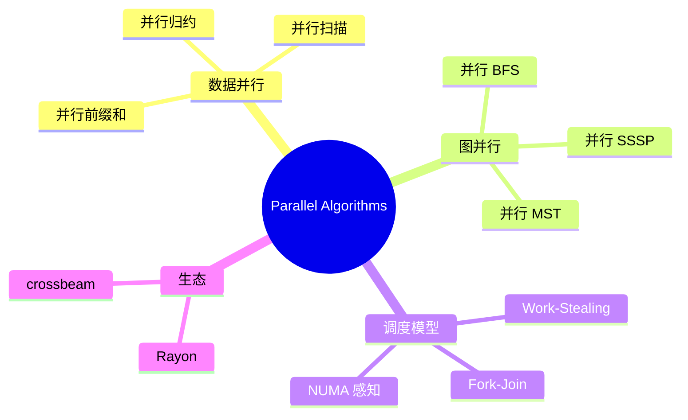

> **内容分级**: [专家级]
> **本节关键术语**: 并行前缀和 · 并行图算法 · fork-join · work-stealing · NUMA · 并行扫描 · 并行归约 · Rayon — [完整对照表](../../00_meta/01_terminology/01_terminology_glossary.md)

# 并行算法

> **EN**: Parallel Algorithms in Rust
> **Summary**: Parallel algorithms in Rust: prefix sum, parallel graph algorithms (BFS, SSSP, MST), fork-join, work-stealing, NUMA awareness, parallel scan/reduce, and the Rayon implementation principles.
>
> **Rust 版本**: 1.97.0+ (Edition 2024)
> **受众**: [专家]
> **Bloom 层级**: L5-L6
> **权威来源**: 本文件为 `concept/` 权威页。
> **定位**: 本页讲解 Rust 中利用多核的并行算法设计，覆盖数据并行、任务并行、图并行与调度器原理，代码位于 `crates/c08_algorithms/src/algorithms/parallel_algorithms.rs`。
>
> **前置概念**: [Concurrency](../../03_advanced/00_concurrency/01_concurrency.md) · [Data Structures in Rust](09_data_structures_in_rust.md) · [Advanced Data Structures](24_advanced_data_structures_implementation.md)
> **后置概念**: [Algorithm Engineering Practice](08_algorithm_engineering_practice.md) · [Async](../../03_advanced/01_async/01_async.md)

---

> **来源**:
> [Introduction to Algorithms (Cormen et al.)](https://mitpress.mit.edu/books/introduction-algorithms-fourth-edition) ·
> [Algorithm Engineering (Saunders / Demetrescu)](https://people.mpi-inf.mpg.de/~mehlhorn/LEDAbook.html) ·
> [Rayon docs](https://docs.rs/rayon/latest/rayon/) ·
> [Rust Atomics and Locks](https://marabos.nl/atomics/) ·
> [The Rust Programming Language](https://doc.rust-lang.org/book/title-page.html)

---

## 📑 目录

- [并行算法](#并行算法)
  - [📑 目录](#-目录)
  - [一、并行计算模型](#一并行计算模型)
  - [二、并行前缀和（Parallel Prefix Sum / Scan）](#二并行前缀和parallel-prefix-sum--scan)
  - [三、并行图算法](#三并行图算法)
    - [3.1 并行 BFS](#31-并行-bfs)
    - [3.2 并行 SSSP](#32-并行-sssp)
    - [3.3 并行 MST](#33-并行-mst)
  - [四、Fork-Join 与 Work-Stealing](#四fork-join-与-work-stealing)
  - [五、并行扫描与归约](#五并行扫描与归约)
  - [六、NUMA 感知](#六numa-感知)
  - [七、Rayon 实现原理](#七rayon-实现原理)
  - [八、反例与陷阱](#八反例与陷阱)
    - [反例 1：在并行循环中修改共享可变状态](#反例-1在并行循环中修改共享可变状态)
    - [反例 2：任务粒度过细](#反例-2任务粒度过细)
    - [反例 3：忽略 Amdahl 定律](#反例-3忽略-amdahl-定律)
  - [九、边界测试](#九边界测试)
    - [9.1 边界测试：空输入的前缀和](#91-边界测试空输入的前缀和)
    - [9.2 边界测试：BFS 起点孤立](#92-边界测试bfs-起点孤立)
    - [9.3 边界测试：单线程环境](#93-边界测试单线程环境)
  - [相关概念](#相关概念)
  - [十、思维导图](#十思维导图)
  - [十一、国际权威参考](#十一国际权威参考)

---

## 一、并行计算模型

并行算法设计的核心矛盾：**可扩展性（scalability）** 与 **开销（overhead）**。划分任务、通信、同步、负载均衡是四大成本来源。

Rust 中常用的并行抽象：

| 抽象 | 代表 | 适用场景 |
|:---|:---|:---|
| 数据并行 | `rayon::par_iter` | 数组/集合的同构操作 |
| 任务并行 | `rayon::join` / `spawn` | 分治、树遍历 |
| 线程池 | `rayon::ThreadPool` | 固定资源池的批量任务 |
| 异步并发 | `tokio::spawn` | I/O 密集型，非 CPU 并行 |
| 无锁结构 | `crossbeam` / 自定义 | 高频共享状态 |

> **Amdahl 定律**：加速比受限于串行部分比例。若串行部分占 10%，最大加速比为 10×。来源: [Introduction to Algorithms](https://mitpress.mit.edu/books/introduction-algorithms-fourth-edition)

---

## 二、并行前缀和（Parallel Prefix Sum / Scan）

并行前缀和是数据并行的经典问题：计算数组的累积和。两阶段算法时间复杂度 O(n/p + log p)。

```rust
// 来源: crates/c08_algorithms/src/algorithms/parallel_algorithms.rs
use c08_algorithms::algorithms::parallel_algorithms::parallel_prefix_sum;

fn main() {
    let input = vec![1, 2, 3, 4, 5];
    let result = parallel_prefix_sum(&input);
    assert_eq!(result, vec![1, 3, 6, 10, 15]);
}
```

> **原理**：
>
> 1. 将数组分块，每块独立计算局部前缀和；
> 2. 计算块间偏移量；
> 3. 将偏移量并行加到各块。
> 来源: [parallel_algorithms.rs](../../../../crates/c08_algorithms/src/algorithms/parallel_algorithms.rs)

---

## 三、并行图算法

### 3.1 并行 BFS

并行 BFS 把当前 frontier 的所有邻居并行展开，再合并去重。

```rust
use c08_algorithms::algorithms::parallel_algorithms::parallel_bfs;

fn main() {
    let graph = vec![
        vec![1, 2],
        vec![0, 3],
        vec![0, 3],
        vec![1, 2],
    ];
    let dist = parallel_bfs(&graph, 0);
    assert_eq!(dist, vec![Some(0), Some(1), Some(1), Some(2)]);
}
```

> **注意**：frontier 扩展的并行化收益取决于图的平均度数；稀疏图可能因同步开销而收益有限。来源: [parallel_algorithms.rs](../../../../crates/c08_algorithms/src/algorithms/parallel_algorithms.rs)

### 3.2 并行 SSSP

并行 Dijkstra 使用优先队列串行选择当前最近节点，但对其所有出边并行松弛。

```rust
use c08_algorithms::algorithms::parallel_algorithms::parallel_dijkstra;

fn main() {
    let graph = vec![
        vec![(1, 1), (2, 4)],
        vec![(2, 2), (3, 5)],
        vec![(3, 1)],
        vec![],
    ];
    let dist = parallel_dijkstra(&graph, 0);
    assert_eq!(dist, vec![Some(0), Some(1), Some(3), Some(4)]);
}
```

> **局限**：优先队列仍是串行瓶颈；Delta-stepping 或 Bellman-Ford 更适合大规模并行。来源: [parallel_algorithms.rs](../../../../crates/c08_algorithms/src/algorithms/parallel_algorithms.rs)

### 3.3 并行 MST

Kruskal 算法的排序步骤可并行化（`par_sort_unstable`），并查集合并通常串行执行。

```rust
use c08_algorithms::algorithms::parallel_algorithms::parallel_kruskal;

fn main() {
    let edges = vec![(0, 1, 1), (1, 2, 2), (0, 2, 3)];
    let mst = parallel_kruskal(3, edges);
    assert_eq!(mst.iter().map(|e| e.2).sum::<u64>(), 3);
}
```

> **来源**: [parallel_algorithms.rs](../../../../crates/c08_algorithms/src/algorithms/parallel_algorithms.rs)

---

## 四、Fork-Join 与 Work-Stealing

Fork-Join 是最自然的并行分治模型：任务分成两个子任务，分别执行，再合并结果。

```rust
use c08_algorithms::algorithms::parallel_algorithms::fork_join_sum;

fn main() {
    let input: Vec<i64> = (1..=1000).collect();
    assert_eq!(fork_join_sum(&input), input.iter().sum());
}
```

Work-stealing 调度器（如 Rayon）让每个线程维护一个双端队列：

- **owner** 在尾部 push/pop 自己产生的任务；
- **空闲线程** 从其他线程的头部 steal 任务。

这种设计减少了竞争：owner 操作无需同步，只有 steal 需要 CAS。来源: [Rust Atomics and Locks](https://marabos.nl/atomics/)

---

## 五、并行扫描与归约

| 操作 | 语义 | Rayon API |
|:---|:---|:---|
| 归约 | `a1 ⊗ a2 ⊗ ... ⊗ an` | `par_iter().reduce` / `sum` |
| 扫描 | 前缀累积 | `par_iter().fold` + 合并 |
| 过滤 | 保留满足条件的元素 | `par_iter().filter` |
| 映射 | 对每个元素独立变换 | `par_iter().map` |

```rust
use rayon::prelude::*;

fn main() {
    let v: Vec<i64> = (1..=100).collect();
    let sum: i64 = v.par_iter().sum();
    let evens: Vec<&i64> = v.par_iter().filter(|&&x| x % 2 == 0).collect();
    let squares: Vec<i64> = v.par_iter().map(|&x| x * x).collect();
}
```

---

## 六、NUMA 感知

NUMA（Non-Uniform Memory Access）下，访问本地节点内存比远程节点快数倍。NUMA 感知策略：

1. **数据局部性**：尽量让计算线程访问其所在节点的数据。
2. **首次写入定位**：由最终使用该数据的线程初始化内存，避免首次访问触发远程页错误。
3. **分区并行**：将大数组按 NUMA 节点分区，每节点独立计算后合并。

Rust 生态中可使用 `hwloc` / `numa` crate 获取拓扑信息。生产级 NUMA 优化通常需要自定义分配器与线程绑定。

```rust
// 概念性 NUMA 分区求和
fn numa_aware_sum(data: &[i64], numa_nodes: usize) -> i64 {
    let chunk_size = (data.len() + numa_nodes - 1) / numa_nodes;
    data.par_chunks(chunk_size)
        .map(|chunk| chunk.iter().sum::<i64>())
        .sum()
}
```

---

## 七、Rayon 实现原理

Rayon 是 Rust 生态最广泛使用的数据并行库，核心设计：

1. **无全局锁**：每个工作线程有自己的 work-stealing deque。
2. **惰性任务拆分**：`par_iter` 先按范围描述任务，只有线程需要工作时才拆分到更细粒度。
3. **自适应阈值**：当任务足够小时停止拆分，避免调度开销超过收益。
4. **借用安全**：Rayon 的 `ParallelIterator` 在编译期保证闭包满足 `Send`/`Sync`。

```rust
use rayon::prelude::*;

fn parallel_sum(data: &[i64]) -> i64 {
    data.par_iter().sum()
}
```

> **关键洞察**：Rayon 把"递归串行算法"通过 `join` 或 `par_iter` 自动并行化，调用方无需管理线程。来源: [Rayon docs](https://docs.rs/rayon/latest/rayon/)

---

## 八、反例与陷阱

### 反例 1：在并行循环中修改共享可变状态

```rust,compile_fail
use rayon::prelude::*;

fn main() {
    let mut sum = 0;
    (0..100).into_par_iter().for_each(|i| {
        sum += i; // ❌ 编译错误：sum 不能跨线程共享可变引用
    });
}
```

> **修正**：使用 `sum()`、`reduce()` 或 `AtomicUsize`。来源: [Rayon docs](https://docs.rs/rayon/latest/rayon/)

### 反例 2：任务粒度过细

```rust,ignore
// ❌ 每个元素都 spawn，调度开销爆炸
(0..1_000_000).into_par_iter().for_each(|_| tiny_work());

// ✅ 使用 par_iter，让 Rayon 自适应拆分
```

### 反例 3：忽略 Amdahl 定律

```rust,ignore
// ❌ 并行化一个串行部分占 90% 的算法
let result = serial_part(); // 90%
result.par_iter().map(|x| parallel_part(x)).collect(); // 10%
```

> **修正**：先优化串行瓶颈，再考虑并行化。来源: [The Rust Performance Book](https://nnethercote.github.io/perf-book/)

---

## 九、边界测试

### 9.1 边界测试：空输入的前缀和

```rust
use c08_algorithms::algorithms::parallel_algorithms::parallel_prefix_sum;

fn main() {
    let result = parallel_prefix_sum(&[]);
    assert!(result.is_empty());
}
```

> **诊断**: 空输入应返回空 Vec，避免越界。来源: [parallel_algorithms.rs](../../../../crates/c08_algorithms/src/algorithms/parallel_algorithms.rs)

### 9.2 边界测试：BFS 起点孤立

```rust
use c08_algorithms::algorithms::parallel_algorithms::parallel_bfs;

fn main() {
    let graph = vec![vec![], vec![0]];
    let dist = parallel_bfs(&graph, 0);
    assert_eq!(dist, vec![Some(0), None]);
}
```

> **诊断**: 不可达节点应保持 `None`。来源: [parallel_algorithms.rs](../../../../crates/c08_algorithms/src/algorithms/parallel_algorithms.rs)

### 9.3 边界测试：单线程环境

```rust
use rayon::prelude::*;

fn main() {
    let pool = rayon::ThreadPoolBuilder::new().num_threads(1).build().unwrap();
    let sum: i64 = pool.install(|| (0..100).into_par_iter().sum());
    assert_eq!(sum, 4950);
}
```

> **诊断**: 单线程下并行算法应正确退化，结果与多线程一致。来源: [Rayon ThreadPoolBuilder](https://docs.rs/rayon/latest/rayon/struct.ThreadPoolBuilder.html)

---

---

## 相关概念

- [Rust vs C++：形式系统模型 vs 机制工程模型](../../05_comparative/01_systems_languages/01_rust_vs_cpp.md)
- [形式化算法理论](../../04_formal/00_type_theory/13_formal_algorithm_theory.md)

## 十、思维导图



> **认知功能**: 本 mindmap 按"数据并行、图并行、调度模型、生态"组织并行算法知识，帮助读者从算法选择到调度原理建立完整视图。来源: [Introduction to Algorithms](https://mitpress.mit.edu/books/introduction-algorithms-fourth-edition)

---

## 十一、国际权威参考

- **P1 学术**: [Introduction to Algorithms (Cormen et al.)](https://mitpress.mit.edu/books/introduction-algorithms-fourth-edition)
- **P1 学术**: [Algorithm Engineering (Saunders / Demetrescu)](https://people.mpi-inf.mpg.de/~mehlhorn/LEDAbook.html)
- **P1 学术**: [Blumofe & Leiserson — Scheduling Multithreaded Computations by Work Stealing (ACM)](https://dl.acm.org/doi/10.1145/209936.209958)
- **P1 学术**: [Blelloch — Prefix Sums and Their Applications (IEEE)](https://ieeexplore.ieee.org/document/42122)
- **P1 并发**: [Rust Atomics and Locks](https://marabos.nl/atomics/)
- **P2 生态**: [Rayon docs](https://docs.rs/rayon/latest/rayon/)
- **P0 官方**: [The Rust Programming Language](https://doc.rust-lang.org/book/title-page.html)
- **P1 性能**: [The Rust Performance Book](https://nnethercote.github.io/perf-book/)

---

> **权威来源**: [Introduction to Algorithms](https://mitpress.mit.edu/books/introduction-algorithms-fourth-edition), [Rayon docs](https://docs.rs/rayon/latest/rayon/), [Rust Atomics and Locks](https://marabos.nl/atomics/)
> **状态**: ✅ 概念文件创建完成
> **最后更新**: 2026-07-30
