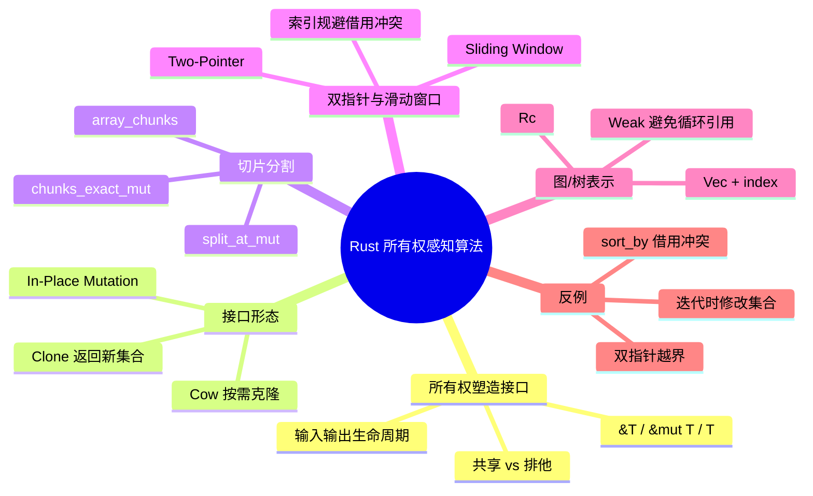

> **内容分级**: [专家级]
> **本节关键术语**: 所有权感知算法 (Ownership-Aware Algorithms) · In-Place Mutation · Copy on Write (Cow) · split_at_mut · chunks_exact_mut · Two-Pointer · Sliding Window · Index-Based Graph — [完整对照表](../../00_meta/01_terminology/01_terminology_glossary.md)

# Rust 所有权感知算法

> **EN**: Ownership-Aware Algorithms in Rust
> **Summary**: How Rust's ownership model shapes algorithmic interfaces: in-place mutation, Cow, borrow-checker-friendly two-pointer/sliding-window patterns, and index-based graph algorithms.
>
> **Rust 版本**: 1.97.0+ (Edition 2024)
> **受众**: [进阶]
> **Bloom 层级**: L3-L5
> **权威来源**: 本文件为 `concept/` 权威页。
> **A/S/P 标记**: **P+S** — Procedure + Structure
> **定位**: 系统讲解 Rust 所有权模型如何决定算法接口设计，覆盖原地修改、写时复制、借用检查友好的双指针/滑动窗口、基于索引的图/树算法等实战模式。
> **前置概念**: [Ownership](../../01_foundation/01_ownership_borrow_lifetime/01_ownership.md) · [Borrowing](../../01_foundation/01_ownership_borrow_lifetime/02_borrowing.md) · [Collections & Slices](../../01_foundation/05_collections/01_collections.md) · [Smart Pointers](../../02_intermediate/02_memory_management/04_smart_pointers.md)
> **后置概念**: [算法工程实践](08_algorithm_engineering_practice.md) · [高级数据结构 Rust 实现](24_advanced_data_structures_implementation.md) · [并行与并发算法](25_parallel_algorithms.md)
> **L5 对比**: [Rust vs C++](../../05_comparative/01_systems_languages/01_rust_vs_cpp.md)

---

> **来源**: [The Rust Programming Language](https://doc.rust-lang.org/book/title-page.html) · [Rust Reference](https://doc.rust-lang.org/reference/introduction.html) · [The Rust Performance Book](https://nnethercote.github.io/perf-book/) · [Rust for Rustaceans](https://rust-for-rustaceans.com/)

---

## 📑 目录

- [Rust 所有权感知算法](#rust-所有权感知算法)
  - [📑 目录](#-目录)
  - [一、所有权模型如何塑造算法接口](#一所有权模型如何塑造算法接口)
  - [二、In-Place Mutation vs Clone vs Cow 决策树](#二in-place-mutation-vs-clone-vs-cow-决策树)
  - [三、切片分割模式](#三切片分割模式)
    - [3.1 split\_at\_mut](#31-split_at_mut)
    - [3.2 chunks\_exact\_mut](#32-chunks_exact_mut)
    - [3.3 array\_chunks](#33-array_chunks)
  - [四、双指针与滑动窗口](#四双指针与滑动窗口)
    - [4.1 Two-Pointer 模式](#41-two-pointer-模式)
    - [4.2 Sliding Window](#42-sliding-window)
  - [五、基于索引的图与树算法](#五基于索引的图与树算法)
  - [六、反例与陷阱](#六反例与陷阱)
    - [反例 1：排序比较器中借用被排序集合](#反例-1排序比较器中借用被排序集合)
    - [反例 2：在迭代时修改集合](#反例-2在迭代时修改集合)
    - [反例 3：双指针越界](#反例-3双指针越界)
  - [七、决策树](#七决策树)
  - [八、相关概念](#八相关概念)
  - [九、国际权威参考](#九国际权威参考)
  - [十、思维导图](#十思维导图)

---

## 一、所有权模型如何塑造算法接口

Rust 的所有权（Ownership）模型把「谁能读、谁能写、数据有效期多久」从运行时隐藏状态提升为类型签名的一部分。算法接口设计因此比 C/C++ 更受约束，但也因此消除了 use-after-free、double-free 和数据竞争。

核心设计维度：

| 维度 | 选项 | 复杂度 | 所有权影响 |
|---|---|---|---|
| 输入获取 | `&[T]` / `&mut [T]` / `T` | 低到高 | 只读借用最灵活；可变借用排他；拥有值可任意处置但转移所有权 |
| 输出返回 | 新集合 / 原地修改 / 借用切片 | 低到高 | 新集合分配多；原地修改需 `&mut`；借用受生命周期约束 |
| 中间共享 | `Cow` / `Rc` / `Arc` | 中 | Cow 按需克隆；Rc/Arc 共享所有权但有引用计数开销 |
| 图/树表示 | `Box` / index+Vec / `Rc<RefCell>` | 中到高 | Box 表达唯一所有权；index 最符合借用检查器；Rc<RefCell> 灵活但运行时检查 |

> **设计原则**：优先让算法接受 `&[T]` 或 `&mut [T]`，返回 `()` 或 `&T` 切片；只有在必须跨作用域共享或延迟初始化时才引入 `Cow` / `Rc` / `Arc`。

---

## 二、In-Place Mutation vs Clone vs Cow 决策树

同一算法常有三种接口形态，选择取决于调用方是否允许输入被修改、是否接受分配、以及是否预期需要修改副本。

```rust
// 形态 1：原地修改，零分配
fn reverse_in_place(arr: &mut [i32]) {
    arr.reverse();
}

// 形态 2：返回新集合，不破坏输入
fn reverse_cloned(arr: &[i32]) -> Vec<i32> {
    let mut v = arr.to_vec();
    v.reverse();
    v
}

// 形态 3：Cow，输入已符合要求则借用，否则克隆修改
use std::borrow::Cow;
fn normalize_cow<'a>(input: &'a str) -> Cow<'a, str> {
    if input.chars().all(|c| c.is_ascii_lowercase()) {
        Cow::Borrowed(input)
    } else {
        Cow::Owned(input.to_lowercase())
    }
}
```

**选型决策树**：

| 调用方能否交出 &mut？ | 是否需要保留原输入？ | 是否常需修改？ | 推荐接口 |
|---|---|---|---|
| 是 | 否 | 是 | `fn(&mut [T])` |
| 否 | 否 | 是 | `fn(&[T]) -> Vec<T>` |
| 否 | 是 | 有时 | `fn(&[T]) -> Cow<[T]>` |
| 否 | 是 | 很少 | `fn(&[T]) -> &[T]`（纯筛选/切片） |

> **性能提示**：`Cow` 的判别开销极小（一个 enum tag），但会在热路径引入分支。若确定需要修改，直接克隆再修改通常比反复 Cow 判断更快。

---

## 三、切片分割模式

Rust 标准库提供了一组「在不复制的前提下把切片拆成多份可变引用」的工具，是许多分治算法、并行算法、原地重排算法的基础。

### 3.1 split_at_mut

把 `&mut [T]` 分成两段不重叠的可变切片，满足借用检查器对「唯一可变引用」的要求。

```rust
fn quicksort<T: Ord>(arr: &mut [T]) {
    if arr.len() <= 1 {
        return;
    }
    let pivot_index = partition(arr);
    let (left, right) = arr.split_at_mut(pivot_index);
    // left 与 right 不重叠，可同时递归排序
    quicksort(left);
    quicksort(&mut right[1..]); // 跳过 pivot
}

fn partition<T: Ord>(arr: &mut [T]) -> usize {
    let len = arr.len();
    let pivot_index = len / 2;
    arr.swap(pivot_index, len - 1);
    let mut store = 0;
    for i in 0..len - 1 {
        if arr[i] < arr[len - 1] {
            arr.swap(i, store);
            store += 1;
        }
    }
    arr.swap(store, len - 1);
    store
}
```

### 3.2 chunks_exact_mut

把切片等分为固定大小的可变块，剩余元素单独返回。

```rust
fn batch_normalize_vectors(vectors: &mut [[f32; 3]]) {
    for v in vectors.iter_mut() {
        let len = (v[0] * v[0] + v[1] * v[1] + v[2] * v[2]).sqrt();
        if len > 0.0 {
            v[0] /= len;
            v[1] /= len;
            v[2] /= len;
        }
    }
}

fn main() {
    let mut data: Vec<f32> = vec![1.0, 2.0, 3.0, 4.0, 5.0, 6.0];
    let chunks = data.chunks_exact_mut(3);
    for chunk in chunks {
        // chunk: &mut [f32]
        let len = (chunk[0] * chunk[0] + chunk[1] * chunk[1] + chunk[2] * chunk[2]).sqrt();
        for x in chunk.iter_mut() {
            *x /= len;
        }
    }
}
```

### 3.3 array_chunks

把一维切片按固定长度 N 重解释为固定大小数组的迭代。Rust 1.97.0 stable 中 `chunks_exact_mut(N)` 返回 `&mut [T]`；`array_chunks_mut::<N>()` 返回 `&mut [T; N]` 更类型安全，但截至 1.97.0 仍未进入稳定通道。

```rust
fn main() {
    let mut data: Vec<u8> = vec![1, 2, 3, 4, 5, 6, 7, 8];
    for chunk in data.chunks_exact_mut(4) {
        // chunk: &mut [u8]
        chunk.reverse();
    }
    assert_eq!(data, vec![4, 3, 2, 1, 8, 7, 6, 5]);
}
```

> **未来变体**：`array_chunks_mut::<4>()` 进入稳定通道后，可写 `for chunk in data.array_chunks_mut::<4>() { chunk.reverse(); }`，其中 `chunk` 类型为 `&mut [u8; 4]`。

---

## 四、双指针与滑动窗口

双指针和滑动窗口是算法面试与工程中的高频模式。Rust 的借用检查器要求我们对「哪些数据被读、哪些被写」有精确描述，这反而促使我们写出更清晰的索引边界。

### 4.1 Two-Pointer 模式

原地移除重复元素（LeetCode 26）：慢指针 `write` 指向已处理区域的下一个位置，快指针 `read` 扫描整个数组。

```rust
fn remove_duplicates(nums: &mut [i32]) -> usize {
    if nums.is_empty() {
        return 0;
    }
    let mut write = 1;
    for read in 1..nums.len() {
        if nums[read] != nums[read - 1] {
            nums[write] = nums[read];
            write += 1;
        }
    }
    write
}
```

要点：

- `read` 只读，`write` 只写，两者都基于同一数组但从不同时持有重叠可变引用；
- 通过索引而非引用访问，绕过借用检查器的严格限制。

### 4.2 Sliding Window

寻找和大于等于 target 的最短连续子数组。

```rust
fn min_sub_array_len(target: i32, nums: &[i32]) -> usize {
    let mut left = 0;
    let mut sum = 0;
    let mut min_len = usize::MAX;

    for right in 0..nums.len() {
        sum += nums[right];
        while sum >= target {
            min_len = min_len.min(right - left + 1);
            sum -= nums[left];
            left += 1;
        }
    }

    if min_len == usize::MAX { 0 } else { min_len }
}
```

> **所有权洞察**：滑动窗口通常只需要对输入做只读访问，返回索引或切片，因此可以写成 `&[i32] -> usize`，不触发任何所有权转移或分配。

---

## 五、基于索引的图与树算法

Rust 不鼓励指针自引用结构（同一结构体字段互相借用）。图与树的实现通常有两种路线：

| 路线 | 表示 | 优点 | 缺点 |
|---|---|---|---|
| `Rc<RefCell<Node>>` | 引用计数 + 内部可变性 | 直观，接近 C 指针图 | 运行时借用检查，无法并发，循环引用风险 |
| index + `Vec<Node>` | 数组下标作为节点 ID | 零额外分配，借用检查友好，cache 友好 | 需手动管理节点生命周期，删除节点麻烦 |

对于大多数算法问题，**index + Vec 是首选**。

```rust
#[derive(Default)]
struct Graph {
    adj: Vec<Vec<usize>>,
}

impl Graph {
    fn new(n: usize) -> Self {
        Self { adj: vec![Vec::new(); n] }
    }

    fn add_edge(&mut self, u: usize, v: usize) {
        self.adj[u].push(v);
    }

    fn dfs(&self, start: usize, visited: &mut [bool], order: &mut Vec<usize>) {
        visited[start] = true;
        order.push(start);
        for &v in &self.adj[start] {
            if !visited[v] {
                self.dfs(v, visited, order);
            }
        }
    }
}

fn main() {
    let mut g = Graph::new(4);
    g.add_edge(0, 1);
    g.add_edge(0, 2);
    g.add_edge(1, 3);

    let mut visited = vec![false; 4];
    let mut order = Vec::new();
    g.dfs(0, &mut visited, &mut order);
    assert_eq!(order, vec![0, 1, 3, 2]);
}
```

**何时使用 `Rc<RefCell>`**：

- 图节点需要被多个所有者持有，且生命周期难以静态表达；
- 教学演示或快速原型；
- 需要节点在运行时动态添加/删除且不想管理 index 池。

> **工程建议**：即使选择 `Rc<RefCell>`，也优先用 `Weak` 表达反向边，避免循环引用导致内存泄漏。

---

## 六、反例与陷阱

### 反例 1：排序比较器中借用被排序集合

```rust,compile_fail,E0502
fn main() {
    let mut v = vec![3, 1, 2];
    v.sort_by(|a, b| {
        let _n = v.len(); // ❌ sort_by 已可变借用 v，闭包再不可变借用
        a.cmp(b)
    });
    println!("{:?}", v);
}
```

**错误**：`E0502 cannot borrow v as immutable because it is also borrowed as mutable`。

**修正**：

```rust
fn main() {
    let mut v = vec![3, 1, 2];
    let n = v.len(); // 提前快照
    v.sort_by(|a, b| a.cmp(b));
    println!("{:?} (len={})", v, n);
}
```

### 反例 2：在迭代时修改集合

```rust,compile_fail,E0502
fn main() {
    let mut v = vec![1, 2, 3];
    for x in &v {
        if *x == 2 {
            v.push(4); // ❌ 不可变迭代期间不能可变借用
        }
    }
}
```

**修正**：先收集需要修改的信息，再统一修改；或使用索引循环。

```rust
fn main() {
    let mut v = vec![1, 2, 3];
    let should_push = v.iter().any(|&x| x == 2);
    if should_push {
        v.push(4);
    }
}
```

### 反例 3：双指针越界

```rust
fn buggy_two_sum(nums: &[i32], target: i32) -> Option<(usize, usize)> {
    let mut left = 0;
    let mut right = nums.len(); // ❌ 右指针初始化为 len，访问 nums[right] 越界
    while left < right {
        let sum = nums[left] + nums[right];
        match sum.cmp(&target) {
            std::cmp::Ordering::Equal => return Some((left, right)),
            std::cmp::Ordering::Less => left += 1,
            std::cmp::Ordering::Greater => right -= 1,
        }
    }
    None
}
```

**修正**：

```rust
fn two_sum(nums: &[i32], target: i32) -> Option<(usize, usize)> {
    let mut left = 0;
    let mut right = nums.len().saturating_sub(1);
    while left < right {
        let sum = nums[left] + nums[right];
        match sum.cmp(&target) {
            std::cmp::Ordering::Equal => return Some((left, right)),
            std::cmp::Ordering::Less => left += 1,
            std::cmp::Ordering::Greater => right -= 1,
        }
    }
    None
}
```

---

## 七、决策树

```mermaid
graph TD
    A[需要实现算法?] --> B{输入是否允许修改?}
    B -->|是| C[接受 &mut [T]，原地修改]
    B -->|否| D{是否需要保留原输入?}
    D -->|是| E{是否可能修改?}
    E -->|是| F[返回 Cow]
    E -->|否| G[返回 &[T] 切片或索引]
    D -->|否| H[返回新 Vec<T>]
    C --> I{数据是否有图/树结构?}
    G --> I
    F --> I
    H --> I
    I -->|是| J{节点关系是否静态?}
    J -->|是| K[用 Vec<Node> + index]
    J -->|否| L[用 Rc<RefCell> 或 Arena]
    I -->|否| M{是否需同时读写多个位置?}
    M -->|是| N[用 split_at_mut / chunks_exact_mut]
    M -->|否| O[用单 &mut 或 & 迭代]
```

---

## 八、相关概念

- [Rust vs C++](../../05_comparative/01_systems_languages/01_rust_vs_cpp.md) — L5 系统语言对比：所有权模型对算法接口的跨语言影响
- [所有权性能优化](../../03_advanced/06_low_level_patterns/06_ownership_performance_optimization.md) — L3-L4：避免克隆、Cow、零拷贝与内存布局
- [高级数据结构 Rust 实现](24_advanced_data_structures_implementation.md) — L5-L6：用所有权模型实现生产级数据结构

---

## 九、国际权威参考

> 依据 `AGENTS.md` §2「对齐网络国际化权威内容」补充：仅追加已验证可达的权威链接，不改动正文事实。

- **P0 官方**: [The Rust Programming Language](https://doc.rust-lang.org/book/title-page.html)
- **P0 官方**: [Rust Reference](https://doc.rust-lang.org/reference/introduction.html)
- **P0 官方**: [std::slice — split_at_mut / chunks_exact_mut / array_chunks](https://doc.rust-lang.org/std/primitive.slice.html)
- **P1 性能**: [The Rust Performance Book](https://nnethercote.github.io/perf-book/)
- **P1 书籍**: [Rust for Rustaceans](https://rust-for-rustaceans.com/)
- **P1 学术**: [CLRS — Introduction to Algorithms](https://mitpress.mit.edu/9780262046305/introduction-to-algorithms/)
- **P1 学术**: [Sedgewick & Wayne — Algorithms](https://algs4.cs.princeton.edu/home/)

---

## 十、思维导图



> **认知功能**: 本 mindmap 从所有权模型出发，按接口形态、切片工具、经典算法模式、图/树表示组织，帮助读者在写算法前先判断所有权关系，再选择实现模式。

## 国际化权威来源补充（International Authority Sources）

- https://dl.acm.org/doi/10.1145/3158154
- https://rust-unofficial.github.io/patterns/

## 国际化权威来源补充（International Authority Sources）

- https://blog.rust-lang.org/
